# Contents

- Preface ........ 10
- **1 Introduction to the Software Development Tools** ........ 13
  - 1.1 Software Development Tools Overview ........ 14
  - 1.2 Tools Descriptions ........ 15
- **2 Introduction to Object Modules** ........ 16
  - 2.1 Object File Format Specification ........ 17
  - 2.2 Executable Object Files ........ 17
  - 2.3 Introduction to Sections ........ 17
    - 2.3.1 Special Section Names ........ 18
  - 2.4 How the Assembler Handles Sections ........ 18
    - 2.4.1 Uninitialized Sections ........ 19
    - 2.4.2 Initialized Sections ........ 19
    - 2.4.3 User-Named Sections ........ 20
    - 2.4.4 Current Section ........ 20
    - 2.4.5 Section Program Counters ........ 20
    - 2.4.6 Subsections ........ 21
    - 2.4.7 Using Sections Directives ........ 21
  - 2.5 How the Linker Handles Sections ........ 23
    - 2.5.1 Combining Input Sections ........ 24
    - 2.5.2 Placing Sections ........ 25
  - 2.6 Symbols ........ 25
    - 2.6.1 External Symbols ........ 25
    - 2.6.2 Weak Symbols ........ 26
    - 2.6.3 The Symbol Table ........ 27
  - 2.7 Symbolic Relocations ........ 27
  - 2.8 Loading a Program ........ 27
- **3 Program Loading and Running** ........ 28
  - 3.1 Loading ........ 29
    - 3.1.1 Load and Run Addresses ........ 29
    - 3.1.2 Bootstrap Loading ........ 30
  - 3.2 Entry Point ........ 34
  - 3.3 Run-Time Initialization ........ 34
    - 3.3.1 The _c_int00 Function ........ 34
    - 3.3.2 Variable Initialization ........ 35
    - 3.3.3 Copy Tables ........ 37
  - 3.4 Arguments to main ........ 37
  - 3.5 Run-Time Relocation ........ 37
  - 3.6 Additional Information ........ 38
- **4 Assembler Description** ........ 39
  - 4.1 Assembler Overview ........ 40
  - 4.2 The Assembler's Role in the Software Development Flow ........ 41
  - 4.3 Invoking the Assembler ........ 42
  - 4.4 Naming Alternate Directories for Assembler Input ........ 43
    - 4.4.1 Using the --include_path Assembler Option ........ 43
    - 4.4.2 Using the PRU_A_DIR Environment Variable ........ 44
  - 4.5 Source Statement Format ........ 45
    - 4.5.1 Label Field ........ 46
    - 4.5.2 Mnemonic Field ........ 46
    - 4.5.3 Operand Field ........ 46
    - 4.5.4 Comment Field ........ 47
  - 4.6 Literal Constants ........ 47
    - 4.6.1 Integer Literals ........ 47
    - 4.6.2 Character String Literals ........ 49
    - 4.6.3 Floating-Point Literals ........ 49
  - 4.7 Assembler Symbols ........ 49
    - 4.7.1 Identifiers ........ 50
    - 4.7.2 Labels ........ 50
    - 4.7.3 Local Labels ........ 50
    - 4.7.4 Symbolic Constants ........ 51
    - 4.7.5 Defining Symbolic Constants (--asm_define Option) ........ 52
    - 4.7.6 Predefined Symbolic Constants ........ 53
    - 4.7.7 Registers ........ 53
    - 4.7.8 Substitution Symbols ........ 53
  - 4.8 Expressions ........ 54
    - 4.8.1 Mathematical and Logical Operators ........ 55
    - 4.8.2 Relational Operators and Conditional Expressions ........ 56
    - 4.8.3 Well-Defined Expressions ........ 56
    - 4.8.4 Relocatable Symbols and Legal Expressions ........ 56
    - 4.8.5 Expression Examples ........ 57
  - 4.9 Built-in Functions and Operators ........ 58
    - 4.9.1 Built-In Math and Trigonometric Functions ........ 58
  - 4.10 Source Listings ........ 59
  - 4.11 Debugging Assembly Source ........ 61
  - 4.12 Cross-Reference Listings ........ 62
- **5 Assembler Directives** ........ 63
  - 5.1 Directives Summary ........ 64
  - 5.2 Directives that Define Sections ........ 68
  - 5.3 Directives that Initialize Values ........ 69
  - 5.4 Directives that Perform Alignment and Reserve Space ........ 72
  - 5.5 Directives that Format the Output Listings ........ 73
  - 5.6 Directives that Reference Other Files ........ 74
  - 5.7 Directives that Enable Conditional Assembly ........ 75
  - 5.8 Directives that Define Union or Structure Types ........ 75
  - 5.9 Directives that Define Enumerated Types ........ 76
  - 5.10 Directives that Define Symbols at Assembly Time ........ 76
  - 5.11 Miscellaneous Directives ........ 77
  - 5.12 Directives Reference ........ 78
- **6 Macro Language Description** ........ 136
  - 6.1 Using Macros ........ 137
  - 6.2 Defining Macros ........ 137
  - 6.3 Macro Parameters/Substitution Symbols ........ 139
    - 6.3.1 Directives That Define Substitution Symbols ........ 140
    - 6.3.2 Built-In Substitution Symbol Functions ........ 141
    - 6.3.3 Recursive Substitution Symbols ........ 142
    - 6.3.4 Forced Substitution ........ 142
    - 6.3.5 Accessing Individual Characters of Subscripted Substitution Symbols ........ 143
    - 6.3.6 Substitution Symbols as Local Variables in Macros ........ 144
  - 6.4 Macro Libraries ........ 145
  - 6.5 Using Conditional Assembly in Macros ........ 145
  - 6.6 Using Labels in Macros ........ 147
  - 6.7 Producing Messages in Macros ........ 148
  - 6.8 Using Directives to Format the Output Listing ........ 149
  - 6.9 Using Recursive and Nested Macros ........ 150
  - 6.10 Macro Directives Summary ........ 151
- **7 Archiver Description** ........ 152
  - 7.1 Archiver Overview ........ 153
  - 7.2 The Archiver's Role in the Software Development Flow ........ 154
  - 7.3 Invoking the Archiver ........ 155
  - 7.4 Archiver Examples ........ 156
  - 7.5 Library Information Archiver Description ........ 157
    - 7.5.1 Invoking the Library Information Archiver ........ 157
    - 7.5.2 Library Information Archiver Example ........ 158
    - 7.5.3 Listing the Contents of an Index Library ........ 158
    - 7.5.4 Requirements ........ 158
- **8 Linker Description** ........ 159
  - 8.1 Linker Overview ........ 160
  - 8.2 The Linker's Role in the Software Development Flow ........ 161
  - 8.3 Invoking the Linker ........ 162
  - 8.4 Linker Options ........ 163
    - 8.4.1 Wildcards in File, Section, and Symbol Patterns ........ 165
    - 8.4.2 Specifying C/C++ Symbols with Linker Options ........ 165
    - 8.4.3 Relocation Capabilities (--absolute_exe and --relocatable Options) ........ 165
    - 8.4.4 Allocate Memory for Use by the Loader to Pass Arguments (--arg_size Option) ........ 166
    - 8.4.5 Compression (--cinit_compression and --copy_compression Option) ........ 166
    - 8.4.6 Compress DWARF Information (--compress_dwarf Option) ........ 167
    - 8.4.7 Control Linker Diagnostics ........ 167
    - 8.4.8 Automatic Library Selection (--disable_auto_rts Option) ........ 168
    - 8.4.9 Do Not Remove Unused Sections (--unused_section_elimination Option) ........ 168
    - 8.4.10 Linker Command File Preprocessing (--disable_pp, --define and --undefine Options) ........ 168
    - 8.4.11 Error Correcting Code Testing (--ecc Options) ........ 169
    - 8.4.12 Define an Entry Point (--entry_point Option) ........ 170
    - 8.4.13 Set Default Fill Value (--fill_value Option) ........ 170
    - 8.4.14 Define Heap Size (--heap_size Option) ........ 171
    - 8.4.15 Hiding Symbols ........ 171
    - 8.4.16 Alter the Library Search Algorithm (--library Option, --search_path Option, and PRU_C_DIR Environment Variable) ........ 172
    - 8.4.17 Change Symbol Localization ........ 175
    - 8.4.18 Create a Map File (--map_file Option) ........ 176
    - 8.4.19 Managing Map File Contents (--mapfile_contents Option) ........ 177
    - 8.4.20 Disable Name Demangling (--no_demangle) ........ 178
    - 8.4.21 Merging of Symbolic Debugging Information ........ 178
    - 8.4.22 Strip Symbolic Information (--no_symtable Option) ........ 178
    - 8.4.23 Name an Output Module (--output_file Option) ........ 179
    - 8.4.24 Prioritizing Function Placement (--preferred_order Option) ........ 179
    - 8.4.25 C Language Options (--ram_model and --rom_model Options) ........ 179
    - 8.4.26 Retain Discarded Sections (--retain Option) ........ 179
    - 8.4.27 Create an Absolute Listing File (--run_abs Option) ........ 180
    - 8.4.28 Scan All Libraries for Duplicate Symbol Definitions (--scan_libraries) ........ 180
    - 8.4.29 Define Stack Size (--stack_size Option) ........ 180
    - 8.4.30 Enforce Strict Compatibility (--strict_compatibility Option) ........ 180
    - 8.4.31 Mapping of Symbols (--symbol_map Option) ........ 180
    - 8.4.32 Introduce an Unresolved Symbol (--undef_sym Option) ........ 181
    - 8.4.33 Display a Message When an Undefined Output Section Is Created (--warn_sections) ........ 181
    - 8.4.34 Generate XML Link Information File (--xml_link_info Option) ........ 181
    - 8.4.35 Zero Initialization (--zero_init Option) ........ 181
  - 8.5 Linker Command Files ........ 182
    - 8.5.1 Reserved Names in Linker Command Files ........ 183
    - 8.5.2 Constants in Linker Command Files ........ 183
    - 8.5.3 Accessing Files and Libraries from a Linker Command File ........ 183
    - 8.5.4 The MEMORY Directive ........ 185
    - 8.5.5 The SECTIONS Directive ........ 188
    - 8.5.6 Placing a Section at Different Load and Run Addresses ........ 200
    - 8.5.7 Using GROUP and UNION Statements ........ 202
    - 8.5.8 Special Section Types (DSECT, COPY, NOLOAD, and NOINIT) ........ 206
    - 8.5.9 Configuring Error Correcting Code (ECC) with the Linker ........ 206
    - 8.5.10 Assigning Symbols at Link Time ........ 209
    - 8.5.11 Creating and Filling Holes ........ 213
  - 8.6 Linker Symbols ........ 216
    - 8.6.1 Using Linker Symbols in C/C++ Applications ........ 216
    - 8.6.2 Declaring Weak Symbols ........ 217
    - 8.6.3 Resolving Symbols with Object Libraries ........ 217
  - 8.7 Default Placement Algorithm ........ 219
    - 8.7.1 How the Allocation Algorithm Creates Output Sections ........ 219
    - 8.7.2 Reducing Memory Fragmentation ........ 220
  - 8.8 Linker-Generated Copy Tables ........ 220
    - 8.8.1 Using Copy Tables for Boot Loading ........ 220
    - 8.8.2 Using Built-in Link Operators in Copy Tables ........ 221
    - 8.8.3 Overlay Management Example ........ 221
    - 8.8.4 Generating Copy Tables With the table() Operator ........ 222
    - 8.8.5 Compression ........ 227
    - 8.8.6 Copy Table Contents ........ 230
    - 8.8.7 General Purpose Copy Routine ........ 230
  - 8.9 Partial (Incremental) Linking ........ 231
  - 8.10 Linking C/C++ Code ........ 232
    - 8.10.1 Run-Time Initialization ........ 233
    - 8.10.2 Object Libraries and Run-Time Support ........ 233
    - 8.10.3 Setting the Size of the Stack and Heap Sections ........ 233
    - 8.10.4 Initializing and AutoInitialzing Variables at Run Time ........ 233
  - 8.11 Linker Example ........ 234
- **9 Absolute Lister Description** ........ 237
  - 9.1 Producing an Absolute Listing ........ 238
  - 9.2 Invoking the Absolute Lister ........ 239
  - 9.3 Absolute Lister Example ........ 240
- **10 Cross-Reference Lister Description** ........ 243
  - 10.1 Producing a Cross-Reference Listing ........ 244
  - 10.2 Invoking the Cross-Reference Lister ........ 245
  - 10.3 Cross-Reference Listing Example ........ 246
- **11 Object File Utilities** ........ 248
  - 11.1 Invoking the Object File Display Utility ........ 249
  - 11.2 Invoking the Disassembler ........ 250
  - 11.3 Invoking the Name Utility ........ 252
  - 11.4 Invoking the Strip Utility ........ 253
- **12 Hex Conversion Utility Description** ........ 254
  - 12.1 The Hex Conversion Utility's Role in the Software Development Flow ........ 255
  - 12.2 Invoking the Hex Conversion Utility ........ 256
    - 12.2.1 Invoking the Hex Conversion Utility From the Command Line ........ 256
    - 12.2.2 Invoking the Hex Conversion Utility With a Command File ........ 258
  - 12.3 Linking with an ARM Executable ........ 259
  - 12.4 Understanding Memory Widths ........ 259
    - 12.4.1 Target Width ........ 259
    - 12.4.2 Specifying the Memory Width ........ 260
    - 12.4.3 Partitioning Data Into Output Files ........ 260
  - 12.5 The ROMS Directive ........ 263
    - 12.5.1 When to Use the ROMS Directive ........ 264
    - 12.5.2 An Example of the ROMS Directive ........ 264
  - 12.6 The SECTIONS Directive ........ 266
  - 12.7 The Load Image Format (--load_image Option) ........ 267
    - 12.7.1 Load Image Section Formation ........ 267
    - 12.7.2 Load Image Characteristics ........ 267
  - 12.8 Excluding a Specified Section ........ 268
  - 12.9 Assigning Output Filenames ........ 268
  - 12.10 Image Mode and the --fill Option ........ 269
    - 12.10.1 Generating a Memory Image ........ 269
    - 12.10.2 Specifying a Fill Value ........ 270
    - 12.10.3 Steps to Follow in Using Image Mode ........ 270
  - 12.11 Array Output Format ........ 270
  - 12.12 Controlling the ROM Device Address ........ 271
  - 12.13 Control Hex Conversion Utility Diagnostics ........ 272
  - 12.14 Description of the Object Formats ........ 273
    - 12.14.1 ASCII-Hex Object Format (--ascii Option) ........ 273
    - 12.14.2 Intel MCS-86 Object Format (--intel Option) ........ 274
    - 12.14.3 Motorola Exorciser Object Format (--motorola Option) ........ 275
    - 12.14.4 Extended Tektronix Object Format (--tektronix Option) ........ 276
    - 12.14.5 Texas Instruments SDSMAC (TI-Tagged) Object Format (--ti_tagged Option) ........ 277
    - 12.14.6 TI-TXT Hex Format (--ti_txt Option) ........ 278
- **13 Sharing C/C++ Header Files With Assembly Source** ........ 279
  - 13.1 Overview of the .cdecls Directive ........ 280
  - 13.2 Notes on C/C++ Conversions ........ 280
    - 13.2.1 Comments ........ 280
    - 13.2.2 Conditional Compilation (#if/#else/#ifdef/etc.) ........ 281
    - 13.2.3 Pragmas ........ 281
    - 13.2.4 The #error and #warning Directives ........ 281
    - 13.2.5 Predefined symbol __ASM_HEADER__ ........ 281
    - 13.2.6 Usage Within C/C++ asm( ) Statements ........ 281
    - 13.2.7 The #include Directive ........ 281
    - 13.2.8 Conversion of #define Macros ........ 281
    - 13.2.9 The #undef Directive ........ 282
    - 13.2.10 Enumerations ........ 282
    - 13.2.11 C Strings ........ 282
    - 13.2.12 C/C++ Built-In Functions ........ 283
    - 13.2.13 Structures and Unions ........ 283
    - 13.2.14 Function/Variable Prototypes ........ 283
    - 13.2.15 C Constant Suffixes ........ 284
    - 13.2.16 Basic C/C++ Types ........ 284
  - 13.3 Notes on C++ Specific Conversions ........ 284
    - 13.3.1 Name Mangling ........ 284
    - 13.3.2 Derived Classes ........ 284
    - 13.3.3 Templates ........ 285
    - 13.3.4 Virtual Functions ........ 285
  - 13.4 Special Assembler Support ........ 285
    - 13.4.1 Enumerations (.enum/.emember/.endenum) ........ 285
    - 13.4.2 The .define Directive ........ 285
    - 13.4.3 The .undefine/.unasg Directives ........ 285
    - 13.4.4 The $defined( ) Built-In Function ........ 286
    - 13.4.5 The $sizeof Built-In Function ........ 286
    - 13.4.6 Structure/Union Alignment and $alignof() ........ 286
    - 13.4.7 The .cstring Directive ........ 286
- **A Symbolic Debugging Directives** ........ 287
  - A.1 DWARF Debugging Format ........ 288
  - A.2 Debug Directive Syntax ........ 288
- **B XML Link Information File Description** ........ 289
  - B.1 XML Information File Element Types ........ 290
  - B.2 Document Elements ........ 290
    - B.2.1 Header Elements ........ 290
    - B.2.2 Input File List ........ 291
    - B.2.3 Object Component List ........ 292
    - B.2.4 Logical Group List ........ 293
    - B.2.5 Placement Map ........ 295
    - B.2.6 Symbol Table ........ 296
- **C Hex Conversion Utility Examples** ........ 297
  - C.1 Scenario 1: Building a Hex Conversion Command File for a Single 8-Bit EPROM ........ 298
  - C.2 Scenario 2: Building a Hex Conversion Command File for 16-BIS Code ........ 302
  - C.3 Scenario 3: Building a Hex Conversion Command File for Two 8-Bit EPROMs ........ 305
- **D Glossary** ........ 309
  - D.1 Terminology ........ 309
- **E Revision History** ........ 314
  - E.1 Recent Revisions ........ 314

# List of Figures

| 1-1.   | PRU Software Development Flow                                   | 14        |
|--------|-----------------------------------------------------------------|------------|
| 2-1.   | Partitioning Memory Into Logical Blocks                         | 18        |
| 2-2.   | Using Sections Directives Example                               | 22        |
| 2-3.   | Object Code Generated by the File in                            | 23        |
| 2-4.   | Combining Input Sections to Form an Executable Object Module    | 24        |
| 3-1.   | Bootloading Sequence (Simplified)                               | 30        |
| 3-2.   | Bootloading Sequence with Secondary Bootloader                  | 31        |
| 3-3.   | ROM-Based Variable Initialization Via cinit                     | 35        |
| 3-4.   | The .cinit Section                                              | 36        |
| 4-1.   | The Assembler in the PRU Software Development Flow              | 41        |
| 4-2.   | Example Assembler Listing                                       | 60         |
| 5-1.   | The .field Directive                                            | 70         |
| 5-2.   | Initialization Directives                                       | 71        |
| 5-3.   | The .align Directive                                            | 72        |
| 5-4.   | The .space and .bes Directives                                  | 73        |
| 5-5.   | Double-Precision Floating-Point Format                          | 94        |
| 5-6.   | The .field Directive                                            | 101        |
| 5-7.   | Single-Precision Floating-Point Format                          | 102        |
| 5-8.   | The .usect Directive                                            | 134        |
| 7-1.   | The Archiver in the PRU Software Development Flow               | 154        |
| 8-1.   | The Linker in the PRU Software Development Flow                 | 161        |
| 8-2.   | Section Placement Defined by                                    | 190        |
| 8-3.   | Memory Allocation Shown in and                                  | 203        |
| 8-4.   | Compressed Copy Table                                           | 227        |
| 8-5.   | Handler Table                                                   | 228        |
| 9-1.   | Absolute Lister Development Flow                                | 238        |
| 10-1.  | The Cross-Reference Lister Development Flow                     | 244        |
| 12-1.  | The Hex Conversion Utility in the PRU Software Development Flow | 255        |
| 12-2.  | Hex Conversion Utility Process Flow                             | 259        |
| 12-3.  | Object File Data and Memory Widths                              | 260        |
| 12-4.  | Data, Memory, and ROM Widths                                    | 262        |
| 12-5.  | The infile.out File Partitioned Into Four Output Files          | 265        |
| 12-6.  | ASCII-Hex Object Format                                         | 273        |
| 12-7.  | Intel Hexadecimal Object Format                                 | 274        |
| 12-8.  | Motorola-S Format                                               | 275        |
| 12-9.  | Extended Tektronix Object Format                                | 276        |
| 12-10. | TI-Tagged Object Format                                         | 277        |
| 12-11. | TI-TXT Object Format                                            | 278        |
| C-1.   | EPROM Memory System for Scenario 1                              | 298        |
| C-2.   | Contents of Hex Output File example1.hex                        | 301        |
| C-3.   | EPROM Memory System for Scenario 2                              | 302        |
| C-4.   | Contents of Hex Output File example2.hex                        | 305        |
| C-5.   | EPROM Memory System for Scenario 3                              | 305        |
| C-6.   | Contents of Hex Output File                                     | 308        |

# List of Tables

| 4-1.  | PRU Assembler Options                                | 42  |
|-------|------------------------------------------------------|-----|
| 4-2.  | PRU Processor Symbolic Constants                     | 53  |
| 4-3.  | Operators Used in Expressions (Precedence)           | 55  |
| 4-4.  | Expressions With Absolute and Relocatable Symbols    | 56  |
| 4-5.  | Built-In Mathematical Functions                      | 58  |
| 4-6.  | Symbol Attributes                                    | 62  |
| 5-1.  | Directives that Control Section Use                  | 64  |
| 5-2.  | Directives that Affect Unused Section Elimination    | 64  |
| 5-3.  | Directives that Initialize Values (Data and Memory)  | 64  |
| 5-4.  | Directives that Perform Alignment and Reserve Space  | 65  |
| 5-5.  | Directives that Format the Output Listing            | 65  |
| 5-6.  | Directives that Reference Other Files                | 65  |
| 5-7.  | Directives that Affect Symbol Linkage and Visibility | 66  |
| 5-8.  | Directives that Enable Conditional Assembly          | 66  |
| 5-9.  | Directives that Define Structure Types               | 66  |
| 5-10. | Directives that Define Symbols                       | 66  |
| 5-11. | Directives that Create or Affect Macros              | 67  |
| 5-12. | Directives that Control Diagnostics                  | 67  |
| 5-13. | Directives that Perform Assembly Source Debug        | 67  |
| 5-14. | Directives that Are Used by the Absolute Lister      | 67  |
| 5-15. | Directives that Perform Miscellaneous Functions      | 67  |
| 6-1.  | Substitution Symbol Functions and Return Values      | 141 |
| 6-2.  | Creating Macros                                      | 151 |
| 6-3.  | Manipulating Substitution Symbols                    | 151 |
| 6-4.  | Conditional Assembly                                 | 151 |
| 6-5.  | Producing Assembly-Time Messages                     | 151 |
| 6-6.  | Formatting the Listing                               | 151 |
| 8-1.  | Basic Options Summary                                | 163 |
| 8-2.  | File Search Path Options Summary                     | 163 |
| 8-3.  | Command File Preprocessing Options Summary           | 163 |
| 8-4.  | Diagnostic Options Summary                           | 163 |
| 8-5.  | Linker Output Options Summary                        | 164 |
| 8-6.  | Symbol Management Options Summary                    | 164 |
| 8-7.  | Run-Time Environment Options Summary                 | 164 |
| 8-8.  | Link-Time Optimization Options Summary               | 164 |
| 8-9.  | Miscellaneous Options Summary                        | 165 |
| 8-10. | Predefined PRU Macro Names                           | 169 |
| 8-11. | Groups of Operators Used in Expressions (Precedence) | 210 |
| 10-1. | Symbol Attributes in Cross-Reference Listing         | 246 |
| 12-1. | Basic Hex Conversion Utility Options                 | 256 |
| 12-2. | Options for Specifying Hex Conversion Formats        | 273 |
| A-1.  | Symbolic Debugging Directives                        | 288 |

# Read This First

## About This Manual

The *PRU Assembly Language Tools User's Guide* explains how to use the following Texas Instruments Code Generation object file tools:

- Assembler
- Archiver
- Linker
- Library information archiver
- Absolute lister
- Cross-reference lister
- Disassembler
- Object file display utility
- Name utility
- Strip utility
- Hex conversion utility

## How to Use This Manual

This book helps you learn how to use the Texas Instruments object file and assembly language tools designed specifically for the PRU 32-bit devices. This book consists of four parts:

- **Introductory information**, consisting of Chapter 1 through Chapter 3, gives you an overview of the object file and assembly language development tools. Chapter 2, in particular, explains object modules and how they can be managed to help your PRU application load and run. It is highly recommended that developers become familiar with what object modules are and how they are used before using the assembler and linker.
- **Assembler description**, consisting of Chapter 4 through Chapter 6, contains detailed information about using the assembler. Chapter 4 and Chapter 5 explain how to invoke the assembler and discuss source statement format, valid constants and expressions, assembler output, and assembler directives. Chapter 6 focuses on the macro language.
- **Linker and other object file tools description**, consisting of Chapter 7 through Chapter 12, describes in detail each of the tools provided with the assembler to help you create executable object files. Chapter 7 provides details about using the archiver to create object libraries. Chapter 8 explains how to invoke the linker, how the linker operates, and how to use linker directives. Chapter 11 provides a brief overview of some of the object file utilities that can be useful in examining the content of object files as well as removing symbol and debug information to reduce the size of a given object file. Chapter 12 explains how to use the hex conversion utility.
- **Additional Reference material**, consisting of Appendix A through Appendix D, provides supplementary information including symbolic debugging directives used by the PRU C/C++ compiler. It also provides hex utility examples. A description of the XML link information file and a glossary are also provided.

## Notational Conventions

This document uses the following conventions:

• Program listings, program examples, and interactive displays are shown in a special typeface. Interactive displays use a bold version of the special typeface to distinguish commands that you enter from items that the system displays (such as prompts, command output, error messages, etc.).

Here is a sample of C code:

```
#include <stdio.h>
main()
{ printf("hello world\n");
}
```

- In syntax descriptions, the instruction, command, or directive is in a **bold typeface** and parameters are in an *italic typeface*. Portions of a syntax that are in bold should be entered as shown; portions of a syntax that are in italics describe the type of information that should be entered.
- Square brackets ( [ and ] ) identify an optional parameter. If you use an optional parameter, you specify the information within the brackets. Unless the square brackets are in the **bold typeface**, do not enter the brackets themselves. The following is an example of a command that has an optional parameter:

```
clpru [options] [filenames] [--run_linker [link_options] [object files]]
```

• Braces ( { and } ) indicate that you must choose one of the parameters within the braces; you do not enter the braces themselves. This is an example of a command with braces that are not included in the actual syntax but indicate that you must specify either the --rom\_model or --ram\_model option:

```
clpru --run_linker {--rom_model | --ram_model} filenames [--output_file= name.out]
      --library= libraryname
```

• In assembler syntax statements, The leftmost character position, column 1, is reserved for the first character of a label or symbol. If the label or symbol is optional, it is usually not shown. If it is a required parameter, it is shown starting against the left margin of the box, as in the example below. No instruction, command, directive, or parameter, other than a symbol or label, can begin in column 1.

```
symbol .usect "section name", size in bytes[, alignment]
```

• Some directives can have a varying number of parameters. For example, the .byte directive can have multiple parameters. This syntax is shown as [, ..., *parameter*].

```
.byte parameter1[, ... , parametern]
```

• Other symbols and abbreviations used throughout this document include the following:

| Symbol | Definition                   |
|--------|------------------------------|
| B,b    | Suffix — binary integer      |
| H, h   | Suffix — hexadecimal integer |
| LSB    | Least significant bit        |
| MSB    | Most significant bit         |
| 0x     | Prefix — hexadecimal integer |
| Q, q   | Suffix — octal integer       |

### Related Documentation From Texas Instruments

See the following resources for further information about the TI Code Generation Tools:

- Texas Instruments Wiki: [Compiler](http://processors.wiki.ti.com/index.php/Category:Compiler) topics
- Texas Instruments E2E Community: [Compiler](http://e2e.ti.com/support/development_tools/compiler/f/343) forum

You can use the following books to supplement this user's guide:

**[SPRUHV7](http://www.ti.com/lit/pdf/spruhv7) —PRU Optimizing C/C++ Compiler User's Guide.** Describes the PRU C/C++ compiler. This C/C++ compiler accepts ANSI standard C/C++ source code and produces assembly language source code for the PRU device.

**Texas [Instruments](http://processors.wiki.ti.com/index.php/Programmable_Realtime_Unit_Software_Development) Wiki —Programmable Realtime Unit Software Development.** Provides information about software development for the PRU device and Programmable Realtime Unit SubSystem (PRUSS).

#### Trademarks

All trademarks are the property of their respective owners.

# 1 Introduction to the Software Development Tools

The PRU is supported by a set of software development tools, which includes an optimizing C/C++ compiler, an assembler, a linker, and assorted utilities. This chapter provides an overview of these tools.

The PRU is supported by the following assembly language development tools:

- Assembler
- Archiver
- Linker
- Library information archiver
- Absolute lister
- Cross-reference lister
- Object file display utility
- Disassembler
- Name utility
- Strip utility
- Hex conversion utility

This chapter shows how these tools fit into the general software tools development flow and gives a brief description of each tool. For convenience, it also summarizes the C/C++ compiler and debugging tools. For detailed information on the compiler and debugger, and for complete descriptions of the PRU, refer to the books listed in *Related Documentation From Texas Instruments*.

**Topic** ........................................................................................................................... **Page**

| 1.1 | Software Development Tools Overview | 14 |
|-----|-------------------------------------|----|
| 1.2 | Tools Descriptions                  | 15 |

## 1.1 Software Development Tools Overview

Figure 1-1 shows the PRU software development flow. The shaded portion highlights the most common development path; the other portions are optional. The other portions are peripheral functions that enhance the development process.

**Figure 1-1. PRU Software Development Flow**

## 1.2 Tools Descriptions

The following list describes the tools that are shown in Figure 1-1:

- The **C/C++ compiler** accepts C/C++ source code and produces PRU machine code object modules. See the *PRU Optimizing C/C++ Compiler User's Guide* for more information. A **shell program**, an **optimizer**, and an **interlist utility** are included in the installation:
  - The shell program enables you to compile, assemble, and link source modules in one step.
  - The optimizer modifies code to improve the efficiency of C/C++ programs.
  - The interlist utility interlists C/C++ source statements with assembly language output to correlate code produced by the compiler with your source code.
- The **assembler** translates assembly language source files into machine language object modules. Source files can contain instructions, assembler directives, and macro directives. You can use assembler directives to control the assembly process, including the source listing format, data alignment, and section content. See Chapter 4 through Chapter 6.
- The **linker** combines object files into a single object module. It performs symbolic relocation and resolves external references. The linker accepts relocatable object modules (created by the assembler) as input. It also accepts archiver library members and output modules created by a previous linker run. Link directives allow you to combine object file sections, bind sections or symbols to addresses or within memory ranges, and define global symbols. See Chapter 8.
- The **archiver** allows you to collect a group of files into a single archive file, called a library. The most common use of the archiver is to collect a group of object files into an object library. The linker extracts object library members to resolve external references during the link. You can also use the archiver to collect several macros into a macro library. The assembler searches the library and uses the members that are called as macros by the source file. The archiver allows you to modify a library by deleting, replacing, extracting, or adding members. See Section 7.1.
- The **library information archiver** allows you to create an index library of several object file library variants, which is useful when several variants of a library with different options are available. Rather than refer to a specific library, you can link against the index library, and the linker will choose the best match from the indexed libraries. See Section 7.5 for more information about using the archiver to manage the content of a library.
- You can use the **library-build utility** to build your own customized run-time-support library. See the *PRU Optimizing C/C++ Compiler User's Guide* for more information.
- The **hex conversion utility** converts object files to TI-Tagged, ASCII-Hex, Intel, Motorola-S, or Tektronix object format. Converted files can be downloaded to an EPROM programmer. See Chapter 12.
- The **absolute lister** uses linked object files to create .abs files. These files can be assembled to produce a listing of the absolute addresses of object code. See Chapter 9.
- The **cross-reference lister** uses object files to produce a cross-reference listing showing symbols, their definition, and their references in the linked source files. See Chapter 10.
- The main product of this development process is a executable object file that can be executed on a **PRU** device. You can use one of several debugging tools to refine and correct your code. Available products include:
  - An XDS emulator

In addition, the following utilities are provided to help examine or manage the content of a given object file:

- The **object file display utility** prints the contents of object files and object libraries in either human readable or XML formats. See Section 11.1.
- The **disassembler** decodes the machine code from object modules to show the assembly instructions that it represents. See Section 11.2.
- The **name utility** prints a list of symbol names for objects and functions defined or referenced in an object file or object archive. See Section 11.3.
- The **strip utility** removes symbol table and debugging information from object files and object libraries. See Section 11.4.

# 2 Introduction to Object Modules

The assembler creates object modules from assembly code, and the linker creates executable object files from object modules. These executable object files can be executed by a PRU device.

Object modules make modular programming easier because they encourage you to think in terms of *blocks* of code and data when you write an assembly language program. These blocks are known as sections. Both the assembler and the linker provide directives that allow you to create and manipulate sections.

This chapter focuses on the concept and use of sections in assembly language programs.

**Topic** ........................................................................................................................... **Page**

| 2.1 | Object File Format Specification   | 17 |
|-----|------------------------------------|----|
| 2.2 | Executable Object Files            | 17 |
| 2.3 | Introduction to Sections           | 17 |
| 2.4 | How the Assembler Handles Sections | 18 |
| 2.5 | How the Linker Handles Sections    | 23 |
| 2.6 | Symbols                            | 25 |
| 2.7 | Symbolic Relocations               | 27 |
| 2.8 | Loading a Program                  | 27 |
|     |                                    |    |

## 2.1 Object File Format Specification

The object files created by the assembler and linker conform to the ELF (Executable and Linking Format) binary format. The ELF object files generated by the assembler and linker conform to the December 17, 2003 snapshot of the [System](http://sco.com/developers/gabi/) V generic ABI (or gABI). This specification is currently maintained by SCO.

## 2.2 Executable Object Files

The linker produces executable object modules. An executable object module has the same format as object files that are used as linker input. The sections in an executable object module, however, have been combined and placed in target memory, and the relocations are all resolved.

To run a program, the data in the executable object module must be transferred, or loaded, into target system memory. See Chapter 3 for details about loading and running programs.

## 2.3 Introduction to Sections

The smallest unit of an object file is a *section*. A section is a block of code or data that occupies contiguous space in the memory map. Each section of an object file is separate and distinct.

ELF format executable object files contain *segments*. An ELF segment is a meta-section. It represents a contiguous region of target memory. It is a collection of *sections* that have the same property, such as writeable or readable. An ELF loader needs the segment information, but does not need the section information. The ELF standard allows the linker to omit ELF section information entirely from the executable object file.

Object files usually contain three default sections:

| | |
|---|---|
| **.text section** | Contains executable code (1) |
| **.data section** | Usually contains initialized data |
| **.bss section** | Usually reserves space for uninitialized variables |

The assembler and linker allow you to create, name, and link other kinds of sections. The .text, .data, and .bss sections are archetypes for how sections are handled.

There are two basic types of sections:

| | |
|---|---|
| **Initialized sections** | Contain data or code. The .text and .data sections are initialized; user-named sections created with the .sect assembler directive are also initialized. |
| **Uninitialized sections** | Reserve space in the memory map for uninitialized data. The .bss section is uninitialized; user-named sections created with the .usect assembler directive are also uninitialized. |

Several assembler directives allow you to associate various portions of code and data with the appropriate sections. The assembler builds these sections during the assembly process, creating an object file organized as shown in Figure 2-1.

One of the linker's functions is to relocate sections into the target system's memory map; this function is called *placement*. Because most systems contain several types of memory, using sections can help you use target memory more efficiently. All sections are independently relocatable; you can place any section into any allocated block of target memory. For example, you can define a section that contains an initialization routine and then allocate the routine in a portion of the memory map that contains ROM. For information on section placement, see the "Specifying Where to Allocate Sections in Memory" section of the *PRU Optimizing C/C++ Compiler User's Guide*.

<sup>(1)</sup> Some targets allow content other than text, such as constants, in .text sections.

Figure 2-1 shows the relationship between sections in an object file and a hypothetical target memory.

**Figure 2-1. Partitioning Memory Into Logical Blocks**

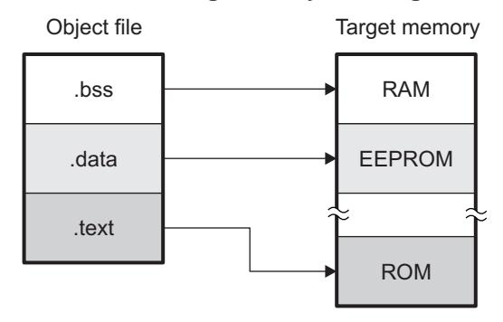

**Figure 2-1: Partitioning Memory Into Logical Blocks.** Diagram showing three sections of an object file (.bss, .data, .text, stacked top to bottom) mapped by arrows to three regions of target memory (RAM, EEPROM, ROM respectively). The .bss section maps to RAM, .data maps to EEPROM, and .text maps to ROM.

### 2.3.1 Special Section Names

You can use the .sect and .usect directives to create any section name you like, but certain sections are treated in a special manner by the linker and the compiler's run-time support library. If you create a section with the same name as a special section, you should take care to follow the rules for that special section.

A few common special sections are:

- .text -- Used for program code.
- .bss -- Used for uninitialized objects (global variables).
- .data -- Used for initialized non-const objects (global variables).
- .const -- Used for initialized const objects (string constants, variables declared const).
- .cinit -- Used to initialize C global variables at startup.
- .stack -- Used for the function call stack.
- .sysmem - Used for the dynamic memory allocation pool.

For more information on sections, see the "Specifying Where to Allocate Sections in Memory" section of the *PRU Optimizing C/C++ Compiler User's Guide*.

## 2.4 How the Assembler Handles Sections

The assembler identifies the portions of an assembly language program that belong in a given section. The assembler has the following directives that support this function:

- .bss
- .data
- .sect
- .text
- .usect

The .bss and .usect directives create *uninitialized sections*; the .text, .data, and .sect directives create *initialized sections*.

You can create subsections of any section to give you tighter control of the memory map. Subsections are created using the .sect and .usect directives. Subsections are identified with the base section name and a subsection name separated by a colon; see Section 2.4.6.

#### Default Sections Directive

**NOTE:** If you do not use any of the sections directives, the assembler assembles everything into the .text section.

### 2.4.1 Uninitialized Sections

Uninitialized sections reserve space in PRU memory; they are usually placed in RAM. These sections have no actual contents in the object file; they simply reserve memory. A program can use this space at run time for creating and storing variables.

Uninitialized data areas are built by using the following assembler directives.

- The .bss directive reserves space in the .bss section.
- The .usect directive reserves space in a specific uninitialized user-named section.

Each time you invoke the .bss or .usect directive, the assembler reserves additional space in the .bss or the user-named section. The syntax is:

|        | .bss symbol, size in bytes[, alignment [, bank offset] ]          |
|--------|-------------------------------------------------------------------|
| symbol | .usect "section name", size in bytes[, alignment[, bank offset] ] |
|        |                                                                   |

| symbol        | points to the first byte reserved by this invocation of the .bss or .usect directive. The<br>symbol corresponds to the name of the variable that you are reserving space for. It can<br>be referenced by any other section and can also be declared as a global symbol (with<br>the .global directive). |
|---------------|---------------------------------------------------------------------------------------------------------------------------------------------------------------------------------------------------------------------------------------------------------------------------------------------------------|
| size in bytes | is an absolute expression (see Section 4.8). The .bss directive reserves size in bytes<br>bytes in the .bss section. The .usect directive reserves size in bytes bytes in section<br>name. For both directives, you must specify a size; there is no default value.                                     |
| alignment     | is an optional parameter. It specifies the minimum alignment in bytes required by the<br>space allocated. The default value is byte aligned; this option is represented by the<br>value 1. The value must be a power of 2.                                                                              |
| bank offset   | is an optional parameter. It ensures that the space allocated to the symbol occurs on a<br>specific memory bank boundary. The bank offset measures the number of bytes to<br>offset from the alignment specified before assigning the symbol to that location.                                          |
| section name  | specifies the user-named section in which to reserve space. See Section 2.4.3.                                                                                                                                                                                                                          |

Initialized section directives (.text, .data, and .sect) change which section is considered the *current* section (see Section 2.4.2). However, the .bss and .usect directives *do not* change the current section; they simply escape from the current section temporarily. Immediately after a .bss or .usect directive, the assembler resumes assembling into whatever the current section was before the directive. The .bss and .usect directives can appear anywhere in an initialized section without affecting its contents.

The .usect directive can also be used to create uninitialized subsections. See Section 2.4.6 for more information on creating subsections.

### 2.4.2 Initialized Sections

Initialized sections contain executable code or initialized data. The contents of these sections are stored in the object file and placed in PRU memory when the program is loaded. Each initialized section is independently relocatable and may reference symbols that are defined in other sections. The linker automatically resolves these references. The following directives tell the assembler to place code or data into a section. The syntaxes for these directives are:

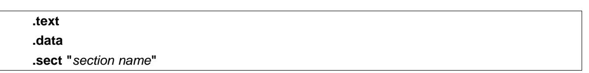

**Initialized sections syntax.** Code syntax box showing the three directives that create initialized sections: `.text`, `.data`, and `.sect "section name"`.

The .sect directive can also be used to create initialized subsections. See Section 2.4.6, for more information on creating subsections.

### 2.4.3 User-Named Sections

User-named sections are sections that *you* create. You can use them like the default .text, .data, and .bss sections, but each section with a distinct name is kept distinct during assembly.

For example, repeated use of the .text directive builds up a single .text section in the object file. This .text section is allocated in memory as a single unit. Suppose there is a portion of executable code (perhaps an initialization routine) that you want the linker to place in a different location than the rest of .text. If you assemble this segment of code into a user-named section, it is assembled separately from .text, and you can use the linker to allocate it into memory separately. You can also assemble initialized data that is separate from the .data section, and you can reserve space for uninitialized variables that is separate from the .bss section.

These directives let you create user-named sections:

- The **.usect** directive creates uninitialized sections that are used like the .bss section. These sections reserve space in RAM for variables.
- The **.sect** directive creates initialized sections, like the default .text and .data sections, that can contain code or data. The .sect directive creates user-named sections with relocatable addresses.

The syntaxes for these directives are:

```
symbol .usect "section name", size in bytes[, alignment[, bank offset]]
           .sect "section name"
```

The maximum number of sections is 2<sup>32</sup>-1 (4294967295).

The *section name* parameter is the name of the section. For the .usect and .sect directives, a section name can refer to a subsection; see Section 2.4.6 for details.

Each time you invoke one of these directives with a new name, you create a new user-named section. Each time you invoke one of these directives with a name that was already used, the assembler resumes assembling code or data (or reserves space) into the section with that name. *You cannot use the same names with different directives*. That is, you cannot create a section with the .usect directive and then try to use the same section with .sect.

### 2.4.4 Current Section

The assembler adds code or data to one section at a time. The section the assembler is currently filling is the *current section*. The .text, .data, and .sect directives change which section is considered the current section. When the assembler encounters one of these directives, it stops assembling into the current section (acting as an implied end of current section command). The assembler sets the designated section as the current section and assembles subsequent code into the designated section until it encounters another .text, .data, or .sect directive.

If one of these directives sets the current section to a section that already has code or data in it from earlier in the file, the assembler resumes adding to the end of that section. The assembler generates only one contiguous section for each given section name. This section is formed by concatenating all of the code or data which was placed in that section.

### 2.4.5 Section Program Counters

The assembler maintains a separate program counter for each section. These program counters are known as *section program counters*, or *SPCs*.

An SPC represents the current address within a section of code or data. Initially, the assembler sets each SPC to 0. As the assembler fills a section with code or data, it increments the appropriate SPC. If you resume assembling into a section, the assembler remembers the appropriate SPC's previous value and continues incrementing the SPC from that value.

The assembler treats each section as if it began at address 0; the linker relocates the symbols in each section according to the final address of the section in which that symbol is defined. See Section 2.7 for information on relocation.

### 2.4.6 Subsections

A subsection is created by creating a section with a colon in its name. Subsections are logical subdivisions of larger sections. Subsections are themselves sections and can be manipulated by the assembler and linker.

The assembler has no concept of subsections; to the assembler, the colon in the name is not special. The subsection .text:rts would be considered completely unrelated to its parent section .text, and the assembler will not combine subsections with their parent sections.

Subsections are used to keep parts of a section as distinct sections so that they can be separately manipulated. For instance, by placing each function and object in a uniquely-named subsection, the linker gets a finer-grained view of the section for memory placement and unused-function elimination.

By default, when the linker sees a SECTION directive in the linker command file like ".text", it will gather .text and all subsections of .text into one large output section named ".text". You can instead use the SECTION directive to control the subsection independently. See Section 8.5.5.1 for an example.

You can create subsections in the same way you create other user-named sections: by using the .sect or .usect directive.

The syntaxes for a subsection name are:

```
symbol .usect "section_name:subsection_name",size in bytes[, alignment[, bank offset] ]
          .sect "section_name:subsection_name"
```

A subsection is identified by the base section name followed by a colon and the name of the subsection. The subsection name may not contain any spaces.

A subsection can be allocated separately or grouped with other sections using the same base name. For example, you create a subsection called \_func within the .text section:

```
.sect ".text:_func"
```

Using the linker's SECTIONS directive, you can allocate .text:\_func separately, or with all the .text sections.

You can create two types of subsections:

- Initialized subsections are created using the .sect directive. See Section 2.4.2.
- Uninitialized subsections are created using the .usect directive. See Section 2.4.1.

Subsections are placed in the same manner as sections. See Section 8.5.5 for information on the SECTIONS directive.

### 2.4.7 Using Sections Directives

Figure 2-2 shows how you can build sections incrementally, using the sections directives to swap back and forth between the different sections. You can use sections directives to begin assembling into a section for the first time, or to continue assembling into a section that already contains code. In the latter case, the assembler simply appends the new code to the code that is already in the section.

The format in Figure 2-2 is a listing file. Figure 2-2 shows how the SPCs are modified during assembly. A line in a listing file has four fields:

- **Field 1** contains the source code line counter.
- **Field 2** contains the section program counter.
- **Field 3** contains the object code.
- **Field 4** contains the original source statement.

See Section 4.10 for more information on interpreting the fields in a source listing.

**Figure 2-2. Using Sections Directives Example**

As Figure 2-3 shows, the file in Figure 2-2 creates the following sections:

| | |
|---|---|
| **.text** | contains six 32-bit words of object code. |
| **.data** | contains seven words of initialized data. |
| **.bss** | reserves ten bytes in memory. |
| **newvars** | is a user-named section created with the .usect directive; it reserves eight bytes in memory. |

The second column shows the object code that is assembled into these sections; the first column shows the source statements that generated the object code.

**Figure 2-3. Object Code Generated by the File in Figure 2-2**

| Line numbers                        | Object code                                                                      | Section |
|-------------------------------------|----------------------------------------------------------------------------------|---------|
| 19<br>20<br>21<br>36<br>37<br>38    | 2404D2E1<br>0501E1E1<br>6F00E1FF<br>240D80E3<br>0501E3E3<br>6F00E3FF             | .text   |
| 5<br>5<br>5<br>14<br>26<br>26<br>26 | 00000011<br>00000022<br>00000033<br>00000123<br>000000AA<br>000000BB<br>000000CC | .data   |
| 10                                  | No data -<br>ten bytes<br>reserved                                               | .bss    |
| 30<br>31                            | No data -<br>eight bytes<br>reserved                                             | newvars |

## 2.5 How the Linker Handles Sections

The linker has two main functions related to sections. First, the linker uses the sections in object files as building blocks; it combines input sections to create output sections in an executable output module. Second, the linker chooses memory addresses for the output sections; this is called *placement*. Two linker directives support these functions:

- The *MEMORY* directive allows you to define the memory map of a target system. You can name portions of memory and specify their starting addresses and their lengths.
- The *SECTIONS* directive tells the linker how to combine input sections into output sections and where to place these output sections in memory.

Subsections let you manipulate the placement of sections with greater precision. You can specify the location of each subsection with the linker's SECTIONS directive. If you do not specify a subsection, the subsection is combined with the other sections with the same base section name. See Section 8.5.5.1.

It is not always necessary to use linker directives. If you do not use them, the linker uses the target processor's default placement algorithm described in Section 8.7. When you *do* use linker directives, you must specify them in a linker command file.

Refer to the following sections for more information about linker command files and linker directives:

- Section 8.5, *Linker Command Files*
- Section 8.5.4, *The MEMORY Directive*
- Section 8.5.5, *The SECTIONS Directive*
- Section 8.7, *Default Placement Algorithm*

### 2.5.1 Combining Input Sections

Figure 2-4 provides a simplified example of the process of linking two files together.

Note that this is a simplified example, so it does not show all the sections that will be created or the actual sequence of the sections. See Section 8.7 for the actual default memory placement map for PRU.

**Figure 2-4. Combining Input Sections to Form an Executable Object Module**

In Figure 2-4, file1.obj and file2.obj have been assembled to be used as linker input. Each contains the .text, .data, and .bss default sections; in addition, each contains a user-named section. The executable object module shows the combined sections. The linker combines the .text section from file1.obj and the .text section from file2.obj to form one .text section, then combines the two .data sections and the two .bss sections, and finally places the user-named sections at the end. The memory map shows the combined sections to be placed into memory.

### 2.5.2 Placing Sections

Figure 2-4 illustrates the linker's default method for combining sections. Sometimes you may not want to use the default setup. For example, you may not want all of the .text sections to be combined into a single .text section. Or you may want a user-named section placed where the .data section would normally be allocated. Most memory maps contain various types of memory (RAM, ROM, EPROM, FLASH, etc.) in varying amounts; you may want to place a section in a specific type of memory.

For further explanation of section placement within the memory map, see the discussions in Section 8.5.4 and Section 8.5.5. See Section 8.7 for the actual default memory allocation map for PRU.

## 2.6 Symbols

An object file contains a symbol table that stores information about *external symbols* in the object file. The linker uses this table when it performs relocation. See Section 2.7.

An object file symbol is a named 32-bit integer value, usually representing an address. A symbol can represent such things as the starting address of a function, variable, or section.

An object file symbol can also represent an absolute integer, such as the size of the stack. To the linker, this integer is an unsigned value, but the integer may be treated as signed or unsigned depending on how it is used. The range of legal values for an absolute integer is 0 to 2^32-1 for unsigned treatment and -2^31 to 2^31-1 for signed treatment.

Symbols can be bound as *global symbols*, *local symbols*, or *weak symbols*. The linker handles symbols differently based on their binding. For example, the linker does not allow multiple global definitions of a symbol, but local symbols can be defined in multiple object files (but only once per object file). The linker does not resolve references to local symbols in different object files, but it does resolve references to global symbols in any other object file.

A *global symbol* is defined in the same manner as any other symbol; that is, it appears as a label or is defined by a directive, such as .set, .equ, .bss, or .usect. If a global symbol is defined more than once, the linker issues a multiple-definition error. (The assembler can provide a similar multiple-definition error for local symbols.)

A *weak symbol* is a symbol that is used in the current module but is defined in another module. The linker resolves this symbol's definition at link time. Weak symbols are similar to global symbols, except that if one object file contains a weak symbol, and another object file contains a global symbol with the same name, the global symbol is used to resolve references. A weak reference may be unresolved at link time, in which case the address is treated as 0. Therefore, for weak references, application code must test to make sure &var is not zero before attempting to read the contents. See Section 2.6.2 for more about weak symbols.

In general, common symbols (see .common directive) are preferred over weak symbols.

See Section 4.7 for information about assembler symbols.

### 2.6.1 External Symbols

External symbols are symbols that are visible to other object modules. Because they are visible across object modules, they may be defined in one file and referenced in another file. You can use the .def, .ref, or .global directive to identify a symbol as external:

| | |
|---|---|
| **.def** | The symbol is defined in the current file and may be used in another file. |
| **.ref** | The symbol is referenced in the current file, but defined in another file. |
| **.global** | The symbol can be either of the above. The assembler chooses either .def or .ref as appropriate for each symbol. |

The following code fragments illustrate the use of the .global directive.

```
x: .word y
    .global x ; acts as .def of x
    .global y ; acts as .ref of y
```

Because x is defined in this module, the assembler treats ".global x" as ".def x", and other modules can refer to x. Because y is not defined in this module, the assembler treats ".global y" as ".ref y". The symbol y must be defined in another module.

Both the symbols x and y are external symbols and are placed in the object file's symbol table; x as a defined symbol, and y as an undefined symbol. When the object file is linked with other object files, the entry for x will be used to resolve references to x in other files. The entry for y causes the linker to look through the symbol tables of other files for y's definition.

The linker attempts to match all references with corresponding definitions. If the linker cannot find a symbol's definition, it prints an error message about the unresolved reference. This type of error prevents the linker from creating an executable object module.

An error also occurs if the same symbol is defined more than once.

### 2.6.2 Weak Symbols

The linker processes absolute symbols that are defined with "weak" binding differently from absolute symbols that are defined with global binding (the default). Instead of including a weak absolute symbol in the output file's symbol table by default (as it would for a global absolute symbol), the linker only includes a weak absolute symbol in the output of a "final" link if the symbol is required to resolve an otherwise unresolved reference.

This weak symbol handling allows you to associate addresses with symbols known to have been preloaded (such as function addresses in system memory) and then link the current application against a preloaded memory image. If such symbols are defined as weak absolute symbols, the linker can minimize the number of symbols it includes in the output file's symbol table by omitting those that are not needed to resolve references. Reducing the size of the output file's symbol table reduces the time required to link, especially if there are a large number of pre-loaded symbols to link against. This feature is particularly helpful for OpenCL applications.

You can define a weak absolute symbol using either assembly or the linker command file.

**Using Assembly:** To define a weak absolute symbol in an input object file, the source file can be written in assembly. Use the .weak and .set directives in combination as shown in the following example, which defines a weak absolute symbol "ext\_addr\_sym":

```
.weak ext_addr_sym
ext_addr_sym .set 0x12345678
```

Assemble the source file that defines weak symbols, and include the resulting object file in the link. The "ext\_addr\_sym" in this example is available as a weak absolute symbol in a final link. It is a candidate for removal if the symbol is not referenced elsewhere in the application. See .weak directive.

**Using the Linker Command File:** To define a weak symbol in a linker command file, use the "weak" operator in an assignment expression to designate that the symbol as eligible for removal from the output file's symbol table if it is not referenced. In a linker command file, an assignment expression outside a MEMORY or SECTIONS directive can be used to define a weak linker-defined absolute symbol. For example, you can define "ext\_addr\_sym" as follows:

```
weak(ext_addr_sym) = 0x12345678;
```

If the linker command file is used to perform the final link, then "ext\_addr\_sym" is presented to the linker as a weak absolute symbol; it will not be included in the resulting output file if the symbol is not referenced. See Section 8.6.2.

If there are multiple definitions of the same absolute symbol, the linker uses certain rules to determine which definition takes precedence. Some definitions may have weak binding and others may have strong binding. "Strong" in this context means that the symbol has *not* been given a weak binding by either of the two methods described above. Some definitions may come from an input object file (that is, using assembly directives) and others may come from an assignment statement in a linker command file.

The linker uses the following guidelines to determine which definition is used when resolving references to a symbol:

- A strongly bound symbol always takes precedence over a weakly bound symbol.
- If two symbols are both strongly bound or both weakly bound, a symbol defined in a linker command file takes precedence over a symbol defined in an input object file.
- If two symbols are both strongly bound and both are defined in an input object file, the linker provides a symbol redefinition error and halts the link process.

### 2.6.3 The Symbol Table

The assembler generates an entry in the symbol table for each .ref, .def, or .global directive in Section 2.6.1. These are external symbols, which are visible to other object modules.

The assembler also creates special symbols that point to the beginning of each section.

The assembler does not usually create symbol table entries for any symbols other than those described above, because the linker does not use them. For example, labels \(Section 4.7.2) are not included in the symbol table unless they are declared with the .global directive. For informational purposes, there are entries in the symbol table for each symbol in a program.

## 2.7 Symbolic Relocations

The assembler treats each section as if it began at address 0. Of course, all sections cannot actually begin at address 0 in memory, so the linker must relocate sections. Relocations are symbol-relative rather than section-relative.

The linker can *relocate* sections by:

- Allocating them into the memory map so that they begin at the appropriate address as defined with the linker's MEMORY directive
- Adjusting symbol values to correspond to the new section addresses
- Adjusting references to relocated symbols to reflect the adjusted symbol values

The linker uses *relocation entries* to adjust references to symbol values. The assembler creates a relocation entry each time a relocatable symbol is referenced. The linker then uses these entries to patch the references after the symbols are relocated. Example 2-1 contains a code fragment for a PRU device for which the assembler generates relocation entries.

### Example 2-1. Code That Generates Relocation Entries

```
1 *********************************************
2 ** Generating Relocation Entries **
3 *********************************************
4 .ref X
5 .def Y
6 00000000 .text
7 00000000 E0921003 ADDS R1, R2, R3
8 00000004 0A000001 BEQ Y
9 00000008 E1C410BE STRH R1, [R4, #14]
10 0000000c EAFFFFFB! B X ; generates a relocation entry
11 00000010 E0821003 Y: ADD R1, R2, R3
```

The relocation generated for 'Y' would actually refer to the symbol 'Y' and resolve the value for 'Y' in the opcode based on where the definition of 'Y' ends up.

## 2.8 Loading a Program

The linker creates an executable object file which can be loaded in several ways, depending on your execution environment. These methods include using Code Composer Studio or the hex conversion utility. For details, see Section 3.1.

# 3 Program Loading and Running

Even after a program is written, compiled, and linked into an executable object file, there are still many tasks that need to be performed before the program does its job. The program must be loaded onto the target, memory and registers must be initialized, and the program must be set to running.

Some of these tasks need to be built into the program itself. *Bootstrapping* is the process of a program performing some of its own initialization. Many of the necessary tasks are handled for you by the compiler and linker, but if you need more control over these tasks, it helps to understand how the pieces are expected to fit together.

This chapter will introduce you to the concepts involved in program loading, initialization, and startup.

This chapter does not cover *dynamic loading*.

This chapter currently provides examples for the C6000 device family. Refer to your device documentation for various device-specific aspects of bootstrapping.

**Topic** ........................................................................................................................... **Page**

| 3.1 | Loading                 | 29 |
|-----|-------------------------|----|
| 3.2 | Entry Point             | 34 |
| 3.3 | Run-Time Initialization | 34 |
| 3.4 | Arguments to main       | 37 |
| 3.5 | Run-Time Relocation     | 37 |
| 3.6 | Additional Information  | 38 |
|     |                         |    |

## 3.1 Loading

A program needs to be placed into the target device's memory before it may be executed. *Loading* is the process of preparing a program for execution by initializing device memory with the program's code and data. A *loader* might be another program on the device, an external agent (for example, a debugger), or the device might initialize itself after power-on, which is known as *bootstrap loading*, or *bootloading*.

The loader is responsible for constructing the *load image* in memory before the program starts. The load image is the program's code and data in memory before execution. What exactly constitutes loading depends on the environment, such as whether an operating system is present. This section describes several loading schemes for bare-metal devices. This section is not exhaustive.

A program may be loaded in the following ways:

- **A debugger running on a connected host workstation.** In a typical embedded development setup, the device is subordinate to a host running a debugger such as Code Composer Studio (CCS). The device is connected with a communication channel such as a JTAG interface. CCS reads the program and writes the load image directly to target memory through the communications interface.
- **Another program running on the device.** The running program can create the load image and transfer control to the loaded program. If an operating system is present, it may have the ability to load and run programs.
- **"Burning" the load image onto an EPROM module.** The hex converter (hexpru) can assist with this by converting the executable object file into a format suitable for input to an EPROM programmer. The EPROM is placed onto the device itself and becomes a part of the device's memory. See Chapter 12 for details.
- **Bootstrap loading from a dedicated peripheral, such as an I <sup>2</sup>C peripheral.** The device may require a small program called a bootloader to perform the loading from the peripheral. The hex converter can assist in creating a bootloader.

### 3.1.1 Load and Run Addresses

Consider an embedded device for which the program's load image is burned onto EPROM/ROM. Variable data in the program must be writable, and so must be located in writable memory, typically RAM. However, RAM is *volatile*, meaning it will lose its contents when the power goes out. If this data must have an initial value, that initial value must be stored somewhere else in the load image, or it would be lost when power is cycled. The initial value must be copied from the non-volatile ROM to its run-time location in RAM before it is used. See Section 8.8 for ways this is done.

The *load address* is the location of an object in the load image.

The *run address* is the location of the object as it exists during program execution.

An *object* is a chunk of memory. It represents a section, segment, function, or data.

*The load and run addresses for an object may be the same.* This is commonly the case for program code and read-only data, such as the .const section. In this case, the program can read the data directly from the load address. Sections that have no initial value, such as the .bss section, do not have load data and are considered to have load and run addresses that are the same. If you specify different load and run addresses for an uninitialized section, the linker provides a warning and ignores the load address.

*The load and run addresses for an object may be different.* This is commonly the case for writable data, such as the .data section. The .data section's starting contents are placed in ROM and copied to RAM. This often occurs during program startup, but depending on the needs of the object, it may be deferred to sometime later in the program as described in Section 3.5.

Symbols in assembly code and object files almost always refer to the run address. When you look at an address in the program, you are almost always looking at the run address. The load address is rarely used for anything but initialization.

The load and run addresses for a section are controlled by the linker command file and are recorded in the object file metadata.

The load address determines where a loader places the raw data for the section. Any references to the section (such as references to labels in it) refer to its run address. The application must copy the section from its load address to its run address before the first reference of the symbol is encountered at run time; this does *not* happen automatically simply because you specify a separate run address. For examples that specify load and run addresses, see Section 8.5.6.1.

ELF format executable object files contain *segments*. See Section 2.3 for information about sections and segments.

### 3.1.2 Bootstrap Loading

The details of bootstrap loading (bootloading) vary a great deal between devices. Not every device supports every bootloading mode, and using the bootloader is optional. This section discusses various bootloading schemes to help you understand how they work. Refer to your device's data sheet to see which bootloading schemes are available and how to use them.

A typical embedded system uses bootloading to initialize the device. The program code and data may be stored in ROM or FLASH memory. At power-on, an on-chip bootloader (the *primary bootloader*) built into the device hardware starts automatically.

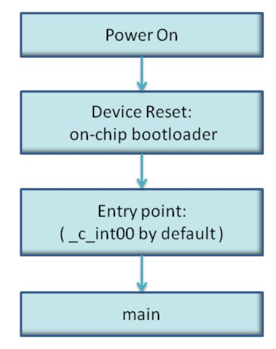

**Figure 3-1. Bootloading Sequence (Simplified).** Flowchart showing the four-step simplified bootloading sequence: Power On → Device Reset (on-chip bootloader) → Entry point (_c_int00 by default) → main, connected by downward arrows.

The primary bootloader is typically very small and copies a limited amount of memory from a dedicated location in ROM to a dedicated location in RAM. (Some bootloaders support copying the program from an I/O peripheral.) After the copy is completed, it transfers control to the program.

For many programs, the primary bootloader is not capable of loading the entire program, so these programs supply a more capable secondary bootloader. The primary bootloader loads the secondary bootloader and transfers control to it. Then, the secondary bootloader loads the rest of the program and transfers control to it. There can be any number of layers of bootloaders, each loading a more capable bootloader to which it transfers control.

**Figure 3-2. Bootloading Sequence with Secondary Bootloader**

#### 3.1.2.1 Boot, Load, and Run Addresses

The *boot address* of a bootloaded object is where its raw data exists in ROM before power-on.

The boot, load, and run addresses for an object may all be the same; this is commonly the case for .const data. If they are different, the object's contents must be copied to the correct location before the object may be used.

The boot address may be different than the load address. The bootloader is responsible for copying the raw data to the load address.

The boot address is not controlled by the linker command file or recorded in the object file; it is strictly a convention shared by the bootloader and the program.

#### 3.1.2.2 Primary Bootloader

The detailed operation of the primary bootloader is device-specific. Some devices have complex capabilities such as booting from an I/O peripheral or configuring memory controller parameters.

#### 3.1.2.3 Secondary Bootloader

The hex converter assumes the secondary bootloader is of a particular format. The hex converter's model bootloader uses a *boot table*. You can use whatever format you want, but if you follow this model, the hex converter can create the boot table automatically.

#### 3.1.2.4 Boot Table

The input for the model secondary bootloader is the *boot table*. The boot table contains records that instruct the secondary bootloader to copy blocks of data contained in the table to specified destination addresses. The hex conversion utility automatically builds the boot table for the secondary bootloader. Using the utility, you specify the sections you want to initialize, the boot table location, and the name of the section containing the secondary bootloader routine and where it should be located. The hex conversion utility builds a complete image of the table and adds it to the program.

The boot table is target-specific. For C6000, the format of the boot table is simple. A header record contains a 4-byte field that indicates where the boot loader should branch after it has completed copying data. After the header, each section that is to be included in the boot table has the following contents:

- 4-byte field containing the size of the section
- 4-byte field containing the destination address for the copy
- the raw data
- 0 to 3 bytes of trailing padding to make the next field aligned to 4 bytes

More than one section can be entered; a termination block containing an all-zero 4-byte field follows the last section.

#### 3.1.2.5 Bootloader Routine

The bootloader routine is a normal function, except that it executes before the C environment is set up. For this reason, it can't use the C stack, and it can't call any functions that have yet to be loaded!

The following sample code is for C6000 and is from *Creating a Second-Level Bootloader for FLASH Bootloading on TMS320C6000 Platform With Code Composer Studio* [\(SPRA999\)](http://www.ti.com/lit/pdf/SPRA999).

#### Example 3-1. Sample Secondary Bootloader Routine

```
; ======== boot_c671x.s62 ========
; global EMIF symbols defined for the c671x family
           .include boot_c671x.h62
           .sect ".boot_load"
           .global _boot
_boot:
;************************************************************************
;* DEBUG LOOP − COMMENT OUT B FOR NORMAL OPERATION
;************************************************************************
zero B1
_myloop: ; [!B1] B _myloop
           nop 5
_myloopend: nop
;************************************************************************
;* CONFIGURE EMIF
;************************************************************************
       ;****************************************************************
       ; *EMIF_GCTL = EMIF_GCTL_V;
       ;****************************************************************
           mvkl EMIF_GCTL,A4
     || mvkl EMIF_GCTL_V,B4
           mvkh EMIF_GCTL,A4
     || mvkh EMIF_GCTL_V,B4
           stw B4,*A4
       ;****************************************************************
       ; *EMIF_CE0 = EMIF_CE0_V
       ;****************************************************************
           mvkl EMIF_CE0,A4
     || mvkl EMIF_CE0_V,B4
           mvkh EMIF_CE0,A4
     || mvkh EMIF_CE0_V,B4
           stw B4,*A4
```

#### Example 3-1. Sample Secondary Bootloader Routine (continued)

```
      ;****************************************************************
      ; *EMIF_CE1 = EMIF_CE1_V (setup for 8-bit async)
      ;****************************************************************
           mvkl  EMIF_CE1,A4
     ||    mvkl  EMIF_CE1_V,B4
           mvkh  EMIF_CE1,A4
     ||    mvkh  EMIF_CE1_V,B4
           stw   B4,*A4
      ;****************************************************************
      ; *EMIF_CE2 = EMIF_CE2_V (setup for 32-bit async)
      ;****************************************************************
           mvkl  EMIF_CE2,A4
     ||    mvkl  EMIF_CE2_V,B4
           mvkh  EMIF_CE2,A4
     ||    mvkh  EMIF_CE2_V,B4
           stw   B4,*A4
      ;****************************************************************
      ; *EMIF_CE3 = EMIF_CE3_V (setup for 32-bit async)
      ;****************************************************************
           mvkl  EMIF_CE3,A4
     ||    mvkl  EMIF_CE3_V,B4
           mvkh  EMIF_CE3,A4
     ||    mvkh  EMIF_CE3_V,B4
           stw   B4,*A4
      ;****************************************************************
      ; *EMIF_SDRAMCTL = EMIF_SDRAMCTL_V
      ;****************************************************************
     ||    mvkl  EMIF_SDRAMCTL,A4
     ||    mvkl  EMIF_SDRAMCTL_V,B4
           mvkh  EMIF_SDRAMCTL,A4
     ||    mvkh  EMIF_SDRAMCTL_V,B4
           stw   B4,*A4
      ;****************************************************************
      ; *EMIF_SDRAMTIM = EMIF_SDRAMTIM_V
      ;****************************************************************
           mvkl  EMIF_SDRAMTIM,A4
     ||    mvkl  EMIF_SDRAMTIM_V,B4
           mvkh  EMIF_SDRAMTIM,A4
     ||    mvkh  EMIF_SDRAMTIM_V,B4
           stw   B4,*A4
      ;****************************************************************
      ; *EMIF_SDRAMEXT = EMIF_SDRAMEXT_V
      ;****************************************************************
           mvkl  EMIF_SDRAMEXT,A4
     ||    mvkl  EMIF_SDRAMEXT_V,B4
           mvkh  EMIF_SDRAMEXT,A4
     ||    mvkh  EMIF_SDRAMEXT_V,B4
           stw   B4,*A4
;**********************************************************************
; copy sections
;**********************************************************************
           mvkl  COPY_TABLE, a3  ; load table pointer
           mvkh  COPY_TABLE, a3
           ldw   *a3++, b1       ; Load entry point
copy_section_top:
           ldw   *a3++, b0       ; byte count
           ldw   *a3++, a4       ; ram start address
           nop   3
[!b0]      b     copy_done       ; have we copied all sections?
           nop   5
copy_loop:
           ldb   *a3++,b5
           sub   b0,1,b0         ; decrement counter
[ b0]      b     copy_loop       ; setup branch if not done
```

#### Example 3-1. Sample Secondary Bootloader Routine (continued)

```
[!b0]      b     copy_section_top
           zero  a1
[!b0]      and   3,a3,a1
           stb   b5,*a4++
[!b0]      and   -4,a3,a5        ; round address up to next multiple of 4
[ a1]      add   4,a5,a3         ; round address up to next multiple of 4
;**********************************************************************
; jump to entry point
;**********************************************************************
copy_done:
           b     .S2 b1
           nop   5
```

## 3.2 Entry Point

The entry point is the address at which the execution of the program begins. This is the address of the startup routine. The startup routine is responsible for initializing and calling the rest of the program. For a C/C++ program, the startup routine is usually named \_c\_int00 (see Section 3.3.1). After the program is loaded, the value of the entry point is placed in the PC register and the CPU is allowed to run.

The object file has an entry point field. For a C/C++ program, the linker will fill in \_c\_int00 by default. You can select a custom entry point; see Section 8.4.12. The device itself cannot read the entry point field from the object file, so it has to be encoded in the program somewhere.

- If you are using a bootloader, the boot table includes an entry point field. When it finishes running, the bootloader branches to the entry point.
- If you are using a hosted debugger, such as CCS, the debugger may explicitly set the program counter (PC) to the value of the entry point.

## 3.3 Run-Time Initialization

After the load image is in place, the program can run. The subsections that follow describe bootstrap initialization of a C/C++ program. An assembly-only program may not need to perform all of these steps.

#### 3.3.1 The \_c\_int00 Function

The function \_c\_int00 is the *startup routine* (also called the *boot routine*) for C/C++ programs. It performs all the steps necessary for a C/C++ program to initialize itself.

The name \_c\_int00 means that it is the interrupt handler for interrupt number 0, RESET, and that it sets up the C environment. Its name need not be exactly \_c\_int00, but the linker sets \_c\_int00 as the entry point for C programs by default. The compiler's run-time-support library provides a default implementation of \_c\_int00.

The startup routine is responsible for performing the following actions:

1. Switch to user mode and sets up the user mode stack
2. Set up status and configuration registers
3. Set up the stack and secondary system stack
4. Process special binit copy table, if present.
5. Process the run-time initialization table to autoinitialize global variables (when using the --rom\_model option)
6. Call all global constructors
7. Call the function main
8. Call exit when main returns

### 3.3.2 Variable Initialization

Initialized read-write variables are collected into dedicated section(s) of the object file, for example .data. The section contains an image of its initial state upon program startup.

There are two models for loading such sections. In the *RAM model* (--ram\_model), an external agent such as a loader is responsible for getting the data from the executable file to its location in read-write memory. This is the typical direct-initialization model used in OS-based systems or, in some instances, boot-loaded systems.

The other model, called the *ROM model* (--rom\_model), is intended for bare-metal embedded systems that must be capable of cold starts without the support of an OS or other loader. Any data needed to initialize the program must reside in persistent offline storage (ROM), and get copied into its RAM location upon startup. The TI tools implement this by leveraging the copy table capability. The initialization mechanism is conceptually similar to copy tables, but differs slightly in the details.

Figure 3-3 shows the conceptual operation of variable initialization under the ROM model. In this model, the linker *removes* the data from sections that contain initialized variables. The sections become uninitialized sections, allocated into RAM at their run-time address (much like .bss). The linker encodes the initialization data into a special section called .cinit (for C Initialization), where the startup code from the run-time library decodes and copies it to its run address.

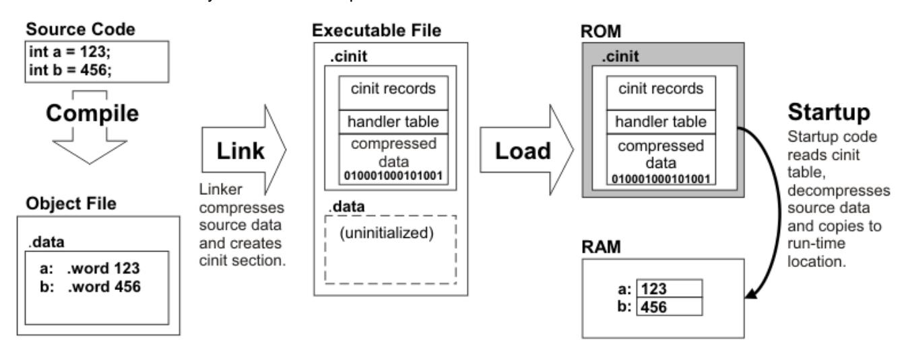

**Figure 3-3. ROM-Based Variable Initialization Via cinit.** Pipeline diagram illustrating the Compile → Link → Load → Startup flow for ROM-based variable initialization. Source code (int a=123; int b=456;) and an object file (.data section with a: .word 123, b: .word 456) are linked: the linker compresses the source data and creates a .cinit section (containing cinit records, handler table, and compressed data) while making .data uninitialized. After loading, .cinit resides in ROM. At startup, startup code reads the cinit table, decompresses the source data, and copies it to the RAM run-time locations (a: 123, b: 456).

Like copy tables, the source data in the .cinit tables may or may not be compressed. If it is compressed, the encoding and decoding scheme is identical to that of copy tables so that the handler tables and decompression handlers can be shared.

The .cinit section contains some or all of the following items:

- The **cinit table**, consisting of cinit records, which are similar to copy records.
- The **handler table**, consisting of pointers to decompression routines. The handler table and handlers are shared by initialization and copy tables.
- The **source data**, consisting of compressed or uncompressed data used to initialize variables.

These items may be in any order.

Figure 3-4 is a schematic depiction of the .cinit section.

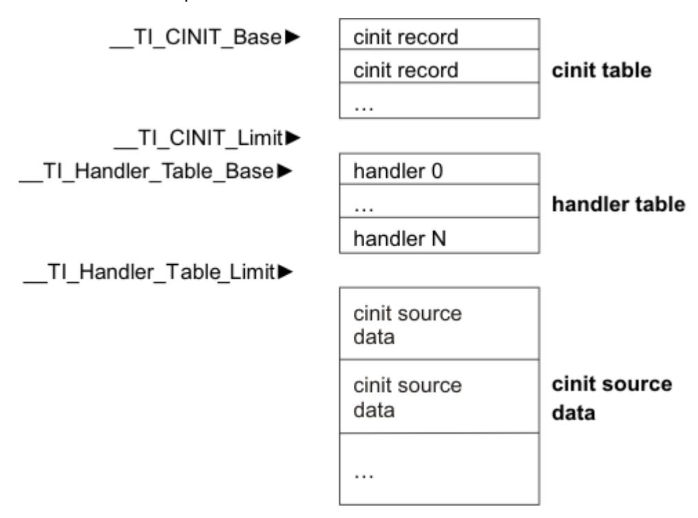

**Figure 3-4. The .cinit Section.** Schematic memory layout of the .cinit section. Four special symbols bound the three regions: __TI_CINIT_Base points to the start of the cinit table (containing cinit records); __TI_CINIT_Limit and __TI_Handler_Table_Base delimit the handler table (containing handler 0 through handler N); __TI_Handler_Table_Limit points to the start of the cinit source data region (containing one or more cinit source data blocks).

The .cinit section has the section type SHT\_TI\_INITINFO which identifies it as being in this format. Tools should rely on the section type and not on the name .cinit.

Two special symbols are defined to delimit the cinit table: \_ \_TI\_CINIT\_Base points to the cinit table, and \_ \_TI\_CINIT\_Limit points one byte past the end of the table. The startup code references the table using these symbols.

Records in the cinit table have the following format:

```
typedef struct
{
   uint32 source_data;
   uint32 dest;
} CINIT_RECORD;
```

- The **source\_data** field points to the source data in the cinit section.
- The **dest** field points to the destination address. Unlike copy table records, cinit records do not contain a size field; the size is always encoded in the source data.

The source data has the same format as compressed copy table source data, and the handlers have the same interface. In addition to the RLE and LZSS formats, there are two additional formats defined for cinit records: uncompressed, and zero-initialized.

• The explicit **uncompressed** format is required because unlike a copy table record, there is no overloaded size field in a cinit record. The size field is always encoded into the source data, even when no compression is used. The encoding is as follows:

| handler index | padding | size    | data       |
|---------------|---------|---------|------------|
| 1 byte        | 3 bytes | 4 bytes | size bytes |

The encoded data includes a size field, which is aligned on the next 4-byte boundary following the handler index. The size field specifies how many bytes are in the data payload, which begins immediately following the size field. The initialization operation copies *size* bytes from the data field to

the destination address. The TI run-time library contains a handler called \_ \_TI\_decompress\_none for the uncompressed format.

• The **zero-initialization** format is a compact format used for the common case of variables whose initial value is zero. The encoding is as follows:

| handler index | padding | size    |
|---------------|---------|---------|
| 1 byte        | 3 bytes | 4 bytes |

The size field is aligned on the next 4-byte boundary following the handler index. The initialization operation fills *size* consecutive bytes at the destination address with zero. The TI run-time library contains a handler called \_ \_TI\_zero\_init for this format.

As an optimization, the linker is free to coalesce initializations of adjacent objects into single cinit records if they can be profitably encoded using the same format. This is typically significant for zeroinitialized objects.

### 3.3.3 Copy Tables

The RTS function copy\_in can be used at run-time to move code and data around, usually from its load address to its run address. This function reads size and location information from copy tables. The linker automatically generates several kinds of copy tables. Refer to Section 8.8.

You can create and control code overlays with copy tables. See Section 8.8.4 for details and examples.

Using copy tables is similar to performing run-time relocations as described in Section 3.5, however copy tables require a specific table format.

#### 3.3.3.1 BINIT

The BINIT (boot-time initialization) copy table is special in that the target will automatically perform the copying at auto-initialization time. Refer to Section 8.8.4.2 for more about the BINIT copy table name. The BINIT copy table is copied before .cinit processing.

#### 3.3.3.2 CINIT

EABI .cinit tables are special kinds of copy tables. Refer to Section 3.3.2 for information about using the .cinit section with the ROM model for variable initialization.

## 3.4 Arguments to main

Some programs expect arguments to main (argc, argv) to be valid. Normally this isn't possible for an embedded program, but the TI runtime does provide a way to do it. The user must allocate an .args section of an appropriate size using the --args linker option. It is the responsibility of the loader to populate the .args section. It is not specified how the loader determines which arguments to pass to the target. The format of the arguments is the same as an array of pointers to char on the target.

See Section 8.4.4 for information about allocating memory for argument passing.

## 3.5 Run-Time Relocation

At times you may want to load code into one area of memory and move it to another area before running it. For example, you may have performance-critical code in an external-memory-based system. The code must be loaded into external memory, but it would run faster in internal memory. Because internal memory is limited, you might swap in different speed-critical functions at different times.

The linker provides a way to handle this. Using the SECTIONS directive, you can optionally direct the linker to allocate a section twice: first to set its load address and again to set its run address. Use the *load* keyword for the load address and the *run* keyword for the run address. See Section 3.1.1 for more about load and run addresses. If a section is assigned two addresses at link time, all labels defined in the section are relocated to refer to the run-time address so that references to the section (such as branches) are correct when the code runs.

If you provide only one allocation (either load or run) for a section, the section is allocated only once and loads and runs at the same address. If you provide both allocations, the section is actually allocated as if it were two separate sections of the same size.

Uninitialized sections (such as .bss) are not loaded, so the only significant address is the run address. The linker allocates uninitialized sections only once; if you specify both run and load addresses, the linker warns you and ignores the load address.

For a complete description of run-time relocation, see Section 8.5.6.

## 3.6 Additional Information

See the following sections and documents for additional information:

Section 8.4.4, "Allocate Memory for Use by the Loader to Pass Arguments (--arg\_size Option)"

Section 8.4.12, "Define an Entry Point (--entry\_point Option)"

Section 8.5.6.1 ,"Specifying Load and Run Addresses"

Section 8.8, "Linker-Generated Copy Tables"

Section 8.10.1, "Run-Time Initialization"

Chapter 12, "Hex Conversion Utility Description"

"Run-Time Initialization" and "System Initialization" sections in the *PRU Optimizing C/C++ Compiler User's Guide*

*Creating a Second-Level Bootloader for FLASH Bootloading on TMS320C6000 Platform With Code Composer Studio* ([SPRA999\)](http://www.ti.com/lit/pdf/SPRA999).

# 4 Assembler Description

The PRU assembler translates assembly language source files into machine language object files. These files are object modules, which are discussed in Chapter 2. Source files can contain the following assembly language elements:

Assembler directives
    described in Chapter 5

Macro directives
    described in Chapter 6

Assembly language instructions
    described in the *PRU Family User's Guide*.

**Topic** ........................................................................................................................... **Page**

| 4.1  | Assembler Overview                                    | 40 |
|------|-------------------------------------------------------|----|
| 4.2  | The Assembler's Role in the Software Development Flow | 41 |
| 4.3  | Invoking the Assembler                                | 42 |
| 4.4  | Naming Alternate Directories for Assembler Input      | 43 |
| 4.5  | Source Statement Format                               | 45 |
| 4.6  | Literal Constants                                     | 47 |
| 4.7  | Assembler Symbols                                     | 49 |
| 4.8  | Expressions                                           | 54 |
| 4.9  | Built-in Functions and Operators                      | 58 |
| 4.10 | Source Listings                                       | 59 |
| 4.11 | Debugging Assembly Source                             | 61 |
| 4.12 | Cross-Reference Listings                              | 62 |

## 4.1 Assembler Overview

The 2-pass assembler does the following:

- Processes the source statements in a text file to produce a relocatable object file
- Produces a source listing (if requested) and provides you with control over this listing
- Allows you to divide your code into sections and maintain a section program counter (SPC) for each section of object code
- Defines and references global symbols and appends a cross-reference listing to the source listing (if requested)
- Allows conditional assembly
- Supports macros, allowing you to define macros inline or in a library

## 4.2 The Assembler's Role in the Software Development Flow

Figure 4-1 illustrates the assembler's role in the software development flow. The shaded portion highlights the most common assembler development path. The assembler accepts assembly language source files as input, both those you create and those created by the PRU C/C++ compiler.

**Figure 4-1. The Assembler in the PRU Software Development Flow.** Flow diagram showing the PRU software development tools. The shaded central path shows: C/C++ source files → C/C++ compiler → Assembler source → Assembler → Object files → Linker → Executable object file. Macro source files and macro library (via Archiver) feed into the Assembler. Object files also feed into another Archiver to produce a library of object files for the Linker. A Run-time-support library (via Library-build utility) also feeds the Linker. C/C++ name demangling utility connects to Assembler source. Debugging tools connect to the Executable object file. The Executable object file feeds downstream tools: Hex-conversion utility → EPROM programmer; Absolute lister; Cross-reference lister; Object file utilities; and the PRU target device.

## 4.3 Invoking the Assembler

To invoke the assembler, enter the following:

```
clpru input file [options]
```

**clpru** is the command that invokes the assembler through the compiler. The compiler considers any file with an .asm extension to be an assembly file and invokes the assembler.

*input file* names the assembly language source file.

*options* identify the assembler options that you want to use. Options are case sensitive and can appear anywhere on the command line following the command. Precede each option with one or two hyphens as shown.

The valid assembler options are listed in Table 4-1.

**Table 4-1. PRU Assembler Options**

| Option                                       | Alias | Description                                                                                                                                                                                                                                                                                                                                                                                                                                                                                                                       |
|----------------------------------------------|-------|-----------------------------------------------------------------------------------------------------------------------------------------------------------------------------------------------------------------------------------------------------------------------------------------------------------------------------------------------------------------------------------------------------------------------------------------------------------------------------------------------------------------------------------|
| absolute_listing                             | -aa   | Creates an absolute listing. When you useabsolute_listing, the assembler does not produce<br>an object file. Theabsolute_listing option is used in conjunction with the absolute lister.                                                                                                                                                                                                                                                                                                                                          |
| asm_define=name[=def]                        | -ad   | Sets the name symbol. This is equivalent to defining name with a .set directive in the case of a<br>numeric value or with an .asg directive otherwise. If value is omitted, the symbol is set to 1.<br>See Section 4.7.5.                                                                                                                                                                                                                                                                                                         |
| asm_dependency                               | -apd  | Performs preprocessing for assembly files, but instead of writing preprocessed output, writes a<br>list of dependency lines suitable for input to a standard make utility. The list is written to a file<br>with the same name as the source file but with a .ppa extension.                                                                                                                                                                                                                                                      |
| asm_includes                                 | -api  | Performs preprocessing for assembly files, but instead of writing preprocessed output, writes a<br>list of files included with the .include directive. The list is written to a file with the same name<br>as the source file but with a .ppa extension.                                                                                                                                                                                                                                                                          |
| asm_listing                                  | -al   | Produces a listing file with the same name as the input file with a .lst extension.                                                                                                                                                                                                                                                                                                                                                                                                                                               |
| asm_listing_cross_reference                  | -ax   | Produces a cross-reference table and appends it to the end of the listing file; it also adds<br>cross-reference information to the object file for use by the cross-reference utility. If you do not<br>request a listing file but use theasm_listing_cross_reference option, the assembler creates a<br>listing file automatically, naming it with the same name as the input file with a .lst extension.                                                                                                                        |
| asm_undefine=name                            | -au   | Undefines the predefined constant name, which overrides anyasm_define options for the<br>specified constant.                                                                                                                                                                                                                                                                                                                                                                                                                      |
| cmd_file=filename                            | -@    | Appends the contents of a file to the command line. You can use this option to avoid limitations<br>on command line length imposed by the host operating system. Use an asterisk or a<br>semicolon (* or ;) at the beginning of a line in the command file to include comments.<br>Comments that begin in any other column must begin with a semicolon. Within the command<br>file, filenames or option parameters containing embedded spaces or hyphens must be<br>surrounded with quotation marks. For example: "this-file.asm" |
| code_address_listing_unit={<br>byte   word } |       | Selects the unit to use for the code section program counter field in the assembler listing file.<br>The default unit is bytes. Note that this option applies to code sections, but not to data<br>sections. See Section 4.10.                                                                                                                                                                                                                                                                                                    |
| endian={ big   little }                      |       | Specify the endianness of both code and data. If not specified, defaults toendian=little. For<br>more information, see the PRU Optimizing C/C++ Compiler User's Guide.                                                                                                                                                                                                                                                                                                                                                            |
| include_file=filename                        | -ahi  | Includes the specified file for the assembly module. The file is included before source file<br>statements. The included file does not appear in the assembly listing files.                                                                                                                                                                                                                                                                                                                                                      |
| include_path=pathname                        | -I    | Specifies a directory where the assembler can find files named by the .copy, .include, or .mlib<br>directives. There is no limit to the number of directories you can specify in this manner; each<br>pathname must be preceded by theinclude_path option. See Section 4.4.1.                                                                                                                                                                                                                                                     |
| quiet                                        | -q    | Suppresses the banner and progress information (assembler runs in quiet mode).                                                                                                                                                                                                                                                                                                                                                                                                                                                    |
| symdebug:dwarf or<br>symdebug:none           | -g    | (DWARF is on by default) Enables assembler source debugging in the C source debugger.<br>Line information is output to the object module for every line of source in the assembly<br>language source file. You cannot use this option on assembly code that contains .line<br>directives. See Section 4.11.                                                                                                                                                                                                                       |

## 4.4 Naming Alternate Directories for Assembler Input

The .copy, .include, and .mlib directives tell the assembler to use code from external files. The .copy and .include directives tell the assembler to read source statements from another file, and the .mlib directive names a library that contains macro functions. Chapter 5 contains examples of the .copy, .include, and .mlib directives. The syntax for these directives is:

```
.copy ["]filename["]
.include ["]filename["]
.mlib ["]filename["]
```

The *filename* names a copy/include file that the assembler reads statements from or a macro library that contains macro definitions. If *filename* begins with a number the double quotes are required. Quotes are recommended so that there is no issue in dealing with path information that is included in the filename specification or path names that include white space. The filename may be a complete pathname, a partial pathname, or a filename with no path information.

The assembler searches for the file in the following locations in the order given:

1. The directory that contains the current source file. The current source file is the file being assembled when the .copy, .include, or .mlib directive is encountered.
2. Any directories named with the --include\_path option
3. Any directories named with the PRU\_A\_DIR environment variable
4. Any directories named with the PRU\_A\_DIR environment variable

Because of this search hierarchy, you can augment the assembler's directory search algorithm by using the --include\_path option (described in Section 4.4.1) or the PRU\_A\_DIR environment variable (described in Section 4.4.2). The PRU\_A\_DIR environment variable is discussed in the *PRU Optimizing C/C++ Compiler User's Guide*.

### 4.4.1 Using the --include\_path Assembler Option

The --include\_path assembler option names an alternate directory that contains copy/include files or macro libraries. The format of the --include\_path option is as follows:

```
clpru --include_path= pathname source filename [other options]
```

There is no limit to the number of --include\_path options per invocation; each --include\_path option names one pathname. In assembly source, you can use the .copy, .include, or .mlib directive without specifying path information. If the assembler does not find the file in the directory that contains the current source file, it searches the paths designated by the --include\_path options.

For example, assume that a file called source.asm is in the current directory; source.asm contains the following directive statement:

```
.copy "copy.asm"
```

Assume the following paths for the copy.asm file:

UNIX:     /tools/files/copy.asm
Windows:  c:\tools\files\copy.asm

You could set up the search path with the commands shown below:

| Operating System    | Enter                                       |
|---------------------|---------------------------------------------|
| UNIX (Bourne shell) | clpru --include_path=/tools/files source.asm   |
| Windows             | clpru --include_path=c:\tools\files source.asm |

The assembler first searches for copy.asm in the current directory because source.asm is in the current directory. Then the assembler searches in the directory named with the --include\_path option.

### 4.4.2 Using the PRU\_A\_DIR Environment Variable

An environment variable is a system symbol that you define and assign a string to. The assembler uses the PRU\_A\_DIR environment variable to name alternate directories that contain copy/include files or macro libraries.

The assembler looks for the PRU\_A\_DIR environment variable and then reads and processes it. If the assembler does not find the PRU\_A\_DIR variable, it then searches for PRU\_C\_DIR. The processorspecific variables are useful when you are using Texas Instruments tools for different processors at the same time.

See the *PRU Optimizing C/C++ Compiler User's Guide* for details on PRU\_C\_DIR.

The command syntax for assigning the environment variable is as follows:

| Operating System    | Enter                                                         |
|---------------------|---------------------------------------------------------------|
| UNIX (Bourne Shell) | PRU_A_DIR=" pathname1<br>; pathname2<br>; "; export PRU_A_DIR |
| Windows             | set PRU_A_DIR= pathname1<br>; pathname2<br>;                  |

The *pathnames* are directories that contain copy/include files or macro libraries. The pathnames must follow these constraints:

- Pathnames must be separated with a semicolon.
- Spaces or tabs at the beginning or end of a path are ignored. For example the space before and after the semicolon in the following is ignored:

```
set PRU_A_DIR= c:\path\one\to\tools ; c:\path\two\to\tools
```

• Spaces and tabs are allowed within paths to accommodate Windows directories that contain spaces. For example, the pathnames in the following are valid:

```
set PRU_A_DIR=c:\first path\to\tools;d:\second path\to\tools
```

In assembly source, you can use the .copy, .include, or .mlib directive without specifying path information. If the assembler does not find the file in the directory that contains the current source file or in directories named by the --include\_path option, it searches the paths named by the environment variable.

For example, assume that a file called source.asm contains these statements:

```
.copy "copy1.asm"
.copy "copy2.asm"
```

Assume the following paths for the files:

UNIX:     /tools/files/copy1.asm and /dsys/copy2.asm
Windows:  c:\tools\files\copy1.asm and c:\dsys\copy2.asm

You could set up the search path with the commands shown below:

| Operating System    | Enter                                                                            |
|---------------------|----------------------------------------------------------------------------------|
| UNIX (Bourne shell) | PRU_A_DIR="/dsys"; export PRU_A_DIR<br>clpru --include_path=/tools/files source.asm |
| Windows             | PRU_A_DIR=c:\dsys<br>clpru --include_path=c:\tools\files source.asm                 |

The assembler first searches for copy1.asm and copy2.asm in the current directory because source.asm is in the current directory. Then the assembler searches in the directory named with the --include\_path option and finds copy1.asm. Finally, the assembler searches the directory named with PRU\_A\_DIR and finds copy2.asm.

The environment variable remains set until you reboot the system or reset the variable by entering one of these commands:

| Operating System    | Enter           |
|---------------------|-----------------|
| UNIX (Bourne shell) | unset PRU_A_DIR |
| Windows             | set PRU_A_DIR=  |

## 4.5 Source Statement Format

Each line in a PRU assembly input file can be empty, a comment, an assembler directive, a macro invocation, or an assembly instruction.

Assembly language source statements can contain four ordered fields (label, mnemonic, operand list, and comment). The general syntax for source statements is as follows:

```
[label[:]]mnemonic [operand list][;comment]
```

Following are examples of source statements:

```
SYM1 .set 2 ; Symbol SYM1 = 2
Begin: LDI R0, SYM1 ; Load R0 with 2
      .word 016h ; Initialize word (016h)
```

The PRU assembler reads an unlimited number of characters per line. Source statements that extend beyond 400 characters in length (including comments) are truncated in the listing file.

Follow these guidelines:

- All statements must begin with a label, a blank, an asterisk, or a semicolon.
- Labels are optional for most statements; if used, they must begin in column 1.
- One or more space or tab characters must separate each field.
- Comments are optional. Comments that begin in column 1 can begin with an asterisk or a semicolon (\* or ;), but comments that begin in any other column *must* begin with a semicolon.

**NOTE:** A mnemonic cannot begin in column 1 or it will be interpreted as a label. Mnemonic opcodes and assembler directive names without the . prefix are valid label names. Remember to always use whitespace before the mnemonic, or the assembler will think the identifier is a new label definition.

The following sections describe each of the fields.

### 4.5.1 Label Field

A label must be a legal identifier (see Section 4.7.1) placed in column 1. Every instruction may optionally have a label. Many directives allow a label, and some require a label.

A label can be followed by a colon (:). The colon is not treated as part of the label name. If you do not use a label, the first character position must contain a blank, a semicolon, or an asterisk.

When you use a label on an assembly instruction or data directive, an *assembler symbol* (Section 4.7) with the same name is created. Its value is the current value of the *section program counter* (SPC, see Section 2.4.5). This symbol represents the address of that instruction. In the following example, the .word directive is used to create an array of 3 words. Because a label was used, the assembly symbol Start refers to the first word, and the symbol will have the value 40h.

```
. . . .
     9 * Assume some code was assembled
    10 00000040 0000000A Start: .word 0Ah,3,7
       00000044 00000003
       00000048 00000007
```

A label on a line by itself is a valid statement. When a label appears on a line by itself, it points to the instruction on the next line (the SPC is not incremented):

```
1 00000000 Here:
2 00000000 00000003 .word 3
```

A label on a line by itself is equivalent to writing:

```
Here: .equ $ ; $ provides the current value of the SPC
```

If you do not use a label, the character in column 1 must be a blank, an asterisk, or a semicolon.

### 4.5.2 Mnemonic Field

The mnemonic field follows the label field. The mnemonic field cannot start in column 1; if it does, it is interpreted as a label. There is one exception: the parallel bars (||) of the mnemonic field can start in column 1. The mnemonic field contains one of the following items:

- Machine-instruction mnemonic (such as ADD, SBBO, STR)
- Assembler directive (such as .data, .list, .equ)
- Macro directive (such as .macro, .var, .mexit)
- Macro invocation

### 4.5.3 Operand Field

The operand field follows the mnemonic field and contains zero or more comma-separated operands. An operand can be one of the following:

- an immediate operand (usually a constant or symbol) (see Section 4.6 and Section 4.7)
- a register operand
- a memory reference operand
- an expression that evaluates to one of the above (see Section 4.8)

An *immediate operand* is encoded directly in the instruction. The value of an immediate operand must be a *constant expression*. Most instructions with an immediate operand require an *absolute constant expression*, such as 1234. Some instructions (such as a call instruction) allow a *relocatable constant expression*, such as a symbol defined in another file. (See Section 4.8 for details about types of expressions.)

A *register operand* is a special pre-defined symbol that represents a CPU register.

A *memory reference operand* uses one of several memory addressing modes to refer to a location in memory. Memory reference operands use a special target-specific syntax defined in the appropriate *CPU and Instruction Set Reference Guide*.

You must separate operands with commas. Not all operand types are supported for all operands. See the description of the specific instruction in the *CPU and Instruction Set Reference Guide* for your device.

#### 4.5.3.1 Immediate Values as Operands

You use immediate values as operands primarily with instructions. In some cases, you can use immediate values with the operands of directives. For instance, you can use immediate values with the .byte directive to load values into the current section.

The # sign may not be used in instructions or directives to identify immediate values. Doing so causes a syntax error.

See Chapter 5 for more information on the syntax and usage of directives.

### 4.5.4 Comment Field

A comment can begin in any column and extends to the end of the source line. A comment can contain any ASCII character, including blanks. Comments are printed in the assembly source listing, but they do not affect the assembly.

A source statement that contains only a comment is valid. If it begins in column 1, it can start with a semicolon ( **;** ) or an asterisk ( **\***). Comments that begin anywhere else on the line must begin with a semicolon. The asterisk identifies a comment only if it appears in column 1.

## 4.6 Literal Constants

A *literal constant* (also known as a *literal* or in some other documents as an *immediate value*) is a value that represents itself, such as 12, 3.14, or "hello".

The assembler supports several types of literals:

- Binary integer literals
- Octal integer literals
- Decimal integer literals
- Hexadecimal integer literals
- Character literals
- Character string literals
- Floating-point literals

Error checking for invalid or incomplete literals is performed.

### 4.6.1 Integer Literals

The assembler maintains each integer literal internally as a 32-bit signless quantity. Literals are considered unsigned values, and are not sign extended. For example, the literal 00FFh is equal to 00FF (base 16) or 255 (base 10); it *does not* equal -1. which is 0FFFFFFFFh (base 16). Note that if you store 0FFh in a .byte location, the bits will be exactly the same as if you had stored -1. It is up to the reader of that location to interpret the signedness of the bits.

#### 4.6.1.1 Binary Integer Literals

A binary integer literal is a string of up to 32 binary digits (0s and 1s) followed by the suffix B (or b). Binary literals of the form "0[bB][10]+" are also supported. If fewer than 32 digits are specified, the assembler right justifies the value and fills the unspecified bits with zeros. These are examples of valid binary literals:

00000000B    Literal equal to 0<sup>10</sup> or 0<sup>16</sup>
0100000b     Literal equal to 32<sup>10</sup> or 20<sup>16</sup>
01b          Literal equal to 1<sup>10</sup> or 1<sup>16</sup>
11111000B    Literal equal to 248<sup>10</sup> or 0F8<sup>16</sup>
0b00101010   Literal equal to 42<sup>10</sup> or 2A<sup>16</sup>
0B101010     Literal equal to 42<sup>10</sup> or 2A<sup>16</sup>

#### 4.6.1.2 Octal Integer Literals

An octal integer literal is a string of up to 11 octal digits (0 through 7) followed by the suffix Q (or q). Octal literals may also begin with a 0, contain no 8 or 9 digits, and end with no suffix. These are examples of valid octal literals:

10Q Literal equal to 8<sup>10</sup> or 8<sup>16</sup>

054321   Literal equal to 22737<sup>10</sup> or 58D1<sup>16</sup>
100000Q  Literal equal to 32768<sup>10</sup> or 8000<sup>16</sup>
226q     Literal equal to 150<sup>10</sup> or 96<sup>16</sup>

#### 4.6.1.3 Decimal Integer Literals

A decimal integer literal is a string of decimal digits ranging from -2147 483 648 to 4 294 967 295. These are examples of valid decimal integer literals:

1000    Literal equal to 1000<sup>10</sup> or 3E8<sup>16</sup>
-32768  Literal equal to -32 768<sup>10</sup> or -8000<sup>16</sup>

25 Literal equal to 25<sup>10</sup> or 19<sup>16</sup>

4815162342 Literal equal to 4815162342<sup>10</sup> or 11F018BE6<sup>16</sup>

#### 4.6.1.4 Hexadecimal Integer Literals

A hexadecimal integer literal is a string of up to eight hexadecimal digits followed by the suffix H (or h) or preceded by 0x. *A hexadecimal literal must begin with a decimal value (0-9) if it is indicated by the H or h suffix.*

Hexadecimal digits include the decimal values 0-9 and the letters A-F or a-f. If fewer than eight hexadecimal digits are specified, the assembler right-justifies the bits.

These are examples of valid hexadecimal literals:

78h Literal equal to 120<sup>10</sup> or 0078<sup>16</sup> 0x78 Literal equal to 120<sup>10</sup> or 0078<sup>16</sup> 0Fh Literal equal to 15<sup>10</sup> or 000F<sup>16</sup> 37ACh Literal equal to 14252<sup>10</sup> or 37AC<sup>16</sup>

#### 4.6.1.5 Character Literals

A character literal is a single character enclosed in *single* quotes. The characters are represented internally as 8-bit ASCII characters. Two consecutive single quotes are required to represent each single quote that is part of a character literal. A character literal consisting only of two single quotes is valid and is assigned the value 0. These are examples of valid character literals:

- 'a' Defines the character literal *a* and is represented internally as 61<sup>16</sup>
- 'C' Defines the character literal *C* and is represented internally as 43<sup>16</sup>
- '''' Defines the character literal *'* and is represented internally as 27<sup>16</sup>
- '' Defines a null character and is represented internally as 00<sup>16</sup>

Notice the difference between character *literals* and character *string literals* \(Section 4.6.2 discusses character strings). A character literal represents a single integer value; a string is a sequence of characters.

### 4.6.2 Character String Literals

A character string is a sequence of characters enclosed in *double* quotes. Double quotes that are part of character strings are represented by two consecutive double quotes. The maximum length of a string varies and is defined for each directive that requires a character string. Characters are represented internally as 8-bit ASCII characters.

These are examples of valid character strings:

```
"sample program" defines the 14-character string sample program.
"PLAN ""C""" defines the 8-character string PLAN "C".
```

Character strings are used for the following:

- Filenames, as in .copy "filename"
- Section names, as in .sect "section name"
- Data initialization directives, as in .byte "charstring"
- Operands of .string directives

### 4.6.3 Floating-Point Literals

A floating-point literal is a string of decimal digits followed by a required decimal point, an optional fractional portion, and an optional exponent portion. The syntax for a floating-point number is:

```
[ +|- ] nnn . [ nnn] [ E|e [ +|- ] nnn ]
```

Replace *nnn* with a string of decimal digits. You can precede *nnn* with a + or a -. You must specify a decimal point. For example, 3.e5 is valid, but 3e5 is not valid. The exponent indicates a power of 10. These are examples of valid floating-point literals:

```
3.0
3.14
3.
-0.314e13
+314.59e-2
```

The assembler syntax does not support all C89-style float literals nor C99-style hexadecimal constants, but the \$strtod built-in mathematical function supports both. If you want to specify a floating-point literal using one of those formats, use \$strtod. For example:

```
$strtod(".3")
$strtod("0x1.234p-5")
```

You cannot directly use NaN, Inf, or -Inf as floating-point literals. Instead, use \$strtod to express these values. The "NaN" and "Inf" strings are handled case-insensitively. See Section 4.9.1 for built-in functions.

## 4.7 Assembler Symbols

An assembler symbol is a named 32-bit signless integer value, usually representing an address or absolute integer. A symbol can represent such things as the starting address of a function, variable, or section. The name of a symbol must be a legal identifier. The identifier becomes a symbolic representation of the symbol's value, and may be used in subsequent instructions to refer to the symbol's location or value.

Some assembler symbols become external symbols, and are placed in the object file's symbol table. A symbol is valid only within the module in which it is defined, unless you use the .global directive or the .def directive to declare it as an *external symbol* (see .global directive).

See Section 2.6 for more about symbols and the symbol tables in object files.

### 4.7.1 Identifiers

Identifiers are names used as labels, registers, symbols, and substitution symbols. An identifier is a string of alphanumeric characters, the dollar sign, and underscores (A-Z, a-z, 0-9, \$, and \_). The first character in an identifier cannot be a number, and identifiers cannot contain embedded blanks. The identifiers you define are case sensitive; for example, the assembler recognizes ABC, Abc, and abc as three distinct identifiers.

### 4.7.2 Labels

An identifier used as a label becomes an assembler symbol, which represent an address in the program. Labels within a file must be unique.

**NOTE:** A mnemonic cannot begin in column 1 or it will be interpreted as a label. Mnemonic opcodes and assembler directive names without the . prefix are valid label names. Remember to always use whitespace before the mnemonic, or the assembler will think the identifier is a new label definition.

### 4.7.3 Local Labels

Local labels are special labels whose scope and effect are temporary. A local label can be defined in two ways:

- \$n, where n is a decimal digit in the range 0-9. For example, \$4 and \$1 are valid local labels. See Example 4-1.
- *name*?, where *name* is any legal identifier as described above. The assembler replaces the question mark with a period followed by a unique number. When the source code is expanded, *you will not see the unique number in the listing file*. Your label appears with the question mark as it did in the source definition.

You cannot declare these types of labels as global.

Normal labels must be unique (they can be declared only once), and they can be used as constants in the operand field. Local labels, however, can be undefined and defined again. Local labels cannot be defined by directives.

A local label can be undefined or reset in one of these ways:

- By using the .newblock directive
- By changing sections (using a .sect, .text, or .data directive)
- By entering an include file (specified by the .include or .copy directive)
- By leaving an include file (specified by the .include or .copy directive)

#### Example 4-1. Local Labels of the Form \$n

```
This is an example of code that declares and uses a local label legally:
      QBEQ $1, r14, 0
      ADD r14, r14, 1
$1:
      .newblock
      QBEQ $1, r15, 0
      ADD r15, r15, 1
$1:
      JMP r3.w2
The following code uses a local label illegally:
      QBEQ $1, r14, 0
      ADD r14, r14, 1
$1:
      QBEQ $1, r15, 0
```

### Example 4-1. Local Labels of the Form \$n (continued)

```
ADD r15, r15, 1
$1:
      JMP r3.w2
```

The \$1 label is not undefined before being reused by the second branch instruction. Therefore, \$1 is redefined, which is illegal.

Local labels are especially useful in macros. If a macro contains a normal label and is called more than once, the assembler issues a multiple-definition error. If you use a local label and .newblock within a macro, however, the local label is used and reset each time the macro is expanded.

Up to ten local labels of the \$n form can be in effect at one time. Local labels of the form name? are not limited. After you undefine a local label, you can define it and use it again. Local labels do not appear in the object code symbol table.

For more information about using labels in macros see Section 6.6.

### 4.7.4 Symbolic Constants

A symbolic constant is a symbol with a value that is an absolute constant expression (see Section 4.8). By using symbolic constants, you can assign meaningful names to constant expressions. The .set and .struct/.tag/.endstruct directives enable you to set symbolic constants (see Define Assembly-Time Constant). Once defined, symbolic constants *cannot* be redefined.

If you use the .set directive to assign a value to a symbol , the symbol becomes a symbolic constant and may be used where a constant expression is expected. For example:

```
shift3 .set 3
         LDI R0, shift3
```

You can also use the .set directive to assign symbolic constants for other symbols, such as register names. In this case, the symbolic constant becomes a synonym for the register:

```
AuxR1 .set R1
          LBBO &AuxR1, R2, 0, 4
```

The following example shows how the .set directive can be used with the .struct, .tag. and .endstruct directives. It creates the symbolic constants K, maxbuf, item, value, delta, and i\_len.

```
K .set 1024 ;constant definitions
maxbuf .set 2*K
item .struct ;item structure definition
     .int value ;constant offsets value = 0
     .int delta ;constant offsets delta = 1
i_len .endstruct
array .tag item ;array declaration
     .bss array, i_len*K
```

The assembler also has many predefined symbolic constants; these are discussed in Section 4.7.6.

### 4.7.5 Defining Symbolic Constants (--asm\_define Option)

The --asm\_define option equates a constant value or a string with a symbol. The symbol can then be used in place of a value in assembly source. The format of the --asm\_define option is as follows:

```
clpru --asm_define=name[=value]
```

The *name* is the name of the symbol you want to define. The *value* is the constant or string value you want to assign to the symbol. If the *value* is omitted, the symbol is set to 1. If you want to define a quoted string and keep the quotation marks, do one of the following:

- For Windows, use **--asm\_define=** *name* **="\"** *value* **\""**. For example, --asm\_define=car="\"sedan\""
- For UNIX, use **--asm\_define=** *name* **='"** *value* **"'**. For example, --asm\_define=car='"sedan"'
- For Code Composer, enter the definition in a file and include that file with the --cmd\_file (or -@) option.

Once you have defined the name with the --asm\_define option, the symbol can be used with assembly directives and instructions as if it had been defined with the .set directive. For example, on the command line you enter:

```
clpru --asm_define=SYM1=1 --asm_define=SYM2=2 --asm_define=SYM3=3 --asm_define=SYM4=4 value.asm
```

Since you have assigned values to SYM1, SYM2, SYM3, and SYM4, you can use them in source code. Example 4-2 shows how the value.asm file uses these symbols without defining them explicitly.

Within assembler source, you can test the symbol defined with the --asm\_define option with these directives:

| Type of Test       | Directive Usage             |
|--------------------|-----------------------------|
| Existence          | .if \$isdefed(" name ")     |
| Nonexistence       | .if \$isdefed(" name ") = 0 |
| Equal to value     | .if name = value            |
| Not equal to value | .if name != value           |

The argument to the \$isdefed built-in function must be enclosed in quotes. The quotes cause the argument to be interpreted literally rather than as a substitution symbol.

### Example 4-2. Using Symbolic Constants Defined on Command Line

```
IF_4: .if SYM4 = SYM2 * SYM2
     .byte SYM4 ; Equal values
     .else
     .byte SYM2 * SYM2 ; Unequal values
     .endif
IF_5: .if SYM1 <= 10
     .byte 10 ; Less than / equal
     .else
     .byte SYM1 ; Greater than
     .endif
IF_6: .if SYM3 * SYM2 != SYM4 + SYM2
     .byte SYM3 * SYM2 ; Unequal value
     .else
     .byte SYM4 + SYM4 ; Equal values
     .endif
IF_7: .if SYM1 = SYM2
     .byte SYM1
     .elseif SYM2 + SYM3 = 5
     .byte SYM2 + SYM3
     .endif
```

### 4.7.6 Predefined Symbolic Constants

The assembler has several types of predefined symbols.

**\$**, the dollar-sign character, represents the current value of the section program counter (SPC).

In addition, the following predefined processor symbolic constants are available:

**Table 4-2. PRU Processor Symbolic Constants**

| Macro Name    | Description                                                                                                          |  |  |  |  |  |
|---------------|----------------------------------------------------------------------------------------------------------------------|--|--|--|--|--|
| PRU           | Always set to 1.                                                                                                     |  |  |  |  |  |
| PRU_V0        | Set to 1 if the silicon version is 0; otherwise, set to 0.                                                           |  |  |  |  |  |
| PRU_V1        | Set to 1 if the silicon version is 1; otherwise, set to 0.                                                           |  |  |  |  |  |
| PRU_V2        | Set to 1 if the silicon version is 2; otherwise, set to 0.                                                           |  |  |  |  |  |
| PRU_V3        | Set to 1 if the silicon version is 3; otherwise, set to 0.                                                           |  |  |  |  |  |
| TI_EABI       | Always set to 1.                                                                                                     |  |  |  |  |  |
| BIG_ENDIAN    | Set to 1 if big-endian mode is selected (theendian=big option is used); otherwise, set to 0.                         |  |  |  |  |  |
| LITTLE_ENDIAN | Set to 1 if little-endian mode is selected (the default or theendian=little option is used); otherwise, set<br>to 0. |  |  |  |  |  |

### 4.7.7 Registers

The names of PRU registers are register symbols, including R0-R15. There are no register aliases for the PRU registers.

Register symbols can be entered as all uppercase or all lowercase characters.For example, R13 could also be entered as r13.

Control register symbols can be entered in all upper-case or all lower-case characters.

See the "Register Conventions" section of the *PRU Optimizing C/C++ Compiler User's Guide* for details about the registers and their uses.

### 4.7.8 Substitution Symbols

Symbols can be assigned a string value. This enables you to create aliases for character strings by equating them to symbolic names. Symbols that represent character strings are called substitution symbols. When the assembler encounters a substitution symbol, its string value is substituted for the symbol name. Unlike symbolic constants, substitution symbols can be redefined.

A string can be assigned to a substitution symbol anywhere within a program; for example:

```
.asg "R2", stack-pointer
  ; Assigns the string R2 to the substitution symbol stack-pointer.
.asg "0x20", block2
  ; Assigns the string 0x20 to the substitution symbol block2.
ADD stack-pointer, stack-pointer, block2
  ; Adds the value in SP to 0x20 and stores the result in SP.
```

When you are using macros, substitution symbols are important because macro parameters are actually substitution symbols that are assigned a macro argument. The following code shows how substitution symbols are used in macros:

```
sign_extend_32_8 .macro dest, src
      .newblock
      MOV dest, src
            ; zero extends src into dest
      QBBC $1, dest, 7
      FILL &dest.b1, 3
$1:
      .endm
```

See Chapter 6 for more information about macros.

## 4.8 Expressions

Nearly all values and operands in assembly language are *expressions*, which may be any of the following:

- a literal constant
- a register
- a register pair
- a memory reference
- a symbol
- a built-in function invocation
- a mathematical or logical operation on one or more expressions

This section defines several types of expressions that are referred to throughout this document. Some instruction operands accept limited types of expressions. For example, the .if directive requires its operand be an absolute constant expression with an integer value. Absolute in the context of assembly code means that the value of the expression must be known at assembly time.

A *constant expression* is any expression that does not in any way refer to a register or memory reference. An *immediate operand* will usually not accept a register or memory reference. It must be given a constant expression. Constant expressions may be any of the following:

- a literal constant
- an address constant expression
- a symbol whose value is a constant expression
- a built-in function invocation on a constant expression
- a mathematical or logical operation on one or more constant expressions

An *address constant expression* is a special case of a constant expression. Some immediate operands that require an address value can accept a symbol plus an addend; for example, some branch instructions. The symbol must have a value that is an address, and it may be an external symbol. The addend must be an absolute constant expression with an integer value. For example, a valid address constant expression is "array+4".

A constant expression may be absolute or relocatable. *Absolute* means known at assembly time. *Relocatable* means constant, but not known until link time. External symbols are relocatable, even if they refer to a symbol defined in the same module.

An *absolute constant expression* may not refer to any external symbols anywhere in the expression. In other words, an absolute constant expression may be any of the following:

- a literal constant
- an absolute address constant expression
- a symbol whose value is an absolute constant expression
- a built-in function invocation whose arguments are all absolute constant expressions
- a mathematical or logical operation on one or more absolute constant expressions

A *relocatable constant expression* refers to at least one external symbol. Such expressions may contain at most one external symbol. A relocatable constant expression may be any of the following:

- an external symbol
- a relocatable address constant expression
- a symbol whose value is a relocatable constant expression
- a built-in function invocation with any arguments that are relocatable constant expressions
- a mathematical or logical operation on one or more expressions, at least one of which is a relocatable constant expression

In some cases, the value of a relocatable address expression may be known at assembly time. For example, a relative displacement branch may branch to a label defined in the same section.

### 4.8.1 Mathematical and Logical Operators

The operands of a mathematical or logical operator must be well-defined expressions. That is, you must use the correct number of operands and the operation must make sense. For example, you cannot take the XOR of a floating-point value. In addition, well-defined expressions contain only symbols or assemblytime constants that have been defined before they occur in the directive's expression.

Three main factors influence the order of expression evaluation:

**Parentheses** Expressions enclosed in parentheses are always evaluated first.

8 / (4 / 2) = 4, but 8 / 4 / 2 = 1

You *cannot* substitute braces ( { } ) or brackets ( [ ] ) for parentheses.

**Precedence groups** Operators, listed in Table 4-3, are divided into nine precedence groups. When parentheses do not determine the order of expression evaluation, the highest precedence operation is evaluated first.

8 + 4 / 2 = 10 (4 / 2 is evaluated first)

**Left-to-right evaluation** When parentheses and precedence groups do not determine the order of expression evaluation, the expressions are evaluated from left to right, except for Group 1, which is evaluated from right to left.

8 / 4\*2 = 4, but 8 / (4\*2) = 1

Table 4-3 lists the operators that can be used in expressions, according to precedence group.

**Table 4-3. Operators Used in Expressions (Precedence)**

| Group(1) | Operator | Description(2)             |
|----------|----------|----------------------------|
| 1        | +        | Unary plus                 |
|          | -        | Unary minus                |
|          | ~        | 1s complement              |
|          | !        | Logical NOT                |
| 2        | *        | Multiplication             |
|          | /        | Division                   |
|          | %        | Modulo                     |
| 3        | +        | Addition                   |
|          | -        | Subtraction                |
| 4        | <<       | Shift left                 |
|          | >>       | Shift right                |
| 5        | <        | Less than                  |
|          | <=       | Less than or equal to      |
|          | >        | Greater than               |
|          | >=       | Greater than or equal to   |
| 6        | =[=]     | Equal to                   |
|          | !=       | Not equal to               |
| 7        | &        | Bitwise AND                |
| 8        | ^^       | Bitwise exclusive OR (XOR) |
| 9        | \|      | Bitwise OR                 |

<sup>(1)</sup> Group 1 operators are evaluated right to left. All other operators are evaluated left to right.

The assembler checks for overflow and underflow conditions when arithmetic operations are performed during assembly. It issues a warning (the "value truncated" message) whenever an overflow or underflow occurs. The assembler *does not* check for overflow or underflow in multiplication.

<sup>(2)</sup> Unary + and - have higher precedence than the binary forms.

### 4.8.2 Relational Operators and Conditional Expressions

The assembler supports relational operators that can be used in any expression; they are especially useful for conditional assembly. Relational operators include the following:

- **=** Equal to
- **!=** Not equal to
- **<** Less than
- **<=** Less than or equal to
- **>** Greater than
- **>=** Greater than or equal to

Conditional expressions evaluate to 1 if true and 0 if false and can be used only on operands of equivalent types; for example, absolute value compared to absolute value, but not absolute value compared to relocatable value.

### 4.8.3 Well-Defined Expressions

Some assembler directives, such as .if, require well-defined absolute constant expressions as operands. Well-defined expressions contain only symbols or assembly-time constants that have been defined before they occur in the directive's expression. In addition, they must use the correct number of operands and the operation must make sense. The evaluation of a well-defined expression must be unambiguous.

This is an example of a well-defined expression:

1000h+X

where X was previously defined as an absolute symbol.

### 4.8.4 Relocatable Symbols and Legal Expressions

All legal expressions can be reduced to one of two forms:

*relocatable symbol* ± *absolute symbol*

or

*absolute value*

Unary operators can be applied only to absolute values; they cannot be applied to relocatable symbols. Expressions that cannot be reduced to contain only one relocatable symbol are illegal.

Table 4-4 summarizes valid operations on absolute, relocatable, and external symbols. An expression cannot contain multiplication or division by a relocatable or external symbol. An expression cannot contain unresolved symbols that are relocatable to other sections.

Symbols that have been defined as global with the .global directive can also be used in expressions; in Table 4-4, these symbols are referred to as *external*.

**Table 4-4. Expressions With Absolute and Relocatable Symbols**

| If A is and | If B is , then | A + B is and | A - B is    |
|-------------|----------------|--------------|-------------|
| absolute    | absolute       | absolute     | absolute    |
| absolute    | relocatable    | relocatable  | illegal     |
| absolute    | external       | external     | illegal     |
| relocatable | absolute       | relocatable  | relocatable |
| relocatable | relocatable    | illegal      | absolute(1) |
| relocatable | external       | illegal      | illegal     |
| external    | absolute       | external     | external    |
| external    | relocatable    | illegal      | illegal     |
| external    | external       | illegal      | illegal     |

<sup>(1)</sup> A and B must be in the same section; otherwise, adding relocatable symbols to relocatable symbols is illegal.

### 4.8.5 Expression Examples

Following are examples of expressions that use relocatable and absolute symbols. These examples use four symbols that are defined in the same section:

```
.global extern_1 ; Defined in an external module
intern_1: .word '"D' ; Relocatable, defined in current
                      ; module
LAB1: .set 2 ; LAB1 = 2
intern_2 ; Relocatable, defined in current
                      ; module
intern_3 ; Relocatable, defined in current
                      ; module
```

### • **Example 1**

The statements in this example use an absolute symbol, LAB1, which is defined to have a value of 2. The first statement loads the value 51 into R0. The second statement loads the value 27 into R0.

```
LDI R0, LAB1 + ((4+3) * 7) ; R0 = 51
                              ; 2 + ((7) * 7)
                              ; 2 + (49) = 51
LDI R0, LAB1 + 4 + (3*7) ; R0 = 27
                              ; 2 + 4 + (21) = 27
```

### • **Example 2**

The first statement in the following example is valid; the statements that follow it are invalid.

```
LDI R1, intern_1 - 10 ; Legal
LDI R1, 10-intern_1 ; Can't negate reloc. symbol
LDI R1, -(intern_1) ; Can't negate reloc. symbol
LDI R1, intern_1/10 ; / isn't additive operator
LDI R1, intern_1 + intern_2 ; Multiple relocatables
```

### • **Example 3**

The first statement below is legal; although intern\_1 and intern\_2 are relocatable, their difference is absolute because they are in the same section. Subtracting one relocatable symbol from another reduces the expression to *relocatable symbol + absolute value*. The second statement is illegal because the sum of two relocatable symbols is not an absolute value.

```
LDR R1, intern_1 - intern_2 + intern_3 ; Legal
LDR R1, intern_1 + intern_2 + intern_3 ; Illegal
```

### • **Example 4**

A relocatable symbol's placement in the expression is important to expression evaluation. Although the statement below is similar to the first statement in the previous example, it is illegal because of left-toright operator precedence; the assembler attempts to add intern\_1 to extern\_3.

```
LDR R1, intern_1 + intern_3 - intern_2 ; Illegal
```

## 4.9 Built-in Functions and Operators

The assembler supports built-in mathematical functions and built-in addressing operators.

The built-in substitution symbol functions are discussed in Section 6.3.2.

### 4.9.1 Built-In Math and Trigonometric Functions

The assembler supports built-in functions for conversions and various math computations. Table 4-5 describes the built-in functions. The *expr* must be a constant value.

**Table 4-5. Built-In Mathematical Functions**

| Function             | Description                                                                                                                                           |
|----------------------|-------------------------------------------------------------------------------------------------------------------------------------------------------|
| \$acos(expr)         | Returns the arccosine of expr as a floating-point value|
| \$asin(expr)         | Returns the arcsine of expr as a floating-point value|
| \$atan(expr)         | Returns the arctangent of expr as a floating-point value|
| \$atan2(expr, y)     | Returns the arctangent of expr as a floating-point value in range [-π, π]|
| \$ceil(expr)         | Returns the smallest integer not less than expr|
| \$cos(expr)          | Returns the cosine of expr as a floating-point value|
| \$cosh(expr)         | Returns the hyperbolic cosine of expr as a floating-point value|
| \$cvf(expr)          | Converts expr to a floating-point value|
| \$cvi(expr)          | converts expr to integer value|
| \$exp(expr)          | Returns the exponential function e<sup>expr</sup>                                                                                                            |
| \$fabs(expr)         | Returns the absolute value of expr as a floating-point value|
| \$floor(expr)        | Returns the largest integer not greater than expr|
| \$fmod(expr, y)      | Returns the remainder of expr1 ÷ expr2|
| \$int(expr)          | Returns 1 if expr has an integer value; else returns 0. Returns an integer.|
| \$ldexp(expr, expr2) | Multiplies expr by an integer power of 2. That is, expr1 × 2<sup>expr2</sup>                                                                                 |
| \$log(expr)          | Returns the natural logarithm of expr, where expr>0|
| \$log10(expr)        | Returns the base 10 logarithm of expr, where expr>0|
| \$max(expr1, expr2)  | Returns the maximum of two values|
| \$min(expr1, expr2)  | Returns the minimum of two values|
| \$pow(expr1, expr2)  | Returns expr1 raised to the power of expr2|
| \$round(expr)        | Returns expr rounded to the nearest integer|
| \$sgn(expr)          | Returns the sign of expr.|
| \$sin(expr)          | Returns the sine of expr|
| \$sinh(expr)         | Returns the hyperbolic sine of expr as a floating-point value|
| \$sqrt(expr)         | Returns the square root of expr, expr≥0, as a floating-point value|
| \$strtod(str)        | Converts a character string to a double precision floating-point value. The string contains a properly<br>formatted C99-style floating-point literal.|
| \$tan(expr)          | Returns the tangent of expr as a floating-point value|
| \$tanh(expr)         | Returns the hyperbolic tangent of expr as a floating-point value|
| \$trunc(expr)        | Returns expr rounded toward 0|

## 4.10 Source Listings

A source listing shows source statements and the object code they produce. To obtain a listing file, invoke the assembler with the --asm\_listing option (see Section 4.3).

Two banner lines, a blank line, and a title line are at the top of each source listing page. Any title supplied by the .title directive is printed on the title line. A page number is printed to the right of the title. If you do not use the .title directive, the name of the source file is printed. The assembler inserts a blank line below the title line.

Each line in the source file produces at least one line in the listing file. This line shows a source statement number, an SPC value, the object code assembled, and the source statement. Figure 4-2 shows these in an actual listing file.

### Field 1: Source Statement Number

#### Line number

The source statement number is a decimal number. The assembler numbers source lines as it encounters them in the source file; some statements increment the line counter but are not listed. (For example, .title statements and statements following a .nolist are not listed.) The difference between two consecutive source line numbers indicates the number of intervening statements in the source file that are not listed.

#### Include file letter

A letter preceding the line number indicates the line is assembled from the include file designated by the letter.

#### Nesting level number

A number preceding the line number indicates the nesting level of macro expansions or loop blocks.

### Field 2: Section Program Counter

This field contains the SPC value, which is hexadecimal. All sections (.text, .data, .bss, and named sections) maintain separate SPCs. Some directives do not affect the SPC and leave this field blank. The --code\_address\_listing\_unit={ byte | word } assembler option changes the unit used for the code section program counter field in the assembler listing file. By default bytes are used. Note that this option applies to code sections, but not to data sections.

### Field 3: Object Code

This field contains the hexadecimal representation of the object code. All machine instructions and directives use this field to list object code. This field also indicates the relocation type associated with an operand for this line of source code. If more than one operand is relocatable, this column indicates the relocation type for the first operand. The characters that can appear in this column and their associated relocation types are listed below:

- ! undefined external reference
- **'**.text relocatable
- + .sect relocatable
- " .data relocatable
- .bss, .usect relocatable
- % relocation expression

### Field 4: Source Statement Field

This field contains the characters of the source statement as they were scanned by the assembler. The assembler accepts a maximum line length of 200 characters. Spacing in this field is determined by the spacing in the source statement.

Figure 4-2 shows an assembler listing with each of the four fields identified.

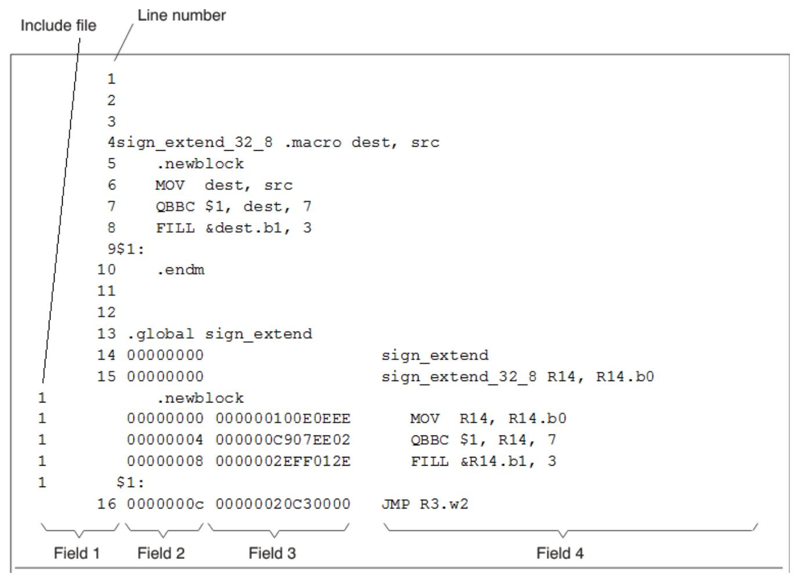

**Figure 4-2: Example Assembler Listing.** Annotated assembler listing output showing the four fields: Field 1 (source statement number, optionally preceded by an include-file letter or a macro nesting-level digit), Field 2 (section program counter in hexadecimal), Field 3 (assembled object code in hexadecimal), and Field 4 (source statement text as scanned). The example listing defines a `sign_extend_32_8` macro (lines 1–10), then at line 15 expands it as `sign_extend_32_8 R14, R14.b0`; the macro-expanded instructions (lines shown with nesting-level digit "1" in Field 1) appear with their SPC values and assembled object-code words.

## 4.11 Debugging Assembly Source

By default, when you compile an assembly file, the assembler provides symbolic debugging information that allows you to step through your assembly code in a debugger rather than using the Disassembly window in Code Composer Studio. This enables you to view source comments and other source-code annotations while debugging. The default has the same behavior as using the --symdebug:dwarf option. You can disable the generation of debugging information by using the --symdebug:none option.

The .asmfunc and .endasmfunc (see .asmfunc directive) directives enable you to use C characteristics in assembly code that makes the process of debugging an assembly file more closely resemble debugging a C/C++ source file.

The .asmfunc and .endasmfunc directives allow you to name certain areas of your code, and make these areas appear in the debugger as C functions. Contiguous sections of assembly code that are not enclosed by the .asmfunc and .endasmfunc directives are automatically placed in assembler-defined functions named with this syntax:

```
$ filename : starting source line : ending source line $
```

If you want to view your variables as a user-defined type in C code, the types must be declared and the variables must be defined in a C file. This C file can then be referenced in assembly code using the .ref directive (see .ref directive). Example 4-3 shows the cvar.c C program that defines a variable, svar, as the structure type X. The svar variable is then referenced in the addfive.asm assembly program in Example 4-4 and 5 is added to svar's second data member.

Compile both source files with the --symdebug:dwarf option (-g) and link them as follows:

```
clpru --symdebug:dwarf cvars.c addfive.asm --run_linker --library=lnk.cmd --
library=rtspruv3_le.lib
      --output_file=addfive.out
```

When you load this program into a symbolic debugger, addfive appears as a C function. You can monitor the values in svar while stepping through main just as you would any regular C variable.

### Example 4-3. Viewing Assembly Variables as C Types C Program

```
typedef struct {
   int m1;
   int m2;
} X;
X svar = { 1, 2 };
```

### Example 4-4. Assembly Program for Example 4-3

```
;-------------------------------------------------------------------------------------
; Tell assembler we're referencing "svar", which is defined in another file (cvars.c).
;-------------------------------------------------------------------------------------
         .ref svar
;------------------------------------------------------------------------------
; addfive() - Add five to the second data member of svar
;------------------------------------------------------------------------------
         .sect ".text:addfive"
         .global addfive
addfive: .asmfunc
          LDI r0, svar+4
          LBBO &r1, r0, 0, 4
          ADD r1, r1, 0x05
          SBBO &r1, r0, 0, 4
          JMP r3.w2
         .endasmfunc
```

## 4.12 Cross-Reference Listings

A cross-reference listing shows symbols and their definitions. To obtain a cross-reference listing, invoke the assembler with the --asm\_listing\_cross\_reference option (see Section 4.3) or use the .option directive with the X operand (see Select Listing Options\). The assembler appends the cross-reference to the end of the source listing. Example 4-5 shows the four fields contained in the cross-reference listing.

*Example 4*‑*5. An Assembler Cross-Reference Listing*

| LABEL                        | VALUE      | DEFN | REF      |
|------------------------------|------------|------|----------|
| BIG_ENDIAN                   | 00000000   | 0    |          |
| LITTLE_ENDIAN                | 00000001   | 0    |          |
| PRU_V0                       | 00000000   | 0    |          |
| PRU_V1                       | 00000000   | 0    |          |
| PRU_V2                       | 00000000   | 0    |          |
| PRU_V3                       | 00000000   | 0    |          |
| PRU                          | 00000001   | 0    |          |
| TI_ASSEMBLER_VERSION_QUAL_ID | 00003760   | 0    |          |
| TI_ASSEMBLER_VERSION_QUAL    | 00000049   | 0    |          |
| TI_ASSEMBLER_VERSION         | 001e8868   | 0    |          |
| TI_EABI                      | 00000001   | 0    |          |
| aloop                        | 00000010'  | 38   | 38 38    |
| buffer                       | 00000000-  | 10   |          |
| coeff                        | 00000000"  | 5    |          |
| gptr                         | REF        |      | 14 14 40 |
| inbuf                        | 00000001-  | 31   |          |
| ivals                        | 00000010"  | 26   |          |
| l1                           | 00000004'  | 21   | 21 21    |
| ptr                          | 0000000c"  | 14   |          |
| var2                         | 00000000-  | 30   |          |

**Label** column contains each symbol that was defined or referenced during the assembly. **Value** column contains an 8-digit hexadecimal number (which is the value assigned to the symbol) *or* a name that describes the symbol's attributes. A value may also be preceded by a character that describes the symbol's attributes. Table 4-6 lists these characters and names.

**Definition** (DEFN) column contains the statement number that defines the symbol. This column is blank for undefined symbols.

**Reference** (REF) column lists the line numbers of statements that reference the symbol. A blank in this column indicates that the symbol was never used.

**Table 4-6. Symbol Attributes**

| Character or Name | Meaning                                    |
|-------------------|--------------------------------------------|
| REF               | External reference (global symbol)         |
| UNDF              | Undefined                                  |
| '                 | Symbol defined in a .text section          |
| "                 | Symbol defined in a .data section          |
| +                 | Symbol defined in a .sect section          |
| -                 | Symbol defined in a .bss or .usect section |

# 5 Assembler Directives

Assembler directives supply data to the program and control the assembly process. Assembler directives enable you to do the following:

- Assemble code and data into specified sections
- Reserve space in memory for uninitialized variables
- Control the appearance of listings
- Initialize memory
- Assemble conditional blocks
- Define global variables
- Specify libraries from which the assembler can obtain macros
- Examine symbolic debugging information

This chapter is divided into two parts: the first part \(Section 5.1 through Section 5.11) describes the directives according to function, and the second part \(Section 5.12) is an alphabetical reference.

**Topic** ........................................................................................................................... **Page**

| 5.1  | Directives Summary                                  | 64 |
|------|-----------------------------------------------------|----|
| 5.2  | Directives that Define Sections                     | 68 |
| 5.3  | Directives that Initialize Values                   | 69 |
| 5.4  | Directives that Perform Alignment and Reserve Space | 72 |
| 5.5  | Directives that Format the Output Listings          | 73 |
| 5.6  | Directives that Reference Other Files               | 74 |
| 5.7  | Directives that Enable Conditional Assembly         | 75 |
| 5.8  | Directives that Define Union or Structure Types     | 75 |
| 5.9  | Directives that Define Enumerated Types             | 76 |
| 5.10 | Directives that Define Symbols at Assembly Time     | 76 |
| 5.11 | Miscellaneous Directives                            | 77 |
| 5.12 | Directives Reference                                | 78 |
|      |                                                     |    |

## 5.1 Directives Summary

Table 5-1 through Table 5-15 summarize the assembler directives.

Besides the assembler directives documented here, the PRU software tools support the following directives:

- Macro directives are discussed in Chapter 6; they are not discussed in this chapter.
- The C compiler uses directives for symbolic debugging. Unlike other directives, symbolic debugging directives are not used in most assembly language programs. Appendix A discusses these directives; they are not discussed in this chapter.

### Labels and Comments Are Not Shown in Syntaxes

**NOTE:** Most source statements that contain a directive can also contain a label and a comment. Labels begin in the first column (only labels and comments can appear in the first column), and comments must be preceded by a semicolon, or an asterisk if the comment is the only element in the line. To improve readability, labels and comments are not shown as part of the directive syntax here. See the detailed description of each directive for using labels with directives.

**Table 5-1. Directives that Control Section Use**

| Mnemonic and Syntax                                                         | Description                                                  | See          |
|-----------------------------------------------------------------------------|--------------------------------------------------------------|--------------|
| .bss symbol, size in bytes[, alignment<br>[, bank offset]]                  | Reserves size bytes in the .bss (uninitialized data) section | .bss topic   |
| .data                                                                       | Assembles into the .data (initialized data) section          | .data topic  |
| .sect "section name"                                                        | Assembles into a named (initialized) section                 | .sect topic  |
| .text                                                                       | Assembles into the .text (executable code) section           | .text topic  |
| symbol .usect "section name", size in bytes<br>[, alignment[, bank offset]] | Reserves size bytes in a named (uninitialized) section       | .usect topic |

**Table 5-2. Directives that Affect Unused Section Elimination**

| Mnemonic and Syntax        | Description                                                                                                                                              | See           |
|----------------------------|----------------------------------------------------------------------------------------------------------------------------------------------------------|---------------|
| .retain "section name"     | Instructs the linker to include the current or specified section in the<br>linked output file, regardless of whether the section is referenced or<br>not | .retain topic |
| .retainrefs "section name" | Instructs the linker to include any data object that references the<br>current or specified section.                                                     | .retain topic |

**Table 5-3. Directives that Initialize Values (Data and Memory)**

| Mnemonic and Syntax                                       | Description                                                                        | See           |
|-----------------------------------------------------------|------------------------------------------------------------------------------------|---------------|
| .bits value1<br>[, , valuen<br>]                          | Initializes one or more successive bits in the current section                     | .bits topic   |
| .byte value1<br>[, , valuen<br>]                          | Initializes one or more successive bytes in the current section                    | .byte topic   |
| .char value1<br>[, , valuen<br>]                          | Initializes one or more successive bytes in the current section                    | .char topic   |
| .cstring {expr1<br> "string1"}[, , {exprn<br> "stringn"}] | Initializes one or more text strings                                               | .string topic |
| .double value1<br>[, , valuen<br>]                        | Initializes one or more 64-bit, IEEE double-precision, floating-point<br>constants | .double topic |
| .field value[, size]                                      | Initializes a field of size bits (1-32) with value                                 | .field topic  |
| .float value1<br>[, , valuen<br>]                         | Initializes one or more 32-bit, IEEE single-precision, floating-point<br>constants | .float topic  |
| .half value1<br>[, , valuen<br>]                          | Initializes one or more 16-bit integers (halfword)                                 | .half topic   |
| .int value1<br>[, , valuen<br>]                           | Initializes one or more 32-bit integers                                            | .int topic    |
| .long value1<br>[, , valuen<br>]                          | Initializes one or more 32-bit integers                                            | .long topic   |
| .short value1<br>[, , valuen<br>]                         | Initializes one or more 16-bit integers (halfword)                                 | .short topic  |

### Table 5-3. Directives that Initialize Values (Data and Memory) (continued)

| Mnemonic and Syntax                                      | Description                                                                 | See           |
|----------------------------------------------------------|-----------------------------------------------------------------------------|---------------|
| .string {expr1<br> "string1"}[, , {exprn<br> "stringn"}] | Initializes one or more text strings                                        | .string topic |
| .ubyte value1<br>[, , valuen<br>]                        | Initializes one or more successive unsigned bytes in the current<br>section | .ubyte topic  |
| .uchar value1<br>[, , valuen<br>]                        | Initializes one or more successive unsigned bytes in the current<br>section | .uchar topic  |
| .uhalf value1<br>[, , valuen<br>]                        | Initializes one or more unsigned 16-bit integers (halfword)                 | .uhalf topic  |
| .uint value1<br>[, , valuen<br>]                         | Initializes one or more unsigned 32-bit integers                            | .uint topic   |
| .ulong value1<br>[, , valuen<br>]                        | Initializes one or more unsigned 32-bit integers                            | .long topic   |
| .ushort value1<br>[, , valuen<br>]                       | Initializes one or more unsigned 16-bit integers (halfword)                 | .short topic  |
| .uword value1<br>[, , valuen<br>]                        | Initializes one or more unsigned 32-bit integers                            | .uword topic  |
| .word value1<br>[, , valuen<br>]                         | Initializes one or more 32-bit integers                                     | .word topic   |

## Table 5-4. Directives that Perform Alignment and Reserve Space

| Mnemonic and Syntax    | Description                                                                                                       | See          |
|------------------------|-------------------------------------------------------------------------------------------------------------------|--------------|
| .align [size in bytes] | Aligns the SPC on a boundary specified by size in bytes, which<br>must be a power of 2; defaults to byte boundary | .align topic |
| .bes size              | Reserves size bytes in the current section; a label points to the end<br>of the reserved space                    | .bes topic   |
| .space size            | Reserves size bytes in the current section; a label points to the<br>beginning of the reserved space              | .space topic |

## Table 5-5. Directives that Format the Output Listing

| Mnemonic and Syntax                 | Description                                                                               | See             |
|-------------------------------------|-------------------------------------------------------------------------------------------|-----------------|
| .drlist                             | Enables listing of all directive lines (default)                                          | .drlist topic   |
| .drnolist                           | Suppresses listing of certain directive lines                                             | .drnolist topic |
| .fclist                             | Allows false conditional code block listing (default)                                     | .fclist topic   |
| .fcnolist                           | Suppresses false conditional code block listing                                           | .fcnolist topic |
| .length [page length]               | Sets the page length of the source listing                                                | .length topic   |
| .list                               | Restarts the source listing                                                               | .list topic     |
| .mlist                              | Allows macro listings and loop blocks (default)                                           | .mlist topic    |
| .mnolist                            | Suppresses macro listings and loop blocks                                                 | .mnolist topic  |
| .nolist                             | Stops the source listing                                                                  | .nolist topic   |
| .option option1<br>[, option2<br>,] | Selects output listing options; available options are A, B, H, M, N,<br>O, R, T, W, and X | .option topic   |
| .page                               | Ejects a page in the source listing                                                       | .page topic     |
| .sslist                             | Allows expanded substitution symbol listing                                               | .sslist topic   |
| .ssnolist                           | Suppresses expanded substitution symbol listing (default)                                 | .ssnolist topic |
| .tab size                           | Sets tab to size characters                                                               | .tab topic      |
| .title "string"                     | Prints a title in the listing page heading                                                | .title topic    |
| .width [page width]                 | Sets the page width of the source listing                                                 | .width topic    |

### Table 5-6. Directives that Reference Other Files

| Mnemonic and Syntax     | Description                                                        | See            |
|-------------------------|--------------------------------------------------------------------|----------------|
| .copy ["]filename["]    | Includes source statements from another file                       | .copy topic    |
| .include ["]filename["] | Includes source statements from another file                       | .include topic |
| .mlib ["]filename["]    | Specifies a macro library from which to retrieve macro definitions | .mlib topic    |

### Table 5-7. Directives that Affect Symbol Linkage and Visibility

| Mnemonic and Syntax                                                                         | Description                                                                                                    | See              |
|---------------------------------------------------------------------------------------------|----------------------------------------------------------------------------------------------------------------|------------------|
| .common symbol, size in bytes [, alignment]r<br>.common symbol, structure tag [, alignment] | Defines a common symbol for a variable.                                                                        | .common topic    |
| .def symbol1<br>[, , symboln<br>]                                                           | Identifies one or more symbols that are defined in the current<br>module and that can be used in other modules | .def topic       |
| .global symbol1<br>[, , symboln<br>]                                                        | Identifies one or more global (external) symbols                                                               | .global topic    |
| .ref symbol1<br>[, , symboln<br>]                                                           | Identifies one or more symbols used in the current module that are<br>defined in another module                | .ref topic       |
| .symdepend dst symbol name[, src symbol name]                                               | Creates an artificial reference from a section to a symbol                                                     | .symdepend topic |
| .weak symbol name                                                                           | Identifies a symbol used in the current module that is defined in<br>another module                            | .weak topic      |

## Table 5-8. Directives that Enable Conditional Assembly

| Mnemonic and Syntax    | Description                                                                                                                                                  | See            |
|------------------------|--------------------------------------------------------------------------------------------------------------------------------------------------------------|----------------|
| .if condition          | Assembles code block if the condition is true                                                                                                                | .if topic      |
| .else                  | Assembles code block if the .if condition is false. When using the .if<br>construct, the .else construct is optional.                                        | .else topic    |
| .elseif condition      | Assembles code block if the .if condition is false and the .elseif<br>condition is true. When using the .if construct, the .elseif construct<br>is optional. | .elseif topic  |
| .endif                 | Ends .if code block                                                                                                                                          | .endif topic   |
| .loop [count]          | Begins repeatable assembly of a code block; the loop count is<br>determined by the count.                                                                    | .loop topic    |
| .break [end condition] | Ends .loop assembly if end condition is true. When using the .loop<br>construct, the .break construct is optional.                                           | .break topic   |
| .endloop               | Ends .loop code block                                                                                                                                        | .endloop topic |

### Table 5-9. Directives that Define Structure Types

| Mnemonic and Syntax | Description                                                                                  | See                            |
|---------------------|----------------------------------------------------------------------------------------------|--------------------------------|
| .cstruct            | Acts like .struct, but adds padding and alignment like that which is<br>done to C structures | .cstruct topic                 |
| .cunion             | Acts like .union, but adds padding and alignment like that which is<br>done to C unions      | .cunion topic                  |
| .emember            | Sets up C-like enumerated types in assembly code                                             | Section 5.9                    |
| .endenum            | Sets up C-like enumerated types in assembly code                                             | Section 5.9                    |
| .endstruct          | Ends a structure definition                                                                  | .struct topic                  |
| .endunion           | Ends a union definition                                                                      | .cunion topic,<br>.union topic |
| .enum               | Sets up C-like enumerated types in assembly code                                             | Section 5.9                    |
| .union              | Begins a union definition                                                                    | .union topic                   |
| .sassign            | Map a defined structure onto the PRU registers                                               | .sassign topic                 |
| .struct             | Begins structure definition                                                                  | .struct topic                  |
| .tag                | Assigns structure attributes to a label                                                      | .struct topic                  |

### Table 5-10. Directives that Define Symbols

| Mnemonic and Syntax                                 | Description                                                                                                          | See        |
|-----------------------------------------------------|----------------------------------------------------------------------------------------------------------------------|------------|
| .asg ["]character string["], substitution symbol    | Assigns a character string to substitution symbol. Substitution<br>symbols created with .asg can be redefined.       | .asg topic |
| .define ["]character string["], substitution symbol | Assigns a character string to substitution symbol. Substitution<br>symbols created with .define cannot be redefined. | .asg topic |
| symbol .equ value                                   | Equates value with symbol                                                                                            | .equ topic |

## Table 5-10. Directives that Define Symbols (continued)

| Mnemonic and Syntax                       | Description                                             | See             |
|-------------------------------------------|---------------------------------------------------------|-----------------|
| .elfsym name, SYM_SIZE(size               | Provides ELF symbol information                         | .elfsym topic   |
| .eval expression ,<br>substitution symbol | Performs arithmetic on a numeric substitution symbol    | .eval topic     |
| .newblock                                 | Undefines local labels                                  | .newblock topic |
| symbol .set value                         | Equates value with symbol                               | .set topic      |
| .unasg symbol                             | Turns off assignment of symbol as a substitution symbol | .unasg topic    |
| .undefine symbol                          | Turns off assignment of symbol as a substitution symbol | .unasg topic    |

## Table 5-11. Directives that Create or Affect Macros

| Mnemonic and Syntax |                                      | Description                                                  | See          |
|---------------------|--------------------------------------|--------------------------------------------------------------|--------------|
| macname .macro      | [parameter1<br>][, , parametern<br>] | Begin definition of macro named macname                      | .macro topic |
| .endm               |                                      | End macro definition                                         | .endm topic  |
| .mexit              |                                      | Go to .endm                                                  | Section 6.2  |
| .mlib filename      |                                      | Identify library containing macro definitions                | .mlib topic  |
| .var                |                                      | Adds a local substitution symbol to a macro's parameter list | .var topic   |

## Table 5-12. Directives that Control Diagnostics

| Mnemonic and Syntax | Description                                                                      | See         |
|---------------------|----------------------------------------------------------------------------------|-------------|
| .emsg string        | Sends user-defined error messages to the output device;<br>produces no .obj file | .emsg topic |
| .mmsg string        | Sends user-defined messages to the output device                                 | .mmsg topic |
| .wmsg string        | Sends user-defined warning messages to the output device                         | .wmsg topic |

## Table 5-13. Directives that Perform Assembly Source Debug

| Mnemonic and Syntax | Description                                                          | See                  |
|---------------------|----------------------------------------------------------------------|----------------------|
| .asmfunc            | Identifies the beginning of a block of code that contains a function | .asmfunc topic       |
| .endasmfunc         | Identifies the end of a block of code that contains a function       | .endasmfunc<br>topic |

### Table 5-14. Directives that Are Used by the Absolute Lister

| Mnemonic and Syntax | Description                                    | See       |
|---------------------|------------------------------------------------|-----------|
| .setsect            | Produced by absolute lister; sets a section    | Chapter 9 |
| .setsym             | Produced by the absolute lister; sets a symbol | Chapter 9 |

## Table 5-15. Directives that Perform Miscellaneous Functions

| Mnemonic and Syntax                            | Description                                 | See           |
|------------------------------------------------|---------------------------------------------|---------------|
| .cdecls [options ,]"filename"[, "filename2"[,] | Share C headers between C and assembly code | .cdecls topic |
| .end                                           | Ends program                                | .end topic    |

In addition to the assembly directives that you can use in your code, the C/C++ compiler produces several directives when it creates assembly code. These directives are to be used only by the compiler; do not attempt to use these directives.

- DWARF directives listed in Section A.1
- The **.battr** directive is used to encode build attributes for the object file.
- The **.bound** directive is used internally.
- The **.comdat** directive is used internally.
- The **.compiler\_opts** directive indicates that the assembly code was produced by the compiler, and which build model options were used for this file.

## 5.2 Directives that Define Sections

These directives associate portions of an assembly language program with the appropriate sections:

- The **.bss** directive reserves space in the .bss section for uninitialized variables.
- The **.data** directive identifies portions of code in the .data section. The .data section usually contains initialized data.
- The **.retain** directive can be used to indicate that the current or specified section must be included in the linked output. Thus even if no other sections included in the link reference the current or specified section, it is still included in the link.
- The **.retainrefs** directive can be used to force sections to refer to the specified section.
- The **.sect** directive defines an initialized named section and associates subsequent code or data with that section. A section defined with .sect can contain code or data.
- The **.text** directive identifies portions of code in the .text section. The .text section usually contains executable code.
- The **.usect** directive reserves space in an uninitialized named section. The .usect directive is similar to the .bss directive, but it allows you to reserve space separately from the .bss section.

Chapter 2 discusses these sections in detail.

Example 5-1 shows how you can use sections directives to associate code and data with the proper sections. This is an output listing; column 1 shows line numbers, and column 2 shows the SPC values. (Each section has its own program counter, or SPC.) When code is first placed in a section, its SPC equals 0. When you resume assembling into a section after other code is assembled, the section's SPC resumes counting as if there had been no intervening code.

The directives in Example 5-1 perform the following tasks:

**.text** initializes words with the values 1, 2, 3, 4, 5, 6, 7, and 8.

**.data** initializes words with the values 9, 10, 11, 12, 13, 14, 15, and 16.

**var\_defs** initializes words with the values 17 and 18.

**.bss** reserves 19 bytes. **xy** reserves 20 bytes.

The .bss and .usect directives do not end the current section or begin new sections; they reserve the specified amount of space, and then the assembler resumes assembling code or data into the current section.

### Example 5-1. Sections Directives

```
 1
 2
 3                       ****************************************************
                         *    Start assembling into the .text section    *
                         ****************************************************
 4 00000000              .text
 5 00000000 00000001     .word 1,2
   00000004 00000002
 6 00000008 00000003     .word 3,4
   0000000c 00000004
 7
 8                       ****************************************************
                         *    Start assembling into the .data section    *
                         ****************************************************
 9
10
11 00000000 .data
12 00000000 00000009     .word 9, 10
   00000004 0000000A
13 00000008 0000000B     .word 11, 12
   0000000c 0000000C
14
15                       ****************************************************
16                       *    Start assembling into a named,              *
17                       *        initialized section, var_defs            *
                         ****************************************************
19 00000000              .sect "var_defs"
20 00000000 00000011     .word 17, 18
   00000004 00000012
21
22                       ****************************************************
23                       *    Resume assembling into the .data section    *
                         ****************************************************
24
25 00000010 .data
26 00000010 0000000D     .word 13, 14
   00000014 0000000E
27 00000000              .bss sym, 19   ; Reserve space in .bss
28 00000018 0000000F     .word 15, 16   ; Still in .data
   0000001c 00000010
29
30                       ****************************************************
31                       *    Resume assembling into the .text section    *
                         ****************************************************
32
33 00000010              .text
34 00000010 00000005     .word 5, 6
   00000014 00000006
35 00000000 usym         .usect "xy", 20 ; Reserve space in xy
36 00000018 00000007     .word 7, 8      ; Still in .text
   0000001c 00000008
```

### 5.3 Directives that Initialize Values

Several directives assemble values for the current section. For example:

- The .byte and .char directives place one or more 8-bit values into consecutive bytes of the current section. These directives are similar to .word, .int, and .long, except that the width of each value is restricted to 8 bits.
- The .double directive calculates the double-precision (64-bit) IEEE floating-point representation of one or more floating-point values and stores them in two consecutive words in the current section. The .double directive automatically aligns to the double-word boundary.
- The .field directive places a single value into a specified number of bits in the current word. With .field, you can pack multiple fields into a single word; the assembler does not increment the SPC until a word is filled. If a field will not fit in the space remaining in the current word, .field will insert zeros to fill the current word and then place the field in the next word. See the .field topic.

Figure 5-1 shows how fields are packed into a word. Using the following assembled code, notice that the SPC does not change for the first three fields (the fields are packed into the same word):

```
1 00000000 60000000 .field 3, 3
2 00000000 64000000 .field 8, 6
3 00000000 64400000 .field 16, 5
4 00000004 01234000 .field 01234h, 20
5 00000008 00001234 .field 01234h, 32
```

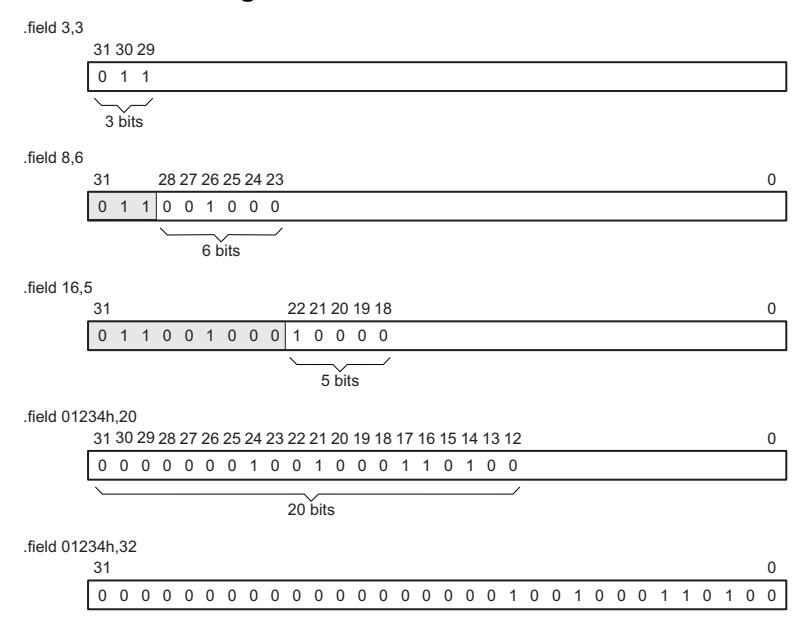

**Figure 5-1: The .field Directive.** Five bit-field diagrams showing how `.field` packs consecutive fields into a single 32-bit word. (1) `.field 3,3` places the 3-bit value 3 (binary `011`) into bits 31–29. (2) `.field 8,6` appends a 6-bit value in bits 28–23. (3) `.field 16,5` appends a 5-bit value in bits 22–18 — all three fit in the same word (SPC unchanged). (4) `.field 01234h,20` places a 20-bit value spanning bits 31–12 of a new word (SPC advances to 00000004h). (5) `.field 01234h,32` places the full 32-bit value 01234h in its own word (SPC advances to 00000008h).

- The **.float** directive calculates the single-precision (32-bit) IEEE floating-point representation of a single floating-point value and stores it in a word in the current section that is aligned to a word boundary.
- The **.half** and **.short** directives place one or more 16-bit values into consecutive 16-bit fields (halfwords) in the current section. The .half and .short directives automatically align to a short (2-byte) boundary.
- The **.int**, **.long**, and **.word** directives place one or more 32-bit values into consecutive 32-bit fields (words) in the current section. The .int, .long, and .word directives automatically align to a word boundary.
- The **.string** and **.cstring** directives place 8-bit characters from one or more character strings into the current section. The .string and .cstring directives are similar to .byte, placing an 8-bit character in each consecutive byte of the current section. The .cstring directive adds a NUL character needed by C; the .string directive does not add a NUL character.
- The **.ubyte**, **.uchar**, **.uhalf**, **.uint**, **.ulong**, **.ushort**, and **.uword** directives are provided as unsigned versions of their respective signed directives. These directives are used primarily by the C/C++ compiler to support unsigned types in C/C++.

### Directives that Initialize Constants When Used in a .struct/.endstruct Sequence

**NOTE:** The .bits, .byte, .char, .int, .long, .word, .double, .half, .short, .ubyte, .uchar, .uhalf, .uint, .ulong, .ushort, .uword, .string, .float, and .field directives do not initialize memory when they are part of a .struct/ .endstruct sequence; rather, they define a member's size. For more information, see the .struct/.endstruct directives.

Figure 5-2 compares the .byte, .char, .short, .int, .long, .float, .double, .word, and .string directives using the following assembled code:

```
1 00000000 AA          .byte    0AAh, 0BBh
  00000001 BB
2 00000002 CC          .char    0CCh
3 00000004 ABCD        .short   0ABCDh
4 00000006 0000DDDD    .word    0DDDDh
5 0000000a EEEEFFFF    .long    0EEEEFFFFh
6 0000000e 0000DDDD    .int     0DDDDh
7 00000012 3FFFFCB9    .float   1.9999
8 00000016 3FFFFFF5    .double  1.99999
  0000001a 83A53B8E
9 0000001e 48          .string  "Help"
  0000001f 65
  00000020 6C
  00000021 70
```

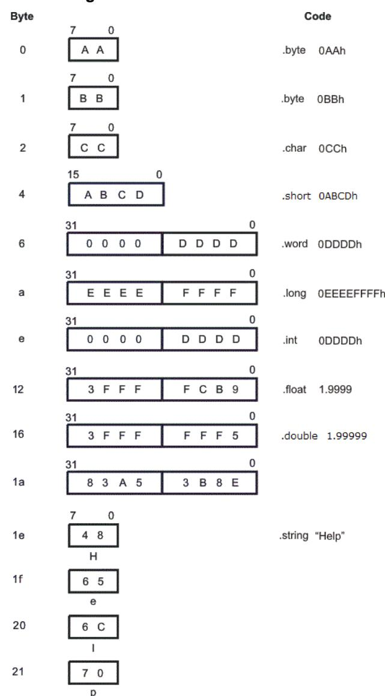

**Figure 5-2: Initialization Directives.** Memory layout diagram showing the byte address (Byte column) and hex content (Code column) for each initialization directive. `.byte 0AAh` and `.byte 0BBh` place bytes AA and BB at addresses 0 and 1; `.char 0CCh` places CC at 2; `.short 0ABCDh` places a 16-bit halfword at 4; `.word 0DDDDh` places a zero-extended 32-bit word at 6; `.long 0EEEEFFFFh` places a 32-bit word at a; `.int 0DDDDh` places another word at e; `.float 1.9999` places 32-bit IEEE single `3FFFCB9h` at 12; `.double 1.99999` places 64-bit IEEE double across words at 16 and 1a; `.string "Help"` places ASCII bytes 48, 65, 6C, 70 at addresses 1e–21.

### 5.4 Directives that Perform Alignment and Reserve Space

These directives align the section program counter (SPC) or reserve space in a section:

• The **.align** directive aligns the SPC at a 1-byte to 32K-byte boundary. This ensures that the code following the directive begins on the byte value that you specify. If the SPC is already aligned at the selected boundary, it is not incremented. Operands for the .align directive must equal a power of 2 between 2<sup>0</sup> and 2<sup>15</sup>, inclusive.

Figure 5-3 demonstrates the .align directive. Using the following assembled code:

```
1 00000000 40000000 .field 2,3
2 00000000 4000000B .field 11, 21
3 .align 2
4 00000004 45 .string "Errcnt"
00000005 72
00000006 72
00000007 63
00000008 6E
00000009 74
5 .align
6 0000000c 04 .byte 4
```

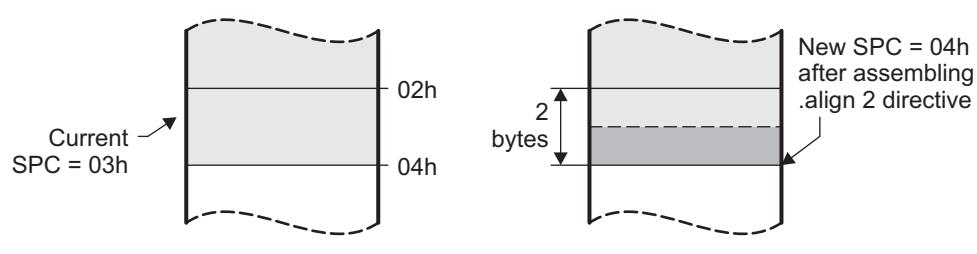

**(a) Result of .align 2.** Memory diagram showing that with current SPC = 03h, assembling `.align 2` inserts 2 bytes of null padding, advancing the SPC to 04h (the next halfword boundary).

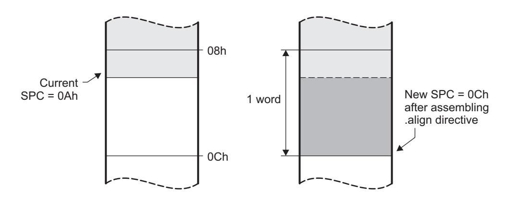

**(b) Result of .align without an argument.** Memory diagram showing that with current SPC = 0Ah (2 bytes into the word spanning 08h–0Bh), assembling `.align` with no argument inserts 2 bytes of null padding to advance the SPC to 0Ch (the next 4-byte word boundary). The diagram labels the aligned word slot 08h–0Ch as "1 word" to indicate the alignment unit.

- The .bes and .space directives reserve a specified number of bytes in the current section. The assembler fills these reserved bytes with 0s. You can reserve a specified number of words by multiplying the number of bytes by 4.
  - When you use a label with .space, it points to the *first* byte that contains reserved bits.
  - When you use a label with .bes, it points to the *last* byte that contains reserved bits.

Figure 5-4 shows how the .space and .bes directives work for the following assembled code:

```
1
2 00000000 00000100 .word 100h, 200h
 00000004 00000200
3 00000008 Res_1: .space 17
4 0000001c 0000000F .word 15
5 00000033 Res_2: .bes 20
6 00000034 BA .byte 0BAh
```

Res\_1 points to the first byte in the space reserved by .space. Res\_2 points to the last byte in the space reserved by .bes.

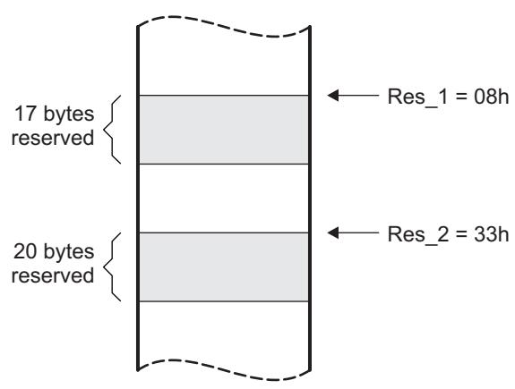

**Figure 5-4: The .space and .bes Directives.** Memory diagram showing two reserved blocks. The first block (17 bytes, reserved by `.space 17`) has its label `Res_1` pointing to the first byte at address 08h. The second block (20 bytes, reserved by `.bes 20`) has its label `Res_2` pointing to the last byte at address 33h. This illustrates the key difference: `.space` labels point to the first reserved byte, while `.bes` labels point to the last reserved byte.

## 5.5 Directives that Format the Output Listings

These directives format the listing file:

• The **.drlist** directive causes printing of the directive lines to the listing; the **.drnolist** directive turns it off for certain directives. You can use the .drnolist directive to suppress the printing of the following directives. You can use the .drlist directive to turn the listing on again.

| .asg   | .eval     | .length | .mnolist  | .var   |
|--------|-----------|---------|-----------|--------|
| .break | .fclist   | .mlist  | .sslist   | .width |
| .emsg  | .fcnolist | .mmsg   | .ssnolist | .wmsg  |

- The source code listing includes false conditional blocks that do not generate code. The **.fclist** and **.fcnolist** directives turn this listing on and off. You can use the .fclist directive to list false conditional blocks exactly as they appear in the source code. You can use the .fcnolist directive to list only the conditional blocks that are actually assembled.
- The **.length** directive controls the page length of the listing file. You can use this directive to adjust listings for various output devices.
- The **.list** and **.nolist** directives turn the output listing on and off. You can use the .nolist directive to prevent the assembler from printing selected source statements in the listing file. Use the .list directive to turn the listing on again.
- The source code listing includes macro expansions and loop blocks. The **.mlist** and **.mnolist** directives turn this listing on and off. You can use the .mlist directive to print all macro expansions and loop blocks to the listing, and the .mnolist directive to suppress this listing.

- The **.option** directive controls certain features in the listing file. This directive has the following operands:
  - **A** turns on listing of all directives and data, and subsequent expansions, macros, and blocks.
  - **B** limits the listing of .byte and .char directives to one line.
  - **H** limits the listing of .half and .short directives to one line.
  - **M** turns off macro expansions in the listing.
  - **N** turns off listing (performs .nolist).
  - **O** turns on listing (performs .list).
  - **R** resets the B, H, M, T, and W directives (turns off the limits of B, H, M, T, and W).
  - **T** limits the listing of .string directives to one line.
  - **W** limits the listing of .word and .int directives to one line.
  - **X** produces a cross-reference listing of symbols. You can also obtain a cross-reference listing by invoking the assembler with the --asm\_listing\_cross\_reference option (see Section 4.3).
- The **.page** directive causes a page eject in the output listing.
- The source code listing includes substitution symbol expansions. The **.sslist** and **.ssnolist** directives turn this listing on and off. You can use the .sslist directive to print all substitution symbol expansions to the listing, and the .ssnolist directive to suppress this listing. These directives are useful for debugging the expansion of substitution symbols.
- The **.tab** directive defines tab size.
- The **.title** directive supplies a title that the assembler prints at the top of each page.
- The **.width** directive controls the page width of the listing file. You can use this directive to adjust listings for various output devices.

## 5.6 Directives that Reference Other Files

These directives supply information for or about other files that can be used in the assembly of the current file:

- The **.copy** and **.include** directives tell the assembler to begin reading source statements from another file. When the assembler finishes reading the source statements in the copy/include file, it resumes reading source statements from the current file. The statements read from a copied file are printed in the listing file; the statements read from an included file are *not* printed in the listing file.
- The **.def** directive identifies a symbol that is defined in the current module and that can be used in another module. The assembler includes the symbol in the symbol table.
- The **.global** directive declares a symbol external so that it is available to other modules at link time. (For more information about global symbols, see Section 2.6.1). The .global directive does double duty, acting as a .def for defined symbols and as a .ref for undefined symbols. The linker resolves an undefined global symbol reference only if the symbol is used in the program. The .global directive declares a 16-bit symbol.
- The **.mlib** directive supplies the assembler with the name of an archive library that contains macro definitions. When the assembler encounters a macro that is not defined in the current module, it searches for it in the macro library specified with .mlib.
- The **.ref** directive identifies a symbol that is used in the current module but is defined in another module. The assembler marks the symbol as an undefined external symbol and enters it in the object symbol table so the linker can resolve its definition. The .ref directive forces the linker to resolve a symbol reference.
- The **.symdepend** directive creates an artificial reference from the section defining the source symbol name to the destination symbol. The .symdepend directive prevents the linker from removing the section containing the destination symbol if the source symbol section is included in the output module.
- The **.weak** directive identifies a symbol that is used in the current module but is defined in another module. It is equivalent to the .ref directive, except that the reference has weak linkage.

## 5.7 Directives that Enable Conditional Assembly

Conditional assembly directives enable you to instruct the assembler to assemble certain sections of code according to a true or false evaluation of an expression. Two sets of directives allow you to assemble conditional blocks of code:

• The **.if/.elseif/.else/.endif** directives tell the assembler to conditionally assemble a block of code according to the evaluation of an expression.

**.if** *condition* marks the beginning of a conditional block and assembles code if the .if *condition* is true.

[**.elseif** *condition*] marks a block of code to be assembled if the .if *condition* is false and the .elseif condition is true.

**.else** marks a block of code to be assembled if the .if *condition* is false and any .elseif conditions are false.

**.endif** marks the end of a conditional block and terminates the block.

• The **.loop/.break/.endloop** directives tell the assembler to repeatedly assemble a block of code according to the evaluation of an expression.

**.loop** [*count*] marks the beginning of a repeatable block of code. The optional expression evaluates to the loop count.

**.break** [*end condition*] tells the assembler to assemble repeatedly when the .break *end condition* is false and to go to the code immediately after .endloop when the expression is true or omitted.

**.endloop** marks the end of a repeatable block.

The assembler supports several relational operators that are useful for conditional expressions. For more information about relational operators, see Section 4.8.2.

## 5.8 Directives that Define Union or Structure Types

These directives set up specialized types for later use with the .tag directive, allowing you to use symbolic names to refer to portions of a complex object. The types created are analogous to the struct and union types of the C language.

The .struct, .union, .cstruct, and .cunion directives group related data into an aggregate structure which is more easily accessed. These directives do not allocate space for any object. Objects must be separately allocated, and the .tag directive must be used to assign the type to the object.

```
type .struct ; structure tag definition
X .int
Y .int
T_LEN .endstruct
COORD .tag type ; declare COORD (coordinate)
COORD .space T_LEN ; actual memory allocation
     LDR R0, COORD.Y ; load member Y of structure
                       ; COORD into register R0.
```

The .cstruct and .cunion directives guarantee that the data structure will have the same alignment and padding as if the structure were defined in analogous C code. This allows structures to be shared between C and assembly code. See Chapter 13. For .struct and .union, element offset calculation is left up to the assembler, so the layout may be different than .cstruct and .cunion.

The .sassign directive allows you to map a defined structure onto the PRU registers.

## 5.9 Directives that Define Enumerated Types

These directives set up specialized types for later use in expressions allowing you to use symbolic names to refer to compile-time constants. The types created are analogous to the enum type of the C language. This allows enumerated types to be shared between C and assembly code. See Chapter 13.

See Section 13.2.10 for an example of using .enum.

## 5.10 Directives that Define Symbols at Assembly Time

Assembly-time symbol directives equate meaningful symbol names to constant values or strings.

• The **.asg** directive assigns a character string to a substitution symbol. The value is stored in the substitution symbol table. When the assembler encounters a substitution symbol, it replaces the symbol with its character string value. Substitution symbols created with .asg can be redefined.

```
.asg "10, 20, 30, 40", coefficients
        ; Assign string to substitution symbol.
.byte coefficients
        ; Place the symbol values 10, 20, 30, and 40
        ; into consecutive bytes in current section.
```

- The **.define** directive assigns a character string to a substitution symbol. The value is stored in the substitution symbol table. When the assembler encounters a substitution symbol, it replaces the symbol with its character string value. Substitution symbols created with .define cannot be redefined.
- The **.eval** directive evaluates a well-defined expression, translates the results into a character string, and assigns the character string to a substitution symbol. This directive is most useful for manipulating counters:

```
.asg 1 , x ; x = 1
.loop ; Begin conditional loop.
.byte x*10h ; Store value into current section.
.break x = 4 ; Break loop if x = 4.
.eval x+1, x ; Increment x by 1.
.endloop ; End conditional loop.
```

• The **.set** and **.equ** directives set a constant value to a symbol. The symbol is stored in the symbol table and cannot be redefined; for example:

```
bval .set 0100h ; Set bval = 0100h
     .long bval, bval*2, bval+12
        ; Store the values 0100h, 0200h, and 010Ch
        ; into consecutive words in current section.
```

The .set and .equ directives produce no object code. The two directives are identical and can be used interchangeably.

- The **.unasg** directive turns off substitution symbol assignment made with .asg.
- The **.undefine** directive turns off substitution symbol assignment made with .define.
- The **.var** directive allows you to use substitution symbols as local variables within a macro.

## 5.11 Miscellaneous Directives

These directives enable miscellaneous functions or features:

- The **.asmfunc** and **.endasmfunc** directives mark function boundaries. These directives are used with the compiler --symdebug:dwarf (-g) option to generate debug information for assembly functions.
- The **.cdecls** directive enables programmers in mixed assembly and C/C++ environments to share C headers containing declarations and prototypes between C and assembly code.
- The **.end** directive terminates assembly. If you use the .end directive, it should be the last source statement of a program. This directive has the same effect as an end-of-file character.
- The **.group**, **.gmember**, and **.endgroup** directives define an ELF group section to be shared by several sections.
- The **.newblock** directive resets local labels. Local labels are symbols of the form \$n, where n is a decimal digit. They are defined when they appear in the label field. Local labels are temporary labels that can be used as operands for jump instructions. The .newblock directive limits the scope of local labels by resetting them after they are used. See Section 4.7.3 for information on local labels.

These three directives enable you to define your own error and warning messages:

- The **.emsg** directive sends error messages to the standard output device. The .emsg directive generates errors in the same manner as the assembler, incrementing the error count and preventing the assembler from producing an object file.
- The **.mmsg** directive sends assembly-time messages to the standard output device. The .mmsg directive functions in the same manner as the .emsg and .wmsg directives but does not set the error count or the warning count. It does not affect the creation of the object file.
- The **.wmsg** directive sends warning messages to the standard output device. The .wmsg directive functions in the same manner as the .emsg directive but increments the warning count rather than the error count. It does not affect the creation of the object file.

For more information about using the error and warning directives in macros, see Section 6.7.

## 5.12 Directives Reference

The remainder of this chapter is a reference. Generally, the directives are organized alphabetically, one directive per topic. Related directives (such as .if/.else/.endif), however, are presented together in one topic.

### **.align** *Align SPC on the Next Boundary*

**Syntax .align** [*size in bytes*]

**Description** The **.align** directive aligns the section program counter (SPC) on the next boundary, depending on the *size in bytes* parameter. The *size* can be any power of 2, although only certain values are useful for alignment. An operand of 1 aligns the SPC on the next byte boundary, and this is the default if no *size in bytes* is given. The *size in bytes* must equal a power of 2; the value must be between 1 and 32,768, inclusive. The assembler assembles words containing null values (0) up to the next size in bytes boundary:


- 1   — aligns SPC to byte boundary
- 2   — aligns SPC to halfword boundary
- 4   — aligns SPC to word boundary
- 8   — aligns SPC to doubleword boundary
- 128 — aligns SPC to page boundary

Using the .align directive has two effects:

- The assembler aligns the SPC on an x-byte boundary *within* the current section.
- The assembler sets a flag that forces the linker to align the section so that individual alignments remain intact when a section is loaded into memory.

**Example** This example shows several types of alignment, including .align 2, .align 8, and a default .align.

```
1 00000000 04 .byte 4
2 .align 2
3 00000002 45 .string "Errorcnt"
 00000003 72
 00000004 72
 00000005 6F
 00000006 72
 00000007 63
 00000008 6E
 00000009 74
4 .align
5 0000000c 60000000 .field 3,3
6 0000000c 6A000000 .field 5,4
7 .align 2
8 0000000c 6A006000 .field 3,3
9 .align 8
10 00000010 50000000 .field 5,4
11 .align
12 00000014 04 .byte 4
```

### **.asg/.define/.eval** *Assign a Substitution Symbol*

**Syntax .asg "***character string***",***substitution symbol*

**.define "***character string***",***substitution symbol*

**.eval** *expression***,***substitution symbol*

**Description** The **.asg** and **.define** directives assign character strings to substitution symbols. Substitution symbols are stored in the substitution symbol table. The .asg directive can be used in many of the same ways as the .set directive, but while .set assigns a constant value (which cannot be redefined) to a symbol, .asg assigns a character string (which can be redefined) to a substitution symbol.

- The assembler assigns the *character string* to the substitution symbol.
- The *substitution symbol* must be a valid symbol name. The substitution symbol is up to 128 characters long and must begin with a letter. Remaining characters of the symbol can be a combination of alphanumeric characters, the underscore (\_), and the dollar sign (\$).

The **.define** directive functions in the same manner as the .asg directive, except that .define disallows creation of a substitution symbol that has the same name as a register symbol or mnemonic. It does not create a new symbol name space in the assembler, rather it uses the existing substitution symbol name space. The .define directive is used to prevent corruption of the assembly environment when converting C/C++ headers. See Chapter 13 for more information about using C/C++ headers in assembly source.

The **.eval** directive performs arithmetic on substitution symbols, which are stored in the substitution symbol table. This directive evaluates the *expression* and assigns the string value of the result to the substitution symbol. The .eval directive is especially useful as a counter in .loop/.endloop blocks.

- The *expression* is a well-defined alphanumeric expression in which all symbols have been previously defined in the current source module, so that the result is an absolute expression.
- The *substitution symbol* must be a valid symbol name. The substitution symbol is up to 128 characters long and must begin with a letter. Remaining characters of the symbol can be a combination of alphanumeric characters, the underscore (\_), and the dollar sign (\$).

See the .unasg/.undefine topic for information on turning off a substitution symbol.

### **Example** This example shows how .asg and .eval can be used.

```
1 .sslist ; show expanded sub. symbols
  2 ; using .asg and .eval
  3
  4 .asg R2, STACKPTR
  5 .asg &, AND
  6
  7 00000000 E28DD018 ADD STACKPTR, STACKPTR, 280 AND 255
# ADD R2, R2, 280 & 255
  8 00000004 E28DD018 ADD STACKPTR, STACKPTR, 280 & 255
# ADD R2, R2, 280 & 255
  9
  10 .asg 0, x
  11 .loop 5
  12 .eval x+1, x
  13 .word x
  14 .endloop
1 .eval x+1, x
# .eval 0+1, x
1 00000008 00000001 .word x
# .word 1
1 .eval x+1, x
# .eval 1+1, x
1 0000000c 00000002 .word x
# .word 2
1 .eval x+1, x
# .eval 2+1, x
1 00000010 00000003 .word x
# .word 3
1 .eval x+1, x
# .eval 3+1, x
1 00000014 00000004 .word x
# .word 4
1 .eval x+1, x
# .eval 4+1, x
1 00000018 00000005 .word x
# .word 5
```

## **.asmfunc/.endasmfunc** *Mark Function Boundaries*

**Syntax** *symbol* **.asmfunc** [**stack\_usage(***num***)**]

**.endasmfunc**

**Description** The **.asmfunc** and **.endasmfunc** directives mark function boundaries. These directives are used with the compiler -g option (--symdebug:dwarf) to allow assembly code sections to be debugged in the same manner as C/C++ functions.

> You should not use the same directives generated by the compiler (see Appendix A) to accomplish assembly debugging; those directives should be used only by the compiler to generate symbolic debugging information for C/C++ source files.

The *symbol* is a label that must appear in the label field.

The .asmfunc directive has an optional parameter, stack\_usage, which indicates that the function may use up to *num* bytes.

Consecutive ranges of assembly code that are not enclosed within a pair of .asmfunc and .endasmfunc directives are given a default name in the following format:

**\$** *filename* **:** *beginning source line* **:** *ending source line* **\$**

**Example** In this example the .asmfunc and .endasmfunc directives are used to mark function boundaries for the user\_func function.

```
1 00000000 .sect ".text"
2 .global user_func
3 .align 4
4
5 userfunc: .asmfunc
6 LDI R28, 1
7 MOV R29, R26
8 XIN 0, &R26, 4
9 .endasmfunc
```

## **.bits** *Initialize Bits*

**Syntax** **.bits** *value<sup>1</sup>*[**, ... ,** *value<sup>n</sup>* ]

**Description** The **.bits** directive places one or more values into consecutive bits of the current section.

The .bits directive is similar to the .field directive (see .field topic). However, the .bits directive does not allow you to specify the number of bits to fill or increment the SPC.

## **.bss** *Reserve Space in the .bss Section*

**Syntax** 

.bss symbol, size in bytes[, alignment]

**Description**

The **.bss** directive reserves space for variables in the .bss section. This directive is usually used to allocate space in RAM.

- The *symbol* is a required parameter. It defines a symbol that points to the first location reserved by the directive. The symbol name must correspond to the variable that you are reserving space for.
- The size in bytes is a required parameter; it must be an absolute constant expression. The assembler allocates size bytes in the .bss section. There is no default size.
- The alignment is an optional parameter that ensures that the space allocated to the symbol occurs on the specified boundary. The boundary indicates must be set to a power of 2 between 2<sup>0</sup> and 2<sup>15</sup>, inclusive. If the SPC is already aligned at the specified boundary, it is not incremented.

For more information about sections, see Chapter 2.

**Example**

In this example, the .bss directive allocates space for two variables, TEMP and ARRAY. The symbol TEMP points to four bytes of uninitialized space (at .bss SPC = 0). The symbol ARRAY points to 100 bytes of uninitialized space (at .bss SPC = 04h). Symbols declared with the .bss directive can be referenced in the same manner as other symbols and can also be declared external.

```
 1                        ********************************************
 2                        **  Start assembling into the .text section.  **
 3                        ********************************************
 4 00000000              .text
 5 00000000 E3A00000     LDI    R0, 0
 6
 7                        ********************************************
 8                        **    Allocate 4 bytes in .bss for TEMP.    **
 9                        ********************************************
10 00000000 Var_1:        .bss    TEMP, 4
11
12                        ********************************************
13                        **              Still in .text.             **
14                        ********************************************
15 00000004 E2801056      ADD    R1, R0, 56h
16
17
18                        ********************************************
19                        ** Allocate 100 bytes in .bss for the symbol **
20                        **              named ARRAY.                **
21                        ********************************************
22 00000004               .bss    ARRAY, 100, 4
23
24                        ********************************************
25                        **     Assemble more code into .text.       **
26                        ********************************************
27 0000000c E1A0F00E      JMP    R3.w2
28
29                        ********************************************
30                        **     Declare external .bss symbols.       **
31                        ********************************************
32                        .global ARRAY, TEMP
33                        .end
```

## **.byte/.ubyte/.char/.uchar** *Initialize Byte*

**Syntax**

**.byte** *value1*[**, ... ,** *valuen* ]
**.ubyte** *value1*[**, ... ,** *valuen* ]
**.char** *value1*[**, ... ,** *valuen* ]
**.uchar** *value1*[**, ... ,** *valuen* ]

**Description** The **.byte**, **.ubyte**, **.char**, and **.uchar** directives place one or more values into consecutive bytes of the current section. A *value* can be one of the following:

- An expression that the assembler evaluates and treats as an 8-bit signed number
- A character string enclosed in double quotes. Each character in a string represents a separate value, and values are stored in consecutive bytes. The entire string *must* be enclosed in quotes.

The first byte occupies the eight least significant bits of a full 32-bit word. The second byte occupies bits eight through 15 while the third byte occupies bits 16 through 23. The assembler truncates values greater than eight bits.

If you use a label, it points to the location of the first byte that is initialized.

When you use these directives in a .struct/.endstruct sequence, they define a member's size; they do not initialize memory. For more information, see the .struct/.endstruct/.tag topic.

**Example** In this example, 8-bit values (10, -1, abc, and a) are placed into consecutive bytes in memory with .byte. Also, 8-bit values (8, -3, def, and b) are placed into consecutive bytes in memory with .char. The label STRX has the value 0h, which is the location of the first initialized byte. The label STRY has the value 6h, which is the first byte initialized by the .char directive.

```
1 00000000 .space 100h
2 00000100 0A STRX .byte 10, -1, "abc", 'a'
 00000101 FF
 00000102 61
 00000103 62
 00000104 63
 00000105 61
3 00000106 08 STRY .char 8, -3, "def", 'b'
 00000107 FD
 00000108 64
 00000109 65
 0000010a 66
 0000010b 62
```

### **.cdecls** *Share C Headers Between C and Assembly Code*

**Syntax Single Line:**

**.cdecls** [*options* **,**] **"** *filename* **"**[**, "** *filename2* **"**[**,**...]]

**Syntax Multiple Lines:**

```
.cdecls [options]
%{
     /*---------------------------------------------------------------------------------*/
     /* C/C++ code - Typically a list of #includes and a few defines */
     /*---------------------------------------------------------------------------------*/
%}
```

**Description** The **.cdecls** directive allows programmers in mixed assembly and C/C++ environments to share C headers containing declarations and prototypes between the C and assembly code. Any legal C/C++ can be used in a .cdecls block and the C/C++ declarations cause suitable assembly to be generated automatically, allowing you to reference the C/C++ constructs in assembly code; such as calling functions, allocating space, and accessing structure members; using the equivalent assembly mechanisms. While function and variable definitions are ignored, most common C/C++ elements are converted to assembly, for instance: enumerations, (non-function-like) macros, function and variable prototypes, structures, and unions.

The .cdecls options control whether the code is treated as C or C++ code; and how the .cdecls block and converted code are presented. Options must be separated by commas; they can appear in any order:

| Option | Description |
|--------|-------------|
| C      | Treat the code in the .cdecls block as C source code (default). |
| CPP    | Treat the code in the .cdecls block as C++ source code. This is the opposite of the C option. |
| NOLIST | Do not include the converted assembly code in any listing file generated for the containing assembly file (default). |
| LIST   | Include the converted assembly code in any listing file generated for the containing assembly file. This is the opposite of the NOLIST option. |
| NOWARN | Do not emit warnings on STDERR about C/C++ constructs that cannot be converted while parsing the .cdecls source block (default). |
| WARN   | Generate warnings on STDERR about C/C++ constructs that cannot be converted while parsing the .cdecls source block. This is the opposite of the NOWARN option. |

In the single-line format, the options are followed by one or more filenames to include. The filenames and options are separated by commas. Each file listed acts as if #include "filename" was specified in the multiple-line format.

In the multiple-line format, the line following .cdecls must contain the opening .cdecls block indicator %{. Everything after the %{, up to the closing block indicator %}, is treated as C/C++ source and processed. Ordinary assembler processing then resumes on the line following the closing %}.

The text within %{ and %} is passed to the C/C++ compiler to be converted into assembly language. Much of C language syntax, including function and variable definitions as well as function-like macros, is not supported and is ignored during the conversion. However, all of what traditionally appears in C header files is supported, including function and variable prototypes; structure and union declarations; nonfunction-like macros; enumerations; and #defines.

The resulting assembly language is included in the assembly file at the point of the .cdecls directive. If the LIST option is used, the converted assembly statements are printed in the listing file.

The assembly resulting from the .cdecls directive is treated similarly to a .include file. Therefore the .cdecls directive can be nested within a file being copied or included. The assembler limits nesting to ten levels; the host operating system may set additional restrictions. The assembler precedes the line numbers of copied files with a letter code to identify the level of copying. An A indicates the first copied file, B indicates a second copied file, etc.

The .cdecls directive can appear anywhere in an assembly source file, and can occur multiple times within a file. However, the C/C++ environment created by one .cdecls is **not** inherited by a later .cdecls; the C/C++ environment starts new for each .cdecls.

See Chapter 13 for more information on setting up and using the .cdecls directive with C header files.

**Example** In this example, the .cdecls directive is used call the C header.h file.

**C header file:**

```
#define WANT_ID 10
#define NAME "John\n"
extern int a_variable;
extern float cvt_integer(int src);
struct myCstruct { int member_a; float member_b; };
enum status_enum { OK = 1, FAILED = 256, RUNNING = 0 };
```

**Source file:**

```
         .cdecls C,LIST,"myheader.h"
size:    .int $sizeof(myCstruct)
aoffset: .int myCstruct.member_a
boffset: .int myCstruct.member_b
okvalue: .int status_enum.OK
failval: .int status_enum.FAILED
         .if $defined(WANT_ID)
id       .cstring NAME
         .endif
```

**Listing File:**

```
1 .cdecls C,LIST,"myheader.h"
A 1 ; ------------------------------------------
A 2 ; Assembly Generated from C/C++ Source Code
A 3 ; ------------------------------------------
A 4
A 5 ; =========== MACRO DEFINITIONS ===========
A 6 .define "10",WANT_ID
A 7 .define """John\n""",NAME
A 8
A 9 ; =========== TYPE DEFINITIONS ===========
A 10 status_enum .enum
A 11 00000001 OK .emember 1
A 12 00000100 FAILED .emember 256
A 13 00000000 RUNNING .emember 0
A 14 .endenum
A 15
A 16 myCstruct .struct 0,4
   17 ; struct size=(8 bytes|64 bits), alignment=4
A 18 00000000 member_a .field 32
   19 ; int member_a - offset 0 bytes, size (4 bytes|32 bits)
A 20 00000004 member_b .field 32
   21 ; float member_b - offset 4 bytes, size (4 bytes|32 bits)
A 22 00000008 .endstruct
   23 ; final size=(8 bytes|64 bits)
A 24
A 25 ; =========== EXTERNAL FUNCTIONS ===========
A 26 .global _cvt_integer
A 27
A 28 ; =========== EXTERNAL VARIABLES ===========
A 29 .global _a_variable
    2 00000000 00000008 size: .int $sizeof(myCstruct)
    3 00000004 00000000 aoffset: .int myCstruct.member_a
    4 00000008 00000004 boffset: .int myCstruct.member_b
    5 0000000c 00000001 okvalue: .int status_enum.OK
    6 00000010 00000100 failval: .int status_enum.FAILED
    7 .if $defined(WANT_ID)
    8 00000014 0000004A id .cstring NAME
     00000015 0000006F
     00000016 00000068
     00000017 0000006E
     00000018 0000000A
     00000019 00000000
    9 .endif
```

## **.common** *Create a Common Symbol*

**Syntax**

.common symbol, size in bytes[, alignment]

.common symbol, structure tag[, alignment]

**Description**

The .common directive creates a common symbol in a common block, rather than placing the variable in a memory section.

This directive is used by the compiler when the --common option is enabled (the default), which causes uninitialized file scope variables to be emitted as common symbols. The benefit of common symbols is that generated code can remove unused variables that would otherwise increase the size of the .bss section. (Uninitialized variables of a size larger than 32 bytes are separately optimized through placement in separate subsections that can be omitted from a link.) This optimization happens for C/C++ code by default unless you use the --common=off compiler option.

- The symbol is a required parameter. It defines a name for the symbol created by this
  directive. The symbol name must correspond to the variable that you are reserving
  space for.
- The size in bytes is a required parameter; it must be an absolute expression. The
  assembler allocates size bytes in the section used for common symbols. There is no
  default size.
- A *structure tag* can be used in place of a size to specify a structure created with the .struct directive. Either a size or a structure tag is required for this argument.
- The *alignment* is an optional parameter that ensures that the space allocated to the symbol occurs on the specified boundary. The boundary must be set to a power of 2 between 2<sup>0</sup> and 2<sup>15</sup>, inclusive. If the SPC is already aligned at the specified boundary, it is not incremented.

Common symbols are symbols that are placed in the symbol table of an ELF object file. They represent an uninitialized variable. Common symbols do not reference a section. (In contrast, initialized variables need to reference a section that contains the initialized data.) The value of a common symbol is its required alignment; it has no address and stores no address. While symbols for an uninitialized common block can appear in executable object files, common symbols may only appear in relocatable object files. Common symbols are preferred over weak symbols. See the section on the "Symbol Table" in the System V ABI specification for more about common symbols.

When object files containing common symbols are linked, space is reserved in an uninitialized section for each common symbol. A symbol is created in place of the common symbol to refer to its reserved location.

### **.copy/.include** *Copy Source File*

**Syntax .copy "***filename***"**

**.include "***filename***"**

**Description** The **.copy** and **.include** directives tell the assembler to read source statements from a different file. The statements that are assembled from a copy file are printed in the assembly listing. The statements that are assembled from an included file are *not* printed in the assembly listing, regardless of the number of .list/.nolist directives assembled.

When a .copy or .include directive is assembled, the assembler:

- 1. Stops assembling statements in the current source file
- 2. Assembles the statements in the copied/included file
- 3. Resumes assembling statements in the main source file, starting with the statement that follows the .copy or .include directive

The *filename* is a required parameter that names a source file. It is enclosed in double quotes and must follow operating system conventions.

You can specify a full pathname (for example, /320tools/file1.asm). If you do not specify a full pathname, the assembler searches for the file in:

1. The directory that contains the current source file
2. Any directories named with the --include\_path assembler option
3. Any directories specified by the PRU\_A\_DIR environment variable
4. Any directories specified by the PRU\_A\_DIR environment variable

For more information about the --include\_path option and PRU\_A\_DIR, see Section 4.4. For more information about PRU\_A\_DIR, see the *PRU Optimizing C/C++ Compiler User's Guide*.

The .copy and .include directives can be nested within a file being copied or included. The assembler limits nesting to 32 levels; the host operating system may set additional restrictions. The assembler precedes the line numbers of copied files with a letter code to identify the level of copying. A indicates the first copied file, B indicates a second copied file, etc.

**Example 1** In this example, the .copy directive is used to read and assemble source statements from other files; then, the assembler resumes assembling into the current file.

> The original file, copy.asm, contains a .copy statement copying the file byte.asm. When copy.asm assembles, the assembler copies byte.asm into its place in the listing (note listing below). The copy file byte.asm contains a .copy statement for a second file, word.asm.

When it encounters the .copy statement for word.asm, the assembler switches to word.asm to continue copying and assembling. Then the assembler returns to its place in byte.asm to continue copying and assembling. After completing assembly of byte.asm, the assembler returns to copy.asm to assemble its remaining statement.

| copy.asm<br>(source file)                                 | byte.asm<br>(first copy file)                         | word.asm<br>(second copy file)      |
|-----------------------------------------------------------|-------------------------------------------------------|-------------------------------------|
| .space 29<br>.copy "byte.asm"<br>** Back in original file | ** In byte.asm<br>.byte 32,1+ 'A'<br>.copy "word.asm" | ** In word.asm<br>.word 0ABCDh, 56q |
| .string "done"                                            | ** Back in byte.asm<br>.byte 67h + 3q                 |                                     |

**Listing file:**

```
1 00000000 .space 29
    2 .copy "byte.asm"
A 1 ** In byte.asm
A 2 0000001d 20 .byte 32,1+ 'A'
     0000001e 42
A 3 .copy "word.asm"
B 1 ** In word.asm
B 2 00000020 0000ABCD .word 0ABCDh, 56q
     00000024 0000002E
A 4 ** Back in byte.asm
A 5 00000028 6A .byte 67h + 3q
    3
    4 ** Back in original file
    5 00000029 64 .string "done"
     0000002a 6F
     0000002b 6E
     0000002c 65
```

**Example 2** In this example, the .include directive is used to read and assemble source statements from other files; then, the assembler resumes assembling into the current file. The mechanism is similar to the .copy directive, except that statements are not printed in the listing file.

| include.asm<br>(source file) | byte2.asm<br>(first copy file) | word2.asm<br>(second copy file) |
|------------------------------|--------------------------------|---------------------------------|
| .space 29                    | ** In byte2.asm                | ** In word2.asm                 |
| .include "byte2.asm"         | .byte 32,1+ 'A'<br>.include    | .word 0ABCDh, 56q               |
| ** Back in original file     | "word2.asm"                    |                                 |
|                              | ** Back in byte2.asm           |                                 |
| .string "done"               |                                |                                 |
|                              | .byte 67h + 3q                 |                                 |

**Listing file:**

```
1 00000000 .space 29
2 .include "byte2.asm"
3
4 ** Back in original file
5 00000029 64 .string "done"
 0000002a 6F
 0000002b 6E
 0000002c 65
```

## **.cstruct/.cunion/.endstruct/.endunion/.tag** *Declare C Structure Type*

**Syntax**

| [stag]                                     | .cstruct|.cunion     | [expr]|
|--------------------------------------------|----------------------|----------------------------------------------|--|--|
| [mem <sub>0</sub> ]<br>[mem <sub>1</sub> ] | element<br>element   | [expr <sub>0</sub> ]<br>[expr <sub>1</sub> ]|
| •                                          | •                    | •|
| •                                          | ·                    | •|
| [mem_n]                                    | .tag stag            | [expr_n]|
| [mem_N]                                    | element              | [expr_N]|
| [size]                                     | .endstruct|.endunion ||
| label                                      | .tag                 | stag|

**Description**

The .cstruct and .cunion directives have been added to support ease of sharing of common data structures between assembly and C code. The .cstruct and .cunion directives can be used exactly like the existing .struct and .union directives except that they are guaranteed to perform data layout matching the layout used by the C compiler for C struct and union data types.

In particular, the .cstruct and .cunion directives force the same alignment and padding as used by the C compiler when such types are nested within compound data structures.

The **.endstruct** directive terminates the structure definition. The **.endunion** directive terminates the union definition.

The .tag directive gives structure characteristics to a *label*, simplifying the symbolic representation and providing the ability to define structures that contain other structures. The .tag directive does not allocate memory. The structure tag (*stag*) of a .tag directive must have been previously defined.

Following are descriptions of the parameters used with the .struct, .endstruct, and .tag directives:

- The *stag* is the structure's tag. Its value is associated with the beginning of the structure. If no stag is present, the assembler puts the structure members in the global symbol table with the value of their absolute offset from the top of the structure. The stag is optional for .struct, but is required for .tag.
- The *element* is one of the following descriptors: .byte, .char, .int, .long, .word, .double, .half, .short, .string, .float, and .field. All of these except .tag are typical directives that initialize memory. Following a .struct directive, these directives describe the structure element's size. They do not allocate memory. A .tag directive is a special case because stag must be used (as in the definition of stag).
- The *expr* is an optional expression indicating the beginning offset of the structure. The default starting point for a structure is 0.
- The *expr<sub>n/N</sub>* is an optional expression for the number of elements described. This value defaults to 1. A .string element is considered to be one byte in size, and a .field element is one bit.
- The  $mem_{n/N}$  is an optional label for a member of the structure. This label is absolute and equates to the present offset from the beginning of the structure. A label for a structure member cannot be declared global.
- The size is an optional label for the total size of the structure.

**Example**

This example illustrates a structure in C that will be accessed in assembly code.

```
typedef struct STRUCT1
; { int i0; /* offset 0 */
; short s0; /* offset 4 */
; } struct1; /* size 8, alignment 4 */
;
; typedef struct STRUCT2
; { struct1 st1; /* offset 0 */
; short s1; /* offset 8 */
; } struct2; /* size 12, alignment 4 */
;
; The structure will get the following offsets once the C compiler lays out the structure
; elements according to the C standard rules:
;
; offsetof(struct1, i0) = 0
; offsetof(struct1, s0) = 4
; sizeof(struct1) = 8
; offsetof(struct2, s1) = 0
; offsetof(struct2, i1) = 8
; sizeof(struct2) = 12
;
; Attempts to replicate this structure in assembly using the .struct/.union directives will not
; create the correct offsets because the assembler tries to use the most compact arrangement:
struct1 .struct
i0 .int ; bytes 0-3
s0 .short ; bytes 4-5
struct1len .endstruct ; size 6, alignment 4
struct2 .struct
st1 .tag struct1 ; bytes 0-5
s1 .short ; bytes 6-7
endstruct2 .endstruct ; size 8, alignment 4
       .sect "data1"
       .word struct1.i0 ; 0
       .word struct1.s0 ; 4
       .word struct1len ; 6
       .sect "data2"
       .word struct2.st1 ; 0
       .word struct2.s1 ; 6
       .word endstruct2 ; 8
;
; The .cstruct/.cunion directives calculate offsets in the same manner as the C compiler. The resulting
; assembly structure can be used to access the elements of the C structure. Compare the difference
; in the offsets of those structures defined via .struct above and the offsets for the C code.
cstruct1 .cstruct
i0 .int ; bytes 0-3
s0 .short ; bytes 4-5
cstruct1len .endstruct ; size 8, alignment 4
cstruct2 .cstruct
st1 .tag cstruct1 ; bytes 0-7
s1 .short ; bytes 8-9
cendstruct2 .endstruct ; size 12, alignment 4
       .sect "data3"
       .word cstruct1.i0, struct1.i0 ; 0
       .word cstruct1.s0, struct1.s0 ; 4
       .word cstruct1len, struct1len ; 8
       .sect "data4"
       .word cstruct2.st1, struct2.st1 ; 0
       .word cstruct2.s1, struct2.s1 ; 8
       .word cendstruct2, endstruct2 ; 12
```

## **.data** *Assemble Into the .data Section*

**Syntax** 

.data

**Description**

The .data directive sets .data as the current section; the lines that follow will be assembled into the .data section. The .data section is normally used to contain tables of data or preinitialized variables.

For more information about sections, see Chapter 2.

**Example**

In this example, code is assembled into the .data section.

```
 1                        *********************************************
 2                        **        Reserve space in .data.           **
 3                        *********************************************
 4 00000000              .data
 5 00000000              .space  0CCh
 6
 7                        *********************************************
 8                        **        Assemble into .data.              **
 9                        *********************************************
10 000000cc Table:       .data
11 000000cc FFFFFFFF      .word  -1       ; Assemble 32-bit
12                                        ; constant into .data.
13
14 000000d0 FF            .byte  0FFh     ; Assemble 8-bit
15                                        ; constant into .data.
16
```

### **.double** *Initialize Double-Precision Floating-Point Value*

**Syntax** **.double** *value<sup>1</sup>*[**, ... ,** *value<sup>n</sup>* ]

**Description** The **.double** directive places the IEEE double-precision floating-point representation of one or more floating-point values into the current section. Each *value* must be an absolute constant expression with an arithmetic type or a symbol equated to an absolute constant expression with an arithmetic type. Each constant is converted to a floatingpoint value in IEEE double-precision 64-bit format. Double-precision floating point constants are aligned to a double word boundary.

The 64-bit value is stored in the format shown in Figure 5-5.

**Figure 5-5. Double-Precision Floating-Point Format**

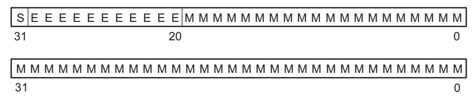

**Figure 5-5: Double-Precision Floating-Point Format.** Bit-field diagram showing the layout of a 64-bit IEEE 754 double-precision value stored as two consecutive 32-bit words. The high word (bits 31–0) contains: S = sign (bit 31), E = 10-bit exponent (bits 30–20), and the upper 20 bits of the mantissa M (bits 19–0). The low word (bits 31–0) contains the remaining 32 bits of the mantissa M. Bit position labels 31, 20, and 0 are shown for the high word; 31 and 0 for the low word.

**Legend:** S = sign
E = exponent (11-bit biased)
M = mantissa (52-bit fraction)

When you use .double in a .struct/.endstruct sequence, .double defines a member's size; it does not initialize memory. For more information, see the .struct/.endstruct/.tag topic.

**Example** This example shows the .double directive.

```
1 00000000 C5308B2A    .double -2.0e25
  00000004 2C280291
2 00000008 40180000    .double 6
  0000000c 00000000
3 00000010 407C8000    .double 456
  00000014 00000000
```

### **.drlist/.drnolist** *Control Listing of Directives*

**Syntax**

**.drlist**

**.drnolist**

**Description** Two directives enable you to control the printing of assembler directives to the listing file:

The **.drlist** directive enables the printing of all directives to the listing file.

The **.drnolist** directive suppresses the printing of the following directives to the listing file. The .drnolist directive has no affect within macros.

- .asg
- .break
- .emsg
- .eval
- .fclist
- .fcnolist
- .mlist
- .mmsg
- .mnolist
- .sslist
- .ssnolist
- .var
- .wmsg

By default, the assembler acts as if the .drlist directive had been specified.

**Example** This example shows how .drnolist inhibits the listing of the specified directives.

**Source file:**

```
.asg 0, x
.loop 2
.eval x+1, x
.endloop
.drnolist
.asg 1, x
.loop 3
.eval x+1, x
.endloop
```

**Listing file:**

```
     3                    .asg    0, x
     4                    .loop   2
     5                    .eval   x+1, x
     6                    .endloop
 1                        .eval   0+1, x
 1                        .eval   1+1, x
     7
     8                    .drnolist
    12                    .loop   3
    13                    .eval   x+1, x
    14                    .endloop
```

### **.elfsym** *ELF Symbol Information*

**Syntax .elfsym** *name***, SYM\_SIZE(***size***)**

**Description** The .elfsym directive provides additional information for symbols in the ELF format. This directive is designed to convey different types of information, so the *type*, *data* pair is used to represent each type. Currently, this directive only supports the SYM\_SIZE type.

SYM\_SIZE indicates the allocation size (in bytes) of the symbol indicated by *name*.

**Example** This example shows the use of the ELF symbol information directive.

```
.sect ".examp"
       .alignment 4
       .elfsym ex_sym, SYM_SIZE(4)
ex_sym:
        .word 0
```

## **.emsg/.mmsg/.wmsg** *Define Messages*

**Syntax .emsg** *string*

**.mmsg** *string*

**.wmsg** *string*

**Description** These directives allow you to define your own error and warning messages. When you use these directives, the assembler tracks the number of errors and warnings it encounters and prints these numbers on the last line of the listing file.

The **.emsg** directive sends an error message to the standard output device in the same manner as the assembler. It increments the error count and prevents the assembler from producing an object file.

The **.mmsg** directive sends an assembly-time message to the standard output device in the same manner as the .emsg and .wmsg directives. It does not, however, set the error or warning counts, and it does not prevent the assembler from producing an object file.

The **.wmsg** directive sends a warning message to the standard output device in the same manner as the .emsg directive. It increments the warning count rather than the error count, however. It does not prevent the assembler from producing an object file.

**Example** This example sends the message ERROR -- MISSING PARAMETER to the standard output device.

**Source file:**

```
MSG_EX .macro parm1
         .if $symlen(parm1) = 0
         .emsg "ERROR -- MISSING PARAMETER"
         .else
          ADD parm1, r7, r8
         .endif
         .endm
         MSG_EX R0
         MSG_EX
```

**Listing file:**

```
1 MSG_EX .macro parm1
   2 .if $symlen(parm1) = 0
   3 .emsg "ERROR -- MISSING PARAMETER"
   4 .else
   5 ADD parm1, r7, r8
   6 .endif
   7 .endm
   8
   9 00000000 MSG_EX R0
1 .if $symlen(parm1) = 0
1 .emsg "ERROR -- MISSING PARAMETER"
1 .else
1 00000000 E0870008 ADD R0, r7, r8
1 .endif
  10
  11 00000004 MSG_EX
1 .if $symlen(parm1) = 0
1 .emsg "ERROR -- MISSING PARAMETER"
***** USER ERROR ***** - : ERROR -- MISSING PARAMETER
1 .else
1 ADD parm1, r7, r8
1 .endif
```

1 Error, No Warnings

In addition, the following messages are sent to standard output by the assembler:

```
*** ERROR! line 11: ***** USER ERROR ***** - : ERROR -- MISSING PARAMETER
               .emsg "ERROR -- MISSING PARAMETER" ]]
1 Error, No Warnings
Errors in source - Assembler Aborted
```

## **.end** *End Assembly*

**Syntax** **.end**

**Description** The **.end** directive is optional and terminates assembly. The assembler ignores any source statements that follow a .end directive. If you use the .end directive, it must be the last source statement of a program.

This directive has the same effect as an end-of-file character. You can use .end when you are debugging and you want to stop assembling at a specific point in your code.

### Ending a Macro

**NOTE:** Do not use the .end directive to terminate a macro; use the .endm macro directive instead.

**Example** This example shows how the .end directive terminates assembly. Any source statements that follow the .end directive are ignored by the assembler.

**Source file:**

```
.text
.bss dflag, 1
.bss array, 100
.copy globals.def
LDI r4, array
LDI r5, offst
LDI r3, dflag
LBBO &r0, r4, r5, 4
SBBO &r0, r3, 0, 4
.end
LDI r4, offst
SBBO &r0, r4, 0, 4
```

### **.fclist/.fcnolist** *Control Listing of False Conditional Blocks*

**Syntax .fclist**

**.fcnolist**

**Description** Two directives enable you to control the listing of false conditional blocks:

The **.fclist** directive allows the listing of false conditional blocks (conditional blocks that do not produce code).

The **.fcnolist** directive suppresses the listing of false conditional blocks until a .fclist directive is encountered. With .fcnolist, only code in conditional blocks that are actually assembled appears in the listing. The .if, .elseif, .else, and .endif directives do not appear.

By default, all conditional blocks are listed; the assembler acts as if the .fclist directive had been used.

**Example** This example shows the assembly language and listing files for code with and without the conditional blocks listed.

**Source file:**

```
AAA .set 1
BBB .set 0
      .fclist
      .if AAA
      ADD R0, R0, 1024
      .else
      ADD R0, R0, 1024*10
      .endif
      .fcnolist
      .if AAA
      ADD R0, R0, 1024
      .else
      ADD R0, R0, 1024*10
      .endif
```

**Listing file:**

```
1 00000001 AAA .set 1
2 00000000 BBB .set 0
3 .fclist
4
5 .if AAA
6 00000000 E2800B01 ADD R0, R0, 1024
7 .else
8 ADD R0, R0, 1024*10
9 .endif
10
11 .fcnolist
12
14 00000004 E2800B01 ADD R0, R0, 1024
```

### **.field** *Initialize Field*

**Syntax .field** *value*[**,** *size in bits*]

**Description** The **.field** directive initializes a multiple-bit field within a single word (32 bits) of memory. This directive has two operands:

- The *value* is a required parameter; it is an expression that is evaluated and placed in the field. The value must be absolute.
- The *size in bits* is an optional parameter; it specifies a number from 1 to 32, which is the number of bits in the field. The default size is . If you specify a value that cannot fit in *size in bits*, the assembler truncates the value and issues a warning message. For example, .field 3,1 causes the assembler to truncate the value 3 to 1; the assembler also prints the message:

```
*** WARNING! line 21: W0001: Field value truncated to 1
                .field 3, 1
```

Successive .field directives pack values into the specified number of bits starting at the current word. Fields are packed starting at the most significant part of the word, moving toward the least significant part as more fields are added. If the assembler encounters a field size that does not fit into the current word, it writes out the word, and begins packing fields into the next word.

The .field directive is similar to the .bits directive (see the .bits topic). However, the .bits directive does not allow you to specify the number of bits in the field and does not automatically increment the SPC when a word boundary is reached.

Use the .align directive to force the next .field directive to begin packing a new word.

If you use a label, it points to the byte that contains the specified field.

When you use .field in a .struct/.endstruct sequence, .field defines a member's size; it does not initialize memory. For more information, see the .struct/.endstruct/.tag topic.

**Example** This example shows how fields are packed into a word. The SPC does not change until a word is filled and the next word is begun.

```
1 ************************************
2 ** Initialize a 14-bit field. **
3 ************************************
4 00000000 2AF00000 .field 0ABCh, 14
5
6 ************************************
7 ** Initialize a 5-bit field **
8 ** in the same word. **
9 ************************************
10 00000000 2AF14000 L_F: .field 0Ah, 5
11
12 ************************************
13 ** Write out the word. **
14 ************************************
15 .align 4
16
17 ************************************
18 ** Initialize a 4-bit field. **
19 ** This fields starts a new word. **
20 ************************************
21 00000004 C0000000 x: .field 0Ch, 4
22
23 ************************************
24 ** 32-bit relocatable field **
25 ** in the next word. **
26 ************************************
27 00000008 00000004' .field x
28
```

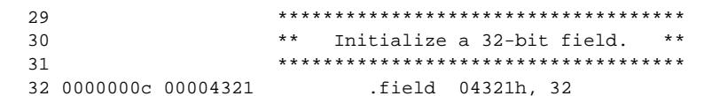

**Listing fragment (lines 29–32 of the .field example).** The continuation of the `.field` example listing showing lines 29–31 (comment box: "Initialize a 32-bit field.") and line 32: `32 0000000c 00004321    .field  04321h, 32`, which places the full 32-bit value 04321h into a new word at SPC = 0000000ch.

Figure 5-6 shows how the directives in this example affect memory.

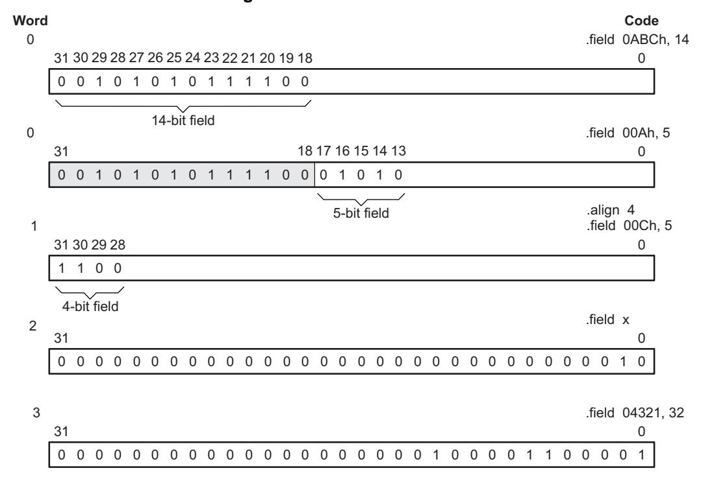

**Figure 5-6: The .field Directive.** Memory diagram showing how `.field` packs consecutive bit fields into 32-bit words. Word 0 (first pass): `.field 0ABCh, 14` places a 14-bit value in bits 31–18. Word 0 (second pass): `.field 00Ah, 5` appends a 5-bit value in bits 17–13 of the same word, labeled "5-bit field". After `.align 4`, a new word boundary begins. Word 1: `.field 0Ch, 4` places a 4-bit value in bits 31–28, labeled "4-bit field". Word 2: `.field x` places the 32-bit relocatable value of label x. Word 3: `.field 04321h, 32` places the full 32-bit value into its own word.

## **.float** *Initialize Single-Precision Floating-Point Value*

**Syntax .float** *value*[**, ... ,** *value<sup>n</sup>* ]

**Description** The **.float** directive places the IEEE single-precision floating-point representation of a single floating-point constant into a word in the current section. The *value* must be an absolute constant expression with an arithmetic type or a symbol equated to an absolute constant expression with an arithmetic type. Each constant is converted to a floatingpoint value in IEEE single-precision 32-bit format.

The 32-bit value is stored exponent byte first, most significant byte of fraction second, and least significant byte of fraction third, in the format shown in Figure 5-7.

**Figure 5-7. Single-Precision Floating-Point Format**

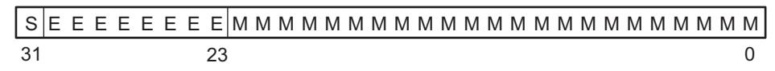

**Figure 5-7: Single-Precision Floating-Point Format.** Bit-field diagram showing the layout of a 32-bit IEEE 754 single-precision value. The single 32-bit word contains: S = sign (bit 31), E = 8-bit exponent (bits 30–23), and M = 23-bit mantissa fraction (bits 22–0). Bit position labels 31, 23, and 0 are shown.

value = (-1)<sup>S</sup> x (1.0 + mantissa) x (2)<sup>exponent-127</sup>

**Legend:** S = sign (1 bit)
E = exponent (8-bit biased)
M = mantissa (23-bit fraction)

When you use .float in a .struct/.endstruct sequence, .float defines a member's size; it does not initialize memory. For more information, see the .struct/.endstruct/.tag topic.

**Example** Following are examples of the .float directive:

```
1 00000000 E9045951    .float  -1.0e25
2 00000004 40400000    .float  3
3 00000008 42F60000    .float  123
```

## **.global/.def/.ref** *Identify Global Symbols*

**Syntax**

**.global** *symbol1*[**, ... ,** *symboln* ]
**.def** *symbol1*[**, ... ,** *symboln* ]
**.ref** *symbol1*[**, ... ,** *symboln* ]

**Description** Three directives identify global symbols that are defined externally or can be referenced externally:

The **.def** directive identifies a symbol that is defined in the current module and can be accessed by other files. The assembler places this symbol in the symbol table.

The **.ref** directive identifies a symbol that is used in the current module but is defined in another module. The linker resolves this symbol's definition at link time.

The **.global** directive acts as a .ref or a .def, as needed.

A *global symbol* is defined in the same manner as any other symbol; that is, it appears as a label or is defined by the .set, .equ, .bss, or .usect directive. If a global symbol is defined more than once, the linker issues a multiple-definition error. (The assembler can provide a similar multiple-definition error for local symbols.) The .ref directive always creates a symbol table entry for a symbol, whether the module uses the symbol or not; .global, however, creates an entry only if the module actually uses the symbol.

A symbol can be declared global for either of two reasons:

- If the symbol is *not defined in the current module* (which includes macro, copy, and include files), the .global or .ref directive tells the assembler that the symbol is defined in an external module. This prevents the assembler from issuing an unresolved reference error. At link time, the linker looks for the symbol's definition in other modules.
- If the symbol is *defined in the current module*, the .global or .def directive declares that the symbol and its definition can be used externally by other modules. These types of references are resolved at link time.

**Example** This example shows four files. The file1.lst and file2.lst refer to each other for all symbols used; file3.lst and file4.lst are similarly related.

The **file1.lst** and **file3.lst** files are equivalent. Both files define the symbol INIT and make it available to other modules; both files use the external symbols X, Y, and Z. Also, file1.lst uses the .global directive to identify these global symbols; file3.lst uses .ref and .def to identify the symbols.

The **file2.lst** and **file4.lst** files are equivalent. Both files define the symbols X, Y, and Z and make them available to other modules; both files use the external symbol INIT. Also, file2.lst uses the .global directive to identify these global symbols; file4.lst uses .ref and .def to identify the symbols.

**file1.lst**

```
1 ; Global symbol defined in this file
2 .global INIT
3 ; Global symbols defined in file2.lst
4 .global X, Y, Z
5 00000000 INIT:
6 00000000 E2800056 ADD R0, R0, 56h
7 00000004 00000000! .word X
8 ; .
9 ; .
10 ; .
11 .end
```

**file2.lst**

```
   1 ; Global symbols defined in this file
   2 .global X, Y, Z
   3 ; Global symbol defined in file1.lst
   4 .global INIT
   5 00000001 X: .set 1
   6 00000002 Y: .set 2
   7 00000003 Z: .set 3
   8 00000000 00000000! .word INIT
   9 ; .
  10 ; .
  11 ; .
  12 .end
```

**file3.lst**

```
   1 ; Global symbols defined in this file
   2 .def INIT
   3 ; Global symbol defined in file4.lst
   4 .ref X, Y, Z
   5 00000000 INIT:
   6 00000000 E2800056 ADD R0, R0, 56
   7 00000004 00000000! .word X
   8 ; .
   9 ; .
  10 ; .
  11 .end
```

**file4.lst**

```
   1 ; Global symbols defined in this file
   2 .def X, Y, Z
   3 ; Global symbol defined in file3.lst
   4 .ref INIT
   5 00000001 X: .set 1
   6 00000002 Y: .set 2
   7 00000003 Z: .set 3
   8 00000000 00000000! .word INIT
   9 ; .
  10 ; .
  11 ; .
  12 .end
```

## **.group/.gmember/.endgroup** *Define Common Data Section*

**Syntax .group** *group section name group type*

**.gmember** *section name*

**.endgroup**

**Description** Three directives instruct the assembler to make certain sections members of an ELF group section (see the ELF specification for more information on group sections).

The **.group** directive begins the group declaration. The *group section name* designates the name of the group section. The *group type* designates the type of the group. The following types are supported:

- 0x0   Regular ELF group
- 0x1   COMDAT ELF group

Duplicate COMDAT (common data) groups are allowed in multiple modules; the linker keeps only one. Creating such duplicate groups is useful for late instantiation of C++ templates and for providing debugging information.

The **.gmember** directive designates *section name* as a member of the group.

The **.endgroup** directive ends the group declaration.

## **.half/.short/.uhalf/.ushort** *Initialize 16-Bit Integers*

**Syntax**

**.half** *value1*[**, ... ,** *valuen* ]
**.short** *value1*[**, ... ,** *valuen* ]
**.uhalf** *value1*[**, ... ,** *valuen* ]
**.ushort** *value1*[**, ... ,** *valuen* ]

**Description** The **.half** and **.short** directives place one or more values into consecutive halfwords in the current section. A *value* can be either:

- An expression that the assembler evaluates and treats as a 16-bit signed or unsigned number
- A character string enclosed in double quotes. Each character in a string represents a separate value and is stored alone in the least significant eight bits of a 16-bit field, which is padded with 0s.

The assembler truncates values greater than 16 bits.

If you use a label with .half or .short, it points to the location where the assembler places the first byte.

These directives perform a halfword (16-bit) alignment before data is written to the section. This guarantees that data resides on a 16-bit boundary.

When you use .half or .short in a .struct/.endstruct sequence, they define a member's size; they do not initialize memory. For more information, see the .struct/.endstruct/.tag topic.

**Example** In this example, .half is used to place 16-bit values (10, -1, abc, and a) into consecutive halfwords in memory; .short is used to place 16-bit values (8, -3, def, and b) into consecutive halfwords in memory. The label STRN has the value 100ch, which is the location of the first initialized halfword for .short.

```
1 00000000 .space 100h * 16
2 00001000 000A .half 10, -1, "abc", 'a'
 00001002 FFFF
 00001004 0061
 00001006 0062
 00001008 0063
 0000100a 0061
3 0000100c 0008 STRN .short 8, -3, "def", 'b'
 0000100e FFFD
 00001010 0064
 00001012 0065
 00001014 0066
 00001016 0062
```

## **.if/.elseif/.else/.endif** *Assemble Conditional Blocks*

**Syntax .if** *condition*

[**.elseif** *condition*]

[**.else**]

**.endif**

**Description** These directives provide conditional assembly:

The **.if** directive marks the beginning of a conditional block. The *condition* is a required parameter.

- If the expression evaluates to true (nonzero), the assembler assembles the code that follows the expression (up to a .elseif, .else, or .endif).
- If the expression evaluates to false (0), the assembler assembles code that follows a .elseif (if present), .else (if present), or .endif (if no .elseif or .else is present).

The **.elseif** directive identifies a block of code to be assembled when the .if expression is false (0) and the .elseif expression is true (nonzero). When the .elseif expression is false, the assembler continues to the next .elseif (if present), .else (if present), or .endif (if no .elseif or .else is present). The .elseif is optional in a conditional block, and more than one .elseif can be used. If an expression is false and there is no .elseif, the assembler continues with the code that follows a .else (if present) or a .endif.

The **.else** directive identifies a block of code that the assembler assembles when the .if expression and all .elseif expressions are false (0). The .else directive is optional in the conditional block; if an expression is false and there is no .else statement, the assembler continues with the code that follows the .endif. The .elseif and .else directives can be used in the same conditional assembly block.

The **.endif** directive terminates a conditional block.

See Section 4.8.2 for information about relational operators.

**Example** This example shows conditional assembly:

```
1 00000001 SYM1 .set 1
2 00000002 SYM2 .set 2
3 00000003 SYM3 .set 3
4 00000004 SYM4 .set 4
5
6 If_4: .if SYM4 = SYM2 * SYM2
7 00000000 04 .byte SYM4 ; Equal values
8 .else
9 .byte SYM2 * SYM2 ; Unequal values
10 .endif
11
12 If_5: .if SYM1 <= 10
13 00000001 0A .byte 10 ; Less than / equal
14 .else
15 .byte SYM1 ; Greater than
16 .endif
17
18 If_6: .if SYM3 * SYM2 != SYM4 + SYM2
19 .byte SYM3 * SYM2 ; Unequal value
20 .else
21 00000002 08 .byte SYM4 + SYM4 ; Equal values
22 .endif
23
24 If_7: .if SYM1 = SYM2
25 .byte SYM1
26 .elseif SYM2 + SYM3 = 5
27 00000003 05 .byte SYM2 + SYM3
28 .endif
```

## **.int/.unint/.long/.ulong/.word/.uword** *Initialize 32-Bit Integers*

**Syntax**

**.int** *value1*[**, ... ,** *valuen* ]
**.uint** *value1*[**, ... ,** *valuen* ]
**.long** *value1*[**, ... ,** *valuen* ]
**.ulong** *value1*[**, ... ,** *valuen* ]
**.word** *value1*[**, ... ,** *valuen* ]
**.uword** *value1*[**, ... ,** *valuen* ]

**Description** The **.int**, **.unint**, **.word**, and **.uword** directives place one or more values into consecutive words in the current section. Each value is placed in a 32-bit word by itself and is aligned on a word boundary. A *value* can be either:

- An expression that the assembler evaluates and treats as a 32-bit signed or unsigned number
- A character string enclosed in double quotes. Each character in a string represents a separate value and is stored alone in the least significant eight bits of a 32-bit field, which is padded with 0s.

A value can be either an absolute or a relocatable expression. If an expression is relocatable, the assembler generates a relocation entry that refers to the appropriate symbol; the linker can then correctly patch (relocate) the reference. This allows you to initialize memory with pointers to variables or labels.

If you use a label with these directives, it points to the first word that is initialized.

When you use these directives in a .struct/.endstruct sequence, they define a member's size; they do not initialize memory. See the .struct/.endstruct/.tag topic.

**Example 1** This example uses the .int directive to initialize words.

```
1 00000000 .space 73h
2 00000000 .bss PAGE, 128
3 00000080 .bss SYMPTR, 4
4 00000074 E3A00056 INST: LDI R0, 056h
5 00000078 0000000A .int 10, SYMPTR, -1, 35 + 'a', INST, "abc"
 0000007c 00000080-
 00000080 FFFFFFFF
 00000084 00000084
 00000088 00000074'
 0000008c 00000061
 00000090 00000062
 00000094 00000063
```

**Example 2** This example shows how the .long directive initializes words. The symbol DAT1 points to the first word that is reserved.

```
1 00000000 0000ABCD DAT1: .long 0ABCDh, 'A' + 100h, 'g', 'o'
 00000004 00000141
 00000008 00000067
 0000000c 0000006F
2 00000010 00000000' .long DAT1, 0AABBCCDDh
 00000014 AABBCCDD
3 00000018 DAT2:
```

**Example 3** In this example, the .word directive is used to initialize words. The symbol WORDX points to the first word that is reserved.

```
1 00000000 00000C80 WORDX: .word 3200, 1 + 'AB', -0AFh, 'X'
 00000004 00004242
 00000008 FFFFFF51
 0000000c 00000058
```

## **.length/.width** *Set Listing Page Size*

**Syntax** **.length** [*page length*]

**.width** [*page width*]

**Description**

Two directives allow you to control the size of the output listing file.

The **.length** directive sets the page length of the output listing file. It affects the current and following pages. You can reset the page length with another .length directive.

- Default length: 60 lines. If you do not use the .length directive or if you use the .length directive without specifying the *page length*, the output listing length defaults to 60 lines.
- Minimum length: 1 line
- Maximum length: 32 767 lines

The **.width** directive sets the page width of the output listing file. It affects the next line assembled and the lines following. You can reset the page width with another .width directive.

- Default width: 132 characters. If you do not use the .width directive or if you use the .width directive without specifying a page width, the output listing width defaults to 132 characters.
- Minimum width: 80 characters
- Maximum width: 200 characters

The width refers to a full line in a listing file; the line counter value, SPC value, and object code are counted as part of the width of a line. Comments and other portions of a source statement that extend beyond the page width are truncated in the listing.

The assembler does not list the .width and .length directives.

**Example** The following example shows how to change the page length and width.

```
*********************************************
**       Page length = 65 lines          **
**       Page width = 85 characters      **
*********************************************
         .length    65
         .width     85

*********************************************
**       Page length = 55 lines          **
**       Page width = 100 characters     **
*********************************************
         .length    55
         .width     100
```

## **.list/.nolist** *Start/Stop Source Listing*

**Syntax** **.list**

**.nolist**

**Description** Two directives enable you to control the printing of the source listing:

The **.list** directive allows the printing of the source listing.

The **.nolist** directive suppresses the source listing output until a .list directive is encountered. The .nolist directive can be used to reduce assembly time and the source listing size. It can be used in macro definitions to suppress the listing of the macro expansion.

The assembler does not print the .list or .nolist directives or the source statements that appear after a .nolist directive. However, it continues to increment the line counter. You can nest the .list/.nolist directives; each .nolist needs a matching .list to restore the listing.

By default, the source listing is printed to the listing file; the assembler acts as if the .list directive had been used. However, if you do not request a listing file when you invoke the assembler by including the --asm\_listing option on the command line (see Section 4.3), the assembler ignores the .list directive.

**Example** This example shows how the .copy directive inserts source statements from another file. The first time this directive is encountered, the assembler lists the copied source lines in the listing file. The second time this directive is encountered, the assembler does not list the copied source lines, because a .nolist directive was assembled. The .nolist, the second .copy, and the .list directives do not appear in the listing file. Also, the line counter is incremented, even when source statements are not listed.

**Source file:**

```
.copy "copy2.asm"
* Back in original file
   NOP
   .nolist
   .copy "copy2.asm"
   .list
* Back in original file
   .string "Done"
```

**Listing file:**

```
1 .copy "copy2.asm"
A 1 * In copy2.asm (copy file)
A 2 00000000 00000020 .word 32, 1 + 'A'
     00000004 00000042
    2 * Back in original file
    3 00000008 E1A00000 NOP
    7 * Back in original file
    8 00000014 44 .string "Done"
     00000015 6F
     00000016 6E
     00000017 65
```

## **.loop/.endloop/.break** *Assemble Code Block Repeatedly*

**Syntax** **.loop** [*count*]

**.break** [*end-condition*]

**.endloop**

**Description** Three directives allow you to repeatedly assemble a block of code:

The **.loop** directive begins a repeatable block of code. The optional *count* operand, if used, must be a well-defined integer expression. The *count* indicates the number of loops to be performed (the loop count). If *count* is omitted, it defaults to 1024. The loop will be repeated count number of times, unless terminated early by a .break directive.

The optional **.break** directive terminates a .loop early. You may use .loop without using .break. The .break directive terminates a .loop only if the *end-condition* expression is true (evaluates to nonzero). If the optional *end-condition* operand is omitted, it defaults to true. If *end-condition* is true, the assembler stops repeating the .loop body immediately; any remaining statements after .break and before .endloop are not assembled. The assembler resumes assembling with the statement after the .endloop directive. If *endcondition* is false (evaluates to 0), the loop continues.

The **.endloop** directive marks the end of a repeatable block of code. When the loop terminates, whether by a .break directive with a true *end-condition* or by performing the loop count number of iterations, the assembler stops repeating the loop body and resumes assembling with the statement after the .endloop directive.

**Example** This example illustrates how these directives can be used with the .eval directive. The code in the first six lines expands to the code immediately following those six lines.

```
1                      .eval    0,x
2       COEF           .loop
3                      .word    x*100
4                      .eval    x+1, x
5                      .break   x = 6
6                      .endloop
1 00000000 00000000    .word    0*100
1                      .eval    0+1, x
1                      .break   1 = 6
1 00000004 00000064    .word    1*100
1                      .eval    1+1, x
1                      .break   2 = 6
1 00000008 000000C8    .word    2*100
1                      .eval    2+1, x
1                      .break   3 = 6
1 0000000c 0000012C    .word    3*100
1                      .eval    3+1, x
1                      .break   4 = 6
1 00000010 00000190    .word    4*100
1                      .eval    4+1, x
1                      .break   5 = 6
1 00000014 000001F4    .word    5*100
1                      .eval    5+1, x
1                      .break   6 = 6
```

## **.macro/.endm** *Define Macro*

**Syntax** *macname* **.macro** [*parameter<sup>1</sup>* [**, ... ,** *parameter<sup>n</sup>*]]

*model statements or macro directives*

**.endm**

**Description** The **.macro** and **.endm** directives are used to define macros.

You can define a macro anywhere in your program, but you must define the macro before you can use it. Macros can be defined at the beginning of a source file, in an .include/.copy file, or in a macro library.

*macname* — names the macro. You must place the name in the source statement's label field.

**.macro** — identifies the source statement as the first line of a macro definition. You must place .macro in the opcode field.

[*parameters*] — are optional substitution symbols that appear as operands for the .macro directive.

*model statements* — are instructions or assembler directives that are executed each time the macro is called.

*macro directives* — are used to control macro expansion. **.endm** marks the end of the macro definition.

Macros are explained in further detail in Chapter 6.

## **.mlib** *Define Macro Library*

**Syntax** **.mlib "***filename***"**

**Description** The **.mlib** directive provides the assembler with the *filename* of a macro library. A macro library is a collection of files that contain macro definitions. The macro definition files are bound into a single file (called a library or archive) by the archiver.

Each file in a macro library contains one macro definition that corresponds to the name of the file. The *filename* of a macro library member must be the same as the macro name, and its extension must be .asm. The filename must follow host operating system conventions; it can be enclosed in double quotes. You can specify a full pathname (for example, c:\320tools\macs.lib). If you do not specify a full pathname, the assembler searches for the file in the following locations in the order given:

1. The directory that contains the current source file
2. Any directories named with the --include\_path assembler option
3. Any directories specified by the PRU\_A\_DIR environment variable
4. Any directories specified by the PRU\_A\_DIR environment variable

See Section 4.4 for more information about the --include\_path option.

A .mlib directive causes the assembler to open the library specified by *filename* and create a table of the library's contents. The assembler stores names of individual library members in the opcode table as library entries. This redefines any existing opcodes or macros with the same name. If one of these macros is called, the assembler extracts the library entry and loads it into the macro table. The assembler expands the library entry as it does other macros, but it does not place the source code in the listing. Only macros called from the library are extracted, and they are extracted only once.

**Example** The code creates a macro library that defines two macros, inc4.asm and dec4.asm. The file inc4.asm contains the definition of inc4 and dec4.asm contains the definition of dec4.

| inc4.asm                                                       | dec4.asm                                                       |
|----------------------------------------------------------------|----------------------------------------------------------------|
| * Macro for incrementing<br>inc4 .macro reg1, reg2, reg3, reg4 | * Macro for decrementing<br>dec4 .macro reg1, reg2, reg3, reg4 |
| Add reg1, reg1, 1                                              | SUB reg1, reg1, 1                                              |
| ADD reg2, reg2, 1                                              | SUB reg2, reg2, 1                                              |
| ADD reg3, reg3, 1<br>ADD reg4, reg4, 1                         | SUB reg3, reg3, 1<br>SUB reg4, reg4, 1                         |
| .endm                                                          | .endm                                                          |

Use the archiver to create a macro library:

```
armar -a mac inc4.asm dec4.asm
ar32 -a mac inc4.asm dec4.asm
```

Now you can use the .mlib directive to reference the macro library and define the inc4.asm and dec4.asm macros:

```
1 .mlib "mac.lib"
    2 ; Macro call
    3 00000000 inc4 R7, R6, R5, R4
1 00000000 E2877001 ADD R7, R7, 1
1 00000004 E2866001 ADD R6, R6, 1
1 00000008 E2855001 ADD R5, R5, 1
1 0000000c E2844001 ADD R4, R4, 1
    4
    5 ; Macro call
    6 00000010 dec4 R0, R1, R2, R3
1 00000010 E2400001 SUB R0, R0, 1
1 00000014 E2411001 SUB R1, R1, 1
1 00000018 E2422001 SUB R2, R2, 1
1 0000001c E2433001 SUB R3, R3, 1
```

## **.mlist/.mnolist** *Start/Stop Macro Expansion Listing*

**Syntax .mlist**

**.mnolist**

**Description** Two directives enable you to control the listing of macro and repeatable block expansions in the listing file:

The **.mlist** directive allows macro and .loop/.endloop block expansions in the listing file.

The **.mnolist** directive suppresses macro and .loop/.endloop block expansions in the listing file.

By default, the assembler behaves as if the .mlist directive had been specified.

See Chapter 6 for more information on macros and macro libraries. See the .loop/.break/.endloop topic for information on conditional blocks.

**Example** This example defines a macro named STR\_3. The first time the macro is called, the macro expansion is listed (by default). The second time the macro is called, the macro expansion is not listed, because a .mnolist directive was assembled. The third time the macro is called, the macro expansion is again listed because a .mlist directive was assembled.

```
1 STR_3 .macro P1, P2, P3
     2 .string ":p1:", ":p2:", ":p3:"
     3 .endm
     4
     5 00000000 STR_3 "as", "I", "am" ; Invoke STR_3 macro.
1 00000000 3A .string ":p1:", ":p2:", ":p3:"
      00000001 70
      00000002 31
      00000003 3A
      00000004 3A
      00000005 70
      00000006 32
      00000007 3A
      00000008 3A
      00000009 70
      0000000a 33
      0000000b 3A
     6 .mnolist ; Suppress expansion.
     7 0000000c STR_3 "as", "I", "am" ; Invoke STR_3 macro.
     8 .mlist ; Show macro expansion.
     9 00000018 STR_3 "as", "I", "am" ; Invoke STR_3 macro.
1 00000018 3A .string ":p1:", ":p2:", ":p3:"
      00000019 70
      0000001a 31
      0000001b 3A
      0000001c 3A
      0000001d 70
      0000001e 32
      0000001f 3A
      00000020 3A
      00000021 70
      00000022 33
      00000023 3A
```

## **.newblock** *Terminate Local Symbol Block*

**Syntax** **.newblock**

**Description** The **.newblock** directive undefines any local labels currently defined. Local labels, by nature, are temporary; the .newblock directive resets them and terminates their scope.

A local label is a label in the form \$*n*, where *n* is a single decimal digit, or *name*?, where *name* is a legal symbol name. Unlike other labels, local labels are intended to be used locally, and cannot be used in expressions. They can be used only as operands in 8-bit jump instructions. Local labels are not included in the symbol table.

After a local label has been defined and (perhaps) used, you should use the .newblock directive to reset it. The .text, .data, and .sect directives also reset local labels. Local labels that are defined within an include file are not valid outside of the include file.

See Section 4.7.3 for more information on the use of local labels.

**Example**

```
 1
 2
 3
 4 sign_extend_32_8 .macro dest, src
     5 .newblock
     6 MOV dest, src
     7 QBBC $1, dest, 7
     8 FILL &dest.b1, 3
     9$1:
    10 .endm
    11
    12
    13 .global sign_extend
    14 00000000 sign_extend
    15 00000000 sign_extend_32_8 R14, R14.b0
1 .newblock
1 00000000 000000100E0EEE MOV R14, R14.b0
1 00000004 000000C907EE02 QBBC $1, R14, 7
1 00000008 0000002EFF012E FILL &R14.b1, 3
1 $1:
    16 0000000c 00000020C30000 JMP R3.w2
```

## **.option** *Select Listing Options*

**Syntax** **.option** *option₁*[, *option₂*, . . .]

**Description**

The **.option** directive selects options for the assembler output listing. The *options* must be separated by commas; each option selects a listing feature. These are valid options:

- **A** turns on listing of all directives and data, and subsequent expansions, macros, and blocks.
- **B** limits the listing of .byte and .char directives to one line.
- **H** limits the listing of .half and .short directives to one line.
- **L** limits the listing of .long directives to one line.
- **M** turns off macro expansions in the listing.
- **N** turns off listing (performs .nolist).
- **O** turns on listing (performs .list).
- **R** resets any B, H, M, T, and W (turns off the limits of B, H, M, T, and W).
- **T** limits the listing of .string directives to one line.
- **W** limits the listing of .word and .int directives to one line.
- X produces a cross-reference listing of symbols. You can also obtain a cross-reference listing by invoking the assembler with the --asm\_listing\_cross\_reference option (see Section 4.3).

Options are not case sensitive.

**Example** This example shows how to limit the listings of the .byte, .char, .int, long, .word, and .string directives to one line each.

```
 1
 2    *************************************************************
 3    **  Limit the listing of .byte, .char, .int, .long,       **
 4    **    .word, and .string directives to 1 line each.        **
 5    *************************************************************
               .option B, W, T
 6 00000000 BD          .byte   -'C', 0B0h, 5
 7 00000003 BC          .char   -'D', 0C0h, 6
 8 00000008 0000000A    .int    10, 35 + 'a', "abc"
 9 0000001c AABBCCDD    .long   OAABBCCDDh, 536 + 'A'
10 00000024 000015AA    .word   5546, 78h
11 0000002c 45          .string "Extended Registers"
12
13
14    *************************************************************
15    **             Reset the listing options.                  **
16    *************************************************************
               .option R
17 0000003e BD          .byte   -'C', 0B0h, 5
   0000003f B0
   00000040 05
18 00000041 BC          .char   -'D', 0C0h, 6
   00000042 C0
   00000043 06
19 00000044 0000000A    .int    10, 35 + 'a', "abc"
   00000048 00000084
   0000004c 00000061
   00000050 00000062
   00000054 00000063
20 00000058 AABBCCDD    .long   OAABBCCDDh, 536 + 'A'
   0000005c 00000259
21 00000060 000015AA    .word   5546, 78h
   00000064 00000078
22 00000068 45          .string "Extended Registers"
   00000069 78
   0000006a 74
   0000006b 65
   0000006c 6E
   0000006d 64
   0000006e 65
   0000006f 64
   00000070 20
   00000071 52
   00000072 65
   00000073 67
   00000074 69
   00000075 73
   00000076 74
   00000077 65
   00000078 72
   00000079 73
```

## **.page** *Eject Page in Listing*

**Syntax** **.page**

**Description** The **.page** directive produces a page eject in the listing file. The .page directive is not printed in the source listing, but the assembler increments the line counter when it encounters the .page directive. Using the .page directive to divide the source listing into logical divisions improves program readability.

**Example** This example shows how the .page directive causes the assembler to begin a new page of the source listing.

**Source file:**

```
Source file (generic)
      .title "**** Page Directive Example ****"
; .
; .
; .
      .page
```

**Listing file:**

```
PRU Assembler Version x.xx Day Time Year
Copyright (c) 2012-2014 Texas Instruments Incorporated
**** Page Directive Example **** PAGE 1
    2 ; .
    3 ; .
    4 ; .
PRU Assembler Version x.xx Day Time Year
Copyright (c) 2012-2014 Texas Instruments Incorporated
**** Page Directive Example **** PAGE 2
```

No Errors, No Warnings

## **.retain/.retainrefs** *Conditionally Retain Sections In Object Module Output*

**Syntax** **.retain**[**"***section name***"**]

**.retainrefs**[**"***section name***"**]

**Description** The **.retain** directive indicates that the current or specified section is not eligible for removal via conditional linking. You can also override conditional linking for a given section with the --retain linker option. You can disable conditional linking entirely with the --unused\_section\_elimination=off linker option.

The **.retainrefs** directive indicates that any sections that refer to the current or specified section are not eligible for removal via conditional linking.

The *section name* identifies the section. If the directive is used without a section name, it applies to the current initialized section. If the directive is applied to an uninitialized section, the section name is required. The section name must be enclosed in double quotes. A section name can contain a subsection name in the form *section name***:***subsection name*.

The linker assumes that all sections by default are eligible for removal via conditional linking. (However, the linker does automatically retain the .reset section.) The .retain directive is useful for overriding this default conditional linking behavior for sections that you want to keep included in the link, even if the section is not referenced by any other section in the link. For example, you could apply a .retain directive to an interrupt function that you have written in assembly language, but which is not referenced from any normal entry point in the application.

## **.sassign** *Map defined structure onto PRU registers*

**Syntax** *label* **.sassign** *structure*, *start\_reg*, *structure*

**Description** The **.sassign** directive is used to map a defined structure onto the PRU registers.

The *label* is a symbol that can be used to reference the mapped structure.

The *start\_reg* is the first register into which the structure is placed. An .sassign directive can begin at any register boundary. If the structure requires more than 32 bits of storage, multiple registers will be used as needed. Some structures require specific alignments due to how their fields are arranged within the structure. The assembler generates an error if the structure alignment requirements can not be met with the specified starting register. This argument is required.

The *structure* is a type of structure that has been previously defined using the .struct directive. This argument is required.

**Example** This example causes a structure of type MyStruct to be mapped to registers beginning at

R4. The structure can be referenced with the MyName1 label.

MyName1 .sassign R4, MyStruct

## **.sect** *Assemble Into Named Section*

**Syntax** 

```
.sect " section name "
.sect " section name " [,{RO|RW}] [,{ALLOC|NOALLOC}]
```

**Description**

The .sect directive defines a named section that can be used like the default .text and .data sections. The .sect directive sets *section name* to be the current section; the lines that follow are assembled into the *section name* section.

The section name identifies the section. The section name must be enclosed in double quotes. A section name can contain a subsection name in the form section name: subsection name. See Chapter 2 for more information about sections.

The sections can be marked read-only (RO) or read-write (RW). Also, the sections can be marked for allocation (ALLOC) or no allocation (NOALLOC). These attributes can be specified in any order, but only one attribute from each set can be selected. RO conflicts with RW, and ALLOC conflicts with NOALLOC. If conflicting attributes are specified the assembler generates an error, for example:

```
"t.asm", ERROR! at line 1:[E0000] Attribute RO cannot be combined with attr RW .sect "illegal_sect",RO,RW
```

**Example** This example defines two special-purpose sections, Sym\_Defs and Vars, and assembles code into them.

```
 1    *************************************************************
 2    **        Begin assembling into .text section.             **
 3    *************************************************************
 4 00000000              .text
 5 00000000 E3A00078      LDI    R0, 78h
 6 00000004 E2801078      ADD    R1, R0, 78h
 7    *************************************************************
 8    **     Begin assembling into Sym_Defs section.             **
 9    *************************************************************
10 00000000              .sect   "Sym_Defs"
11 00000000 3D4CCCCD      .float  0.05           ; Assembled into Sym_Defs
12 00000004 000000AA X:   .word   0AAh           ; Assembled into Sym_Defs
13 00000008 E2833028      ADD    R3, R3, 28h     ; Assembled into Sym_Defs
14    *************************************************************
15    **        Begin assembling into Vars section.              **
16    *************************************************************
17 00000000              .sect   "Vars"
18 00000010 WORD_LEN      .set    16
19 00000020 DWORD_LEN     .set    WORD_LEN * 2
20 00000008 BYTE_LEN      .set    WORD_LEN / 2
21    *************************************************************
22    **       Resume assembling into .text section.             **
23    *************************************************************
24 00000008              .text
25 00000008 E2802042      ADD    R2, R0, 42h     ; Assembled into .text
26 0000000c 03            .byte   3, 4           ; Assembled into .text
   0000000d 04
27    *************************************************************
28    **       Resume assembling into Vars section.              **
29    *************************************************************
30 00000000              .sect   "Vars"
31 00000000 000D0000      .field  13, WORD_LEN
32 00000000 000D0A00      .field  0Ah, BYTE_LEN
33 00000004 00000008      .field  10q, DWORD_LEN
```

## **.set/.equ** *Define Assembly-Time Constant*

**Syntax** 

symbol .set value symbol .equ value

**Description**

The .set and .equ directives equate a constant value to a .set symbol. The symbol can then be used in place of a value in assembly source. This allows you to equate meaningful names with constants and other values. The .set and .equ directives are identical and can be used interchangeably.

- The symbol is a label that must appear in the label field.
- The *value* must be a well-defined expression, that is, all symbols in the expression must be previously defined in the current source module.

Undefined external symbols and symbols that are defined later in the module cannot be used in the expression. If the expression is relocatable, the symbol to which it is assigned is also relocatable.

The value of the expression appears in the object field of the listing. This value is not part of the actual object code and is not written to the output file.

Symbols defined with .set or .equ can be made externally visible with the .def or .global directive (see the .global/.def/.ref topic). In this way, you can define global absolute constants.

**Example** This example shows how symbols can be assigned with .set and .equ.

```
 1    *************************************************************
 2    **   Equate symbol AUX_R1 to register AR1 and use         **
 3    **         it instead of the register.                    **
 4    *************************************************************
 5 00000001 AUX_R1        .set    R1
 6 00000000 E3A01056      LDI    AUX_R1, 56h
 7
 8    *************************************************************
 9    **   Set symbol index to an integer expression.           **
10    **         and use it as an immediate operand.            **
11    *************************************************************
12 00000035 INDEX         .equ    100/2 + 3
13 00000004 E2810035      ADD    R0, AUX_R1, INDEX
14
15    *************************************************************
16    **   Set symbol SYMTAB to a relocatable expression.       **
17    **         and use it as a relocatable operand.           **
18    *************************************************************
19 00000008 0000000A LABEL .word   10
20 00000009' SYMTAB        .set    LABEL + 1
21
22    *************************************************************
23    **   Set symbol NSYMS equal to the symbol INDEX           **
24    **         INDEX and use it as you would INDEX.           **
25    *************************************************************
26 00000035 NSYMS         .set    INDEX
27 0000000c 00000035       .word   NSYMS
```

## **.space/.bes** *Reserve Space*

**Syntax**

[*label*] **.space** *size in bytes*

[*label*] **.bes** *size in bytes*

**Description**

The **.space** and **.bes** directives reserve the number of bytes given by *size in* bytes in the current section and fill them with 0s. The section program counter is incremented to point to the word following the reserved space.

When you use a label with the .space directive, it points to the *first*byte reserved. When you use a label with the .bes directive, it points to the *last* byte reserved.

**Example** This example shows how memory is reserved with the .space and .bes directives.

```
 1    *************************************************************
 2    **       Begin assembling into the .text section.         **
 3    *************************************************************
 4 00000000              .text
 5
 6    *************************************************************
 7    **       Reserve 0F0 bytes in the .text section.          **
 8    *************************************************************
 9 00000000              .space  0F0h
10 000000f0 00000100      .word   100h, 200h
   000000f4 00000200
11    *************************************************************
12    **      Begin assembling into the .data section.          **
13    *************************************************************
14 00000000              .data
15 00000000 49            .string "In .data"
   00000001 6E
   00000002 20
   00000003 2E
   00000004 64
   00000005 61
   00000006 74
   00000007 61
16    *************************************************************
17    **    Reserve 100 bytes in the .data section; RES_1       **
18    **       points to the first byte that contains           **
19    **                  reserved bytes.                       **
20    *************************************************************
21 00000008 RES_1:         .space  100
22 0000006c 0000000F       .word   15
23 00000070 00000008'      .word   RES_1
24    *************************************************************
25    **    Reserve 20 bytes in the .data section; RES_2        **
26    **       points to the last byte that contains            **
27    **                  reserved bytes.                       **
28    *************************************************************
29
30 00000087 RES_2:         .bes    20
31 00000088 00000036       .word   36h
32 0000008c 00000087'      .word   RES_2
```

## **.sslist/.ssnolist** *Control Listing of Substitution Symbols*

**Syntax** **.sslist**

**.ssnolist**

**Description** Two directives allow you to control substitution symbol expansion in the listing file:

The **.sslist** directive allows substitution symbol expansion in the listing file. The expanded line appears below the actual source line.

The **.ssnolist** directive suppresses substitution symbol expansion in the listing file.

By default, all substitution symbol expansion in the listing file is suppressed; the assembler acts as if the .ssnolist directive had been used.

Lines with the pound (#) character denote expanded substitution symbols.

**Example** This example shows code that, by default, suppresses the listing of substitution symbol expansion, and it shows the .sslist directive assembled, instructing the assembler to list substitution symbol code expansion.

**Default listing file without .sslist:**

```
1 .asg r14, ARG1
2 .asg r15, ARG2
3
4 00000000 0000005100EE02 QBEQ $1, ARG1, 0
5 00000004 0000000101EEEE ADD r14, ARG1, 1
6$1:
7 .newblock
8
9 00000008 0000005100EF02 QBEQ $1, ARG2, 0
10 0000000c 0000000101EFEF ADD r15, ARG2, 1
11 00000010 $1:
12 00000010 00000020C30000 JMP r3.w2
```

**Listing with .sslist added:**

```
1 .sslist
    2
    3 .asg r14, ARG1
    4 .asg r15, ARG2
    5
    6 00000000 0000005100EE02 QBEQ $1, ARG1, 0
# QBEQ $1, r14, 0
    7 00000004 0000000101EEEE ADD r14, ARG1, 1
# ADD r14, r14, 1
    8$1:
    9 .newblock
   10
   11 00000008 0000005100EF02 QBEQ $1, ARG2, 0
# QBEQ $1, r15, 0
   12 0000000c 0000000101EFEF ADD r15, ARG2, 1
# ADD r15, r15, 1
   13 00000010 $1:
   14 00000010 00000020C30000 JMP r3.w2
```

## **.string/.cstring** *Initialize Text*

**Syntax** **.string** {*expr<sub>1</sub>* | "*string<sub>1</sub>*"} [**, ... ,** {*expr<sub>n</sub>* | "*string<sub>n</sub>*"} ]

**.cstring** {*expr<sub>1</sub>* | "*string<sub>1</sub>*"} [**, ... ,** {*expr<sub>n</sub>* | "*string<sub>n</sub>*"} ]

**Description** The **.string** and **.cstring** directives place 8-bit characters from a character string into the current section. The *expr* or *string* can be one of the following:

- An expression that the assembler evaluates and treats as an 8-bit signed number.
- A character string enclosed in double quotes. Each character in a string represents a separate value, and values are stored in consecutive bytes. The entire string *must* be enclosed in quotes.

The .cstring directive adds a NUL character needed by C; the .string directive does not add a NUL character. In addition, .cstring interprets C escapes (\\ \a \b \f \n \r \t \v \<octal>).

The assembler truncates any values that are greater than eight bits. Operands must fit on a single source statement line.

If you use a label, it points to the location of the first byte that is initialized.

When you use .string and .cstring in a .struct/.endstruct sequence, the directive only defines a member's size; it does not initialize memory. For more information, see the .struct/.endstruct/.tag topic.

**Example** In this example, 8-bit values are placed into consecutive bytes in the current section.

```
1 00000000 41 Str_Ptr: .string "ABCD"
 00000001 42
 00000002 43
 00000003 44
2 00000004 41 .string 41h, 42h, 43h, 44h
 00000005 42
 00000006 43
 00000007 44
3 00000008 41 .string "Austin", "Houston", "Dallas"
 00000009 75
 0000000a 73
 0000000b 74
 0000000c 69
 0000000d 6E
 0000000e 48
 0000000f 6F
 00000010 75
 00000011 73
 00000012 74
 00000013 6F
 00000014 6E
 00000015 44
 00000016 61
 00000017 6C
 00000018 6C
 00000019 61
 0000001a 73
4 0000001b 30 .string 36 + 12
```

## **.struct/.endstruct/.tag** *Declare Structure Type*

**Syntax**

| [stag]           | .struct            | [expr]             |
|------------------|--------------------|--------------------|
| [mem₀]<br>[mem₁] | element<br>element | [expr₀]<br>[expr₁] |
|                  | •                  |                    |
| •                |                    | Ē                  |
| •                | •                  | •                  |
| [mem<sub>n</sub>]        | .tag stag          | [expr<sub>n</sub>]         |
| ·                |                    | •                  |
| •                | •                  | •                  |
| •                | •                  | •                  |
| [mem<sub>N</sub>]        | element            | [expr<sub>N</sub>]         |
| [size]           | .endstruct         |                    |
| label            | .tag               | stag               |

**Description**

The .struct directive assigns symbolic offsets to the elements of a data structure definition. This allows you to group similar data elements together and let the assembler calculate the element offset. This is similar to a C structure or a Pascal record. The struct directive does not allocate memory; it merely creates a symbolic template that can be used repeatedly.

The **.endstruct** directive terminates the structure definition.

The .tag directive gives structure characteristics to a *label*, simplifying the symbolic representation and providing the ability to define structures that contain other structures. The .tag directive does not allocate memory. The structure tag (stag) of a .tag directive must have been previously defined.

Following are descriptions of the parameters used with the .struct, .endstruct, and .tag directives:

- The stag is the structure's tag. Its value is associated with the beginning of the structure. If no stag is present, the assembler puts the structure members in the global symbol table with the value of their absolute offset from the top of the structure. The stag is optional for .struct, but is required for .tag.
- The *expr* is an optional expression indicating the beginning offset of the structure. The default starting point for a structure is 0.
- The *mem<sub>n/N</sub>* is an optional label for a member of the structure. This label is absolute and equates to the present offset from the beginning of the structure. A label for a structure member cannot be declared global.
- The *element* is one of the following descriptors: .byte, .char, .int, .long, .word, .double, .half, .short, .string, .float, .field, and .tag. All of these except .tag are typical directives that initialize memory. Following a .struct directive, these directives describe the structure element's size. They do not allocate memory. The .tag directive is a special case because stag must be used (as in the definition of stag).
- The *expr<sub>n/N</sub>* is an optional expression for the number of elements described. This value defaults to 1. A .string element is considered to be one byte in size, and a .field element is one bit.
- The *size* is an optional label for the total size of the structure.

### Directives that Can Appear in a .struct/.endstruct Sequence

**NOTE:** The only directives that can appear in a .struct/.endstruct sequence are element descriptors, conditional assembly directives, and the .align directive, which aligns the member offsets on word boundaries. Empty structures are illegal.

The following examples show various uses of the .struct, .tag, and .endstruct directives.

**Example 1**

```
 1 REAL_REC .struct
 2          00000000000000 NOM      .int
 3          00000000000004 DEN      .int
 4          00000000000008 REAL_LEN .endstruct
 5
 6 00000000              .bss REAL, REAL_LEN
 7
 8 00000000 000000240000E0! LDI r0, REAL
 9 00000004 000000F1042084  LBBO &r4, r0, REAL_REC.DEN, $sizeof(REAL_REC.DEN)
10 00000008 00000000E4E1E1  ADD r1, r1, r4
11
```

**Example 2**

```
12 CPLX_REC .struct
13           00000000000000 REALI    .tag REAL_REC
14           00000000000008 IMAGI    .tag REAL_REC
15           00000000000010 CPLX_LEN .endstruct
16
17 00000000              .data
18 COMPLEX .tag CPLX_REC
19 00000000 COMPLEX        .space CPLX_LEN
20
21 0000000c               .text
22
23 0000000c 000000240000E0! LDI r0, COMPLEX.REALI.NOM
24 00000010 000000F1002084  LBBO &r4, r0, 0, $sizeof(REAL_REC.NOM)
25 00000014 00000000E4E1E1  ADD r1, r1, r4
26
```

**Example 3**

```
27 .struct
28
29          00000000000000 X .int
30          00000000000004 Y .int
31          00000000000008 Z .int
32
33          0000000000000C   .endstruct
34
```

**Example 4**

```
35 BIT_REC .struct
36          00000000000000 STREAM .string 64
37          00000000000040 BIT7   .field 7
38          00000000000040 BIT8   .field 9
39          00000000000042 BIT10  .field 10
40          00000000000044 X_INT  .int
41          00000000000048 BIT_LEN .endstruct
42
```

## **.symdepend/.weak** *Affect Symbol Linkage and Visibility*

**Syntax** **.symdepend** *dst symbol name*[**,** *src symbol name*]

**.weak** *symbol name*

**Description** These directives are used to affect symbol linkage and visibility.

The **.symdepend** directive creates an artificial reference from the section defining *src symbol name* to the symbol *dst symbol name*. This prevents the linker from removing the section containing *dst symbol name* if the section defining *src symbol name* is included in the output module. If *src symbol name* is not specified, a reference from the current section is created.

The **.weak** directive identifies a symbol that is used in the current module but is defined in another module. The linker resolves this symbol's definition at link time. Instead of including a weak symbol in the output file's symbol table by default (as it would for a global symbol), the linker only includes a weak symbol in the output of a "final" link if the symbol is required to resolve an otherwise unresolved reference. See Section 2.6.2 for details about how weak symbols are handled by the linker.

The .weak directive is equivalent to the .ref directive, except that the reference has weak linkage.

A global *symbol* is defined in the same manner as any other symbol; that is, it appears as a label or is defined by the .set, .equ, .bss, or .usect directive. If a global symbol is defined more than once, the linker issues a multiple-definition error. (The assembler can provide a similar multiple-definition error for local symbols.) The .weak directive always creates a symbol table entry for a symbol, whether the module uses the symbol or not; .symdepend, however, creates an entry only if the module actually uses the symbol.

A symbol can be declared global in either of the following ways:

- If the symbol is *not defined in the current module* (which includes macro, copy, and include files), use the .weak directive to tell the assembler that the symbol is defined in an external module. This prevents the assembler from issuing an unresolved reference error. At link time, the linker looks for the symbol's definition in other modules.
- If the symbol is *defined in the current module*, use the .symdepend directive to declare that the symbol and its definition can be used externally by other modules. These types of references are resolved at link time.

For example, use the .weak and .set directives in combination as shown in the following example, which defines a weak absolute symbol "ext\_addr\_sym":

```
.weak ext_addr_sym
ext_addr_sym .set 0x12345678
```

If you assemble such assembly source and include the resulting object file in the link, the "ext\_addr\_sym" in this example is available as a weak absolute symbol in a final link. It is a candidate for removal if the symbol is not referenced elsewhere in the application.

## **.tab** *Define Tab Size*

**Syntax .tab** *size*

**Description** The **.tab** directive defines the tab size. Tabs encountered in the source input are translated to *size* character spaces in the listing. The default tab size is eight spaces.

**Example** In this example, each of the lines of code following a .tab statement consists of a single tab character followed by an NOP instruction.

**Source file:**

```
; default tab size
    NOP
    NOP
    NOP
       .tab 4
    NOP
    NOP
    NOP
       .tab 16
    NOP
    NOP
    NOP
```

**Listing file:**

```
1 ; default tab size
2 00000000 E1A00000 NOP
3 00000004 E1A00000 NOP
4 00000008 E1A00000 NOP
5
7 0000000c E1A00000 NOP
8 00000010 E1A00000 NOP
9 00000014 E1A00000 NOP
10
12 00000018 E1A00000 NOP
13 0000001c E1A00000 NOP
14 00000020 E1A00000 NOP
```

## **.text** *Assemble Into the .text Section*

**Syntax** 

.text

**Description**

The .text sets .text as the current section. Lines that follow this directive will be assembled into the .text section, which usually contains executable code. The section program counter is set to 0 if nothing has yet been assembled into the .text section. If code has already been assembled into the .text section, the section program counter is restored to its previous value in the section.

The .text section is the default section. Therefore, at the beginning of an assembly, the assembler assembles code into the .text section unless you use a .data or .sect directive to specify a different section.

For more information about sections, see Chapter 2.

**Example** This example assembles code into the .text and .data sections.

```
;*****************************************************
;* Begin assembling into the .text section (default) *
;*****************************************************
       .text
       LDI     R0, 0          ; Some code
       LDI     R1, 0

;*****************************************************
;* Begin assembling into the .data section           *
;*****************************************************
       .data
       .word   1, 2, 3

;*****************************************************
;* Resume assembling into the .text section          *
;*****************************************************
       .text
       ADD     R2, R0, R1
```

## **.title** *Define Page Title*

**Syntax** **.title "***string***"**

**Description** The **.title** directive supplies a title that is printed in the heading on each listing page. The source statement itself is not printed, but the line counter is incremented.

The *string* is a quote-enclosed title of up to 64 characters. If you supply more than 64 characters, the assembler truncates the string and issues a warning:

```
*** WARNING! line x: W0001: String is too long - will be truncated
```

The assembler prints the title on the page that follows the directive and on subsequent pages until another .title directive is processed. If you want a title on the first page, the first source statement must contain a .title directive.

**Example** In this example, one title is printed on the first page and a different title is printed on succeeding pages.

**Source file:**

```
.title "**** Fast Fourier Transforms ****"
; .
; .
; .
      .title "**** Floating-Point Routines ****"
      .page
```

**Listing file:**

```
PRU Assembler Version x.xx Day Time Year
Copyright (c) 2012-2014 Texas Instruments Incorporated
**** Fast Fourier Transforms **** PAGE 1
    2 ; .
    3 ; .
    4 ; .
PRU Assembler Version x.xx Day Time Year
Copyright (c) 2012-2014 Texas Instruments Incorporated
**** Floating-Point Routines **** PAGE 2
```

No Errors, No Warnings

## **.union/.endunion/.tag** *Declare Union Type*

**Syntax**

| [stag]                                     | .union             | [expr]                                       |
|--------------------------------------------|--------------------|----------------------------------------------|
| [mem <sub>0</sub> ]<br>[mem <sub>1</sub> ] | element<br>element | [expr <sub>0</sub> ]<br>[expr <sub>1</sub> ] |
|                                            |                    |                                              |
| •                                          | •                  | •                                            |
| •                                          |                    | •                                            |
| [mem<sub>n</sub>]                                  | .tag stag          | [expr<sub>n</sub>]                                   |
| •                                          |                    |                                              |
| •                                          |                    | •                                            |
| •                                          | •                  | •                                            |
| [mem<sub>N</sub>]                                  | element            | [expr<sub>N</sub>]                                   |
| [size]                                     | .endunion          |                                              |
| label                                      | .tag               | stag                                         |

**Description**

The .union directive assigns symbolic offsets to the elements of alternate data structure definitions to be allocated in the same memory space. This enables you to define several alternate structures and then let the assembler calculate the element offset. This is similar to a C union. The .union directive does not allocate any memory; it merely creates a symbolic template that can be used repeatedly.

A .struct definition can contain a .union definition, and .structs and .unions can be nested.

The **.endunion** directive terminates the union definition.

The .tag directive gives structure or union characteristics to a *label*, simplifying the symbolic representation and providing the ability to define structures or unions that contain other structures or unions. The .tag directive does not allocate memory. The structure or union tag of a .tag directive must have been previously defined.

Following are descriptions of the parameters used with the .struct, .endstruct, and .tag directives:

- The *utag* is the union's tag. Its value is associated with the beginning of the union. If no utag is present, the assembler puts the union members in the global symbol table with the value of their absolute offset from the top of the union. In this case, each member must have a unique name.
- The *expr* is an optional expression indicating the beginning offset of the union. Unions default to start at 0. This parameter can only be used with a top-level union. It cannot be used when defining a nested union.
- The *mem<sub>n/N</sub>* is an optional label for a member of the union. This label is absolute and equates to the present offset from the beginning of the union. A label for a union member cannot be declared global.
- The *element* is one of the following descriptors: .byte, .char, .int, .long, .word, .double, .half, .short, .string, .float, and .field. An element can also be a complete declaration of a nested structure or union, or a structure or union declared by its tag. Following a .union directive, these directives describe the element's size. They do not allocate memory.
- The *expr<sub>n/N</sub>* is an optional expression for the number of elements described. This value defaults to 1. A .string element is considered to be one byte in size, and a .field element is one bit.
- The size is an optional label for the total size of the union.

**Directives that Can Appear in a .union/.endunion Sequence**

**NOTE:** The only directives that can appear in a .union/.endunion sequence are element descriptors, structure and union tags, and conditional assembly directives. Empty structures are illegal.

These examples show unions with and without tags.

| Example 1 | 1<br>2<br>3<br>4<br>5<br>6<br>7<br>8 000000<br>9<br>10<br>11 000000 0000- | 0000<br>0000<br>0000<br>0002                | xample<br>ival<br>fval<br>sval<br>real_len<br>employid | .global employid<br>.union<br>.word<br>.float<br>.string<br>.endunion<br>.bss<br>employid, real_len<br>.tag<br>xample<br>ADD<br>employid.fval, A | ; utag<br>; member1 = int<br>; member2 = float<br>; member3 = string<br>; real_len = 2<br>;allocate memory<br>; name an instance<br>; access union element |
|-----------|---------------------------------------------------------------------------|---------------------------------------------|--------------------------------------------------------|--------------------------------------------------------------------------------------------------------------------------------------------------|------------------------------------------------------------------------------------------------------------------------------------------------------------|
| Example 2 | 1<br>2<br>3<br>4<br>5<br>6<br>7                                           | 0000<br>x<br>0000<br>y<br>0000<br>z<br>0002 | size_u                                                 | ; utag<br>.long<br>.float<br>.word<br>.endunion                                                                                                  | ; member1 = long<br>; member2 = float<br>; member3 = word<br>; real_len = 2                                                                                |

## **.usect** *Reserve Uninitialized Space*

**Syntax** *symbol* **.usect "***section name***",** *size in bytes*[**,** *alignment*[**,** *bank offset*] ]

**Description** The **.usect** directive reserves space for variables in an uninitialized, named section. This directive is similar to the .bss directive; both simply reserve space for data and that space has no contents. However, .usect defines additional sections that can be placed anywhere in memory, independently of the .bss section.

- The *symbol* points to the first location reserved by this invocation of the .usect directive. The symbol corresponds to the name of the variable for which you are reserving space.
- The *section name* must be enclosed in double quotes. This parameter names the uninitialized section. A section name can contain a subsection name in the form *section name* **:** *subsection name*.
- The *size in bytes* is an expression that defines the number of bytes that are reserved in *section name*.
- The *alignment* is an optional parameter that ensures that the space allocated to the symbol occurs on the specified boundary. The boundary can be set to any power of 2.
- The *bank offset* is an optional parameter that ensures that the space allocated to the symbol occurs on a specific memory bank boundary. The bank offset value measures the number of bytes to offset from the alignment specified before assigning the symbol to that location.

Initialized sections directives (.text, .data, and .sect) tell the assembler to pause assembling into the current section and begin assembling into another section. A .usect or .bss directive encountered in the current section is simply assembled, and assembly continues in the current section.

Variables that can be located contiguously in memory can be defined in the same specified section; to do so, repeat the .usect directive with the same section name and the subsequent symbol (variable name).

For more information about sections, see Chapter 2.

**Example** This example uses the .usect directive to define two uninitialized, named sections, var1 and var2. The symbol ptr points to the first byte reserved in the var1 section. The symbol array points to the first byte in a block of 100 bytes reserved in var1, and dflag points to the first byte in a block of 50 bytes in var1. The symbol vec points to the first byte reserved in the var2 section.

```
 1
 2                       ****************************************************
 3                       **       Assemble into the .text section.          **
 4                       ****************************************************
 4 00000000              .text
 5 00000000 E3A01003     LDI    R1, 03h
 6
 7                       ****************************************************
 8                       **     Reserve 1 byte in the var1 section.        **
 9                       ****************************************************
10 00000000 ptr          .usect  "var1", 1
11
12                       ****************************************************
13                       **   Reserve 100 bytes in the var1 section.       **
14                       ****************************************************
15 00000001 array        .usect  "var1", 100
16
17 00000004 E281001F     ADD    R0, R1, 037 ; Still in .text
18
19                       ****************************************************
20                       **    Reserve 50 bytes in the var1 section.       **
21                       ****************************************************
22 00000065 dflag        .usect  "var1", 50
23
24 00000008 E2812064     ADD    R2, R1, dflag - array ; Still in .text
25
26                       ****************************************************
27                       **   Reserve 100 bytes in the var2 section.       **
28                       ****************************************************
29 00000000 vec          .usect  "var2", 100
30
31 0000000c E0824000     ADD    R4, R2, R0 ; Still in .text
32                       ****************************************************
33                       **  Declare a .usect symbol to be external.       **
34                       ****************************************************
35                       .global array
```

Figure 5-8 shows how this example reserves space in two uninitialized sections, var1 and var2.

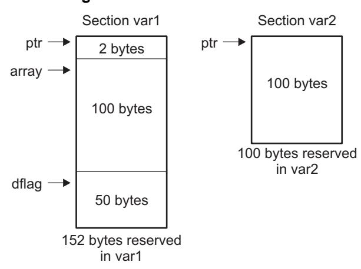

**Figure 5-8: The .usect Directive.** Memory layout diagram showing how `.usect` reserves uninitialized space in named sections. Section var1 contains three consecutive allocations: symbol ptr (pointing to offset 00000000), symbol array (offset 00000001, 100 bytes), and symbol dflag (offset 00000065, 50 bytes), totaling 152 bytes. Section var2 contains symbol vec (100 bytes). Each label arrow points to the symbol's starting address within its section.

## **.unasg/.undefine** *Turn Off Substitution Symbol*

**Syntax** **.unasg** *symbol*

**.undefine** *symbol*

**Description** The **.unasg** and **.undefine** directives remove the definition of a substitution symbol created using .asg or .define. The named *symbol* will removed from the substitution symbol table from the point of the .undefine or .unasg to the end of the assembly file. See Section 4.7.8 for more information on substitution symbols.

These directives can be used to remove from the assembly environment any C/C++ macros that may cause a problem. See Chapter 13 for more information about using C/C++ headers in assembly source.

## **.var** *Use Substitution Symbols as Local Variables*

**Syntax** **.var** *sym<sub>1</sub>*[**,** *sym<sub>2</sub>***, ... ,** *sym<sub>n</sub>*]

**Description** The **.var** directive allows you to use substitution symbols as local variables within a macro. With this directive, you can define up to 32 local macro substitution symbols (including parameters) per macro.

The .var directive creates temporary substitution symbols with the initial value of the null string. These symbols are not passed in as parameters, and they are lost after expansion.

See Section 4.7.8 for more information on substitution symbols .See Chapter 6 for information on macros.

# 6 Macro Language Description

The PRU assembler supports a macro language that enables you to create your own instructions. This is especially useful when a program executes a particular task several times. The macro language lets you:

- Define your own macros and redefine existing macros
- Simplify long or complicated assembly code
- Access macro libraries created with the archiver
- Define conditional and repeatable blocks within a macro
- Manipulate strings within a macro
- Control expansion listing

**Topic** ........................................................................................................................... **Page**

| 6.1  | Using Macros                                  | 137 |
|------|-----------------------------------------------|-----|
| 6.2  | Defining Macros                               | 137 |
| 6.3  | Macro Parameters/Substitution Symbols         | 139 |
| 6.4  | Macro Libraries                               | 145 |
| 6.5  | Using Conditional Assembly in Macros          | 145 |
| 6.6  | Using Labels in Macros                        | 147 |
| 6.7  | Producing Messages in Macros                  | 148 |
| 6.8  | Using Directives to Format the Output Listing | 149 |
| 6.9  | Using Recursive and Nested Macros             | 150 |
| 6.10 | Macro Directives Summary                      | 151 |

## 6.1 Using Macros

Programs often contain routines that are executed several times. Instead of repeating the source statements for a routine, you can define the routine as a macro, then call the macro in the places where you would normally repeat the routine. This simplifies and shortens your source program.

If you want to call a macro several times but with different data each time, you can assign parameters within a macro. This enables you to pass different information to the macro each time you call it. The macro language supports a special symbol called a *substitution symbol*, which is used for macro parameters. See Section 6.3 for more information.

Using a macro is a 3-step process.

- Step 1. **Define the macro.** You must define macros before you can use them in your program. There are two methods for defining macros:
  - a. Macros can be defined at the beginning of a *source file* or in a copy/include file. See Section 6.2, *Defining Macros*, for more information.
  - b. Macros can also be defined in a *macro library*. A macro library is a collection of files in archive format created by the archiver. Each member of the archive file (macro library) may contain one macro definition corresponding to the member name. You can access a macro library by using the .mlib directive. For more information, see Section 6.4.
- Step 2. **Call the macro.** After you have defined a macro, call it by using the macro name as a mnemonic in the source program. This is referred to as a *macro call*.
- Step 3. **Expand the macro.** The assembler expands your macros when the source program calls them. During expansion, the assembler passes arguments by variable to the macro parameters, replaces the macro call statement with the macro definition, then assembles the source code. By default, the macro expansions are printed in the listing file. You can turn off expansion listing by using the .mnolist directive. For more information, see Section 6.8.

When the assembler encounters a macro definition, it places the macro name in the opcode table. This redefines any previously defined macro, library entry, directive, or instruction mnemonic that has the same name as the macro. This allows you to expand the functions of directives and instructions, as well as to add new instructions.

## 6.2 Defining Macros

You can define a macro anywhere in your program, but you must define the macro before you can use it. Macros can be defined at the beginning of a source file or in a .copy/.include file (see Copy Source File); they can also be defined in a macro library. For more information about macro libraries, see Section 6.4.

Macro definitions can be nested, and they can call other macros, but all elements of the macro must be defined in the same file. Nested macros are discussed in Section 6.9.

A macro definition is a series of source statements in the following format:

| macname | .macro<br>[parameter1<br>] [, , parametern<br>] |  |
|---------|-------------------------------------------------|--|
|         | model statements or macro directives            |  |
|         | [.mexit]                                        |  |
|         | .endm                                           |  |

*macname* names the macro. You must place the name in the source statement's label field.

Only the first 128 characters of a macro name are significant. The assembler places the macro name in the internal opcode table, replacing any instruction or previous macro definition with the same name.

**.macro** is the directive that identifies the source statement as the first line of a macro definition. You must place .macro in the opcode field.

*parameter* <sup>1</sup> , *parameter* <sup>n</sup> are optional substitution symbols that appear as operands for the .macro directive.

Parameters are discussed in Section 6.3.

*model statements* are instructions or assembler directives that are executed each time the macro is called.

*macro directives* are used to control macro expansion.

**.mexit** is a directive that functions as a *goto .endm*. The .mexit directive is useful when error testing confirms that macro expansion fails and completing the rest of the macro is unnecessary.

**.endm** is the directive that terminates the macro definition.

If you want to include comments with your macro definition but *do not* want those comments to appear in the macro expansion, use an exclamation point to precede your comments. If you *do* want your comments to appear in the macro expansion, use an asterisk or semicolon. See Section 6.7 for more information about macro comments.

Example 6-1 shows the definition, call, and expansion of a macro.

### Example 6-1. Macro Definition, Call, and Expansion

Macro definition: The following code defines a macro, add3, with four parameters:

```
1 *
2
3 * add3
4 *
5 * ADDRP = P1 + P2 + P3
6
7 add3 .macro P1, P2, P3, ADDRP
8
9 ADD ADDRP, P1, P2
10 ADD ADDRP, ADDRP, P3
11 .endm
```

Macro call: The following code calls the add3 macro with four arguments:

```
12
13 00000000 add3 R1, R2, R3, R0
```

Macro expansion: The following code shows the substitution of the macro definition for the macro call. The assembler substitutes R1, R2, R3, and R0 for the P1, P2, P3, and ADDRP parameters of add3.

```
1
1 00000000 E0810002 ADD R0, R1, R2
1 00000004 E0800003 ADD R0, R0, R3
```

## 6.3 Macro Parameters/Substitution Symbols

If you want to call a macro several times with different data each time, you can assign parameters within the macro. The macro language supports a special symbol, called a *substitution symbol*, which is used for macro parameters.

Macro parameters are substitution symbols that represent a character string. These symbols can also be used outside of macros to equate a character string to a symbol name (see Section 4.7.8).

Valid substitution symbols can be up to 128 characters long and *must begin with a letter*. The remainder of the symbol can be a combination of alphanumeric characters, underscores, and dollar signs.

Substitution symbols used as macro parameters are local to the macro they are defined in. You can define up to 32 local substitution symbols (including substitution symbols defined with the .var directive) per macro. For more information about the .var directive, see Section 6.3.6.

During macro expansion, the assembler passes arguments by variable to the macro parameters. The character-string equivalent of each argument is assigned to the corresponding parameter. Parameters without corresponding arguments are set to the null string. If the number of arguments exceeds the number of parameters, the last parameter is assigned the character-string equivalent of all remaining arguments.

If you pass a list of arguments to one parameter or if you pass a comma or semicolon to a parameter, you must surround these terms with quotation marks.

At assembly time, the assembler replaces the macro parameter/substitution symbol with its corresponding character string, then translates the source code into object code.

Example 6-2 shows the expansion of a macro with varying numbers of arguments.

### Example 6-2. Calling a Macro With Varying Numbers of Arguments

```
Macro definition:
Parms .macro a,b,c
; a = :a:
; b = :b:
; c = :c:
   .endm
Calling the macro:
   Parms 100,label Parms 100,label,x,y
; a = 100 ; a = 100
; b = label ; b = label
; c = "" ; c = x,y
   Parms 100, , x Parms "100,200,300",x,y
; a = 100 ; a = 100,200,300
; b = "" ; b = x
; c = x ; c = y
   Parms """string""",x,y
; a = "string"
; b = x
; c = y
```

### 6.3.1 Directives That Define Substitution Symbols

You can manipulate substitution symbols with the **.asg** and **.eval** directives.

• The **.asg** directive assigns a character string to a substitution symbol.

For the .asg directive, the quotation marks are optional. If there are no quotation marks, the assembler reads characters up to the first comma and removes leading and trailing blanks. In either case, a character string is read and assigned to the *substitution symbol*. The syntax of the .asg directive is:

```
.asg["]character string["], substitution symbol
```

Example 6-3 shows character strings being assigned to substitution symbols.

### Example 6-3. The .asg Directive

```
.asg R2, stack_ptr ; stack pointer
```

• The **.eval** directive performs arithmetic on numeric substitution symbols.

The .eval directive evaluates the *expression* and assigns the string value of the result to the *substitution symbol*. If the expression is not well defined, the assembler generates an error and assigns the null string to the symbol. The syntax of the .eval directive is:

```
.eval well-defined expression , substitution symbol
```

Example 6-4 shows arithmetic being performed on substitution symbols.

### Example 6-4. The .eval Directive

```
.asg 1,counter
.loop 100
.word counter
.eval counter + 1,counter
.endloop
```

In Example 6-4, the .asg directive could be replaced with the .eval directive (.eval 1, counter) without changing the output. In simple cases like this, you can use .eval and .asg interchangeably. However, you must use .eval if you want to calculate a *value* from an expression. While .asg only assigns a character string to a substitution symbol, .eval evaluates an expression and then assigns the character string equivalent to a substitution symbol.

See Assign a Substitution Symbol for more information about the .asg and .eval assembler directives.

### 6.3.2 Built-In Substitution Symbol Functions

The following built-in substitution symbol functions enable you to make decisions on the basis of the string value of substitution symbols. These functions always return a value, and they can be used in expressions. Built-in substitution symbol functions are especially useful in conditional assembly expressions. Parameters of these functions are substitution symbols or character-string constants.

In the function definitions shown in Table 6-1, *a* and *b* are parameters that represent substitution symbols or character-string constants. The term *string* refers to the string value of the parameter. The symbol *ch* represents a character constant.

**Table 6-1. Substitution Symbol Functions and Return Values**

| Function         | Return Value                                                       |
|------------------|--------------------------------------------------------------------|
| \$symlen (a)     | Length of string a                                                 |
| \$symcmp (a,b)   | < 0 if a < b; 0 if a = b; > 0 if a > b                             |
| \$firstch (a,ch) | Index of the first occurrence of character constant ch in string a |
| \$lastch (a,ch)  | Index of the last occurrence of character constant ch in string a  |
| \$isdefed (a)    | 1 if string a is defined in the symbol table                       |
|                  | 0 if string a is not defined in the symbol table                   |
| \$ismember (a,b) | Top member of list b is assigned to string a                       |
|                  | 0 if b is a null string                                            |
| \$iscons (a)     | 1 if string a is a binary constant                                 |
|                  | 2 if string a is an octal constant                                 |
|                  | 3 if string a is a hexadecimal constant                            |
|                  | 4 if string a is a character constant                              |
|                  | 5 if string a is a decimal constant                                |
| \$isname (a)     | 1 if string a is a valid symbol name                               |
|                  | 0 if string a is not a valid symbol name                           |
| \$isreg (a) (1)  | 1 if string a is a valid predefined register name                  |
|                  | 0 if string a is not a valid predefined register name              |
|                  |                                                                    |

<sup>(1)</sup> For more information about predefined register names, see Section 4.7.6.

Example 6-5 shows built-in substitution symbol functions.

### Example 6-5. Using Built-In Substitution Symbol Functions

```
.asg label, ADDR ; ADDR = label
.if ($symcmp(ADDR, "label") = 0) ; evaluates to true
LDI R4, ADDR
.endif
.asg "x,y,z" , list ; list = x,y,z
.if ($ismember(ADDR,list)) ; ADDR = x, list = y,z
SUB R4, R4, 4 ; sub x
.endif
```

### 6.3.3 Recursive Substitution Symbols

When the assembler encounters a substitution symbol, it attempts to substitute the corresponding character string. If that string is also a substitution symbol, the assembler performs substitution again. The assembler continues doing this until it encounters a token that is not a substitution symbol or until it encounters a substitution symbol that it has already encountered during this evaluation.

In Example 6-6, the x is substituted for z; z is substituted for y; and y is substituted for x. The assembler recognizes this as infinite recursion and ceases substitution.

### Example 6-6. Recursive Substitution

```
.asg "x",z ; declare z and assign z = "x"
 .asg "z",y ; declare y and assign y = "z"
 .asg "y",x ; declare x and assign x = "y"
 LDI R0, x
* LDI R0, x ; recursive expansion
```

### 6.3.4 Forced Substitution

In some cases, substitution symbols are not recognizable to the assembler. The forced substitution operator, which is a set of colons surrounding the symbol, enables you to force the substitution of a symbol's character string. Simply enclose a symbol with colons to force the substitution. Do not include any spaces between the colons and the symbol. The syntax for the forced substitution operator is:

```
:symbol:
```

The assembler expands substitution symbols surrounded by colons before expanding other substitution symbols.

You can use the forced substitution operator only inside macros, and you cannot nest a forced substitution operator within another forced substitution operator.

Example 6-7 shows how the forced substitution operator is used.

### Example 6-7. Using the Forced Substitution Operator

```
1
                          force
                                .macro
      2
                                  .asg 0,x
      3
                                  .loop 8
                          AUX:x: .set x
      4
      5
                                  .eval x+1,x
      6
                                  .endloop
      7
                                  .endm
      8
      9 00000000
                                  force
                                  .asg   0,x
1
                                  .loop 8
1
                          AUX:x: .set x
1
                                 .eval x+1,x
1
                                  .endloop
2
                 00000000 AUX0 .set 0
2
                                  .eval 0+1,x
2
                 00000001 AUX1 .set 1
                                 .eval 1+1,x
2
2
                 00000002 AUX2 .set 2
2
                                 .eval 2+1,x
2
                 00000003 AUX3 .set 3
2
                                  .eval 3+1,x
2
                 00000004 AUX4 .set 4
2
                                  .eval 4+1,x
2
                 00000005 AUX5 .set 5
2
                                  .eval 5+1,x
2
                 00000006 AUX6 .set 6
2
                                 .eval 6+1,x
2
                 00000007 AUX7 .set 7
2
                                  .eval 7+1,x
```

### 6.3.5 Accessing Individual Characters of Subscripted Substitution Symbols

In a macro, you can access the individual characters (substrings) of a substitution symbol with subscripted substitution symbols. You must use the forced substitution operator for clarity.

You can access substrings in two ways:

- :symbol (well-defined expression):
  - This method of subscripting evaluates to a character string with one character.
- :symbol (well-defined expression 1, well-defined expression 2):
  - In this method, expression<sub>1</sub> represents the substring's starting position, and expression<sub>2</sub> represents the substring's length. You can specify exactly where to begin subscripting and the exact length of the resulting character string. *The index of substring characters begins with 1, not 0.*

Example 6-8 and Example 6-9 show built-in substitution symbol functions used with subscripted substitution symbols. In Example 6-8, subscripted substitution symbols redefine the ADD instruction so that it handles short immediate values. In Example 6-9, the subscripted substitution symbol is used to find a substring strg1 beginning at position start in the string strg2. The position of the substring strg1 is assigned to the substitution symbol pos.

### Example 6-8. Using Subscripted Substitution Symbols to Redefine an Instruction

```
ADDX .macro dst, imm
      .var TMP
      .asg :imm(1):, TMP
      .if $symcmp(TMP,"#") = 0
      ADD dst, dst, imm
      .else
      .emsg "Bad Macro Parameter"
      .endif
      .endm
      ADDX R9, 100 ; macro call
      ADDX R9, R8 ; macro call
```

### Example 6-9. Using Subscripted Substitution Symbols to Find Substrings

```
substr .macro start,strg1,strg2,pos
       .var LEN1,LEN2,I,TMP
       .if $symlen(start) = 0
       .eval 1,start
       .endif
       .eval 0,pos
       .eval 1,i
       .eval $symlen(strg1),LEN1
       .eval $symlen(strg2),LEN2
       .loop
       .break I = (LEN2 - LEN1 + 1)
       .asg ":strg2(I,LEN1):",TMP
       .eval i,pos
       .break
       .else
       .eval I + 1,i
       .endif
       .endloop
       .endm
       .asg 0,pos
       .asg "ar1 ar2 ar3 ar4",regs
       substr 1,"ar2",regs,pos
       .word pos
```

### 6.3.6 Substitution Symbols as Local Variables in Macros

If you want to use substitution symbols as local variables within a macro, you can use the **.var** directive to define up to 32 local macro substitution symbols (including parameters) per macro. The .var directive creates temporary substitution symbols with the initial value of the null string. These symbols are not passed in as parameters, and they are lost after expansion.

```
.var sym1
             [,sym2
                     , ... ,symn
                                ]
```

The .var directive is used in Example 6-8 and Example 6-9.

## 6.4 Macro Libraries

One way to define macros is by creating a macro library. A macro library is a collection of files that contain macro definitions. You must use the archiver to collect these files, or members, into a single file (called an archive). Each member of a macro library contains one macro definition. The files in a macro library must be unassembled source files. The macro name and the member name must be the same, and the macro filename's extension must be .asm. For example:

| Macro Name | Filename in Macro Library |
|------------|---------------------------|
| simple     | simple.asm                |
| add3       | add3.asm                  |

You can access the macro library by using the .mlib assembler directive (described in Define Macro Library\). The syntax is:

**.mlib** *filename*

When the assembler encounters the .mlib directive, it opens the library named by filename and creates a table of the library's contents. The assembler enters the names of the individual members within the library into the opcode tables as library entries; this redefines any existing opcodes or macros that have the same name. If one of these macros is called, the assembler extracts the entry from the library and loads it into the macro table.

The assembler expands the library entry the same way it expands other macros. See Section 6.1 for how the assembler expands macros. You can control the listing of library entry expansions with the .mlist directive. For information about the .mlist directive, see Section 6.8 and Start/Stop Macro Expansion Listing. Only macros that are actually called from the library are extracted, and they are extracted only once.

You can use the archiver to create a macro library by including the desired files in an archive. A macro library is no different from any other archive, except that the assembler expects the macro library to contain macro definitions. The assembler expects *only* macro definitions in a macro library; putting object code or miscellaneous source files into the library may produce undesirable results. For information about creating a macro library archive, see Section 7.1.

## 6.5 Using Conditional Assembly in Macros

The conditional assembly directives are **.if/.elseif/.else/.endif** and **.loop/ .break/.endloop**. They can be nested within each other up to 32 levels deep. The format of a conditional block is:

**.if** *well-defined expression* [**.elseif** *well-defined expression*] [**.else**] **.endif**

The **.elseif** and **.else** directives are optional in conditional assembly. The .elseif directive can be used more than once within a conditional assembly code block. When .elseif and .else are omitted and when the .if expression is false (0), the assembler continues to the code following the .endif directive. See Assemble Conditional Blocks for more information on the .if/ .elseif/.else/.endif directives.

The **.loop/.break/.endloop** directives enable you to assemble a code block repeatedly. The format of a repeatable block is:

**.loop** [*well-defined expression*] [**.break** [*well-defined expression*]] **.endloop**

The **.loop** directive's optional *well-defined expression* evaluates to the loop count (the number of loops to be performed). If the expression is omitted, the loop count defaults to 1024 unless the assembler encounters a .break directive with an expression that is true (nonzero). See Assemble Conditional Blocks Repeatedly for more information on the .loop/.break/.endloop directives.

The **.break** directive and its expression are optional in repetitive assembly. If the expression evaluates to false, the loop continues. The assembler breaks the loop when the .break expression evaluates to true or when the .break expression is omitted. When the loop is broken, the assembler continues with the code after the .endloop directive. For more information, see Section 5.7.

Example 6-10, Example 6-11, and Example 6-12 show the .loop/.break/ .endloop directives, properly nested conditional assembly directives, and built-in substitution symbol functions used in a conditional assembly code block.

### Example 6-10. The .loop/.break/.endloop Directives

```
.asg 1,x
.loop
.break (x == 10) ; if x == 10, quit loop/break with expression
.eval x+1,x
.endloop
```

### Example 6-11. Nested Conditional Assembly Directives

```
.asg 1,x
.loop
.if (x == 10) ; if x == 10, quit loop
.break (x == 10) ; force break
.endif
.eval x+1,x
.endloop
```

### Example 6-12. Built-In Substitution Symbol Functions in a Conditional Assembly Code Block

```
.fcnolist
*
*Double Add or Subtract
*
DBL .macro ABC, dsth, dstl, srch, srcl ; add or subtract double
       .if $symcmp(ABC,"+")
       ADD dstl, dstl, srcl ; add double
       ADC dsth, dsth, srch
       .elseif $symcmp(ABC,"-")
       SUB dstl, dstl, srcl ; subtract double
       SUBC dsth, dsth, srch
       .else
       .emsg "Incorrect Operator Parameter"
       .endif
       .endm
*Macro Call
       DBL -, R4, R5, R6, R7
```

## 6.6 Using Labels in Macros

All labels in an assembly language program must be unique. This includes labels in macros. If a macro is expanded more than once, its labels are defined more than once. *Defining a label more than once is illegal*. The macro language provides a method of defining labels in macros so that the labels are unique. Simply follow each label with a question mark, and the assembler replaces the question mark with a period followed by a unique number. When the macro is expanded, *you do not see the unique number in the listing file*. Your label appears with the question mark as it did in the macro definition. You cannot declare this label as global. See Section 4.7.3 for more about labels.

The syntax for a unique label is:

```
label ?
```

unique label generation in a macro. The maximum label length is shortened to allow for the unique suffix. For example, if the macro is expanded fewer than 10 times, the maximum label length is 126 characters. If the macro is expanded from 10 to 99 times, the maximum label length is 125. The label with its unique suffix is shown in the cross-listing file. To obtain a cross-listing file, invoke the assembler with the --cross\_reference option (see Section 4.3).

### Example 6-13. Unique Labels in a Macro

```
1
     2
     3
 4 sign_extend_32_8 .macro dest, src
     5 MOV dest, src
     6 QBBC $1, dest, 7
     7 FILL &dest.b1, 3
     8end?:
     9 .endm
     10
     11
     12 .global sign_extend
     13 00000000 sign_extend
     14 00000000 sign_extend_32_8 R14, R14.b0
1 00000000 000000100E0EEE MOV R14, R14.b0
1 00000004 000000C907EE02 QBBC $1, R14, 7
1 00000008 0000002EFF012E FILL &R14.b1, 3
1 end?
     15 0000000c 00000020C30000 JMP R3.w2
```

## 6.7 Producing Messages in Macros

The macro language supports three directives that enable you to define your own assembly-time error and warning messages. These directives are especially useful when you want to create messages specific to your needs. The last line of the listing file shows the error and warning counts. These counts alert you to problems in your code and are especially useful during debugging.

**.emsg** sends error messages to the listing file. The .emsg directive generates errors in the same manner as the assembler, incrementing the error count and preventing the assembler from producing an object file.

**.mmsg** sends assembly-time messages to the listing file. The .mmsg directive functions in the same manner as the .emsg directive but does not set the error count or prevent the creation of an object file.

**.wmsg** sends warning messages to the listing file. The .wmsg directive functions in the same manner as the .emsg directive, but it increments the warning count and does not prevent the generation of an object file.

**Macro comments** are comments that appear in the definition of the macro *but do not show up in the expansion of the macro*. An exclamation point in column 1 identifies a macro comment. If you want your comments to appear in the macro expansion, precede your comment with an asterisk or semicolon.

Example 6-14 shows user messages in macros and macro comments that do not appear in the macro expansion.

For more information about the .emsg, .mmsg, and .wmsg assembler directives, see Define Messages.

### Example 6-14. Producing Messages in a Macro

```
1 MUL_I .macro x,y
   2 .if ($symlen(x) ==0)
   3 .emsg "ERROR -- Missing Parameter"
   4 .mexit
   5 .elseif ($symlen(y) == 0)
   6 .emsg "ERROR -- Missing Parameter"
   7 .mexit
   8 .else
                  ...
  12 .endif
  13 .endm
  14
  15 00000000 MUL_I 50, 51
1 .if ($symlen(x) ==0)
1 .emsg "ERROR -- Missing Parameter"
1 .mexit
1 .elseif ($symlen(y) == 0)
1 .emsg "ERROR -- Missing Parameter"
1 .mexit
1 .else
                 ...
1 .endif
  16
  17 0000000c MUL_I
1 .if ($symlen(x) ==0)
1 .emsg "ERROR -- Missing Parameter"
***** USER ERROR ***** - : ERROR -- Missing Parameter
1 .mexit
1 Error, No Warnings
```

## 6.8 Using Directives to Format the Output Listing

Macros, substitution symbols, and conditional assembly directives may hide information. You may need to see this hidden information, so the macro language supports an expanded listing capability.

By default, the assembler shows macro expansions and false conditional blocks in the list output file. You may want to turn this listing off or on within your listing file. Four sets of directives enable you to control the listing of this information:

**Macro and loop expansion listing**

**.mlist** expands macros and .loop/.endloop blocks. The .mlist directive prints all code

encountered in those blocks.

**.mnolist** suppresses the listing of macro expansions and .loop/ .endloop blocks.

For macro and loop expansion listing, .mlist is the default.

**False conditional block listing**

**.fclist** causes the assembler to include in the listing file all conditional blocks that do not

generate code (false conditional blocks). Conditional blocks appear in the listing

exactly as they appear in the source code.

**.fcnolist** suppresses the listing of false conditional blocks. Only the code in conditional blocks

that actually assemble appears in the listing. The .if, .elseif, .else, and .endif directives

do not appear in the listing.

For false conditional block listing, .fclist is the default.

**Substitution symbol expansion listing**

**.sslist** expands substitution symbols in the listing. This is useful for debugging the expansion

of substitution symbols. The expanded line appears below the actual source line.

**.ssnolist** turns off substitution symbol expansion in the listing.

For substitution symbol expansion listing, .ssnolist is the default.

**Directive listing**

**.drlist** causes the assembler to print to the listing file all directive lines.

**.drnolist** suppresses the printing of certain directives in the listing file. These directives are

.asg, .eval, .var, .sslist, .mlist, .fclist, .ssnolist, .mnolist, .fcnolist, .emsg, .wmsg,

.mmsg, .length, .width, and .break.

For directive listing, .drlist is the default.

## 6.9 Using Recursive and Nested Macros

The macro language supports recursive and nested macro calls. This means that you can call other macros in a macro definition. You can nest macros up to 32 levels deep. When you use recursive macros, you call a macro from its own definition (the macro calls itself).

When you create recursive or nested macros, you should pay close attention to the arguments that you pass to macro parameters because the assembler uses dynamic scoping for parameters. This means that the called macro uses the environment of the macro from which it was called.

Example 6-15 shows nested macros. The y in the in\_block macro hides the y in the out\_block macro. The x and z from the out\_block macro, however, are accessible to the in\_block macro.

### Example 6-15. Using Nested Macros

```
in_block .macro y,a
            . ; visible parameters are y,a and x,z from the calling macro
         .endm
out_block .macro x,y,z
            . ; visible parameters are x,y,z
            .
         in_block x,y ; macro call with x and y as arguments
            .
            .
         .endm
         out_block ; macro call
```

recursive and fact macros. The fact macro produces assembly code necessary to calculate the factorial of n, where n is an immediate value. The result is placed in data memory address loc. The fact macro accomplishes this by calling fact1, which calls itself recursively.

### Example 6-16. Using Recursive Macros

```
fact .macro N, R26 ; N is an integer constant. Register R26 address = N!
      .if N < 2 ; 0! = 1! = 1
      LDI R26, 1
      .else
      LDI R26, N ; N >= 2 so, store N in R26.
      .eval -1, N ; Decrement N, and do the factorial of N - 1.
      fact1 ; Call fact with current environment.
      .endm
fact1 .macro
      .if N > 1
      LDI R28, N ; N > 1 so, store N in R0
      MOV R29, R26 ; hardware multiplier result register is R26
      XIN 0, &R26, 4
      .eval N - 1, N ; Decrement position.
      fact1 ; Recursive call.
      .endif
      .endm
```

## 6.10 Macro Directives Summary

The directives listed in Table 6-2 through Table 6-6 can be used with macros. The .macro, .mexit, .endm and .var directives are valid only with macros; the remaining directives are general assembly language directives.

### Table 6-2. Creating Macros

|                                                        |                                               | See         |             |
|--------------------------------------------------------|-----------------------------------------------|-------------|-------------|
| Mnemonic and Syntax                                    | Description                                   | Macro Use   | Directive   |
| .endm                                                  | End macro definition                          | Section 6.2 | .endm       |
| macname .macro<br>[parameter1<br>][, , parametern<br>] | Define macro by macname                       | Section 6.2 | .macro      |
| .mexit                                                 | Go to .endm                                   | Section 6.2 | Section 6.2 |
| .mlib filename                                         | Identify library containing macro definitions | Section 6.4 | .mlib       |

### Table 6-3. Manipulating Substitution Symbols

|                                                    |                                                    |               | See       |  |
|----------------------------------------------------|----------------------------------------------------|---------------|-----------|--|
| Mnemonic and Syntax                                | Description                                        | Macro Use     | Directive |  |
| .asg ["]character string["], substitution symbol   | Assign character string to substitution symbol     | Section 6.3.1 | .asg      |  |
| .eval well-defined expression, substitution symbol | Perform arithmetic on numeric substitution symbols | Section 6.3.1 | .eval     |  |
| .var<br>sym1<br>[, sym2<br>,, symn<br>]            | Define local macro symbols                         | Section 6.3.6 | .var      |  |

### Table 6-4. Conditional Assembly

| Mnemonic and Syntax              | Description                         | See         |           |
|----------------------------------|-------------------------------------|-------------|-----------|
|                                  |                                     | Macro Use   | Directive |
| .break [well-defined expression] | Optional repeatable block assembly  | Section 6.5 | .break    |
| .endif                           | End conditional assembly            | Section 6.5 | .endif    |
| .endloop                         | End repeatable block assembly       | Section 6.5 | .endloop  |
| .else                            | Optional conditional assembly block | Section 6.5 | .else     |
| .elseif well-defined expression  | Optional conditional assembly block | Section 6.5 | .elseif   |
| .if well-defined expression      | Begin conditional assembly          | Section 6.5 | .if       |
| .loop [well-defined expression]  | Begin repeatable block assembly     | Section 6.5 | .loop     |

### Table 6-5. Producing Assembly-Time Messages

| Mnemonic and Syntax | Description                                   | See         |           |
|---------------------|-----------------------------------------------|-------------|-----------|
|                     |                                               | Macro Use   | Directive |
| .emsg               | Send error message to standard output         | Section 6.7 | .emsg     |
| .mmsg               | Send assembly-time message to standard output | Section 6.7 | .mmsg     |
| .wmsg               | Send warning message to standard output       | Section 6.7 | .wmsg     |

### Table 6-6. Formatting the Listing

| Mnemonic and Syntax | Description                                             | See         |           |
|---------------------|---------------------------------------------------------|-------------|-----------|
|                     |                                                         | Macro Use   | Directive |
| .fclist             | Allow false conditional code block listing (default)    | Section 6.8 | .fclist   |
| .fcnolist           | Suppress false conditional code block listing           | Section 6.8 | .fcnolist |
| .mlist              | Allow macro listings (default)                          | Section 6.8 | .mlist    |
| .mnolist            | Suppress macro listings                                 | Section 6.8 | .mnolist  |
| .sslist             | Allow expanded substitution symbol listing              | Section 6.8 | .sslist   |
| .ssnolist           | Suppress expanded substitution symbol listing (default) | Section 6.8 | .ssnolist |

# 7 Archiver Description

The PRU archiver lets you combine several individual files into a single archive file. For example, you can collect several macros into a macro library. The assembler searches the library and uses the members that are called as macros by the source file. You can also use the archiver to collect a group of object files into an object library. The linker includes in the library the members that resolve external references during the link. The archiver allows you to modify a library by deleting, replacing, extracting, or adding members.

**Topic** ........................................................................................................................... **Page**

| 7.1 | Archiver Overview                                    | 153 |
|-----|------------------------------------------------------|-----|
| 7.2 | The Archiver's Role in the Software Development Flow | 154 |
| 7.3 | Invoking the Archiver                                | 155 |
| 7.4 | Archiver Examples                                    | 156 |
| 7.5 | Library Information Archiver Description             | 157 |
|     |                                                      |     |

## 7.1 Archiver Overview

You can build libraries from any type of files. Both the assembler and the linker accept archive libraries as input; the assembler can use libraries that contain individual source files, and the linker can use libraries that contain individual object files.

One of the most useful applications of the archiver is building libraries of object modules. For example, you can write several arithmetic routines, assemble them, and use the archiver to collect the object files into a single, logical group. You can then specify the object library as linker input. The linker searches the library and includes members that resolve external references.

You can also use the archiver to build macro libraries. You can create several source files, each of which contains a single macro, and use the archiver to collect these macros into a single, functional group. You can use the .mlib directive during assembly to specify that macro library to be searched for the macros that you call. Chapter 6 discusses macros and macro libraries in detail, while this chapter explains how to use the archiver to build libraries.

## 7.2 The Archiver's Role in the Software Development Flow

Figure 7-1 shows the archiver's role in the software development process. The shaded portion highlights the most common archiver development path. Both the assembler and the linker accept libraries as input.

**Figure 7-1: The Archiver in the PRU Software Development Flow.** Block diagram showing the PRU software development flow with the archiver highlighted. Inputs (macro source files, object files) flow into the Archiver, producing a Macro library or Library of object files. The library feeds into the Linker alongside object files from the Assembler. The shaded central path shows the most common development flow: source → Assembler → object files → Linker → executable module.

## 7.3 Invoking the Archiver

To invoke the archiver, enter:

**arpru** [-]*command* [*options*] *libname* [*filename<sup>1</sup>* ... *filename<sup>n</sup>*]

**arpru** is the command that invokes the archiver.

[-]*command* tells the archiver how to manipulate the existing library members and any specified. A command can be preceded by an optional hyphen. You must use one of the following commands when you invoke the archiver, but you can use only one command per invocation. The archiver commands are as follows:

- **@** uses the contents of the specified file instead of command line entries. You can use this command to avoid limitations on command line length imposed by the host operating system. Use a ; at the beginning of a line in the command file to include comments. (See Example 7-1 for an example using an archiver command file.)
- **a** adds the specified files to the library. This command does not replace an existing member that has the same name as an added file; it simply *appends* new members to the end of the archive.
- **d** deletes the specified members from the library.
- **r** replaces the specified members in the library. If you do not specify filenames, the archiver replaces the library members with files of the same name in the current directory. If the specified file is not found in the library, the archiver adds it instead of replacing it.
- **t** prints a table of contents of the library. If you specify filenames, only those files are listed. If you do not specify any filenames, the archiver lists all the members in the specified library.
- **x** extracts the specified files. If you do not specify member names, the archiver extracts all library members. When the archiver extracts a member, it simply copies the member into the current directory; it *does not* remove it from the library.

*options* In addition to one of the *commands,* you can specify options. To use options, combine them with a command; for example, to use the a command and the s option, enter -as or as. The hyphen is optional for archiver options only. These are the archiver options:

- **-q** (quiet) suppresses the banner and status messages.
- **-s** prints a list of the global symbols that are defined in the library. (This option is valid only with the a, r, and d commands.)
- **-u** replaces library members only if the replacement has a more recent modification date. You must use the r command with the -u option to specify which members to replace.
- **-v** (verbose) provides a file-by-file description of the creation of a new library from an old library and its members.

*libname* names the archive library to be built or modified. If you do not specify an extension for *libname,* the archiver uses the default extension *.lib*.

*filenames* names individual files to be manipulated. These files can be existing library members or new files to be added to the library. When you enter a filename, you must enter a complete filename including extension, if applicable.

**Naming Library Members**

**NOTE:** It is possible (but not desirable) for a library to contain several members with the same name. If you attempt to delete, replace, or extract a member whose name is the same as another library member, the archiver deletes, replaces, or extracts the first library member with that name.

## 7.4 Archiver Examples

The following are examples of typical archiver operations:

• If you want to create a library called function.lib that contains the files sine.obj, cos.obj, and flt.obj, enter:

```
arpru -a function sine.obj cos.obj flt.obj
```

The archiver responds as follows:

```
==> new archive 'function.lib'
==> building new archive 'function.lib'
```

• You can print a table of contents of function.lib with the -t command, enter:

```
arpru -t function
```

The archiver responds as follows:

| FILE NAME | SIZE | DATE                     |
|-----------|------|--------------------------|
|           |      |                          |
| sine.obj  | 300  | Wed Jun 15 10:00:24 2011 |
| cos.obj   | 300  | Wed Jun 15 10:00:30 2011 |
| flt.obj   | 300  | Wed Jun 15 09:59:56 2011 |

• If you want to add new members to the library, enter:

```
arpru -as function atan.obj
```

The archiver responds as follows:

```
==> symbol defined: '_sin'
==> symbol defined: '$sin'
==> symbol defined: '_cos'
==> symbol defined: '$cos'
==> symbol defined: '_tan'
==> symbol defined: '$tan'
==> symbol defined: '_atan
==> symbol defined: '$atan'
==> building archive 'function.lib'
```

Because this example does not specify an extension for the libname, the archiver adds the files to the library called function.lib. If function.lib does not exist, the archiver creates it. (The -s option tells the archiver to list the global symbols that are defined in the library.)

• If you want to modify a library member, you can extract it, edit it, and replace it. In this example, assume there is a library named macros.lib that contains the members push.asm, pop.asm, and swap.asm.

```
arpru -x macros push.asm
```

The archiver makes a copy of push.asm and places it in the current directory; it does not remove push.asm from the library. Now you can edit the extracted file. To replace the copy of push.asm in the library with the edited copy, enter:

```
arpru -r macros push.asm
```

• If you want to use a command file, specify the command filename after the -@ command. For example:

```
arpru -@modules.cmd
```

The archiver responds as follows:

```
==> building archive 'modules.lib'
```

Example 7-1 is the modules.cmd command file. The r command specifies that the filenames given in the command file replace files of the same name in the modules.lib library. The -u option specifies that these files are replaced only when the current file has a more recent revision date than the file that is in the library.

### Example 7-1. Archiver Command File

```
; Command file to replace members of the
; modules library with updated files
; Use r command and u option:
ru
; Specify library name:
modules.lib
; List filenames to be replaced if updated:
align.asm
bss.asm
data.asm
text.asm
sect.asm
copy.asm
double.asm
drnolist.asm
emsg.asm
end.asm
```

## 7.5 Library Information Archiver Description

Section 7.1 explains how to use the archiver to create libraries of object files for use in the linker of one or more applications. You can have multiple versions of the same object file libraries, each built with different sets of build options. For example, you might have different versions of your object file library for big and little endian, for different architecture revisions, or for different ABIs depending on the typical build environments of client applications. However, if you have several versions of a library, it can be cumbersome to keep track of which version of the library needs to be linked in for a particular application.

When several versions of a single library are available, the library information archiver can be used to create an index library of all of the object file library versions. This index library is used in the linker in place of a particular version of your object file library. The linker looks at the build options of the application being linked, and uses the specified index library to determine which version of your object file library to include in the linker. If one or more compatible libraries were found in the index library, the most suitable compatible library is linked in for your application.

### 7.5.1 Invoking the Library Information Archiver

To invoke the library information archiver, enter:

| libinfopru [options] -o=libname libname1<br>[libname2<br>libnamen<br>] |  |
|------------------------------------------------------------------------|--|

| libinfopru<br>options | is the command that invokes the library information archiver.<br>changes the default behavior of the library information archiver. These options are: |                                                                                                                        |  |
|-----------------------|-------------------------------------------------------------------------------------------------------------------------------------------------------|------------------------------------------------------------------------------------------------------------------------|--|
|                       | -o libname                                                                                                                                            | specifies the name of the index library to create or update. This option is<br>required.                               |  |
|                       | -u                                                                                                                                                    | updates any existing information in the index library specified with the -o<br>option instead of creating a new index. |  |
|                       |                                                                                                                                                       |                                                                                                                        |  |

*libnames* names individual object file libraries to be manipulated. When you enter a libname, you must enter a complete filename including extension, if applicable.

### 7.5.2 Library Information Archiver Example

Consider these object file libraries that all have the same members, but are built with different build options:

| Object File Library Name | Build Options                  |
|--------------------------|--------------------------------|
| mylib_pruv1_le.lib       | silicon_version=1endian=little |
| mylib_pruv1_be.lib       | silicon_version=1endian=big    |
| mylib_pruv2_le.lib       | silicon_version=2endian=little |
| mylib_pruv2_be.lib       | silicon_version=2endian=big    |
| mylib_pruv3_le.lib       | silicon_version=3endian=little |
| mylib_pruv3_be.lib       | silicon_version=3endian=big    |
| mylib_pruv4_le.lib       | silicon_version=4endian=little |
| mylib_pruv4_be.lib       | silicon_version=4endian=big    |

Using the library information archiver, you can create an index library called mylib.lib from the above libraries:

```
libinfopru -o mylib.lib mylib_pruv3_be.lib mylib_pruv2_be.lib
    mylib__pruv1_be.lib
```

You can now specify mylib.lib as a library for the linker of an application. The linker uses the index library to choose the appropriate version of the library to use. If the --issue\_remarks option is specified before the --run\_linker option, the linker reports which library was chosen.

• **Example 1** (little endian):

### 7.5.3 Listing the Contents of an Index Library

The archiver's -t option can be used on an index library to list the archives indexed by an index library:

arpru t mylib.lib

| SIZE | DATE                     | FILE NAME                  |
|------|--------------------------|----------------------------|
|      |                          |                            |
| 119  | Mon Apr 23 12:45:22 2007 | mylib_pruv3_le.lib.libinfo |
| 119  | Mon Apr 23 12:45:22 2007 | mylib_pruv3_be.lib.libinfo |
| 119  | Mon Apr 23 12:45:22 2007 | mylib_pruv2_le.lib.libinfo |
| 119  | Mon Apr 23 12:45:22 2007 | mylib_pruv2_be.lib.libinfo |
| 119  | Mon Apr 23 12:45:22 2007 | mylib_pruv1_le.lib.libinfo |
| 119  | Mon Apr 23 12:45:22 2007 | mylib_pruv1_be.lib.libinfo |
| 0    | Mon Apr 23 12:45:22 2007 | TI_\$\$LIBINFO             |

The indexed object file libraries have an additional .libinfo extension in the archiver listing. The \_\_TI\_\$\$LIBINFO member is a special member that designates *mylib.lib* as an index library, rather than a regular library.

If the archiver's -d command is used on an index library to delete a .libinfo member, the linker will no longer choose the corresponding library when the index library is specified.

Using any other archiver option with an index library, or using -d to remove the \_\_TI\_\$\$LIBINFO member, results in undefined behavior, and is not supported.

### 7.5.4 Requirements

You must follow these requirements to use library index files:

- At least one application object file must appear on the linker command line before the index library.
- Each object file library specified as input to the library information archiver must only contain object file members that are built with the same build options.
- The linker expects the index library and all of the libraries it indexes to be in a single directory.

# 8 Linker Description

The PRU linker creates executable modules by combining object modules. This chapter describes the linker options, directives, and statements used to create executable modules. Object libraries, command files, and other key concepts are discussed as well.

The concept of sections is basic to linker operation; Chapter 2 includes a detailed discussion of sections.

**Topic** ........................................................................................................................... **Page**

| 8.1  | Linker Overview                                    | 160 |
|------|----------------------------------------------------|-----|
| 8.2  | The Linker's Role in the Software Development Flow | 161 |
| 8.3  | Invoking the Linker                                | 162 |
| 8.4  | Linker Options                                     | 163 |
| 8.5  | Linker Command Files                               | 182 |
| 8.6  | Linker Symbols                                     | 216 |
| 8.7  | Default Placement Algorithm                        | 219 |
| 8.8  | Linker-Generated Copy Tables                       | 220 |
| 8.9  | Partial (Incremental) Linking                      | 231 |
| 8.10 | Linking C/C++ Code                                 | 232 |
| 8.11 | Linker Example                                     | 234 |
|      |                                                    |     |

## 8.1 Linker Overview

The PRU linker allows you to allocate output sections efficiently in the memory map. As the linker combines object files, it performs the following tasks:

- Allocates sections into the target system's configured memory
- Relocates symbols and sections to assign them to final addresses
- Resolves undefined external references between input files

The linker command language controls memory configuration, output section definition, and address binding. The language supports expression assignment and evaluation. You configure system memory by defining and creating a memory model that you design. Two powerful directives, MEMORY and SECTIONS, allow you to:

- Allocate sections into specific areas of memory
- Combine object file sections
- Define or redefine global symbols at link time

## 8.2 The Linker's Role in the Software Development Flow

Figure 8-1 illustrates the linker's role in the software development process. The linker accepts several types of files as input, including object files, command files, libraries, and partially linked files. The linker creates an executable object module that can be downloaded to one of several development tools or executed by a PRU device.


**Figure 8-1: The Linker in the PRU Software Development Flow.** Block diagram of the complete PRU software development flow with the Linker highlighted at center. Inputs include: C/C++ source files (compiled by the C/C++ compiler into assembler source), macro source files (processed by the Archiver into a macro library), and existing object files (also archived into a library of object files). The Assembler converts assembler source into object files. The Linker combines object files and libraries (including a run-time-support library from the Library-build utility) into an Executable object file. The executable connects to the PRU device directly, to debugging tools, to an EPROM programmer, to an Absolute lister, to a Cross-reference lister, and to Object file utilities. A C/C++ name demangling utility is also shown.

## 8.3 Invoking the Linker

The general syntax for invoking the linker is:

**clpru --run\_linker** [*options*] *filename<sup>1</sup>* .... *filename<sup>n</sup>*

**clpru --run\_linker** is the command that invokes the linker. The --run\_linker option's short form is -z.

*options* can appear anywhere on the command line or in a linker command file.

(Options are discussed in Section 8.4.)

*filename<sup>1</sup>*, *filename<sup>n</sup>* can be object files, linker command files, or archive libraries. The default extension for all input files is *.obj*; any other extension must be explicitly specified. The linker can determine whether the input file is an object or ASCII file that contains linker commands. The default output filename is *a.out*, unless you use the --output\_file option to name the output file.

There are two methods for invoking the linker:

• Specify options and filenames on the command line. This example links two files, file1.obj and file2.obj, and creates an output module named link.out.

```
clpru --run_linker file1.obj file2.obj --output_file=link.out
```

• Put filenames and options in a linker command file. Filenames that are specified inside a linker command file must begin with a letter. For example, assume the file linker.cmd contains the following lines:

```
--output_file=link.out file1.obj file2.obj
```

Now you can invoke the linker from the command line; specify the command filename as an input file:

```
clpru --run_linker linker.cmd
```

When you use a command file, you can also specify other options and files on the command line. For example, you could enter:

```
clpru --run_linker --map_file=link.map linker.cmd file3.obj
```

The linker reads and processes a command file as soon as it encounters the filename on the command line, so it links the files in this order: file1.obj, file2.obj, and file3.obj. This example creates an output file called link.out and a map file called link.map.

For information on invoking the linker for C/C++ files, see Section 8.10.

## 8.4 Linker Options

Linker options control linking operations. They can be placed on the command line or in a command file. Linker options must be preceded by a hyphen (-). Options can be separated from arguments (if they have them) by an optional space.

### Table 8-1. Basic Options Summary

| Option      | Alias  | Description                                                                                                                                      | Section        |
|-------------|--------|--------------------------------------------------------------------------------------------------------------------------------------------------|----------------|
| run_linker  | -z     | Enables linking                                                                                                                                  | Section 8.3    |
| output_file | -o     | Names the executable output module. The default filename is a.out.                                                                               | Section 8.4.23 |
| map_file    | -m     | Produces a map or listing of the input and output sections, including holes, and<br>places the listing in filename                               | Section 8.4.18 |
| stack_size  | -stack | Sets C system stack size to size and defines a global symbol that specifies the<br>stack size. Default = 256 bytes                               | Section 8.4.29 |
| heap_size   | -heap  | Sets heap size (for the dynamic memory allocation in C) to size and defines a<br>global symbol that specifies the heap size. Default = 256 bytes | Section 8.4.14 |

### Table 8-2. File Search Path Options Summary

| Option           | Alias     | Description                                                                                                                                                                  | Section          |
|------------------|-----------|------------------------------------------------------------------------------------------------------------------------------------------------------------------------------|------------------|
| library          | -l        | Names an archive library or link command filename as linker input                                                                                                            | Section 8.4.16   |
| search_path      | -i        | Alters library-search algorithms to look in a directory named with pathname<br>before looking in the default location. This option must appear before the<br>library option. | Section 8.4.16.1 |
| priority         | -priority | Satisfies unresolved references by the first library that contains a definition for<br>that symbol                                                                           | Section 8.4.16.3 |
| reread_libs      | -x        | Forces rereading of libraries, which resolves back references                                                                                                                | Section 8.4.16.3 |
| disable_auto_rts |           | Disables the automatic selection of a run-time-support library                                                                                                               | Section 8.4.8    |

### Table 8-3. Command File Preprocessing Options Summary

| Option     | Alias | Description                              | Section        |
|------------|-------|------------------------------------------|----------------|
| define     |       | Predefines name as a preprocessor macro. | Section 8.4.10 |
| undefine   |       | Removes the preprocessor macro name.     | Section 8.4.10 |
| disable_pp |       | Disables preprocessing for command files | Section 8.4.10 |

### Table 8-4. Diagnostic Options Summary

| Option                  | Alias | Description                                                                                                    | Section        |
|-------------------------|-------|----------------------------------------------------------------------------------------------------------------|----------------|
| diag_error              |       | Categorizes the diagnostic identified by num as an error                                                       | Section 8.4.7  |
| diag_remark             |       | Categorizes the diagnostic identified by num as a remark                                                       | Section 8.4.7  |
| diag_suppress           |       | Suppresses the diagnostic identified by num                                                                    | Section 8.4.7  |
| diag_warning            |       | Categorizes the diagnostic identified by num as a warning                                                      | Section 8.4.7  |
| display_error_number    |       | Displays a diagnostic's identifiers along with its text                                                        | Section 8.4.7  |
| emit_warnings_as_errors | -pdew | Treats warnings as errors                                                                                      | Section 8.4.7  |
| issue_remarks           |       | Issues remarks (nonserious warnings)                                                                           | Section 8.4.7  |
| no_demangle             |       | Disables demangling of symbol names in diagnostics                                                             | Section 8.4.20 |
| no_warnings             |       | Suppresses warning diagnostics (errors are still issued)                                                       | Section 8.4.7  |
| set_error_limit         |       | Sets the error limit to num. The linker abandons linking after this number of<br>errors. (The default is 100.) | Section 8.4.7  |
| verbose_diagnostics     |       | Provides verbose diagnostics that display the original source with line-wrap                                   | Section 8.4.7  |

### Table 8-5. Linker Output Options Summary

| Option           | Alias | Description                                                                                                                                                                | Section                         |
|------------------|-------|----------------------------------------------------------------------------------------------------------------------------------------------------------------------------|---------------------------------|
| absolute_exe     | -a    | Produces an absolute, executable module. This is the default; if neither<br>absolute_exe norrelocatable is specified, the linker acts as ifabsolute_exe<br>were specified. | Section 8.4.3.1                 |
| ecc={ on   off } |       | Enable linker-generated Error Correcting Codes (ECC). The default is off.                                                                                                  | Section 8.4.11<br>Section 8.5.9 |
| ecc:data_error   |       | Inject the specified errors into the output file for testing                                                                                                               | Section 8.4.11<br>Section 8.5.9 |
| ecc:ecc_error    |       | Inject the specified errors into the Error Correcting Code (ECC) for testing                                                                                               | Section 8.4.11<br>Section 8.5.9 |
| mapfile_contents |       | Controls the information that appears in the map file.                                                                                                                     | Section 8.4.19                  |
| relocatable      | -r    | Produces a nonexecutable, relocatable output module                                                                                                                        | Section 8.4.3.2                 |
| rom              | -r    | Create a ROM object                                                                                                                                                        |                                 |
| run_abs          | -abs  | Produces an absolute listing file                                                                                                                                          | Section 8.4.27                  |
| xml_link_info    |       | Generates a well-formed XML file containing detailed information about the<br>result of a link                                                                             | Section 8.4.34                  |

### Table 8-6. Symbol Management Options Summary

| Option         | Alias     | Description                                                                             | Section          |
|----------------|-----------|-----------------------------------------------------------------------------------------|------------------|
| entry_point    | -e        | Defines a global symbol that specifies the primary entry point for the output<br>module | Section 8.4.12   |
| globalize      |           | Changes the symbol linkage to global for symbols that match pattern                     | Section 8.4.17   |
| hide           |           | Hides global symbols that match pattern                                                 | Section 8.4.15   |
| localize       |           | Changes the symbol linkage to local for symbols that match pattern                      | Section 8.4.17   |
| make_global    | -g        | Makes symbol global (overrides -h)                                                      | Section 8.4.17.1 |
| make_static    | -h        | Makes all global symbols static                                                         | Section 8.4.17.1 |
| no_symtable    | -s        | Strips symbol table information and line number entries from the output<br>module       | Section 8.4.22   |
| retain         |           | Retains a list of sections that otherwise would be discarded                            | Section 8.4.26   |
| scan_libraries | -scanlibs | Scans all libraries for duplicate symbol definitions                                    | Section 8.4.28   |
| symbol_map     |           | Maps symbol references to a symbol definition of a different name                       | Section 8.4.31   |
| undef_sym      | -u        | Places an unresolved external symbol into the output module's symbol table              | Section 8.4.32   |
| unhide         |           | Reveals (un-hides) global symbols that match pattern                                    | Section 8.4.15   |

#### Table 8-7. Run-Time Environment Options Summary

| Option     | Alias | Description                                                                                   | Section        |
|------------|-------|-----------------------------------------------------------------------------------------------|----------------|
| arg_size   | args  | Allocates memory to be used by the loader to pass arguments                                   | Section 8.4.4  |
| fill_value | -f    | Sets default fill values for holes within output sections; fill_value is a 32-bit<br>constant | Section 8.4.13 |
| ram_model  | -cr   | Initializes variables at load time                                                            | Section 8.4.25 |
| rom_model  | -c    | Autoinitializes variables at run time                                                         | Section 8.4.25 |

#### Table 8-8. Link-Time Optimization Options Summary

| Option                                   | Alias | Description                                                                                                                                                                                                                                                                                                                                    | Section       |
|------------------------------------------|-------|------------------------------------------------------------------------------------------------------------------------------------------------------------------------------------------------------------------------------------------------------------------------------------------------------------------------------------------------|---------------|
| cinit_compression<br>[=compression_kind] |       | Specifies the type of compression to apply to the C auto initialization data. The<br>default if this option is used with no kind specified is lzss for Lempel-Ziv<br>Storer-Szymanski compression. Alternately, specifycinit_compression=rle to<br>use Run Length Encoded compression, which generally provides less efficient<br>compression. | Section 8.4.5 |
| compress_dwarf                           |       | Aggressively reduces the size of DWARF information from input object files                                                                                                                                                                                                                                                                     | Section 8.4.6 |

#### Table 8-8. Link-Time Optimization Options Summary (continued)

| Option                                  | Alias | Description                                                                        | Section       |
|-----------------------------------------|-------|------------------------------------------------------------------------------------|---------------|
| copy_compression<br>[=compression_kind] |       | Compresses data copied by linker copy tables                                       | Section 8.4.5 |
| unused_section_elimination              |       | Eliminates sections that are not needed in the executable module; on by<br>default | Section 8.4.9 |

#### Table 8-9. Miscellaneous Options Summary

| Option               | Alias | Description                                                                             | Section        |
|----------------------|-------|-----------------------------------------------------------------------------------------|----------------|
| linker_help          | -help | Displays information about syntax and available options                                 | –              |
| preferred_order      |       | Prioritizes placement of functions                                                      | Section 8.4.24 |
| strict_compatibility |       | Performs more conservative and rigorous compatibility checking of input object<br>files | Section 8.4.30 |
| zero_init            |       | Controls preinitialization of uninitialized variables. Default is on.                   | Section 8.4.35 |

### 8.4.1 Wildcards in File, Section, and Symbol Patterns

The linker allows file, section, and symbol names to be specified using the asterisk (\*) and question mark (?) wildcards. Using \* matches any number of characters and using ? matches a single character. Using wildcards can make it easier to handle related objects, provided they follow a suitable naming convention.

#### For example:

```
mp3*.obj /* matches anything .obj that begins with mp3 */
task?.o* /* matches task1.obj, task2.obj, taskX.o55, etc. */
SECTIONS
{
  .fast_code: { *.obj(*fast*) } > FAST_MEM
  .str_code : { rts*.lib<str*.obj>(.text) } > S1ROM
}
```

### 8.4.2 Specifying C/C++ Symbols with Linker Options

The link-time symbol is the same as the C/C++ identifier name. The compiler *does not* prepend an underscore to the beginning of C/C++ identifiers.

See Section 8.6.1 for information about referring to linker symbols in C/C++ code.

### 8.4.3 Relocation Capabilities (--absolute\_exe and --relocatable Options)

The linker performs relocation, which is the process of adjusting all references to a symbol when the symbol's address changes \(Section 2.7).

The linker supports two options (--absolute\_exe and --relocatable) that allow you to produce an absolute or a relocatable output module. The linker also supports a third option (-ar) that allows you to produce an executable, relocatable output module.

When the linker encounters a file that contains no relocation or symbol table information, it issues a warning message (but continues executing). Relinking an absolute file can be successful only if each input file contains no information that needs to be relocated (that is, each file has no unresolved references and is bound to the same virtual address that it was bound to when the linker created it).

#### 8.4.3.1 Producing an Absolute Output Module (--absolute\_exe option)

When you use the --absolute\_exe option without the --relocatable option, the linker produces an *absolute, executable output module*. Absolute files contain *no* relocation information. Executable files contain the following:

• Special symbols defined by the linker (see Section 8.5.10.4)

- An header that describes information such as the program entry point
- *No* unresolved references

The following example links file1.obj and file2.obj and creates an absolute output module called a.out:

clpru --run\_linker **--absolute\_exe** file1.obj file2.obj

### The --absolute\_exe and --relocatable Options

**NOTE:** If you do not use the --absolute\_exe or the --relocatable option, the linker acts as if you specified --absolute\_exe.

#### 8.4.3.2 Producing a Relocatable Output Module (--relocatable option)

When you use the --relocatable option, the linker retains relocation entries in the output module. If the output module is relocated (at load time) or relinked (by another linker execution), use --relocatable to retain the relocation entries.

The linker produces a file that is not executable when you use the --relocatable option without the --absolute\_exe option. A file that is not executable does not contain special linker symbols or an optional header. The file can contain unresolved references, but these references do not prevent creation of an output module.

This example links file1.obj and file2.obj and creates a relocatable output module called a.out:

```
clpru --run_linker --relocatable file1.obj file2.obj
```

The output file a.out can be relinked with other object files or relocated at load time. (Linking a file that will be relinked with other files is called partial linking. For more information, see Section 8.9.)

#### 8.4.3.3 Producing an Executable, Relocatable Output Module (-ar Option)

If you invoke the linker with both the --absolute\_exe and --relocatable options, the linker produces an *executable, relocatable* object module. The output file contains the special linker symbols, an optional header, and all resolved symbol references; however, the relocation information is retained.

This example links file1.obj and file2.obj to create an executable, relocatable output module called xr.out:

```
clpru --run_linker -ar file1.obj file2.obj --output_file=xr.out
```

### 8.4.4 Allocate Memory for Use by the Loader to Pass Arguments (--arg\_size Option)

The --arg\_size option instructs the linker to allocate memory to be used by the loader to pass arguments from the command line of the loader to the program. The syntax of the --arg\_size option is:

```
--arg_size= size
```

The *size* is the number of bytes to be allocated in target memory for command-line arguments.

By default, the linker creates the \_\_c\_args\_\_ symbol and sets it to -1. When you specify --arg\_size=*size*, the following occur:

- The linker creates an uninitialized section named .args of *size* bytes.
- The \_\_c\_args\_\_ symbol contains the address of the .args section.

The loader and the target boot code use the .args section and the \_\_c\_args\_\_ symbol to determine whether and how to pass arguments from the host to the target program. See the *PRU Optimizing C/C++ Compiler User's Guide* for information about the loader.

### 8.4.5 Compression (--cinit\_compression and --copy\_compression Option)

By default, the linker does not compress data. These two options specify compression through the linker.

The --cinit\_compression option specifies the compression type the linker applies to the C autoinitialization data. The default is lzss.

Overlays can be managed by using linker-generated copy tables. To save ROM space the linker can compress the data copied by the copy tables. The compressed data is decompressed during copy. The --copy\_compression option controls the compression of the copy data tables.

The syntax for the options are:

- **--cinit\_compression**[=*compression\_kind*]
- **--copy\_compression**[=*compression\_kind*]

The *compression\_kind* can be one of the following types:

- **off**. Don't compress the data.
- **rle**. Compress data using Run Length Encoding.
- **lzss**. Compress data using Lempel-Ziv Storer and Symanski compression (the default if no*compression\_kind* is specified).

See Section 8.8.5 for more information about compression.

### 8.4.6 Compress DWARF Information (--compress\_dwarf Option)

The --compress\_dwarf option aggressively reduces the size of DWARF information by eliminating duplicate information from input object files. The --compress\_dwarf option eliminates duplicate information that could not be removed through the use of ELF COMDAT groups. (See the ELF specification for information on COMDAT groups.)

### 8.4.7 Control Linker Diagnostics

The linker uses certain C/C++ compiler options to control linker-generated diagnostics. The diagnostic options must be specified before the --run\_linker option.

| diag_error=num       | Categorize the diagnostic identified by num as an error. To find the numeric<br>identifier of a diagnostic message, use thedisplay_error_number option first<br>in a separate link. Then usediag_error=num to recategorize the diagnostic<br>as an error. You can only alter the severity of discretionary diagnostics.        |
|----------------------|--------------------------------------------------------------------------------------------------------------------------------------------------------------------------------------------------------------------------------------------------------------------------------------------------------------------------------|
| diag_remark=num      | Categorize the diagnostic identified by num as a remark. To find the numeric<br>identifier of a diagnostic message, use thedisplay_error_number option first<br>in a separate link. Then usediag_remark=num to recategorize the<br>diagnostic as a remark. You can only alter the severity of discretionary<br>diagnostics.    |
| diag_suppress=num    | Suppress the diagnostic identified by num. To find the numeric identifier of a<br>diagnostic message, use thedisplay_error_number option first in a<br>separate link. Then usediag_suppress=num to suppress the diagnostic.<br>You can only suppress discretionary diagnostics.                                                |
| diag_warning=num     | Categorize the diagnostic identified by num as a warning. To find the numeric<br>identifier of a diagnostic message, use thedisplay_error_number option first<br>in a separate link. Then usediag_warning=num to recategorize the<br>diagnostic as a warning. You can only alter the severity of discretionary<br>diagnostics. |
| display_error_number | Display a diagnostic's numeric identifier along with its text. Use this option in<br>determining which arguments you need to supply to the diagnostic<br>suppression options (diag_suppress,diag_error,diag_remark, and<br>diag_warning). This option also indicates whether a diagnostic is                                   |

**errors**

Treat all warnings as errors. This option cannot be used with the --no\_warnings option. The --diag\_remark option takes precedence over this option. This option takes precedence over the --diag\_warning option. **--issue\_remarks** Issue remarks (nonserious warnings), which are suppressed by default.

discretionary. A discretionary diagnostic is one whose severity can be overridden. A discretionary diagnostic includes the suffix -D; otherwise, no suffix is present. See the *PRU Optimizing C/C++ Compiler User's Guide* for

more information on understanding diagnostic messages.

**--emit\_warnings\_as\_**

**--no\_warnings** Suppress warning diagnostics (errors are still issued).

**--set\_error\_limit**=*num* Set the error limit to *num*, which can be any decimal value. The linker

abandons linking after this number of errors. (The default is 100.)

**--verbose\_diagnostics** Provide verbose diagnostics that display the original source with line-wrap

and indicate the position of the error in the source line

### 8.4.8 Automatic Library Selection (--disable\_auto\_rts Option)

The --disable\_auto\_rts option disables the automatic selection of a run-time-support (RTS) library. See the *PRU Optimizing C/C++ Compiler User's Guide* for details on the automatic selection process.

### 8.4.9 Do Not Remove Unused Sections (--unused\_section\_elimination Option)

In order to minimize the foot print, the ELF linker does not include a section that is not needed to resolve any references in the final executable. Use --unused\_section\_elimination=off to disable this optimization. The syntax for the option is:

**--unused\_section\_elimination**[=*on*|*off*]

The linker default behavior is equivalent to --unused\_section\_elimination=on.

### 8.4.10 Linker Command File Preprocessing (--disable\_pp, --define and --undefine Options)

The linker preprocesses linker command files using a standard C preprocessor. Therefore, the command files can contain well-known preprocessing directives such as #define, #include, and #if / #endif.

Three linker options control the preprocessor:

**--disable\_pp** Disables preprocessing for command files **--define**=*name*[=*val*] Predefines *name* as a preprocessor macro

**--undefine**=*name* Removes the macro *name*

The compiler has --define and --undefine options with the same meanings. However, the linker options are distinct; only --define and --undefine options specified after --run\_linker are passed to the linker. For example:

```
clpru --define=FOO=1 main.c --run_linker --define=BAR=2 lnk.cmd
```

The linker sees only the --define for BAR; the compiler only sees the --define for FOO.

When one command file #includes another, preprocessing context is carried from parent to child in the usual way (that is, macros defined in the parent are visible in the child). However, when a command file is invoked other than through #include, either on the command line or by the typical way of being named in another command file, preprocessing context is **not** carried into the nested file. The exception to this is - define and --undefine options, which apply globally from the point they are encountered. For example:

```
--define GLOBAL
#define LOCAL
#include "incfile.cmd" /* sees GLOBAL and LOCAL */
nestfile.cmd /* only sees GLOBAL */
```

Two cautions apply to the use of --define and --undefine in command files. First, they have global effect as mentioned above. Second, since they are not actually preprocessing directives themselves, they are subject to macro substitution, probably with unintended consequences. This effect can be defeated by quoting the symbol name. For example:

```
--define MYSYM=123
--undefine MYSYM /* expands to --undefine 123 (!) */
--undefine "MYSYM" /* ahh, that's better */
```

The linker uses the same search paths to find #include files as it does to find libraries. That is, #include files are searched in the following places:

1. If the #include file name is in quotes (rather than <brackets>), in the directory of the current file

2. In the list of directories specified with --Iibrary options or environment variables (see Section 8.4.16)

There are two exceptions: relative pathnames (such as "../name") always search the current directory; and absolute pathnames (such as "/usr/tools/name") bypass search paths entirely.

The linker provides the built-in macro definitions listed in Table 8-10. The availability of these macros within the linker is determined by the command-line options used, not the build attributes of the files being linked. If these macros are not set as expected, confirm that your project's command line uses the correct compiler option settings.

**Table 8-10. Predefined PRU Macro Names**

| Macro Name          | Description                                                                                                                                                                                                                                                    |  |
|---------------------|----------------------------------------------------------------------------------------------------------------------------------------------------------------------------------------------------------------------------------------------------------------|--|
| DATE                | Expands to the compilation date in the form mmm dd yyyy                                                                                                                                                                                                        |  |
| FILE                | Expands to the current source filename                                                                                                                                                                                                                         |  |
| PRU                 | Always defined                                                                                                                                                                                                                                                 |  |
| PRU_V0              | Defined to 1 ifsilicon_version=0; otherwise it is undefined.                                                                                                                                                                                                   |  |
| PRU_V1              | Defined to 1 ifsilicon_version=1; otherwise it is undefined.                                                                                                                                                                                                   |  |
| PRU_V2              | Defined to 1 ifsilicon_version=2; otherwise it is undefined.                                                                                                                                                                                                   |  |
| PRU_V3              | Defined to 1 ifsilicon_version=3; otherwise it is undefined.                                                                                                                                                                                                   |  |
| PRU_V4              | Defined to 1 ifsilicon_version=4; otherwise it is undefined.                                                                                                                                                                                                   |  |
| TI_COMPILER_VERSION | Defined to a 7-9 digit integer, depending on if X has 1, 2, or 3 digits. The number does<br>not contain a decimal. For example, version 3.2.1 is represented as 3002001. The<br>leading zeros are dropped to prevent the number being interpreted as an octal. |  |
| TI_EABI             | Defined to 1 if EABI is enabled; otherwise, it is undefined.                                                                                                                                                                                                   |  |
| TIME                | Expands to the compilation time in the form "hh:mm:ss"                                                                                                                                                                                                         |  |

### 8.4.11 Error Correcting Code Testing (--ecc Options)

Error Correcting Codes (ECC) can be generated and placed in separate sections through the linker command file.

To enable ECC support, include **--ecc=on** as a linker option on the command line. By default ECC generation is off, even if the ECC directive and ECC specifiers are used in the linker command file. This allows you to fully configure ECC in the linker command file while still being able to quickly turn the code generation on and off via the command line. See Section 8.5.9 for details on linker command file syntax to configure ECC support.

ECC uses extra bits to allow errors to be detected and/or corrected by a device. The ECC support provided by the linker is compatible with the ECC support in TI Flash memory on various TI devices. TI Flash memory uses a modified Hamming(72,64) code, which uses 8 parity bits for every 64 bits. Check the documentation for your Flash memory to see if ECC is supported. (ECC for read-write memory is handled completely in hardware at run time.)

After enabling ECC with the --ecc=on option, you can use the following command-line options to test ECC by injecting bit errors into the linked executable. These options let you specify an address where an error should appear and a bitmask of bits in the code/data at that address to flip. You can specify the address of the error absolutely or as an offset from a symbol. When a data error is injected, the ECC parity bits for the data are calculated as if the error were not present. This simulates bit errors that might actually occur and tests ECC's ability to correct different levels of errors.

The **--ecc:data\_error option** injects errors into the load image at the specified location. The syntax is: --ecc:data\_error=(symbol+offset|address)[,page],bitmask

The *address* is the location of the minimum addressable unit where the error is to be injected. A *symbol+offset* can be used to specify the location of the error to be injected with a signed offset from that symbol. The *page* number is needed to make the location non-ambiguous if the address occurs on multiple memory pages. The *bitmask* is a mask of the bits to flip; its width should be the width of an addressable unit.

For example, the following command line flips the least-significant bit in the byte at the address 0x100, making it inconsistent with the ECC parity bits for that byte:

```
clpru test.c --ecc:data_error=0x100,0x01 -z -o test.out
```

The following command flips two bits in the third byte of the code for main():

```
clpru test.c --ecc:data_error=main+2,0x42 -z -o test.out
```

The **--ecc:ecc\_error option** injects errors into the ECC parity bits that correspond to the specified location. Note that the ecc\_error option can therefore only specify locations inside ECC input ranges, whereas the data\_error option can also specify errors in the ECC output memory ranges. The syntax is:

```
--ecc:ecc_error=(symbol+offset|address)[,page],bitmask
```

The parameters for this option are the same as for --ecc:data\_error, except that the *bitmask* must be exactly 8 bits. Mirrored copies of the affected ECC byte will also contain the same injected error.

An error injected into an ECC byte with --ecc:ecc\_error may cause errors to be detected at run time in any of the 8 data bytes covered by that ECC byte.

For example, the following command flips every bit in the ECC byte that contains the parity information for the byte at 0x200:

The linker disallows injecting errors into memory ranges that are neither an ECC range nor the input range for an ECC range. The compiler can only inject errors into initialized sections.

### 8.4.12 Define an Entry Point (--entry\_point Option)

The memory address at which a program begins executing is called the *entry point*. When a loader loads a program into target memory, the program counter (PC) must be initialized to the entry point; the PC then points to the beginning of the program.

The linker can assign one of four values to the entry point. These values are listed below in the order in which the linker tries to use them. If you use one of the first three values, it must be an external symbol in the symbol table.

• The value specified by the --entry\_point option. The syntax is:

```
--entry_point= global_symbol
```

where *global\_symbol* defines the entry point and must be defined as an external symbol of the input files. The external symbol name of C or C++ objects may be different than the name as declared in the source language; refer to the *PRU Optimizing C/C++ Compiler User's Guide*.

- The value of symbol \_c\_int00 (if present). The \_c\_int00 symbol *must* be the entry point if you are linking code produced by the C compiler.
- The value of symbol main (if present)
- 0 (default value)

This example links file1.obj and file2.obj. The symbol begin is the entry point; begin must be defined as external in file1 or file2.

```
clpru --run_linker --entry_point=begin file1.obj file2.obj
```

See Section 8.6.1 for information about referring to linker symbols in C/C++ code.

### 8.4.13 Set Default Fill Value (--fill\_value Option)

The --fill\_value option fills the holes formed within output sections. The syntax for the option is:

```
--fill_value= value
```

The argument *value* is a 32-bit constant (up to eight hexadecimal digits). If you do not use --fill\_value, the linker uses 0 as the default fill value.

This example fills holes with the hexadecimal value ABCDABCD:

```
clpru --run_linker --fill_value=0xABCDABCD file1.obj file2.obj
```

### 8.4.14 Define Heap Size (--heap\_size Option)

The C/C++ compiler uses an uninitialized section called .sysmem for the C run-time memory pool used by malloc(). You can set the size of this memory pool at link time by using the --heap\_size option. The syntax for the --heap\_size option is:

#### **--heap\_size=** *size*

The *size* must be a constant. This example defines a 4K byte heap:

```
clpru --run_linker --heap_size=0x1000 /* defines a 4k heap (.sysmem section)*/
```

The linker creates the .sysmem section only if there is a .sysmem section in an input file.

The linker also creates a global symbol \_\_TI\_SYSMEM\_SIZE and assigns it a value equal to the size of the heap. The default size is 256 bytes. See Section 8.6.1 for information about referring to linker symbols in C/C++ code.

### 8.4.15 Hiding Symbols

Symbol hiding prevents the symbol from being listed in the output file's symbol table. While localization is used to prevent name space clashes in a link unit, symbol hiding is used to obscure symbols which should not be visible outside a link unit. Such symbol's names appear only as empty strings or "no name" in object file readers. The linker supports symbol hiding through the --hide and --unhide options.

The syntax for these options are:

- **--hide='** *pattern* **'**
- **--unhide='** *pattern* **'**

The *pattern* is a string with optional wildcards ? or \*. Use ? to match a single character and use \* to match zero or more characters.

The --hide option hides global symbols with a linkname matching the *pattern*. It hides symbols matching the pattern by changing the name to an empty string. A global symbol that is hidden is also localized.

The --unhide option reveals (un-hides) global symbols that match the *pattern* that are hidden by the --hide option. The --unhide option excludes symbols that match pattern from symbol hiding provided the pattern defined by --unhide is more restrictive than the pattern defined by --hide.

These options have the following properties:

- The --hide and --unhide options can be specified more than once on the command line.
- The order of --hide and --unhide has no significance.
- A symbol is matched by only one pattern defined by either --hide or --unhide.
- A symbol is matched by the most restrictive pattern. Pattern A is considered more restrictive than Pattern B, if Pattern A matches a narrower set than Pattern B.
- It is an error if a symbol matches patterns from --hide and --unhide and one does not supersede the other. Pattern A supersedes pattern B if A can match everything B can and more. If Pattern A supersedes Pattern B, then Pattern B is said to more restrictive than Pattern A.
- These options affect final and partial linking.

In map files these symbols are listed under the Hidden Symbols heading.

### 8.4.16 Alter the Library Search Algorithm (--library Option, --search\_path Option, and PRU\_C\_DIR Environment Variable)

Usually, when you want to specify a file as linker input, you simply enter the filename; the linker looks for the file in the current directory. For example, suppose the current directory contains the library object.lib. If this library defines symbols that are referenced in the file file1.obj, this is how you link the files:

```
clpru --run_linker file1.obj object.lib
```

If you want to use a file that is not in the current directory, use the --library linker option. The --library option's short form is -l. The syntax for this option is:

#### **--library=**[*pathname*] *filename*

The *filename* is the name of an archive, an object file, or linker command file. You can specify up to 128 search paths.

The --library option is not required when one or more members of an object library are specified for input to an output section. For more information about allocating archive members, see Section 8.5.5.5.

You can augment the linker's directory search algorithm by using the --search\_path linker option or the environment variable. The linker searches for object libraries and command files in the following order:

- 1. It searches directories named with the --search\_path linker option. The --search\_path option must appear before the --Iibrary option on the command line or in a command file.
- 2. It searches directories named with PRU\_C\_DIR.
- 3. If PRU\_C\_DIR is not set, it searches directories named with the assembler's PRU\_A\_DIR environment variable.
- 4. It searches the current directory.

#### 8.4.16.1 Name an Alternate Library Directory (--search\_path Option)

The --search\_path option names an alternate directory that contains input files. The --search\_path option's short form is -I. The syntax for this option is:

#### **--search\_path=** *pathname*

The *pathname* names a directory that contains input files.

When the linker is searching for input files named with the --library option, it searches through directories named with --search\_path first. Each --search\_path option specifies only one directory, but you can have several --search\_path options per invocation. When you use the --search\_path option to name an alternate directory, it must precede any --library option used on the command line or in a command file.

For example, assume that there are two archive libraries called r.lib and lib2.lib that reside in ld and ld2 directories. The table below shows the directories that r.lib and lib2.lib reside in, how to set environment variable, and how to use both libraries during a link. Select the row for your operating system:

| Operating System    | Enter                                                                                         |
|---------------------|-----------------------------------------------------------------------------------------------|
| UNIX (Bourne shell) | clprurun_linker f1.obj f2.objsearch_path=/ldsearch_path=/ld2<br>library=r.liblibrary=lib2.lib |
| Windows             | clprurun_linker f1.obj f2.objsearch_path=\ldsearch_path=\ld2<br>library=r.liblibrary=lib2.lib |

#### 8.4.16.2 Name an Alternate Library Directory (PRU\_C\_DIR Environment Variable)

An environment variable is a system symbol that you define and assign a string to. The linker uses an environment variable named PRU\_C\_DIR to name alternate directories that contain object libraries. The command syntaxes for assigning the environment variable are:

| Operating System    | Enter                                                         |
|---------------------|---------------------------------------------------------------|
| UNIX (Bourne shell) | PRU_C_DIR=" pathname1<br>; pathname2<br>; "; export PRU_C_DIR |
| Windows             | set PRU_C_DIR= pathname1<br>; pathname2<br>;                  |

The *pathnames* are directories that contain input files. Use the --library linker option on the command line or in a command file to tell the linker which library or linker command file to search for. The pathnames must follow these constraints:

- Pathnames must be separated with a semicolon.
- Spaces or tabs at the beginning or end of a path are ignored. For example the space before and after the semicolon in the following is ignored:

```
set PRU_C_DIR= c:\path\one\to\tools ; c:\path\two\to\tools
```

• Spaces and tabs are allowed within paths to accommodate Windows directories that contain spaces. For example, the pathnames in the following are valid:

```
set PRU_C_DIR=c:\first path\to\tools;d:\second path\to\tools
```

In the example below, assume that two archive libraries called r.lib and lib2.lib reside in ld and ld2 directories. The table below shows how to set the environment variable, and how to use both libraries during a link. Select the row for your operating system:

| Operating System                                                                                                              | Invocation Command                                                               |
|-------------------------------------------------------------------------------------------------------------------------------|----------------------------------------------------------------------------------|
| PRU_C_DIR="/ld ;/ld2"; export PRU_C_DIR;<br>clprurun_linker f1.obj f2.objlibrary=r.liblibrary=lib2.lib<br>UNIX (Bourne shell) |                                                                                  |
| Windows                                                                                                                       | PRU_C_DIR=\ld;\ld2<br>clprurun linker f1.obj f2.objlibrary=r.liblibrary=lib2.lib |

The environment variable remains set until you reboot the system or reset the variable by entering:

| Operating System    | Enter           |
|---------------------|-----------------|
| UNIX (Bourne shell) | unset PRU_C_DIR |
| Windows             | set PRU_C_DIR=  |

The assembler uses an environment variable named PRU\_A\_DIR to name alternate directories that contain copy/include files or macro libraries. If PRU\_C\_DIR is not set, the linker searches for object libraries in the directories named with PRU\_C\_DIR. For information about PRU\_C\_DIR, see Section 4.4.2. For more information about object libraries, see Section 8.6.3.

#### 8.4.16.3 Exhaustively Read and Search Libraries (--reread\_libs and --priority Options)

There are two ways to exhaustively search for unresolved symbols:

- Reread libraries if you cannot resolve a symbol reference (--reread\_libs).
- Search libraries in the order that they are specified (--priority).

The linker normally reads input files, including archive libraries, only once when they are encountered on the command line or in the command file. When an archive is read, any members that resolve references to undefined symbols are included in the link. If an input file later references a symbol defined in a previously read archive library, the reference is not resolved.

With the --reread\_libs option, you can force the linker to reread all libraries. The linker rereads libraries until no more references can be resolved. Linking using --reread\_libs may be slower, so you should use it only as needed. For example, if a.lib contains a reference to a symbol defined in b.lib, and b.lib contains a reference to a symbol defined in a.lib, you can resolve the mutual dependencies by listing one of the libraries twice, as in:

```
clpru --run_linker --library=a.lib --library=b.lib --library=a.lib
or you can force the linker to do it for you:
clpru --run_linker --reread_libs --library=a.lib --library=b.lib
```

The --priority option provides an alternate search mechanism for libraries. Using --priority causes each unresolved reference to be satisfied by the first library that contains a definition for that symbol. For example:

```
objfile references A
lib1 defines B
lib2 defines A, B; obj defining A references B
% clpru --run_linker objfile lib1 lib2
```

Under the existing model, objfile resolves its reference to A in lib2, pulling in a reference to B, which resolves to the B in lib2.

Under --priority, objfile resolves its reference to A in lib2, pulling in a reference to B, but now B is resolved by searching the libraries in order and resolves B to the first definition it finds, namely the one in lib1.

The --priority option is useful for libraries that provide overriding definitions for related sets of functions in other libraries without having to provide a complete version of the whole library.

For example, suppose you want to override versions of malloc and free defined in the rtspruv3\_le.lib without providing a full replacement for . Using --priority and linking your new library before rtspruv3\_le.lib guarantees that all references to malloc and free resolve to the new library.

The --priority option is intended to support linking programs with SYS/BIOS where situations like the one illustrated above occur.

### 8.4.17 Change Symbol Localization

Symbol localization changes symbol linkage from global to local (static). This is used to obscure global symbols in a library which should not be visible outside the library, but must be global because they are accessed by several modules in the library. The linker supports symbol localization through the --localize and --globalize linker options.

The syntax for these options are:

- **--localize='** *pattern* **'**
- **--globalize='** *pattern* **'**

The *pattern* is a string with optional wildcards ? or \*. Use ? to match a single character and use \* to match zero or more characters.

The --localize option changes the symbol linkage to local for symbols matching the *pattern*.

The --globalize option changes the symbol linkage to global for symbols matching the *pattern*. The - globalize option only affects symbols that are localized by the --localize option. The --globalize option excludes symbols that match the pattern from symbol localization, provided the pattern defined by - globalize is more restrictive than the pattern defined by --localize.

See Section 8.4.2 for information about using C/C++ identifiers in linker options such as --localize and - globalize.

These options have the following properties:

- The --localize and --globalize options can be specified more than once on the command line.
- The order of --localize and --globalize options has no significance.
- A symbol is matched by only one pattern defined by either --localize or --globalize.
- A symbol is matched by the most restrictive pattern. Pattern A is considered more restrictive than Pattern B, if Pattern A matches a narrower set than Pattern B.
- It is an error if a symbol matches patterns from --localize and --globalize and if one does not supersede other. Pattern A supersedes pattern B if A can match everything B can, and some more. If Pattern A supersedes Pattern B, then Pattern B is said to more restrictive than Pattern A.
- These options affect final and partial linking.

In map files these symbols are listed under the Localized Symbols heading.

#### 8.4.17.1 Make All Global Symbols Static (--make\_static Option)

The --make\_static option makes all global symbols static. Static symbols are not visible to externally linked modules. By making global symbols static, global symbols are essentially hidden. This allows external symbols with the same name (in different files) to be treated as unique.

The --make\_static option effectively nullifies all .global assembler directives. All symbols become local to the module in which they are defined, so no external references are possible. For example, assume file1.obj and file2.obj both define global symbols called EXT. By using the --make\_static option, you can link these files without conflict. The symbol EXT defined in file1.obj is treated separately from the symbol EXT defined in file2.obj.

```
clpru --run_linker --make_static file1.obj file2.obj
```

The --make\_static option makes all global symbols static. If you have a symbol that you want to remain global and you use the --make\_static option, you can use the --make\_global option to declare that symbol to be global. The --make\_global option overrides the effect of the --make\_static option for the symbol that you specify. The syntax for the --make\_global option is:

**--make\_global=** *global\_symbol*

### 8.4.18 Create a Map File (--map\_file Option)

The syntax for the --map\_file option is:

**--map\_file=** *filename*

The linker map describes:

- Memory configuration
- Input and output section allocation
- Linker-generated copy tables
- The addresses of external symbols after they have been relocated
- Hidden and localized symbols

The map file contains the name of the output module and the entry point; it can also contain up to three tables:

- A table showing the new memory configuration if any nondefault memory is specified (memory configuration). The table has the following columns; this information is generated on the basis of the information in the MEMORY directive in the linker command file:
  - **Name.** This is the name of the memory range specified with the MEMORY directive.
  - **Origin.** This specifies the starting address of a memory range.
  - **Length.** This specifies the length of a memory range.
  - **Unused.** This specifies the total amount of unused (available) memory in that memory area.
  - **Attributes.** This specifies one to four attributes associated with the named range:
    - R specifies that the memory can be read.
    - W specifies that the memory can be written to.
    - X specifies that the memory can contain executable code.
    - I specifies that the memory can be initialized.

For more information about the MEMORY directive, see Section 8.5.4.

- A table showing the linked addresses of each output section and the input sections that make up the output sections (section placement map). This table has the following columns; this information is generated on the basis of the information in the SECTIONS directive in the linker command file:
  - **Output section.** This is the name of the output section specified with the SECTIONS directive.
  - **Origin.** The first origin listed for each output section is the starting address of that output section. The indented origin value is the starting address of that portion of the output section.
  - **Length.** The first length listed for each output section is the length of that output section. The indented length value is the length of that portion of the output section.
  - **Attributes/input sections.** This lists the input file or value associated with an output section. If the input section could not be allocated, the map file will indicate this with "FAILED TO ALLOCATE".

For more information about the SECTIONS directive, see Section 8.5.5.

- A table showing each external symbol and its address sorted by symbol name.
- A table showing each external symbol and its address sorted by symbol address.

The following example links file1.obj and file2.obj and creates a map file called map.out:

```
clpru --run_linker file1.obj file2.obj --map_file=map.out
```

Example 8-23 shows an example of a map file.

### 8.4.19 Managing Map File Contents (--mapfile\_contents Option)

The --mapfile\_contents option assists with managing the content of linker-generated map files. The syntax for the --mapfile\_contents option is:

#### **--mapfile\_contents=** *filter*[, *filter*]

When the --map\_file option is specified, the linker produces a map file containing information about memory usage, placement information about sections that were created during a link, details about linkergenerated copy tables, and symbol values.

The --mapfile\_contents option provides a mechanism for you to control what information is included in or excluded from a map file. When you specify --mapfile\_contents=help from the command line, a help screen listing available filter options is displayed. The following filter options are available:

| Attribute   | Description                   | Default State |
|-------------|-------------------------------|---------------|
| copytables  | Copy tables                   | On            |
| entry       | Entry point                   | On            |
| load_addr   | Display load addresses        | Off           |
| memory      | Memory ranges                 | On            |
| modules     | Module view                   | On            |
| sections    | Sections                      | On            |
| sym_defs    | Defined symbols per file      | Off           |
| sym_dp      | Symbols sorted by data page   | On            |
| sym_name    | Symbols sorted by name        | On            |
| sym_runaddr | Symbols sorted by run address | On            |
| all         | Enables all attributes        |               |
| none        | Disables all attributes       |               |

The --mapfile\_contents option controls display filter settings by specifying a comma-delimited list of display attributes. When prefixed with the word no, an attribute is disabled instead of enabled. For example:

By default, those sections that are currently included in the map file when the --map\_file option is specified are included. The filters specified in the --mapfile\_contents options are processed in the order that they appear in the command line. In the third example above, the first filter, none, clears all map file content. The second filter, entry, then enables information about entry points to be included in the generated map file. That is, when --mapfile\_contents=none,entry is specified, the map file contains *only* information about entry points.

The load\_addr and sym\_defs attributes are both disabled by default.

If you turn on the load\_addr filter, the map file includes the load address of symbols that are included in the symbol list in addition to the run address (if the load address is different from the run address).

You can use the sym\_defs filter to include information sorted on a file by file basis. You may find it useful to replace the sym\_name, sym\_dp, and sym\_runaddr sections of the map file with the sym\_defs section by specifying the following --mapfile\_contents option:

```
--mapfile_contents=nosym_name,nosym_dp,nosym_runaddr,sym_defs
```

By default, information about global symbols defined in an application are included in tables sorted by name, data page, and run address. If you use the --mapfile\_contents=sym\_defs option, static variables are also listed.

<sup>--</sup>mapfile\_contents=copytables,noentry

<sup>--</sup>mapfile\_contents=all,nocopytables

<sup>--</sup>mapfile\_contents=none,entry

### 8.4.20 Disable Name Demangling (--no\_demangle)

By default, the linker uses demangled symbol names in diagnostics. For example:

undefined symbol first referenced in file

ANewClass::getValue() test.obj

The --no\_demangle option disables the demangling of symbol names in diagnostics. For example:

undefined symbol first referenced in file

\_ZN9ANewClass8getValueEv test.obj

### 8.4.21 Merging of Symbolic Debugging Information

By default, the linker eliminates duplicate entries of symbolic debugging information. Such duplicate information is commonly generated when a C program is compiled for debugging. For example:

```
-[ header.h ]-
typedef struct
{
   <define some structure members>
} XYZ;
-[ f1.c ]-
#include "header.h"
...
-[ f2.c ]-
#include "header.h"
...
```

When these files are compiled for debugging, both f1.obj and f2.obj have symbolic debugging entries to describe type XYZ. For the final output file, only one set of these entries is necessary. The linker eliminates the duplicate entries automatically.

### 8.4.22 Strip Symbolic Information (--no\_symtable Option)

The --no\_symtable option creates a smaller output module by omitting symbol table information and line number entries. The --no\_sym\_table option is useful for production applications when you do not want to disclose symbolic information to the consumer.

This example links file1.obj and file2.obj and creates an output module, stripped of line numbers and symbol table information, named nosym.out:

```
clpru --run_linker --output_file=nosym.out --no_symtable file1.obj file2.obj
```

Using the --no\_symtable option limits later use of a symbolic debugger.

#### Stripping Symbolic Information

**NOTE:** The --no\_symtable option is deprecated. To remove symbol table information, use the strippru utility as described in Section 11.4.

### 8.4.23 Name an Output Module (--output\_file Option)

The linker creates an output module when no errors are encountered. If you do not specify a filename for the output module, the linker gives it the default name a.out. If you want to write the output module to a different file, use the --output\_file option. The syntax for the --output\_file option is:

#### **--output\_file=** *filename*

The *filename* is the new output module name.

This example links file1.obj and file2.obj and creates an output module named run.out:

```
clpru --run_linker --output_file=run.out file1.obj file2.obj
```

### 8.4.24 Prioritizing Function Placement (--preferred\_order Option)

The compiler prioritizes the placement of a function relative to others based on the order in which --preferred\_order options are encountered during the linker invocation. The syntax is:

```
--preferred_order=function specification
```

Refer to the *PRU Optimizing C/C++ Compiler User's Guide* for details on the program cache layout tool, which is impacted by --preferred\_option.

### 8.4.25 C Language Options (--ram\_model and --rom\_model Options)

The --ram\_model and --rom\_model options cause the linker to use linking conventions that are required by the C compiler.

- The --ram\_model option tells the linker to initialize variables at load time.
- The --rom\_model option tells the linker to autoinitialize variables at run time.

For more information, see Section 8.10 and Section 3.3.2.

### 8.4.26 Retain Discarded Sections (--retain Option)

When --unused\_section\_elimination is on, the ELF linker does not include a section in the final link if it is not needed in the executable to resolve references. The --retain option tells the linker to retain a list of sections that would otherwise not be retained. This option accepts the wildcards '\*' and '?'. When wildcards are used, the argument should be in quotes. The syntax for this option is:

```
--retain=sym_or_scn_spec
```

The --retain option take one of the following forms:

• **--retain=** *symbol\_spec*

Specifying the symbol format retains sections that define *symbol\_spec*. For example, this code retains sections that define symbols that start with init:

```
--retain='init*'
```

You cannot specify --retain='\*'.

• **--retain=** *file\_spec*(*scn\_spec*[, *scn\_spec*, ...]

Specifying the file format retains sections that match one or more *scn\_spec* from files matching the *file\_spec*. For example, this code retains .intvec sections from all input files:

```
--retain='*(.int*)'
```

You can specify --retain='\*(\*)' to retain all sections from all input files. However, this does not prevent sections from library members from being optimized out.

• **--retain=** *ar\_spec*<*mem\_spec*, [*mem\_spec*, ...>(*scn\_spec*[, *scn\_spec*, ...]

Specifying the archive format retains sections matching one or more *scn\_spec* from members matching one or more *mem\_spec* from archive files matching *ar\_spec*. For example, this code retains the .text sections from printf.obj in the rtspruv3\_le.lib library:

```
--retain=rtspruv3_le.lib<printf.obj>(.text)
```

If the library is specified with the --library option (--library=rtspruv3\_le.lib) the library search path is used to search for the library. You cannot specify '\*<\*>(\*)'.

### 8.4.27 Create an Absolute Listing File (--run\_abs Option)

The --run\_abs option produces an output file for each file linked. These files are named with the input filenames and an extension of .abs. Header files, however, do not generate a corresponding .abs file.

### 8.4.28 Scan All Libraries for Duplicate Symbol Definitions (--scan\_libraries)

The --scan\_libraries option scans all libraries during a link looking for duplicate symbol definitions to those symbols that are actually included in the link. The scan does not consider absolute symbols or symbols defined in COMDAT sections. The --scan\_libraries option helps determine those symbols that were actually chosen by the linker over other existing definitions of the same symbol in a library.

The library scanning feature can be used to check against unintended resolution of a symbol reference to a definition when multiple definitions are available in the libraries.

### 8.4.29 Define Stack Size (--stack\_size Option)

The PRU C/C++ compiler uses an uninitialized section, .stack, to allocate space for the run-time stack. You can set the size of this section in bytes at link time with the --stack\_size option. The syntax for the --stack\_size option is:

#### **--stack\_size=** *size*

The *size* must be a constant and is in bytes. This example defines a 4K byte stack:

```
clpru --run_linker --stack_size=0x1000 /* defines a 4K heap (.stack section)*/
```

If you specified a different stack size in an input section, the input section stack size is ignored. Any symbols defined in the input section remain valid; only the stack size is different.

When the linker defines the .stack section, it also defines a global symbol, \_\_TI\_STACK\_SIZE, and assigns it a value equal to the size of the section. The default software stack size is . See Section 8.6.1 for information about referring to linker symbols in C/C++ code.

### 8.4.30 Enforce Strict Compatibility (--strict\_compatibility Option)

The linker performs more conservative and rigorous compatibility checking of input object files when you specify the --strict\_compatibility option. Using this option guards against additional potential compatibility issues, but may signal false compatibility errors when linking in object files built with an older toolset, or with object files built with another compiler vendor's toolset. To avoid issues with legacy libraries, the --strict\_compatibility option is turned off by default.

### 8.4.31 Mapping of Symbols (--symbol\_map Option)

Symbol mapping allows a symbol reference to be resolved by a symbol with a different name. Symbol mapping allows functions to be overridden with alternate definitions. This feature can be used to patch in alternate implementations, which provide patches (bug fixes) or alternate functionality. The syntax for the - -symbol\_map option is:

#### **--symbol\_map=** *refname*=*defname*

For example, the following code makes the linker resolve any references to foo by the definition foo\_patch:

```
--symbol_map='foo=foo_patch'
```

### 8.4.32 Introduce an Unresolved Symbol (--undef\_sym Option)

The --undef\_sym option introduces the linkname for an unresolved symbol into the linker's symbol table. This forces the linker to search a library and include the member that defines the symbol. The linker must encounter the --undef\_sym option *before* it links in the member that defines the symbol. The syntax for the --undef\_sym option is:

### **--undef\_sym=** *symbol*

For example, suppose a library named rtspruv3\_le.lib contains a member that defines the symbol symtab; none of the object files being linked reference symtab. However, suppose you plan to relink the output module and you want to include the library member that defines symtab in this link. Using the --undef\_sym option as shown below forces the linker to search rtspruv3\_le.lib for the member that defines symtab and to link in the member.

```
clpru --run_linker --undef_sym=symtab file1.obj file2.obj rtspruv3_le.lib
```

If you do not use --undef\_sym, this member is not included, because there is no explicit reference to it in file1.obj or file2.obj.

### 8.4.33 Display a Message When an Undefined Output Section Is Created (--warn\_sections)

In a linker command file, you can set up a SECTIONS directive that describes how input sections are combined into output sections. However, if the linker encounters one or more input sections that do not have a corresponding output section defined in the SECTIONS directive, the linker combines the input sections that have the same name into an output section with that name. By default, the linker does not display a message to tell you that this occurred.

You can use the --warn\_sections option to cause the linker to display a message when it creates a new output section.

For more information about the SECTIONS directive, see Section 8.5.5. For more information about the default actions of the linker, see Section 8.7.

### 8.4.34 Generate XML Link Information File (--xml\_link\_info Option)

The linker supports the generation of an XML link information file through the --xml\_link\_info=*file* option. This option causes the linker to generate a well-formed XML file containing detailed information about the result of a link. The information included in this file includes all of the information that is currently produced in a linker generated map file. See Appendix B for specifics on the contents of the generated XML file.

### 8.4.35 Zero Initialization (--zero\_init Option)

The C and C++ standards require that global and static variables that are not explicitly initialized must be set to 0 before program execution. The C/C++ compiler supports preinitialization of uninitialized variables by default. To turn this off, specify the linker option --zero\_init=off.

The syntax for the --zero\_init option is:

**--zero\_init**[={*on*|*off*}]

#### Disabling Zero Initialization Not Recommended

**NOTE:** In general, this option it is not recommended. If you turn off zero initialization, automatic initialization of uninitialized global and static objects to zero will not occur. You are then expected to initialize these variables to zero in some other manner.

## 8.5 Linker Command Files

Linker command files allow you to put linker options and directives in a file; this is useful when you invoke the linker often with the same options and directives. Linker command files are also useful because they allow you to use the MEMORY and SECTIONS directives to customize your application. You must use these directives in a command file; you cannot use them on the command line.

Linker command files are ASCII files that contain one or more of the following:

- Input filenames, which specify object files, archive libraries, or other command files. (If a command file calls another command file as input, this statement must be the *last* statement in the calling command file. The linker does not return from called command files.)
- Linker options, which can be used in the command file in the same manner that they are used on the command line
- The MEMORY and SECTIONS linker directives. The MEMORY directive defines the target memory configuration (see Section 8.5.4). The SECTIONS directive controls how sections are built and allocated (see Section 8.5.5.)
- Assignment statements, which define and assign values to global symbols

To invoke the linker with a command file, enter the clpru --run\_linker command and follow it with the name of the command file:

```
clpru --run_linker command_filename
```

The linker processes input files in the order that it encounters them. If the linker recognizes a file as an object file, it links the file. Otherwise, it assumes that a file is a command file and begins reading and processing commands from it. Command filenames are case sensitive, regardless of the system used.

Example 8-1 shows a sample linker command file called link.cmd.

### Example 8-1. Linker Command File

```
a.obj /* First input filename */
b.obj /* Second input filename */
--output_file=prog.out /* Option to specify output file */
--map_file=prog.map /* Option to specify map file */
```

The sample file in Example 8-1 contains only filenames and options. (You can place comments in a command file by delimiting them with /\* and \*/.) To invoke the linker with this command file, enter:

```
clpru --run_linker link.cmd
```

You can place other parameters on the command line when you use a command file:

```
clpru --run_linker --relocatable link.cmd c.obj d.obj
```

The linker processes the command file as soon as it encounters the filename, so a.obj and b.obj are linked into the output module before c.obj and d.obj.

You can specify multiple command files. If, for example, you have a file called names.lst that contains filenames and another file called dir.cmd that contains linker directives, you could enter:

```
clpru --run_linker names.lst dir.cmd
```

One command file can call another command file; this type of nesting is limited to 16 levels. If a command file calls another command file as input, this statement must be the *last* statement in the calling command file.

Blanks and blank lines are insignificant in a command file except as delimiters. This also applies to the format of linker directives in a command file. Example 8-2 shows a sample command file that contains linker directives.

### Example 8-2. Command File With Linker Directives

```
a.obj b.obj c.obj /* Input filenames */
--output_file=prog.out /* Options */
--map_file=prog.map
MEMORY /* MEMORY directive */
{
 FAST_MEM: origin = 0x0100 length = 0x0100
 SLOW_MEM: origin = 0x7000 length = 0x1000
}
SECTIONS /* SECTIONS directive */
{
 .text: > SLOW_MEM
 .data: > SLOW_MEM
 .bss: > FAST_MEM
}
```

For more information, see Section 8.5.4 for the MEMORY directive, and Section 8.5.5 for the SECTIONS directive.

### 8.5.1 Reserved Names in Linker Command Files

The following names (in both uppercase and lowercase) are reserved as keywords for linker directives. Do not use them as symbol or section names in a command file.

In addition, any section names used by the TI tools are reserved from being used as the prefix for other names, unless the section will be a subsection of the section name used by the TI tools. For example, section names may not begin with .debug.

### 8.5.2 Constants in Linker Command Files

You can specify constants with either of two syntax schemes: the scheme used for specifying decimal, octal, or hexadecimal constants (but not binary constants) used in the assembler (see Section 4.6) or the scheme used for integer constants in C syntax.

Examples:

| Format           | Decimal | Octal | Hexadecimal |
|------------------|---------|-------|-------------|
| Assembler format | 32      | 40q   | 020h        |
| C format         | 32      | 040   | 0x20        |

### 8.5.3 Accessing Files and Libraries from a Linker Command File

Many applications use custom linker command files (or LCFs) to control the placement of code and data in target memory. For example, you may want to place a specific data object from a specific file into a specific location in target memory. This is simple to do using the available LCF syntax to reference the desired object file or library. However, a problem that many developers run into when they try to do this is a linker generated "file not found" error when accessing an object file or library from inside the LCF that has been specified earlier in the command-line invocation of the linker. Most often, this error occurs because the syntax used to access the file on the linker command-line does not match the syntax that is used to access the same file in the LCF.

Consider a simple example. Imagine that you have an application that requires a table of constants called "app\_coeffs" to be defined in a memory area called "DDR". Assume also that the "app\_coeffs" data object is defined in a .data section that resides in an object file, app\_coeffs.obj. app\_coeffs.obj is then included in the object file library app\_data.lib. In your LCF, you can control the placement of the "app\_coeffs" data object as follows:

```
SECTIONS
{
   ...
   .coeffs: { app_data.lib<app_coeffs.obj>(.data) } > DDR
   ...
}
```

Now assume that the app\_data.lib object library resides in a sub-directory called "lib" relative to where you are building the application. In order to gain access to app\_data.lib from the build command-line, you can use a combination of the –i and –l options to set up a directory search path which the linker can use to find the app\_data.lib library:

The –i option adds the lib sub-directory to the directory search path and the –l option instructs the linker to look through the directories in the directory search path to find the app\_data.lib library. However, if you do not update the reference to app\_data.lib in mylnk.cmd, the linker will fail to find the app\_data.lib library and generate a "file not found" error. The reason is that when the linker encounters the reference to app\_data.lib inside the SECTIONS directive, there is no –l option preceding the reference. Therefore, the linker tries to open app\_data.lib in the current working directory.

In essence, the linker has a few different ways of opening files:

- If there is a path specified, the linker will look for the file in the specified location. For an absolute path, the linker will try to open the file in the specified directory. For a relative path, the linker will follow the specified path starting from the current working directory and try to open the file at that location.
- If there is no path specified, the linker will try to open the file in the current working directory.
- If a –l option precedes the file reference, then the linker will try to find and open the referenced file in one of the directories in the directory search path. The directory search path is set up via –i options and environment variables (like C\_DIR and ).

As long as a file is referenced in a consistent manner on the command line and throughout any applicable LCFs, the linker will be able to find and open your object files and libraries.

Returning to the earlier example, you can insert a –l option in front of the reference to app\_data.lib in mylnk.cmd to ensure that the linker will find and open the app\_data.lib library when the application is built:

```
SECTIONS
{
   ...
   .coeffs: { -l app_data.lib<app_coeffs.obj>(.data) } > DDR
   ...
}
```

Another benefit to using the –l option when referencing a file from within an LCF is that if the location of the referenced file changes, you can modify the directory search path to incorporate the new location of the file (using –i option on the command line, for example) without having to modify the LCF.

### 8.5.4 The MEMORY Directive

The linker determines where output sections are allocated into memory; it must have a model of target memory to accomplish this. The MEMORY directive allows you to specify a model of target memory so that you can define the types of memory your system contains and the address ranges they occupy. The linker maintains the model as it allocates output sections and uses it to determine which memory locations can be used for object code.

The memory configurations of PRU systems differ from application to application. The MEMORY directive allows you to specify a variety of configurations. After you use MEMORY to define a memory model, you can use the SECTIONS directive to allocate output sections into defined memory.

For more information, see Section 2.5.

#### 8.5.4.1 Default Memory Model

If you do not use the MEMORY directive, the linker uses a default memory model that is based on the PRU architecture. This model assumes that the full 32-bit address space (2<sup>32</sup> locations) is present in the system and available for use. For more information about the default memory model, see Section 8.7.

#### 8.5.4.2 MEMORY Directive Syntax

The MEMORY directive identifies ranges of memory that are physically present in the target system and can be used by a program. Each range has several characteristics:

- Name
- Starting address
- Length
- Optional set of attributes
- Optional fill specification

When you use the MEMORY directive, be sure to identify all memory ranges that are available for the program to access at run time. Memory defined by the MEMORY directive is configured; any memory that you do not explicitly account for with MEMORY is unconfigured. The linker does not place any part of a program into unconfigured memory. You can represent nonexistent memory spaces by simply not including an address range in a MEMORY directive statement.

The MEMORY directive is specified in a command file by the word MEMORY (uppercase), followed by a list of memory range specifications enclosed in braces. The MEMORY directive in Example 8-3 defines a system that has 4K bytes of fast external memory at address 0x0000 0000, 2K bytes of slow external memory at address 0x0000 1000 and 4K bytes of slow external memory at address 0x1000 0000. It also demonstrates the use of memory range expressions as well as start/end/size address operators (see Example 8-4).

### Example 8-3. The MEMORY Directive

```
/********************************************************/
/* Sample command file with MEMORY directive */
/********************************************************/
file1.obj file2.obj /* Input files */
--output_file=prog.out /* Options */
MEMORY
{
  FAST_MEM (RX): origin = 0x00000000 length = 0x00001000 CREGISTER=2
  SLOW_MEM (RW): origin = 0x00001000 length = 0x00000800
  EXT_MEM (RX): origin = 0x10000000 length = 0x00001000
```

The general syntax for the MEMORY directive is:

```
MEMORY
{
     name 1 [( attr )] : origin = expression , length = expression [CREGISTER = constant] [, fill =
     constant]
     .
     .
     name n [( attr )] : origin = expression , length = expression [, fill = constant]
}
```

*name* names a memory range. A memory name can be one to 64 characters; valid characters include A-Z, a-z, \$, ., and \_. The names have no special significance to the linker; they simply identify memory ranges. Memory range names are internal to the linker and are not retained in the output file or in the symbol table. All memory ranges must have unique names and must not overlap.

*attr* specifies one to four attributes associated with the named range. Attributes are optional; when used, they must be enclosed in parentheses. Attributes restrict the allocation of output sections into certain memory ranges. If you do not use any attributes, you can allocate any output section into any range with no restrictions. Any memory for which no attributes are specified (including all memory in the default model) has all four attributes. Valid attributes are:

**R** specifies that the memory can be read.

**W** specifies that the memory can be written to.

**X** specifies that the memory can contain executable code.

**I** specifies that the memory can be initialized.

**origin** specifies the starting address of a memory range; enter as *origin*, *org*, or *o*. The value, specified in bytes, is a 32-bit integer constant expression, which can be decimal, octal, or hexadecimal.

**length** specifies the length of a memory range; enter as *length*, *len*, or *l*. The value, specified in bytes, is a 32-bit integer constant expression, which can be decimal, octal, or hexadecimal.

**CREGISTE R**

The CREGISTER specifier associates a PRU constant table entry with a memory range. That constant table entry is then used when the memory name is specified with the "cregister" type attribute in C code. See the "Type Attributes" section of the *PRU Optimizing C/C++ Compiler User's Guide* ([SPRUHV7\)](http://www.ti.com/lit/pdf/SPRUHV7).

**fill** specifies a fill character for the memory range; enter as *fill* or *f*. Fills are optional. The value is an integer constant and can be decimal, octal, or hexadecimal. The fill value is used to fill areas of the memory range that are not allocated to a section. (See Section 8.5.9.3 for virtual filling of memory ranges when using Error Correcting Code (ECC).)

#### Filling Memory Ranges

**NOTE:** If you specify fill values for large memory ranges, your output file will be very large because filling a memory range (even with 0s) causes raw data to be generated for all unallocated blocks of memory in the range.

The following example specifies a memory range with the R and W attributes and a fill constant of 0FFFFFFFFh:

```
MEMORY
{
       RFILE (RW) : o = 0x0020, l = 0x1000, f = 0xFFFF
}
```

The following example uses the CREGISTER specifier:

```
MEMORY
{
   PRU_MEM_0 : org = 0x00000000 len = 0x00002000 CREGISTER=24
   PRU_MEM_1 : org = 0x00002000 len = 0x00002000 CREGISTER=25
}.
```

The use of the CREGISTER specifier in the linker command file allows the cregister type attribute to be used in C code as follows:

```
int x __attribute__((cregister("PRU_MEM_0", near), peripheral));
```

Linker command files normally use the MEMORY directive in conjunction with the SECTIONS directive to control placement of output sections. For more information about the SECTIONS directive, see Section 8.5.5.

#### 8.5.4.3 Expressions and Address Operators

Memory range origin and length can use expressions of integer constants with the following operators:

```
Binary operators: * / % + - << >> == =
                  < <= > >= & | && ||
Unary operators: - ~ !
```

Expressions are evaluated using standard C operator precedence rules.

No checking is done for overflow or underflow, however, expressions are evaluated using a larger integer type.

Preprocess directive #define constants can be used in place of integer constants. Global symbols cannot be used in Memory Directive expressions.

Three address operators reference memory range properties from prior memory range entries:

```
START(MR) Returns start address for previously defined memory range MR.
SIZE(MR) Returns size of previously defined memory range MR.
END(MR) Returns end address for previously defined memory range MR.
```

### Example 8-4. Origin and Length as Expressions

```
/********************************************************/
/* Sample command file with MEMORY directive */
/********************************************************/
file1.obj file2.obj /* Input files */
--output_file=prog.out /* Options */
#define ORIGIN 0x00000000
#define BUFFER 0x00000200
#define CACHE 0x0001000
MEMORY
{
  FAST_MEM (RX): origin = ORIGIN + CACHE length = 0x00001000 + BUFFER
  SLOW_MEM (RW): origin = end(FAST_MEM) length = 0x00001800 - size(FAST_MEM)
  EXT_MEM (RX): origin = 0x10000000 length = size(FAST_MEM) - CACHE
```

### 8.5.5 The SECTIONS Directive

After you use MEMORY to specify the target system's memory model, you can use SECTIONS to allocate output sections into specific named memory ranges or into memory that has specific attributes. For example, you could allocate the .text and .data sections into the area named FAST\_MEM and allocate the .bss section into the area named SLOW\_MEM.

The SECTIONS directive controls your sections in the following ways:

- Describes how input sections are combined into output sections
- Defines output sections in the executable program
- Allows you to control where output sections are placed in memory in relation to each other and to the entire memory space (Note that the memory placement order is *not* simply the sequence in which sections occur in the SECTIONS directive.)
- Permits renaming of output sections

For more information, see Section 2.5, Section 2.7, and Section 2.4.6. Subsections allow you to manipulate sections with greater precision.

If you do not specify a SECTIONS directive, the linker uses a default algorithm for combining and allocating the sections. Section 8.7 describes this algorithm in detail.

#### 8.5.5.1 SECTIONS Directive Syntax

The SECTIONS directive is specified in a command file by the word SECTIONS (uppercase), followed by a list of output section specifications enclosed in braces.

The general syntax for the SECTIONS directive is:

```
SECTIONS
{
     name : [property [, property] [, property] . . . ]
     name : [property [, property] [, property] . . . ]
     name : [property [, property] [, property] . . . ]
}
```

Each section specification, beginning with *name*, defines an output section. (An output section is a section in the output file.) Section names can refer to sections, subsections, or archive library members. (See Section 8.5.5.4 for information on multi-level subsections.) After the section name is a list of properties that define the section's contents and how the section is allocated. The properties can be separated by optional commas. Possible properties for a section are as follows:

• **Load allocation** defines where in memory the section is to be loaded. See Section 3.5, Section 3.1.1, and Section 8.5.6.

```
Syntax: load = allocation or
        > allocation
```

• **Run allocation** defines where in memory the section is to be run.

```
Syntax: run = allocation or
        run > allocation
```

• **Input sections** defines the input sections (object files) that constitute the output section. See Section 8.5.5.3.

```
Syntax: { input_sections }
```

• **Section type** defines flags for special section types. See Section 8.5.8.

```
Syntax: type = COPY or
     type = DSECT or
```

• **Fill value** defines the value used to fill uninitialized holes. See Section 8.5.11.

```
Syntax: fill = value
```

Example 8-5 shows a SECTIONS directive in a sample linker command file.

#### Example 8-5. The SECTIONS Directive

```
/* Sample command file with SECTIONS directive */
/**************************************************/
file1.obj file2.obj /* Input files */
--output_file=prog.out /* Options */
SECTIONS
{
  .text: load = EXT_MEM, run = 0x00000800
  .const: load = FAST_MEM
  .bss: load = SLOW_MEM
  .data:alpha: align = 16
  .data:beta: align = 16
}
```

Figure 8-2 shows the output sections defined by the SECTIONS directive in Example 8-5 (.text, .const, .bss, .data:alpha, and .data:beta) and shows how these sections are allocated in memory using the MEMORY directive given in Example 8-3.

**Figure 8-2. Section Placement Defined by Example 8-5**

#### 8.5.5.2 Section Allocation and Placement

The linker assigns each output section two locations in target memory: the location where the section will be loaded and the location where it will be run. Usually, these are the same, and you can think of each section as having only a single address. The process of locating the output section in the target's memory and assigning its address(es) is called placement. For more information about using separate load and run placement, see Section 8.5.6.

If you do not tell the linker how a section is to be allocated, it uses a default algorithm to place the section. Generally, the linker puts sections wherever they fit into configured memory. You can override this default placement for a section by defining it within a SECTIONS directive and providing instructions on how to allocate it.

You control placement by specifying one or more allocation parameters. Each parameter consists of a keyword, an optional equal sign or greater-than sign, and a value optionally enclosed in parentheses. If load and run placement are separate, all parameters following the keyword LOAD apply to load placement, and those following the keyword RUN apply to run placement. The allocation parameters are:

**Binding** allocates a section at a specific address.

.text: load = 0x1000

**Named memory** allocates the section into a range defined in the MEMORY directive with the specified name (like SLOW\_MEM) or attributes.

.text: load > SLOW\_MEM

**Alignment** uses the align or palign keyword to specify the section must start on an address boundary.

.text: align = 0x100

**Blocking** uses the block keyword to specify the section must fit between two address aligned to the blocking factor. If a section is too large, it starts on an address boundary.

.text: block(0x100)

For the load (usually the only) allocation, use a greater-than sign and omit the load keyword:

```
.text: > SLOW_MEM
.text: {...} > SLOW_MEM
.text: > 0x4000
```

If more than one parameter is used, you can string them together as follows:

```
.text: > SLOW_MEM align 16
```

Or if you prefer, use parentheses for readability:

```
.text: load = (SLOW_MEM align(16))
```

You can also use an input section specification to identify the sections from input files that are combined to form an output section. See Section 8.5.5.3.

Additional information about controlling the order in which code and data are placed in memory is provided in the FAQ topic on section [placement](http://processors.wiki.ti.com/index.php/Code_Generation_Tools_FAQ#Q:_How_can_I_get_the_linker_to_place_a_piece_of_code_or_data_so_that_it_comes_before_all_the_rest.3F).

#### 8.5.5.2.1 Binding

You can set the starting address for an output section by following the section name with an address:

```
.text: 0x00001000
```

This example specifies that the .text section must begin at location 0x1000. The binding address must be a 32-bit constant.

Output sections can be bound anywhere in configured memory (assuming there is enough space), but they cannot overlap. If there is not enough space to bind a section to a specified address, the linker issues an error message.

#### Binding is Incompatible With Alignment and Named Memory

**NOTE:** You cannot bind a section to an address if you use alignment or named memory. If you try to do this, the linker issues an error message.

#### 8.5.5.2.2 Named Memory

You can allocate a section into a memory range that is defined by the MEMORY directive (see Section 8.5.4). This example names ranges and links sections into them:

```
MEMORY
{
  SLOW_MEM (RIX) : origin = 0x00000000, length = 0x00001000
  FAST_MEM (RWIX) : origin = 0x03000000, length = 0x00000300
}
SECTIONS
{
  .text : > SLOW_MEM
  .data : > FAST_MEM ALIGN(128)
  .bss : > FAST_MEM
}
```

In this example, the linker places .text into the area called SLOW\_MEM. The .data and .bss output sections are allocated into FAST\_MEM. You can align a section within a named memory range; the .data section is aligned on a 128-byte boundary within the FAST\_MEM range.

Similarly, you can link a section into an area of memory that has particular attributes. To do this, specify a set of attributes (enclosed in parentheses) instead of a memory name. Using the same MEMORY directive declaration, you can specify:

```
SECTIONS
{
  .text: > (X) /* .text --> executable memory */
  .data: > (RI) /* .data --> read or init memory */
  .bss : > (RW) /* .bss --> read or write memory */
}
```

In this example, the .text output section can be linked into either the SLOW\_MEM or FAST\_MEM area because both areas have the X attribute. The .data section can also go into either SLOW\_MEM or FAST\_MEM because both areas have the R and I attributes. The .bss output section, however, must go into the FAST\_MEM area because only FAST\_MEM is declared with the W attribute.

You cannot control where in a named memory range a section is allocated, although the linker uses lower memory addresses first and avoids fragmentation when possible. In the preceding examples, assuming no conflicting assignments exist, the .text section starts at address 0. If a section must start on a specific address, use binding instead of named memory.

#### 8.5.5.2.3 Controlling Placement Using The HIGH Location Specifier

The linker allocates output sections from low to high addresses within a designated memory range by default. Alternatively, you can cause the linker to allocate a section from high to low addresses within a memory range by using the HIGH location specifier in the SECTION directive declaration. You might use the HIGH location specifier in order to keep RTS code separate from application code, so that small changes in the application do not cause large changes to the memory map.

For example, given this MEMORY directive:

```
MEMORY
{
   RAM : origin = 0x0200, length = 0x0800
   FLASH : origin = 0x1100, length = 0xEEE0
   RESET : origin = 0xFFFE, length = 0x0002
}
```

and an accompanying SECTIONS directive:

```
SECTIONS
{
   .bss : {} > RAM
   .sysmem : {} > RAM
   .stack : {} > RAM (HIGH)
}
```

The HIGH specifier used on the .stack section placement causes the linker to attempt to allocate .stack into the higher addresses within the RAM memory range. The .bss and .sysmem sections are allocated into the lower addresses within RAM. Example 8-6 illustrates a portion of a map file that shows where the given sections are allocated within RAM for a typical program.

#### Example 8-6. Linker Placement With the HIGH Specifier

| .bss    | 0 | 00000200 | 00000270 | UNINITIALIZED                      |
|---------|---|----------|----------|------------------------------------|
|         |   | 00000200 | 0000011a | rtsxxx.lib<br>: defs.obj (.bss)    |
|         |   | 0000031a | 00000088 | : trgdrv.obj (.bss)                |
|         |   | 000003a2 | 00000078 | : lowlev.obj (.bss)                |
|         |   | 0000041a | 00000046 | : exit.obj (.bss)                  |
|         |   | 00000460 | 00000008 | : memory.obj (.bss)                |
|         |   | 00000468 | 00000004 | : _lock.obj (.bss)                 |
|         |   | 0000046c | 00000002 | : fopen.obj (.bss)                 |
|         |   | 0000046e | 00000002 | hello.obj (.bss)                   |
| .sysmem | 0 | 00000470 | 00000120 | UNINITIALIZED                      |
|         |   | 00000470 | 00000004 | rtsxxx .lib : memory.obj (.sysmem) |
| .stack  | 0 | 000008c0 | 00000140 | UNINITIALIZED                      |
|         |   | 000008c0 | 00000002 | rtsxxx .lib : boot.obj (.stack)    |

As shown in Example 8-6 , the .bss and .sysmem sections are allocated at the lower addresses of RAM (0x0200 - 0x0590) and the .stack section is allocated at address 0x08c0, even though lower addresses are available.

Without using the HIGH specifier, the linker allocation would result in the code shown in Example 8-7

The HIGH specifier is ignored if it is used with specific address binding or automatic section splitting (>> operator).

### Example 8-7. Linker Placement Without HIGH Specifier

| .bss    | 0 | 00000200 | 00000270 | UNINITIALIZED                        |
|---------|---|----------|----------|--------------------------------------|
|         |   | 00000200 | 0000011a | rtsxxx.lib<br>: defs.obj (.bss)      |
|         |   | 0000031a | 00000088 | : trgdrv.obj (.bss)                  |
|         |   | 000003a2 | 00000078 | : lowlev.obj (.bss)                  |
|         |   | 0000041a | 00000046 | : exit.obj (.bss)                    |
|         |   | 00000460 | 00000008 | : memory.obj (.bss)                  |
|         |   | 00000468 | 00000004 | : _lock.obj (.bss)                   |
|         |   | 0000046c | 00000002 | : fopen.obj (.bss)                   |
|         |   | 0000046e | 00000002 | hello.obj (.bss)                     |
| .stack  | 0 | 00000470 | 00000140 | UNINITIALIZED                        |
|         |   | 00000470 | 00000002 | rtsxxx.lib<br>: boot.obj (.stack)    |
| .sysmem | 0 | 000005b0 | 00000120 | UNINITIALIZED                        |
|         |   | 000005b0 | 00000004 | rtsxxx.lib<br>: memory.obj (.sysmem) |

#### 8.5.5.2.4 Alignment and Blocking

You can tell the linker to place an output section at an address that falls on an n-byte boundary, where n is a power of 2, by using the align keyword. For example, the following code allocates .text so that it falls on a 32-byte boundary:

```
.text: load = align(32)
```

Blocking is a weaker form of alignment that allocates a section anywhere *within* a block of size n. The specified block size must be a power of 2. For example, the following code allocates .bss so that the entire section is contained in a single 128-byte or begins on that boundary:

```
bss: load = block(0x0080)
```

You can use alignment or blocking alone or in conjunction with a memory area, but alignment and blocking cannot be used together.

#### 8.5.5.2.5 Alignment With Padding

As with align, you can tell the linker to place an output section at an address that falls on an n-byte boundary, where n is a power of 2, by using the palign keyword. In addition, palign ensures that the size of the section is a multiple of its placement alignment restrictions, padding the section size up to such a boundary, as needed.

For example, the following code lines allocate .text on a 2-byte boundary within the PMEM area. The .text section size is guaranteed to be a multiple of 2 bytes. Both statements are equivalent:

```
.text: palign(2) {} > PMEM
.text: palign = 2 {} > PMEM
```

If the linker adds padding to an initialized output section then the padding space is also initialized. By default, padding space is filled with a value of 0 (zero). However, if a fill value is specified for the output section then any padding for the section is also filled with that fill value. For example, consider the following section specification:

```
.mytext: palign(8), fill = 0xffffffff {} > PMEM
```

In this example, the length of the .mytext section is before the palign operator is applied. The contents of .mytext are as follows:

```
addr content
---- -------
0000 0x1234
0002 0x1234
0004 0x1234
```

After the palign operator is applied, the length of .mytext is 8 bytes, and its contents are as follows:

```
addr content
---- -------
0000 0x1234
0002 0x1234
0004 0x1234
0006 0xffff
```

The size of .mytext has been bumped to a multiple of 8 bytes and the padding created by the linker has been filled with 0xff.

The fill value specified in the linker command file is interpreted as a 16-bit constant. If you specify this code:

```
.mytext: palign(8), fill = 0xff {} > PMEM
```

The fill value assumed by the linker is 0x00ff, and .mytext will then have the following contents:

```
addr content
---- -------
0000 0x1234
0002 0x1234
0004 0x1234
0006 0x00ff
```

If the palign operator is applied to an uninitialized section, then the size of the section is bumped to the appropriate boundary, as needed, but any padding created is not initialized.

The palign operator can also take a parameter of *power2*. This parameter tells the linker to add padding to increase the section's size to the next power of two boundary. In addition, the section is aligned on that power of 2 as well. For example, consider the following section specification:

```
.mytext: palign(power2) {} > PMEM
```

Assume that the size of the .mytext section is 120 bytes and PMEM starts at address 0x10020. After applying the palign(power2) operator, the .mytext output section will have the following properties:

```
name addr size align
------- ---------- ----- -----
.mytext 0x00010080 0x80 128
```

#### 8.5.5.3 Specifying Input Sections

An input section specification identifies the sections from input files that are combined to form an output section. In general, the linker combines input sections by concatenating them in the order in which they are specified. However, if alignment or blocking is specified for an input section, all of the input sections within the output section are ordered as follows:

- All aligned sections, from largest to smallest
- All blocked sections, from largest to smallest
- All other sections, from largest to smallest

The size of an output section is the sum of the sizes of the input sections that it comprises.

Example 8-8 shows the most common type of section specification; note that no input sections are listed.

#### Example 8-8. The Most Common Method of Specifying Section Contents

```
SECTIONS
{
   .text:
   .data:
   .bss:
}
```

In Example 8-8, the linker takes all the .text sections from the input files and combines them into the .text output section. The linker concatenates the .text input sections in the order that it encounters them in the input files. The linker performs similar operations with the .data and .bss sections. You can use this type of specification for any output section.

You can explicitly specify the input sections that form an output section. Each input section is identified by its filename and section name. If the filename is hyphenated (or contains special characters), enclose it within quotes:

```
SECTIONS
{
 .text : /* Build .text output section */
 {
   f1.obj(.text) /* Link .text section from f1.obj */
   f2.obj(sec1) /* Link sec1 section from f2.obj */
   "f3-new.obj" /* Link ALL sections from f3-new.obj */
   f4.obj(.text,sec2) /* Link .text and sec2 from f4.obj */
   f5.obj(.task??) /* Link .task00, .task01, .taskXX, etc. from f5.obj */
   f6.obj(*_ctable) /* Link sections ending in "_ctable" from f6.obj */
   X*.obj(.text) /* Link .text section for all files starting with */
                 /* "X" and ending in ".obj" */
  }
}
```

It is not necessary for input sections to have the same name as each other or as the output section they become part of. If a file is listed with no sections,*all* of its sections are included in the output section. If any additional input sections have the same name as an output section but are not explicitly specified by the SECTIONS directive, they are automatically linked in at the end of the output section. For example, if the linker found more .text sections in the preceding example and these .text sections *were not* specified anywhere in the SECTIONS directive, the linker would concatenate these extra sections after f4.obj(sec2).

The specifications in Example 8-8 are actually a shorthand method for the following:

```
SECTIONS
{
  .text: { *(.text) }
  .data: { *(.data) }
  .bss: { *(.bss) }
}
```

The specification \*(.text) means *the unallocated .text sections from all input files.* This format is useful if:

- You want the output section to contain all input sections that have a specified name, but the output section name is different from the input sections' name.
- You want the linker to allocate the input sections before it processes additional input sections or commands within the braces.

The following example illustrates the two purposes above:

```
SECTIONS
{
   .text : {
                    abc.obj(xqt)
                    *(.text)
              }
   .data : {
                    *(.data)
                    fil.obj(table)
              }
}
```

In this example, the .text output section contains a named section xqt from file abc.obj, which is followed by all the .text input sections. The .data section contains all the .data input sections, followed by a named section table from the file fil.obj. This method includes all the unallocated sections. For example, if one of the .text input sections was already included in another output section when the linker encountered \*(.text), the linker could not include that first .text input section in the second output section.

Each input section acts as a prefix and gathers longer-named sections. For example, the pattern \*(.data) matches .dataspecial. This mechanism enables the use of subsections, which are described in the following section.

#### 8.5.5.4 Using Multi-Level Subsections

Subsections can be identified with the base section name and one or more subsection names separated by colons. For example, A:B and A:B:C name subsections of the base section A. In certain places in a linker command file specifying a base name, such as A, selects the section A as well as any subsections of A, such as A:B or A:C:D.

A name such as A:B can specify a (sub)section of that name as well as any (multi-level) subsections beginning with that name, such as A:B:C, A:B:OTHER, etc. All subsections of A:B are also subsections of A. A and A:B are supersections of A:B:C. Among a group of supersections of a subsection, the nearest supersection is the supersection with the longest name. Thus, among {A, A:B} the nearest supersection of A:B:C:D is A:B. With multiple levels of subsections, the constraints are the following:

- 1. When specifying **input** sections within a file (or library unit) the section name selects an input section of the same name and any subsections of that name.
- 2. Input sections that are not explicitly allocated are allocated in an existing **output** section of the same name or in the nearest existing supersection of such an output section. An exception to this rule is that during a partial link (specified by the --relocatable linker option) a subsection is allocated only to an existing output section of the same name.
- 3. If no such output section described in 2) is defined, the input section is put in a **newly created output** section with the same name as the base name of the input section

Consider linking input sections with the following names:

europe:north:norway europe:central:france europe:south:spain europe:north:sweden europe:central:germany europe:south:italy europe:north:finland europe:central:denmark europe:south:malta europe:north:iceland

This SECTIONS specification allocates the input sections as indicated in the comments:

```
SECTIONS {
 nordic: {*(europe:north)
          *(europe:central:denmark)} /* the nordic countries */
 central: {*(europe:central)} /* france, germany */
 therest: {*(europe)} /* spain, italy, malta */
}
```

This SECTIONS specification allocates the input sections as indicated in the comments:

```
SECTIONS {
 islands: {*(europe:south:malta)
         *(europe:north:iceland)} /* malta, iceland */
 europe:north:finland : {} /* finland */
 europe:north : {} /* norway, sweden */
 europe:central : {} /* germany, denmark */
 europe:central:france: {} /* france */
 /* (italy, spain) go into a linker-generated output section "europe" */
}
```

#### Upward Compatibility of Multi-Level Subsections

**NOTE:** Existing linker commands that use the existing single-level subsection features and which do not contain section names containing multiple colon characters continue to behave as before. However, if section names in a linker command file or in the input sections supplied to the linker contain multiple colon characters, some change in behavior could be possible. You should carefully consider the impact of the rules for multiple levels to see if it affects a particular system link.

#### 8.5.5.5 Specifying Library or Archive Members as Input to Output Sections

You can specify one or more members of an object library or archive for input to an output section. Consider this SECTIONS directive:

#### Example 8-9. Archive Members to Output Sections

```
SECTIONS
{
       boot > BOOT1
       {
              -l rtsXX.lib<boot.obj> (.text)
              -l rtsXX.lib<exit.obj strcpy.obj> (.text)
       }
       .rts > BOOT2
       {
              -l rtsXX.lib (.text)
       }
       .text > RAM
       {
              * (.text)
       }
}
```

In Example 8-9, the .text sections of boot.obj, exit.obj, and strcpy.obj are extracted from the run-timesupport library and placed in the .boot output section. The remainder of the run-time-support library object that is referenced is allocated to the .rts output section. Finally, the remainder of all other .text sections are to be placed in section .text.

An archive member or a list of members is specified by surrounding the member name(s) with angle brackets < and > after the library name. Any object files separated by commas or spaces from the specified archive file are legal within the angle brackets.

The --library option (which normally implies a library path search be made for the named file following the option) listed before each library in Example 8-9 is optional when listing specific archive members inside < >. Using < > implies that you are referring to a library.

To collect a set of the input sections from a library in one place, use the --library option within the SECTIONS directive. For example, the following collects all the .text sections from rtspruv3\_le.lib into the .rtstest section:

```
SECTIONS
{
   .rtstest { -l rtspruv3_le.lib(.text) } > RAM
}
```

#### SECTIONS Directive Effect on --priority

**NOTE:** Specifying a library in a SECTIONS directive causes that library to be entered in the list of libraries that the linker searches to resolve references. If you use the --priority option, the first library specified in the command file will be searched first.

#### 8.5.5.6 Allocation Using Multiple Memory Ranges

The linker allows you to specify an explicit list of memory ranges into which an output section can be allocated. Consider the following example:

```
MEMORY
{
   P_MEM1 : origin = 0x02000, length = 0x01000
   P_MEM2 : origin = 0x04000, length = 0x01000
   P_MEM3 : origin = 0x06000, length = 0x01000
   P_MEM4 : origin = 0x08000, length = 0x01000
}
SECTIONS
{
   .text : { } > P_MEM1 | P_MEM2 | P_MEM4
}
```

The | operator is used to specify the multiple memory ranges. The .text output section is allocated as a whole into the first memory range in which it fits. The memory ranges are accessed in the order specified. In this example, the linker first tries to allocate the section in P\_MEM1. If that attempt fails, the linker tries to place the section into P\_MEM2, and so on. If the output section is not successfully allocated in any of the named memory ranges, the linker issues an error message.

With this type of SECTIONS directive specification, the linker can seamlessly handle an output section that grows beyond the available space of the memory range in which it is originally allocated. Instead of modifying the linker command file, you can let the linker move the section into one of the other areas.

#### 8.5.5.7 Automatic Splitting of Output Sections Among Non-Contiguous Memory Ranges

The linker can split output sections among multiple memory ranges for efficient allocation. Use the >> operator to indicate that an output section can be split, if necessary, into the specified memory ranges:

```
MEMORY
{
   P_MEM1 : origin = 0x2000, length = 0x1000
   P_MEM2 : origin = 0x4000, length = 0x1000
   P_MEM3 : origin = 0x6000, length = 0x1000
   P_MEM4 : origin = 0x8000, length = 0x1000
}
SECTIONS
{
  .text: { *(.text) } >> P_MEM1 | P_MEM2 | P_MEM3 | P_MEM4
}
```

In this example, the >> operator indicates that the .text output section can be split among any of the listed memory areas. If the .text section grows beyond the available memory in P\_MEM1, it is split on an input section boundary, and the remainder of the output section is allocated to P\_MEM2 | P\_MEM3 | P\_MEM4.

The | operator is used to specify the list of multiple memory ranges.

You can also use the >> operator to indicate that an output section can be split within a single memory range. This functionality is useful when several output sections must be allocated into the same memory range, but the restrictions of one output section cause the memory range to be partitioned. Consider the following example:

```
MEMORY
{
   RAM : origin = 0x1000, length = 0x8000
}
SECTIONS
{
  .special: { f1.obj(.text) } load = 0x4000
  .text: { *(.text) } >> RAM
}
```

The .special output section is allocated near the middle of the RAM memory range. This leaves two unused areas in RAM: from 0x1000 to 0x4000, and from the end of f1.obj(.text) to 0x8000. The specification for the .text section allows the linker to split the .text section around the .special section and use the available space in RAM on either side of .special.

The >> operator can also be used to split an output section among all memory ranges that match a specified attribute combination. For example:

```
MEMORY
{
  P_MEM1 (RWX) : origin = 0x1000, length = 0x2000
  P_MEM2 (RWI) : origin = 0x4000, length = 0x1000
}
SECTIONS
{
  .text: { *(.text) } >> (RW)
}
```

The linker attempts to allocate all or part of the output section into any memory range whose attributes match the attributes specified in the SECTIONS directive.

This SECTIONS directive has the same effect as:

```
SECTIONS
{
.text: { *(.text) } >> P_MEM1 | P_MEM2}
}
```

Certain sections should not be split:

- Certain sections created by the compiler, including
  - The .cinit section, which contains the autoinitialization table for C/C++ programs
  - The .pinit section, which contains the list of global constructors for C++ programs
- An output section with an input section specification that includes an expression to be evaluated. The expression may define a symbol that is used in the program to manage the output section at run time.
- An output section that has a START(), END(), OR SIZE() operator applied to it. These operators provide information about a section's load or run address, and size. Splitting the section may compromise the integrity of the operation.
- The run allocation of a UNION. (Splitting the load allocation of a UNION is allowed.)

If you use the >> operator on any of these sections, the linker issues a warning and ignores the operator.

### 8.5.6 Placing a Section at Different Load and Run Addresses

At times, you may want to load code into one area of memory and run it in another. For example, you may have performance-critical code in slow external memory. The code must be loaded into slow external memory, but it would run faster in fast external memory.

The linker provides a simple way to accomplish this. You can use the SECTIONS directive to direct the linker to allocate a section twice: once to set its load address and again to set its run address. For example:

```
.fir: load = SLOW_MEM, run = FAST_MEM
```

Use the *load* keyword for the load address and the *run* keyword for the run address.

See Section 3.5 for an overview on run-time relocation.

The application must copy the section from its load address to its run address; this does *not* happen automatically when you specify a separate run address. (The TABLE operator instructs the linker to produce a copy table; see Section 8.8.4.1.)

#### 8.5.6.1 Specifying Load and Run Addresses

The load address determines where a loader places the raw data for the section. Any references to the section (such as labels in it) refer to its run address. See Section 3.1.1 for an overview of load and run addresses.

If you provide only one allocation (either load or run) for a section, the section is allocated only once and loads and runs at the same address. If you provide both allocations, the section is allocated as if it were two sections of the same size. This means that both allocations occupy space in the memory map and cannot overlay each other or other sections. (The UNION directive provides a way to overlay sections; see Section 8.5.7.2.)

If either the load or run address has additional parameters, such as alignment or blocking, list them after the appropriate keyword. Everything related to allocation after the keyword *load* affects the load address until the keyword *run* is seen, after which, everything affects the run address. The load and run allocations are completely independent, so any qualification of one (such as alignment) has no effect on the other. You can also specify run first, then load. Use parentheses to improve readability.

The examples that follow specify load and run addresses.

In this example, align applies only to load:

```
.data: load = SLOW_MEM, align = 32, run = FAST_MEM
```

The following example uses parentheses, but has effects that are identical to the previous example:

```
.data: load = (SLOW_MEM align 32), run = FAST_MEM
```

The following example aligns FAST\_MEM to 32 bits for run allocations and aligns all load allocations to 16 bits:

```
.data: run = FAST_MEM, align 32, load = align 16
```

For more information on run-time relocation see Section 3.5.

Uninitialized sections (such as .bss) are not loaded, so their only significant address is the run address. The linker allocates uninitialized sections only once: if you specify both run and load addresses, the linker warns you and ignores the load address. Otherwise, if you specify only one address, the linker treats it as a run address, regardless of whether you call it load or run.

This example specifies load and run addresses for an uninitialized section:

```
.bss: load = 0x1000, run = FAST_MEM
```

A warning is issued, load is ignored, and space is allocated in FAST\_MEM. All of the following examples have the same effect. The .bss section is allocated in FAST\_MEM.

```
.dbss: load = FAST_MEM
.bss: run = FAST_MEM
.bss: > FAST_MEM
```

### 8.5.7 Using GROUP and UNION Statements

Two SECTIONS statements allow you to organize or conserve memory: GROUP and UNION. Grouping sections causes the linker to allocate them contiguously in memory. Unioning sections causes the linker to allocate them to the same run address.

#### 8.5.7.1 Grouping Output Sections Together

The SECTIONS directive's GROUP option forces several output sections to be allocated contiguously and in the order listed, unless the UNORDERED operator is used. For example, assume that a section named term\_rec contains a termination record for a table in the .data section. You can force the linker to allocate .data and term\_rec together:

## Example 8-10. Allocate Sections Together

```
SECTIONS
{
  .text /* Normal output section */
  .bss /* Normal output section */
  GROUP 0x00001000 : /* Specify a group of sections */
  {
    .data /* First section in the group */
    term_rec /* Allocated immediately after .data */
  }
}
```

You can use binding, alignment, or named memory to allocate a GROUP in the same manner as a single output section. In the preceding example, the GROUP is bound to address 0x1000. This means that .data is allocated at 0x1000, and term\_rec follows it in memory.

#### You Cannot Specify Addresses for Sections Within a GROUP

**NOTE:** When you use the GROUP option, binding, alignment, or allocation into named memory can be specified for the group only. You cannot use binding, named memory, or alignment for sections within a group.

#### 8.5.7.2 Overlaying Sections With the UNION Statement

For some applications, you may want to allocate more than one section that occupies the same address during run time. For example, you may have several routines you want in fast external memory at different stages of execution. Or you may want several data objects that are not active at the same time to share a block of memory. The UNION statement within the SECTIONS directive provides a way to allocate several sections at the same run-time address.

In Example 8-11, the .bss sections from file1.obj and file2.obj are allocated at the same address in FAST\_MEM. In the memory map, the union occupies as much space as its largest component. The components of a union remain independent sections; they are simply allocated together as a unit.

#### Example 8-11. The UNION Statement

```
SECTIONS
{
   .text: load = SLOW_MEM
   UNION: run = FAST_MEM
   {
      .bss:part1: { file1.obj(.bss) }
      .bss:part2: { file2.obj(.bss) }
   }
      .bss:part3: run = FAST_MEM { globals.obj(.bss) }
}
```

Allocation of a section as part of a union affects only its *run address.* Under no circumstances can sections be overlaid for loading. If an initialized section is a union member (an initialized section, such as .text, has raw data), its load allocation *must* be separately specified. See Example 8-12. (There is an exception to this rule when combining an initialized section with uninitialized sections; see Section 8.5.7.3.)

## Example 8-12. Separate Load Addresses for UNION Sections

```
UNION run = FAST_MEM
{
   .text:part1: load = SLOW_MEM, { file1.obj(.text) }
   .text:part2: load = SLOW_MEM, { file2.obj(.text) }
}
```

**Figure 8-3. Memory Allocation Shown in Example 8-11 and Example 8-12**

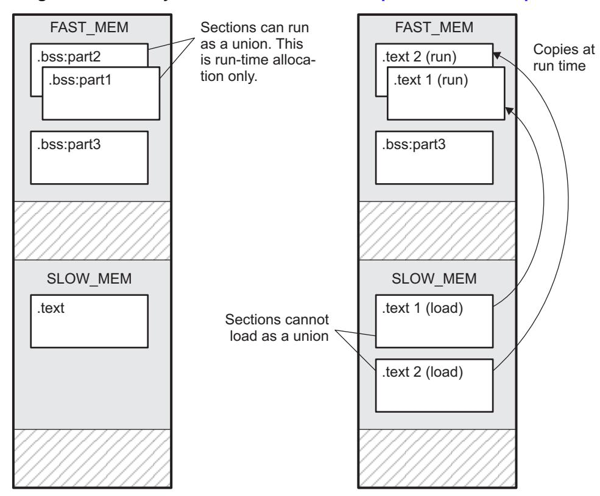

**Figure 8-3: Memory Allocation Shown in Example 8-11 and Example 8-12.** Two side-by-side memory diagrams. Left diagram: FAST_MEM contains .bss:part2 and .bss:part1 (overlapping as a union — run-time allocation only) and .bss:part3 separately; SLOW_MEM contains .text. Right diagram: FAST_MEM contains .text 2 (run) and .text 1 (run) with an arrow labeled "Copies at run time" from SLOW_MEM; SLOW_MEM contains .text 1 (load) and .text 2 (load) labeled "Sections cannot load as a union." The diagrams illustrate that uninitialized (.bss) sections can run as a union sharing the same address space, while initialized (.text) sections must each have a distinct load address.

Since the .text sections contain raw data, they cannot *load* as a union, although they can be *run* as a union. Therefore, each requires its own load address. If you fail to provide a load allocation for an initialized section within a UNION, the linker issues a warning and allocates load space anywhere it can in configured memory.

Uninitialized sections are not loaded and do not require load addresses.

The UNION statement applies only to allocation of run addresses, so it is meaningless to specify a load address for the union itself. For purposes of allocation, the union is treated as an uninitialized section: any one allocation specified is considered a run address, and if both run and load addresses are specified, the linker issues a warning and ignores the load address.

#### 8.5.7.3 Using Memory for Multiple Purposes

One way to reduce an application's memory requirement is to use the same range of memory for multiple purposes. You can first use a range of memory for system initialization and startup. Once that phase is complete, the same memory can be repurposed as a collection of uninitialized data variables or a heap. To implement this scheme, use the following variation of the UNION statement to allow one section to be initialized and the remaining sections to be uninitialized.

Generally, an initialized section (one with raw data, such as .text) in a union must have its load allocation specified separately. However, one and only one initialized section in a union can be allocated at the union's run address. By listing it in the UNION statement with no load allocation at all, it will use the union's run address as its own load address.

## For example:

```
UNION run = FAST_MEM
{ .cinit .bss }
```

In this example, the .cinit section is an initialized section. It will be loaded into FAST\_MEM at the run address of the union. In contrast, .bss is an uninitialized section. Its run address will also be that of the union.

#### 8.5.7.4 Nesting UNIONs and GROUPs

The linker allows arbitrary nesting of GROUP and UNION statements with the SECTIONS directive. By nesting GROUP and UNION statements, you can express hierarchical overlays and groupings of sections. Example 8-13 shows how two overlays can be grouped together.

## Example 8-13. Nesting GROUP and UNION Statements

```
SECTIONS
{
   GROUP 0x1000 : run = FAST_MEM
   {
      UNION:
      {
         mysect1: load = SLOW_MEM
         mysect2: load = SLOW_MEM
      }
      UNION:
      {
         mysect3: load = SLOW_MEM
         mysect4: load = SLOW_MEM
      }
   }
}
```

For this example, the linker performs the following allocations:

- The four sections (mysect1, mysect2, mysect3, mysect4) are assigned unique, non-overlapping load addresses. This assignment is determined by the particular load allocations given for each section.
- Sections mysect1 and mysect2 are assigned the same run address in FAST\_MEM.
- Sections mysect3 and mysect4 are assigned the same run address in FAST\_MEM.
- The run addresses of mysect1/mysect2 and mysect3/mysect4 are allocated contiguously, as directed by the GROUP statement (subject to alignment and blocking restrictions).

To refer to groups and unions, linker diagnostic messages use the notation:

```
GROUP_n UNION_n
```

where *n* is a sequential number (beginning at 1) that represents the lexical ordering of the group or union in the linker control file without regard to nesting. Groups and unions each have their own counter.

#### 8.5.7.5 Checking the Consistency of Allocators

The linker checks the consistency of load and run allocations specified for unions, groups, and sections. The following rules are used:

- Run allocations are only allowed for top-level sections, groups, or unions (sections, groups, or unions that are not nested under any other groups or unions). The linker uses the run address of the top-level structure to compute the run addresses of the components within groups and unions.
- The linker does not accept a load allocation for UNIONs.
- The linker does not accept a load allocation for uninitialized sections.
- In most cases, you must provide a load allocation for an initialized section. However, the linker does not accept a load allocation for an initialized section that is located within a group that already defines a load allocator.
- As a shortcut, you can specify a load allocation for an entire group, to determine the load allocations for every initialized section or subgroup nested within the group. However, a load allocation is accepted for an entire group only if all of the following conditions are true:
  - The group is initialized (that is, it has at least one initialized member).
  - The group is not nested inside another group that has a load allocator.
  - The group does not contain a union containing initialized sections.
- If the group contains a union with initialized sections, it is necessary to specify the load allocation for each initialized section nested within the group. Consider the following example:

```
SECTIONS
{
  GROUP: load = SLOW_MEM, run = SLOW_MEM
  {
   .text1:
   UNION:
   {
    .text2:
    .text3:
   }
  }
}
```

The load allocator given for the group does not uniquely specify the load allocation for the elements within the union: .text2 and .text3. In this case, the linker issues a diagnostic message to request that these load allocations be specified explicitly.

#### 8.5.7.6 Naming UNIONs and GROUPs

You can give a name to a UNION or GROUP by entering the name in parentheses after the declaration. For example:

```
GROUP(BSS_SYSMEM_STACK_GROUP)
{
   .bss :{}
   .sysmem :{}
   .stack :{}
} load=D_MEM, run=D_MEM
```

The name you defined is used in diagnostics for easy identification of the problem LCF area. For example:

```
warning: LOAD placement ignored for "BSS_SYSMEM_STACK_GROUP": object is uninitialized
   UNION(TEXT_CINIT_UNION)
   {
      .const :{}load=D_MEM, table(table1)
      .pinit :{}load=D_MEM, table(table1)
   }run=P_MEM
warning:table(table1) operator ignored: table(table1) has already been applied to a section
in the "UNION(TEXT_CINIT_UNION)" in which ".pinit" is a descendant
```

### 8.5.8 Special Section Types (DSECT, COPY, NOLOAD, and NOINIT)

You can assign the following special types to output sections: DSECT, COPY, NOLOAD, and NOINIT. These types affect the way that the program is treated when it is linked and loaded. You can assign a type to a section by placing the type after the section definition. For example:

```
SECTIONS
   {
   sec1: load = 0x00002000, type = DSECT {f1.obj}
   sec2: load = 0x00004000, type = COPY {f2.obj}
   sec3: load = 0x00006000, type = NOLOAD {f3.obj}
   sec4: load = 0x00008000, type = NOINIT {f4.obj}
   }
```

- The DSECT type creates a dummy section with the following characteristics:
  - It is not included in the output section memory allocation. It takes up no memory and is not included in the memory map listing.
  - It can overlay other output sections, other DSECTs, and unconfigured memory.
  - Global symbols defined in a dummy section are relocated normally. They appear in the output module's symbol table with the same value they would have if the DSECT had actually been loaded. These symbols can be referenced by other input sections.
  - Undefined external symbols found in a DSECT cause specified archive libraries to be searched.
  - The section's contents, relocation information, and line number information are not placed in the output module.

In the preceding example, none of the sections from f1.obj are allocated, but all the symbols are relocated as though the sections were linked at address 0x2000. The other sections can refer to any of the global symbols in sec1.

- A COPY section is similar to a DSECT section, except that its contents and associated information are written to the output module. The .cinit section that contains initialization tables for the PRU C/C++ compiler has this attribute under the run-time initialization model.
- A NOLOAD section differs from a normal output section in one respect: the section's contents, relocation information, and line number information are not placed in the output module. The linker allocates space for the section, and it appears in the memory map listing.
- A NOINIT section is not C auto-initialized by the linker. It is your responsibility to initialize this section as needed.

### 8.5.9 Configuring Error Correcting Code (ECC) with the Linker

Error Correcting Codes (ECC) can be generated and placed in separate sections through the linker command file. ECC uses extra bits to allow errors to be detected and/or corrected by a device. To enable ECC generation, you must include **--ecc=on** as a linker option on the command line. By default ECC generation is off, even if the ECC directive and ECC specifiers are used in the linker command file. This allows you to fully configure ECC in the linker command file while still being able to quickly turn the code generation on and off via the command line.

The ECC support provided by the linker is compatible with the ECC support in TI Flash memory on various TI devices. TI Flash memory uses a modified Hamming(72,64) code, which uses 8 parity bits for every 64 bits. Check the documentation for your Flash memory to see if ECC is supported. (ECC for readwrite memory is handled completely in hardware at run time.)

You can control the details of ECC generation using the ECC specifier in the memory map \(Section 8.5.9.1) and the ECC directive (Section 8.5.9.2).

See Section 8.4.11 for command-line options that introduce bit errors into code that has a corresponding ECC section or into the ECC parity bits themselves. Use these options to test ECC error handling code.

ECC can be generated during linking. The ECC data is included in the resulting object file, alongside code and data, as a data section located at the appropriate address. No extra ECC generation step is required after compilation, and the ECC can be uploaded to the device along with everything else.

#### 8.5.9.1 Using the ECC Specifier in the Memory Map

To generate ECC, add a separate memory range to your memory map to hold ECC data and to indicate which memory range contains the Flash data that corresponds to this ECC data. If you have multiple memory ranges for Flash data, you should add a separate ECC memory range for each Flash data range.

The definition of an ECC memory range can also provide parameters for how to generate the ECC data.

The memory map for a device supporting Flash ECC may look something like this:

```
MEMORY {
  VECTORS : origin=0x00000000 length=0x000020
  FLASH0 : origin=0x00000020 length=0x17FFE0
  FLASH1 : origin=0x00180000 length=0x180000
  STACKS : origin=0x08000000 length=0x000500
  RAM : origin=0x08000500 length=0x03FB00
  ECC_VEC : origin=0xf0400000 length=0x000004 ECC={ input_range=VECTORS }
  ECC_FLA0 : origin=0xf0400004 length=0x02FFFC ECC={ input_range=FLASH0 }
  ECC_FLA1 : origin=0xf0430000 length=0x030000 ECC={ input_range=FLASH1 }
}
```

The specification syntax for ECC memory ranges is as follows:

```
MEMORY {
  <memory specifier1> : <memory attributes> [ vfill=<fill value> ]
  <memory specifier2> : <memory attributes> ECC = {
      input_range = <memory specifier1>
      [ algorithm = <algorithm name> ]
      [ fill = [ true, false ] ]
  }
}
```

The "ECC" specifier attached to the ECC memory ranges indicates the data memory range that the ECC range covers. The ECC specifier supports the following parameters:

input\_range = <*range*> The data memory range covered by this ECC data range. Required.

algorithm = <*ECC alg name*> The name of an ECC algorithm defined later in the command file using the ECC directive. Optional if only one algorithm is defined. (See Section 8.5.9.2.)

fill = true | false Whether to generate ECC data for holes in the initialized data of the input range. The default is "true". Using fill=false produces behavior similar to the nowECC tool. The input range can be filled normally or using a virtual fill (see Section 8.5.9.3).

#### 8.5.9.2 Using the ECC Directive

In addition to specifying ECC memory ranges in the memory map, the linker command file must specify parameters for the algorithm that generates ECC data. You might need multiple ECC algorithm specifications if you have multiple Flash devices.

Each TI device supporting Flash ECC has exactly one set of valid values for these parameters. The linker command files provided with Code Composer Studio include the ECC parameters necessary for ECC support on the Flash memory accessible by the device. Documentation is provided here for completeness.

You specify algorithm parameters with the top-level ECC directive in the linker command file. The specification syntax is as follows:

```
ECC {
   <algorithm name> : parity_mask = <8-bit integer>
                      mirroring = [ F021, F035 ]
                      address_mask = <32-bit mask>
}
For example:
MEMORY {
   FLASH0 : origin=0x00000020 length=0x17FFE0
   ECC_FLA0 : origin=0xf0400004 length=0x02FFFC ECC={ input_range=FLASH0 algorithm=F021 }
}
ECC { F021 : parity_mask = 0xfc
             mirroring = F021 }
```

This ECC directive accepts the following attributes:

| algorithm_name                  | Specify the name you would like to use for referencing the algorithm.                                                                                                                                                                                                                                                                            |
|---------------------------------|--------------------------------------------------------------------------------------------------------------------------------------------------------------------------------------------------------------------------------------------------------------------------------------------------------------------------------------------------|
| address_mask = <32-bit<br>mask> | This mask determines which bits of the address of each 64-bit piece of<br>memory are used in the calculation of the ECC byte for that memory.<br>Default is 0xffffffff, so that all bits of the address are used. (Note that the<br>ECC algorithm itself ignores the lowest bits, which are always zero for a<br>correctly-aligned input block.) |
| parity_mask = <8-bit mask>      | This mask determines which ECC bits encode even parity and which bits<br>encode odd parity. Default is 0, meaning that all bits encode even parity.                                                                                                                                                                                              |
| mirroring = F021   F035         | This setting determines the order of the ECC bytes and their duplication<br>pattern for redundancy. Default is F021.                                                                                                                                                                                                                             |

#### 8.5.9.3 Using the VFILL Specifier in the Memory Map

Normally, specifying a fill value for a MEMORY range creates initialized data sections to cover any previously uninitialized areas of memory. To generate ECC data for an entire memory range, the linker either needs to have initialized data in the entire range, or needs to know what value uninitialized memory areas will have at run time.

In cases where you want to generate ECC for an entire memory range, but do not want to initialize the entire range by specifying a fill value, you can use the "vfill" specifier instead of a "fill" specifier to virtually fill the range:

```
MEMORY {
   FLASH : origin=0x0000 length=0x4000 vfill=0xffffffff
}
```

The vfill specifier is functionally equivalent to omitting a fill specifier, except that it allows ECC data to be generated for areas of the input memory range that remain uninitialized. This has the benefit of reducing the size of the resulting object file.

The vfill specifier has no effect other than in ECC data generation. It cannot be specified along with a fill specifier, since that would introduce ambiguity.

If fill is specified in the ECC specifier, but vfill is not specified, vfill defaults to 0xff.

### 8.5.10 Assigning Symbols at Link Time

Linker assignment statements allow you to define external (global) symbols and assign values to them at link time. You can use this feature to initialize a variable or pointer to an allocation-dependent value. See Section 8.6.1 for information about referring to linker symbols in C/C++ code.

#### 8.5.10.1 Syntax of Assignment Statements

The syntax of assignment statements in the linker is similar to that of assignment statements in the C language:

```
symbol = expression; assigns the value of expression to symbol
symbol + = expression; adds the value of expression to symbol
symbol - = expression; subtracts the value of expression from symbol
symbol * = expression; multiplies symbol by expression
symbol / = expression; divides symbol by expression
```

The symbol should be defined externally. If it is not, the linker defines a new symbol and enters it into the symbol table. The expression must follow the rules defined in Section 8.5.10.3. Assignment statements *must* terminate with a semicolon.

The linker processes assignment statements *after* it allocates all the output sections. Therefore, if an expression contains a symbol, the address used for that symbol reflects the symbol's address in the executable output file.

For example, suppose a program reads data from one of two tables identified by two external symbols, Table1 and Table2. The program uses the symbol cur\_tab as the address of the current table. The cur\_tab symbol must point to either Table1 or Table2. You could accomplish this in the assembly code, but you would need to reassemble the program to change tables. Instead, you can use a linker assignment statement to assign cur\_tab at link time:

```
prog.obj /* Input file */
cur_tab = Table1; /* Assign cur_tab to one of the tables */
```

#### 8.5.10.2 Assigning the SPC to a Symbol

A special symbol, denoted by a dot (.), represents the current value of the section program counter (SPC) during allocation. The SPC keeps track of the current location within a section. The linker's . symbol is analogous to the assembler's \$ symbol. The . symbol can be used only in assignment statements within a SECTIONS directive because . is meaningful only during allocation and SECTIONS controls the allocation process. (See Section 8.5.5.)

The . symbol refers to the current run address, not the current load address, of the section.

For example, suppose a program needs to know the address of the beginning of the .data section. By using the .global directive (see Identify Global Symbols), you can create an external undefined variable called Dstart in the program. Then, assign the value of . to Dstart:

```
SECTIONS
{
  .text: {}
  .data: {Dstart = .;}
  .bss : {}
}
```

This defines Dstart to be the first linked address of the .data section. (Dstart is assigned *before* .data is allocated.) The linker relocates all references to Dstart.

A special type of assignment assigns a value to the . symbol. This adjusts the SPC within an output section and creates a hole between two input sections. Any value assigned to . to create a hole is relative to the beginning of the section, not to the address actually represented by the . symbol. Holes and assignments to . are described in Section 8.5.11.

#### 8.5.10.3 Assignment Expressions

These rules apply to linker expressions:

- Expressions can contain global symbols, constants, and the C language operators listed in Table 8-11.

- All numbers are treated as long (32-bit) integers.
- Constants are identified by the linker in the same way as by the assembler. That is, numbers are recognized as decimal unless they have a suffix (H or h for hexadecimal and Q or q for octal). C language prefixes are also recognized (0 for octal and 0x for hex). Hexadecimal constants must begin with a digit. No binary constants are allowed.
- Symbols within an expression have only the value of the symbol's *address*. No type-checking is performed.
- Linker expressions can be absolute or relocatable. If an expression contains *any* relocatable symbols (and 0 or more constants or absolute symbols), it is relocatable. Otherwise, the expression is absolute. If a symbol is assigned the value of a relocatable expression, it is relocatable; if it is assigned the value of an absolute expression, it is absolute.

The linker supports the C language operators listed in Table 8-11 in order of precedence. Operators in the same group have the same precedence. Besides the operators listed in Table 8-11, the linker also has an align operator that allows a symbol to be aligned on an n-byte boundary within an output section (n is a power of 2). For example, the following expression aligns the SPC within the current section on the next 16-byte boundary. Because the align operator is a function of the current SPC, it can be used only in the same context as . —that is, within a SECTIONS directive.

```
. = align(16);
```

**Table 8-11. Groups of Operators Used in Expressions (Precedence)**

|                                   | Group 1 (Highest Precedence)                                                                               |                               | Group 6                                                |                                                                              |                                                  |
|-----------------------------------|------------------------------------------------------------------------------------------------------------|-------------------------------|--------------------------------------------------------|------------------------------------------------------------------------------|--------------------------------------------------|
| !<br>~<br>-                       | Logical NOT<br>Bitwise NOT<br>Negation                                                                     | &                             |                                                        | Bitwise AND                                                                  |                                                  |
|                                   | Group 2                                                                                                    |                               | Group 7                                                |                                                                              |                                                  |
| *<br>/<br>%                       | Multiplication<br>Division<br>Modulus                                                                      | \|                            | Bitwise OR                                             |                                                                              |                                                  |
|                                   | Group 3                                                                                                    | Group 8                       |                                                        |                                                                              |                                                  |
| +<br>-                            | Addition<br>Subtraction                                                                                    | &&                            |                                                        | Logical AND                                                                  |                                                  |
|                                   | Group 4                                                                                                    | Group 9                       |                                                        |                                                                              |                                                  |
| >><br><<                          | Arithmetic right shift<br>Arithmetic left shift                                                            | \|\|                          | Logical OR                                             |                                                                              |                                                  |
|                                   | Group 5                                                                                                    | Group 10 (Lowest Precedence)  |                                                        |                                                                              |                                                  |
| ==<br>! =<br>><br><<br>< =<br>> = | Equal to<br>Not equal to<br>Greater than<br>Less than<br>Less than or equal to<br>Greater than or equal to | =<br>+ =<br>- =<br>* =<br>/ = | Assignment<br>A + = B<br>A - = B<br>A * = B<br>A / = B | is equivalent to<br>is equivalent to<br>is equivalent to<br>is equivalent to | A = A + B<br>A = A - B<br>A = A * B<br>A = A / B |

#### 8.5.10.4 Symbols Automatically Defined by the Linker

The linker automatically defines the following symbols for C/C++ support when the --ram\_model or --rom\_model option is used.

| __TI_STACK_END   | is assigned the end of the .stack size.         |
|------------------|-------------------------------------------------|
| __TI_STACK_SIZE  | is assigned the size of the .stack section for. |
| __TI_SYSMEM_SIZE | is assigned the size of the .sysmem section.    |

These linker-defined symbols can be accessed in any assembly language module if they are declared with a .global directive (see Identify Global Symbols).

See Section 8.6.1 for information about referring to linker symbols in C/C++ code.

#### 8.5.10.5 Why the Dot Operator Does Not Always Work

The dot operator (.) is used to define symbols at link-time with a particular address inside of an output section. It is interpreted like a PC. Whatever the current offset within the current section is, that is the value associated with the dot. Consider an output section specification within a SECTIONS directive:

```
outsect:
{
        s1.obj(.text)
        end_of_s1 = .;
        start_of_s2 = .;
        s2.obj(.text)
        end_of_s2 = .;
}
```

This statement creates three symbols:

- end\_of\_s1—the end address of .text in s1.obj
- start\_of\_s2—the start address of .text in s2.obj
- end\_of\_s2—the end address of .text in s2.obj

Suppose there is padding between s1.obj and s2.obj created as a result of alignment. Then start\_of\_s2 is not really the start address of the .text section in s2.obj, but it is the address before the padding needed to align the .text section in s2.obj. This is due to the linker's interpretation of the dot operator as the current PC. It is also true because the dot operator is evaluated independently of the input sections around it.

Another potential problem in the above example is that end\_of\_s2 may not account for any padding that was required at the end of the output section. You cannot reliably use end\_of\_s2 as the end address of the output section. One way to get around this problem is to create a dummy section immediately after the output section in question. For example:

```
GROUP
{
   outsect:
   {
      start_of_outsect = .;
      ...
   }
      dummy: { size_of_outsect = . - start_of_outsect; }
}
```

#### 8.5.10.6 Address and Dimension Operators

Six operators allow you to define symbols for load-time and run-time addresses and sizes:

| LOAD_START( sym )<br>START( sym ) | Defines sym with the load-time start address of related allocation unit |
|-----------------------------------|-------------------------------------------------------------------------|
| LOAD_END( sym )<br>END( sym )     | Defines sym with the load-time end address of related allocation unit   |
| LOAD_SIZE( sym )<br>SIZE( sym )   | Defines sym with the load-time size of related allocation unit          |
| RUN_START( sym )                  | Defines sym with the run-time start address of related allocation unit  |
| RUN_END( sym )                    | Defines sym with the run-time end address of related allocation unit    |
| RUN_SIZE(sym )                    | Defines sym with the run-time size of related allocation unit           |

#### Linker Command File Operator Equivalencies --

**NOTE:** LOAD\_START() and START() are equivalent, as are LOAD\_END()/END() and LOAD\_SIZE()/SIZE(). The LOAD names are recommended for clarity.

These address and dimension operators can be associated with several different kinds of allocation units, including input items, output sections, GROUPs, and UNIONs. The following sections provide some examples of how the operators can be used in each case.

These symbols defined by the linker can be accessed at runtime using the \_symval operator, which is essentially a cast operation. For example, suppose your linker command file contains the following:

```
.text: RUN_START(text_run_start), RUN_SIZE(text_run_size) { *(.text) }
```

Your C program can access these symbols as follows:

```
extern char text_run_start, text_run_size;
printf(".text load start is %lx\n", _symval(&text_run_start));
printf(".text load size is %lx\n", _symval(&text_run_size));
```

See Section 8.6.1 for more information about referring to linker symbols in C/C++ code.

#### 8.5.10.6.1 Input Items

Consider an output section specification within a SECTIONS directive:

```
outsect:
{
        s1.obj(.text)
        end_of_s1 = .;
        start_of_s2 = .;
        s2.obj(.text)
        end_of_s2 = .;
}
```

This can be rewritten using the START and END operators as follows:

```
outsect:
{
        s1.obj(.text) { END(end_of_s1) }
        s2.obj(.text) { START(start_of_s2), END(end_of_s2) }
}
```

The values of end\_of\_s1 and end\_of\_s2 will be the same as if you had used the dot operator in the original example, but start\_of\_s2 would be defined after any necessary padding that needs to be added between the two .text sections. Remember that the dot operator would cause start\_of\_s2 to be defined before any necessary padding is inserted between the two input sections.

The syntax for using these operators in association with input sections calls for braces { } to enclose the operator list. The operators in the list are applied to the input item that occurs immediately before the list.

#### 8.5.10.6.2 Output Section

The START, END, and SIZE operators can also be associated with an output section. Here is an example:

```
outsect: START(start_of_outsect), SIZE(size_of_outsect)
{
        <list of input items>
}
```

In this case, the SIZE operator defines size\_of\_outsect to incorporate any padding that is required in the output section to conform to any alignment requirements that are imposed.

The syntax for specifying the operators with an output section does not require braces to enclose the operator list. The operator list is simply included as part of the allocation specification for an output section.

#### 8.5.10.6.3 GROUPs

Here is another use of the START and SIZE operators in the context of a GROUP specification:

```
GROUP
{
        outsect1: { ... }
        outsect2: { ... }
} load = ROM, run = RAM, START(group_start), SIZE(group_size);
```

This can be useful if the whole GROUP is to be loaded in one location and run in another. The copying code can use group\_start and group\_size as parameters for where to copy from and how much is to be copied.

#### 8.5.10.6.4 UNIONs

The RUN\_SIZE and LOAD\_SIZE operators provide a mechanism to distinguish between the size of a UNION's load space and the size of the space where its constituents are going to be copied before they are run. Here is an example:

```
UNION: run = RAM, LOAD_START(union_load_addr),
       LOAD_SIZE(union_ld_sz), RUN_SIZE(union_run_sz)
{
        .text1: load = ROM, SIZE(text1_size) { f1.obj(.text) }
        .text2: load = ROM, SIZE(text2_size) { f2.obj(.text) }
}
```

Here union\_ld\_sz is going to be equal to the sum of the sizes of all output sections placed in the union. The union\_run\_sz value is equivalent to the largest output section in the union. Both of these symbols incorporate any padding due to blocking or alignment requirements.

### 8.5.11 Creating and Filling Holes

The linker provides you with the ability to create areas *within output sections* that have nothing linked into them. These areas are called *holes*. In special cases, uninitialized sections can also be treated as holes. This section describes how the linker handles holes and how you can fill holes (and uninitialized sections) with values.

#### 8.5.11.1 Initialized and Uninitialized Sections

There are two rules to remember about the contents of output sections. An output section contains either:

- Raw data for the *entire* section
- *No* raw data

A section that has raw data is referred to as *initialized*. This means that the object file contains the actual memory image contents of the section. When the section is loaded, this image is loaded into memory at the section's specified starting address. The .text and .data sections *always* have raw data if anything was assembled into them. Named sections defined with the .sect assembler directive also have raw data.

By default, the .bss section (see Reserve Space in the .bss Section) and sections defined with the .usect directive (see Reserve Uninitialized Space) have no raw data (they are *uninitialized*). They occupy space in the memory map but have no actual contents. Uninitialized sections typically reserve space in fast external memory for variables. In the object file, an uninitialized section has a normal section header and can have symbols defined in it; no memory image, however, is stored in the section.

#### 8.5.11.2 Creating Holes

You can create a hole in an initialized output section. A hole is created when you force the linker to leave extra space between input sections within an output section. When such a hole is created, *the linker must supply raw data for the hole.*

Holes can be created only *within* output sections. Space can exist *between* output sections, but such space is not a hole. To fill the space between output sections, see Section 8.5.4.2.

To create a hole in an output section, you must use a special type of linker assignment statement within an output section definition. The assignment statement modifies the SPC (denoted by .) by adding to it, assigning a greater value to it, or aligning it on an address boundary. The operators, expressions, and syntaxes of assignment statements are described in Section 8.5.10.

The following example uses assignment statements to create holes in output sections:

```
SECTIONS
{
   outsect:
   {
      file1.obj(.text)
     . += 0x0100 /* Create a hole with size 0x0100 */
      file2.obj(.text)
    . = align(16); /* Create a hole to align the SPC */
      file3.obj(.text)
    }
}
```

The output section outsect is built as follows:

1. The .text section from file1.obj is linked in.
2. The linker creates a 256-byte hole.
3. The .text section from file2.obj is linked in after the hole.
4. The linker creates another hole by aligning the SPC on a 16-byte boundary.
5. Finally, the .text section from file3.obj is linked in.

All values assigned to the . symbol within a section refer to the *relative address within the section.* The linker handles assignments to the . symbol as if the section started at address 0 (even if you have specified a binding address). Consider the statement . = align(16) in the example. This statement effectively aligns the file3.obj .text section to start on a 16-byte boundary within outsect. If outsect is ultimately allocated to start on an address that is not aligned, the file3.obj .text section will not be aligned either.

The . symbol refers to the current run address, not the current load address, of the section.

Expressions that decrement the . symbol are illegal. For example, it is invalid to use the -= operator in an assignment to the . symbol. The most common operators used in assignments to the . symbol are += and align.

If an output section contains all input sections of a certain type (such as .text), you can use the following statements to create a hole at the beginning or end of the output section.

```
.text: { .+= 0x0100; } /* Hole at the beginning */
.data: { *(.data)
          . += 0x0100; } /* Hole at the end */
```

Another way to create a hole in an output section is to combine an uninitialized section with an initialized section to form a single output section. *In this case, the linker treats the uninitialized section as a hole and supplies data for it.* The following example illustrates this method:

```
SECTIONS
{
  outsect:
  {
     file1.obj(.text)
    file1.obj(.bss) /* This becomes a hole */
  }
}
```

Because the .text section has raw data, all of outsect must also contain raw data. Therefore, the uninitialized .bss section becomes a hole.

Uninitialized sections become holes only when they are combined with initialized sections. If several uninitialized sections are linked together, the resulting output section is also uninitialized.

#### 8.5.11.3 Filling Holes

When a hole exists in an initialized output section, the linker must supply raw data to fill it. The linker fills holes with a 32-bit fill value that is replicated through memory until it fills the hole. The linker determines the fill value as follows:

1. If the hole is formed by combining an uninitialized section with an initialized section, you can specify a fill value for the uninitialized section. Follow the section name with an = sign and a 32-bit constant. For example:

```
SECTIONS
{ outsect:
   {
      file1.obj(.text)
      file2.obj(.bss)= 0xFF00FF00 /* Fill this hole with 0xFF00FF00 */
   }
}
```

2. You can also specify a fill value for all the holes in an output section by supplying the fill value after the section definition:

```
SECTIONS
{ outsect:fill = 0xFF00FF00 /* Fills holes with 0xFF00FF00 */
  {
    . += 0x0010; /* This creates a hole */
    file1.obj(.text)
    file1.obj(.bss) /* This creates another hole */
  }
}
```

3. If you do not specify an initialization value for a hole, the linker fills the hole with the value specified with the --fill\_value option (see Section 8.4.13). For example, suppose the command file link.cmd contains the following SECTIONS directive:

```
SECTIONS { .text: { .= 0x0100; } /* Create a 100 word hole */ }
```

Now invoke the linker with the --fill\_value option:

```
clpru --run_linker --fill_value=0xFFFFFFFF link.cmd
```

This fills the hole with 0xFFFFFFFF.

4. If you do not invoke the linker with the --fill\_value option or otherwise specify a fill value, the linker fills holes with 0s.

Whenever a hole is created and filled in an initialized output section, the hole is identified in the link map along with the value the linker uses to fill it.

#### 8.5.11.4 Explicit Initialization of Uninitialized Sections

You can force the linker to initialize an uninitialized section by specifying an explicit fill value for it in the SECTIONS directive. This causes the entire section to have raw data (the fill value). For example:

```
SECTIONS
{
   .bss: fill = 0x12341234 /* Fills .bss with 0x12341234 */
}
```

#### Filling Sections

**NOTE:** Because filling a section (even with 0s) causes raw data to be generated for the entire section in the output file, your output file will be very large if you specify fill values for large sections or holes.

## 8.6 Linker Symbols

This section provides information about using and resolving linker symbols.

### 8.6.1 Using Linker Symbols in C/C++ Applications

Linker symbols have a name and a value. The value is a 32-bit unsigned integer, even if it represents a pointer value on a target that has pointers smaller than 32 bits.

The most common kind of symbol is generated by the compiler for each function and variable. The value represents the target address where that function or variable is located. When you refer to the symbol by name in the linker command file or in an assembly file, you get that 32-bit integer value.

However, in C and C++ names mean something different. If you have a variable named x that contains the value Y, and you use the name "x" in your C program, you are actually referring to the contents of variable x. If "x" is used on the right-hand side of an expression, the compiler fetches the value Y. To realize this variable, the compiler generates a linker symbol named x with the value &x. Even though the C/C++ variable and the linker symbol have the same name, they don't represent the same thing. In C, x is a variable name with the address &x and content Y. For linker symbols, x is an address, and that address contains the value Y.

Because of this difference, there are some tricks to referring to linker symbols in C code. The basic technique is to cause the compiler to creating a "fake" C variable or function and take its address. The details differ depending on the type of linker symbol.

**Linker symbols that represent a function address:** In C code, declare the function as an extern function. Then, refer to the value of the linker symbol using the same name. This works because function pointers "decay" to their address value when used without adornment. For example:

```
extern void _c_int00(void);
printf("_c_int00 %lx\n", (unsigned long)&_c_int00);
```

Suppose your linker command file defines the following linker symbol:

```
func_sym=printf+100;
```

Your C application can refer to this symbol as follows:

```
extern void func_sym(void);
printf("func_sym %lx\n", _symval(&func_sym)); /* these two are equivalent */
printf("func_sym %lx\n", (unsigned long)&func_sym);
```

**Linker symbols that represent a data address:** In C code, declare the variable as an extern variable. Then, refer to the value of the linker symbol using the & operator. Because the variable is at a valid data address, we know that a data pointer can represent the value.

Suppose your linker command file defines the following linker symbols:

```
data_sym=.data+100;
xyz=12345
```

Your C application can refer to these symbols as follows:

```
extern char data_sym;
extern int xyz;
printf("data_sym %lx\n", _symval(&data_sym)); /* these two are equivalent */
printf("data_sym %p\n", &data_sym);
myvar = &xyz;
```

**Linker symbols for an arbitrary address:** In C code, declare this as an extern symbol. The type does not matter. If you are using GCC extensions, declare it as "extern void". If you are not using GCC extensions, declare it as "extern char". Then, refer to the value of the linker symbol mySymbol as \_symval(&mySymbol). You must use the \_symval operator, which is equivalent to a cast, because the 32-bit value of the linker symbol could be wider than a data pointer. The compiler treats \_symval(&mySymbol) in a special way that can represent all 32 bits, even when pointers are 16 bits. Targets that have 32-bit pointers can usually use &mySymbol instead of the \_symval operator. However, the portable way to access such linker symbols across TI targets is to use \_symval(&mySymbol).

Suppose your linker command file defines the following linker symbol:

```
abs_sym=0x12345678;
```

Your C application can refer to this symbol as follows:

```
extern char abs_sym;
printf("abs_sym %lx\n", _symval(&abs_sym));
```

### 8.6.2 Declaring Weak Symbols

In a linker command file, an assignment expression outside a MEMORY or SECTIONS directive can be used to define a linker-defined symbol. To define a weak symbol in a linker command file, use the "weak" operator in an assignment expression to designate that the symbol as eligible for removal from the output file's symbol table if it is not referenced. For example, you can define "ext\_addr\_sym" as follows:

```
weak(ext_addr_sym) = 0x12345678;
```

When the linker command file is used to perform the final link, then "ext\_addr\_sym" is presented to the linker as a weak absolute symbol; it will not be included in the resulting output file if the symbol is not referenced.

See Section 2.6.2 for details about how weak symbols are handled by the linker.

### 8.6.3 Resolving Symbols with Object Libraries

An object library is a partitioned archive file that contains object files as members. Usually, a group of related modules are grouped together into a library. When you specify an object library as linker input, the linker includes any members of the library that define existing unresolved symbol references. You can use the archiver to build and maintain libraries. Section 7.1 contains more information about the archiver.

Using object libraries can reduce link time and the size of the executable module. Normally, if an object file that contains a function is specified at link time, the file is linked whether the function is used or not; however, if that same function is placed in an archive library, the file is included only if the function is referenced.

The order in which libraries are specified is important, because the linker includes only those members that resolve symbols that are undefined at the time the library is searched. The same library can be specified as often as necessary; it is searched each time it is included. Alternatively, you can use the --reread\_libs option to reread libraries until no more references can be resolved (see Section 8.4.16.3). A library has a table that lists all external symbols defined in the library; the linker searches through the table until it determines that it cannot use the library to resolve any more references.

The following examples link several files and libraries, using these assumptions:

- Input files f1.obj and f2.obj both reference an external function named *clrscr*.
- Input file f1.obj references the symbol *origin*.
- Input file f2.obj references the symbol *fillclr*.
- Member 0 of library libc.lib contains a definition of *origin*.
- Member 3 of library liba.lib contains a definition of *fillclr*.
- Member 1 of both libraries defines *clrscr*.

If you enter:

**clpru --run\_linker f1.obj f2.obj liba.lib libc.lib**

then:

- Member 1 of liba.lib satisfies the f1.obj and f2.obj references to *clrscr* because the library is searched and the definition of *clrscr* is found.
- Member 0 of libc.lib satisfies the reference to *origin*.
- Member 3 of liba.lib satisfies the reference to *fillclr*.

If, however, you enter:

```
clpru --run_linker f1.obj f2.obj libc.lib liba.lib
```

then the references to *clrscr* are satisfied by member 1 of libc.lib.

If none of the linked files reference symbols defined in a library, you can use the --undef\_sym option to force the linker to include a library member. (See Section 8.4.32.) The next example creates an undefined symbol rout1 in the linker's global symbol table:

```
clpru --run_linker --undef_sym=rout1 libc.lib
```

If any member of libc.lib defines rout1, the linker includes that member.

Library members are allocated according to the SECTIONS directive default allocation algorithm; see Section 8.5.5.

Section 8.4.16 describes methods for specifying directories that contain object libraries.

## 8.7 Default Placement Algorithm

The MEMORY and SECTIONS directives provide flexible methods for building, combining, and allocating sections. However, any memory locations or sections you choose *not* to specify must still be handled by the linker. The linker uses algorithms to build and allocate sections in coordination with any specifications you do supply.

If you do not use the MEMORY and SECTIONS directives, the linker allocates output sections as though the memory map and section definitions were as shown in Example 8-14 were specified.

### Example 8-14. Default Allocation for PRU Devices

```
{
  RAM : origin = 0x00000000, length = 0xFFFFFFFF
}
SECTIONS
{
  .text : ALIGN(4) {} > RAM
  .const: ALIGN(4) {} > RAM
  .data : ALIGN(4) {} > RAM
  .bss : ALIGN(4) {} > RAM
  .cinit: ALIGN(4) {} > RAM /* -c option only */
  .pinit: ALIGN(4) {} > RAM /* -c option only */
}
```

Also see Section 2.5.1 for information about default memory allocation.

All .text input sections are concatenated to form a .text output section in the executable output file, and all .data input sections are combined to form a .data output section.

If you use a SECTIONS directive, the linker performs *no part* of this default allocation. Instead, allocation is performed according to the rules specified by the SECTIONS directive and the general algorithm described next in Section 8.7.1.

### 8.7.1 How the Allocation Algorithm Creates Output Sections

An output section can be formed in one of two ways:

- **Method 1** As the result of a SECTIONS directive definition
- **Method 2** By combining input sections with the same name into an output section that is not defined in a SECTIONS directive

If an output section is formed as a result of a SECTIONS directive, this definition completely determines the section's contents. (See Section 8.5.5 for examples of how to define an output section's content.)

If an output section is formed by combining input sections not specified by a SECTIONS directive, the linker combines all such input sections that have the same name into an output section with that name. For example, suppose the files f1.obj and f2.obj both contain named sections called Vectors and that the SECTIONS directive does not define an output section for them. The linker combines the two Vectors sections from the input files into a single output section named Vectors, allocates it into memory, and includes it in the output file.

By default, the linker does not display a message when it creates an output section that is not defined in the SECTIONS directive. You can use the --warn\_sections linker option (see Section 8.4.33) to cause the linker to display a message when it creates a new output section.

After the linker determines the composition of all output sections, it must allocate them into configured memory. The MEMORY directive specifies which portions of memory are configured. If there is no MEMORY directive, the linker uses the default configuration as shown in Example 8-14. (See Section 8.5.4 for more information on configuring memory.)

### 8.7.2 Reducing Memory Fragmentation

The linker's allocation algorithm attempts to minimize memory fragmentation. This allows memory to be used more efficiently and increases the probability that your program will fit into memory. The algorithm comprises these steps:

1. Each output section for which you supply a specific binding address is placed in memory at that address.
2. Each output section that is included in a specific, named memory range or that has memory attribute restrictions is allocated. Each output section is placed into the first available space within the named area, considering alignment where necessary.
3. Any remaining sections are allocated in the order in which they are defined. Sections not defined in a SECTIONS directive are allocated in the order in which they are encountered. Each output section is placed into the first available memory space, considering alignment where necessary.

If you want to control the order in which code and data are placed in memory, see the FAQ [topic](http://processors.wiki.ti.com/index.php/Code_Generation_Tools_FAQ#Q:_How_can_I_get_the_linker_to_place_a_piece_of_code_or_data_so_that_it_comes_before_all_the_rest.3F) on section [placement.](http://processors.wiki.ti.com/index.php/Code_Generation_Tools_FAQ#Q:_How_can_I_get_the_linker_to_place_a_piece_of_code_or_data_so_that_it_comes_before_all_the_rest.3F)

## 8.8 Linker-Generated Copy Tables

The linker supports extensions to the linker command file syntax that enable the following:

- Make it easier for you to copy objects from load-space to run-space at boot time
- Make it easier for you to manage memory overlays at run time
- Allow you to split GROUPs and output sections that have separate load and run addresses

### 8.8.1 Using Copy Tables for Boot Loading

In some embedded applications, there is a need to copy or download code and/or data from one location to another at boot time before the application actually begins its main execution thread. For example, an application may have its code and/or data in FLASH memory and need to copy it into on-chip memory before the application begins execution.

One way to develop such an application is to create a copy table in assembly code that contains three elements for each block of code or data that needs to be moved from FLASH to on-chip memory at boot time:

- The load address
- The run address
- The size

The process you follow to develop such an application might look like this:

1. Build the application to produce a .map file that contains the load and run addresses of each section that has a separate load and run placement.
2. Edit the copy table (used by the boot loader) to correct the load and run addresses as well as the size of each block of code or data that needs to be moved at boot time.
3. Build the application again, incorporating the updated copy table.
4. Run the application.

This process puts a heavy burden on you to maintain the copy table (by hand, no less). Each time a piece of code or data is added or removed from the application, you must repeat the process in order to keep the contents of the copy table up to date.

### 8.8.2 Using Built-in Link Operators in Copy Tables

You can avoid some of this maintenance burden by using the LOAD\_START(), RUN\_START(), and SIZE() operators that are already part of the linker command file syntax . For example, instead of building the application to generate a .map file, the linker command file can be annotated:

```
SECTIONS
{
   .flashcode: { app_tasks.obj(.text) }
      load = FLASH, run = PMEM,
      LOAD_START(_flash_code_ld_start),
      RUN_START(_flash_code_rn_start),
      SIZE(_flash_code_size)
   ...
}
```

In this example, the LOAD\_START(), RUN\_START(), and SIZE() operators instruct the linker to create three symbols:

| Symbol               | Description                        |  |
|----------------------|------------------------------------|--|
| _flash_code_ld_start | Load address of .flashcode section |  |
| _flash_code_rn_start | Run address of .flashcode section  |  |
| _flash_code_size     | Size of .flashcode section         |  |

These symbols can then be referenced from the copy table. The actual data in the copy table will be updated automatically each time the application is linked. This approach removes step 1 of the process described in Section 8.8.1.

While maintenance of the copy table is reduced markedly, you must still carry the burden of keeping the copy table contents in sync with the symbols that are defined in the linker command file. Ideally, the linker would generate the boot copy table automatically. This would avoid having to build the application twice *and* free you from having to explicitly manage the contents of the boot copy table.

For more information on the LOAD\_START(), RUN\_START(), and SIZE() operators, see Section 8.5.10.6.

### 8.8.3 Overlay Management Example

Consider an application that contains a memory overlay that must be managed at run time. The memory overlay is defined using a UNION in the linker command file as illustrated in Example 8-15:

## Example 8-15. Using a UNION for Memory Overlay

```
SECTIONS
{
   ...
   UNION
   {
      GROUP
      {
         .task1: { task1.obj(.text) }
         .task2: { task2.obj(.text) }
      } load = ROM, LOAD_START(_task12_load_start), SIZE(_task12_size)
      GROUP
      {
         .task3: { task3.obj(.text) }
         .task4: { task4.obj(.text) }
      } load = ROM, LOAD_START(_task34_load_start), SIZE(_task34_size)
   } run = RAM, RUN_START(_task_run_start)
 ...
}
```

The application must manage the contents of the memory overlay at run time. That is, whenever any services from .task1 or .task2 are needed, the application must first ensure that .task1 and .task2 are resident in the memory overlay. Similarly for .task3 and .task4.

To affect a copy of .task1 and .task2 from ROM to RAM at run time, the application must first gain access to the load address of the tasks (\_task12\_load\_start), the run address (\_task\_run\_start), and the size (\_task12\_size). Then this information is used to perform the actual code copy.

### 8.8.4 Generating Copy Tables With the table() Operator

The linker supports extensions to the linker command file syntax that enable you to do the following:

- Identify any object components that may need to be copied from load space to run space at some point during the run of an application
- Instruct the linker to automatically generate a copy table that contains (at least) the load address, run address, and size of the component that needs to be copied
- Instruct the linker to generate a symbol specified by you that provides the address of a linker-generated copy table. For instance, Example 8-15 can be written as shown in Example 8-16:

## Example 8-16. Produce Address for Linker Generated Copy Table

```
SECTIONS
{
   ...
   UNION
   {
      GROUP
      {
         .task1: { task1.obj(.text) }
         .task2: { task2.obj(.text) }
      } load = ROM, table(_task12_copy_table)
      GROUP
      {
         .task3: { task3.obj(.text) }
         .task4: { task4.obj(.text) }
      } load = ROM, table(_task34_copy_table)
   } run = RAM
   ...
}
```

Using the SECTIONS directive from Example 8-16 in the linker command file, the linker generates two copy tables named: \_task12\_copy\_table and \_task34\_copy\_table. Each copy table provides the load address, run address, and size of the GROUP that is associated with the copy table. This information is accessible from application source code using the linker-generated symbols, \_task12\_copy\_table and \_task34\_copy\_table, which provide the addresses of the two copy tables, respectively.

Using this method, you need not worry about the creation or maintenance of a copy table. You can reference the address of any copy table generated by the linker in C/C++ or assembly source code, passing that value to a general purpose copy routine, which will process the copy table and affect the actual copy.

#### 8.8.4.1 The table() Operator

You can use the table() operator to instruct the linker to produce a copy table. A table() operator can be applied to an output section, a GROUP, or a UNION member. The copy table generated for a particular table() specification can be accessed through a symbol specified by you that is provided as an argument to the table() operator. The linker creates a symbol with this name and assigns it the address of the copy table as the value of the symbol. The copy table can then be accessed from the application using the linker-generated symbol.

Each table() specification you apply to members of a given UNION must contain a unique name. If a table() operator is applied to a GROUP, then none of that GROUP's members may be marked with a table() specification. The linker detects violations of these rules and reports them as warnings, ignoring each offending use of the table() specification. The linker does not generate a copy table for erroneous table() operator specifications.

Copy tables can be generated automatically; see Section 8.8.4.

#### 8.8.4.2 Boot-Time Copy Tables

The linker supports a special copy table name, BINIT (or binit), that you can use to create a boot-time copy table. This table is handled before the .cinit section is used to initialize variables at startup. For example, the linker command file for the boot-loaded application described in Section 8.8.2 can be rewritten as follows:

```
SECTIONS
{
   .flashcode: { app_tasks.obj(.text) }
   load = FLASH, run = PMEM,
      table(BINIT)
   ...
}
```

For this example, the linker creates a copy table that can be accessed through a special linker-generated symbol, \_\_binit\_\_, which contains the list of all object components that need to be copied from their load location to their run location at boot-time. If a linker command file does not contain any uses of table(BINIT), then the \_\_binit\_\_ symbol is given a value of -1 to indicate that a boot-time copy table does not exist for a particular application.

You can apply the table(BINIT) specification to an output section, GROUP, or UNION member. If used in the context of a UNION, only one member of the UNION can be designated with table(BINIT). If applied to a GROUP, then none of that GROUP's members may be marked with table(BINIT).The linker detects violations of these rules and reports them as warnings, ignoring each offending use of the table(BINIT) specification.

#### 8.8.4.3 Using the table() Operator to Manage Object Components

If you have several pieces of code that need to be managed together, then you can apply the same table() operator to several different object components. In addition, if you want to manage a particular object component in multiple ways, you can apply more than one table() operator to it. Consider the linker command file excerpt in Example 8-17:

## Example 8-17. Linker Command File to Manage Object Components

```
SECTIONS
{
   UNION
   {
      .first: { a1.obj(.text), b1.obj(.text), c1.obj(.text) }
            load = EMEM, run = PMEM, table(BINIT), table(_first_ctbl)
      .second: { a2.obj(.text), b2.obj(.text) }
            load = EMEM, run = PMEM, table(_second_ctbl)
   }
   .extra: load = EMEM, run = PMEM, table(BINIT)
   ...
}
```

In this example, the output sections .first and .extra are copied from external memory (EMEM) into program memory (PMEM) at boot time while processing the BINIT copy table. After the application has started executing its main thread, it can then manage the contents of the overlay using the two overlay copy tables named: \_first\_ctbl and \_second\_ctbl.

#### 8.8.4.4 Linker-Generated Copy Table Sections and Symbols

The linker creates and allocates a separate input section for each copy table that it generates. Each copy table symbol is defined with the address value of the input section that contains the corresponding copy table.

The linker generates a unique name for each overlay copy table input section. For example, table(\_first\_ctbl) would place the copy table for the .first section into an input section called .ovly:\_first\_ctbl. The linker creates a single input section, .binit, to contain the entire boot-time copy table.

Example 8-18 illustrates how you can control the placement of the linker-generated copy table sections using the input section names in the linker command file.

#### Example 8-18. Controlling the Placement of the Linker-Generated Copy Table Sections

```
SECTIONS
{
   UNION
   {
      .first: { a1.obj(.text), b1.obj(.text), c1.obj(.text) }
             load = EMEM, run = PMEM, table(BINIT), table(_first_ctbl)
      .second: { a2.obj(.text), b2.obj(.text) }
             load = EMEM, run = PMEM, table(_second_ctbl)
   }
   .extra: load = EMEM, run = PMEM, table(BINIT)
   ...
   .ovly: { } > BMEM
   .binit: { } > BMEM
}
```

For the linker command file in Example 8-18, the boot-time copy table is generated into a .binit input section, which is collected into the .binit output section, which is mapped to an address in the BMEM memory area. The \_first\_ctbl is generated into the .ovly:\_first\_ctbl input section and the \_second\_ctbl is generated into the .ovly:\_second\_ctbl input section. Since the base names of these input sections match the name of the .ovly output section, the input sections are collected into the .ovly output section, which is then mapped to an address in the BMEM memory area.

If you do not provide explicit placement instructions for the linker-generated copy table sections, they are allocated according to the linker's default placement algorithm.

The linker does not allow other types of input sections to be combined with a copy table input section in the same output section. The linker does not allow a copy table section that was created from a partial link session to be used as input to a succeeding link session.

#### 8.8.4.5 Splitting Object Components and Overlay Management

It is possible to split sections that have separate load and run placement instructions. The linker can access both the load address and run address of every piece of a split object component. Using the table() operator, you can tell the linker to generate this information into a copy table. The linker gives each piece of the split object component a COPY\_RECORD entry in the copy table object.

For example, consider an application which has seven tasks. Tasks 1 through 3 are overlaid with tasks 4 through 7 (using a UNION directive). The load placement of all of the tasks is split among four different memory areas (LMEM1, LMEM2, LMEM3, and LMEM4). The overlay is defined as part of memory area PMEM. You must move each set of tasks into the overlay at run time before any services from the set are used.

You can use table() operators in combination with splitting operators, >>, to create copy tables that have all the information needed to move either group of tasks into the memory overlay as shown in Example 8-19.

#### Example 8-19. Creating a Copy Table to Access a Split Object Component

```
SECTIONS
{
   UNION
   {
      .task1to3: { *(.task1), *(.task2), *(.task3) }
              load >> LMEM1 | LMEM2 | LMEM4, table(_task13_ctbl)
      GROUP
      {
         .task4: { *(.task4) }
         .task5: { *(.task5) }
         .task6: { *(.task6) }
         .task7: { *(.task7) }
      } load >> LMEM1 | LMEM3 | LMEM4, table(_task47_ctbl)
   } run = PMEM
   ...
   .ovly: > LMEM4
}
```

Example 8-20 illustrates a possible driver for such an application.

## Example 8-20. Split Object Component Driver

```
#include <cpy_tbl.h>
extern far COPY_TABLE task13_ctbl;
extern far COPY_TABLE task47_ctbl;
extern void task1(void);
...
extern void task7(void);
main()
{
   ...
   copy_in(&task13_ctbl);
   task1();
   task2();
   task3();
   ...
   copy_in(&task47_ctbl);
   task4();
   task5();
   task6();
   task7();
   ...
}
```

You must declare a COPY\_TABLE object as *far* to allow the overlay copy table section placement to be independent from the other sections containing data objects (such as .bss).

The contents of the .task1to3 section are split in the section's load space and contiguous in its run space. The linker-generated copy table, \_task13\_ctbl, contains a separate COPY\_RECORD for each piece of the split section .task1to3. When the address of \_task13\_ctbl is passed to copy\_in(), each piece of .task1to3 is copied from its load location into the run location.

The contents of the GROUP containing tasks 4 through 7 are also split in load space. The linker performs the GROUP split by applying the split operator to each member of the GROUP in order. The copy table for the GROUP then contains a COPY\_RECORD entry for every piece of every member of the GROUP. These pieces are copied into the memory overlay when the \_task47\_ctbl is processed by copy\_in().

The split operator can be applied to an output section, GROUP, or the load placement of a UNION or UNION member. The linker does not permit a split operator to be applied to the run placement of either a UNION or of a UNION member. The linker detects such violations, emits a warning, and ignores the offending split operator usage.

### 8.8.5 Compression

When automatically generating copy tables, the linker provides a way to compress the load-space data. This can reduce the read-only memory foot print. This compressed data can be decompressed while copying the data from load space to run space.

You can specify compression in two ways:

- The linker command line option --copy\_compression=compression\_kind can be used to apply the specified compression to any output section that has a table() operator applied to it.
- The table() operator accepts an optional compression parameter. The syntax is:

**table(** *name* **, compression=** *compression\_kind* **)**

The *compression\_kind* can be one of the following types:

- **off**. Don't compress the data.
- **rle**. Compress data using Run Length Encoding.
- **lzss**. Compress data using Lempel-Ziv-Storer-Szymanski compression.

A table() operator without the compression keyword uses the compression kind specified using the command line option --copy\_compression.

When you choose compression, it is not guaranteed that the linker will compress the load data. The linker compresses load data only when such compression reduces the overall size of the load space. In some cases even if the compression results in smaller load section size the linker does not compress the data if the decompression routine offsets for the savings.

For example, assume RLE compression reduces the size of section1 by 30 bytes. Also assume the RLE decompression routine takes up 40 bytes in load space. By choosing to compress section1 the load space is increased by 10 bytes. Therefore, the linker will not compress section1. On the other hand, if there is another section (say section2) that can benefit by more than 10 bytes from applying the same compression then both sections can be compressed and the overall load space is reduced. In such cases the linker compresses both the sections.

You cannot force the linker to compress the data when doing so does not result in savings.

You cannot compress the decompression routines or any member of a GROUP containing .cinit.

#### 8.8.5.1 Compressed Copy Table Format

The copy table format is the same irrespective of the *compression\_kind*. The size field of the copy record is overloaded to support compression. Figure 8-4 illustrates the compressed copy table layout.

**Figure 8-4. Compressed Copy Table**

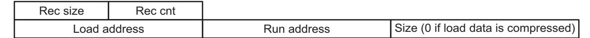

**Figure 8-4: Compressed Copy Table.** Diagram of the compressed copy table record layout. The header row contains two fields: "Rec size" and "Rec cnt". The data row contains three fields: "Load address", "Run address", and "Size (0 if load data is compressed)". When Size is non-zero it equals the size of the data to be copied; when Size is 0, the load data is compressed.

In Figure 8-4, if the size in the copy record is non-zero it represents the size of the data to be copied, and also means that the size of the load data is the same as the run data. When the size is 0, it means that the load data is compressed.

#### 8.8.5.2 Compressed Section Representation in the Object File

The linker creates a separate input section to hold the compressed data. Consider the following table() operation in the linker command file.

```
SECTIONS
{
    .task1: load = ROM, run = RAM, table(_task1_table)
}
```

The output object file has one output section named .task1 which has different load and run addresses. This is possible because the load space and run space have identical data when the section is not compressed.

Alternatively, consider the following:

```
SECTIONS
{
    .task1: load = ROM, run = RAM, table(_task1_table, compression=rle)
}
```

If the linker compresses the .task1 section then the load space data and the run space data are different. The linker creates the following two sections:

- **.task1** : This section is uninitialized. This output section represents the run space image of section task1.
- **.task1.load** : This section is initialized. This output section represents the load space image of the section task1. This section usually is considerably smaller in size than .task1 output section.

The linker allocates load space for the .task1.load input section in the memory area that was specified for load placement for the .task1 section. There is only a single load section to represent the load placement of .task1 - .task1.load. If the .task1 data had not been compressed, there would be two allocations for the .task1 input section: one for its load placement and another for its run placement.

#### 8.8.5.3 Compressed Data Layout

The compressed load data has the following layout:

| -bit index | Compressed data |
|------------|-----------------|

The first bits of the load data are the handler index. This handler index is used to index into a handler table to get the address of a handler function that knows how to decode the data that follows. The handler table is a list of 32-bit function pointers as shown in Figure 8-5.

**Figure 8-5. Handler Table**

\_TI\_Handler\_Table\_Base:

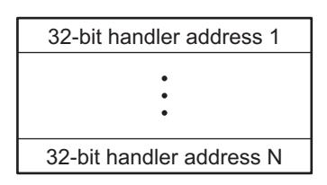

**Figure 8-5: Handler Table.** Diagram of the handler table structure. The table is a contiguous array of 32-bit function pointers bounded by `_TI_Handler_Table_Base` and `_TI_Handler_Table_Limit`. The first entry is labeled "32-bit handler address 1", an ellipsis (...) indicates additional entries, and the last entry is "32-bit handler address N". The handler index from the compressed load data is used to index into this table to obtain the address of the appropriate decompression routine.

\_TI\_Handler\_Table\_Limit:

The linker creates a separate output section for the load and run space. For example, if .task1.load is compressed using RLE, the handler index points to an entry in the handler table that has the address of the run-time-support routine \_\_TI\_decompress\_rle().

#### 8.8.5.4 Run-Time Decompression

During run time you call the run-time-support routine copy\_in() to copy the data from load space to run space. The address of the copy table is passed to this routine. First the routine reads the record count. Then it repeats the following steps for each record:

1. Read load address, run address and size from record.
2. If size is zero go to step 5.
3. Call memcpy passing the run address, load address and size.
4. Go to step 1 if there are more records to read.
5. Read the first from the load address.
6. Read the handler address from (&\_\_TI\_Handler\_Base)[index].
7. Call the handler and pass load address + 1 and run address.
8. Go to step 1 if there are more records to read.

The routines to handle the decompression of load data are provided in the run-time-support library.

#### 8.8.5.5 Compression Algorithms

The following subsections provide information about decompression algorithms for the RLE and LZSS formats. To see example decompression algorithms, refer to the following functions in the Run-Time Support library:

- **RLE:** The \_\_TI\_decompress\_rle() function in the copy\_decompress\_rle.c file.
- **LZSS:** The \_\_TI\_decompress\_lzss() function in the copy\_decompress\_lzss.c file.

##### Run Length Encoding (RLE):

| -bit index | Initialization data compressed using run length encoding |
|------------|----------------------------------------------------------|

The data following the -bit index is compressed using run length encoded (RLE) format. PRU uses a simple run length encoding that can be decompressed using the following algorithm:

1. Read the first , Delimiter (D).
2. Read the next (B).
3. If B != D, copy B to the output buffer and go to step 2.
4. Read the next (L).
   a. If L == 0, then length is either a value, or we've reached the end of the data, read next (L).
   b. Else if L > 0 and L < 4, copy D to the output buffer L times. Go to step 2.
   c. Else, length is -bit value (L).
5. Read the next (C); C is the repeat character.
6. Write C to the output buffer L times; go to step 2.
7. End of processing.

The PRU run-time support library has a routine \_\_TI\_decompress\_rle() to decompress data compressed using RLE. The first argument to this function is the address pointing to the after the -bit index. The second argument is the run address from the C auto initialization record.

##### Lempel-Ziv-Storer-Szymanski Compression (LZSS):

| -bit index | Data compressed using LZSS |
|------------|----------------------------|

The data following the 8-bit index is compressed using LZSS compression. The PRU run-time-support library has the routine \_\_TI\_decompress\_lzss() to decompress the data compressed using LZSS. The first argument to this function is the address pointing to the after the -bit Index, and the second argument is the run address from the C auto initialization record.

### 8.8.6 Copy Table Contents

To use a copy table generated by the linker, you must know the contents of the copy table. This information is included in a run-time-support library header file, cpy\_tbl.h, which contains a C source representation of the copy table data structure that is generated by the linker.

For each object component that is marked for a copy, the linker creates a COPY\_RECORD object for it. Each COPY\_RECORD contains at least the following information for the object component:

- The load address
- The run address
- The size

The linker collects all COPY\_RECORDs that are associated with the same copy table into a COPY\_TABLE object. The COPY\_TABLE object contains the size of a given COPY\_RECORD, the number of COPY\_RECORDs in the table, and the array of COPY\_RECORDs in the table. For instance, in the BINIT example in Section 8.8.4.2, the .first and .extra output sections will each have their own COPY\_RECORD entries in the BINIT copy table. The BINIT copy table will then look like this:

```
/******************************************************************************/
/* Copy Record Data Structure                                                 */
/******************************************************************************/
typedef struct copy_record
{
   unsigned int load_addr;
   unsigned int run_addr;
   unsigned int size;
} COPY_RECORD;

/******************************************************************************/
/* Copy Table Data Structure                                                  */
/******************************************************************************/
typedef struct copy_table
{
   unsigned short rec_size;
   unsigned short num_recs;
   COPY_RECORD    recs[1];
} COPY_TABLE;
```

### 8.8.7 General Purpose Copy Routine

The cpy\_tbl.h file also contains a prototype for a general-purpose copy routine, copy\_in(), which is provided as part of the run-time-support library. The copy\_in() routine takes a single argument: the address of a linker-generated copy table. The routine then processes the copy table data object and performs the copy of each object component specified in the copy table.

The copy\_in() function definition is provided in the cpy\_tbl.c run-time-support source file shown in Example 8-21.

#### Example 8-21. Run-Time-Support cpy\_tbl.c File

```
/******************************************************************************/
/* cpy_tbl.c   v####                                                          */
/* Copyright (c) 2014 Texas Instruments Incorporated                          */
/*                                                                            */
/* General purpose copy routine.  Given the address of a linker-generated     */
/* COPY_TABLE data structure, effect the copy of all object components        */
/* that are designated for copy via the corresponding LCF table() operator.   */
/******************************************************************************/
#include <cpy_tbl.h>
#include <string.h>

typedef void (*handler_fptr)(const unsigned char *in, unsigned char *out)
#define HANDLER_TABLE  __TI_Handler_Table_Base
#pragma WEAK(HANDLER_TABLE)
```

#### Example 8-21. Run-Time-Support cpy\_tbl.c File (continued)

```
extern  unsigned short HANDLER_TABLE;

/******************************************************************************/
/* COPY_IN()                                                                  */
/******************************************************************************/
void copy_in(COPY_TABLE *tp)
{
   unsigned short i;
   for (i = 0; i < tp->num_recs; i++)
   {
      COPY_RECORD crp = tp->recs[i];
      unsigned char *ld_addr = (unsigned char *)crp.load_addr;
      unsigned char *rn_addr = (unsigned char *)crp.run_addr;
      if (crp.size)
      {
         /*-----------------------------------------------------------------*/
         /* Copy record has a non-zero size so the data is not compressed.  */
         /* Just copy the data.                                             */
         /*-----------------------------------------------------------------*/
         memcpy(rn_addr, ld_addr, crp.size);
      }
      else if (HANDLER_TABLE)
      {
         unsigned char index = *((unsigned char *)ld_addr++);
         handler_fptr hndl = (handler_fptr)(&HANDLER_TABLE)[index];
         (*hndl)((const unsigned char *)ld_addr, (unsigned char *)rn_addr);
      }
   }
}
```

#### 8.9 Partial (Incremental) Linking

An output file that has been linked can be linked again with additional modules. This is known as *partial linking* or *incremental linking*. Partial linking allows you to partition large applications, link each part separately, and then link all the parts together to create the final executable program.

Follow these guidelines for producing a file that you will relink:

- The intermediate files produced by the linker *must* have relocation information. Use the --relocatable option when you link the file the first time. (See Section 8.4.3.2.)
- Intermediate files *must* have symbolic information. By default, the linker retains symbolic information in its output. Do not use the --no\_sym\_table option if you plan to relink a file, because --no\_sym\_table strips symbolic information from the output module. (See Section 8.4.22.)
- Intermediate link operations should be concerned only with the formation of output sections and not
  with allocation. All allocation, binding, and MEMORY directives should be performed in the final link.
   Since the ELF object file format is used, input sections are not combined into output sections during a
  partial link unless a matching SECTIONS directive is specified in the link step command file.
- If the intermediate files have global symbols that have the same name as global symbols in other files and you want them to be treated as static (visible only within the intermediate file), you must link the files with the --make\_static option (see Section 8.4.17.1).
- If you are linking C code, do not use --ram\_model or --rom\_model until the final linker. Every time you invoke the linker with the --ram\_model or --rom\_model option, the linker attempts to create an entry point. (See Section 8.4.25 and Section 3.3.2.)

The following example shows how you can use partial linking:

**Step 1:** Link the file file1.com; use the --relocatable option to retain relocation information in the output file tempout1.out.

```
clpru --run_linker --relocatable --output_file=tempout1 file1.com
file1.com contains:
SECTIONS
{
    ss1: {
           f1.obj
           f2.obj
            .
            .
            .
           fn.obj
           }
}
```

**Step 2:** Link the file file2.com; use the --relocatable option to retain relocation information in the output file tempout2.out.

```
clpru --run_linker --relocatable --output_file=tempout2 file2.com
file2.com contains:
SECTIONS
{
   ss2: {
           g1.obj
           g2.obj
            .
            .
            .
           gn.obj
           }
}
```

**Step 3:** Link tempout1.out and tempout2.out.

**clpru --run\_linker --map\_file=final.map --output\_file=final.out tempout1.out tempout2.out**

## 8.10 Linking C/C++ Code

The C/C++ compiler produces assembly language source code that can be assembled and linked. For example, a C program consisting of modules prog1, prog2, etc., can be assembled and then linked to produce an executable file called prog.out:

```
clpru --run_linker --rom_model --
output_file prog.out prog1.obj prog2.obj ... rtspruv3_le.lib
```

The --rom\_model option tells the linker to use special conventions that are defined by the C/C++ environment.

The archive libraries shipped by TI contain C/C++ run-time-support functions.

C, C++, and mixed C and C++ programs can use the same run-time-support library. Run-time-support functions and variables that can be called and referenced from both C and C++ will have the same linkage.

For more information about the PRU C/C++ language, including the run-time environment and run-timesupport functions, see the *PRU Optimizing C/C++ Compiler User's Guide*.

### 8.10.1 Run-Time Initialization

All C/C++ programs must be linked with code to initialize and execute the program, called a *bootstrap* routine, also known as the *boot.obj* object module. The symbol \_c\_int00 is defined as the program entry point and is the start of the C boot routine in boot.obj; referencing \_c\_int00 ensures that boot.obj is automatically linked in from the run-time-support library. When a program begins running, it executes boot.obj first. The boot.obj symbol contains code and data for initializing the run-time environment and performs the following tasks:

- Changes from system mode to user mode
- Sets up the user mode stack
- Processes the run-time *.cinit* initialization table and autoinitializes global variables (when the linker is invoked with the --rom\_model option)
- Calls main

The run-time-support object libraries contain boot.obj. You can:

- Use the archiver to extract boot.obj from the library and then link the module in directly.
- Include the appropriate run-time-support library as an input file (the linker automatically extracts boot.obj when you use the --ram\_model or --rom\_model option).

### 8.10.2 Object Libraries and Run-Time Support

The *PRU Optimizing C/C++ Compiler User's Guide* describes additional run-time-support functions that are included in rts.src. If your program uses any of these functions, you must link the appropriate run-timesupport library with your object files.

You can also create your own object libraries and link them. The linker includes and links only those library members that resolve undefined references.

### 8.10.3 Setting the Size of the Stack and Heap Sections

The C/C++ language uses two uninitialized sections called .sysmem and .stack for the memory pool used by the malloc( ) functions and the run-time stacks, respectively. You can set the size of these by using the --heap\_size or --stack\_size option and specifying the size of the section as a 4-byte constant immediately after the option. If the options are not used, the default size of the heap is 256 bytes and the default size of the stack is 256 bytes.

See Section 8.4.14 for setting heap sizes Section 8.4.29 for setting stack sizes.

### 8.10.4 Initializing and AutoInitialzing Variables at Run Time

Autoinitializing variables at run time is the default method of autoinitialization. To use this method, invoke the linker with the --rom\_model option. See Section 3.3.2 for details.

Initialization of variables at load time enhances performance by reducing boot time and by saving the memory used by the initialization tables. To use this method, invoke the linker with the --ram\_model option. See Section 3.3.2 for details.

## 8.11 Linker Example

This example links three object files named demo.obj, ctrl.obj, and tables.obj and creates a program called demo.out.

Assume that target memory has the following program memory configuration:

| Address Range            | Contents |
|--------------------------|----------|
| 0x00000000 to 0x00001000 | SLOW_MEM |
| 0x00001000 to 0x00002000 | FAST_MEM |
| 0x08000000 to 0x08000400 | EEPROM   |

The output sections are constructed in the following manner:

- Executable code, contained in the .text sections of demo.obj, fft.obj, and tables.obj, is linked into program memory ROM.
- Variables, contained in the var\_defs section of demo.obj, are linked into data memory in block FAST\_MEM\_2.
- Tables of coefficients in the .data sections of demo.obj, tables.obj, and fft.obj are linked into FAST\_MEM\_1. A hole is created with a length of 100 and a fill value of 0x07A1C.
- The xy section form demo.obj, which contains buffers and variables, is linked by default into page 1 of the block STACK, since it is not explicitly linked.
- Executable code, contained in the .text sections of demo.obj, ctrl.obj, and tables.obj, must be linked into FAST\_MEM.
- A table of coefficients, contained in the .data section of tables.obj, must be linked into EEPROM. The remainder of block FLASH must be initialized to the value 0xFF00FF00.
- A set of variables, contained in the .bss section of ctrl.obj, must be linked into SLOW\_MEM and preinitialized to 0x00000100.
- The .bss sections of demo.obj and tables.obj must be linked into SLOW\_MEM.

Example 8-22 shows the linker command file for this example. Example 8-23 shows the map file.

#### Example 8-22. Linker Command File, demo.cmd

```
/******************************************************************************/
/***                       Specify Link Options                            ***/
/******************************************************************************/
--entry_point SETUP                  /* Define the program entry point */
--output_file=demo.out               /* Name the output file           */
--map_file=demo.map                  /* Create an output map file      */
/******************************************************************************/
/***                       Specify the Input Files                         ***/
/******************************************************************************/
demo.obj
ctrl.obj
tables.obj
/******************************************************************************/
/***                 Specify the Memory Configurations                     ***/
/******************************************************************************/
MEMORY
{
   FAST_MEM : org = 0x00000000   len = 0x00001000 /* PROGRAM MEMORY   (ROM) */
   SLOW_MEM : org = 0x00001000   len = 0x00001000 /* DATA MEMORY      (RAM) */
   EEPROM   : org = 0x08000000   len = 0x00000400 /* COEFFICIENTS  (EEPROM) */
}
/******************************************************************************/
/*                        Specify the Output Sections                       */
/******************************************************************************/
SECTIONS
{
   .text   : {} > FAST_MEM        /* Link all .text sections into ROM     */
   .data   :                      /* Link .data sections                  */
   {
      tables.obj(.data)
         . = 0x400;               /* Create hole at end of block          */
   } > EEPROM, fill = 0xFF00FF00  /* Fill and link into EEPROM            */
   ctrl_vars:                     /* Create sections for ctrl variables   */
   {
      ctrl.obj(.bss)
   } > SLOW_MEM, fill = 0x00000100 /* Fill with 0x100 and link into RAM   */
   .bss    : {} > SLOW_MEM        /* Link remaining .bss sections into RAM */
}
/******************************************************************************/
/***                          End of Command File                          ***/
/******************************************************************************/
```

Invoke the linker by entering the following command:

```
clpru --run_linker demo.cmd
```

This creates the map file shown in Example 8-23 and an output file called demo.out that can be run on a PRU device.

### Example 8-23. Output Map File, demo.map

| OUTPUT FILE NAME:                                                |                                    | <demo.out><br/>ENTRY POINT SYMBOL: "SETUP"</demo.out>    | address: 000000d4                                        |                                                                  |                                   |
|------------------------------------------------------------------|------------------------------------|----------------------------------------------------------|----------------------------------------------------------|------------------------------------------------------------------|-----------------------------------|
| MEMORY CONFIGURATION                                             |                                    |                                                          |                                                          |                                                                  |                                   |
|                                                                  | name                               | origin                                                   | length                                                   | attributes                                                       | fill                              |
|                                                                  | <br>FAST_MEM<br>SLOW_MEM<br>EEPROM | <br>00000000<br>00001000<br>08000000                     | <br>000001000<br>000001000<br>000000400                  | <br>RWIX<br>RWIX<br>RWIX                                         |                                   |
| SECTION ALLOCATION MAP                                           |                                    |                                                          |                                                          |                                                                  |                                   |
| output<br>section                                                | page                               | origin                                                   | length                                                   | attributes/<br>input sections                                    |                                   |
| <br>.text                                                        | <br>0                              | <br>00000020<br>00000020<br>000000c0<br>000000c0         | <br>00000138<br>000000a0<br>00000000<br>00000098         | <br>ctrl.obj (.text)<br>tables.obj (.text)<br>demo.obj (.text)   |                                   |
| .data                                                            | 0                                  | 08000000<br>08000000<br>08000168<br>08000400<br>08000400 | 00000400<br>00000168<br>00000298<br>00000000<br>00000000 | tables.obj (.data)<br>ctrl.obj (.data)<br>demo.obj (.data)       | HOLE [fill = ff00ff00]            |
| ctrl_var                                                         | 0                                  | 00001000<br>00001000                                     | 00000500<br>00000500                                     |                                                                  | ctrl.obj (.bss) [fill = 00000100] |
| .bss                                                             | 0                                  | 00001500<br>00001500<br>00001600                         | 00000100<br>00000100<br>00000000                         | UNINITIALIZED<br>demo.obj (.bss)<br>tables.obj (.bss)            |                                   |
| GLOBAL SYMBOLS                                                   |                                    |                                                          |                                                          |                                                                  |                                   |
| address<br>                                                      | name                               |                                                          |                                                          | address<br>name<br>                                              |                                   |
| 000000d4 SETUP<br>00000020 clear<br>000000b8 set<br>000000c0 x42 |                                    |                                                          |                                                          | 00000020 clear<br>000000b8 set<br>000000c0 x42<br>000000d4 SETUP |                                   |
| [4 symbols]                                                      |                                    |                                                          |                                                          |                                                                  |                                   |

# 9 Absolute Lister Description

The PRU absolute lister is a debugging tool that accepts linked object files as input and creates .abs files as output. These .abs files can be assembled to produce a listing that shows the absolute addresses of object code. Manually, this could be a tedious process requiring many operations; however, the absolute lister utility performs these operations automatically.

**Topic** ........................................................................................................................... **Page**

| 9.1 | Producing an Absolute Listing | 238 |
|-----|-------------------------------|-----|
| 9.2 | Invoking the Absolute Lister  | 239 |
| 9.3 | Absolute Lister Example       | 240 |
|     |                               |     |

## 9.1 Producing an Absolute Listing

Figure 9-1 illustrates the steps required to produce an absolute listing.

**Figure 9-1. Absolute Lister Development Flow**

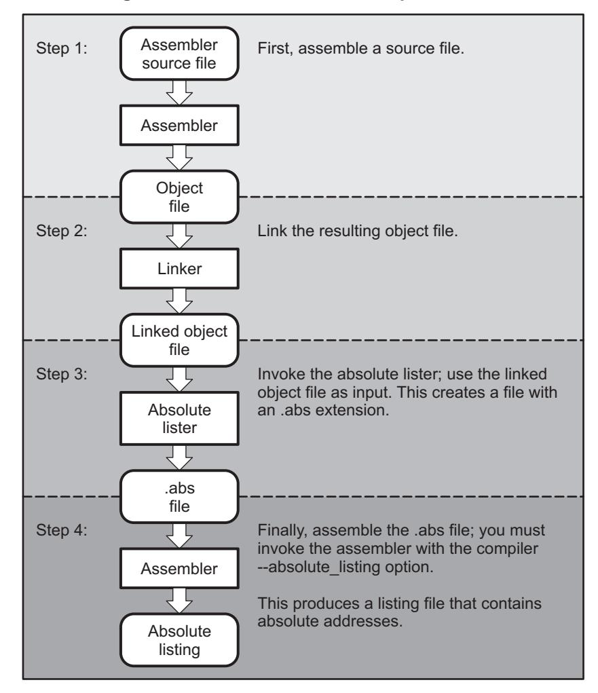

**Figure 9-1: Absolute Lister Development Flow.** Four-step flowchart. Step 1: Assemble a source file — Assembler source file → Assembler → Object file. Step 2: Link the resulting object file — Object file → Linker → Linked object file. Step 3: Invoke the absolute lister with the linked object file as input; this creates a file with an .abs extension — Linked object file → Absolute lister → .abs file. Step 4: Assemble the .abs file with the compiler --absolute_listing option; this produces a listing file with absolute addresses — .abs file → Assembler → Absolute listing.

## 9.2 Invoking the Absolute Lister

The syntax for invoking the absolute lister is:

**abspru** [-*options*] *input file*

**abspru** is the command that invokes the absolute lister.

*options* identifies the absolute lister options that you want to use. Options are not case sensitive and can appear anywhere on the command line following the command. Precede each option with a hyphen (-). The absolute lister options are as follows:
- **-e** enables you to change the default naming conventions for filename extensions on assembly files, C source files, and C header files. The valid options are:
  - ea [.]*asmext* for assembly files (default is .asm)
  - ec [.]*cext* for C source files (default is .c)
  - eh [.]*hext* for C header files (default is .h)
  - ep [.]*pext* for CPP source files (default is cpp)

The . in the extensions and the space between the option and the extension are optional.

**-q** (quiet) suppresses the banner and all progress information.

*input file* names the linked object file. If you do not supply an extension, the absolute lister assumes that the input file has the default extension .out. If you do not supply an input filename when you invoke the absolute lister, the absolute lister prompts you for one.

The absolute lister produces an output file for each file that was linked. These files are named with the input filenames and an extension of .abs. Header files, however, do not generate a corresponding .abs file.

Assemble these files with the --absolute\_listing assembler option as follows to create the absolute listing:

**clpru --absolute\_listing** *filename* **.abs**

The -e options affect both the interpretation of filenames on the command line and the names of the output files. They should always precede any filename on the command line.

The -e options are useful when the linked object file was created from C files compiled with the debugging option (--symdebug:dwarf compiler option). When the debugging option is set, the resulting linked object file contains the name of the source files used to build it. In this case, the absolute lister does not generate a corresponding .abs file for the C header files. Also, the .abs file corresponding to a C source file uses the assembly file generated from the C source file rather than the C source file itself.

For example, suppose the C source file hello.csr is compiled with the debugging option set; the debugging option generates the assembly file hello.s. The hello.csr file includes hello.hsr. Assuming the executable file created is called hello.out, the following command generates the proper .abs file:

```
abspru -ea s -ec csr -eh hsr hello.out
```

An .abs file is not created for hello.hsr (the header file), and hello.abs includes the assembly file hello.s, not the C source file hello.csr.

## 9.3 Absolute Lister Example

This example uses three source files. The files module1.asm and module2.asm both include the file globals.def.

#### module1.asm

```
.text
.bss dflag, 1
.bss array, 100
.copy globals.def
LDI r4, array
LDI r5, offst
LDI r3, dflag
LBBO &r0, r4, r5, 4
SBBO &r0, r3, 0, 4
```

#### module2.asm

```
.text
.bss offst, 1
.copy globals.def
LDI r4, offst
SBBO &r0, r4, 0, 4
```

#### globals.def

```
.global array
.global offst
.global dflag
```

The following steps create absolute listings for the files **module1.asm** and **module2.asm**:

**Step 1:** First, assemble **module1.asm** and **module2.asm**:

```
clpru module1
clpru module2
```

This creates two object files called module1.obj and module2.obj.

**Step 2:** Next, link module1.obj and module2.obj using the following linker command file, called bttest.cmd:

```
module1.obj
module2.obj
--unused_section_elimination=off
--output_file=bttest.out
MEMORY
{
   PAGE 0:
      P_MEM : org = 0x00000008 len = 0x0003FFF8
   PAGE 1:
      D_MEM : org = 0x00000008 len = 0x0000FFF8
}
/* SPECIFY THE SECTIONS ALLOCATION INTO MEMORY */
SECTIONS
{
   .data : {} > D_MEM, PAGE 1
   .bss : {} > D_MEM, PAGE 1
   .text : {} > P_MEM, PAGE 0
}
```

Invoke the linker:

```
clpru --run_linker bttest.cmd
```

This command creates an executable object file called bttest.out; use this file as input for the absolute lister.

**Step 3:** Now, invoke the absolute lister:

```
abspru bttest.out
```

This command creates two files called module1.abs and module2.abs:

**module1.abs:**

```
.compiler_opts_source "module1.asm"
         .nolist
array .setsym 000000009h
dflag .setsym 000000008h
offst .setsym 00000006dh
         .setsect ".text",000000008h
         .setsect ".bss",000000008h
         .setsect ".debug_info",000000000h
         .setsect ".debug_line",000000000h
         .list
         .text
         .copy "module1.asm"
```

**module2.abs:**

```
.compiler_opts_source "module2.asm"
         .nolist
array .setsym 000000009h
dflag .setsym 000000008h
offst .setsym 00000006dh
         .setsect ".text",00000001ch
         .setsect ".bss",00000006dh
         .setsect ".debug_info",0000000c0h
         .setsect ".debug_line",00000003eh
         .setsect ".debug_aranges",000000000h
         .setsect ".debug_pubnames",000000000h
         .list
         .text
         .copy "module2.asm"
```

These files contain the following information that the assembler needs for Step 4:

- They contain .setsym directives, which equate values to global symbols. Both files contain global equates for the symbol *dflag*. The symbol dflag was defined in the file globals.def, which was included in module1.asm and module2.asm.
- They contain .setsect directives, which define the absolute addresses for sections.
- They contain .copy directives, which defines the assembly language source file to include.

The .setsym and .setsect directives are useful only for creating absolute listings, not normal assembly.

**Step 4:** Finally, assemble the .abs files created by the absolute lister (remember that you must use the --absolute\_listing option when you invoke the assembler):

```
clpru --absolute_listing module1.abs
clpru --absolute_listing module2.abs
```

This command sequence creates two listing files called module1.lst and module2.lst; no object code is produced. These listing files are similar to normal listing files; however, the addresses shown are absolute addresses.

The absolute listing files created are module1.lst (see Example 9-1 ) and module2.lst (see Example 9-2).

### Example 9-1. module1.lst

```
PRU Assembler Unix v2.1.0 Thu Jun 26 21:23:57 2014
Tools Copyright (c) 2012-2014 Texas Instruments Incorporated
module1.asm PAGE 1
     1 00000000 .text
     2 00000000 .bss dflag, 1
     3 00000001 .bss array, 100
     4
     5 .copy globals.def
A 1 .global array
A 2 .global offst
A 3 .global dflag
     6
     7 00000000 000000240000E4! LDI r4, array
     8 00000004 000000240000E5! LDI r5, offst
     9 00000008 000000240000E3! LDI r3, dflag
    10 0000000c 000000F0E52480 LBBO &r0, r4, r5, 4
    11 00000010 000000E1002380 SBBO &r0, r3, 0, 4
    12
No Assembly Errors, No Assembly Warnings
```

### Example 9-2. module2.lst

```
PRU Assembler Unix v2.1.0 Thu Jun 26 21:24:22 2014
Tools Copyright (c) 2012-2014 Texas Instruments Incorporated
module2.asm PAGE 1
    1 00000000 .text
    2 00000000 .bss offst, 1
    3
    4 .copy globals.def
A 1 .global array
A 2 .global offst
A 3 .global dflag
    5 00000000 000000240000E4! LDI r4, offst
    6 00000004 000000E1002480 SBBO &r0, r4, 0, 4
No Assembly Errors, No Assembly Warnings
```

# 10 Cross-Reference Lister Description

The PRU cross-reference lister is a debugging tool. This utility accepts linked object files as input and produces a cross-reference listing as output. This listing shows symbols, their definitions, and their references in the linked source files.

**Topic** ........................................................................................................................... **Page**

| 10.1 | Producing a Cross-Reference Listing | 244 |
|------|-------------------------------------|-----|
| 10.2 | Invoking the Cross-Reference Lister | 245 |
| 10.3 | Cross-Reference Listing Example     | 246 |
|      |                                     |     |

## 10.1 Producing a Cross-Reference Listing

Figure 10-1 illustrates the steps required to produce a cross-reference listing.

**Figure 10-1. The Cross-Reference Lister Development Flow**

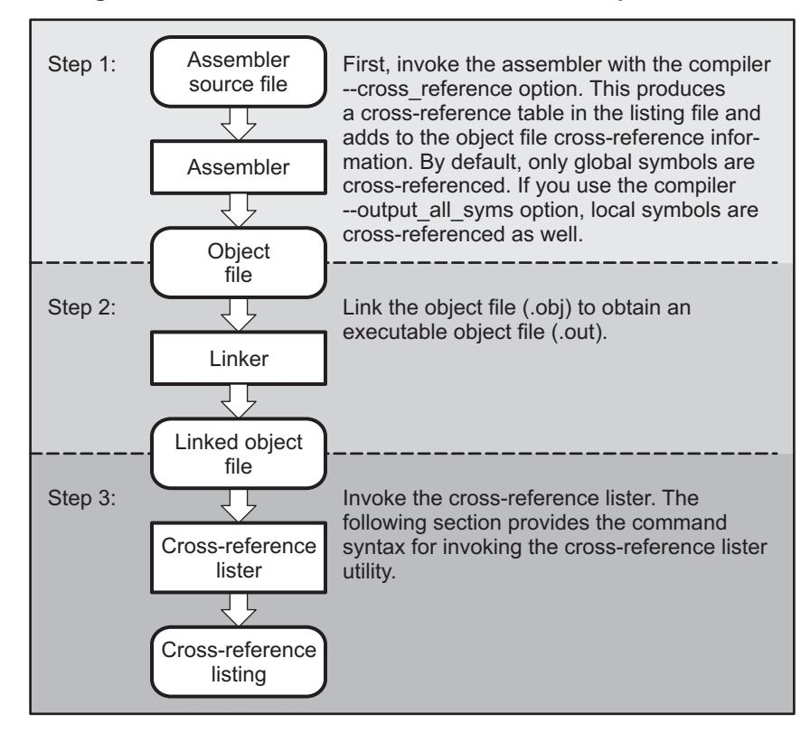

**Figure 10-1: The Cross-Reference Lister Development Flow.** Three-step flowchart. Step 1: Invoke the assembler with the compiler --cross_reference option — creates a cross-reference table in the listing file and adds cross-reference information to the object file; by default only global symbols are cross-referenced, but --output_all_syms also adds local symbols — Assembler source file → Assembler → Object file. Step 2: Link the object file (.obj) to obtain an executable object file (.out) — Object file → Linker → Linked object file. Step 3: Invoke the cross-reference lister — Linked object file → Cross-reference lister → Cross-reference listing.

## 10.2 Invoking the Cross-Reference Lister

To use the cross-reference utility, the file must be assembled with the correct options and then linked into an executable file. Assemble the assembly language files with the --cross\_reference option. This option creates a cross-reference listing and adds cross-reference information to the object file. By default, the assembler cross-references only global symbols, but if the assembler is invoked with the --output\_all\_syms option, local symbols are also added. Link the object files to obtain an executable file.

To invoke the cross-reference lister, enter the following:

**xrefpru** [*options*] [*input filename* [*output filename*]]

**xrefpru** is the command that invokes the cross-reference utility.

*options* identifies the cross-reference lister options you want to use. Options are not case sensitive and can appear anywhere on the command line following the command.

- **-l** (lowercase L) specifies the number of lines per page for the output file. The format of the -l option is -l*num*, where num is a decimal constant. For example, -l30 sets the number of lines per page in the output file to 30. The space between the option and the decimal constant is optional. The default is 60 lines per page.
- **-q** suppresses the banner and all progress information (run quiet).

*input filename* is a linked object file. If you omit the input filename, the utility prompts for a filename. *output filename* is the name of the cross-reference listing file. If you omit the output filename, the default filename is the input filename with an .xrf extension.

## 10.3 Cross-Reference Listing Example

These terms defined appear in the cross-reference listing in Example 10-1:

**Symbol** Name of the symbol listed

**Filename** Name of the file where the symbol appears

**RTYP** The symbol's reference type in this file. The possible reference types are:

- **STAT** The symbol is defined in this file and is not declared as global.
- **EDEF** The symbol is defined in this file and is declared as global.
- **EREF** The symbol is not defined in this file but is referenced as global.
- **UNDF** The symbol is not defined in this file and is not declared as global.

**AsmVal** This hexadecimal number is the value assigned to the symbol at assembly time. A value may also be preceded by a character that describes the symbol's attributes. Table 10-1 lists these characters and names.

**LnkVal** This hexadecimal number is the value assigned to the symbol after linking.

**DefLn** The statement number where the symbol is defined.

**RefLn** The line number where the symbol is referenced. If the line number is followed by an asterisk (\*), then that reference can modify the contents of the object. A blank in this column indicates that the symbol was never used.

**Table 10-1. Symbol Attributes in Cross-Reference Listing**

| Character | Meaning                                    |  |
|-----------|--------------------------------------------|--|
| '         | Symbol defined in a .text section          |  |
| "         | Symbol defined in a .data section          |  |
| +         | Symbol defined in a .sect section          |  |
| -         | Symbol defined in a .bss or .usect section |  |

Example 10-1 is an example of cross-reference listing.

### Example 10-1. Cross-Reference Listing

| File:<br>bttest.out                                                                              |          | Wed Nov 13 17:07:42 xxxx<br>Page:<br>1<br>============================================================================= |              |       |        |       |       |
|--------------------------------------------------------------------------------------------------|----------|-------------------------------------------------------------------------------------------------------------------------|--------------|-------|--------|-------|-------|
| Symbol: array<br>Filename                                                                        | RTYP     | AsmVal                                                                                                                  | LnkVal       | DefLn | RefLn  | RefLn | RefLn |
| <br>module1.asm                                                                                  | <br>EDEF | <br>-00000001                                                                                                           | <br>00001001 | <br>3 | <br>1A | <br>5 |       |
| =============================================================================<br>Symbol: array_a |          |                                                                                                                         |              |       |        |       |       |
| Filename                                                                                         | RTYP     | AsmVal                                                                                                                  | LnkVal       | DefLn | RefLn  | RefLn | RefLn |
| <br>module1.asm                                                                                  | <br>STAT | <br>'00000004                                                                                                           | <br>00000004 | <br>5 | <br>9  |       |       |
| =============================================================================<br>Symbol: dflag   |          |                                                                                                                         |              |       |        |       |       |
| Filename                                                                                         | RTYP     | AsmVal                                                                                                                  | LnkVal       | DefLn | RefLn  | RefLn | RefLn |
| <br>module1.asm                                                                                  | <br>EDEF | <br>-00000000                                                                                                           | <br>00001000 | <br>2 | <br>3A | <br>4 |       |
| =============================================================================<br>Symbol: dflag_a |          |                                                                                                                         |              |       |        |       |       |
| Filename                                                                                         | RTYP     | AsmVal                                                                                                                  | LnkVal       | DefLn | RefLn  | RefLn | RefLn |
| <br>module1.asm                                                                                  | <br>STAT | <br>'00000000                                                                                                           | <br>00000000 | <br>4 | <br>11 |       |       |
| =============================================================================<br>Symbol: offst   |          |                                                                                                                         |              |       |        |       |       |
| Filename                                                                                         | RTYP     | AsmVal                                                                                                                  | LnkVal       | DefLn | RefLn  | RefLn | RefLn |
| <br>module1.asm                                                                                  | <br>EREF | <br>00000000                                                                                                            | <br>00001068 |       | <br>2A | <br>6 |       |

### Example 10-1. Cross-Reference Listing (continued)

| module2.asm                                                                                      | EDEF     | -00000000  | 00001068   | 2         | 2A        | 3         |           |
|--------------------------------------------------------------------------------------------------|----------|------------|------------|-----------|-----------|-----------|-----------|
| =============================================================================<br>Symbol: offst_a |          |            |            |           |           |           |           |
| Filename<br>                                                                                     | RTYP<br> | AsmVal<br> | LnkVal<br> | DefLn<br> | RefLn<br> | RefLn<br> | RefLn<br> |
| module1.asm                                                                                      | STAT     | '00000008  | 00000008   | 6         | 10        |           |           |
| module2.asm                                                                                      | STAT     | '00000000  | 00000020   | 3         | 6         |           |           |
| =============================================================================                    |          |            |            |           |           |           |           |

# 11 Object File Utilities

This chapter describes how to invoke the following utilities:

- The **object file display utility** prints the contents of object files, executable files, and/or archive libraries in both text and XML formats.
- The **disassembler** accepts object files and executable files as input and produces an assembly listing as output. This listing shows assembly instructions, their opcodes, and the section program counter values.
- The **name utility** prints a list of names defined and referenced in an object file, executable files, and/or archive libraries.
- The **strip utility** removes symbol table and debugging information from object and executable files.

**Topic** ........................................................................................................................... **Page**

| 11.1 | Invoking the Object File Display Utility | 249 |
|------|------------------------------------------|-----|
| 11.2 | Invoking the Disassembler                | 250 |
|      |                                          |     |
| 11.3 | Invoking the Name Utility                | 252 |
|      | Invoking the Strip Utility               |     |
| 11.4 |                                          | 253 |

## 11.1 Invoking the Object File Display Utility

The object file display utility, *ofdpru*, prints the contents of object files (.obj), executable files (.out), and/or archive libraries (.lib) in both text and XML formats. Hidden symbols are listed as *no name*, while localized symbols are listed like any other local symbol.

To invoke the object file display utility, enter the following:

**ofdpru** [*options*] *input filename* [*input filename*]

**ofdpru** is the command that invokes the object file display utility.

*input filename* names the object file (.obj), executable file (.out), or archive library (.lib) source file.

The filename must contain an extension.

*options* identify the object file display utility options that you want to use. Options are not case sensitive and can appear anywhere on the command line following the command.

Precede each option with a hyphen.

**-cg** Prints function stack usage and callee information in XML

format. While the XML output may be accessed by a developer, this option was primarily designed to be used by tools such as Code Composer Studio to display an

application's worst case stack usage.

**--dwarf\_display**=*attributes* Controls the DWARF display filter settings by specifying a

comma-delimited list of *attributes*. When prefixed with no,

an attribute is disabled instead of enabled.

Examples: --dwarf\_display=nodabbrev,nodline

--dwarf\_display=all,nodabbrev --dwarf\_display=none,dinfo,types

The ordering of attributes is important (see --obj\_display). The list of available display attributes can be obtained by

invoking ofdpru --dwarf\_display=help.

**--dynamic\_info** Outputs dynamic linking information.

**-g** Appends DWARF debug information to program output.

**-h** Displays help

**-o**=*filename* Sends program output to *filename* rather than to the

screen.

**--obj\_display** *attributes* Controls the object file display filter settings by specifying

a comma-delimited list of *attributes*. When prefixed with

no, an attribute is disabled instead of enabled.

Examples: --obj\_display=rawdata,nostrings

--obj\_display=all,norawdata

--obj\_display=none,header

The ordering of attributes is important. For instance, in "--obj\_display=none,header", ofdpru disables all output, then re-enables file header information. If the attributes are specified in the reverse order, (header,none), the file header is enabled, the all output is disabled, including the file header. Thus, nothing is printed to the screen for the given files. The list of available display attributes can be obtained by invoking ofdpru --obj\_display=help.

**-v** Prints verbose text output.

**-x** Displays output in XML format.

**--xml\_indent**=*num* Sets the number of spaces to indent nested XML tags.

If an archive file is given as input to the object file display utility, each object file member of the archive is processed as if it was passed on the command line. The object file members are processed in the order in which they appear in the archive file.

If the object file display utility is invoked without any options, it displays information about the contents of the input files on the console screen.

#### Object File Display Format

**NOTE:** The object file display utility produces data in a text format by default. This data is not intended to be used as input to programs for further processing of the information. XML format should be used for mechanical processing.

## 11.2 Invoking the Disassembler

The disassembler, *dispru*, examines the output of the assembler or linker. This utility accepts an object file or executable file as input and writes the disassembled object code to standard output or a specified file.

To invoke the disassembler, enter the following:

**dispru** [*options*] *input filename*[.] [*output filename*]

**dispru** is the command that invokes the disassembler.

*options* identifies the name utility options you want to use. Options are not case sensitive and can appear anywhere on the command line following the invocation. Precede each option with a hyphen (-). The name utility options are as follows:

- **-1** disassembles all sections, processes .cinit sections
- **-a** disables printing of address along with label names within instructions.
- **-b** displays data as bytes instead of words.
- **-d** disables display of data sections.
- **-e** displays integer values in hexadecimal.
- **-h** shows the current help screen.
- **-i** disassembles data sections as text.
- **-I** disassembles text sections as data.
- **-q** (quiet mode) suppresses the banner and all progress information.
- **-qq** (super quiet mode) suppresses all headers.
- **-s** suppresses printing of address and data words.
- **-t** suppresses the display of text sections in the listing.
- **-y** (aliased as --copy\_talbes) displays copy tables and the sections copied. The table information is dumped first, then each record followed by its load and run data.

*input filename*[.*ext*] is the name of the input file. If the optional extension is not specified, the file is searched for in this order:

1. *infile*
2. *infile*.out, an executable file
3. *infile*.obj, an object file

*output filename* is the name of the optional output file to which the disassembly will be written. If an output filename is not specified, the disassembly is written to standard output.

As shown in Example 11-1, the disassembler can produce disassembly from an object file, in this case memcpy32.obj. The first two lines are entered on the command line.

### Example 11-1. Disassembly From memcpy32.asm

| TEXT Section .text, 0x180 bytes at 0x0 |           |                 |  |  |
|----------------------------------------|-----------|-----------------|--|--|
| 000000:                                | C_MEMCPY: |                 |  |  |
| 000000: E3520000                       | CMP       | R2, 0           |  |  |
| 000004: 012FFF1E                       | BXEQ      | R14             |  |  |
| 000008: E92D4001                       | STMFD     | R13!, {R0, R14} |  |  |
| 00000c: E3110003                       | TST       | R1, 3           |  |  |
| 000010: 1A00002B                       | BNE       | 0x000000C4      |  |  |
| 000014: E3100003                       | TST       | R0, 3           |  |  |
| 000018: 1A00002F                       | BNE       | 0x000000DC      |  |  |
| 00001c: E3520010                       | CMP       | R2, 16          |  |  |
| 000020: 3A000008                       | BCC       | 0x00000048      |  |  |
| 000024: E92D0010                       | STMFD     | R13!, {R4}      |  |  |
| 000028: E2422010                       | SUB       | R2, R2, 16      |  |  |

Example 11-2 provides an example of how the output would appear if a copy record refers to different load and run sections and the --copy\_table option is used.

### Example 11-2. Partial Copy Record Output With Different Load and Run Address

```
COPY TABLE: _data2_ctbl, 0x30 at 0x5E10, 1 record(s)
_data2_ctbl[0]: load addr=0x200158, size=0x12B, encoding=lzss
DATA Section .data2_scn.load, 0x12B bytes at 0x200158
200158: $d:
200158: 020f0000 .word 0x020f0000
20015c: beef0003 .word 0xbeef0003
.
.
_data2_ctbl[0]: run addr=0x52A0, size=0x960
DATA Section .data1_scn, 0x960 bytes at 0x52A0
0052a0: data1:
0052a0: $d:
0052a0: .data1_scn:
0052a0: 0000beef .word 0x0000beef
0052a4: 0000beef .word 0x0000beef
.
.
```

## 11.3 Invoking the Name Utility

The name utility, *nmpru*, prints the list of names defined and referenced in an object file, executable file, or archive library. It also prints the symbol value and an indication of the kind of symbol. Hidden symbols are listed as "".

To invoke the name utility, enter the following:

**nmpru** [-*options*] [*input filenames*]

**nmpru** is the command that invokes the name utility.

*input filename* is an object file (.obj), executable file (.out), or archive library (.lib).

*options* identifies the name utility options you want to use. Options are not case sensitive and can appear anywhere on the command line following the invocation. Precede each option with a hyphen (-). The name utility options are as follows:

- **-a** prints all symbols.
- **-f** prepends file name to each symbol.
- **-g** prints only global symbols.
- **-h** shows the current help screen.
- **-l** produces a detailed listing of the symbol information.
- **-n** sorts symbols numerically rather than alphabetically.
- **-o** *file* outputs to the given file.
- **-p** causes the name utility to not sort any symbols.
- **-q** (quiet mode) suppresses the banner and all progress information.
- **-r** sorts symbols in reverse order.
- **-s** lists symbols in the dynamic symbol table for an ELF object module.
- **-u** only prints undefined symbols.

## 11.4 Invoking the Strip Utility

The strip utility, *strippru*, removes symbol table and debugging information from object and executable files.

To invoke the strip utility, enter the following:

**strippru** [**-p**] *input filename* [*input filename*]

**strippru** is the command that invokes the strip utility. *input filename* is an object file (.obj) or an executable file (.out).

*options* identifies the strip utility options you want to use. Options are not case sensitive and can appear anywhere on the command line following the invocation. Precede each option with a hyphen (-). The strip utility option is as follows:

**-o** *filename* writes the stripped output to filename.

**-p** removes all information not required for execution. This option causes more information to be removed than the default behavior, but the object file is left in a state that cannot be linked. This option should be used only with executable (.out) files.

When the strip utility is invoked without the -o option, the input object files are replaced with the stripped version.

# 12 Hex Conversion Utility Description

The PRU assembler and linker create object files which are in binary formats that encourage modular programming and provide powerful and flexible methods for managing code segments and target system memory.

Most EPROM programmers do not accept object files as input. The hex conversion utility converts an object file into one of several standard ASCII hexadecimal formats, suitable for loading into an EPROM programmer. The utility is also useful in other applications requiring hexadecimal conversion of an object file (for example, when using debuggers and loaders).

The hex conversion utility can produce these output file formats:

- ASCII-Hex, supporting 16-bit addresses
- Extended Tektronix (Tektronix)
- Intel MCS-86 (Intel)
- Motorola Exorciser (Motorola-S), supporting 16-bit addresses
- Texas Instruments SDSMAC (TI-Tagged), supporting 16-bit addresses
- Texas Instruments TI-TXT format, supporting 16-bit addresses
- C arrays

**Topic** ........................................................................................................................... **Page**

| 12.1  | The Hex Conversion Utility's Role in the Software Development Flow | 255 |
|-------|--------------------------------------------------------------------|-----|
| 12.2  | Invoking the Hex Conversion Utility                                | 256 |
| 12.3  | Linking with an ARM Executable                                     | 259 |
| 12.4  | Understanding Memory Widths                                        | 259 |
| 12.5  | The ROMS Directive                                                 | 263 |
| 12.6  | The SECTIONS Directive                                             | 266 |
| 12.7  | The Load Image Format (--load_image Option)                        | 267 |
| 12.8  | Excluding a Specified Section                                      | 268 |
| 12.9  | Assigning Output Filenames                                         | 268 |
| 12.10 | Image Mode and the --fill Option                                   | 269 |
| 12.11 | Array Output Format                                                | 270 |
| 12.12 | Controlling the ROM Device Address                                 | 271 |
| 12.13 | Control Hex Conversion Utility Diagnostics                         | 272 |
| 12.14 | Description of the Object Formats                                  | 273 |

## 12.1 The Hex Conversion Utility's Role in the Software Development Flow

Figure 12-1 highlights the role of the hex conversion utility in the software development process.

**Figure 12-1. The Hex Conversion Utility in the PRU Software Development Flow**


**Figure 12-1: The Hex Conversion Utility in the PRU Software Development Flow.** Complete PRU software development flow block diagram with the Hex-conversion utility highlighted. Inputs include C/C++ source files (compiled by C/C++ compiler to assembler source), macro source files, and object files. The Archiver processes macro source into a Macro library. The Assembler converts assembler source to Object files. Object files and libraries are archived into a Library of object files. A Library-build utility provides a Run-time-support library. The Linker combines all inputs into an Executable object file. The executable feeds into: the PRU device directly, Debugging tools, EPROM programmer, Absolute lister, Cross-reference lister, Object file utilities, and the Hex-conversion utility (highlighted). A C/C++ name demangling utility is also shown connected to the assembler source path.

## 12.2 Invoking the Hex Conversion Utility

There are two basic methods for invoking the hex conversion utility:

• **Specify the options and filenames on the command line.** The following example converts the file firmware.out into TI-Tagged format, producing two output files, firm.lsb and firm.msb.

```
hexpru -t firmware -o firm.lsb -o firm.msb
```

• **Specify the options and filenames in a command file.** You can create a file that stores command line options and filenames for invoking the hex conversion utility. The following example invokes the utility using a command file called hexutil.cmd:

```
hexpru hexutil.cmd
```

In addition to regular command line information, you can use the hex conversion utility ROMS and SECTIONS directives in a command file.

### 12.2.1 Invoking the Hex Conversion Utility From the Command Line

To invoke the hex conversion utility, enter:

**hexpru** [*options*] *filename*

**hexpru** is the command that invokes the hex conversion utility.

*options* supplies additional information that controls the hex conversion process. You can use options on the command line or in a command file. Table 12-1 lists the basic options.

- All options are preceded by a hyphen and are not case sensitive.
- Several options have an additional parameter that must be separated from the option by at least one space.
- Options with multi-character names must be spelled exactly as shown in this document; no abbreviations are allowed.
- Options are not affected by the order in which they are used. The exception to this rule is the --quiet option, which must be used before any other options.

*filename* names an object file or a command file (for more information, see Section 12.2.2).

**Table 12-1. Basic Hex Conversion Utility Options**

| Option                                      | Alias        | Description                                                                                                                                                                                         | See             |
|---------------------------------------------|--------------|-----------------------------------------------------------------------------------------------------------------------------------------------------------------------------------------------------|-----------------|
| General Options                             |              |                                                                                                                                                                                                     |                 |
| --exclude=(*fname*(*sname*) \| *sname*)     | -exclude     | If the filename (*fname*) is omitted, all sections matching *sname* will be excluded.                                                                                                               | Section 12.8    |
| --fill=*value*                              | -fill        | Fill holes with *value*                                                                                                                                                                             | Section 12.10.2 |
| --help                                      | -options, -h | Display the syntax for invoking the utility and list available options. If the option is followed by another option or phrase, detailed information about that option or phrase is displayed.        | Section 12.2.2  |
| --image                                     | -image       | Select image mode                                                                                                                                                                                   | Section 12.10.1 |
| --linkerfill                                | -linkerfill  | Include linker fill sections in images                                                                                                                                                              |                 |
| --map=*filename*                            | -map         | Generate a map file                                                                                                                                                                                 | Section 12.5.2  |
| --memwidth=*value*                          | -memwidth    | Define the system memory word width (default bits)                                                                                                                                                  | Section 12.4.2  |
| --outfile=*filename*                        | -o           | Specify an output filename                                                                                                                                                                          | Section 12.9    |
| --quiet                                     | -q           | Run quietly (when used, it must appear before other options)                                                                                                                                        | Section 12.2.2  |
| --romwidth=*value*                          | -romwidth    | Specify the ROM device width (default depends on format used). This option is ignored for the TI-TXT and TI-Tagged formats.                                                                         | Section 12.4.3  |
| --zero                                      | -zero, -z    | Reset the address origin to 0 in image mode                                                                                                                                                         | Section 12.10.3 |

**Table 12-1. Basic Hex Conversion Utility Options (continued)**

| Option                          | Alias | Description                                                                                         | See             |
|---------------------------------|-------|-----------------------------------------------------------------------------------------------------|-----------------|
|                                 |       | Diagnostic Options                                                                                  |                 |
| --diag_error=*id*               |       | Categorizes the diagnostic identified by *id* as an error                                           | Section 12.13   |
| --diag_remark=*id*              |       | Categorizes the diagnostic identified by *id* as a remark                                           | Section 12.13   |
| --diag_suppress=*id*            |       | Suppresses the diagnostic identified by *id*                                                        | Section 12.13   |
| --diag_warning=*id*             |       | Categorizes the diagnostic identified by *id* as a warning                                          | Section 12.13   |
| --display_error_number          |       | Displays a diagnostic's identifiers along with its text                                             | Section 12.13   |
| --issue_remarks                 |       | Issues remarks (nonserious warnings)                                                                | Section 12.13   |
| --no_warnings                   |       | Suppresses warning diagnostics (errors are still issued)                                            | Section 12.13   |
| --set_error_limit=*count*       |       | Sets the error limit to *count*. The linker abandons linking after this number of errors. (The default is 100.) | Section 12.13   |
|                                 |       | Output Options                                                                                      |                 |
| --array                         |       | Select array output format                                                                          | Section 12.11   |
| --ascii                         | -a    | Select ASCII-Hex                                                                                    | Section 12.14.1 |
| --intel                         | -i    | Select Intel                                                                                        | Section 12.14.2 |
| --motorola=1                    | -m1   | Select Motorola-S1                                                                                  | Section 12.14.3 |
| --motorola=2                    | -m2   | Select Motorola-S2                                                                                  | Section 12.14.3 |
| --motorola=3                    | -m3   | Select Motorola-S3 (default -m option)                                                              | Section 12.14.3 |
| --tektronix                     | -x    | Select Tektronix (default format when no output option is specified)                                | Section 12.14.4 |
| --ti_tagged                     | -t    | Select TI-Tagged                                                                                    | Section 12.14.5 |
| --ti_txt                        |       | Select TI-Txt                                                                                       | Section 12.14.6 |
|                                 |       | Load Image Options                                                                                  |                 |
| --load_image                    |       | Select load image                                                                                   | Section 12.7    |
| --section_name_prefix=*string*  |       | Specify the section name prefix for load image object files                                         | Section 12.7    |

### 12.2.2 Invoking the Hex Conversion Utility With a Command File

A command file is useful if you plan to invoke the utility more than once with the same input files and options. It is also useful if you want to use the ROMS and SECTIONS hex conversion utility directives to customize the conversion process.

Command files are ASCII files that contain one or more of the following:

- **Options and filenames.** These are specified in a command file in exactly the same manner as on the command line.
- **ROMS directive.** The ROMS directive defines the physical memory configuration of your system as a list of address-range parameters. (See Section 12.5.)
- **SECTIONS directive.** The hex conversion utility SECTIONS directive specifies which sections from the object file are selected. (See Section 12.6.)
- **Comments.** You can add comments to your command file by using the /\* and \*/ delimiters. For example:

```
/* This is a comment. */
```

To invoke the utility and use the options you defined in a command file, enter:

**hexpru** *command\_filename*

You can also specify other options and files on the command line. For example, you could invoke the utility by using both a command file and command line options:

```
hexpru firmware.cmd --map=firmware.mxp
```

The order in which these options and filenames appear is not important. The utility reads all input from the command line and all information from the command file before starting the conversion process. However, if you are using the -q option, *it must appear as the first option on the command line or in a command file.*

The **--help** option displays the syntax for invoking the compiler and lists available options. If the --help option is followed by another option or phrase, detailed information about the option or phrase is displayed. For example, to see information about options associated with generating a boot table use --help boot.

The **--quiet** option suppresses the hex conversion utility's normal banner and progress information.

• Assume that a command file named firmware.cmd contains these lines:

```
firmware.out /* input file */
--ti-tagged /* TI-Tagged */
--outfile=firm.lsb /* output file */
--outfile=firm.msb /* output file */
```

You can invoke the hex conversion utility by entering:

```
hexpru firmware.cmd
```

• This example shows how to convert a file called appl.out into eight hex files in Intel format. Each output file is one byte wide and 4K bytes long.

```
appl.out /* input file */
--intel /* Intel format */
--map=appl.mxp /* map file */
ROMS
{
  ROW1: origin=0x00000000 len=0x4000 romwidth=8
        files={ appl.u0 appl.u1 appl.u2 appl.u3 }
  ROW2: origin=0x00004000 len=0x4000 romwidth=8
        files={ appl.u4 appl.u5 appl.u6 appl.u7 }
}
SECTIONS
{ .text, .data, .cinit, .sect1, .const:
}
```

## 12.3 Linking with an ARM Executable

The hexpru tool can be used to convert a PRU executable into an ARM object file that can be linked in with an ARM project. The PRU code and data are converted to ARM data. The ARM application can reference symbols in the PRU file. This is useful for bare metal projects that are not running a high level operating system like Linux.

The files for this example are provided in the PRU compiler's "example" directory. The resulting executable exposes the shared\_buf and local\_data symbols.

```
clpru -o3 test.c -z AM3359_PRU.cmd -o pru.out
```

To convert the executable to an ARM object file, use the PRU\_to\_ARM.cmd file as follows:

```
hexpru pru.out -o pru.obj PRU_to_ARM.cmd
```

The resulting pru.obj file can be linked with the dummy ARM application as follows:

```
armcl arm.c pru0.obj -z dummy_ARM.cmd -o arm.out
```

## 12.4 Understanding Memory Widths

The hex conversion utility makes your memory architecture more flexible by allowing you to specify memory and ROM widths. To use the hex conversion utility, you must understand how the utility treats word widths. Three widths are important in the conversion process:

- Target width
- Memory width
- ROM width

The terms target word, memory word, and ROM word refer to a word of such a width.

Figure 12-2 illustrates the separate and distinct phases of the hex conversion utility's process flow.

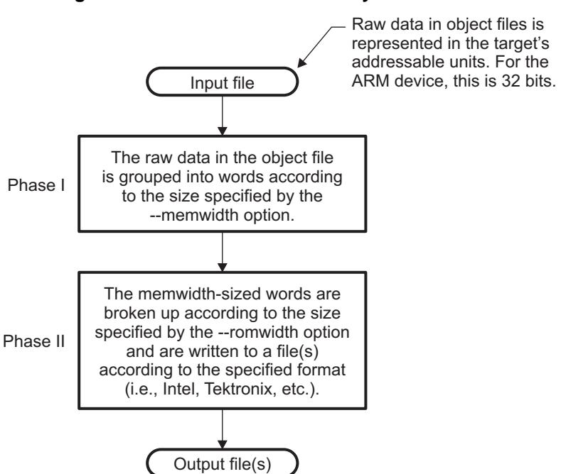

**Figure 12-2: Hex Conversion Utility Process Flow.** Two-phase flowchart. Input: an object file where raw data is represented in the target's addressable units (32 bits for the ARM device). Phase I: the raw data is grouped into words according to the size specified by the --memwidth option. Phase II: the memwidth-sized words are broken up according to the size specified by the --romwidth option and written to output file(s) in the specified format (Intel, Tektronix, etc.).

### 12.4.1 Target Width

Target width is the unit size (in bits) of the target processor's word. The width is fixed for each target and cannot be changed. The PRU targets have a width of 32 bits.

### 12.4.2 Specifying the Memory Width

Memory width is the physical width (in bits) of the memory system. Usually, the memory system is physically the same width as the target processor width: a 32-bit processor has a 32-bit memory architecture. However, some applications require target words to be broken into multiple, consecutive, and narrower memory words.

By default, the hex conversion utility sets memory width to the target width (in this case, 32 bits).

You can change the memory width (except for TI-TXT format) by:

- Using the **--memwidth** option. This changes the memory width value for the entire file.
- Setting the **memwidth** parameter of the ROMS directive. This changes the memory width value for the address range specified in the ROMS directive and overrides the --memwidth option for that range. See Section 12.5.

For both methods, use a value that is a power of 2 greater than or equal to 8.

You should change the memory width default value of 16 only when you need to break single target words into consecutive, narrower memory words.

#### TI-TXT Format is 8 Bits Wide

**NOTE:** You cannot change the memory width of the TI-TXT format. The TI-TXT hex format supports an 8-bit memory width only.

Figure 12-3 demonstrates how the memory width is related to object file data.

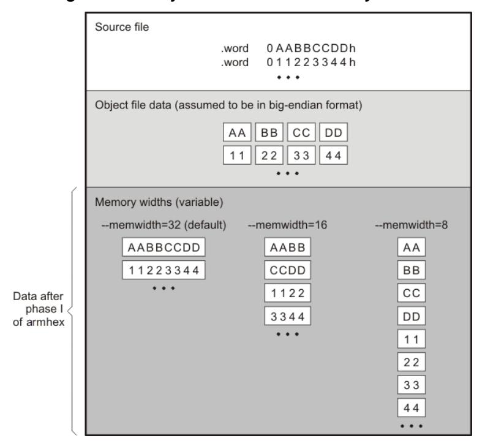

**Figure 12-3: Object File Data and Memory Widths.** Three-section diagram. Top section (Source file): `.word 0AABBCCDDh` and `.word 011223344h`. Middle section (Object file data, assumed big-endian): bytes AA BB CC DD / 11 22 33 44. Bottom section (Memory widths — variable, data after Phase I of armhex): --memwidth=32 (default) produces 32-bit words AABBCCDD and 11223344; --memwidth=16 produces 16-bit words AABB, CCDD, 1122, 3344; --memwidth=8 produces individual bytes AA, BB, CC, DD, 11, 22, 33, 44.

### 12.4.3 Partitioning Data Into Output Files

ROM width determines how the hex conversion utility partitions the data into output files. ROM width specifies the physical width (in bits) of each ROM device and corresponding output file (usually one byte or eight bits). After the object file data is mapped to the memory words, the memory words are broken into one or more output files. The number of output files is determined by the following formulas:

• If memory width ≥ ROM width: number of files = memory width ÷ ROM width

• If memory width < ROM width: number of files = 1

For example, for a memory width of 32, you could specify a ROM width value of 32 and get a single output file containing 32-bit words. Or you can use a ROM width value of 16 to get two files, each containing 16 bits of each word.

The default ROM width that the hex conversion utility uses depends on the output format:

- All hex formats except TI-Tagged are configured as lists of 8-bit bytes; the default ROM width for these formats is 8 bits.
- TI-Tagged is a 16-bit format; the default ROM width for TI-Tagged is 16 bits.

#### The TI-Tagged Format is 16 Bits Wide

**NOTE:** You cannot change the ROM width of the TI-Tagged format. The TI-Tagged format supports a 16-bit ROM width only.

#### TI-TXT Format is 8 Bits Wide

**NOTE:** You cannot change the ROM width of the TI-TXT format. The TI-TXT hex format supports only an 8-bit ROM width.

You can change ROM width (except for TI-Tagged and TI-TXT formats) by:

- Using the **--romwidth** option. This option changes the ROM width value for the entire object file.
- Setting the **romwidth** parameter of the ROMS directive. This parameter changes the ROM width value for a specific ROM address range and overrides the --romwidth option for that range. See Section 12.5.

For both methods, use a value that is a power of 2 greater than or equal to 8.

If you select a ROM width that is wider than the natural size of the output format, the utility simply writes multibyte fields into the file. The --romwidth option is ignored for the TI-TXT and TI-Tagged formats.

Figure 12-4 illustrates how the object file data, memory, and ROM widths are related to one another.

Memory width and ROM width are used only for grouping the object file data; they do not represent values. Thus, the byte ordering of the object file data is maintained throughout the conversion process. To refer to the partitions within a memory word, the bits of the memory word are always numbered from right to left as follows:

A A B B C C D D 1 1 2 2 3 3 4 4 --memwidth=32 31 0

**Figure 12-4. Data, Memory, and ROM Widths**

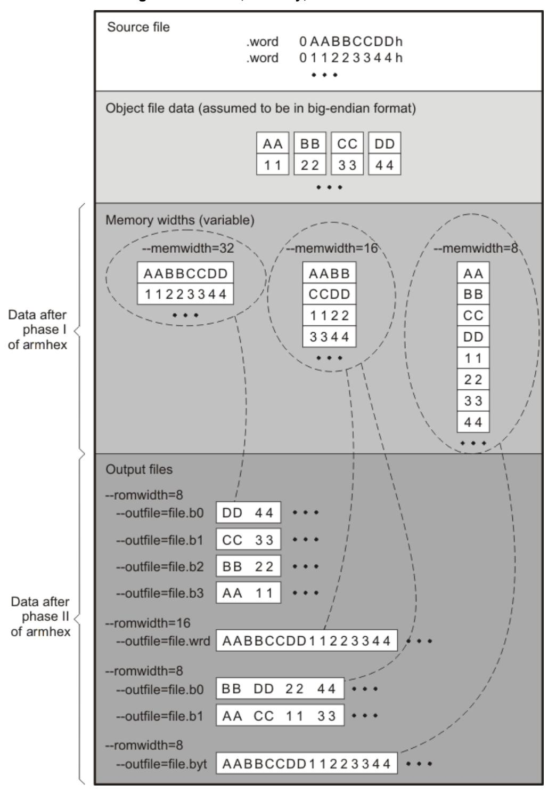

**Figure 12-4: Data, Memory, and ROM Widths.** Diagram extending Figure 12-3 to show Phase II output file partitioning. Source and object file data are the same as Figure 12-3 (words 0AABBCCDDh and 011223344h, big-endian). Phase I memory width groupings shown for --memwidth=32, 16, and 8. Phase II (data after armhex) output files for --romwidth=8: four files file.b0 (DD 44), file.b1 (CC 33), file.b2 (BB 22), file.b3 (AA 11). For --romwidth=16 with --memwidth=32: one file file.wrd containing AABBCCDD11223344. For --romwidth=8 with --memwidth=16: file.b0 (BB DD 22 44), file.b1 (AA CC 11 33). For --romwidth=8 with --memwidth=32 byte mode: file.byt (AABBCCDD11223344).

## 12.5 The ROMS Directive

The ROMS directive specifies the physical memory configuration of your system as a list of address-range parameters.

Each address range produces one set of files containing the hex conversion utility output data that corresponds to that address range. Each file can be used to program one single ROM device.

The ROMS directive is similar to the MEMORY directive of the PRU linker: both define the memory map of the target address space. Each line entry in the ROMS directive defines a specific address range. The general syntax is:

```
ROMS
{
        romname : [origin=value,] [length=value,] [romwidth=value,]
                        [memwidth=value,] [fill=value]
                        [files={ filename 1
                                           , filename 2
                                                      , ...}]
        romname : [origin=value,] [length=value,] [romwidth=value,]
                        [memwidth=value,] [fill=value]
                        [files={ filename 1
                                           , filename 2
                                                      , ...}]
    ...
}
```

**ROMS** begins the directive definition.

*romname* identifies a memory range. The name of the memory range can be one to eight characters in length. The name has no significance to the program; it simply identifies the range, except when the output is for a load image in which case it denotes the section name. (Duplicate memory range names are allowed.)

**origin** specifies the starting address of a memory range. It can be entered as origin, org, or o. The associated value must be a decimal, octal, or hexadecimal constant. If you omit the origin value, the origin defaults to 0. The following table summarizes the notation you can use to specify a decimal, octal, or hexadecimal constant:

| Constant    | Notation              | Example      |
|-------------|-----------------------|--------------|
| Hexadecimal | 0x prefix or h suffix | 0x77 or 077h |
| Octal       | 0 prefix              | 077          |
| Decimal     | No prefix or suffix   | 77           |

**length** specifies the length of a memory range as the physical length of the ROM device. It can be entered as length, len, or l. The value must be a decimal, octal, or hexadecimal constant. If you omit the length, it defaults to the length of the entire address space.

**romwidth** specifies the physical ROM width of the range in bits (see Section 12.4.3). Any value you specify here overrides the --romwidth option. The value must be a decimal, octal, or hexadecimal constant that is a power of 2 greater than or equal to 8.

**memwidth** specifies the memory width of the range in bits (see Section 12.4.2). Any value you specify here overrides the --memwidth option. The value must be a decimal, octal, or hexadecimal constant that is a power of 2 greater than or equal to 8. *When using the memwidth parameter, you must also specify the paddr parameter for each section in the SECTIONS directive.* (See Section 12.6.)

**fill** specifies a fill value to use for the range. In image mode, the hex conversion utility uses this value to fill any holes between sections in a range. A hole is an area between the input sections that comprises an output section that contains no actual code or data. The fill value must be a decimal, octal, or hexadecimal constant with a width equal to the target width. Any value you specify here overrides the --fill option. When using fill, you must also use the --image command line option. (See Section 12.10.2.)

**files** identifies the names of the output files that correspond to this range. Enclose the list of names in curly braces and order them from *least significant* to *most significant* output file, where the bits of the memory word are numbered from right to left. The number of file names must equal the number of output files that the range generates. To calculate the number of output files, see Section 12.4.3. The utility warns you if you list too many or too few filenames.

Unless you are using the --image option, all of the parameters that define a range are optional; the commas and equal signs are also optional. A range with no origin or length defines the entire address space. In image mode, an origin and length are required for all ranges.

Ranges must not overlap and must be listed in order of ascending address.

### 12.5.1 When to Use the ROMS Directive

If you do not use a ROMS directive, the utility defines a single default range that includes the entire address space. This is equivalent to a ROMS directive with a single range without origin or length.

Use the ROMS directive when you want to:

- **Program large amounts of data into fixed-size ROMs**. When you specify memory ranges corresponding to the length of your ROMs, the utility automatically breaks the output into blocks that fit into the ROMs.
- **Restrict output to certain segments**. You can also use the ROMS directive to restrict the conversion to a certain segment or segments of the target address space. The utility does not convert the data that falls outside of the ranges defined by the ROMS directive. Sections can span range boundaries; the utility splits them at the boundary into multiple ranges. If a section falls completely outside any of the ranges you define, the utility does not convert that section and issues no messages or warnings. Thus, you can exclude sections without listing them by name with the SECTIONS directive. However, if a section falls partially in a range and partially in unconfigured memory, the utility issues a warning and converts only the part within the range.
- **Use image mode.** When you use the --image option, you must use a ROMS directive. Each range is filled completely so that each output file in a range contains data for the whole range. Holes before, between, or after sections are filled with the fill value from the ROMS directive, with the value specified with the --fill option, or with the default value of 0.

### 12.5.2 An Example of the ROMS Directive

The ROMS directive in Example 12-1 shows how 16K bytes of 16-bit memory could be partitioned for two 8K-byte 8-bit EPROMs. Figure 12-5 illustrates the input and output files.

#### Example 12-1. A ROMS Directive Example

```
infile.out
--image
--memwidth 16
ROMS
{
   EPROM1: org = 0x00004000, len = 0x2000, romwidth = 8
           files = { rom4000.b0, rom4000.b1}
   EPROM2: org = 0x00006000, len = 0x2000, romwidth = 8,
           fill = 0xFF00FF00,
           files = { rom6000.b0, rom6000.b1}
}
```

**Figure 12-5. The infile.out File Partitioned Into Four Output Files**

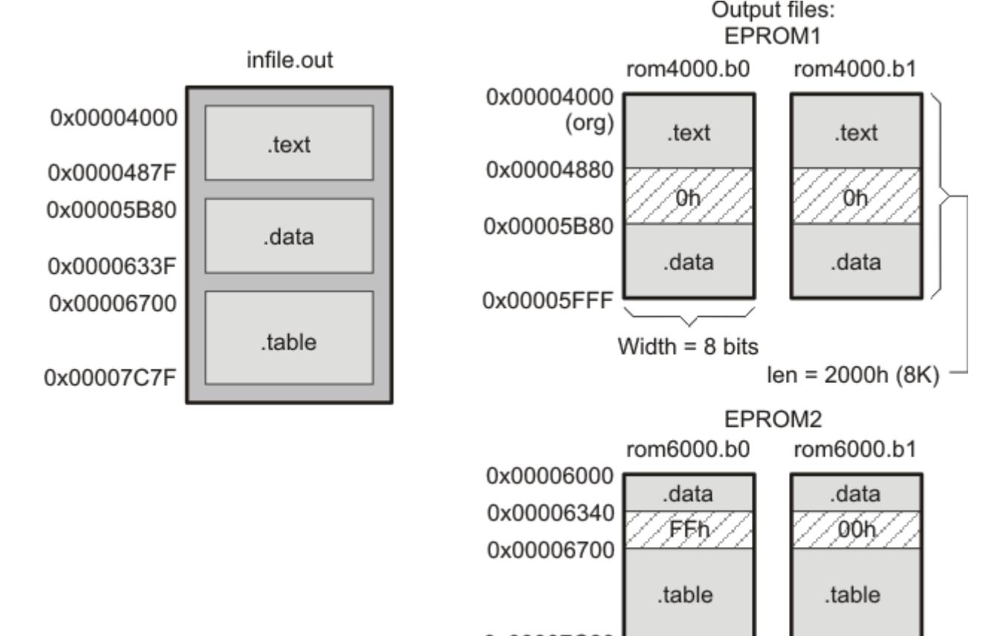

**Figure 12-5: The infile.out File Partitioned Into Four Output Files.** Memory layout diagram. Left: infile.out with three sections: .text (0x00004000–0x0000487F), .data (0x00005B80–0x0000633F), and .table (0x00006700–0x00007C7F). Right top (EPROM1, 8K, Width=8 bits): two output files rom4000.b0 and rom4000.b1 (byte-wide slices), each containing .text, a filled gap (0h fill at 0x00004880–0x00005B7F), and .data through 0x00005FFF. Right bottom (EPROM2): two output files rom6000.b0 and rom6000.b1, each containing .data (0x6000–0x633F), a filled gap (FFh/00h fill at 0x6340–0x66FF), and .table.

The map file (specified with the --map option) is advantageous when you use the ROMS directive with multiple ranges. The map file shows each range, its parameters, names of associated output files, and a list of contents (section names and fill values) broken down by address. Example 12-2 is a segment of the map file resulting from the example in Example 12-1.

#### Example 12-2. Map File Output From Example 12-1 Showing Memory Ranges

```
-----------------------------------------------------
00004000..00005fff Page=0 Width=8 "EPROM1"
-----------------------------------------------------
   OUTPUT FILES: rom4000.b0 [b0..b7]
                   rom4000.b1 [b8..b15]
   CONTENTS: 00004000..0000487f .text
             00004880..00005b7f FILL = 00000000
             00005b80..00005fff .data
-----------------------------------------------------
00006000..00007fff Page=0 Width=8 "EPROM2"
-----------------------------------------------------
   OUTPUT FILES: rom6000.b0 [b0..b7]
                   rom6000.b1 [b8..b15]
   CONTENTS: 00006000..0000633f .data
             00006340..000066ff FILL = ff00ff00
             00006700..00007c7f .table
             00007c80..00007fff FILL = ff00ff00
```

EPROM1 defines the address range from 0x00004000 through 0x00005FFF with the following sections:

| This section | Has this range                |
|--------------|-------------------------------|
| .text        | 0x00004000 through 0x0000487F |
| .data        | 0x00005B80 through 0x00005FFF |

The rest of the range is filled with 0h (the default fill value), converted into two output files:

- rom4000.b0 contains bits 0 through 7
- rom4000.b1 contains bits 8 through 15

EPROM2 defines the address range from 0x00006000 through 0x00007FFF with the following sections:

| This section | Has this range                |
|--------------|-------------------------------|
| .data        | 0x00006000 through 0x0000633F |
| .table       | 0x00006700 through 0x00007C7F |

The rest of the range is filled with 0xFF00FF00 (from the specified fill value). The data from this range is converted into two output files:

- rom6000.b0 contains bits 0 through 7
- rom6000.b1 contains bits 8 through 15

## 12.6 The SECTIONS Directive

You can convert specific sections of the object file by name with the hex conversion utility SECTIONS directive. You can also specify those sections that you want to locate in ROM at a different address than the *load* address specified in the linker command file. If you:

- Use a SECTIONS directive, the utility converts only the sections that you list in the directive and ignores all other sections in the object file.
- Do not use a SECTIONS directive, the utility converts all initialized sections that fall within the configured memory.

Uninitialized sections are *never* converted, whether or not you specify them in a SECTIONS directive.

#### Sections Generated by the C/C++ Compiler

**NOTE:** The PRU C/C++ compiler automatically generates these sections:

- **Initialized sections:** .text, .const, .cinit, and .switch
- **Uninitialized sections:** .bss, .stack, and .sysmem

Use the SECTIONS directive in a command file. (See Section 12.2.2.) The general syntax is:

```
SECTIONS
{
    oname(sname)[:] [paddr=value]
    oname(sname)[:] [paddr= boot]
    oname(sname)[:] [boot]
    ...
}
```

**SECTIONS** begins the directive definition.

*oname* identifies the object filename the section is located within. The filename is optional

when only a single input file is given, but required otherwise.

*sname* identifies a section in the input file. If you specify a section that does not exist, the

utility issues a warning and ignores the name.

**paddr**=*value* specifies the physical ROM address at which this section should be located. This value overrides the section load address given by the linker. This value must be a decimal, octal, or hexadecimal constant. It can also be the word **boot** (to indicate a boot table section for use with a boot loader). *If your file contains multiple sections, and if one section uses a paddr parameter, then all sections must use a paddr parameter.*

**boot** configures a section for loading by a boot loader. This is equivalent to using **paddr=boot**. Boot sections have a physical address determined by the location of the boot table. The origin of the boot table is specified with the --bootorg option.

For more similarity with the linker's SECTIONS directive, you can use colons after the section names (in place of the equal sign on the keyboard). For example, the following statements are equivalent:

```
SECTIONS { .text: .data: boot }
SECTIONS { .text: .data = boot }
```

In the example below, the object file contains six initialized sections: .text, .data, .const, .coeff, and .tables. Suppose you want only .text and .data to be converted. Use a SECTIONS directive to specify this:

```
SECTIONS { .text: .data: }
```

To configure both of these sections for boot loading, add the boot keyword:

```
SECTIONS { .text = boot .data = boot }
```

## 12.7 The Load Image Format (--load\_image Option)

A load image is an object file which contains the load addresses and initialized sections of one or more executable files. The load image object file can be used for ROM masking or can be relinked in a subsequent link step.

### 12.7.1 Load Image Section Formation

The load image sections are formed by collecting the initialized sections from the input executables. There are two ways the load image sections are formed:

- **Using the ROMS Directive**. Each memory range that is given in the ROMS directive denotes a load image section. The romname is the section name. The origin and length parameters are required. The memwidth, romwidth, and files parameters are invalid and are ignored.
  - When using the ROMS directive and the load\_image option, the --image option is required.
- **Default Load Image Section Formation**. If no ROMS directive is given, the load image sections are formed by combining contiguous initialized sections in the input executables. Sections with gaps smaller than the target word size are considered contiguous.

The default section names are image\_1, image\_2, ... If another prefix is desired, the --section\_name\_prefix=*prefix* option can be used.

### 12.7.2 Load Image Characteristics

All load image sections are initialized data sections. In the absence of a ROMS directive, the load/run address of the load image section is the load address of the first input section in the load image section. If the SECTIONS directive was used and a different load address was given using the paddr parameter, this address will be used.

The load image format always creates a single load image object file. The format of the load image object file is determined based on the input files. The file is not marked executable and does not contain an entry point. The default load image object file name is ti\_load\_image.obj. This can be changed using the --outfile option. Only one --outfile option is valid when creating a load image, all other occurrences are ignored.

#### Concerning Load Image Format

**NOTE:** These options are invalid when creating a load image:

- --memwidth
- --romwidth
- --zero
- --byte

If a boot table is being created, either using the SECTIONS directive or the --boot option, the ROMS directive must be used.

## 12.8 Excluding a Specified Section

The --exclude *section\_name* option can be used to inform the hex utility to ignore the specified section. If a SECTIONS directive is used, it overrides the --exclude option.

For example, if a SECTIONS directive containing the section name *mysect* is used and an --exclude *mysect* is specified, the SECTIONS directive takes precedence and *mysect* is not excluded.

The --exclude option has a limited wildcard capability. The \* character can be placed at the beginning or end of the name specifier to indicate a suffix or prefix, respectively. For example, --exclude sect\* disqualifies all sections that begin with the characters sect.

If you specify the --exclude option on the command line with the \* wildcard, use quotes around the section name and wildcard. For example, --exclude"sect\*". Using quotes prevents the \* from being interpreted by the hex conversion utility. If --exclude is in a command file, do not use quotes.

If multiple object files are given, the object file in which the section to be excluded can be given in the form oname(sname). If the object filename is not provided, all sections matching the section name are excluded. Wildcards cannot be used for the filename, but can appear within the parentheses.

## 12.9 Assigning Output Filenames

When the hex conversion utility translates your object file into a data format, it partitions the data into one or more output files. When multiple files are formed by splitting memory words into ROM words, *filenames are always assigned in order from least to most significant*, where bits in the memory words are numbered from right to left. This is true, regardless of target or endian ordering.

The hex conversion utility follows this sequence when assigning output filenames:

1. **It looks for the ROMS directive.** If a file is associated with a range in the ROMS directive and you have included a list of files (files = {. . .}) on that range, the utility takes the filename from the list.

For example, assume that the target data is 32-bit words being converted to four files, each eight bits wide. To name the output files using the ROMS directive, you could specify:

```
ROMS
{
   RANGE1: romwidth=8, files={ xyz.b0 xyz.b1 xyz.b2 xyz.b3 }
}
```

The utility creates the output files by writing the least significant bits to xyz.b0 and the most significant bits to xyz.b3.

2. **It looks for the --outfile options.** You can specify names for the output files by using the --outfile option. If no filenames are listed in the ROMS directive and you use --outfile options, the utility takes the filename from the list of --outfile options. The following line has the same effect as the example above using the ROMS directive:

```
--outfile=xyz.b0 --outfile=xyz.b1 --outfile=xyz.b2 --outfile=xyz.b3
```

If both the ROMS directive and --outfile options are used together, the ROMS directive overrides the --outfile options.

3. **It assigns a default filename.** If you specify no filenames or fewer names than output files, the utility assigns a default filename. A default filename consists of the base name from the input file plus a 2- to 3-character extension. The extension has three parts:

- a. A format character, based on the output format (see Section 12.14):
  - **a** for ASCII-Hex
  - **i** for Intel
  - **m** for Motorola-S
  - **t** for TI-Tagged
  - **x** for Tektronix
- b. The range number in the ROMS directive. Ranges are numbered starting with 0. If there is no ROMS directive, or only one range, the utility omits this character.
- c. The file number in the set of files for the range, starting with 0 for the least significant file.

For example, assume a.out is for a 32-bit target processor and you are creating Intel format output. With no output filenames specified, the utility produces four output files named a.i0, a.i1, a.i2, a.i3.

If you include the following ROMS directive when you invoke the hex conversion utility, you would have eight output files:

```
ROMS
{
   range1: o = 0x00001000 l = 0x1000
   range2: o = 0x00002000 l = 0x1000
}
```

| These output files         | Contain data in these locations |
|----------------------------|---------------------------------|
| a.i00, a.i01, a.i02, a.i03 | 0x00001000 through 0x00001FFF   |
| a.i10, a.i11, a.i12, a.i13 | 0x00002000 through 0x00002FFF   |

## 12.10 Image Mode and the --fill Option

This section points out the advantages of operating in image mode and describes how to produce output files with a precise, continuous image of a target memory range.

### 12.10.1 Generating a Memory Image

With the --image option, the utility generates a memory image by completely filling all of the mapped ranges specified in the ROMS directive.

An object file consists of blocks of memory (sections) with assigned memory locations. Typically, all sections are not adjacent: there are holes between sections in the address space for which there is no data. When such a file is converted *without* the use of image mode, the hex conversion utility bridges these holes by using the address records in the output file to skip ahead to the start of the next section. In other words, there may be discontinuities in the output file addresses. Some EPROM programmers do not support address discontinuities.

In image mode, there are no discontinuities*.* Each output file contains a continuous stream of data that corresponds exactly to an address range in target memory. Any holes before, between, or after sections are filled with a fill value that you supply.

An output file converted by using image mode still has address records, because many of the hexadecimal formats require an address on each line. However, in image mode, these addresses are always contiguous.

#### Defining the Ranges of Target Memory

**NOTE:** If you use image mode, you must also use a ROMS directive. In image mode, each output file corresponds directly to a range of target memory. You must define the ranges. If you do not supply the ranges of target memory, the utility tries to build a memory image of the entire target processor address space. This is potentially a huge amount of output data. To prevent this situation, the utility requires you to explicitly restrict the address space with the ROMS directive.

### 12.10.2 Specifying a Fill Value

The --fill option specifies a value for filling the holes between sections. The fill value must be specified as an integer constant following the --fill option. The width of the constant is assumed to be that of a word on the target processor. For example, specifying --fill=0xFFFF results in a fill pattern of 0x0000FFFF. The constant value is not sign extended.

The hex conversion utility uses a default fill value of 0 if you do not specify a value with the fill option. *The --fill option is valid only when you use --image*; otherwise, it is ignored.

### 12.10.3 Steps to Follow in Using Image Mode

- **Step 1:** Define the ranges of target memory with a ROMS directive. See Section 12.5.
- **Step 2:** Invoke the hex conversion utility with the --image option. You can optionally use the --zero option to reset the address origin to 0 for each output file. If you do not specify a fill value with the ROMS directive and you want a value other than the default of 0, use the --fill option.

## 12.11 Array Output Format

The --array option causes the output to be generated in C array format. In this format, data contained in initialized sections of an executable file are defined as C arrays. Output arrays may be compiled along with a host program and used to initialize the target at runtime.

Arrays are formed by collecting the initialized sections from the input executable. There are two ways arrays are formed:

- **With the ROMS directive.** Each memory range that is given in the ROMS directive denotes an array. The *romname* is used as the array name. The *origin* and *length* parameters of the ROM directive are required. The *memwidth*, *romwidth*, and *files* parameters are invalid and are ignored.
- **No ROMS directive (default).** If no ROMS directive is given, arrays are formed by combining initialized sections within each page, beginning with the first initialized section. Arrays will reflect any gaps that exist between sections.

The default names for the arrays generated for test.out are test\_image\_0 and test\_image\_1. The --array:name\_prefix option can be used to override the default prefix for array names. For example, use --array:name\_prefix=myarray to cause the names for the arrays to be myarray\_0 and myarray\_1.

The default data type for page0 array elements is uint32\_t. However, if the --array:page0\_type\_size=8 option is used, page0 array elements have a data type of uint8\_t. The data type for page1 array elements is always uint8\_t.

## 12.12 Controlling the ROM Device Address

The hex conversion utility output address field corresponds to the ROM device address. The EPROM programmer burns the data into the location specified by the hex conversion utility output file address field. The hex conversion utility offers some mechanisms to control the starting address in ROM of each section. However, many EPROM programmers offer direct control of the location in ROM in which the data is burned.

The address field of the hex-conversion utility output file is controlled by the following items, which are listed from low to high priority:

1. **The linker command file.** By default, the address field of the hex conversion utility output file is the load address (as given in the linker command file).
2. **The paddr parameter of the SECTIONS directive.** When the paddr parameter is specified for a section, the hex conversion utility bypasses the section load address and places the section in the address specified by paddr.
3. **The --zero option.** When you use the --zero option, the utility resets the address origin to 0 for each output file. Since each file starts at 0 and counts upward, any address records represent offsets from the beginning of the file (the address within the ROM) rather than actual target addresses of the data. You must use the --zero option in conjunction with the --image option to force the starting address in each output file to be zero. If you specify the --zero option without the --image option, the utility issues a warning and ignores the --zero option.
4. **The --byte option.** Some EPROM programmers may require the output file address field to contain a byte count rather than a word count. If you use the −byte option, the output file address increments once for each byte. For example, if the starting address is 0h, the first line contains eight words, and you use no −byte option, the second line would start at address 8 (8h). If the starting address is 0h, the first line contains eight words, and you use the −byte option, the second line would start at address 16 (010h). The data in both examples are the same; −byte affects only the calculation of the output file address field, not the actual target processor address of the converted data.

The --byte option causes the address records in an output file to refer to byte locations within the file, whether the target processor is byte-addressable or not.

## 12.13 Control Hex Conversion Utility Diagnostics

The hex conversion utility uses certain C/C++ compiler options to control hex-converter-generated diagnostics.

**--diag\_error**=*id* Categorizes the diagnostic identified by *id* as an error. To determine the numeric identifier of a diagnostic message, use the --display\_error\_number option first in a separate link. Then use --diag\_error=*id* to recategorize the diagnostic as an error. You can only alter the severity of discretionary diagnostics.

**--diag\_remark**=*id* Categorizes the diagnostic identified by *id* as a remark. To determine the numeric identifier of a diagnostic message, use the --display\_error\_number option first in a separate link. Then use --diag\_remark=*id* to recategorize the diagnostic as a remark. You can only alter the severity of discretionary diagnostics.

**--diag\_suppress**=*id* Suppresses the diagnostic identified by *id*. To determine the numeric identifier of a diagnostic message, use the --display\_error\_number option first in a separate link. Then use --diag\_suppress=*id* to suppress the diagnostic. You can only suppress discretionary diagnostics.

**--diag\_warning**=*id* Categorizes the diagnostic identified by *id* as a warning. To determine the numeric identifier of a diagnostic message, use the --display\_error\_number option first in a separate link. Then use --diag\_warning=*id* to recategorize the diagnostic as a warning. You can only alter the severity of discretionary diagnostics.

**--display\_error\_number** Displays a diagnostic's numeric identifier along with its text. Use this option in determining which arguments you need to supply to the diagnostic suppression options (--diag\_suppress, --diag\_error, --diag\_remark, and --diag\_warning). This option also indicates whether a diagnostic is discretionary. A discretionary diagnostic is one whose severity can be overridden. A discretionary diagnostic includes the suffix -D; otherwise, no suffix is present. See the *PRU Optimizing C/C++ Compiler User's Guide* for more information on understanding diagnostic messages.

**--issue\_remarks** Issues remarks (nonserious warnings), which are suppressed by default.

**--no\_warnings** Suppresses warning diagnostics (errors are still issued).

**--set\_error\_limit**=*count* Sets the error limit to *count*, which can be any decimal value. The linker abandons linking after this number of errors. (The default is 100.)

**--verbose\_diagnostics** Provides verbose diagnostics that display the original source with line-wrap and indicate the position of the error in the source line

## 12.14 Description of the Object Formats

The hex conversion utility has options that identify each format. Table 12-2 specifies the format options. They are described in the following sections.

- You should use only one of these options on the command line. If you use more than one option, the last one you list overrides the others.
- The default format is Tektronix (--tektronix option).

**Table 12-2. Options for Specifying Hex Conversion Formats**

| Option        | Alias | Format      | Address Bits | Default Width |
|---------------|-------|-------------|--------------|---------------|
| --ascii       | -a    | ASCII-Hex   | 16           | 8             |
| --intel       | -i    | Intel       | 32           | 8             |
| --motorola=1  | -m1   | Motorola-S1 | 16           | 8             |
| --motorola=2  | -m2   | Motorola-S2 | 24           | 8             |
| --motorola=3  | -m3   | Motorola-S3 | 32           | 8             |
| --ti-tagged   | -t    | TI-Tagged   | 16           | 16            |
| --ti_txt      |       | TI_TXT      | 8            | 8             |
| --tektronix   | -x    | Tektronix   | 32           | 8             |

**Address bits** determine how many bits of the address information the format supports. Formats with 16 bit addresses support addresses up to 64K only. The utility truncates target addresses to fit in the number of available bits.

The **default width** determines the default output width of the format. You can change the default width by using the --romwidth option or by using the romwidth parameter in the ROMS directive. You cannot change the default width of the TI-Tagged format, which supports a 16-bit width only.

### 12.14.1 ASCII-Hex Object Format (--ascii Option)

The ASCII-Hex object format supports 16-bit addresses. The format consists of a byte stream with bytes separated by spaces. Figure 12-6 illustrates the ASCII-Hex format.

**Figure 12-6. ASCII-Hex Object Format**

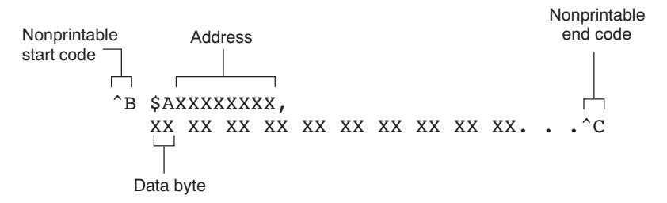

**Figure 12-6: ASCII-Hex Object Format.** Record format diagram. A file begins with a nonprintable start code (^B, ASCII STX, 02h) and ends with a nonprintable end code (^C, ASCII ETX, 03h). Address records use the form `$AXXXXXXXX` where XXXXXXXX is an 8-digit hexadecimal address. Data bytes follow the address field, each separated by spaces, shown as XX pairs.

The file begins with an ASCII STX character (ctrl-B, 02h) and ends with an ASCII ETX character (ctrl-C, 03h). Address records are indicated with \$AXXXXXXXX, in which XXXXXXXX is a 8-digit (16-bit) hexadecimal address. The address records are present only in the following situations:

- When discontinuities occur
- When the byte stream does not begin at address 0

You can avoid all discontinuities and any address records by using the --image and --zero options. This creates output that is simply a list of byte values.

### 12.14.2 Intel MCS-86 Object Format (--intel Option)

The Intel object format supports 16-bit addresses and 32-bit extended addresses. Intel format consists of a 9-character (4-field) prefix (which defines the start of record, byte count, load address, and record type), the data, and a 2-character checksum suffix.

The 9-character prefix represents three record types:

| Record Type | Description                    |
|-------------|--------------------------------|
| 00          | Data record                    |
| 01          | End-of-file record             |
| 04          | Extended linear address record |

Record type00, the data record, begins with a colon ( : ) and is followed by the byte count, the address of the first data byte, the record type (00), and the checksum. The address is the least significant 16 bits of a 32-bit address; this value is concatenated with the value from the most recent 04 (extended linear address) record to create a full 32-bit address. The checksum is the 2s complement (in binary form) of the preceding bytes in the record, including byte count, address, and data bytes.

Record type 01, the end-of-file record, also begins with a colon ( : ), followed by the byte count, the address, the record type (01), and the checksum.

Record type 04, the extended linear address record, specifies the upper 16 address bits. It begins with a colon ( : ), followed by the byte count, a dummy address of 0h, the record type (04), the most significant 16 bits of the address, and the checksum. The subsequent address fields in the data records contain the least significant bytes of the address.

Figure 12-7 illustrates the Intel hexadecimal object format.

**Figure 12-7. Intel Hexadecimal Object Format**

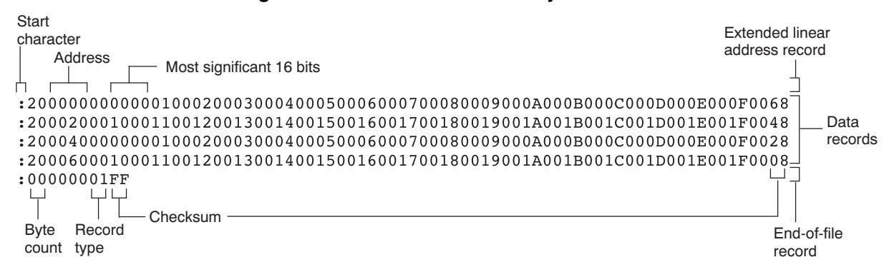

**Figure 12-7: Intel Hexadecimal Object Format.** Sample Intel hex file records with labeled fields. Each record starts with a colon (:) start character followed by: byte count (2 hex digits), address (4 hex digits, with the most-significant 16 bits carried in an extended linear address record), record type (2 hex digits), data bytes, and a checksum (2 hex digits). Shown: an extended linear address record, two data records of 32 bytes each (:20...), and the end-of-file record (:00000001FF).

### 12.14.3 Motorola Exorciser Object Format (--motorola Option)

The Motorola S1, S2, and S3 formats support 16-bit, 24-bit, and 32-bit addresses, respectively. The formats consist of a start-of-file (header) record, data records, and an end-of-file (termination) record. Each record consists of five fields: record type, byte count, address, data, and checksum. The three record types are:

| Record Type | Description                                         |
|-------------|-----------------------------------------------------|
| S0          | Header record                                       |
| S1          | Code/data record for 16-bit addresses (S1 format)   |
| S2          | Code/data record for 24-bit addresses (S2 format)   |
| S3          | Code/data record for 32-bit addresses (S3 format)   |
| S7          | Termination record for 32-bit addresses (S3 format) |
| S8          | Termination record for 24-bit addresses (S2 format) |
| S9          | Termination record for 16-bit addresses (S1 format) |

The byte count is the character pair count in the record, excluding the type and byte count itself.

The checksum is the least significant byte of the 1s complement of the sum of the values represented by the pairs of characters making up the byte count, address, and the code/data fields.

Figure 12-8 illustrates the Motorola-S object format.

#### Figure 12-8. Motorola-S Format

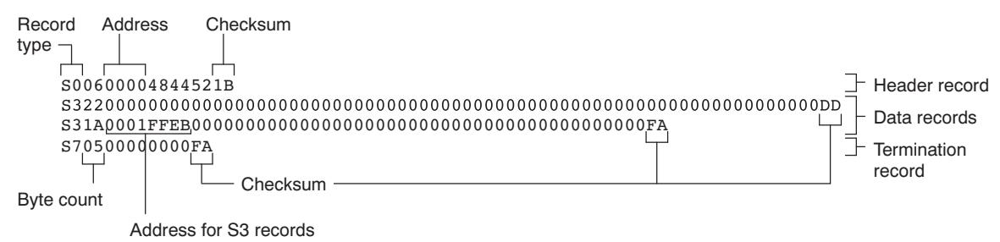

**Figure 12-8: Motorola-S Format.** Sample Motorola-S object file records with labeled fields. Record type is a single character (S0 = header, S3 = data with 4-byte address, S7 = termination for S3 records). Fields: record type, byte count, address (for S3 records: 4 bytes), data, checksum. Example shows header record S0060000..., two 32-byte data records (S322... and S31A...), and termination record S7050000FA.

### 12.14.4 Extended Tektronix Object Format (--tektronix Option)

The Tektronix object format supports 32-bit addresses and has two types of records:

**Data records** contains the header field, the load address, and the object code.

**Termination records** signifies the end of a module.

The header field in the data record contains the following information:

| Item         | Number of ASCII<br>Characters | Description                                                                                       |
|--------------|-------------------------------|---------------------------------------------------------------------------------------------------|
| %            | 1                             | Data type is Tektronix format                                                                     |
| Block length | 2                             | Number of characters in the record, minus the %                                                   |
| Block type   | 1                             | 6 = data record<br>8 = termination record                                                         |
| Checksum     | 2                             | A 2-digit hex sum modulo 256 of all values in the record except the % and the<br>checksum itself. |

The load address in the data record specifies where the object code will be located. The first digit specifies the address length; this is always 8. The remaining characters of the data record contain the object code, two characters per byte.

Figure 12-9 illustrates the Tektronix object format.


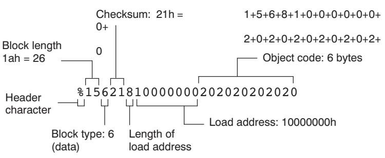

**Figure 12-9: Extended Tektronix Object Format.** Record format diagram. Each record begins with a header character (%). Fields: block type (6 = data), length of load address, load address (e.g., 10000000h), object code bytes, block length (e.g., 1Ah = 26), and checksum. Example record: %1562181000000002020202020200 with annotated checksum calculation (21h).

### 12.14.5 Texas Instruments SDSMAC (TI-Tagged) Object Format (--ti\_tagged Option)

The Texas Instruments SDSMAC (TI-Tagged) object format supports 16-bit addresses, including start-offile record, data records, and end-of-file record. Each data records consists of a series of small fields and is signified by a tag character:

| Tag Character | Description                               |
|---------------|-------------------------------------------|
| K             | Followed by the program identifier        |
| 7             | Followed by a checksum                    |
| 8             | Followed by a dummy checksum (ignored)    |
| 9             | Followed by a 16-bit load address         |
| B             | Followed by a data word (four characters) |
| F             | Identifies the end of a data record       |
| *             | Followed by a data byte (two characters)  |

Figure 12-10 illustrates the tag characters and fields in TI-Tagged object format.


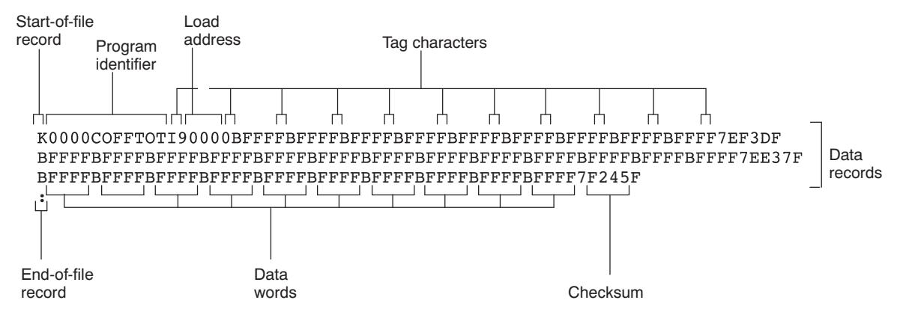

**Figure 12-10: TI-Tagged Object Format.** Sample TI-Tagged (SDSMAC) object file records with labeled fields. The start-of-file record begins with K. Fields include: program identifier, load address, tag characters interspersed with data words, and a checksum. Three data records are shown (e.g., K0000COFFTOTI90000BFFFFBFFFF...). The end-of-file record is a colon (:). Checksum is the 2s complement of the sum of ASCII values from the first tag character to the checksum tag character.

If any data fields appear before the first address, the first field is assigned address 0000h. Address fields may be expressed but not required for any data byte. The checksum field, preceded by the tag character 7, is the 2s complement of the sum of the 8-bit ASCII values of characters, beginning with the first tag character and ending with the checksum tag character (7 or 8). The end-of-file record is a colon ( : ).

### 12.14.6 TI-TXT Hex Format (--ti\_txt Option)

The TI-TXT hex format supports 16-bit hexadecimal data. It consists of section start addresses, data byte, and an end-of-file character. These restrictions apply:

- The number of sections is unlimited.
- Each hexadecimal start address must be even.
- Each line must have 16 data bytes, except the last line of a section.
- Data bytes are separated by a single space.
- The end-of-file termination tag q is mandatory.

The data record contains the following information:

| Item  | Description                            |
|-------|----------------------------------------|
| @ADDR | Hexadecimal start address of a section |
| DATAn | Hexadecimal data byte                  |
| q     | End-of-file termination character      |

#### Figure 12-11. TI-TXT Object Format

```
@ADDR1
          DATA01 DATA02 ........ DATA16
          DATA17 DATA32 ........ DATA32
          DATAm ........ DATAn
          @ADDR2
          DATA01 .................... DATAn
          q
          Section
           start
      End-of-line
       character
  Data
 bytes
                                                      Data
                                                      bytes
Section
  start
```

#### Example 12-3. TI-TXT Object Format

```
@F000
31 40 00 03 B2 40 80 5A 20 01 D2 D3 22 00 D2 E3
21 00 3F 40 E8 FD 1F 83 FE 23 F9 3F
@FFFE
00 F0
Q
```

# 13 Sharing C/C++ Header Files With Assembly Source

You can use the .cdecls assembler directive to share C headers containing declarations and prototypes between C and assembly code. Any legal C/C++ can be used in a .cdecls block and the C/C++ declarations will cause suitable assembly to be generated automatically, allowing you to reference the C/C++ constructs in assembly code.

**Topic** ........................................................................................................................... **Page**

| 13.1 | Overview of the .cdecls Directive | 280 |
|------|-----------------------------------|-----|
| 13.2 | Notes on C/C++ Conversions        | 280 |
| 13.3 | Notes on C++ Specific Conversions | 284 |
| 13.4 | Special Assembler Support         | 285 |
|      |                                   |     |

## 13.1 Overview of the .cdecls Directive

The .cdecls directive allows programmers in mixed assembly and C/C++ environments to share C headers containing declarations and prototypes between the C and assembly code. Any legal C/C++ can be used in a .cdecls block and the C/C++ declarations will cause suitable assembly to be generated automatically. This allows the programmer to reference the C/C++ constructs in assembly code — calling functions, allocating space, and accessing structure members — using the equivalent assembly mechanisms. While function and variable definitions are ignored, most common C/C++ elements are converted to assembly: enumerations, (non function-like) macros, function and variable prototypes, structures, and unions.

See the .cdecls directive description for details on the syntax of the .cdecls assembler directive.

The .cdecls directive can appear anywhere in an assembly source file, and can occur multiple times within a file. However, the C/C++ environment created by one .cdecls is **not** inherited by a later .cdecls; the C/C++ environment starts over for each .cdecls instance.

For example, the following code causes the warning to be issued:

```
.cdecls C,NOLIST
%{
    #define ASMTEST 1
%}
.cdecls C,NOLIST
%{
    #ifndef ASMTEST
        #warn "ASMTEST not defined!" /* will be issued */
    #endif
%}
```

Therefore, a typical use of the .cdecls block is expected to be a single usage near the beginning of the assembly source file, in which all necessary C/C++ header files are included.

Use the compiler --include\_path=*path* options to specify additional include file paths needed for the header files used in assembly, as you would when compiling C files.

Any C/C++ errors or warnings generated by the code of the .cdecls are emitted as they normally would for the C/C++ source code. C/C++ errors cause the directive to fail, and any resulting converted assembly is not included.

C/C++ constructs that cannot be converted, such as function-like macros or variable definitions, cause a comment to be output to the converted assembly file. For example:

```
; ASM HEADER WARNING - variable definition 'ABCD' ignored
```

The prefix ASM HEADER WARNING appears at the beginning of each message. To see the warnings, either the WARN parameter needs to be specified so the messages are displayed on STDERR, or else the LIST parameter needs to be specified so the warnings appear in the listing file, if any.

Finally, note that the converted assembly code does not appear in the same order as the original C/C++ source code and C/C++ constructs may be simplified to a normalized form during the conversion process, but this should not affect their final usage.

## 13.2 Notes on C/C++ Conversions

The following sections describe C and C++ conversion elements that you need to be aware of when sharing header files with assembly source.

### 13.2.1 Comments

Comments are consumed entirely at the C level, and do not appear in the resulting converted assembly file.

### 13.2.2 Conditional Compilation (#if/#else/#ifdef/etc.)

Conditional compilation is handled entirely at the C level during the conversion step. Define any necessary macros either on the command line (using the compiler --define=*name*=*value* option) or within a .cdecls block using #define. The #if, #ifdef, etc. C/C++ directives are **not** converted to assembly .if, .else, .elseif, and .endif directives.

### 13.2.3 Pragmas

Pragmas found in the C/C++ source code cause a warning to be generated as they are not converted. They have no other effect on the resulting assembly file. See the .cdecls topic for the WARN and NOWARN parameter discussion for where these warnings are created.

### 13.2.4 The #error and #warning Directives

These preprocessor directives are handled completely by the compiler during the parsing step of conversion. If one of these directives is encountered, the appropriate error or warning message is emitted. These directives are not converted to .emsg or .wmsg in the assembly output.

### 13.2.5 Predefined symbol \_ \_ASM\_HEADER\_ \_

The C/C++ macro \_ \_ASM\_HEADER\_ \_ is defined in the compiler while processing code within .cdecls. This allows you to make changes in your code, such as not compiling definitions, during the .cdecls processing.

**Be Careful With the \_ \_ASM\_HEADER\_ \_ Macro**

**NOTE:** You must be very careful not to use this macro to introduce any changes in the code that could result in inconsistencies between the code processed while compiling the C/C++ source and while converting to assembly.

### 13.2.6 Usage Within C/C++ asm( ) Statements

The .cdecls directive is not allowed within C/C++ asm( ) statements and will cause an error to be generated.

### 13.2.7 The #include Directive

The C/C++ #include preprocessor directive is handled transparently by the compiler during the conversion step. Such #includes can be nested as deeply as desired as in C/C++ source. The assembly directives .include and .copy are not used or needed within a .cdecls. Use the command line --include\_path option to specify additional paths to be searched for included files, as you would for C compilation.

### 13.2.8 Conversion of #define Macros

Only object-like macros are converted to assembly. Function-like macros have no assembly representation and so cannot be converted. Pre-defined and built-in C/C++ macros are not converted to assembly (i.e., \_\_FILE\_\_, \_\_TIME\_\_, \_\_TI\_COMPILER\_VERSION\_\_, etc.). For example, this code is converted to assembly because it is an object-like macro:

```
#define NAME Charley
```

This code is not converted to assembly because it is a function-like macro:

```
#define MAX(x,y) (x>y ? x : y)
```

Some macros, while they are converted, have no functional use in the containing assembly file. For example, the following results in the assembly substitution symbol FOREVER being set to the value while(1), although this has no useful use in assembly because while(1) is not legal assembly code.

```
#define FOREVER while(1)
```

Macro values are **not** interpreted as they are converted. For example, the following results in the assembler substitution symbol OFFSET being set to the literal string value 5+12 and **not** the value 17. This happens because the semantics of the C/C++ language require that macros are evaluated in context and not when they are parsed.

```
#define OFFSET 5+12
```

Because macros in C/C++ are evaluated in their usage context, C/C++ printf escape sequences such as \n are not converted to a single character in the converted assembly macro. See Section 13.2.11 for suggestions on how to use C/C++ macro strings.

Macros are converted using the .define directive (see Section 13.4.2), which functions similarly to the .asg assembler directive. The exception is that .define disallows redefinitions of register symbols and mnemonics to prevent the conversion from corrupting the basic assembly environment. To remove a macro from the assembly scope, .undef can be used following the .cdecls that defines it (see Section 13.4.3).

The macro functionality of # (stringize operator) is only useful within functional macros. Since functional macros are not supported by this process, # is not supported either. The concatenation operator ## is only useful in a functional context, but can be used degenerately to concatenate two strings and so it is supported in that context.

### 13.2.9 The #undef Directive

Symbols undefined using the #undef directive before the end of the .cdecls are not converted to assembly.

### 13.2.10 Enumerations

Enumeration members are converted to .enum elements in assembly. For example:

```
enum state { ACTIVE=0x10, SLEEPING=0x01, INTERRUPT=0x100, POWEROFF, LAST};
```

is converted to the following assembly code:

```
state .enum
ACTIVE .emember 16
SLEEPING .emember 1
NTERRUPT .emember 256
POWEROFF .emember 257
LAST .emember 258
         .endenum
```

The members are used via the pseudo-scoping created by the .enum directive.

The usage is similar to that for accessing structure members, enum\_name.member.

This pseudo-scoping is used to prevent enumeration member names from corrupting other symbols within the assembly environment.

### 13.2.11 C Strings

Because C string escapes such as \n and \t are not converted to hex characters 0x0A and 0x09 until their use in a string constant in a C/C++ program, C macros whose values are strings cannot be represented as expected in assembly substitution symbols. For example:

```
#define MSG "\tHI\n"
becomes, in assembly:
.define """\tHI\n""",MSG ; 6 quoted characters! not 5!
```

When used in a C string context, you expect this statement to be converted to 5 characters (tab, H, I, newline, NULL), but the .string assembler directive does not know how to perform the C escape conversions.

You can use the .cstring directive to cause the escape sequences and NULL termination to be properly handled as they would in C/C++. Using the above symbol MSG with a .cstring directive results in 5 characters of memory being allocated, the same characters as would result if used in a C/C++ strong context. (See Section 13.4.7 for the .cstring directive syntax.)

### 13.2.12 C/C++ Built-In Functions

The C/C++ built-in functions, such as sizeof( ), are not translated to their assembly counterparts, if any, if they are used in macros. Also, their C expression values are not inserted into the resulting assembly macro because macros are evaluated in context and there is no active context when converting the macros to assembly.

Suitable functions such as \$sizeof( ) are available in assembly expressions. However, as the basic types such as int/char/float have no type representation in assembly, there is no way to ask for \$sizeof(int), for example, in assembly.

### 13.2.13 Structures and Unions

C/C++ structures and unions are converted to assembly .struct and .union elements. Padding and ending alignments are added as necessary to make the resulting assembly structure have the same size and member offsets as the C/C++ source. The primary purpose is to allow access to members of C/C++ structures, as well as to facilitate debugging of the assembly code. For nested structures, the assembly .tag feature is used to refer to other structures/unions.

The alignment is also passed from the C/C++ source so that the assembly symbol is marked with the same alignment as the C/C++ symbol. (See Section 13.2.3 for information about pragmas, which may attempt to modify structures.) Because the alignment of structures is stored in the assembly symbol, builtin assembly functions like \$sizeof( ) and \$alignof( ) can be used on the resulting structure name symbol.

When using unnamed structures (or unions) in typedefs, such as:

```
typedef struct { int a_member; } mystrname;
```

This is really a shorthand way of writing:

```
struct temporary_name { int a_member; };
typedef temporary_name mystrname;
```

The conversion processes the above statements in the same manner: generating a temporary name for the structure and then using .define to output a typedef from the temporary name to the user name. You should use your *mystrname* in assembly the same as you would in C/C++, but do not be confused by the assembly structure definition in the list, which contains the temporary name. You can avoid the temporary name by specifying a name for the structure, as in:

```
typedef struct a_st_name { ... } mystrname;
```

If a shorthand method is used in C to declare a variable with a particular structure, for example:

```
extern struct a_name { int a_member; } a_variable;
```

Then after the structure is converted to assembly, a .tag directive is generated to declare the structure of the external variable, such as:

```
_a_variable .tag a_st_name
```

This allows you to refer to \_a\_variable.a\_member in your assembly code.

### 13.2.14 Function/Variable Prototypes

Non-static function and variable prototypes (not definitions) will result in a .global directive being generated for each symbol found.

See Section 13.3.1 for C++ name mangling issues.

Function and variable definitions will result in a warning message being generated (see the WARN/NOWARN parameter discussion for where these warnings are created) for each, and they will not be represented in the converted assembly.

The assembly symbol representing the variable declarations will not contain type information about those symbols. Only a .global will be issued for them. Therefore, it is your responsibility to ensure the symbol is used appropriately.

See Section 13.2.13 for information on variables names which are of a structure/union type.

### 13.2.15 C Constant Suffixes

The C constant suffixes u, l, and f are passed to the assembly unchanged. The assembler will ignore these suffixes if used in assembly expressions.

### 13.2.16 Basic C/C++ Types

Only complex types (structures and unions) in the C/C++ source code are converted to assembly. Basic types such as int, char, or float are not converted or represented in assembly beyond any existing .int, .char, .float, etc. directives that previously existed in assembly.

Typedefs of basic types are therefore also not represented in the converted assembly.

## 13.3 Notes on C++ Specific Conversions

The following sections describe C++ specific conversion elements that you need to be aware of when sharing header files with assembly source.

### 13.3.1 Name Mangling

Symbol names may be mangled in C++ source files. When mangling occurs, the converted assembly will use the mangled names to avoid symbol name clashes. You can use the demangler (dempru) to demangle names and identify the correct symbols to use in assembly.

To defeat name mangling in C++ for symbols where polymorphism (calling a function of the same name with different kinds of arguments) is not required, use the following syntax:

```
extern "C" void somefunc(int arg);
```

The above format is the short method for declaring a single function. To use this method for multiple functions, you can also use the following syntax:

```
extern "C"
  {
      void somefunc(int arg);
      int anotherfunc(int arg);
      ...
   }
```

### 13.3.2 Derived Classes

Derived classes are only partially supported when converting to assembly because of issues related to C++ scoping which does not exist in assembly. The greatest difference is that base class members do not automatically become full (top-level) members of the derived class. For example:

```
----------------------------------------------------------
        class base
        {
           public:
                 int b1;
        };
        class derived : public base
        {
             public:
                int d1;
        }
```

In C++ code, the class derived would contain both integers b1 and d1. In the converted assembly structure "derived", the members of the base class must be accessed using the name of the base class, such as derived.\_\_b\_base.b1 rather than the expected derived.b1.

A non-virtual, non-empty base class will have \_\_b\_ prepended to its name within the derived class to signify it is a base class name. That is why the example above is derived.\_\_b\_base.b1 and not simply derived.base.b1.

### 13.3.3 Templates

No support exists for templates.

### 13.3.4 Virtual Functions

No support exists for virtual functions, as they have no assembly representation.

## 13.4 Special Assembler Support

### 13.4.1 Enumerations (.enum/.emember/.endenum)

The following directives support a pseudo-scoping for enumerations:

*ENUM\_NAME* **.enum**

*MEMBER1* **.emember** [*value*]

*MEMBER2* **.emember** [*value*]

...

**.endenum**

The **.enum** directive begins the enumeration definition and **.endenum** terminates it.

The enumeration name (*ENUM\_NAME*) cannot be used to allocate space; its size is reported as zero.

The format to use the value of a member is *ENUM\_NAME.MEMBER*, similar to a structure member usage.

The **.emember** directive optionally accepts the value to set the member to, just as in C/C++. If not specified, the member takes a value one more than the previous member. As in C/C++, member names cannot be duplicated, although values can be. Unless specified with .emember, the first enumeration member will be given the value 0 (zero), as in C/C++.

The .endenum directive cannot be used with a label, as structure .endstruct directives can, because the .endenum directive has no value like the .endstruct does (containing the size of the structure).

Conditional compilation directives (.if/.else/.elseif/.endif) are the only other non-enumeration code allowed within the .enum/.endenum sequence.

### 13.4.2 The .define Directive

The .define directive functions in the same manner as the .asg directive, except that .define disallows creation of a substitution symbol that has the same name as a register symbol or mnemonic. It does not create a new symbol name space in the assembler, rather it uses the existing substitution symbol name space. The syntax for the directive is:

**.define** *substitution string* **,** *substitution symbol name*

The .define directive is used to prevent corruption of the assembly environment when converting C/C++ headers.

### 13.4.3 The .undefine/.unasg Directives

The .undef directive is used to remove the definition of a substitution symbol created using .define or .asg. This directive will remove the named symbol from the substitution symbol table from the point of the .undef to the end of the assembly file. The syntax for these directives is:

**.undefine** *substitution symbol name*

**.unasg** *substitution symbol name*

This can be used to remove from the assembly environment any C/C++ macros that may cause a problem.

Also see Section 13.4.2, which covers the .define directive.

### 13.4.4 The \$defined( ) Built-In Function

The \$defined directive returns true/1 or false/0 depending on whether the name exists in the current substitution symbol table or the standard symbol table. In essence \$defined returns TRUE if the assembler has any user symbol in scope by that name. This differs from \$isdefed in that \$isdefed only tests for NON-substitution symbols. The syntax is:

**\$defined(** *substitution symbol name* **)**

A statement such as ".if \$defined(macroname)" is then similar to the C code "#ifdef macroname".

See Section 13.4.2 and Section 13.4.3 for the use of .define and .undef in assembly.

### 13.4.5 The \$sizeof Built-In Function

The assembly built-in function \$sizeof( ) can be used to query the size of a structure in assembly. It is an alias for the already existing \$structsz( ). The syntax is:

**\$sizeof(** *structure name* **)**

The \$sizeof function can then be used similarly to the C built-in function sizeof( ).

The assembler's \$sizeof( ) built-in function cannot be used to ask for the size of basic C/C++ types, such as \$sizeof(int), because those basic type names are not represented in assembly. Only complex types are converted from C/C++ to assembly.

Also see Section 13.2.12, which notes that this conversion does not happen automatically if the C/C++ sizeof( ) built-in function is used within a macro.

### 13.4.6 Structure/Union Alignment and \$alignof( )

The assembly .struct and .union directives take an optional second argument which can be used to specify a minimum alignment to be applied to the symbol name. This is used by the conversion process to pass the specific alignment from C/C++ to assembly.

The assembly built-in function \$alignof( ) can be used to report the alignment of these structures. This can be used even on assembly structures, and the function will return the minimum alignment calculated by the assembler.

### 13.4.7 The .cstring Directive

You can use the .cstring directive to cause the escape sequences and NULL termination to be properly handled as they would in C/C++.

```
.cstring "String with C escapes.\nWill be NULL terminated.\012"
```

See Section 13.2.11 for more information on the .cstring directive.

# A Symbolic Debugging Directives

The assembler supports several directives that the PRU C/C++ compiler uses for symbolic debugging.

These directives are not meant for use by assembly-language programmers. They require arguments that can be difficult to calculate manually, and their usage must conform to a predetermined agreement between the compiler, the assembler, and the debugger. This appendix documents these directives for informational purposes only.

**Topic** ........................................................................................................................... **Page**

| A.1 | DWARF Debugging Format | 288 |
|-----|------------------------|-----|
| A.2 | Debug Directive Syntax | 288 |

## A.1 DWARF Debugging Format

A subset of the DWARF symbolic debugging directives are always listed in the assembly language file that the compiler creates for program analysis purposes. To list the complete set used for full symbolic debug, invoke the compiler with the --symdebug:dwarf option, as shown below:

```
clpru --symdebug:dwarf --keep_asm input_file
```

The --keep\_asm option instructs the compiler to retain the generated assembly file.

To disable the generation of all symbolic debug directives, invoke the compiler with the --symdebug:none option:

```
clpru --symdebug:none --keep_asm input_file
```

The DWARF debugging format consists of the following directives:

- The **.dwtag** and **.dwendtag** directives define a Debug Information Entry (DIE) in the .debug\_info section.
- The **.dwattr** directive adds an attribute to an existing DIE.
- The **.dwpsn** directive identifies the source position of a C/C++ statement.
- The **.dwcie** and **.dwendentry** directives define a Common Information Entry (CIE) in the .debug\_frame section.
- The **.dwfde** and **.dwendentry** directives define a Frame Description Entry (FDE) in the .debug\_frame section.
- The **.dwcfi** directive defines a call frame instruction for a CIE or FDE.

## A.2 Debug Directive Syntax

Table A-1 is an alphabetical listing of the symbolic debugging directives. For information on the C/C++ compiler, refer to the *PRU Optimizing C/C++ Compiler User's Guide.*

**Table A-1. Symbolic Debugging Directives**

| Label     | Directive   | Arguments                                                                                                 |
|-----------|-------------|-----------------------------------------------------------------------------------------------------------|
|           | .dwattr     | DIE label , DIE attribute name ( DIE attribute value )[, DIE attribute name ( attribute value ) [,]       |
|           | .dwcfi      | call frame instruction opcode[, operand[, operand]]                                                       |
| CIE label | .dwcie      | version , return address register                                                                         |
|           | .dwendentry |                                                                                                           |
|           | .dwendtag   |                                                                                                           |
|           | .dwfde      | CIE label                                                                                                 |
|           | .dwpsn      | " filename ", line number , column number                                                                 |
| DIE label | .dwtag      | DIE tag name , DIE attribute name ( DIE attribute value )[, DIE attribute name ( attribute value )<br>[,] |

# B XML Link Information File Description

The PRU linker supports the generation of an XML link information file via the --xml\_link\_info *file* option. This option causes the linker to generate a well-formed XML file containing detailed information about the result of a link. The information included in this file includes all of the information that is currently produced in a linker-generated map file.

As the linker evolves, the XML link information file may be extended to include additional information that could be useful for static analysis of linker results.

This appendix enumerates all of the elements that are generated by the linker into the XML link information file.

**Topic** ........................................................................................................................... **Page**

| B.1 | XML Information File Element Types | 290 |
|-----|------------------------------------|-----|
| B.2 | Document Elements                  | 290 |

## B.1 XML Information File Element Types

These element types will be generated by the linker:

- **Container elements** represent an object that contains other elements that describe the object. Container elements have an id attribute that makes them accessible from other elements.
- **String elements** contain a string representation of their value.
- **Constant elements** contain a 32-bit unsigned long representation of their value (with a 0x prefix).
- **Reference elements** are empty elements that contain an idref attribute that specifies a link to another container element.

In Section B.2, the element type is specified for each element in parentheses following the element description. For instance, the <link\_time> element lists the time of the link execution (string).

## B.2 Document Elements

The root element, or the document element, is **<link\_info>**. All other elements contained in the XML link information file are children of the <link\_info> element. The following sections describe the elements that an XML information file can contain.

### B.2.1 Header Elements

The first elements in the XML link information file provide general information about the linker and the link session:

- The **<banner>** element lists the name of the executable and the version information (string).
- The **<copyright>** element lists the TI copyright information (string).
- The **<link\_time>** is a timestamp representation of the link time (unsigned 32-bit int).
- The **<output\_file>** element lists the name of the linked output file generated (string).
- The **<entry\_point>** element specifies the program entry point, as determined by the linker (container) with two entries:
  - The **<name>** is the entry point symbol name, if any (string).
  - The **<address>** is the entry point address (constant).

#### Example B-1. Header Element for the hi.out Output File

```
<banner>PRU Linker Version x.xx </banner>
<copyright>Copyright (c) 2012-2014 Texas Instruments Incorporated</copyright>
<link_time>0x43dfd8a4</link_time>
<output_file>hi.out</output_file>
<entry_point>
  <name>_c_int00</name>
  <address>0xaf80</address>
</entry_point>
```

### B.2.2 Input File List

The next section of the XML link information file is the input file list, which is delimited with a **<input\_file\_list>** container element. The <input\_file\_list> can contain any number of <input\_file> elements.

Each **<input\_file>** instance specifies the input file involved in the link. Each <input\_file> has an id attribute that can be referenced by other elements, such as an <object\_component>. An <input\_file> is a container element enclosing the following elements:

- The **<path>** element names a directory path, if applicable (string).
- The **<kind>** element specifies a file type, either archive or object (string).
- The **<file>** element specifies an archive name or filename (string).
- The **<name>** element specifies an object file name, or archive member name (string).

#### Example B-2. Input File List for the hi.out Output File

```
<input_file_list>
   <input_file id="fl-1">
      <kind>object</kind>
      <file>hi.obj</file>
      <name>hi.obj</name>
   </input_file>
   <input_file id="fl-2">
      <path>/tools/lib/</path>
      <kind>archive</kind>
      <file>rtsxxx.lib</file>
      <name>boot.obj</name>
   </input_file>
   <input_file id="fl-3">
      <path>/tools/lib/</path>
      <kind>archive</kind>
      <file>rtsxxx.lib</file>
      <name>exit.obj</name>
   </input_file>
   <input_file id="fl-4">
      <path>/tools/lib/</path>
      <kind>archive</kind>
      <file>rtsxxx.lib</file>
      <name>printf.obj</name>
   </input_file>
...
</input_file_list>
```

### B.2.3 Object Component List

The next section of the XML link information file contains a specification of all of the object components that are involved in the link. An example of an object component is an input section. In general, an object component is the smallest piece of object that can be manipulated by the linker.

The **<object\_component\_list>** is a container element enclosing any number of <object\_component> elements.

Each **<object\_component>** specifies a single object component. Each <object\_component> has an id attribute so that it can be referenced directly from other elements, such as a <logical\_group>. An <object\_component> is a container element enclosing the following elements:

- The **<name>** element names the object component (string).
- The **<load\_address>** element specifies the load-time address of the object component (constant).
- The **<run\_address>** element specifies the run-time address of the object component (constant).
- The **<size>** element specifies the size of the object component (constant).
- The **<input\_file\_ref>** element specifies the source file where the object component originated (reference).

#### Example B-3. Object Component List for the fl-4 Input File

```
<object_component id="oc-20">
   <name>.text</name>
   <load_address>0xac00</load_address>
   <run_address>0xac00</run_address>
   <size>0xc0</size>
   <input_file_ref idref="fl-4"/>
</object_component>
<object_component id="oc-21">
   <name>.data</name>
   <load_address>0x80000000</load_address>
   <run_address>0x80000000</run_address>
   <size>0x0</size>
   <input_file_ref idref="fl-4"/>
</object_component>
<object_component id="oc-22">
   <name>.bss</name>
   <load_address>0x80000000</load_address>
   <run_address>0x80000000</run_address>
   <size>0x0</size>
   <input_file_ref idref="fl-4"/>
</object_component>
```

### B.2.4 Logical Group List

The **<logical\_group\_list>** section of the XML link information file is similar to the output section listing in a linker-generated map file. However, the XML link information file contains a specification of GROUP and UNION output sections, which are not represented in a map file. There are three kinds of list items that can occur in a <logical\_group\_list>:

- The **<logical\_group>** is the specification of a section or GROUP that contains a list of object components or logical group members. Each <logical\_group> element is given an id so that it may be referenced from other elements. Each <logical\_group> is a container element enclosing the following elements:
  - The **<name>** element names the logical group (string).
  - The **<load\_address>** element specifies the load-time address of the logical group (constant).
  - The **<run\_address>** element specifies the run-time address of the logical group (constant).
  - The **<size>** element specifies the size of the logical group (constant).
  - The **<contents>** element lists elements contained in this logical group (container). These elements refer to each of the member objects contained in this logical group:
    - The **<object\_component\_ref>** is an object component that is contained in this logical group (reference).
    - The **<logical\_group\_ref>** is a logical group that is contained in this logical group (reference).
- The **<overlay>** is a special kind of logical group that represents a UNION, or a set of objects that share the same memory space (container). Each <overlay> element is given an id so that it may be referenced from other elements (like from an <allocated\_space> element in the placement map). Each <overlay> contains the following elements:
  - The **<name>** element names the overlay (string).
  - The **<run\_address>** element specifies the run-time address of overlay (constant).
  - The **<size>** element specifies the size of logical group (constant).
  - The **<contents>** container element lists elements contained in this overlay. These elements refer to each of the member objects contained in this logical group:
    - The **<object\_component\_ref>** is an object component that is contained in this logical group (reference).
    - The **<logical\_group\_ref>** is a logical group that is contained in this logical group (reference).
- The **<split\_section>** is another special kind of logical group that represents a collection of logical groups that is split among multiple memory areas. Each <split\_section> element is given an id so that it may be referenced from other elements. The id consists of the following elements.
  - The **<name>** element names the split section (string).
  - The **<contents>** container element lists elements contained in this split section. The <logical\_group\_ref> elements refer to each of the member objects contained in this split section, and each element referenced is a logical group that is contained in this split section (reference).

#### Example B-4. Logical Group List for the fl-4 Input File

```
<logical_group_list>
   ...
      <logical_group id="lg-7">
      <name>.text</name>
      <load_address>0x20</load_address>
      <run_address>0x20</run_address>
      <size>0xb240</size>
      <contents>
         <object_component_ref idref="oc-34"/>
         <object_component_ref idref="oc-108"/>
         <object_component_ref idref="oc-e2"/>
      ...
      </contents>
   </logical_group>
   ...
   <overlay id="lg-b">
      <name>UNION_1</name>
      <run_address>0xb600</run_address>
      <size>0xc0</size>
      <contents>
         <object_component_ref idref="oc-45"/>
         <logical_group_ref idref="lg-8"/>
      </contents>
   </overlay>
    ...
   <split_section id="lg-12">
      <name>.task_scn</name>
      <size>0x120</size>
      <contents>
         <logical_group_ref idref="lg-10"/>
         <logical_group_ref idref="lg-11"/>
      </contents>
   ...
</logical_group_list>
```

### B.2.5 Placement Map

The **<placement\_map>** element describes the memory placement details of all named memory areas in the application, including unused spaces between logical groups that have been placed in a particular memory area.

The **<memory\_area>** is a description of the placement details within a named memory area (container). The description consists of these items:

- The **<name>** names the memory area (string).
- The **<page\_id>** gives the id of the memory page in which this memory area is defined (constant).
- The **<origin>** specifies the beginning address of the memory area (constant).
- The **<length>** specifies the length of the memory area (constant).
- The **<used\_space>** specifies the amount of allocated space in this area (constant).
- The **<unused\_space>** specifies the amount of available space in this area (constant).
- The **<attributes>** lists the RWXI attributes that are associated with this area, if any (string).
- The **<fill\_value>** specifies the fill value that is to be placed in unused space, if the fill directive is specified with the memory area (constant).
- The **<usage\_details>** lists details of each allocated or available fragment in this memory area. If the fragment is allocated to a logical group, then a <logical\_group\_ref> element is provided to facilitate access to the details of that logical group. All fragment specifications include <start\_address> and <size> elements.
  - The **<allocated\_space>** element provides details of an allocated fragment within this memory area (container):
    - The **<start\_address>** specifies the address of the fragment (constant).
    - The **<size>** specifies the size of the fragment (constant).
    - The **<logical\_group\_ref>** provides a reference to the logical group that is allocated to this fragment (reference).
  - The **<available\_space** element provides details of an available fragment within this memory area (container):
    - The **<start\_address>** specifies the address of the fragment (constant).
    - The **<size>** specifies the size of the fragment (constant).

#### Example B-5. Placement Map for the fl-4 Input File

```
<placement_map>
   <memory_area>
      <name>PMEM</name>
      <page_id>0x0</page_id>
      <origin>0x20</origin>
      <length>0x100000</length>
      <used_space>0xb240</used_space>
      <unused_space>0xf4dc0</unused_space>
      <attributes>RWXI</attributes>
      <usage_details>
         <allocated_space>
            <start_address>0x20</start_address>
            <size>0xb240</size>
            <logical_group_ref idref="lg-7"/>
         </allocated_space>
         <available_space>
            <start_address>0xb260</start_address>
            <size>0xf4dc0</size>
         </available_space>
      </usage_details>
   </memory_area>
   ...
</placement_map>
```

### B.2.6 Symbol Table

The **<symbol\_table>** contains a list of all of the global symbols that are included in the link. The list provides information about a symbol's name and value. In the future, the symbol\_table list may provide type information, the object component in which the symbol is defined, storage class, etc.

The **<symbol>** is a container element that specifies the name and value of a symbol with these elements:

- The **<name>** element specifies the symbol name (string).
- The **<value>** element specifies the symbol value (constant).

#### Example B-6. Symbol Table for the fl-4 Input File

```
<symbol_table>
   <symbol>
      <name>_c_int00</name>
      <value>0xaf80</value>
   </symbol>
   <symbol>
      <name>_main</name>
      <value>0xb1e0</value>
   </symbol>
   <symbol>
      <name>_printf</name>
      <value>0xac00</value>
   </symbol>
   ...
</symbol_table>
```

# C Hex Conversion Utility Examples

The flexible hex conversion utility offers many options and capabilities. Once you understand the proper ways to configure your EPROM system and the requirements of the EPROM programmer, you will find that converting a file for a specific application is easy.

The three scenarios in this appendix show how to develop a hex conversion command file for avoiding holes, using 16-BIS (16-bit instruction set) code, and using multiple-EPROM systems. The scenarios use this assembly code:

```
***************************************************
* Assemble two words into section "secA"          *
***************************************************

   .sect "secA"
   .word 012345678h
   .word 0abcd1234h

***************************************************
* Assemble two words into section "secB"          *
***************************************************

   .sect "secB"
   .word 087654321h
   .word 04321dcbah
```

Before you use this appendix, read Chapter 12 to understand how to use the hex conversion utility.

| C.1 | Scenario 1: Building a Hex Conversion Command File for a Single 8-Bit EPROM | 298 |
|-----|-----------------------------------------------------------------------------|-----|
| C.2 | Scenario 2: Building a Hex Conversion Command File for 16-BIS Code          | 302 |
| C.3 | Scenario 3: Building a Hex Conversion Command File for Two 8-Bit EPROMs     | 305 |

## C.1 Scenario 1: Building a Hex Conversion Command File for a Single 8-Bit EPROM

Scenario 1 shows how to build the hex conversion command file for converting an object file for the memory system shown in Figure C-1. In this system, there is one external 128K × 8-bit EPROM interfacing with a TMS470 target processor.

**Figure C-1. EPROM Memory System for Scenario 1**

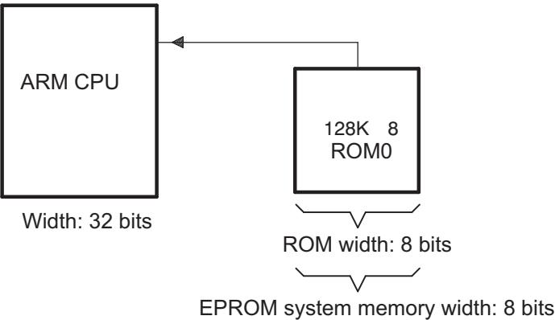

**Figure C-1: EPROM Memory System for Scenario 1.** Block diagram showing an ARM CPU (width: 32 bits) connected to a single 128K × 8 ROM0. ROM width: 8 bits; EPROM system memory width: 8 bits.

A object file consists of blocks of memory (sections) with assigned memory locations. Typically, all sections are not adjacent: there are holes between sections in the address space for which there is no data. Scenario 1 shows how you can use the hex conversion utility's image mode to fill any holes before, between, or after sections with a fill value.

For this scenario, the application code resides in the program memory (ROM) on the TMS470 CPU, but the data tables used by this code reside in an off-chip EPROM.

The circuitry of the target board handles the access to the data; the native TMS470 address of 0x1000 accesses location 0x0 on the EPROM.

To satisfy the address requirements for the code, this scenario requires a linker command file that allocates sections and memory as follows:

- The program/application code (represented in this scenario by the secA section shown in Example C-1\) must be linked so that its address space resides in the program memory (ROM) on the TMS470 CPU.
- To satisfy the condition that the data be loaded on the EPROM at address 0x0 but be referenced by the application code at address 0x1000, secB (the section that contains the data for this application) must be assigned a linker load address of 0x1000 so that all references to data in this section will be resolved with respect to the TMS470 CPU address. In the hex conversion utility command file, the paddr option must be used to burn the section of data at EPROM address 0x0. This value overrides the section load address given by the linker.

Example C-1 shows the linker command file that resolves the addresses needed in the stated specifications.

#### Example C-1. Linker Command File and Link Map for Scenario 1

```
/**************************************************************************/
/* Scenario 1  Link Command                                               */
/*                                                                        */
/*   Usage:  lnkpru <obj files...>   -o <out file> -m <map file> lnk32.cmd */
/*           clpru  <src files...> -z -o <out file> -m <map file> lnk32.cmd */
/*                                                                        */
/*  Description: This file is a sample command file that can be used     */
/*               for linking programs built with the TMS470 C            */
/*               compiler.  Use it as a guideline; you may want to change */
/*               the allocation scheme according to the size of your     */
/*               program and the memory layout of your target system.    */
/*                                                                        */
/*  Notes: (1)  You must specify the directory in which rts32.lib is     */
/*              located.  Either add a "-i<directory>" line to this      */
/*              file, or use the system environment variable C_DIR to    */
/*              specify a search path for libraries.                     */
/*                                                                        */
/*       (2)  If the runtime-support library you are using is not        */
/*              named rts32.lib, be sure to use the correct name here.   */
/**************************************************************************/
-m example1.map
/* SPECIFY THE SYSTEM MEMORY MAP */
MEMORY
{
   I_MEM  : org = 0x00000000  len = 0x00000020  /* INTERRUPTS          */
   D_MEM  : org = 0x00000020  len = 0x00010000  /* DATA MEMORY   (RAM) */
   P_MEM  : org = 0x00010020  len = 0x00100000  /* PROGRAM MEMORY (ROM) */
}
/* SPECIFY THE SECTIONS ALLOCATION INTO MEMORY */
SECTIONS
{
   secA: load = P_MEM
   secB: load = 0x1000
}
```

You must create a hex conversion command file to generate a hex output with the correct addresses and format for the EPROM programmer.

In the memory system outlined in Figure C-1, only the application data is stored on the EPROM; the data resides in secB of the object file created by the linker. By default, the hex conversion utility converts all initialized sections that appear in the object file. To prevent the conversion of the application code in secA, a SECTIONS directive must be defined in the hex conversion command file to list explicitly the section(s) to be converted. In this case, secB must be listed explicitly as the section to be converted.

The EPROM programmer in this scenario has the following system requirements:

- The EPROM programmer loads only a complete ROM image. A complete ROM image is one in which there is a contiguous address space (there are no holes in the addresses in the converted file), and each address in the range contains a known value. Creating a complete ROM image requires the use of the –image option and the ROMS directive.
  - Using the -image option causes the hex conversion utility to create an output file that has
    contiguous addresses over the specified memory range and forces the utility to fill address spaces
    that are not previously filled by raw data from sections defined in the input object file. By default,
    the value used to fill the unused portions of the memory range is 0.
  - Because the -image option operates over a known range of memory addresses, a ROMS directive is needed to specify the origin and length of the memory for the EPROM.
- To burn the section of data at EPROM address 0x0, the paddr option must be used. This value overrides the section load address given by the linker.
- In this scenario, the EPROM is 128K  $\times$  8 bits. Therefore, the memory addresses for the EPROM must range from 0x0 to 0x20000.

- Because the EPROM memory width is eight bits, the memwidth value must be set to 8.
- Because the physical width of the ROM device is eight bits, the romwidth value must be set to 8.
- Intel format must be used.

Since memwidth and romwidth have the same value, only one output file is generated (the number of output files is determined by the ratio of memwidth to romwidth). The output file is named with the -o option.

The hex conversion command file for Scenario 1 is shown in Example C-2. This command file uses the following options to select the requirements of the system:

| Option            | Description                                             |
|-------------------|---------------------------------------------------------|
| -i                | Create Intel format                                     |
| -image            | Generate a memory image                                 |
| -map example1.mxp | Generate example1.mxp as the map file of the conversion |
| -o example1.hex   | Name example1.hex as the output file                    |
| -memwidth 8       | Set EPROM system memory width to 8                      |
| -romwidth 8       | Set physical ROM width to 8                             |

#### Example C-2. Hex Conversion Command File for Scenario 1

```
/* Hex Conversion Command file for Scenario 1 */
a.out /* linked object file, input */
-I /* Intel format */
-image
-map example1.mxp /* Generate a map of the conversion */
-o example1.hex /* Resulting hex output file */
-memwidth 8 /* EPROM memory system width */
-romwidth 8 /* Physical width of ROM */
ROMS
{
  EPROM: origin = 0x0, length = 0x20000
}
SECTIONS
{
  secB: paddr = 0x0 /* Select only section, secB, for conversion */
}
```

Example C-3 shows the contents of the resulting map file (example1.mxp). Figure C-2 shows the contents of the resulting hex output file (example1.hex). The hex conversion utility places the data tables, secB, at address 0 and then fills the remainder of the address space with the default fill value of 0. For more information about the Intel MCS-86 object format, see Figure 12-7.

#### Example C-3. Contents of Hex Map File example1.mxp

```
**********************************************************
PRU Hex Converter Version x.xx
**********************************************************
INPUT FILE NAME: <a.out>
OUTPUT FORMAT: Intel
PHYSICAL MEMORY PARAMETERS
  Default data width: 8
  Default memory width: 8
  Default output width: 8
OUTPUT TRANSLATION MAP
---------------------------------------------------------
00000000..0001ffff Page=0 ROM Width=8 Memory Width=8 "EPROM"
---------------------------------------------------------
  OUTPUT FILES: example1.hex [b0..b7]
  CONTENTS: 00000000..00000007 Data Width=1 secB
            00000007..0001ffff FILL = 00000000
```

**Figure C-2. Contents of Hex Output File example1.hex**

## C.2 Scenario 2: Building a Hex Conversion Command File for 16-BIS Code

Scenario 2 shows how to build the hex conversion command file to generate the correct converted file for the application code and data that will reside on a single 16-bit EPROM. The EPROM memory system for this scenario is shown in Figure C-3. For this scenario, the TMS470 CPU operates with the T control bit set, so the processor executes instructions in 16-BIS mode.

**Figure C-3. EPROM Memory System for Scenario 2**

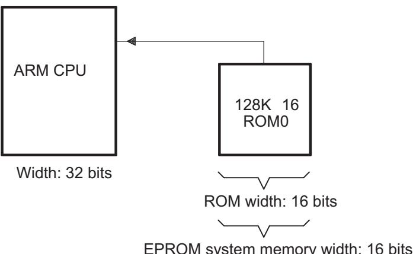

**Figure C-3: EPROM Memory System for Scenario 2.** Block diagram showing an ARM CPU (width: 32 bits) connected to a single 128K × 16 ROM0. ROM width: 16 bits; EPROM system memory width: 16 bits.

For this scenario, the application code and data reside on the EPROM: the lower 64K words of EPROM memory are dedicated to application code space and the upper 64K words are dedicated to the data tables. The application code is loaded starting at address 0x0 on the EPROM but maps to the TMS470 CPU at address 0x3000. The data tables are loaded starting at address 0x1000 on the EPROM and map to the TMS470 CPU address 0x20.

Example C-4 shows the linker command file that resolves the addresses needed for the load on EPROM and the TMS470 CPU access.

#### Example C-4. Linker Command File for Scenario 2

```
/**************************************************************************/
/* Scenario 2  Link Command                                               */
/*                                                                        */
/*   Usage:  lnkpru <obj files...>   -o <out file> -m <map file> lnk16.cmd */
/*           clpru  <src files...> -z -o <out file> -m <map file> lnk16.cmd */
/*                                                                        */
/*  Description: This file is a sample command file that can be used     */
/*               for linking programs built with the TMS470 C            */
/*               compiler.  Use it as a guideline; you may want to change */
/*               the allocation scheme according to the size of your     */
/*               program and the memory layout of your target system.    */
/*                                                                        */
/*  Notes: (1)  You must specify the directory in which rts16.lib is     */
/*              located.  Either add a "-i<directory>" line to this      */
/*              file, or use the system environment variable C DIR to    */
/*              specify a search path for libraries.                     */
/*                                                                        */
/*       (2)  If the runtime-support library you are using is not        */
/*              named rts16.lib, be sure to use the correct name here.   */
/**************************************************************************/
-m example2.map
/* SPECIFY THE SYSTEM MEMORY MAP */
MEMORY
{
   I_MEM  : org = 0x00000000  len = 0x00000020  /* INTERRUPTS          */
   D_MEM  : org = 0x00000020  len = 0x00010000  /* DATA MEMORY   (RAM) */
   P_MEM  : org = 0x00010020  len = 0x00100000  /* PROGRAM MEMORY (ROM) */
}
/* SPECIFY THE SECTIONS ALLOCATION INTO MEMORY */
SECTIONS
{
   secA: load = 0x3000
   secB: load = 0x20
}
```

You must create a hex conversion command file to generate a hex output with the correct addresses and format for the EPROM programmer. The EPROM programmer in this scenario has the following system requirements:

- Because the EPROM memory width is 16 bits, the memwidth value must be set to 16.
- Because the physical width of the ROM device is 16 bits, the romwidth value must be set to 16.
- Intel format must be used.

The EPROM programmer does not require a ROM image, so the addresses in the input hex output file do not need to be contiguous.

Because memwidth and romwidth have the same value, only one output file is generated (the number of output files is determined by the ratio of memwidth to romwidth). The output file is named with the -o option.

A ROMS directive is used in this scenario since the paddr option is used to relocate both secA and secB.

The hex conversion command file for Scenario 2 is shown in Example C-5. This command file uses the following options to select the requirements of the system:

| Option            | Description                                             |
|-------------------|---------------------------------------------------------|
| -i                | Create Intel format                                     |
| -map example2.mxp | Generate example2.mxp as the map file of the conversion |
| -o example2.hex   | Name example2.hex as the output file                    |
| -memwidth 8       | Set EPROM system memory width to 8                      |
| -romwidth 8       | Set physical ROM width to 8                             |

#### Example C-5. Hex Conversion Command File for Scenario 2

```
/* Hex Conversion Command file for Scenario 2             */
a.out                  /* linked object file, input */
-I                     /* Intel format */
   /* The following two options are optional */
-map example2.mxp      /* Generate a map of the conversion */
-o example2.hex        /* Resulting Hex Output file */
   /* Specify EPROM system Memory Width and Physical ROM width */
-memwidth 16           /* EPROM memory system width */
-romwidth 16           /* Physical width of ROM */
ROMS
{
   EPROM: origin = 0x0, length = 0x20000
}
SECTIONS
{
   secA: paddr = 0x0
   secB: paddr = 0x1000
}
```

Example C-6 shows the contents of the resulting map file (example2.mxp). Figure C-4 shows the contents of the resulting hex output file (example2.hex).

#### Example C-6. Contents of Hex Map File example2.mxp

```
*****************************************************
PRU Hex Converter                   Version x.xx
*****************************************************
INPUT FILE NAME: <a.out>
OUTPUT FORMAT:   Intel

PHYSICAL MEMORY PARAMETERS
   Default data width:     8
   Default memory width:  16
   Default output width:  16

OUTPUT TRANSLATION MAP
-----------------------------------------------------
00000000..0001ffff Page=0  ROM Width=16  Memory Width=16  "EPROM"
-----------------------------------------------------
   OUTPUT FILES: example2.hex [b0..b15]

   CONTENTS: 00000000..00000003  Data Width=1  secA
             00001000..00001003  Data Width=1  secB
```

**Figure C-4. Contents of Hex Output File example2.hex**

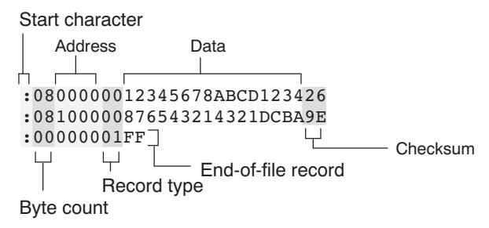

**Figure C-4: Contents of Hex Output File example2.hex.** Intel hex record layout diagram. Shows three records: :0800200056781234C8 (8-byte data record at address 0020), :040028004321DCBADA (4-byte data record at address 0028), and :00000001FF (end-of-file record). Labeled fields: start character (:), byte count, address, data, record type, checksum.

## C.3 Scenario 3: Building a Hex Conversion Command File for Two 8-Bit EPROMs

Scenario 3 shows how to build the hex conversion command file for converting a object file for the memory system shown in Figure C-5. In this system, there are two external 64K × 16-bit EPROMs interfacing with the TMS470 target processor. The application code and data will be burned on the EPROM starting at address 0x20. The application code will be burned first, followed by the data tables.

**Figure C-5. EPROM Memory System for Scenario 3**

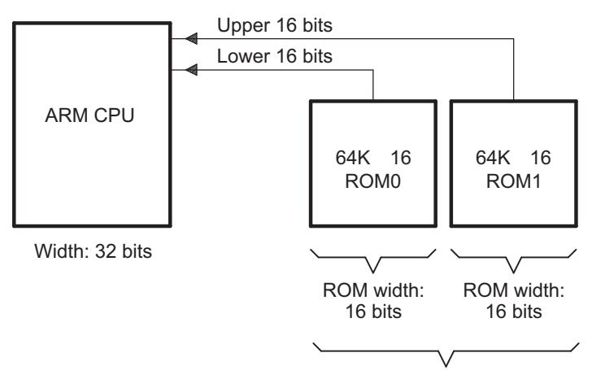

**Figure C-5: EPROM Memory System for Scenario 3.** Block diagram showing an ARM CPU (width: 32 bits) connected to two 64K × 16-bit EPROMs: ROM0 and ROM1, each with ROM width 16 bits. ROM0 provides the upper 16 bits of the 32-bit CPU word; ROM1 provides the lower 16 bits. EPROM system memory width: 32 bits.

In this scenario, the EPROM load address for the application code and for the data also corresponds to the TMS470 CPU address that accesses the code and data. Therefore, only a load address needs to be specified.

Example C-7 shows the linker command file for this scenario.

#### Example C-7. Linker Command File for Scenario 3

```
/**************************************************************************/
/* Scenario 3  Link Command                                               */
/*                                                                        */
/*   Usage:  lnkpru <obj files...>   -o <out file> -m <map file> lnk32.cmd */
/*           clpru  <src files...> -z -o <out file> -m <map file> lnk32.cmd */
/*                                                                        */
/*  Description: This file is a sample command file that can be used     */
/*               for linking programs built with the TMS470 C            */
/*               compiler.  Use it as a guideline; you may want to change */
/*               the allocation scheme according to the size of your     */
/*               program and the memory layout of your target system.    */
/*                                                                        */
/*  Notes: (1)  You must specify the directory in which rts32.lib is     */
/*              located.  Either add a "-i<directory>" line to this      */
/*              file, or use the system environment variable C_DIR to    */
/*              specify a search path for libraries.                     */
/*                                                                        */
/*       (2)  If the runtime-support library you are using is not        */
/*              named rts32.lib, be sure to use the correct name here.   */
/**************************************************************************/
-m example3.map
/* SPECIFY THE SYSTEM MEMORY MAP */
MEMORY
{
   I_MEM  : org = 0x00000000  len = 0x00000020  /* INTERRUPTS          */
   D_MEM  : org = 0x00000020  len = 0x00010000  /* DATA MEMORY   (RAM) */
   P_MEM  : org = 0x00010020  len = 0x00100000  /* PROGRAM MEMORY (ROM) */
}
/* SPECIFY THE SECTIONS ALLOCATION INTO MEMORY */
SECTIONS
{
   secA: load = 0x20
   secB: load = D_MEM
}
```

You must create a hex conversion command file to generate a hex output with the correct addresses and format for the EPROM programmer.

The EPROM programmer in this scenario has the following system requirements:

- In the memory system outlined in Figure C-5, the EPROM system memory width is 32 bits because each of the physical ROMs provides 16 bits of a 32-bit word. Because the EPROM system memory width is 32 bits, the memwidth value must be set to 32.
- Because the width of each of the physical ROMs is 16 bits, the romwidth value must be set to 16.
- Intel format must be used.

With a memwidth of 32 and a romwidth of 16, two output files are generated by the hex conversion utility (the number of files is determined by the ratio of memwidth to romwidth). In previous scenarios, the output filename was specified with the -o option. Another way to specify the output filename is to use the files keyword within a ROMS directive. When you use -o or the files keyword, the first output filename always contains the low-order bytes of the word.

The hex conversion command file for Scenario 3 is shown in Example C-8. This command file uses the following options to select the requirements of the system:

| Option            | Description                                             |
|-------------------|---------------------------------------------------------|
| -i                | Create Intel format                                     |
| -map example3.mxp | Generate example3.mxp as the map file of the conversion |
| -memwidth 32      | Set EPROM system memory width to 32                     |
| -romwidth 16      | Set physical ROM width to 16                            |

The files keyword is used within the ROMS directive to specify the output filenames.

#### Example C-8. Hex Conversion Command File for Scenario 3

```
/* Hex Conversion Command file for Scenario 3             */
a.out                  /* linked object file, input */
-I                     /* Intel format */
   /* Optional Commands */
-map example3.mxp      /* Generate a map of the conversion */
   /* Specify EPROM system memory width and physical ROM width */
-memwidth 32           /* EPROM memory system width */
-romwidth 16           /* Physical width of ROM */
ROMS
{
   EPROM: org = 0x0, length = 0x20000
   files={ lower16.bit, upper16.bit }
}
```

Example C-9 shows the contents of the resulting map file (example3.mxp).

#### Example C-9. Contents of Hex Map File example3.mxp

```
*****************************************************
PRU Hex Converter                   Version x.xx
*****************************************************
Tue Sep 19 07:41:28 1995
INPUT FILE NAME: <a.out>
OUTPUT FORMAT:   Intel

PHYSICAL MEMORY PARAMETERS
   Default data width:     8
   Default memory width:  32
   Default output width:  16

OUTPUT TRANSLATION MAP
-----------------------------------------------------
00000000..0001ffff Page=0  ROM Width=16  Memory Width=32  "EPROM"
-----------------------------------------------------
   OUTPUT FILES: lower16.bit [b0..b15]
                 upper16.bit [b16..b31]

   CONTENTS: 00000020..00000021  Data Width=1  secA
             00000028..00000029  Data Width=1  secB
```

The contents of the output files lower16.bit and upper16.bit are shown in Figure C-6. The first image shows the lower16.bit file, which stores the low-order 16 bits of the 32-bit output word. The second image shows the upper16.bit files, which stores the upper 16 bits.

**Figure C-6. Contents of Hex Output File**

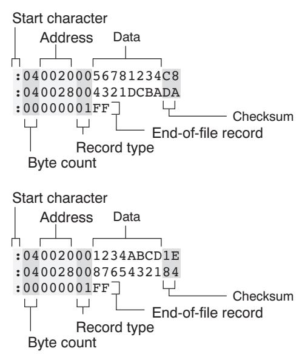

**Figure C-6: Contents of Hex Output File.** Two Intel hex file listings. Top (lower16.bit, stores low-order 16 bits of the 32-bit output word): :0400200056781234C8, :040028004321DCBADA, :00000001FF. Bottom (upper16.bit, stores upper 16 bits): :040020001234ABCD1E, :040028008765432184, :00000001FF. Labeled fields: start character, address, data, byte count, record type, checksum, end-of-file record.

# D Glossary

## D.1 Terminology

- **ABI —** Application binary interface.
- **absolute address —** An address that is permanently assigned to a PRU memory location.
- **absolute constant expression —** An expression that does not refer to any external symbols or any registers or memory reference. The value of the expression must be knowable at assembly time.
- **absolute lister —** A debugging tool that allows you to create assembler listings that contain absolute addresses.
- **address constant expression —** A symbol with a value that is an address plus an addend that is an absolute constant expression with an integer value.
- **alignment —** A process in which the linker places an output section at an address that falls on an *n-*byte boundary, where *n* is a power of 2. You can specify alignment with the SECTIONS linker directive.
- **allocation —** A process in which the linker calculates the final memory addresses of output sections.
- **ANSI —** American National Standards Institute; an organization that establishes standards voluntarily followed by industries.
- **archive library —** A collection of individual files grouped into a single file by the archiver.
- **archiver —** A software program that collects several individual files into a single file called an archive library. With the archiver, you can add, delete, extract, or replace members of the archive library.
- **ASCII —** American Standard Code for Information Interchange; a standard computer code for representing and exchanging alphanumeric information.
- **assembler —** A software program that creates a machine-language program from a source file that contains assembly language instructions, directives, and macro definitions. The assembler substitutes absolute operation codes for symbolic operation codes and absolute or relocatable addresses for symbolic addresses.
- **assembly-time constant —** A symbol that is assigned a constant value with the .set directive.
- **big endian —** An addressing protocol in which bytes are numbered from left to right within a word. More significant bytes in a word have lower numbered addresses. Endian ordering is hardware-specific and is determined at reset. See also *little endian*
- **binding —** A process in which you specify a distinct address for an output section or a symbol.
- **block —** A set of statements that are grouped together within braces and treated as an entity.
- **.bss section —** One of the default object file sections. You use the assembler .bss directive to reserve a specified amount of space in the memory map that you can use later for storing data. The .bss section is uninitialized.
- **byte —** Per ANSI/ISO C, the smallest addressable unit that can hold a character.
- **C/C++ compiler —** A software program that translates C source statements into assembly language source statements.

- **command file —** A file that contains options, filenames, directives, or commands for the linker or hex conversion utility.
- **comment —** A source statement (or portion of a source statement) that documents or improves readability of a source file. Comments are not compiled, assembled, or linked; they have no effect on the object file.
- **compiler program —** A utility that lets you compile, assemble, and optionally link in one step. The compiler runs one or more source modules through the compiler (including the parser, optimizer, and code generator), the assembler, and the linker.
- **conditional processing —** A method of processing one block of source code or an alternate block of source code, according to the evaluation of a specified expression.
- **configured memory —** Memory that the linker has specified for allocation.
- **constant —** A type whose value cannot change.
- **constant expression —** An expression that does not in any way refer to a register or memory reference.
- **cross-reference lister —** A utility that produces an output file that lists the symbols that were defined, what file they were defined in, what reference type they are, what line they were defined on, which lines referenced them, and their assembler and linker final values. The cross-reference lister uses linked object files as input.
- **cross-reference listing —** An output file created by the assembler that lists the symbols that were defined, what line they were defined on, which lines referenced them, and their final values.
- **.data section —** One of the default object file sections. The .data section is an initialized section that contains initialized data. You can use the .data directive to assemble code into the .data section.
- **directives —** Special-purpose commands that control the actions and functions of a software tool (as opposed to assembly language instructions, which control the actions of a device).
- **DWARF —** A standardized debugging data format that was originally designed along with ELF, although it is independent of the object file format.
- **EABI —** An embedded application binary interface (ABI) that provides standards for file formats, data types, and more.
- **ELF —** Executable and linking format; a system of object files configured according to the System V Application Binary Interface specification.
- **emulator —** A hardware development system that duplicates the PRU operation.
- **entry point —** A point in target memory where execution starts.
- **environment variable —** A system symbol that you define and assign to a string. Environmental variables are often included in Windows batch files or UNIX shell scripts such as .cshrc or .profile.
- **epilog —** The portion of code in a function that restores the stack and returns.
- **executable module —** A linked object file that can be executed in a target system.
- **expression —** A constant, a symbol, or a series of constants and symbols separated by arithmetic operators.
- **external symbol —** A symbol that is used in the current program module but defined or declared in a different program module.
- **field —** For the PRU, a software-configurable data type whose length can be programmed to be any value in the range of 1-32 bits.
- **global symbol —** A symbol that is either defined in the current module and accessed in another, or accessed in the current module but defined in another.

- **GROUP —** An option of the SECTIONS directive that forces specified output sections to be allocated contiguously (as a group).
- **hex conversion utility —** A utility that converts object files into one of several standard ASCII hexadecimal formats, suitable for loading into an EPROM programmer.
- **high-level language debugging —** The ability of a compiler to retain symbolic and high-level language information (such as type and function definitions) so that a debugging tool can use this information.
- **hole —** An area between the input sections that compose an output section that contains no code.
- **identifier—** Names used as labels, registers, and symbols.
- **immediate operand —** An operand whose value must be a constant expression.
- **incremental linking —** Linking files in several passes. Incremental linking is useful for large applications, because you can partition the application, link the parts separately, and then link all of the parts together.
- **initialization at load time —** An autoinitialization method used by the linker when linking C/C++ code. The linker uses this method when you invoke it with the --ram\_model link option. This method initializes variables at load time instead of run time.
- **initialized section —** A section from an object file that will be linked into an executable module.
- **input section —** A section from an object file that will be linked into an executable module.
- **ISO —** International Organization for Standardization; a worldwide federation of national standards bodies, which establishes international standards voluntarily followed by industries.
- **label —** A symbol that begins in column 1 of an assembler source statement and corresponds to the address of that statement. A label is the only assembler statement that can begin in column 1.
- **linker —** A software program that combines object files to form an object module that can be allocated into system memory and executed by the device.
- **listing file —** An output file, created by the assembler, that lists source statements, their line numbers, and their effects on the section program counter (SPC).
- **literal constant —** A value that represents itself. It may also be called a *literal* or an *immediate value*.
- **little endian —** An addressing protocol in which bytes are numbered from right to left within a word. More significant bytes in a word have higher numbered addresses. Endian ordering is hardware-specific and is determined at reset. See also *big endian*
- **loader —** A device that places an executable module into system memory.
- **macro —** A user-defined routine that can be used as an instruction.
- **macro call —** The process of invoking a macro.
- **macro definition —** A block of source statements that define the name and the code that make up a macro.
- **macro expansion —** The process of inserting source statements into your code in place of a macro call.
- **macro library —** An archive library composed of macros. Each file in the library must contain one macro; its name must be the same as the macro name it defines, and it must have an extension of .asm.
- **map file —** An output file, created by the linker, that shows the memory configuration, section composition, section allocation, symbol definitions and the addresses at which the symbols were defined for your program.
- **member —** The elements or variables of a structure, union, archive, or enumeration.

- **memory map —** A map of target system memory space that is partitioned into functional blocks.
- **memory reference operand —** An operand that refers to a location in memory using a target-specific syntax.
- **mnemonic —** An instruction name that the assembler translates into machine code.
- **model statement —** Instructions or assembler directives in a macro definition that are assembled each time a macro is invoked.
- **named section —** An initialized section that is defined with a .sect directive.
- **object file —** An assembled or linked file that contains machine-language object code.
- **object library —** An archive library made up of individual object files.
- **object module —** A linked, executable object file that can be downloaded and executed on a target system.
- **operand —** An argument of an assembly language instruction, assembler directive, or macro directive that supplies information to the operation performed by the instruction or directive.
- **optimizer —** A software tool that improves the execution speed and reduces the size of C programs.
- **options —** Command-line parameters that allow you to request additional or specific functions when you invoke a software tool.
- **output module —** A linked, executable object file that is downloaded and executed on a target system.
- **output section —** A final, allocated section in a linked, executable module.
- **partial linking —** Linking files in several passes. Incremental linking is useful for large applications because you can partition the application, link the parts separately, and then link all of the parts together.
- **quiet run —** An option that suppresses the normal banner and the progress information.
- **raw data —** Executable code or initialized data in an output section.
- **register operand —** A special pre-defined symbol that represents a CPU register.
- **relocatable constant expression—** An expression that refers to at least one external symbol, register, or memory location. The value of the expression is not known until link time.
- **relocation —** A process in which the linker adjusts all the references to a symbol when the symbol's address changes.
- **ROM width —** The width (in bits) of each output file, or, more specifically, the width of a single data value in the hex conversion utility file. The ROM width determines how the utility partitions the data into output files. After the target words are mapped to memory words, the memory words are broken into one or more output files. The number of output files is determined by the ROM width.
- **run address —** The address where a section runs.
- **run-time-support library —** A library file, rts.src, that contains the source for the run time-support functions.
- **section —** A relocatable block of code or data that ultimately will be contiguous with other sections in the memory map.
- **section program counter (SPC) —** An element that keeps track of the current location within a section; each section has its own SPC.
- **sign extend —** A process that fills the unused MSBs of a value with the value's sign bit.
- **source file —** A file that contains C/C++ code or assembly language code that is compiled or assembled to form an object file.

- **static variable —** A variable whose scope is confined to a function or a program. The values of static variables are not discarded when the function or program is exited; their previous value is resumed when the function or program is reentered.
- **storage class —** An entry in the symbol table that indicates how to access a symbol.
- **string table —** A table that stores symbol names that are longer than eight characters (symbol names of eight characters or longer cannot be stored in the symbol table; instead they are stored in the string table). The name portion of the symbol's entry points to the location of the string in the string table.
- **structure —** A collection of one or more variables grouped together under a single name.
- **subsection —** A relocatable block of code or data that ultimately will occupy continuous space in the memory map. Subsections are smaller sections within larger sections. Subsections give you tighter control of the memory map.
- **symbol —** A name that represents an address or a value.
- **symbolic constant —** A symbol with a value that is an absolute constant expression.
- **symbolic debugging —** The ability of a software tool to retain symbolic information that can be used by a debugging tool such as an emulator.
- **tag —** An optional *type* name that can be assigned to a structure, union, or enumeration.
- **target memory —** Physical memory in a system into which executable object code is loaded.
- **.text section —** One of the default object file sections. The .text section is initialized and contains executable code. You can use the .text directive to assemble code into the .text section.
- **unconfigured memory —** Memory that is not defined as part of the memory map and cannot be loaded with code or data.
- **uninitialized section —** A object file section that reserves space in the memory map but that has no actual contents. These sections are built with the .bss and .usect directives.
- **UNION —** An option of the SECTIONS directive that causes the linker to allocate the same address to multiple sections.
- **union —** A variable that can hold objects of different types and sizes.
- **unsigned value —** A value that is treated as a nonnegative number, regardless of its actual sign.
- **variable —** A symbol representing a quantity that can assume any of a set of values.
- **well-defined expression —** A term or group of terms that contains only symbols or assembly-time constants that have been defined before they appear in the expression.
- **word —** A 32-bit addressable location in target memory

# E Revision History

## E.1 Recent Revisions

This table lists significant changes made to this document. The left column identifies the first version of this document in which a particular change appeared.

| Version<br>Added    | Chapter                                         | Location                                                 | Additions / Modifications / Deletions                                                                                                                                                       |
|---------------------|-------------------------------------------------|----------------------------------------------------------|---------------------------------------------------------------------------------------------------------------------------------------------------------------------------------------------|
| SPRUHV6C            | Archiver and<br>Linker                          | Section 7.5.2 and<br>Section 8.4.10                      | Added --silicon_version=4 support.                                                                                                                                                             |
| SPRUHV6C            | Linker                                          | Section 8.4,<br>Section 8.4.11, and<br>Section 8.5.9     | Added the --ecc=on linker option, which enables ECC generation. Note that<br>ECC generation is now off by default.                                                                             |
| SPRUHV6C            | Linker                                          | Section 8.5.4.2                                          | Added information about the CREGISTER specifier, which can be used within<br>the MEMORY directive in a linker command file.                                                                 |
| SPRUHV6C            | Linker                                          | Section 8.5.7.3                                          | Added linker syntax for combining an initialized section with uninitialized<br>sections.                                                                                                    |
| Previous Revisions: |                                                 |                                                          |                                                                                                                                                                                             |
| SPRUHV6B            | Assembler<br>Description                        | Section 4.3 and<br>Section 4.10                          | Added the --code_address_listing_unit command-line option.                                                                                                                                     |
| SPRUHV6B            | Hex<br>Conversion<br>Utility                    | Section 12.2.1 and<br>Section 12.11                      | Added the --array option, which causes the array output format to be<br>generated.                                                                                                             |
| SPRUHV6B            | Object<br>Modules,<br>Directives,<br>and Linker | Section 2.6.2,<br>.weak topic, and<br>Section 8.6.2      | Weak symbols can be declared using assembly or the linker command file. The<br>linker removes weak symbols from the output file if the symbol is not required<br>to resolve any references. |
| SPRUHV6B            | Linker                                          | Section 8.4.19                                           | Added modules as a filter for the --mapfile_contents linker command line<br>option.                                                                                                            |
| SPRUHV6A            | Linker                                          | Section 8.4.2,<br>Section 8.5.10.6,<br>and Section 8.6.1 | Added information about referencing linker symbols.                                                                                                                                         |
| SPRUHV6A            | Linker                                          | Section 8.4.10                                           | Added a list of the linker's predefined macros.                                                                                                                                             |

### IMPORTANT NOTICE FOR TI DESIGN INFORMATION AND RESOURCES

Texas Instruments Incorporated ('TI") technical, application or other design advice, services or information, including, but not limited to, reference designs and materials relating to evaluation modules, (collectively, "TI Resources") are intended to assist designers who are developing applications that incorporate TI products; by downloading, accessing or using any particular TI Resource in any way, you (individually or, if you are acting on behalf of a company, your company) agree to use it solely for this purpose and subject to the terms of this Notice.

TI's provision of TI Resources does not expand or otherwise alter TI's applicable published warranties or warranty disclaimers for TI products, and no additional obligations or liabilities arise from TI providing such TI Resources. TI reserves the right to make corrections, enhancements, improvements and other changes to its TI Resources.

You understand and agree that you remain responsible for using your independent analysis, evaluation and judgment in designing your applications and that you have full and exclusive responsibility to assure the safety of your applications and compliance of your applications (and of all TI products used in or for your applications) with all applicable regulations, laws and other applicable requirements. You represent that, with respect to your applications, you have all the necessary expertise to create and implement safeguards that (1) anticipate dangerous consequences of failures, (2) monitor failures and their consequences, and (3) lessen the likelihood of failures that might cause harm and take appropriate actions. You agree that prior to using or distributing any applications that include TI products, you will thoroughly test such applications and the functionality of such TI products as used in such applications. TI has not conducted any testing other than that specifically described in the published documentation for a particular TI Resource.

You are authorized to use, copy and modify any individual TI Resource only in connection with the development of applications that include the TI product(s) identified in such TI Resource. NO OTHER LICENSE, EXPRESS OR IMPLIED, BY ESTOPPEL OR OTHERWISE TO ANY OTHER TI INTELLECTUAL PROPERTY RIGHT, AND NO LICENSE TO ANY TECHNOLOGY OR INTELLECTUAL PROPERTY RIGHT OF TI OR ANY THIRD PARTY IS GRANTED HEREIN, including but not limited to any patent right, copyright, mask work right, or other intellectual property right relating to any combination, machine, or process in which TI products or services are used. Information regarding or referencing third-party products or services does not constitute a license to use such products or services, or a warranty or endorsement thereof. Use of TI Resources may require a license from a third party under the patents or other intellectual property of the third party, or a license from TI under the patents or other intellectual property of TI.

TI RESOURCES ARE PROVIDED "AS IS" AND WITH ALL FAULTS. TI DISCLAIMS ALL OTHER WARRANTIES OR REPRESENTATIONS, EXPRESS OR IMPLIED, REGARDING TI RESOURCES OR USE THEREOF, INCLUDING BUT NOT LIMITED TO ACCURACY OR COMPLETENESS, TITLE, ANY EPIDEMIC FAILURE WARRANTY AND ANY IMPLIED WARRANTIES OF MERCHANTABILITY, FITNESS FOR A PARTICULAR PURPOSE, AND NON-INFRINGEMENT OF ANY THIRD PARTY INTELLECTUAL PROPERTY RIGHTS.

TI SHALL NOT BE LIABLE FOR AND SHALL NOT DEFEND OR INDEMNIFY YOU AGAINST ANY CLAIM, INCLUDING BUT NOT LIMITED TO ANY INFRINGEMENT CLAIM THAT RELATES TO OR IS BASED ON ANY COMBINATION OF PRODUCTS EVEN IF DESCRIBED IN TI RESOURCES OR OTHERWISE. IN NO EVENT SHALL TI BE LIABLE FOR ANY ACTUAL, DIRECT, SPECIAL, COLLATERAL, INDIRECT, PUNITIVE, INCIDENTAL, CONSEQUENTIAL OR EXEMPLARY DAMAGES IN CONNECTION WITH OR ARISING OUT OF TI RESOURCES OR USE THEREOF, AND REGARDLESS OF WHETHER TI HAS BEEN ADVISED OF THE POSSIBILITY OF SUCH DAMAGES.

You agree to fully indemnify TI and its representatives against any damages, costs, losses, and/or liabilities arising out of your noncompliance with the terms and provisions of this Notice.

This Notice applies to TI Resources. Additional terms apply to the use and purchase of certain types of materials, TI products and services. These include; without limitation, TI's standard terms for semiconductor products <http://www.ti.com/sc/docs/stdterms.htm>), [evaluation](http://www.ti.com/lit/pdf/SSZZ027) [modules](http://www.ti.com/lit/pdf/SSZZ027), and samples [\(http://www.ti.com/sc/docs/sampterms.htm\)](http://www.ti.com/sc/docs/sampterms.htm).

> Mailing Address: Texas Instruments, Post Office Box 655303, Dallas, Texas 75265 Copyright © 2018, Texas Instruments Incorporated
