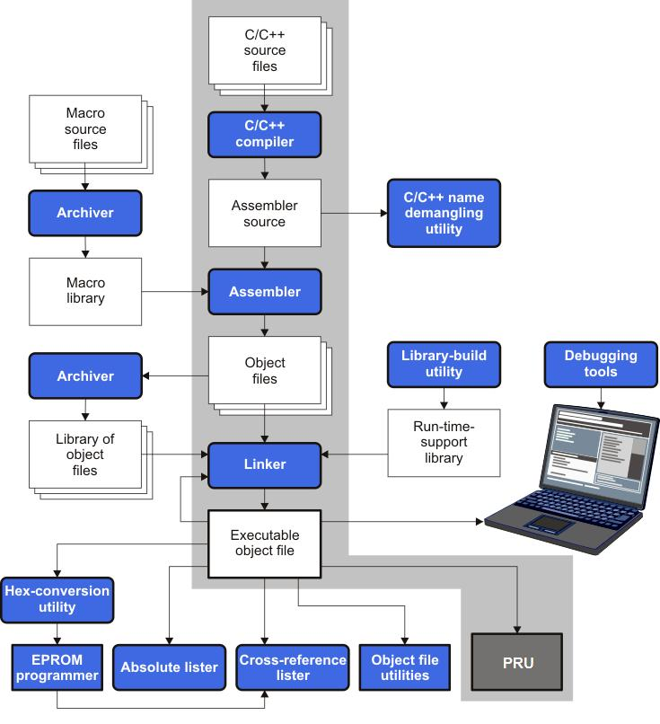
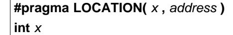
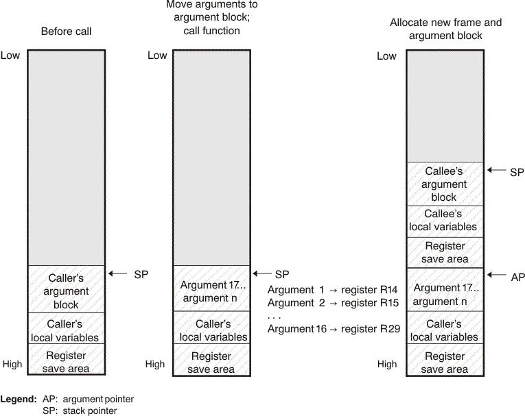
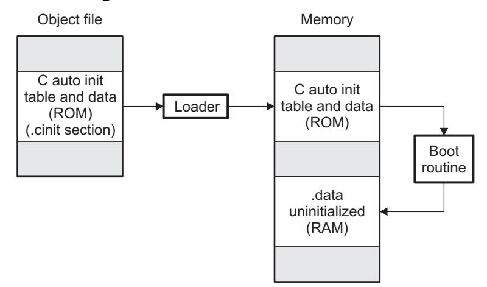
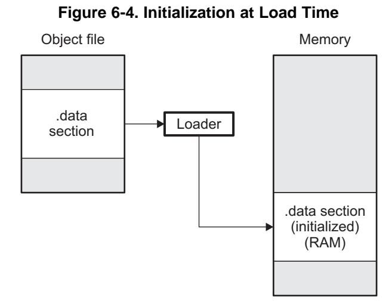
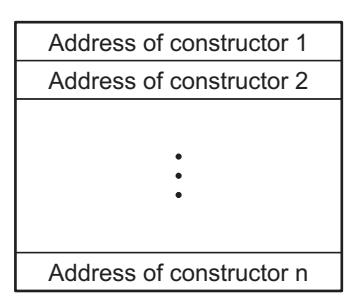

# Contents

- Preface ........ 8
- **1 Introduction to the Software Development Tools** ........ 11
  - 1.1 Software Development Tools Overview ........ 12
  - 1.2 Compiler Interface ........ 13
  - 1.3 ANSI/ISO Standard ........ 14
  - 1.4 Output Files ........ 14
  - 1.5 Utilities ........ 14
- **2 Using the C/C++ Compiler** ........ 15
  - 2.1 About the Compiler ........ 16
  - 2.2 Invoking the C/C++ Compiler ........ 16
  - 2.3 Changing the Compiler's Behavior with Options ........ 17
    - 2.3.1 Linker Options ........ 23
    - 2.3.2 Frequently Used Options ........ 25
    - 2.3.3 Miscellaneous Useful Options ........ 26
    - 2.3.4 Run-Time Model Options ........ 27
    - 2.3.5 Symbolic Debugging Options ........ 28
    - 2.3.6 Specifying Filenames ........ 28
    - 2.3.7 Changing How the Compiler Interprets Filenames ........ 29
    - 2.3.8 Changing How the Compiler Processes C Files ........ 29
    - 2.3.9 Changing How the Compiler Interprets and Names Extensions ........ 29
    - 2.3.10 Specifying Directories ........ 30
    - 2.3.11 Assembler Options ........ 30
  - 2.4 Controlling the Compiler Through Environment Variables ........ 31
    - 2.4.1 Setting Default Compiler Options (PRU_C_OPTION) ........ 31
    - 2.4.2 Naming One or More Alternate Directories (PRU_C_OPTION) ........ 31
  - 2.5 Controlling the Preprocessor ........ 32
    - 2.5.1 Predefined Macro Names ........ 32
    - 2.5.2 The Search Path for #include Files ........ 33
    - 2.5.3 Support for the #warning and #warn Directives ........ 34
    - 2.5.4 Generating a Preprocessed Listing File (--preproc_only Option) ........ 34
    - 2.5.5 Continuing Compilation After Preprocessing (--preproc_with_compile Option) ........ 34
    - 2.5.6 Generating a Preprocessed Listing File with Comments (--preproc_with_comment Option) ........ 35
    - 2.5.7 Generating Preprocessed Listing with Line-Control Details (--preproc_with_line Option) ........ 35
    - 2.5.8 Generating Preprocessed Output for a Make Utility (--preproc_dependency Option) ........ 35
    - 2.5.9 Generating a List of Files Included with #include (--preproc_includes Option) ........ 35
    - 2.5.10 Generating a List of Macros in a File (--preproc_macros Option) ........ 35
  - 2.6 Passing Arguments to main() ........ 35
  - 2.7 Understanding Diagnostic Messages ........ 36
    - 2.7.1 Controlling Diagnostic Messages ........ 37
    - 2.7.2 How You Can Use Diagnostic Suppression Options ........ 38
  - 2.8 Other Messages ........ 39
  - 2.9 Generating Cross-Reference Listing Information (--gen_cross_reference Option) ........ 39
  - 2.10 Generating a Raw Listing File (--gen_preprocessor_listing Option) ........ 39
  - 2.11 Using Inline Function Expansion ........ 41
    - 2.11.1 Inlining Intrinsic Operators ........ 42
    - 2.11.2 Inlining Restrictions ........ 42
  - 2.12 Using Interlist ........ 43
  - 2.13 Enabling Entry Hook and Exit Hook Functions ........ 44
- **3 Optimizing Your Code** ........ 45
  - 3.1 Invoking Optimization ........ 46
  - 3.2 Controlling Code Size Versus Speed ........ 47
  - 3.3 Performing File-Level Optimization (--opt_level=3 option) ........ 47
    - 3.3.1 Creating an Optimization Information File (--gen_opt_info Option) ........ 47
  - 3.4 Program-Level Optimization (--program_level_compile and --opt_level=3 options) ........ 48
    - 3.4.1 Controlling Program-Level Optimization (--call_assumptions Option) ........ 49
    - 3.4.2 Optimization Considerations When Mixing C/C++ and Assembly ........ 50
  - 3.5 Automatic Inline Expansion (--auto_inline Option) ........ 51
  - 3.6 Link-Time Optimization (--opt_level=4 Option) ........ 52
    - 3.6.1 Option Handling ........ 52
    - 3.6.2 Incompatible Types ........ 52
  - 3.7 Accessing Aliased Variables in Optimized Code ........ 53
  - 3.8 Use Caution With asm Statements in Optimized Code ........ 53
  - 3.9 Using the Interlist Feature With Optimization ........ 53
  - 3.10 Debugging and Profiling Optimized Code ........ 54
  - 3.11 What Kind of Optimization Is Being Performed? ........ 54
    - 3.11.1 Cost-Based Register Allocation ........ 55
    - 3.11.2 Alias Disambiguation ........ 55
    - 3.11.3 Branch Optimizations and Control-Flow Simplification ........ 55
    - 3.11.4 Data Flow Optimizations ........ 55
    - 3.11.5 Expression Simplification ........ 56
    - 3.11.6 Inline Expansion of Functions ........ 56
    - 3.11.7 Function Symbol Aliasing ........ 56
    - 3.11.8 Induction Variables and Strength Reduction ........ 56
    - 3.11.9 Loop-Invariant Code Motion ........ 56
    - 3.11.10 Loop Rotation ........ 56
    - 3.11.11 Instruction Scheduling ........ 56
    - 3.11.12 Tail Merging ........ 57
    - 3.11.13 Autoincrement Addressing ........ 57
    - 3.11.14 Epilog Inlining ........ 57
    - 3.11.15 Integer Division With Constant Divisor ........ 57
- **4 Linking C/C++ Code** ........ 58
  - 4.1 Invoking the Linker Through the Compiler (-z Option) ........ 59
    - 4.1.1 Invoking the Linker Separately ........ 59
    - 4.1.2 Invoking the Linker as Part of the Compile Step ........ 60
    - 4.1.3 Disabling the Linker (--compile_only Compiler Option) ........ 60
  - 4.2 Linker Code Optimizations ........ 61
    - 4.2.1 Generating Aggregate Data Subsections (--gen_data_subsections Compiler Option) ........ 61
  - 4.3 Controlling the Linking Process ........ 61
    - 4.3.1 Including the Run-Time-Support Library ........ 61
    - 4.3.2 Run-Time Initialization ........ 62
    - 4.3.3 Global Object Constructors ........ 63
    - 4.3.4 Specifying the Type of Global Variable Initialization ........ 63
    - 4.3.5 Specifying Where to Allocate Sections in Memory ........ 64
    - 4.3.6 A Sample Linker Command File ........ 64
- **5 C/C++ Language Implementation** ........ 66
  - 5.1 Characteristics of PRU C ........ 67
    - 5.1.1 Implementation-Defined Behavior ........ 67
  - 5.2 Characteristics of PRU C++ ........ 71
  - 5.3 Using MISRA C 2004 ........ 72
  - 5.4 Data Types ........ 73
    - 5.4.1 Size of Enum Types ........ 74
  - 5.5 Keywords ........ 74
    - 5.5.1 The const Keyword ........ 74
    - 5.5.2 The near and far Keywords ........ 75
    - 5.5.3 The volatile Keyword ........ 75
  - 5.6 C++ Exception Handling ........ 76
  - 5.7 Register Variables and Parameters ........ 77
    - 5.7.1 Local Register Variables and Parameters ........ 77
    - 5.7.2 Global Register Variables ........ 77
  - 5.8 The __asm Statement ........ 78
  - 5.9 Pragma Directives ........ 79
    - 5.9.1 The CALLS Pragma ........ 80
    - 5.9.2 The CHECK_MISRA Pragma ........ 80
    - 5.9.3 The CODE_SECTION Pragma ........ 81
    - 5.9.4 The DATA_ALIGN Pragma ........ 81
    - 5.9.5 The DATA_SECTION Pragma ........ 82
    - 5.9.6 The Diagnostic Message Pragmas ........ 82
    - 5.9.7 The FORCEINLINE Pragma ........ 83
    - 5.9.8 The FORCEINLINE_RECURSIVE Pragma ........ 83
    - 5.9.9 The FUNC_ALWAYS_INLINE Pragma ........ 84
    - 5.9.10 The FUNC_CANNOT_INLINE Pragma ........ 84
    - 5.9.11 The FUNC_EXT_CALLED Pragma ........ 85
    - 5.9.12 The FUNCTION_OPTIONS Pragma ........ 85
    - 5.9.13 The LOCATION Pragma ........ 85
    - 5.9.14 The MUST_ITERATE Pragma ........ 86
    - 5.9.15 The NOINIT and PERSISTENT Pragmas ........ 87
    - 5.9.16 The NOINLINE Pragma ........ 88
    - 5.9.17 The NO_HOOKS Pragma ........ 89
    - 5.9.18 The RESET_MISRA Pragma ........ 89
    - 5.9.19 The RETAIN Pragma ........ 89
    - 5.9.20 The SET_CODE_SECTION and SET_DATA_SECTION Pragmas ........ 90
    - 5.9.21 The UNROLL Pragma ........ 91
    - 5.9.22 The WEAK Pragma ........ 91
  - 5.10 The _Pragma Operator ........ 92
  - 5.11 PRU Instruction Intrinsics ........ 93
  - 5.12 Object File Symbol Naming Conventions (Linknames) ........ 94
  - 5.13 Changing the ANSI/ISO C/C++ Language Mode ........ 95
    - 5.13.1 C99 Support (--c99) ........ 95
    - 5.13.2 Strict ANSI Mode and Relaxed ANSI Mode (--strict_ansi and --relaxed_ansi) ........ 97
  - 5.14 GNU Language Extensions ........ 98
    - 5.14.1 Extensions ........ 98
    - 5.14.2 Function Attributes ........ 99
    - 5.14.3 Variable Attributes ........ 100
    - 5.14.4 Type Attributes ........ 100
    - 5.14.5 Built-In Functions ........ 102
  - 5.15 Compiler Limits ........ 102
- **6 Run-Time Environment** ........ 103
  - 6.1 Memory Model ........ 104
    - 6.1.1 Sections ........ 104
    - 6.1.2 C/C++ System Stack ........ 105
    - 6.1.3 Dynamic Memory Allocation ........ 106
  - 6.2 Object Representation ........ 107
    - 6.2.1 Data Type Storage ........ 107
    - 6.2.2 Bit Fields ........ 108
    - 6.2.3 Character String Constants ........ 109
  - 6.3 Register Conventions ........ 110
  - 6.4 Function Structure and Calling Conventions ........ 111
    - 6.4.1 How a Function Makes a Call ........ 112
    - 6.4.2 How a Called Function Responds ........ 114
    - 6.4.3 Accessing Arguments and Local Variables ........ 114
  - 6.5 Accessing Linker Symbols in C and C++ ........ 115
  - 6.6 Interfacing C and C++ With Assembly Language ........ 115
    - 6.6.1 Using Assembly Language Modules With C/C++ Code ........ 115
    - 6.6.2 Accessing Assembly Language Functions From C/C++ ........ 116
    - 6.6.3 Accessing Assembly Language Variables From C/C++ ........ 116
    - 6.6.4 Sharing C/C++ Header Files With Assembly Source ........ 118
    - 6.6.5 Using Inline Assembly Language ........ 118
    - 6.6.6 Modifying Compiler Output ........ 118
  - 6.7 System Initialization ........ 118
    - 6.7.1 Run-Time Stack ........ 119
    - 6.7.2 Automatic Initialization of Variables ........ 119
- **7 Using Run-Time-Support Functions and Building Libraries** ........ 124
  - 7.1 C and C++ Run-Time Support Libraries ........ 125
    - 7.1.1 Linking Code With the Object Library ........ 125
    - 7.1.2 Header Files ........ 125
    - 7.1.3 Modifying a Library Function ........ 125
    - 7.1.4 Support for String Handling ........ 126
    - 7.1.5 Minimal Support for Internationalization ........ 126
    - 7.1.6 Allowable Number of Open Files ........ 126
    - 7.1.7 Library Naming Conventions ........ 126
  - 7.2 The C I/O Functions ........ 127
    - 7.2.1 High-Level I/O Functions ........ 128
    - 7.2.2 Overview of Low-Level I/O Implementation ........ 129
    - 7.2.3 Device-Driver Level I/O Functions ........ 132
    - 7.2.4 Adding a User-Defined Device Driver for C I/O ........ 136
    - 7.2.5 The device Prefix ........ 137
  - 7.3 Handling Reentrancy (_register_lock() and _register_unlock() Functions) ........ 139
  - 7.4 Library-Build Process ........ 140
    - 7.4.1 Required Non-Texas Instruments Software ........ 140
    - 7.4.2 Using the Library-Build Process ........ 140
    - 7.4.3 Extending mklib ........ 143
- **8 C++ Name Demangler** ........ 144
  - 8.1 Invoking the C++ Name Demangler ........ 145
  - 8.2 C++ Name Demangler Options ........ 145
  - 8.3 Sample Usage of the C++ Name Demangler ........ 145
- **A Glossary** ........ 147
  - A.1 Terminology ........ 147
- **B Revision History** ........ 152
  - B.1 Recent Revisions ........ 152

# List of Figures

- Figure 1-1. PRU Software Development Flow ........ 12
- Figure 6-1. Bit-Field Packing in Big-Endian and Little-Endian Formats ........ 109
- Figure 6-2. Use of the Stack During a Function Call ........ 112
- Figure 6-3. Autoinitialization at Run Time ........ 120
- Figure 6-4. Initialization at Load Time ........ 122
- Figure 6-5. Constructor Table ........ 123

# List of Tables

- Table 2-1. Processor Options ........ 17
- Table 2-2. Optimization Options ........ 17
- Table 2-3. Advanced Optimization Options ........ 18
- Table 2-4. Debug Options ........ 18
- Table 2-5. Include Options ........ 18
- Table 2-6. Control Options ........ 18
- Table 2-7. Language Options ........ 19
- Table 2-8. Parser Preprocessing Options ........ 19
- Table 2-9. Predefined Symbols Options ........ 19
- Table 2-10. Diagnostic Message Options ........ 19
- Table 2-11. Run-Time Model Options ........ 20
- Table 2-12. Entry/Exit Hook Options ........ 20
- Table 2-13. Assembler Options ........ 21
- Table 2-14. File Type Specifier Options ........ 21
- Table 2-15. Directory Specifier Options ........ 21
- Table 2-16. Default File Extensions Options ........ 21
- Table 2-17. Command Files Options ........ 22
- Table 2-18. MISRA-C 2004 Options ........ 22
- Table 2-19. Linker Basic Options ........ 23
- Table 2-20. File Search Path Options ........ 23
- Table 2-21. Command File Preprocessing Options ........ 23
- Table 2-22. Diagnostic Message Options (Linker) ........ 23
- Table 2-23. Linker Output Options ........ 24
- Table 2-24. Symbol Management Options ........ 24
- Table 2-25. Run-Time Environment Options ........ 24
- Table 2-26. Miscellaneous Options ........ 25
- Table 2-27. Predefined PRU Macro Names ........ 32
- Table 2-28. Raw Listing File Identifiers ........ 40
- Table 2-29. Raw Listing File Diagnostic Identifiers ........ 40
- Table 3-1. Interaction Between Debugging and Optimization Options ........ 47
- Table 3-2. Options That You Can Use With --opt_level=3 ........ 47
- Table 3-3. Selecting a Level for the --gen_opt_info Option ........ 48
- Table 3-4. Selecting a Level for the --call_assumptions Option ........ 49
- Table 3-5. Special Considerations When Using the --call_assumptions Option ........ 49
- Table 3-6. Interaction Between Debugging and Optimization Options ........ 54
- Table 4-1. Initialized Sections Created by the Compiler ........ 64
- Table 4-2. Uninitialized Sections Created by the Compiler ........ 64
- Table 5-1. PRU C/C++ Data Types ........ 73
- Table 5-2. Enumerator Types ........ 73
- Table 5-3. PRU Compiler Intrinsics for Register Transfers ........ 93
- Table 5-4. Additional PRU Compiler Intrinsics ........ 94
- Table 5-5. GCC Language Extensions ........ 98
- Table 6-1. Summary of Sections and Memory Placement ........ 105
- Table 6-2. Data Representation in Registers and Memory ........ 107
- Table 6-3. How Register Types Are Affected by the Conventions ........ 110
- Table 6-4. Register Usage ........ 110
- Table 7-1. The mklib Program Options ........ 142
- Table B-1. Revision History ........ 152

# Read This First

# About This Manual

The *PRU Optimizing C/C++ Compiler User's Guide* explains how to use the following Texas Instruments Code Generation compiler tools:

- Compiler
- Library build utility
- C++ name demangler

The TI compiler accepts C and C++ code conforming to the International Organization for Standardization (ISO) standards for these languages. The compiler supports both the 1989 and 1999 versions of the C language and the 2003 version of the C++ language.

This user's guide discusses the characteristics of the TI C/C++ compiler. It assumes that you already know how to write C/C++ programs. *The C Programming Language* (second edition), by Brian W. Kernighan and Dennis M. Ritchie, describes C based on the ISO C standard. You can use the Kernighan and Ritchie (hereafter referred to as K&R) book as a supplement to this manual. References to K&R C (as opposed to ISO C) in this manual refer to the C language as defined in the first edition of Kernighan and Ritchie's *The C Programming Language*.

# Notational Conventions

This document uses the following conventions:

• Program listings, program examples, and interactive displays are shown in a special typeface. Interactive displays use a bold version of the special typeface to distinguish commands that you enter from items that the system displays (such as prompts, command output, error messages, etc.).

Here is a sample of C code:

```
#include <stdio.h>
main()
{ printf("Hello World\n");
}
```

- In syntax descriptions, instructions, commands, and directives are in a **bold typeface** and parameters are in an *italic typeface*. Portions of a syntax that are in bold should be entered as shown; portions of a syntax that are in italics describe the type of information that should be entered.
- Square brackets ( [ and ] ) identify an optional parameter. If you use an optional parameter, you specify the information within the brackets. Unless the square brackets are in the **bold typeface**, do not enter the brackets themselves. The following is an example of a command that has an optional parameter:

```
clpru [options] [filenames] [--run_linker [link_options] [object files]]
```

• Braces ( { and } ) indicate that you must choose one of the parameters within the braces; you do not enter the braces themselves. This is an example of a command with braces that are not included in the actual syntax but indicate that you must specify either the --rom\_model or --ram\_model option:

```
clpru --run_linker {--rom_model | --ram_model} filenames [--output_file= name.out]
      --library= libraryname
```

• In assembler syntax statements, the leftmost column is reserved for the first character of a label or symbol. If the label or symbol is optional, it is usually not shown. If a label or symbol is a required parameter, it is shown starting against the left margin of the box, as in the example below. No instruction, command, directive, or parameter, other than a symbol or label, can begin in the leftmost column.

*symbol* **.usect** "*section name*", *size in bytes*[, *alignment*]

- Some directives can have a varying number of parameters. For example, the .byte directive. This syntax is shown as [, ..., *parameter*].
- The PRU 16-bit instruction set is referred to as 16-BIS.
- The PRU 32-bit instruction set is referred to as 32-BIS.

# Related Documentation

You can use the following books to supplement this user's guide:

**ANSI X3.159-1989, Programming Language - C (Alternate version of the 1989 C Standard)**, American National Standards Institute

**ISO/IEC 9899:1989, International Standard - Programming Languages - C (The 1989 C Standard)**, International Organization for Standardization

**ISO/IEC 9899:1999, International Standard - Programming Languages - C (The 1999 C Standard)**, International Organization for Standardization

**ISO/IEC 14882-2003, International Standard - Programming Languages - C++ (The 2003 C++ Standard)**, International Organization for Standardization

**The C Programming Language (second edition)**, by Brian W. Kernighan and Dennis M. Ritchie, published by Prentice-Hall, Englewood Cliffs, New Jersey, 1988

**The Annotated C++ Reference Manual**, Margaret A. Ellis and Bjarne Stroustrup, published by Addison-Wesley Publishing Company, Reading, Massachusetts, 1990

**C: A Reference Manual (fourth edition)**, by Samuel P. Harbison, and Guy L. Steele Jr., published by Prentice Hall, Englewood Cliffs, New Jersey

**Programming Embedded Systems in C and C++**, by Michael Barr, Andy Oram (Editor), published by O'Reilly & Associates; ISBN: 1565923545, February 1999

**Programming in C**, Steve G. Kochan, Hayden Book Company

**The C++ Programming Language (second edition)**, Bjarne Stroustrup, published by Addison-Wesley Publishing Company, Reading, Massachusetts, 1990

**Tool Interface Standards (TIS) DWARF Debugging Information Format Specification Version 2.0**, TIS Committee, 1995

**DWARF Debugging Information Format Version 3**, DWARF Debugging Information Format Workgroup, Free Standards Group, 2005 [\(http://dwarfstd.org](http://dwarfstd.org))

**DWARF Debugging Information Format Version 4**, DWARF Debugging Information Format Workgroup, Free Standards Group, 2010 [\(http://dwarfstd.org](http://dwarfstd.org))

**System V ABI specification** ([http://www.sco.com/developers/gabi/\)](http://www.sco.com/developers/gabi/)

# Related Documentation From Texas Instruments

See the following resources for further information about the TI Code Generation Tools:

- Texas Instruments Wiki: [Compiler](http://processors.wiki.ti.com/index.php/Category:Compiler) topics
- Texas Instruments E2E Community: [Compiler](http://e2e.ti.com/support/development_tools/compiler/f/343) forum

You can use the following documents to supplement this user's guide:

- **[SPRUHV6](http://www.ti.com/lit/pdf/spruhv6) —** *PRU Assembly Language Tools User's Guide.* Describes the assembly language tools (assembler, linker, and other tools used to develop assembly language code), assembler directives, macros, common object file format, and symbolic debugging directives for PRU devices.
- **PRU-ICSS on Texas [Instruments](http://processors.wiki.ti.com/index.php/PRU-ICSS) Wiki —**Serves as a hub for the broad market PRU subsystem collateral and related resources, including software user guides, application notes, training modules, and FAQs,
- **[SPRAAB5](http://www.ti.com/lit/pdf/spraab5) —***The Impact of DWARF on TI Object Files.* Describes the Texas Instruments extensions to the DWARF specification.

# Trademarks

Code Composer Studio is a trademark of Texas Instruments. All other trademarks are the property of their respective owners.

# Introduction to the Software Development Tools

Programmable Real-Time Units (PRU) are 32-bit RISC cores. The instruction set is simple and execution times are deterministic. The programmable PRUs provide flexibility in implementing fast real-time responses, specialized data handling operations, custom peripheral interfaces, and in offloading tasks from the other processor cores of the system-on-chip (SoC). PRUs are part of the Programmable Real-Time Unit Subsystem and Industrial Communication Subsystem (PRU-ICSS), which includes two PRU cores, an interrupt controller, local data and instruction memories, internal peripheral modules, and interfaces to capture and manipulate system-wide events and pins.

The Programmable Real-Time Unit (PRU) is supported by a set of software development tools, which includes an optimizing C/C++ compiler, an assembler, a linker, and assorted utilities.

This chapter provides an overview of these tools and introduces the features of the optimizing C/C++ compiler. The assembler and linker are discussed in detail in the *PRU Assembly Language Tools User's Guide*.

The PRU is optimized for performing embedded tasks that require manipulation of packed memory mapped data structures, handling of system events that have tight real-time constraints and interfacing with systems external to the SoC. The PRU is both very small and very efficient at handling such tasks. For more information about PRU, see the Texas [Instruments](http://processors.wiki.ti.com/index.php/PRU-ICSS) Wiki.

**Topic** ........................................................................................................................... **Page**

|                    | 12                                  |
|--------------------|-------------------------------------|
| Compiler Interface | 13                                  |
| ANSI/ISO Standard  | 14                                  |
| Output Files       | 14                                  |
| Utilities          | 14                                  |
|                    | Software Development Tools Overview |

## 1.1 Software Development Tools Overview

Figure 1-1 illustrates the software development flow. The shaded portion of the figure highlights the most common path of software development for C language programs. The other portions are peripheral functions that enhance the development process.

**Figure 1-1. PRU Software Development Flow**



The following list describes the tools that are shown in Figure 1-1:

- The **compiler** accepts C/C++ source code and produces PRU assembly language source code. See Chapter 2.
- The **assembler** translates assembly language source files into machine language relocatable object files. See the *PRU Assembly Language Tools User's Guide*.
- The **linker** combines relocatable object files into a single absolute executable object file. As it creates the executable file, it performs relocation and resolves external references. The linker accepts relocatable object files and object libraries as input. See Chapter 4 for an overview of the linker. See the *PRU Assembly Language Tools User's Guide* for details.
- The **archiver** allows you to collect a group of files into a single archive file, called a *library*. The archiver allows you to modify such libraries by deleting, replacing, extracting, or adding members. One of the most useful applications of the archiver is building a library of object files. See the *PRU Assembly Language Tools User's Guide*.
- The **run-time-support libraries** contain the standard ISO C and C++ library functions, compiler-utility functions, floating-point arithmetic functions, and C I/O functions that are supported by the compiler. See Chapter 7.
  - The **library-build utility** automatically builds the run-time-support library if compiler and linker options require a custom version of the library. See Section 7.4. Source code for the standard run-time-support library functions for C and C++ is provided in the lib\src subdirectory of the directory where the compiler is installed.
- The **hex conversion utility** converts an object file into other object formats. You can download the converted file to an EPROM programmer. See the *PRU Assembly Language Tools User's Guide*.
- The **absolute lister** accepts linked object files as input and creates .abs files as output. You can assemble these .abs files to produce a listing that contains absolute, rather than relative, addresses. Without the absolute lister, producing such a listing would be tedious and would require many manual operations. See the *PRU Assembly Language Tools User's Guide*.
- The **cross-reference lister** uses object files to produce a cross-reference listing showing symbols, their definitions, and their references in the linked source files. See the *PRU Assembly Language Tools User's Guide*.
- The **C++ name demangler** is a debugging aid that converts names mangled by the compiler back to their original names as declared in the C++ source code. As shown in Figure 1-1, you can use the C++ name demangler on the assembly file that is output by the compiler; you can also use this utility on the assembler listing file and the linker map file. See Chapter 8.
- The **disassembler** decodes object files to show the assembly instructions that they represent. See the *PRU Assembly Language Tools User's Guide*.
- The main product of this development process is an executable object file that can be executed in a **PRU** device.

## 1.2 Compiler Interface

The compiler is a command-line program named clpru . This program can compile, optimize, assemble, and link programs in a single step. Within Code Composer Studio™, the compiler is run automatically to perform the steps needed to build a project.

For more information about compiling a program, see Section 2.1

The compiler has straightforward calling conventions, so you can write assembly and C functions that call each other. For more information about calling conventions, see Chapter 6.

## 1.3 ANSI/ISO Standard

The compiler supports both the 1989 and 1999 versions of the C language and the 2003 version of the C++ language. The C and C++ language features in the compiler are implemented in conformance with the following ISO standards:

### • **ISO-standard C**

The C compiler supports the 1989 and 1999 versions of the C language.

- **C89.** Compiling with the --c89 option causes the compiler to conform to the ISO/IEC 9899:1990 C standard, which was previously ratified as ANSI X3.159-1989. The names "C89" and "C90" refer to the same programming language. "C89" is used in this document.
- **C99.** Compiling with the --c99 option causes the compiler to conform to the ISO/IEC 9899:1999 C standard. This standard supports several features not part of C89, such as inline functions, new data types, and one-line comments beginning with //.

The C language is also described in the second edition of Kernighan and Ritchie's *The C Programming Language* (K&R).

### • **ISO-standard C++**

The compiler uses the C++03 version of the C++ standard. See the C++ Standard ISO/IEC 14882:2003. The language is also described in Ellis and Stroustrup's *The Annotated C++ Reference Manual* (ARM), but that is not the standard. For a description of *unsupported* C++ features, see Section 5.2.

# • **ISO-standard run-time support**

The compiler tools come with an extensive run-time library. Library functions conform to the ISO C/C++ library standard unless otherwise stated. The library includes functions for standard input and output, string manipulation, dynamic memory allocation, data conversion, timekeeping, trigonometry, and exponential and hyperbolic functions. Functions for signal handling are not included, because these are target-system specific. For more information, see Chapter 7.

See Section 5.13 for command line options to select the C or C++ standard your code uses.

## 1.4 Output Files

The following type of output file is created by the compiler:

### • **ELF object files**

Executable and Linking Format (ELF) enables supporting modern language features like early template instantiation and exporting inline functions. ELF is part of the System V [Application](http://www.sco.com/developers/gabi/) Binary Interface [\(ABI\).](http://www.sco.com/developers/gabi/)

## 1.5 Utilities

These features are compiler utilities:

## • **Library-build utility**

The library-build utility lets you custom-build object libraries from source for any combination of runtime models. For more information, see Section 7.4.

### • **C++ name demangler**

The C++ name demangler (dempru ) is a debugging aid that translates each mangled name it detects in compiler-generated assembly code, disassembly output, or compiler diagnostic messages to its original name found in the C++ source code. For more information, see Chapter 8.

### • **Hex conversion utility**

For stand-alone embedded applications, the compiler has the ability to place all code and initialization data into ROM, allowing C/C++ code to run from reset. The ELF files output by the compiler can be converted to EPROM programmer data files by using the hex conversion utility, as described in the *PRU Assembly Language Tools User's Guide*.

# Using the C/C++ Compiler

The compiler translates your source program into machine language object code that the PRU can execute. Source code must be compiled, assembled, and linked to create an executable object file. All of these steps are executed at once by using the compiler.

**Topic** ........................................................................................................................... **Page**

| 2.1  | About the Compiler                                                          | 16 |
|------|-----------------------------------------------------------------------------|----|
| 2.2  | Invoking the C/C++ Compiler                                                 | 16 |
| 2.3  | Changing the Compiler's Behavior with Options                               | 17 |
| 2.4  | Controlling the Compiler Through Environment Variables                      | 31 |
| 2.5  | Controlling the Preprocessor                                                | 32 |
| 2.6  | Passing Arguments to main()                                                 | 35 |
| 2.7  | Understanding Diagnostic Messages                                           | 36 |
| 2.8  | Other Messages                                                              | 39 |
| 2.9  | Generating Cross-Reference Listing Information (--gen_cross_reference Option) | 39 |
| 2.10 | Generating a Raw Listing File (--gen_preprocessor_listing Option)             | 39 |
| 2.11 | Using Inline Function Expansion                                             | 41 |
| 2.12 | Using Interlist                                                             | 43 |
| 2.13 | Enabling Entry Hook and Exit Hook Functions                                 | 44 |

## 2.1 About the Compiler

The compiler lets you compile, optimize, assemble, and optionally link in one step. The compiler performs the following steps on one or more source modules:

• The **compiler** accepts C/C++ source code and assembly code. It produces object code. You can compile C, C++, and assembly files in a single command. The compiler uses the filename extensions to distinguish between different file types. See Section 2.3.9 for more information.

• The **linker** combines object files to create object file. The link step is optional, so you can compile and assemble many modules independently and link them later. See Chapter 4 for information about linking the files.

### Invoking the Linker

**NOTE:** By default, the compiler does not invoke the linker. You can invoke the linker by using the --run\_linker (-z) compiler option. See Section 4.1.1 for details.

For a complete description of the assembler and the linker, see the *PRU Assembly Language Tools User's Guide*.

## 2.2 Invoking the C/C++ Compiler

To invoke the compiler, enter:

**clpru** [*options*] [*filenames*] [**--run\_linker** [*link\_options*] *object files*]]

**clpru** Command that runs the compiler and the assembler.

*options* Options that affect the way the compiler processes input files. The options are listed

in Table 2-6 through Table 2-26.

*filenames* One or more C/C++ source files and assembly language source files.

**--run\_linker** (**-z**) Option that invokes the linker. The --run\_linker option's short form is -z. See

Chapter 4 for more information.

*link\_options* Options that control the linking process.

*object files* Names of the object files for the linking process.

The arguments to the compiler are of three types:

- Compiler options
- Link options
- Filenames

The --run\_linker option indicates linking is to be performed. If the --run\_linker option is used, any compiler options must precede the --run\_linker option, and all link options must follow the --run\_linker option.

Source code filenames must be placed before the --run\_linker option. Additional object file filenames can be placed after the --run\_linker option.

For example, if you want to compile two files named symtab.c and file.c, assemble a third file named seek.asm, and link to create an executable program called myprogram.out, you will enter:

```
clpru symtab.c file.c seek.asm --run_linker --library=lnk.cmd
       --output_file=myprogram.out
```

## 2.3 Changing the Compiler's Behavior with Options

Options control the operation of the compiler. This section provides a description of option conventions and an option summary table. It also provides detailed descriptions of the most frequently used options, including options used for type-checking and assembling.

For a help screen summary of the options, enter **clpru** with no parameters on the command line.

The following apply to the compiler options:

- There are typically two ways of specifying a given option. The "long form" uses a two hyphen prefix and is usually a more descriptive name. The "short form" uses a single hyphen prefix and a combination of letters and numbers that are not always intuitive.
- Options are usually case sensitive.
- Individual options cannot be combined.
- An option with a parameter should be specified with an equal sign before the parameter to clearly associate the parameter with the option. For example, the option to undefine a constant can be expressed as --undefine=*name*. Likewise, the option to specify the maximum amount of optimization can be expressed as -O=3. You can also specify a parameter directly after certain options, for example -O3 is the same as -O=3. No space is allowed between the option and the optional parameter, so -O 3 is not accepted.
- Files and options except the --run\_linker option can occur in any order. The --run\_linker option must follow all compiler options and precede any linker options.

You can define default options for the compiler by using the PRU\_C\_OPTION environment variable. For a detailed description of the environment variable, see Section 2.4.1.

Table 2-6 through Table 2-26 summarize all options (including link options). Use the references in the tables for more complete descriptions of the options.

**Table 2-1. Processor Options**

| Option                                | Alias | Effect                                                        | Section       |
|---------------------------------------|-------|---------------------------------------------------------------|---------------|
| --silicon_version={ 0 \| 1 \| 2 \| 3 \| 4 } | -v    | Selects the silicon version. The default is --silicon_version=3. | Section 2.3.4 |

**Table 2-2. Optimization Options(1)**

| Option                   | Alias | Effect                                                                                                                                                                                                                                                                                                                                                         | Section                                     |
|--------------------------|-------|----------------------------------------------------------------------------------------------------------------------------------------------------------------------------------------------------------------------------------------------------------------------------------------------------------------------------------------------------------------|---------------------------------------------|
| --opt_level=off            |       | Disables all optimization.                                                                                                                                                                                                                                                                                                                                     | Section 3.1                                 |
| --opt_level=n              | -On   | Level 0 (-O0) optimizes register usage only.<br>Level 1 (-O1) uses Level 0 optimizations and optimizes locally.<br>Level 2 (-O2) uses Level 1 optimizations and optimizes globally<br>(default).<br>Level 3 (-O3) uses Level 2 optimizations and optimizes the file. ()<br>Level 4 (-O4) uses Level 3 optimizations and performs link-time<br>optimization. () | Section 3.1,<br>Section 3.3,<br>Section 3.6 |
| --opt_for_speed[=n]        | -mf   | Controls the tradeoff between size and speed (0-5 range). If this<br>option is specified without n, the default value is 4. If this option is<br>not specified, the default setting is 1.                                                                                                                                                                      | Section 3.2                                 |
| --fp_mode={relaxed\|strict} |       | Enables or disables relaxed floating-point mode.                                                                                                                                                                                                                                                                                                               | Section 2.3.3                               |
| --fp_reassoc={on\|off}      |       | Enables or disables the reassociation of floating-point arithmetic.                                                                                                                                                                                                                                                                                            | Section 2.3.3                               |
| --sat_reassoc={on\|off}     |       | Enables or disables the reassociation of saturating arithmetic.<br>Default is --sat_reassoc=off.                                                                                                                                                                                                                                                                  | Section 2.3.3                               |

<sup>(1)</sup> **Note:** Machine-specific options (see Table 2-11) can also affect optimization.

# Table 2-3. Advanced Optimization Options(1)

| Option                | Alias | Effect                                                                                                                                                                                                                                                                                                                                                                                                                                                                                                                                                                                                                                                                                                                                                                | Section       |
|-----------------------|-------|-----------------------------------------------------------------------------------------------------------------------------------------------------------------------------------------------------------------------------------------------------------------------------------------------------------------------------------------------------------------------------------------------------------------------------------------------------------------------------------------------------------------------------------------------------------------------------------------------------------------------------------------------------------------------------------------------------------------------------------------------------------------------|---------------|
| --auto_inline=[size]    | -oi   | Sets automatic inlining size (--opt_level=3 only). If size is not<br>specified, the default is 1.                                                                                                                                                                                                                                                                                                                                                                                                                                                                                                                                                                                                                                                                       | Section 3.5   |
| --call_assumptions=n    | -opn  | Level 0 (-op0) specifies that the module contains functions and<br>variables that are called or modified from outside the source code<br>provided to the compiler.<br>Level 1 (-op1) specifies that the module contains variables modified<br>from outside the source code provided to the compiler but does not<br>use functions called from outside the source code.<br>Level 2 (-op2) specifies that the module contains no functions or<br>variables that are called or modified from outside the source code<br>provided to the compiler (default).<br>Level 3 (-op3) specifies that the module contains functions that are<br>called from outside the source code provided to the compiler but<br>does not use variables modified from outside the source code. | Section 3.4.1 |
| --gen_opt_info=n        | -onn  | Level 0 (-on0) disables the optimization information file.<br>Level 1 (-on2) produces an optimization information file.<br>Level 2 (-on2) produces a verbose optimization information file.                                                                                                                                                                                                                                                                                                                                                                                                                                                                                                                                                                           | Section 3.3.1 |
| --optimizer_interlist   | -os   | Interlists optimizer comments with assembly statements.                                                                                                                                                                                                                                                                                                                                                                                                                                                                                                                                                                                                                                                                                                               | Section 3.9   |
| --program_level_compile | -pm   | Combines source files to perform program-level optimization.                                                                                                                                                                                                                                                                                                                                                                                                                                                                                                                                                                                                                                                                                                          | Section 3.4   |
| --aliased_variables     | -ma   | Assumes called functions create hidden aliases (rare).                                                                                                                                                                                                                                                                                                                                                                                                                                                                                                                                                                                                                                                                                                                | Section 3.7   |

<sup>(1)</sup> **Note:** Machine-specific options (see Table 2-11) can also affect optimization.

# Table 2-4. Debug Options

| Option         | Alias | Effect                                                                                                                                                                                                                                                                                                   | Section                       |
|----------------|-------|----------------------------------------------------------------------------------------------------------------------------------------------------------------------------------------------------------------------------------------------------------------------------------------------------------|-------------------------------|
| --symdebug:dwarf | -g    | Default behavior. Enables symbolic debugging. The generation of<br>debug information no longer impacts optimization. Therefore,<br>generating debug information is enabled by default. If you explicitly<br>use the -g option but do not specify an optimization level, no<br>optimization is performed. | Section 2.3.5<br>Section 3.10 |
| --symdebug:none  |       | Disables all symbolic debugging.                                                                                                                                                                                                                                                                         | Section 2.3.5<br>Section 3.10 |

### Table 2-5. Include Options

| Option                 | Alias | Effect                                                    | Section         |
|------------------------|-------|-----------------------------------------------------------|-----------------|
| --include_path=directory | -I    | Adds the specified directory to the #include search path. | Section 2.5.2.1 |
| --preinclude=filename    |       | Includes filename at the beginning of compilation.        | Section 2.3.3   |

### Table 2-6. Control Options

| Option         | Alias | Effect                                                                                                                              | Section       |
|----------------|-------|-------------------------------------------------------------------------------------------------------------------------------------|---------------|
| --compile_only   | -c    | Disables linking (negates --run_linker).                                                                                               | Section 4.1.3 |
| --help           | -h    | Prints (on the standard output device) a description of the options<br>understood by the compiler.                                  | Section 2.3.2 |
| --run_linker     | -z    | Causes the linker to be invoked from the compiler command line.                                                                     | Section 2.3.2 |
| --skip_assembler | -n    | Compiles C/C++ source file, producing an assembly language output<br>file. The assembler is not run and no object file is produced. | Section 2.3.2 |

### Table 2-7. Language Options

| Option | Alias | Effect | Section |
|--------|-------|--------|---------|
| --c89                                           |       | Processes C files according to the ISO C89 standard.                                                                                                                                                                                                                                                               | Section 5.13   |
| --c99                                           |       | Processes C files according to the ISO C99 standard.                                                                                                                                                                                                                                                               | Section 5.13   |
| --c++03                                         |       | Processes C++ files according to the ISO C++03 standard.                                                                                                                                                                                                                                                           | Section 5.13   |
| --cpp_default                                   | -fg   | Processes all source files with a C extension as C++ source files.                                                                                                                                                                                                                                                 | Section 2.3.7  |
| --exceptions                                    |       | Enables C++ exception handling.                                                                                                                                                                                                                                                                                    | Section 5.6    |
| --float_operations_allowed={none\|all\|32\|64} |       | Restricts the types of floating point operations allowed.                                                                                                                                                                                                                                                          | Section 2.3.3  |
| --gen_cross_reference                           | -px   | Generates a cross-reference listing file (.crl).                                                                                                                                                                                                                                                                   | Section 2.9    |
| ---gen_preprocessor_listing                      | -pl   | Generates a raw listing file (.rl).                                                                                                                                                                                                                                                                                | Section 2.10   |
| --pending_instantiations=#                      |       | Specify the number of template instantiations that may be in<br>progress at any given time. Use 0 to specify an unlimited number.                                                                                                                                                                                  | Section 2.3.4  |
| --plain_char={signed\|unsigned}                  | -mc   | Specifies how to treat plain chars, default is unsigned.                                                                                                                                                                                                                                                           | Section 2.3.4  |
| --relaxed_ansi                                  | -pr   | Enables relaxed mode; ignores strict ISO violations. This is on by<br>default. To disable this mode, use the --strict_ansi option.                                                                                                                                                                                 | Section 5.13.2 |
| --rtti                                          | -rtti | Enables C++ run-time type information (RTTI).                                                                                                                                                                                                                                                                      | –-             |
| --strict_ansi                                   | -ps   | Enables strict ANSI/ISO mode (for C/C++, not for K&R C). In this<br>mode, language extensions that conflict with ANSI/ISO C/C++ are<br>disabled. In strict ANSI/ISO mode, most ANSI/ISO violations are<br>reported as errors. Violations that are considered discretionary may<br>be reported as warnings instead. | Section 5.13.2 |

### Table 2-8. Parser Preprocessing Options

| Option                        | Alias                                                                                                                                                            | Effect                                                                                                                                                                             | Section        |
|-------------------------------|------------------------------------------------------------------------------------------------------------------------------------------------------------------|------------------------------------------------------------------------------------------------------------------------------------------------------------------------------------|----------------|
| --preproc_dependency[=filename] | -ppd | Performs preprocessing only, but instead of writing preprocessed<br>output, writes a list of dependency lines suitable for input to a<br>standard make utility.                    | Section 2.5.8  |
| --preproc_includes[=filename]   | -ppi | Performs preprocessing only, but instead of writing preprocessed<br>output, writes a list of files included with the #include directive.                                           | Section 2.5.9  |
| --preproc_macros[=filename]     | -ppm | Performs preprocessing only. Writes list of predefined and user<br>defined macros to a file with the same name as the input but with a<br>.pp extension.                           | Section 2.5.10 |
| --preproc_only                  | -ppo | Performs preprocessing only. Writes preprocessed output to a file<br>with the same name as the input but with a .pp extension.                                                     | Section 2.5.4  |
| --preproc_with_comment          | -ppc   | Performs preprocessing only. Writes preprocessed output, keeping<br>the comments, to a file with the same name as the input but with a<br>.pp extension. | Section 2.5.6  |
| --preproc_with_compile          | -ppa | Continues compilation after preprocessing with any of the -pp <x><br/>options that normally disable compilation.</x>                                                               | Section 2.5.5  |
| --preproc_with_line             | -ppl | Performs preprocessing only. Writes preprocessed output with line<br>control information (#line directives) to a file with the same name as<br>the input but with a .pp extension. | Section 2.5.7  |

### Table 2-9. Predefined Symbols Options

| Option            | Alias | Effect           | Section       |
|-------------------|-------|------------------|---------------|
| --define=name[=def] | -D    | Predefines name. | Section 2.3.2 |
| --undefine=name     | -U    | Undefines name.  | Section 2.3.2 |

### Table 2-10. Diagnostic Message Options

| Option            | Alias | Effect                                                    | Section       |
|-------------------|-------|-----------------------------------------------------------|---------------|
| --compiler_revision |       | Prints out the compiler release revision and exits.       |               |
| --diag_error=num    | -pdse | Categorizes the diagnostic identified by num as an error. | Section 2.7.1 |

# Table 2-10. Diagnostic Message Options (continued)

| Option                  | Alias    | Effect                                                                                                                                                                                                                                                                                                                                        | Section       |
|-------------------------|----------|-----------------------------------------------------------------------------------------------------------------------------------------------------------------------------------------------------------------------------------------------------------------------------------------------------------------------------------------------|---------------|
| --diag_remark=num         | -pdsr    | Categorizes the diagnostic identified by num as a remark.                                                                                                                                                                                                                                                                                     | Section 2.7.1 |
| --diag_suppress=num       | -pds     | Suppresses the diagnostic identified by num.                                                                                                                                                                                                                                                                                                  | Section 2.7.1 |
| --diag_warning=num        | -pdsw    | Categorizes the diagnostic identified by num as a warning.                                                                                                                                                                                                                                                                                    | Section 2.7.1 |
| --diag_wrap={on\|off}      |          | Wrap diagnostic messages (default is on). Note that this command<br>line option cannot be used within the Code Composer Studio IDE.                                                                                                                                                                                                           |               |
| --display_error_number    | -pden    | Displays a diagnostic's identifiers along with its text. Note that this<br>command-line option cannot be used within the Code Composer<br>Studio IDE.                                                                                                                                                                                         | Section 2.7.1 |
| --emit_warnings_as_errors | -pdew    | Treat warnings as errors.                                                                                                                                                                                                                                                                                                                     | Section 2.7.1 |
| --issue_remarks           | -pdr     | Issues remarks (non-serious warnings).                                                                                                                                                                                                                                                                                                        | Section 2.7.1 |
| --no_warnings             | -pdw     | Suppresses diagnostic warnings (errors are still issued).                                                                                                                                                                                                                                                                                     | Section 2.7.1 |
| --quiet                   | -q       | Suppresses progress messages (quiet).                                                                                                                                                                                                                                                                                                         |               |
| --section_sizes={on\|off}  |          | Generates section size information, including sizes for sections<br>containing executable code and constants, constant or initialized<br>data (global and static variables), and uninitialized data. (Default is<br>off if this option is not included on the command line. Default is on if<br>this option is used with no value specified.) | Section 2.7.1 |
| --set_error_limit=num     | -pdel    | Sets the error limit to num. The compiler abandons compiling after<br>this number of errors. (The default is 100.)                                                                                                                                                                                                                            | Section 2.7.1 |
| --super_quiet             | -qq      | Super quiet mode.                                                                                                                                                                                                                                                                                                                             |               |
| --tool_version            | -version | Displays version number for each tool.                                                                                                                                                                                                                                                                                                        |               |
| --verbose                 |          | Display banner and function progress information.                                                                                                                                                                                                                                                                                             |               |
| --verbose_diagnostics     | -pdv     | Provides verbose diagnostic messages that display the original<br>source with line-wrap. Note that this command-line option cannot be<br>used within the Code Composer Studio IDE.                                                                                                                                                            | Section 2.7.1 |
| --write_diagnostics_file  | -pdf     | Generates a diagnostic message information file. Compiler only<br>option. Note that this command-line option cannot be used within the<br>Code Composer Studio IDE.                                                                                                                                                                           | Section 2.7.1 |

### Table 2-11. Run-Time Model Options

| Option                                    | Alias | Effect                                                                                                                                                                                      | Section       |
|-------------------------------------------|-------|---------------------------------------------------------------------------------------------------------------------------------------------------------------------------------------------|---------------|
| --endian={ big \| little }                   |       | Specify the endianness of both code and data. If not specified,<br>compiler defaults to --endian=little.                                                                                       | Section 2.3.4 |
| --gen_data_subsections={on\|off}             |       | Place all aggregate data (arrays, structs, and unions) into<br>subsections. This gives the linker more control over removing<br>unused data during the final link step. The default is on.  | Section 4.2.1 |
| --hardware_mac={on\|off}                     |       | Enables use of the hardware MAC available on some PRU cores.<br>Defaults to --hardware_mac=off.                                                                                                | Section 2.3.4 |
| --mem_model:data={ near \| far }             |       | Specifies data access model. When not specified, compiler defaults<br>to --mem_model:data=near.                                                                                                | Section 5.5.2 |
| --printf_support={nofloat\|full\|minimal} |       | Enables support for smaller, limited versions of the printf function<br>family (sprintf, fprintf, etc.) and the scanf function family (sscanf,<br>fscanf, etc.) run-time-support functions. | Section 2.3.3 |

### Table 2-12. Entry/Exit Hook Options

| Option                             | Alias | Effect                                                            | Section      |
|------------------------------------|-------|-------------------------------------------------------------------|--------------|
| --entry_hook[=name]                  |       | Enables entry hooks.                                              | Section 2.13 |
| --entry_parm={none\|name\|address} |       | Specifies the parameters to the function to the --entry_hook option. | Section 2.13 |
| --exit_hook[=name]                   |       | Enables exit hooks.                                               | Section 2.13 |
| --exit_parm={none\|name\|address}      |       | Specifies the parameters to the function to the --exit_hook option.  | Section 2.13 |
| --remove_hooks_when_inlining         |       | Removes entry/exit hooks for auto-inlined functions.              | Section 2.13 |

### Table 2-13. Assembler Options

| Option                      | Alias | Effect                                                                                                                                 | Section                     |
|-----------------------------|-------|----------------------------------------------------------------------------------------------------------------------------------------|-----------------------------|
| --keep_asm                    | -k    | Keeps the assembly language (.asm) file.                                                                                               | Section 2.3.11              |
| --asm_listing                 | -al   | Generates an assembly listing file.                                                                                                    | Section 2.3.11              |
| --c_src_interlist             | -ss   | Interlists C source and assembly statements.                                                                                           | Section 2.12<br>Section 3.9 |
| --src_interlist               | -s    | Interlists optimizer comments (if available) and assembly source<br>statements; otherwise interlists C and assembly source statements. | Section 2.3.2               |
| --absolute_listing            | -aa   | Enables absolute listing.                                                                                                              | Section 2.3.11              |
| --asm_define=name[=def]       | -ad   | Sets the name symbol.                                                                                                                  | Section 2.3.11              |
| --asm_dependency              | -apd  | Performs preprocessing; lists only assembly dependencies.                                                                              | Section 2.3.11              |
| --asm_includes                | -api  | Performs preprocessing; lists only included #include files.                                                                            | Section 2.3.11              |
| --asm_undefine=name           | -au   | Undefines the predefined constant name.                                                                                                | Section 2.3.11              |
| --asm_listing_cross_reference | -ax   | Generates the cross-reference file.                                                                                                    | Section 2.3.11              |
| --include_file=filename       | -ahi  | Includes the specified file for the assembly module.                                                                                   | Section 2.3.11              |

# Table 2-14. File Type Specifier Options

| Option            | Alias | Effect                                                                                                                                                              | Section       |
|-------------------|-------|---------------------------------------------------------------------------------------------------------------------------------------------------------------------|---------------|
| --asm_file=filename | -fa   | Identifies filename as an assembly source file regardless of its<br>extension. By default, the compiler and assembler treat .asm files as<br>assembly source files. | Section 2.3.7 |
| --c_file=filename   | -fc   | Identifies filename as a C source file regardless of its extension. By<br>default, the compiler treats .c files as C source files.                                  | Section 2.3.7 |
| --cpp_file=filename | -fp   | Identifies filename as a C++ file, regardless of its extension. By<br>default, the compiler treats .C, .cpp, .cc and .cxx files as a C++ files.                     | Section 2.3.7 |
| --obj_file=filename | -fo   | Identifies filename as an object code file regardless of its extension.<br>By default, the compiler and linker treat .obj files as object code files.               | Section 2.3.7 |

### Table 2-15. Directory Specifier Options

| Option                   | Alias | Effect                                                                                                                             | Section        |
|--------------------------|-------|------------------------------------------------------------------------------------------------------------------------------------|----------------|
| --abs_directory=directory  | -fb   | Specifies an absolute listing file directory. By default, the compiler<br>uses the .obj directory.                                 | Section 2.3.10 |
| --asm_directory=directory  | -fs   | Specifies an assembly file directory. By default, the compiler uses<br>the current directory.                                      | Section 2.3.10 |
| --list_directory=directory | -ff   | Specifies an assembly listing file and cross-reference listing file<br>directory By default, the compiler uses the .obj directory. | Section 2.3.10 |
| --obj_directory=directory  | -fr   | Specifies an object file directory. By default, the compiler uses the<br>current directory.                                        | Section 2.3.10 |
| --output_file=filename     | -fe   | Specifies a compilation output file name; can override<br>--obj_directory.                                                           | Section 2.3.10 |
| --pp_directory=dir         |       | Specifies a preprocessor file directory. By default, the compiler uses<br>the current directory.                                   | Section 2.3.10 |
| --temp_directory=directory | -ft   | Specifies a temporary file directory. By default, the compiler uses the<br>current directory.                                      | Section 2.3.10 |

### Table 2-16. Default File Extensions Options

| Option                         | Alias | Effect                                              | Section       |
|--------------------------------|-------|-----------------------------------------------------|---------------|
| --asm_extension=[.]extension     | -ea   | Sets a default extension for assembly source files. | Section 2.3.9 |
| --c_extension=[.]extension       | -ec   | Sets a default extension for C source files.        | Section 2.3.9 |
| --cpp_extension=[.]extension     | -ep   | Sets a default extension for C++ source files.      | Section 2.3.9 |
| --listing_extension=[.]extension | -es   | Sets a default extension for listing files.         | Section 2.3.9 |
| --obj_extension=[.]extension     | -eo   | Sets a default extension for object files.          | Section 2.3.9 |

### Table 2-17. Command Files Options

| Option            | Alias | Effect                                                                                                   | Section       |
|-------------------|-------|----------------------------------------------------------------------------------------------------------|---------------|
| --cmd_file=filename | -@    | Interprets contents of a file as an extension to the command line.<br>Multiple -@ instances can be used. | Section 2.3.2 |

### Table 2-18. MISRA-C 2004 Options

| Option                                                  | Alias | Effect                                                                   | Section       |
|---------------------------------------------------------|-------|--------------------------------------------------------------------------|---------------|
| --check_misra[={all\|required\|advisory\|none\|rulespec}] |       | Enables checking of the specified MISRA-C:2004 rules. Default is<br>all. | Section 2.3.3 |
| --misra_advisory={error\|warning\|remark\|suppress}      |       | Sets the diagnostic severity for advisory MISRA-C:2004 rules.            | Section 2.3.3 |
| --misra_required={error\|warning\|remark\|suppress}      |       | Sets the diagnostic severity for required MISRA-C:2004 rules.            | Section 2.3.3 |

### 2.3.1 Linker Options

The following tables list the linker options. See Chapter 4 of this document and the *PRU Assembly Language Tools User's Guide* for details on these options.

# Table 2-19. Linker Basic Options

| Option           | Alias     | Description                                                                                                                                             |
|------------------|-----------|---------------------------------------------------------------------------------------------------------------------------------------------------------|
| --run_linker       | -z        | Enables linking.                                                                                                                                        |
| --output_file=file | -o        | Names the executable output file. The default filename is a .out file.                                                                                  |
| --map_file=file    | -m        | Produces a map or listing of the input and output sections, including holes, and places<br>the listing in file.                                         |
| --stack_size=size  | [-]-stack | Sets C system stack size to size bytes and defines a global symbol that specifies the<br>stack size. Default = 256 bytes.                               |
| --heap_size=size   | [-]-heap  | Sets heap size (for the dynamic memory allocation in C) to size bytes and defines a<br>global symbol that specifies the heap size. Default = 256 bytes. |

### Table 2-20. File Search Path Options

| Option               | Alias     | Description                                                                                                                                                              |
|----------------------|-----------|--------------------------------------------------------------------------------------------------------------------------------------------------------------------------|
| --library=file         | -l        | Names an archive library or link command file as linker input.                                                                                                           |
| --search_path=pathname | -I        | Alters library-search algorithms to look in a directory named with pathname before<br>looking in the default location. This option must appear before the --library option. |
| --priority             | -priority | Satisfies unresolved references by the first library that contains a definition for that<br>symbol.                                                                      |
| --reread_libs          | -x        | Forces rereading of libraries, which resolves back references.                                                                                                           |
| --disable_auto_rts     |           | Disables the automatic selection of a run-time-support library. See Section 4.3.1.1.                                                                                     |

### Table 2-21. Command File Preprocessing Options

| Option            | Alias | Description                               |
|-------------------|-------|-------------------------------------------|
| --define=name=value |       | Predefines name as a preprocessor macro.  |
| --undefine=name     |       | Removes the preprocessor macro name.      |
| --disable_pp        |       | Disables preprocessing for command files. |

#### Table 2-22. Diagnostic Message Options

| Option                  | Alias | Description                                                                                                      |
|-------------------------|-------|------------------------------------------------------------------------------------------------------------------|
| --diag_error=num          |       | Categorizes the diagnostic identified by num as an error.                                                        |
| --diag_remark=num         |       | Categorizes the diagnostic identified by num as a remark.                                                        |
| --diag_suppress=num       |       | Suppresses the diagnostic identified by num.                                                                     |
| --diag_warning=num        |       | Categorizes the diagnostic identified by num as a warning.                                                       |
| --display_error_number    |       | Displays a diagnostic's identifiers along with its text.                                                         |
| --emit_warnings_as_errors | -pdew | Treat warnings as errors.                                                                                        |
| --issue_remarks           |       | Issues remarks (non-serious warnings).                                                                           |
| --no_demangle             |       | Disables demangling of symbol names in diagnostic messages.                                                      |
| --no_warnings             |       | Suppresses diagnostic warnings (errors are still issued).                                                        |
| --set_error_limit=count   |       | Sets the error limit to count. The linker abandons linking after this number of errors. (The<br>default is 100.) |
| --verbose_diagnostics     |       | Provides verbose diagnostic messages that display the original source with line-wrap.                            |
| --warn_sections           | -w    | Displays a message when an undefined output section is created.                                                  |

### Table 2-23. Linker Output Options

| Option                       | Alias | Description                                                                                                                                                                                                                                                                                                                                |
|------------------------------|-------|--------------------------------------------------------------------------------------------------------------------------------------------------------------------------------------------------------------------------------------------------------------------------------------------------------------------------------------------|
| --absolute_exe                 | -a    | Produces an absolute, executable object file. This is the default; if neither --absolute_exe<br>nor --relocatable is specified, the linker acts as if --absolute_exe were specified.                                                                                                                                                                |
| --code_endian={ big \| little } |       | Specify the endianness for code sections. The default is that code endianness is the<br>same as the data endianness, which defaults to little-endian. For relocatable object files,<br>the endianness must be the same for code and data. However, for memory stored on<br>the PRU core itself, code and data endianness can be different. |
| --ecc={ on \| off }             |       | Enable linker-generated Error Correcting Codes (ECC). The default is off.                                                                                                                                                                                                                                                                  |
| --ecc:data_error               |       | Inject specified errors into the output file for testing.                                                                                                                                                                                                                                                                                  |
| --ecc:ecc_error                |       | Inject specified errors into the Error Correcting Code (ECC) for testing.                                                                                                                                                                                                                                                                  |
| --mapfile_contents=attribute   |       | Controls the information that appears in the map file.                                                                                                                                                                                                                                                                                     |
| --relocatable                  | -r    | Produces a nonexecutable, relocatable output object file.                                                                                                                                                                                                                                                                                  |
| --rom                          |       | Creates a ROM object.                                                                                                                                                                                                                                                                                                                      |
| --run_abs                      | -abs  | Produces an absolute listing file.                                                                                                                                                                                                                                                                                                         |
| --xml_link_info=file           |       | Generates a well-formed XML file containing detailed information about the result of a<br>link.                                                                                                                                                                                                                                            |

### Table 2-24. Symbol Management Options

| Option                     | Alias     | Description                                                                                                         |
|----------------------------|-----------|---------------------------------------------------------------------------------------------------------------------|
| --entry_point=symbol         | -e        | Defines a global symbol that specifies the primary entry point for the executable object<br>file.                   |
| --globalize=pattern          |           | Changes the symbol linkage to global for symbols that match pattern.                                                |
| --hide=pattern               |           | Hides symbols that match the specified pattern.                                                                     |
| --localize=pattern           |           | Make the symbols that match the specified pattern local.                                                            |
| --make_global=symbol         | -g        | Makes symbol global (overrides -h).                                                                                 |
| --make_static                | -h        | Makes all global symbols static.                                                                                    |
| --no_sym_merge               | -b        | Disables merging of types in symbolic debugging information.                                                        |
| --no_symtable                | -s        | Strips symbol table information and line number entries from the executable object file.                            |
| --retain                     |           | Retains a list of sections that otherwise would be discarded.                                                       |
| --scan_libraries             | -scanlibs | Scans all libraries for duplicate symbol definitions.                                                               |
| --symbol_map=refname=defname |           | Specifies a symbol mapping; references to the refname symbol are replaced with<br>references to the defname symbol. |
| --undef_sym=symbol           | -u        | Adds symbol to the symbol table as an unresolved symbol.                                                            |
| --unhide=pattern             |           | Excludes symbols that match the specified pattern from being hidden.                                                |

#### Table 2-25. Run-Time Environment Options

| Option                   | Alias | Description                                                                                                                                                                                   |
|--------------------------|-------|-----------------------------------------------------------------------------------------------------------------------------------------------------------------------------------------------|
| --arg_size=size            | --args  | Reserve size bytes for the argc/argv memory area.                                                                                                                                             |
| --cinit_compression[=type] |       | Specifies the type of compression to apply to the C auto initialization data. The default if<br>this option is specified with no type is lzss for Lempel-Ziv-Storer-Szymanski<br>compression. |
| --copy_compression[=type]  |       | Compresses data copied by linker copy tables. The default if this option is specified with<br>no type is lzss for Lempel-Ziv-Storer-Szymanski compression.                                    |
| --fill_value=value         | -f    | Sets default fill value for holes within output sections                                                                                                                                      |
| --ram_model                | -cr   | Initializes variables at load time.                                                                                                                                                           |
| --rom_model                | -c    | Autoinitializes variables at run time.                                                                                                                                                        |

### Table 2-26. Miscellaneous Options

| Option                              | Alias    | Description                                                                                             |
|-------------------------------------|----------|---------------------------------------------------------------------------------------------------------|
| --compress_dwarf[=off\|on]             |          | Aggressively reduces the size of DWARF information from input object files. Default is<br>on.           |
| --linker_help                         | [-]-help | Displays information about syntax and available options.                                                |
| --preferred_order=function            |          | Prioritizes placement of functions.                                                                     |
| --strict_compatibility[=off\|on]       |          | Performs more conservative and rigorous compatibility checking of input object files.<br>Default is on. |
| --unused_section_elimination[=off\|on] |          | Eliminates sections that are not needed in the executable module. Default is on.                        |
| --zero_init=[off\|on]                  |          | Controls preinitialization of uninitialized variables. Default is on.                                   |

### 2.3.2 Frequently Used Options

Following are detailed descriptions of options that you will probably use frequently:

| --c_src_interlist   | Invokes the interlist feature, which interweaves original C/C++ source<br>with compiler-generated assembly language. The interlisted C<br>statements may appear to be out of sequence. You can use the interlist<br>feature with the optimizer by combining the --optimizer_interlist and<br>--c_src_interlist options. See Section 3.9. The --c_src_interlist option can<br>have a negative performance and/or code size impact.         |  |
|---------------------|-----------------------------------------------------------------------------------------------------------------------------------------------------------------------------------------------------------------------------------------------------------------------------------------------------------------------------------------------------------------------------------------------------------------------------------|--|
| --cmd_file=filename | Appends the contents of a file to the option set. You can use this option<br>to avoid limitations on command line length or C style comments<br>imposed by the host operating system. Use a # or ; at the beginning of a<br>line in the command file to include comments. You can also include<br>comments by delimiting them with /* and */. To specify options, surround<br>hyphens with quotation marks. For example, "--"quiet. |  |
|                   | You can use the --cmd_file option multiple times to specify multiple files.<br>For instance, the following indicates that file3 should be compiled as<br>source and file1 and file2 are --cmd_file files:<br>clpru --cmd_file=file1 --cmd_file=file2 file3                                                                                                                                                                                    |  |
| --compile_only      | Suppresses the linker and overrides the --run_linker option, which<br>specifies linking. The --compile_only option's short form is -c. Use this<br>option when you have --run_linker specified in the PRU_C_OPTION<br>environment variable and you do not want to link. See Section 4.1.3.                                                                                                                                                 |  |
| --define=name[=def] | Predefines the constant name for the preprocessor. This is equivalent to<br>inserting #define name def at the top of each C source file. If the<br>optional[=def] is omitted, the name is set to 1. The --define option's short<br>form is -D.                                                                                                                                                                                       |  |
|                   | If you want to define a quoted string and keep the quotation marks, do<br>one of the following:                                                                                                                                                                                                                                                                                                                                   |  |
|                   | •<br>For Windows, use --define=name="\"string def\"". For example, --<br>define=car="\"sedan\""                                                                                                                                                                                                                                                                                                                                         |  |
|                   | •<br>For UNIX, use --define=name='"string def"'. For example, --<br>define=car='"sedan"'                                                                                                                                                                                                                                                                                                                                                |  |
|                   | •<br>For Code Composer Studio, enter the definition in a file and include<br>that file with the --cmd_file option.                                                                                                                                                                                                                                                                                                                   |  |
| --help              | Displays the syntax for invoking the compiler and lists available options.<br>If the --help option is followed by another option or phrase, detailed<br>information about the option or phrase is displayed. For example, to see<br>information about debugging options use --help debug.                                                                                                                                               |  |

**--include\_path**=*directory* Adds *directory* to the list of directories that the compiler searches for #include files. The --include\_path option's short form is -I. You can use this option several times to define several directories; be sure to separate the --include\_path options with spaces. If you do not specify a directory name, the preprocessor ignores the --include\_path option. See Section 2.5.2.1.

**--keep\_asm** Retains the assembly language output from the compiler or assembly optimizer. Normally, the compiler deletes the output assembly language file after assembly is complete. The --keep\_asm option's short form is -k.

**--quiet** Suppresses banners and progress information from all the tools. Only source filenames and error messages are output. The --quiet option's short form is -q.

**--run\_linker** Runs the linker on the specified object files. The --run\_linker option and its parameters follow all other options on the command line. All arguments that follow --run\_linker are passed to the linker. The --run\_linker option's short form is -z. See Section 4.1.

**--skip\_assembler** Compiles only. The specified source files are compiled but not assembled or linked. The --skip\_assembler option's short form is -n. This option overrides --run\_linker. The output is assembly language output from the compiler.

**--src\_interlist** Invokes the interlist feature, which interweaves optimizer comments *or* C/C++ source with assembly source. If the optimizer is invoked (--opt\_level=*n* option), optimizer comments are interlisted with the assembly language output of the compiler, which may rearrange code significantly. If the optimizer is not invoked, C/C++ source statements are interlisted with the assembly language output of the compiler, which allows you to inspect the code generated for each C/C++ statement. The --src\_interlist option implies the --keep\_asm option. The --src\_interlist option's short form is -s.

**--tool\_version** Prints the version number for each tool in the compiler. No compiling occurs.

**--undefine**=*name* Undefines the predefined constant *name*. This option overrides any --define options for the specified constant. The --undefine option's short form is -U.

**--verbose** Displays progress information and toolset version while compiling. Resets the --quiet option.

### 2.3.3 Miscellaneous Useful Options

Following are detailed descriptions of miscellaneous options:

**--check\_misra**={all|required| advisory|none|*rulespec*}

Displays the specified amount or type of MISRA-C documentation. This option must be used if you want to enable use of the CHECK\_MISRA and RESET\_MISRA pragmas within the source code. The *rulespec* parameter is a comma-separated list of specifiers. See Section 5.3 for details.

**--float\_operations\_allowed**= {none|all|32|64}

Restricts the type of floating point operations allowed in the application. The default is all. If set to none, 32, or 64, the application is checked for operations that will be performed at runtime. For example, if --float\_operations\_allowed=32 is specified on the command line, the compiler issues an error if a double precision operation will be generated. This can be used to ensure that double precision operations are not accidentally introduced into an application. The checks are performed after relaxed mode optimizations have been performed, so illegal operations that are completely removed result in no diagnostic messages.

**--fp\_mode**={relaxed|strict} The default floating-point mode is strict. To enable relaxed floatingpoint mode use the --fp\_mode=relaxed option. Relaxed floating-point mode causes double-precision floating-point computations and storage to be converted to integers where possible. This behavior does not conform with ISO, but it results in faster code, with some loss in accuracy. The following specific changes occur in relaxed mode:

- Division by a constant is converted to inverse multiplication.
- Note that the PRU does not provide hardware floating point support. Floating point emulation routines are provided.

**--fp\_reassoc**={on|off} Enables or disables the reassociation of floating-point arithmetic. Because floating-point values are of limited precision, and because floating-point operations round, floating-point arithmetic is neither associative nor distributive. For instance, (1 + 3e100) - 3e100 is not equal to 1 + (3e100 - 3e100). If strictly following IEEE 754, the compiler cannot, in general, reassociate floating-point operations. Using --fp\_reassoc=on allows the compiler to perform the algebraic reassociation, at the cost of a small amount of precision for some operations.

**--misra\_advisory**={error| warning|remark|suppress} Sets the diagnostic severity for advisory MISRA-C:2004 rules.

**--misra\_required**={error| warning|remark|suppress} Sets the diagnostic severity for required MISRA-C:2004 rules.

**--preinclude**=*filename* Includes the source code of *filename* at the beginning of the compilation. This can be used to establish standard macro definitions. The filename is searched for in the directories on the include search list. The files are processed in the order in which they were specified.

**--printf\_support**={full| nofloat|minimal}

Enables support for smaller, limited versions of the printf function family (sprintf, fprintf, etc.) and the scanf function family (sscanf, fscanf, etc.) run-time-support functions. The valid values are:

- full: Supports all format specifiers. This is the default.
- nofloat: Excludes support for printing and scanning floating-point values. Supports all format specifiers except %a, %A, %f, %F, %g, %G, %e, and %E.
- minimal: Supports the printing and scanning of integer, char, or string values without width or precision flags. Specifically, only the %%, %d, %o, %c, %s, and %x format specifiers are supported

There is no run-time error checking to detect if a format specifier is used for which support is not included. The --printf\_support option precedes the --run\_linker option, and must be used when performing the final link.

**--sat\_reassoc**={on|off} Enables or disables the reassociation of saturating arithmetic.

### 2.3.4 Run-Time Model Options

These options are specific to the PRU toolset. See the referenced sections for more information. PRU-specific assembler options are listed in Section 2.3.11.

**--endian**={ big | little } Designates big- or little-endian format for compiled code and data. By default, little-endian format is used. (The linker provides a --code\_endian option, which can be used in certain situations to make the code endianness different from the data endianness.)

| --hardware_mac={ on \| off }     | Enables use of the hardware multiply accumulate (MAC) feature<br>available on some PRU cores. This feature can be used to speed up<br>32-bit multiplication or multiply-accumulate instructions that result in a<br>64-bit result. If not specified, compiler defaults to<br>--hardware_mac=off. |
|-------------------------------|------------------------------------------------------------------------------------------------------------------------------------------------------------------------------------------------------------------------------------------------------------------------------------------------|
| --mem_model:data={ near \| far } | Specifies data access model as near or far. The default is near. See<br>Section 5.5.2.                                                                                                                                                                                                         |
| --pending_instantiations=#      | Specify the number of template instantiations that may be in progress<br>at any given time. Use 0 to specify an unlimited number.                                                                                                                                                              |
| --plain_char={signed\|unsigned}  | Specifies how to treat C/C++ plain char variables. Default is signed.                                                                                                                                                                                                                          |
| --silicon_version=num           | Selects the processor version. The num parameter can be: 0, 1, 2, 3,<br>or 4. The default is 3.                                                                                                                                                                                                |

### 2.3.5 Symbolic Debugging Options

The following options are used to select symbolic debugging:

| --symdebug:dwarf | (Default) Generates directives that are used by the C/C++ source-level<br>debugger and enables assembly source debugging in the assembler.<br>The --symdebug:dwarf option's short form is -g. See Section 3.10. |
|----------------|--------------------------------------------------------------------------------------------------------------------------------------------------------------------------------------------------------------|
|                | For more information on the DWARF debug format, see The DWARF<br>Debugging Standard.                                                                                                                         |
| --symdebug:none  | Disables all symbolic debugging output. This option is not recommended;<br>it prevents debugging and most performance analysis capabilities.                                                                 |

### 2.3.6 Specifying Filenames

The input files that you specify on the command line can be C source files, C++ source files, assembly source files, or object files. The compiler uses filename extensions to determine the file type.

| Extension                                    | File Type                   |
|----------------------------------------------|-----------------------------|
| .asm, .abs, or .s* (extension begins with s) | Assembly source             |
| .c                                           | C source                    |
| .C                                           | Depends on operating system |
| .cpp, .cxx, .cc                              | C++ source                  |
| .obj .o* .dll .so                            | Object                      |

### NOTE: Case Sensitivity in Filename Extensions

Case sensitivity in filename extensions is determined by your operating system. If your operating system is not case sensitive, a file with a .C extension is interpreted as a C file. If your operating system is case sensitive, a file with a .C extension is interpreted as a C++ file.

For information about how you can alter the way that the compiler interprets individual filenames, see Section 2.3.7. For information about how you can alter the way that the compiler interprets and names the extensions of assembly source and object files, see Section 2.3.10.

You can use wildcard characters to compile or assemble multiple files. Wildcard specifications vary by system; use the appropriate form listed in your operating system manual. For example, to compile all of the files in a directory with the extension .cpp, enter the following:

**clpru \*.cpp**

#### NOTE: No Default Extension for Source Files is Assumed

If you list a filename called example on the command line, the compiler assumes that the entire filename is example not example.c. No default extensions are added onto files that do not contain an extension.

### 2.3.7 Changing How the Compiler Interprets Filenames

You can use options to change how the compiler interprets your filenames. If the extensions that you use are different from those recognized by the compiler, you can use the filename options to specify the type of file. You can insert an optional space between the option and the filename. Select the appropriate option for the type of file you want to specify:

**--asm\_file**=*filename* for an assembly language source file

**--c\_file**=*filename* for a C source file **--cpp\_file**=*filename* for a C++ source file **--obj\_file**=*filename* for an object file

For example, if you have a C source file called file.s and an assembly language source file called assy, use the --asm\_file and --c\_file options to force the correct interpretation:

```
clpru --c_file=file.s --asm_file=assy
```

You cannot use the filename options with wildcard specifications.

### 2.3.8 Changing How the Compiler Processes C Files

The --cpp\_default option causes the compiler to process C files as C++ files. By default, the compiler treats files with a .c extension as C files. See Section 2.3.9 for more information about filename extension conventions.

### 2.3.9 Changing How the Compiler Interprets and Names Extensions

You can use options to change how the compiler program interprets filename extensions and names the extensions of the files that it creates. The filename extension options must precede the filenames they apply to on the command line. You can use wildcard specifications with these options. An extension can be up to nine characters in length. Select the appropriate option for the type of extension you want to specify:

**--asm\_extension**=*new extension* for an assembly language file

**--c\_extension**=*new extension* for a C source file **--cpp\_extension**=*new extension* for a C++ source file

**--listing\_extension**=*new extension* sets default extension for listing files

**--obj\_extension**=*new extension* for an object file

The following example assembles the file fit.rrr and creates an object file named fit.o:

```
clpru --asm_extension=.rrr --obj_extension=.o fit.rrr
```

The period (.) in the extension is optional. You can also write the example above as:

```
clpru --asm_extension=rrr --obj_extension=o fit.rrr
```

### 2.3.10 Specifying Directories

By default, the compiler program places the object, assembly, and temporary files that it creates into the current directory. If you want the compiler program to place these files in different directories, use the following options:

**--abs\_directory**=*directory* Specifies the destination directory for absolute listing files. The default is

to use the same directory as the object file directory. For example:

clpru --abs\_directory=d:\abso\_list

**--asm\_directory**=*directory* Specifies a directory for assembly files. For example:

clpru --asm\_directory=d:\assembly

**--list\_directory**=*directory* Specifies the destination directory for assembly listing files and cross-

reference listing files. The default is to use the same directory as the

object file directory. For example: clpru --list\_directory=d:\listing

**--obj\_directory**=*directory* Specifies a directory for object files. For example:

clpru --obj\_directory=d:\object

**--output\_file**=*filename* Specifies a compilation output file name; can override --obj\_directory . For

example:

clpru --output\_file=transfer

**--pp\_directory**=*directory* Specifies a preprocessor file directory for object files (default is .). For

example:

clpru --pp\_directory=d:\preproc

**--temp\_directory**=*directory* Specifies a directory for temporary intermediate files. For example:

clpru --temp\_directory=d:\temp

### 2.3.11 Assembler Options

Following are assembler options that you can use with the compiler. For more information, see the *PRU Assembly Language Tools User's Guide.*

**--absolute\_listing** Generates a listing with absolute addresses rather than section-relative offsets.

**--asm\_define**=*name*[=*def*] Predefines the constant *name* for the assembler; produces a .set directive for a constant or an .arg directive for a string. If the optional [=*def*] is omitted, the *name* is set to 1. If you want to define a quoted

string and keep the quotation marks, do one of the following:

• For Windows, use --asm\_define=*name*="\"*string def*\"". For example: --asm\_define=car="\"sedan\""

• For UNIX, use --asm\_define=*name*='"*string def*"'. For example: --asm\_define=car='"sedan"'
• For Code Composer Studio, enter the definition in a file and include that file with the --cmd\_file option.

**--asm\_dependency** Performs preprocessing for assembly files, but instead of writing preprocessed output, writes a list of dependency lines suitable for input to a standard make utility. The list is written to a file with the same name as the source file but with a .ppa extension.

**--asm\_includes** Performs preprocessing for assembly files, but instead of writing preprocessed output, writes a list of files included with the #include directive. The list is written to a file with the same name as the source file but with a .ppa extension.

**--asm\_listing** Produces an assembly listing file.

**--asm\_undefine**=*name* Undefines the predefined constant *name*. This option overrides any --asm\_define options for the specified name.

**--asm\_listing\_cross\_reference** Produces a symbolic cross-reference in the listing file.

**--include\_file**=*filename* Includes the specified file for the assembly module; acts like an .include directive. The file is included before source file statements. The included file does not appear in the assembly listing files.

## 2.4 Controlling the Compiler Through Environment Variables

An environment variable is a system symbol that you define and assign a string to. Setting environment variables is useful when you want to run the compiler repeatedly without re-entering options, input filenames, or pathnames.

**NOTE: C\_OPTION and C\_DIR --** The C\_OPTION and C\_DIR environment variables are deprecated. Use device-specific environment variables instead.

### 2.4.1 Setting Default Compiler Options (PRU\_C\_OPTION)

You might find it useful to set the compiler, assembler, and linker default options using the PRU\_C\_OPTION environment variable. If you do this, the compiler uses the default options and/or input filenames that you name PRU\_C\_OPTION every time you run the compiler.

Setting the default options with these environment variables is useful when you want to run the compiler repeatedly with the same set of options and/or input files. After the compiler reads the command line and the input filenames, it looks for the PRU\_C\_OPTION environment variable and processes it.

The table below shows how to set the PRU\_C\_OPTION environment variable. Select the command for your operating system:

| Operating System    | Enter                                                         |
|---------------------|---------------------------------------------------------------|
| UNIX (Bourne shell) | PRU_C_OPTION=" option1<br>[option2<br>]"; export PRU_C_OPTION |
| Windows             | set PRU_C_OPTION= option1<br>[option2<br>]                    |

Environment variable options are specified in the same way and have the same meaning as they do on the command line. For example, if you want to always run quietly (the --quiet option), enable C/C++ source interlisting (the --src\_interlist option), and link (the --run\_linker option) for Windows, set up the PRU\_C\_OPTION environment variable as follows:

```
set PRU_C_OPTION=--quiet --src_interlist --run_linker
```

In the following examples, each time you run the compiler, it runs the linker. Any options following --run\_linker on the command line or in PRU\_C\_OPTION are passed to the linker. Thus, you can use the PRU\_C\_OPTION environment variable to specify default compiler and linker options and then specify additional compiler and linker options on the command line. If you have set --run\_linker in the environment variable and want to compile only, use the compiler --compile\_only option. These additional examples assume PRU\_C\_OPTION is set as shown above:

```
clpru *c ; compiles and links
clpru --compile_only *.c ; only compiles
clpru *.c --run_linker lnk.cmd ; compiles and links using a command file
clpru --compile_only *.c --run_linker lnk.cmd
       ; only compiles (--compile_only overrides --run_linker)
```

For details on compiler options, see Section 2.3. For details on linker options, see the *Linker Description* chapter in the *PRU Assembly Language Tools User's Guide*.

### 2.4.2 Naming One or More Alternate Directories (PRU\_C\_OPTION)

The linker uses the PRU\_C\_OPTION environment variable to name alternate directories that contain object libraries. The command syntaxes for assigning the environment variable are:

| Operating System    | Enter                                                              |
|---------------------|--------------------------------------------------------------------|
| UNIX (Bourne shell) | PRU_C_OPTION=" pathname1<br>; pathname2<br>;"; export PRU_C_OPTION |
| Windows             | set PRU_C_OPTION= pathname1<br>; pathname2<br>;                    |

The *pathnames* are directories that contain input files. The pathnames must follow these constraints:

- Pathnames must be separated with a semicolon.
- Spaces or tabs at the beginning or end of a path are ignored. For example, the space before and after the semicolon in the following is ignored:

```
set PRU_C_DIR=c:\path\one\to\tools ; c:\path\two\to\tools
```

• Spaces and tabs are allowed within paths to accommodate Windows directories that contain spaces. For example, the pathnames in the following are valid:

```
set PRU_C_DIR=c:\first path\to\tools;d:\second path\to\tools
```

The environment variable remains set until you reboot the system or reset the variable by entering:

| Operating System    | Enter           |
|---------------------|-----------------|
| UNIX (Bourne shell) | unset PRU_C_DIR |
| Windows             | set PRU_C_DIR=  |

## 2.5 Controlling the Preprocessor

This section describes features that control the preprocessor, which is part of the parser. A general description of C preprocessing is in section A12 of K&R. The C/C++ compiler includes standard C/C++ preprocessing functions, which are built into the first pass of the compiler. The preprocessor handles:

- Macro definitions and expansions
- #include files
- Conditional compilation
- Various preprocessor directives, specified in the source file as lines beginning with the # character

The preprocessor produces self-explanatory error messages. The line number and the filename where the error occurred are printed along with a diagnostic message.

### 2.5.1 Predefined Macro Names

The compiler maintains and recognizes the predefined macro names listed in Table 2-27.

**Table 2-27. Predefined PRU Macro Names**

| Macro Name               | Description                                                                                                                                                                                                                                                    |
|--------------------------|----------------------------------------------------------------------------------------------------------------------------------------------------------------------------------------------------------------------------------------------------------------|
| (1)<br>DATE              | Expands to the compilation date in the form mmm dd yyyy                                                                                                                                                                                                        |
| (1)<br>FILE              | Expands to the current source filename                                                                                                                                                                                                                         |
| (1)<br>LINE              | Expands to the current line number                                                                                                                                                                                                                             |
| (1)<br>STDC              | Defined to indicate that compiler conforms to ISO C Standard. See Section 5.1 for<br>exceptions to ISO C conformance.                                                                                                                                          |
| STDC_VERSION             | C standard macro                                                                                                                                                                                                                                               |
| TI_COMPILER_VERSION      | Defined to a 7-9 digit integer, depending on if X has 1, 2, or 3 digits. The number does<br>not contain a decimal. For example, version 3.2.1 is represented as 3002001. The<br>leading zeros are dropped to prevent the number being interpreted as an octal. |
| TI_GNU_ATTRIBUTE_SUPPORT | Defined if GCC extensions are enabled (which is the default)                                                                                                                                                                                                   |
| TI_STRICT_ANSI_MODE      | Defined if strict ANSI/ISO mode is enabled (the --strict_ansi option is used); otherwise, it<br>is undefined.                                                                                                                                                     |
| TI_STRICT_FP_MODE        | Defined to 1 if --fp_mode=strict is used (or implied); otherwise, it is undefined.                                                                                                                                                                                |
| (1)<br>TIME              | Expands to the compilation time in the form "hh:mm:ss"                                                                                                                                                                                                         |
| _INLINE                  | Expands to 1 if optimization is used (--opt_level or -O option); undefined otherwise.                                                                                                                                                                            |

<sup>(1)</sup> Specified by the ISO standard

```
You can use the names listed in Table 2-27 in the same manner as any other defined name. For example,
printf ( "%s %s" , __TIME__ , __DATE__);
translates to a line such as:
printf ("%s %s" , "13:58:17", "Jan 14 1997");
```

### 2.5.2 The Search Path for #include Files

The #include preprocessor directive tells the compiler to read source statements from another file. When specifying the file, you can enclose the filename in double quotes or in angle brackets. The filename can be a complete pathname, partial path information, or a filename with no path information.

- If you enclose the filename in double quotes (" "), the compiler searches for the file in the following directories in this order:
  - 1. The directory of the file that contains the #include directive and in the directories of any files that contain that file.
  - 2. Directories named with the --include\_path option.
  - 3. Directories set with the PRU\_C\_OPTION environment variable.
- If you enclose the filename in angle brackets (< >), the compiler searches for the file in the following directories in this order:
  - 1. Directories named with the --include\_path option.
  - 2. Directories set with the PRU\_C\_OPTION environment variable.

See Section 2.5.2.1 for information on using the --include\_path option. See Section 2.4.2 for more information on input file directories.

#### 2.5.2.1 Adding a Directory to the #include File Search Path (--include\_path Option)

The --include\_path option names an alternate directory that contains #include files. The --include\_path option's short form is -I. The format of the --include\_path option is:

```
--include_path=directory1 [--include_path= directory2 ...]
```

There is no limit to the number of --include\_path options per invocation of the compiler; each --include\_path option names one *directory*. In C source, you can use the #include directive without specifying any directory information for the file; instead, you can specify the directory information with the --include\_path option.

For example, assume that a file called source.c is in the current directory. The file source.c contains the following directive statement:

```
#include "alt.h"
```

Assume that the complete pathname for alt.h is:

UNIX /tools/files/alt.h Windows c:\tools\files\alt.h

The table below shows how to invoke the compiler. Select the command for your operating system:

| Operating System | Enter                                     |
|------------------|-------------------------------------------|
| UNIX             | clpru --include_path=/tools/files source.c   |
| Windows          | clpru --include_path=c:\tools\files source.c |

### NOTE: Specifying Path Information in Angle Brackets

If you specify the path information in angle brackets, the compiler applies that information relative to the path information specified with --include\_path options and the PRU\_C\_OPTION environment variable.

For example, if you set up PRU\_C\_OPTION with the following command:

PRU\_C\_DIR "/usr/include;/usr/ucb"; export PRU\_C\_DIR

or invoke the compiler with the following command:

clpru --include\_path=/usr/include file.c

and file.c contains this line:

#include <sys/proc.h>

the result is that the included file is in the following path:

/usr/include/sys/proc.h

### 2.5.3 Support for the #warning and #warn Directives

In strict ANSI mode, the TI preprocessor allows you to use the #warn directive to cause the preprocessor to issue a warning and continue preprocessing. The #warn directive is equivalent to the #warning directive supported by GCC, IAR, and other compilers.

If you use the --relaxed\_ansi option (on by default), both the #warn and #warning preprocessor directives are supported.

### 2.5.4 Generating a Preprocessed Listing File (--preproc\_only Option)

The --preproc\_only option allows you to generate a preprocessed version of your source file with an extension of *.*pp. The compiler's preprocessing functions perform the following operations on the source file:

- Each source line ending in a backslash (\) is joined with the following line.
- Trigraph sequences are expanded.
- Comments are removed.
- #include files are copied into the file.
- Macro definitions are processed.
- All macros are expanded.
- All other preprocessing directives, including #line directives and conditional compilation, are expanded.

The --preproc\_only option is useful when creating a source file for a technical support case or to ask a question about your code. It allows you to reduce the test case to a single source file, because #include files are incorporated when the preprocessor runs.

### 2.5.5 Continuing Compilation After Preprocessing (--preproc\_with\_compile Option)

If you are preprocessing, the preprocessor performs preprocessing only; it does not compile your source code. To override this feature and continue to compile after your source code is preprocessed, use the --preproc\_with\_compile option along with the other preprocessing options. For example, use --preproc\_with\_compile with --preproc\_only to perform preprocessing, write preprocessed output to a file with a .pp extension, and compile your source code.

### 2.5.6 Generating a Preprocessed Listing File with Comments (--preproc\_with\_comment Option)

The --preproc\_with\_comment option performs all of the preprocessing functions except removing comments and generates a preprocessed version of your source file with a .pp extension. Use the --preproc\_with\_comment option instead of the --preproc\_only option if you want to keep the comments.

### 2.5.7 Generating Preprocessed Listing with Line-Control Details (--preproc\_with\_line Option)

By default, the preprocessed output file contains no preprocessor directives. To include the #line directives, use the --preproc\_with\_line option. The --preproc\_with\_line option performs preprocessing only and writes preprocessed output with line-control information (#line directives) to a file named as the source file but with a .pp extension.

### 2.5.8 Generating Preprocessed Output for a Make Utility (--preproc\_dependency Option)

The --preproc\_dependency option performs preprocessing only. Instead of writing preprocessed output, it writes a list of dependency lines suitable for input to a standard make utility. If you do not supply an optional filename, the list is written to a file with the same name as the source file but a .pp extension.

### 2.5.9 Generating a List of Files Included with #include (--preproc\_includes Option)

The --preproc\_includes option performs preprocessing only, but instead of writing preprocessed output, writes a list of files included with the #include directive. If you do not supply an optional filename, the list is written to a file with the same name as the source file but with a .pp extension.

### 2.5.10 Generating a List of Macros in a File (--preproc\_macros Option)

The --preproc\_macros option generates a list of all predefined and user-defined macros. If you do not supply an optional filename, the list is written to a file with the same name as the source file but with a .pp extension.

The output includes only those files directly included by the source file. Predefined macros are listed first and indicated by the comment /\* Predefined \*/. User-defined macros are listed next and indicated by the source filename.

## 2.6 Passing Arguments to main()

Some programs pass arguments to main() via argc and argv. This presents special challenges in an embedded program that is not run from the command line. In general, argc and argv are made available to your program through the .args section. There are various ways to populate the contents of this section for use by your program.

To cause the linker to allocate an .args section of the appropriate size, use the --arg\_size=*size* linker option. This option tells the linker to allocate an uninitialized section named .args, which can be used by the loader to pass arguments from the command line of the loader to the program. The *size* is the number of bytes to be allocated. When you use the --arg\_size option, the linker defines the \_\_c\_args\_\_ symbol to contain the address of the .args section.

It is the responsibility of the loader to populate the .args section. The loader and the target boot code can use the .args section and the \_\_c\_args\_\_ symbol to determine whether and how to pass arguments from the host to the target program. The format of the arguments is an array of pointers to char on the target. Due to variations in loaders, it is not specified how the loader determines which arguments to pass to the target.

If you are using Code Composer Studio to run your application, you can use the Scripting Console tool to populate the .args section. To open this tool, choose **View > Scripting Console** from the CCS menus. You can use the loadProg command to load an object file and its associated symbol table into memory and pass an array of arguments to main(). These arguments are automatically written to the allocated .args section.

The loadProg syntax is as follows, where *file* is an executable file and *args* is an object array of arguments. Use JavaScript to declare the array of arguments before using this command.

```
loadProg(file, args)
```

The .args section is loaded with the following data for non-SYS/BIOS-based executables, where each element in the argv[] array contains a string corresponding to that argument:

```
Int argc;
Char * argv[0];
Char * argv[1];
...
Char * argv[n];
```

For SYS/BIOS-based executables, the elements in the .args section are as follows:

```
Int argc;
Char ** argv; /* points to argv[0] */
Char * envp; /* ignored by loadProg command */
Char * argv[0];
Char * argv[1];
...
Char * argv[n];
```

For more details, see the "[Scripting](http://processors.wiki.ti.com/index.php/Scripting_Console) Console" topic in the TI Processors Wiki.

## 2.7 Understanding Diagnostic Messages

One of the primary functions of the compiler and linker is to report diagnostic messages for the source program. A diagnostic message indicates that something may be wrong with the program. When the compiler or linker detects a suspect condition, it displays a message in the following format:

**"***file.c***", line** *n* **:** *diagnostic severity* **:** *diagnostic message*

**"***file.c***"** The name of the file involved

**line** *n* **:** The line number where the diagnostic applies

*diagnostic severity* The diagnostic message severity (severity category descriptions follow)

*diagnostic message* The text that describes the problem

Diagnostic messages have a severity, as follows:

- A **fatal error** indicates a problem so severe that the compilation cannot continue. Examples of such problems include command-line errors, internal errors, and missing include files. If multiple source files are being compiled, any source files after the current one will not be compiled.
- An **error** indicates a violation of the syntax or semantic rules of the C/C++ language. Compilation may continue, but object code is not generated.
- A **warning** indicates something that is likely to be a problem, but cannot be proven to be an error. For example, the compiler emits a warning for an unused variable. An unused variable does not affect program execution, but its existence suggests that you might have meant to use it. Compilation continues and object code is generated (if no errors are detected).
- A **remark** is less serious than a warning. It may indicate something that is a potential problem in rare cases, or the remark may be strictly informational. Compilation continues and object code is generated (if no errors are detected). By default, remarks are not issued. Use the --issue\_remarks compiler option to enable remarks.

Diagnostic messages are written to standard error with a form like the following example:

```
"test.c", line 5: error: a break statement may only be used within a loop or switch
    break;
    ^
```

By default, the source code line is not printed. Use the --verbose\_diagnostics compiler option to display the source line and the error position. The above example makes use of this option.

The message identifies the file and line involved in the diagnostic, and the source line itself (with the position indicated by the ^ character) follows the message. If several diagnostic messages apply to one source line, each diagnostic has the form shown; the text of the source line is displayed several times, with an appropriate position indicated each time.

Long messages are wrapped to additional lines, when necessary.

You can use the --display\_error\_number command-line option to request that the diagnostic's numeric identifier be included in the diagnostic message. When displayed, the diagnostic identifier also indicates whether the diagnostic can have its severity overridden on the command line. If the severity can be overridden, the diagnostic identifier includes the suffix -D (for *discretionary*); otherwise, no suffix is present. For example:

```
"Test_name.c", line 7: error #64-D: declaration does not declare anything
    struct {};
      ^
"Test_name.c", line 9: error #77: this declaration has no storage class or type specifier
    xxxxx;
    ^
```

Because errors are determined to be discretionary based on the severity in a specific context, an error can be discretionary in some cases and not in others. All warnings and remarks are discretionary.

For some messages, a list of entities (functions, local variables, source files, etc.) is useful; the entities are listed following the initial error message:

```
"test.c", line 4: error: more than one instance of overloaded function "f"
            matches the argument list:
            function "f(int)"
            function "f(float)"
            argument types are: (double)
   f(1.5);
   ^
```

In some cases, additional context information is provided. Specifically, the context information is useful when the front end issues a diagnostic while doing a template instantiation or while generating a constructor, destructor, or assignment operator function. For example:

```
"test.c", line 7: error: "A::A()" is inaccessible
   B x;
   ^
          detected during implicit generation of "B::B()" at line 7
```

Without the context information, it is difficult to determine to what the error refers.

### 2.7.1 Controlling Diagnostic Messages

The C/C++ compiler provides diagnostic options to control compiler- and linker-generated diagnostic messages. The diagnostic options must be specified before the --run\_linker option.

| --diag_error=num    | Categorizes the diagnostic identified by num as an error. To determine the<br>numeric identifier of a diagnostic message, use the --display_error_number<br>option first in a separate compile. Then use --diag_error=num to recategorize<br>the diagnostic as an error. You can only alter the severity of discretionary<br>diagnostic messages.  |
|-------------------|----------------------------------------------------------------------------------------------------------------------------------------------------------------------------------------------------------------------------------------------------------------------------------------------------------------------------------------------|
| --diag_remark=num   | Categorizes the diagnostic identified by num as a remark. To determine the<br>numeric identifier of a diagnostic message, use the --display_error_number<br>option first in a separate compile. Then use --diag_remark=num to<br>recategorize the diagnostic as a remark. You can only alter the severity of<br>discretionary diagnostic messages. |
| --diag_suppress=num | Suppresses the diagnostic identified by num. To determine the numeric<br>identifier of a diagnostic message, use the --display_error_number option first<br>in a separate compile. Then use --diag_suppress=num to suppress the<br>diagnostic. You can only suppress discretionary diagnostic messages.                                            |
| --diag_warning=num  | Categorizes the diagnostic identified by num as a warning. To determine the<br>numeric identifier of a diagnostic message, use the --display_error_number<br>option first in a separate compile. Then use --diag_warning=num to<br>recategorize the diagnostic as a warning. You can only alter the severity of discretionary diagnostic messages.                                    |

**--display\_error\_number** Displays a diagnostic's numeric identifier along with its text. Use this option in determining which arguments you need to supply to the diagnostic suppression options (--diag\_suppress, --diag\_error, --diag\_remark, and --diag\_warning). This option also indicates whether a diagnostic is discretionary. A discretionary diagnostic is one whose severity can be overridden. A discretionary diagnostic includes the suffix -D; otherwise, no suffix is present. See Section 2.7.

**--emit\_warnings\_as\_errors**

Treats all warnings as errors. This option cannot be used with the --no\_warnings option. The --diag\_remark option takes precedence over this option. This option takes precedence over the --diag\_warning option.

**--issue\_remarks** Issues remarks (non-serious warnings), which are suppressed by default.

**--no\_warnings** Suppresses diagnostic warnings (errors are still issued).

**--set\_error\_limit**=*num* Sets the error limit to *num*, which can be any decimal value. The compiler abandons compiling after this number of errors. (The default is 100.)

**--verbose\_diagnostics** Provides verbose diagnostic messages that display the original source with line-wrap and indicate the position of the error in the source line. Note that this command-line option cannot be used within the Code Composer Studio IDE.

**--write\_diagnostics\_file** Produces a diagnostic message information file with the same source file name with an *.err* extension. (The --write\_diagnostics\_file option is not supported by the linker.) Note that this command-line option cannot be used within the Code Composer Studio IDE.

### 2.7.2 How You Can Use Diagnostic Suppression Options

The following example demonstrates how you can control diagnostic messages issued by the compiler. You control the linker diagnostic messages in a similar manner.

```
int one();
int I;
int main()
{
   switch (I){
   case 1;
      return one ();
      break;
   default:
      return 0;
   break;
   }
}
```

If you invoke the compiler with the --quiet option, this is the result:

```
"err.c", line 9: warning: statement is unreachable
"err.c", line 12: warning: statement is unreachable
```

Because it is standard programming practice to include break statements at the end of each case arm to avoid the fall-through condition, these warnings can be ignored. Using the --display\_error\_number option, you can find out the diagnostic identifier for these warnings. Here is the result:

```
[err.c]
"err.c", line 9: warning #111-D: statement is unreachable
"err.c", line 12: warning #111-D: statement is unreachable
```

Next, you can use the diagnostic identifier of 111 as the argument to the --diag\_remark option to treat this warning as a remark. This compilation now produces no diagnostic messages (because remarks are disabled by default).

**NOTE:** You can suppress any non-fatal errors, but be careful to make sure you only suppress diagnostic messages that you understand and are known not to affect the correctness of your program.

## 2.8 Other Messages

Other error messages that are unrelated to the source, such as incorrect command-line syntax or inability to find specified files, are usually fatal. They are identified by the symbol >> preceding the message.

## 2.9 Generating Cross-Reference Listing Information (--gen\_cross\_reference Option)

The --gen\_cross\_reference option generates a cross-reference listing file that contains reference information for each identifier in the source file. (The --gen\_cross\_reference option is separate from --asm\_listing\_cross\_reference, which is an assembler rather than a compiler option.) The cross-reference listing file has the same name as the source file with a .*crl* extension.

The information in the cross-reference listing file is displayed in the following format:

*sym-id name X filename line number column number*

*sym-id* An integer uniquely assigned to each identifier

*name* The identifier name

*X* One of the following values:

D Definition

d Declaration (not a definition)

M Modification A Address taken

U Used

C Changed (used and modified in a single operation)

R Any other kind of reference E Error; reference is indeterminate

*filename* The source file

*line number* The line number in the source file *column number* The column number in the source file

## 2.10 Generating a Raw Listing File (--gen\_preprocessor\_listing Option)

The --gen\_preprocessor\_listing option generates a raw listing file that can help you understand how the compiler is preprocessing your source file. Whereas the preprocessed listing file (generated with the --preproc\_only, --preproc\_with\_comment, --preproc\_with\_line, and --preproc\_dependency preprocessor options) shows a preprocessed version of your source file, a raw listing file provides a comparison between the original source line and the preprocessed output. The raw listing file has the same name as the corresponding source file with an .*rl* extension.

The raw listing file contains the following information:

- Each original source line
- Transitions into and out of include files
- Diagnostic messages
- Preprocessed source line if nontrivial processing was performed (comment removal is considered trivial; other preprocessing is nontrivial)

Each source line in the raw listing file begins with one of the identifiers listed in Table 2-28.

**Table 2-28. Raw Listing File Identifiers**

| Identifier | Definition                                                                                                                                                               |
|------------|--------------------------------------------------------------------------------------------------------------------------------------------------------------------------|
| N          | Normal line of source                                                                                                                                                    |
| X          | Expanded line of source. It appears immediately following the normal line of source<br>if nontrivial preprocessing occurs.                                               |
| S          | Skipped source line (false #if clause)                                                                                                                                   |
| L          | Change in source position, given in the following format:<br>L line number filename key                                                                                  |
|            | Where line number is the line number in the source file. The key is present only<br>when the change is due to entry/exit of an include file. Possible values of key are: |
|            | 1 = entry into an include file<br>2 = exit from an include file                                                                                                          |

The --gen\_preprocessor\_listing option also includes diagnostic identifiers as defined in Table 2-29.

**Table 2-29. Raw Listing File Diagnostic Identifiers**

| Diagnostic Identifier | Definition |
|-----------------------|------------|
| E                     | Error      |
| F                     | Fatal      |
| R                     | Remark     |
| W                     | Warning    |

Diagnostic raw listing information is displayed in the following format:

| S filename line number column number diagnostic |  |  |  |
|-------------------------------------------------|--|--|--|
|-------------------------------------------------|--|--|--|

| S             | One of the identifiers in Table 2-29 that indicates the severity of the diagnostic |
|---------------|------------------------------------------------------------------------------------|
| filename      | The source file                                                                    |
| line number   | The line number in the source file                                                 |
| column number | The column number in the source file                                               |
| diagnostic    | The message text for the diagnostic                                                |

Diagnostic messages after the end of file are indicated as the last line of the file with a column number of 0. When diagnostic message text requires more than one line, each subsequent line contains the same file, line, and column information but uses a lowercase version of the diagnostic identifier. For more information about diagnostic messages, see Section 2.7.

## 2.11 Using Inline Function Expansion

When an inline function is called, a copy of the C/C++ source code for the function is inserted at the point of the call. This is known as inline function expansion, commonly called *function inlining* or just *inlining*. Inline function expansion can speed up execution by eliminating function call overhead. This is particularly beneficial for very small functions that are called frequently. Function inlining involves a tradeoff between execution speed and code size, because the code is duplicated at each function call site. Large functions that are called in many places are poor candidates for inlining.

### NOTE: Excessive Inlining Can Degrade Performance

Excessive inlining can make the compiler dramatically slower and degrade the performance of generated code.

Function inlining is triggered by the following situations:

- The use of built-in intrinsic operations. Intrinsic operations look like function calls, and are inlined automatically, even though no function body exists.
- Use of the inline keyword or the equivalent \_\_inline keyword. Functions declared with the inline keyword may be inlined by the compiler if you set --opt\_level=0 or greater. The inline keyword is a suggestion from the programmer to the compiler. Even if your optimization level is high, inlining is still optional for the compiler. The compiler decides whether to inline a function based on the length of the function, the number of times it is called, your --opt\_for\_speed setting, and any contents of the function that disqualify it from inlining (see Section 2.11.2). Functions can be inlined at --opt\_level=0 or above if the function body is visible in the same module or if -pm is also used and the function is visible in one of the modules being compiled. Functions may be inlined at link time if the file containing the definition and the call site were both compiled with --opt\_level=4. Functions defined as both static and inline are more likely to be inlined.
- When --opt\_level=3 or greater is used, the compiler may automatically inline eligible functions even if they are not declared as inline functions. The same list of decision factors listed for functions explicitly defined with the inline keyword is used. For more about automatic function inlining, see Section 3.5.
- The pragma FUNC\_ALWAYS\_INLINE and the equivalent always\_inline attribute force a function to be inlined (where it is legal to do so) unless --opt\_level=off. That is, the pragma FUNC\_ALWAYS\_INLINE forces function inlining even if the function is not declared as inline and the --opt\_level=0 or --opt\_level=1.
- The FORCEINLINE pragma forces functions to be inlined in the annotated statement. That is, it has no effect on those functions in general, only on function calls in a single statement. The FORCEINLINE\_RECURSIVE pragma forces inlining not only of calls visible in the statement, but also in the inlined bodies of calls from that statement.
- The --disable\_inlining option prevents any inlining. The pragma FUNC\_CANNOT\_INLINE prevents a function from being inlined. The NOINLINE pragma prevents calls within a single statement from being inlined. (NOINLINE is the inverse of the FORCEINLINE pragma.)

### NOTE: Function Inlining Can Greatly Increase Code Size

Function inlining increases code size, especially inlining a function that is called in a number of places. Function inlining is optimal for functions that are called only from a small number of places and for small functions.

The semantics of the inline keyword in C code follow the C99 standard. The semantics of the inline keyword in C++ code follow the C++ standard.

The inline keyword is supported in all C++ modes, in relaxed ANSI mode for all C standards, and in strict ANSI mode for C99. It is disabled in strict ANSI mode for C89, because it is a language extension that could conflict with a strictly conforming program. If you want to define inline functions while in strict ANSI C89 mode, use the alternate keyword \_\_inline.

Compiler options that affect inlining are: --opt\_level, --auto\_inline, --remove\_hooks\_when\_inlining, --opt\_for\_speed, and --disable\_inlining.

### 2.11.1 Inlining Intrinsic Operators

The compiler has a number of built-in function-like operations called intrinsics. The implementation of an intrinsic function is handled by the compiler, which substitutes a sequence of instructions for the function call. This is similar to the way inline functions are handled; however, because the compiler knows the code of the intrinsic function, it can perform better optimization.

Intrinsics are inlined whether or not you use the optimizer. For details about intrinsics, and a list of the intrinsics, see Section 5.11. In addition to those listed, abs and memcpy are implemented as intrinsics.

### 2.11.2 Inlining Restrictions

The compiler makes decisions about which functions to inline based on the factors mentioned in Section 2.11. In addition, there are several restrictions that can disqualify a function from being inlined by automatic inlining or inline keyword-based inlining.

The compiler will leave calls as they are if the function:

- Has a different number of arguments than the call site
- Has an argument whose type is incompatible with the corresponding call site argument
- Is not declared inline and returns void but its return value is needed

The compiler will also not inline a call if the function has features that create difficult situations for the compiler:

- Has a variable-length argument list
- Never returns
- Is a recursive or nonleaf function that exceeds the depth limit
- Is not declared inline and contains an asm() statement that is not a comment
- Is an interrupt function
- Is the main() function
- Is not declared inline and will require too much stack space for local array or structure variables
- Contains a volatile local variable or argument
- Is a C++ function that contains a catch
- Is not defined in the current compilation unit and -O4 optimization is not used

A call in a statement that is annotated with a NOINLINE pragma will not be inlined, regardless of other indications (including a FUNC\_ALWAYS\_INLINE pragma or always\_inline attribute on the called function).

A call in a statement that is annotated with a FORCEINLINE pragma will always be inlined, if it is not disqualified for one of the reasons above, even if the called function has a FUNC\_CANNOT\_INLINE pragma or cannot\_inline attribute.

In other words, a statement-level pragma overrides a function-level pragma or attribute. If both NOINLINE and FORCEINLINE apply to the same statement, then the one that appears first will be used and the rest will be ignored.

## 2.12 Using Interlist

The compiler tools include a feature that interlists C/C++ source statements into the assembly language output of the compiler. The interlist feature enables you to inspect the assembly code generated for each C statement. The interlist behaves differently, depending on whether or not the optimizer is used, and depending on which options you specify.

The easiest way to invoke the interlist feature is to use the --c\_src\_interlist option. To compile and run the interlist on a program called function.c, enter:

```
clpru --c_src_interlist function
```

The --c\_src\_interlist option prevents the compiler from deleting the interlisted assembly language output file. The output assembly file, function.asm, is assembled normally.

When you invoke the interlist feature without the optimizer, the interlist runs as a separate pass between the code generator and the assembler. It reads both the assembly and C/C++ source files, merges them, and writes the C/C++ statements into the assembly file as comments.

Using the --c\_src\_interlist option can cause performance and/or code size degradation.

Example 2-1 shows a typical interlisted assembly file.

For more information about using the interlist feature with the optimizer, see Section 3.9.

### *Example 2*‑*1. An Interlisted Assembly Language File*

```
||main||:
;* --------------------------------------------------------------------------*
      SUB r2, r2, 0x06 ; []
      SBBO &r3.b2, r2, 4, 2 ; []
;----------------------------------------------------------------------
; 5 | printf("Hello World\n");
;----------------------------------------------------------------------
      LDI32 r0, $C$SL1 ; [] |5|
      SBBO &r0, r2, 0, 4 ; [] |5|
      JAL r3.w2, ||printf|| ; [] |5| printf
      ZERO &r14, 4 ; [] |6|
      LBBO &r3.b2, r2, 4, 2 ; []
      ADD r2, r2, 0x06 ; []
      JMP r3.w2 ; []
```

## 2.13 Enabling Entry Hook and Exit Hook Functions

An entry hook is a routine that is called upon entry to each function in the program. An exit hook is a routine that is called upon exit of each function. Applications for hooks include debugging, trace, profiling, and stack overflow checking.

Entry and exit hooks are enabled using the following options:

**--entry\_hook**[=*name*] Enables entry hooks. If specified, the hook function is called *name*. Otherwise, the default entry hook function name is \_\_entry\_hook.

**--entry\_parm**{=name| address|none}

Specify the parameters to the hook function. The name parameter specifies that the name of the calling function is passed to the hook function as an argument. In this case the signature for the hook function is: void hook(const char \*name);

The address parameter specifies that the address of the calling function is passed to the hook function. In this case the signature for the hook function is: void hook(void (\*addr)());

The none parameter specifies that the hook is called with no parameters. This is the default. In this case the signature for the hook function is: void hook(void);

**--exit\_hook**[=*name*] Enables exit hooks. If specified, the hook function is called *name*. Otherwise, the default exit hook function name is \_\_exit\_hook.

**--exit\_parm**{=name| address|none}

Specify the parameters to the hook function. The name parameter specifies that the name of the calling function is passed to the hook function as an argument. In this case the signature for the hook function is: void hook(const char \*name);

The address parameter specifies that the address of the calling function is passed to the hook function. In this case the signature for the hook function is: void hook(void (\*addr)());

The none parameter specifies that the hook is called with no parameters. This is the default. In this case the signature for the hook function is: void hook(void);

The presence of the hook options creates an implicit declaration of the hook function with the given signature. If a declaration or definition of the hook function appears in the compilation unit compiled with the options, it must agree with the signatures listed above.

In C++, the hooks are declared extern "C". Thus you can define them in C (or assembly) without being concerned with name mangling.

Hooks can be declared inline, in which case the compiler tries to inline them using the same criteria as other inline functions.

Entry hooks and exit hooks are independent. You can enable one but not the other, or both. The same function can be used as both the entry and exit hook.

You must take care to avoid recursive calls to hook functions. The hook function should not call any function which itself has hook calls inserted. To help prevent this, hooks are not generated for inline functions, or for the hook functions themselves.

You can use the --remove\_hooks\_when\_inlining option to remove entry/exit hooks for functions that are auto-inlined by the optimizer.

See Section 5.9.17 for information about the NO\_HOOKS pragma.

# Optimizing Your Code

The compiler tools can perform many optimizations to improve the execution speed and reduce the size of C and C++ programs by simplifying loops, rearranging statements and expressions, and allocating variables into registers.

This chapter describes how to invoke different levels of optimization and describes which optimizations are performed at each level. This chapter also describes how you can use the Interlist feature when performing optimization and how you can debug optimized code.

**Topic** ........................................................................................................................... **Page**

| 3.1  | Invoking Optimization                                                     | 46 |
|------|---------------------------------------------------------------------------|----|
| 3.2  | Controlling Code Size Versus Speed                                        | 47 |
| 3.3  | Performing File-Level Optimization (--opt_level=3 option)                   | 47 |
| 3.4  | Program-Level Optimization (--program_level_compile and --opt_level=3 options) | 48 |
| 3.5  | Automatic Inline Expansion (--auto_inline Option)                           | 51 |
| 3.6  | Link-Time Optimization (--opt_level=4 Option)                               | 52 |
| 3.7  | Accessing Aliased Variables in Optimized Code                             | 53 |
| 3.8  | Use Caution With asm Statements in Optimized Code                         | 53 |
| 3.9  | Using the Interlist Feature With Optimization                             | 53 |
| 3.10 | Debugging and Profiling Optimized Code                                    | 54 |
| 3.11 | What Kind of Optimization Is Being Performed?                             | 54 |
|      |                                                                           |    |

## 3.1 Invoking Optimization

The C/C++ compiler is able to perform various optimizations. High-level optimizations are performed in the optimizer and low-level, target-specific optimizations occur in the code generator. Use high-level optimization levels, such as --opt\_level=2 and --opt\_level=3, to achieve optimal code.

The easiest way to invoke optimization is to use the compiler program, specifying the --opt\_level=*n* option on the compiler command line. You can use -O*n* to alias the --opt\_level option. The *n* denotes the level of optimization (0, 1, 2, 3), which controls the type and degree of optimization.

### • **--opt\_level=off** or **-Ooff**

– Performs no optimization

### • **--opt\_level=0** or **-O0**

- Performs control-flow-graph simplification
- Allocates variables to registers
- Performs loop rotation
- Eliminates unused code
- Simplifies expressions and statements
- Expands calls to functions declared inline

### • **--opt\_level=1** or **-O1**

Performs all --opt\_level=0 (-O0) optimizations, plus:

- Performs local copy/constant propagation
- Removes unused assignments
- Eliminates local common expressions

### • **--opt\_level=2** or **-O2**

Performs all --opt\_level=1 (-O1) optimizations, plus:

- Performs loop optimizations
- Eliminates global common subexpressions
- Eliminates global unused assignments
- Performs loop unrolling

### • **--opt\_level=3** or **-O3**

Performs all --opt\_level=2 (-O2) optimizations, plus:

- Removes all functions that are never called
- Simplifies functions with return values that are never used
- Inlines calls to small functions
- Reorders function declarations; the called functions attributes are known when the caller is optimized
- Propagates arguments into function bodies when all calls pass the same value in the same argument position
- Identifies file-level variable characteristics

If you use --opt\_level=3 (-O3), see Section 3.3 and Section 3.4 for more information.

For information about how the --opt\_level option along with the --opt\_for\_speed option and various pragmas affect inlining, see Section 2.11.

By default, debugging is enabled and the default optimization level is unaffected by the generation of debug information. However, the optimization level used is affected by whether or not the command line includes the -g (--symdebug:dwarf) option and the --opt\_level option as shown in the following table:

**Table 3-1. Interaction Between Debugging and Optimization Options**

| Optimization | no -g                  | -g                     |
|--------------|------------------------|------------------------|
| no --opt_level  | --opt_level=off          | --opt_level=off          |
| --opt_level    | --opt_level=2            | --opt_level=2            |
| --opt_level=n  | optimized as specified | optimized as specified |

The levels of optimizations described above are performed by the stand-alone optimization pass. The code generator performs several additional optimizations, particularly processor-specific optimizations. It does so regardless of whether you invoke the optimizer. These optimizations are always enabled, although they are more effective when the optimizer is used.

## 3.2 Controlling Code Size Versus Speed

To balance the tradeoff between code size and speed, use the --opt\_for\_speed option. The level of optimization (0-5) controls the type and degree of code size or code speed optimization:

- --opt\_for\_speed=0
  - Optimizes code size with a *high* risk of worsening or impacting performance.
- --opt\_for\_speed=1
  - Optimizes code size with a *medium* risk of worsening or impacting performance.
- --opt\_for\_speed=2
  - Optimizes code size with a *low* risk of worsening or impacting performance.
- --opt\_for\_speed=3
  - Optimizes code performance/speed with a *low* risk of worsening or impacting code size.
- --opt\_for\_speed=4
  - Optimizes code performance/speed with a *medium* risk of worsening or impacting code size.
- --opt\_for\_speed=5
  - Optimizes code performance/speed with a *high* risk of worsening or impacting code size.

If you specify the --opt\_for\_speed option without a parameter, the default setting is --opt\_for\_speed=4. If you do not specify the --opt\_for\_speed option, the default setting is 4

## 3.3 Performing File-Level Optimization (--opt\_level=3 option)

The --opt\_level=3 option (aliased as the -O3 option) instructs the compiler to perform file-level optimization. You can use the --opt\_level=3 option alone to perform general file-level optimization, or you can combine it with other options to perform more specific optimizations. The options listed in Table 3-2 work with --opt\_level=3 to perform the indicated optimization:

**Table 3-2. Options That You Can Use With --opt\_level=3**

| If You                                          | Use this Option       | See           |
|-------------------------------------------------|-----------------------|---------------|
| Want to create an optimization information file | --gen_opt_level=n       | Section 3.3.1 |
| Want to compile multiple source files           | --program_level_compile | Section 3.4   |

### 3.3.1 Creating an Optimization Information File (--gen\_opt\_info Option)

When you invoke the compiler with the --opt\_level=3 option, you can use the --gen\_opt\_info option to create an optimization information file that you can read. The number following the option denotes the level (0, 1, or 2). The resulting file has an .nfo extension. Use Table 3-3 to select the appropriate level to append to the option.

### Table 3-3. Selecting a Level for the --gen\_opt\_info Option

| If you                                                                                                                                                                                                                             | Use this option |
|------------------------------------------------------------------------------------------------------------------------------------------------------------------------------------------------------------------------------------|-----------------|
| Do not want to produce an information file, but you used the --gen_opt_level=1 or --gen_opt_level=2<br>option in a command file or an environment variable. The --gen_opt_level=0 option restores the<br>default behavior of the optimizer. | --gen_opt_info=0  |
| Want to produce an optimization information file                                                                                                                                                                                    | --gen_opt_info=1  |
| Want to produce a verbose optimization information file                                                                                                                                                                             | --gen_opt_info=2  |

## 3.4 Program-Level Optimization (--program\_level\_compile and --opt\_level=3 options)

You can specify program-level optimization by using the --program\_level\_compile option with the --opt\_level=3 option (aliased as -O3). (If you use --opt\_level=4 (-O4), the --program\_level\_compile option cannot be used, because link-time optimization provides the same optimization opportunities as program level optimization.)

With program-level optimization, all of your source files are compiled into one intermediate file called a *module*. The module moves to the optimization and code generation passes of the compiler. Because the compiler can see the entire program, it performs several optimizations that are rarely applied during filelevel optimization:

- If a particular argument in a function always has the same value, the compiler replaces the argument with the value and passes the value instead of the argument.
- If a return value of a function is never used, the compiler deletes the return code in the function.
- If a function is not called directly or indirectly by main(), the compiler removes the function.

The --program\_level\_compile option requires use of --opt\_level=3 in order to perform these optimizations.

To see which program-level optimizations the compiler is applying, use the --gen\_opt\_level=2 option to generate an information file. See Section 3.3.1 for more information.

In Code Composer Studio, when the --program\_level\_compile option is used, C and C++ files that have the same options are compiled together. However, if any file has a file-specific option that is not selected as a project-wide option, that file is compiled separately. For example, if every C and C++ file in your project has a different set of file-specific options, each is compiled separately, even though program-level optimization has been specified. To compile all C and C++ files together, make sure the files do not have file-specific options. Be aware that compiling C and C++ files together may not be safe if previously you used a file-specific option.

### Compiling Files With the --program\_level\_compile and --keep\_asm Options

**NOTE:** If you compile all files with the --program\_level\_compile and --keep\_asm options, the compiler produces only one .asm file, not one for each corresponding source file.

### 3.4.1 Controlling Program-Level Optimization (--call\_assumptions Option)

You can control program-level optimization, which you invoke with --program\_level\_compile --opt\_level=3, by using the --call\_assumptions option. Specifically, the --call\_assumptions option indicates if functions in other modules can call a module's external functions or modify a module's external variables. The number following --call\_assumptions indicates the level you set for the module that you are allowing to be called or modified. The --opt\_level=3 option combines this information with its own file-level analysis to decide whether to treat this module's external function and variable declarations as if they had been declared static. Use Table 3-4 to select the appropriate level to append to the --call\_assumptions option.

**Table 3-4. Selecting a Level for the --call\_assumptions Option**

| If Your Module …                                                                                                          | Use this Option    |
|---------------------------------------------------------------------------------------------------------------------------|--------------------|
| Has functions that are called from other modules and global variables that are modified in other<br>modules               | --call_assumptions=0 |
| Does not have functions that are called by other modules but has global variables that are modified in<br>other modules   | --call_assumptions=1 |
| Does not have functions that are called by other modules or global variables that are modified in other<br>modules        | --call_assumptions=2 |
| Has functions that are called from other modules but does not have global variables that are modified<br>in other modules | --call_assumptions=3 |

In certain circumstances, the compiler reverts to a different --call\_assumptions level from the one you specified, or it might disable program-level optimization altogether. Table 3-5 lists the combinations of - call\_assumptions levels and conditions that cause the compiler to revert to other --call\_assumptions levels.

**Table 3-5. Special Considerations When Using the --call\_assumptions Option**

| If --call_assumptions is                       | Under these Conditions                                                                                                                                      | Then the --call_assumptions<br>Level                 |
|---------------------------------------------|-------------------------------------------------------------------------------------------------------------------------------------------------------------|---------------------------------------------------|
| Not specified                               | The --opt_level=3 optimization level was specified                                                                                                             | Defaults to --call_assumptions=2                     |
| Not specified                               | The compiler sees calls to outside functions under the<br>--opt_level=3 optimization level                                                                    | Reverts to --call_assumptions=0                      |
| Not specified                               | Main is not defined                                                                                                                                         | Reverts to --call_assumptions=0                      |
| --call_assumptions=1 or<br>--call_assumptions=2 | No function has main defined as an entry point, and no interrupt<br>functions are defined, and no functions are identified by the<br>FUNC_EXT_CALLED pragma | Reverts to --call_assumptions=0                      |
| --call_assumptions=1 or<br>--call_assumptions=2 | A main function is defined, or, an interrupt function is defined, or a<br>function is identified by the FUNC_EXT_CALLED pragma                              | Remains --call_assumptions=1<br>or --call_assumptions=2 |
| --call_assumptions=3                          | Any condition                                                                                                                                               | Remains --call_assumptions=3                         |

In some situations when you use --program\_level\_compile and --opt\_level=3, you *must* use a --call\_assumptions option or the FUNC\_EXT\_CALLED pragma.

### 3.4.2 Optimization Considerations When Mixing C/C++ and Assembly

If you have any assembly functions in your program, you need to exercise caution when using the --program\_level\_compile option. The compiler recognizes only the C/C++ source code and not any assembly code that might be present. Because the compiler does not recognize the assembly code calls and variable modifications to C/C++ functions, the --program\_level\_compile option optimizes out those C/C++ functions. To keep these functions, place the FUNC\_EXT\_CALLED pragma (see Section 5.9.11) before any declaration or reference to a function that you want to keep.

Another approach you can take when you use assembly functions in your program is to use the --call\_assumptions=*n* option with the --program\_level\_compile and --opt\_level=3 options. See Section 3.4.1 for information about the --call\_assumptions=*n* option.

In general, you achieve the best results through judicious use of the FUNC\_EXT\_CALLED pragma in combination with --program\_level\_compile --opt\_level=3 and --call\_assumptions=1 or --call\_assumptions=2.

If any of the following situations apply to your application, use the suggested solution:

- **Situation —** Your application consists of C/C++ source code that calls assembly functions. Those assembly functions do not call any C/C++ functions or modify any C/C++ variables.
- **Solution —** Compile with --program\_level\_compile --opt\_level=3 --call\_assumptions=2 to tell the compiler that outside functions do not call C/C++ functions or modify C/C++ variables.

If you compile with the --program\_level\_compile --opt\_level=3 options only, the compiler reverts from the default optimization level (--call\_assumptions=2) to --call\_assumptions=0. The compiler uses --call\_assumptions=0, because it presumes that the calls to the assembly language functions that have a definition in C/C++ may call other C/C++ functions or modify C/C++ variables.

**Situation —** Your application consists of C/C++ source code that calls assembly functions. The assembly language functions do not call C/C++ functions, but they modify C/C++ variables.

**Solution —** Try both of these solutions and choose the one that works best with your code:

- Compile with --program\_level\_compile --opt\_level=3 --call\_assumptions=1.
- Add the volatile keyword to those variables that may be modified by the assembly functions and compile with --program\_level\_compile --opt\_level=3 --call\_assumptions=2.
- **Situation —** Your application consists of C/C++ source code and assembly source code. The assembly functions are entry points to the application; the C/C++ functions that the assembly functions call are never called from C/C++. These C/C++ functions act like main: they function as entry points into C/C++.
- **Solution —** Add the volatile keyword to the C/C++ variables that may be modified by the interrupts. Then, you can optimize your code in one of these ways:
  - You achieve the best optimization by applying the FUNC\_EXT\_CALLED pragma to all of the entry-point functions called from the assembly language interrupts, and then compiling with --program\_level\_compile --opt\_level=3 --call\_assumptions=2. *Be sure that you use the pragma with all of the entry-point functions.* If you do not, the compiler might remove the entry-point functions that are not preceded by the FUNC\_EXT\_CALLED pragma.
  - Compile with --program\_level\_compile --opt\_level=3 --call\_assumptions=3. Because you do not use the FUNC\_EXT\_CALLED pragma, you must use the --call\_assumptions=3 option, which is less aggressive than the --call\_assumptions=2 option, and your optimization may not be as effective.

Keep in mind that if you use --program\_level\_compile --opt\_level=3 without additional options, the compiler removes the C functions that the assembly functions call. Use the FUNC\_EXT\_CALLED pragma to keep these functions.

## 3.5 Automatic Inline Expansion (--auto\_inline Option)

When optimizing with the --opt\_level=3 option (aliased as -O3), the compiler automatically inlines small functions. A command-line option, --auto\_inline=*size*, specifies the size threshold for automatic inlining. This option controls only the inlining of functions that are not explicitly declared as inline.

When the --auto\_inline option is not used, the compiler sets the size limit based on the optimization level and the optimization goal (performance versus code size). If the -auto\_inline size parameter is set to 0, automatic inline expansion is disabled. If the --auto\_inline size parameter is set to a non-zero integer, the compiler automatically inlines any function smaller than *size*. (This is a change from previous releases, which inlined functions for which the product of the function size and the number of calls to it was less than *size*. The new scheme is simpler, but will usually lead to more inlining for a given value of *size*.)

The compiler measures the size of a function in arbitrary units; however the optimizer information file (created with the --gen\_opt\_info=1 or --gen\_opt\_info=2 option) reports the size of each function in the same units that the --auto\_inline option uses. When --auto\_inline is used, the compiler does not attempt to prevent inlining that causes excessive growth in compile time or size; use with care.

When --auto\_inline option is not used, the decision to inline a function at a particular call-site is based on an algorithm that attempts to optimize benefit and cost. The compiler inlines eligible functions at call-sites until a limit on size or compilation time is reached.

Inlining behavior varies, depending on which compile-time options are specified:

- The code size limit is smaller when compiling for code size rather than performance. The --auto\_inline option overrides this size limit.
- At --opt\_level=3, the compiler automatically inlines small functions.

For information about interactions between command-line options, pragmas, and keywords that affect inlining, see Section 2.11.

### Some Functions Cannot Be Inlined

**NOTE:** For a call-site to be considered for inlining, it must be legal to inline the function and inlining must not be disabled in some way. See the inlining restrictions in Section 2.11.2.

### Optimization Level 3 and Inlining

**NOTE:** In order to turn on automatic inlining, you must use the --opt\_level=3 option. If you desire the --opt\_level=3 optimizations, but not automatic inlining, use --auto\_inline=0 with the - opt\_level=3 option.

### Inlining and Code Size

**NOTE:** Expanding functions inline increases code size, especially inlining a function that is called in a number of places. Function inlining is optimal for functions that are called only from a small number of places and for small functions. To prevent increases in code size because of inlining, use the --auto\_inline=0 option. This option causes the compiler to inline intrinsics only.

## 3.6 Link-Time Optimization (--opt\_level=4 Option)

Link-time optimization is an optimization mode that allows the compiler to have visibility of the entire program. The optimization occurs at link-time instead of compile-time like other optimization levels.

Link-time optimization is invoked by using the --opt\_level=4 option. This option must be used in both the compilation and linking steps. At compile time, the compiler embeds an intermediate representation of the file being compiled into the resulting object file. At link-time this representation is extracted from every object file which contains it, and is used to optimize the entire program.

If you use --opt\_level=4 (-O4), the --program\_level\_compile option cannot also be used, because link-time optimization provides the same optimization opportunities as program level optimization \(Section 3.4). Link-time optimization provides the following benefits:

- Each source file can be compiled separately. One issue with program-level compilation is that it requires all source files to be passed to the compiler at one time. This often requires significant modification of a customer's build process. With link-time optimization, all files can be compiled separately.
- References to C/C++ symbols from assembly are handled automatically. When doing program-level compilation, the compiler has no knowledge of whether a symbol is referenced externally. When performing link-time optimization during a final link, the linker can determine which symbols are referenced externally and prevent eliminating them during optimization.
- Third party object files can participate in optimization. If a third party vendor provides object files that were compiled with the --opt\_level=4 option, those files participate in optimization along with usergenerated files. This includes object files supplied as part of the TI run-time support. Object files that were not compiled with –opt\_level=4 can still be used in a link that is performing link-time optimization. Those files that were not compiled with –opt\_level=4 do not participate in the optimization.
- Source files can be compiled with different option sets. With program-level compilation, all source files must be compiled with the same option set. With link-time optimization files can be compiled with different options. If the compiler determines that two options are incompatible, it issues an error.

### 3.6.1 Option Handling

When performing link-time optimization, source files can be compiled with different options. When possible, the options that were used during compilation are used during link-time optimization. For options which apply at the program level, --auto\_inline for instance, the options used to compile the main function are used. If main is not included in link-time optimization, the option set used for the first object file specified on the command line is used. Some options, --opt\_for\_speed for instance, can affect a wide range of optimizations. For these options, the program-level behavior is derived from main, and the local optimizations are obtained from the original option set.

Some options are incompatible when performing link-time optimization. These are usually options which conflict on the command line as well, but can also be options that cannot be handled during link-time optimization.

### 3.6.2 Incompatible Types

During a normal link, the linker does not check to make sure that each symbol was declared with the same type in different files. This is not necessary during a normal link. When performing link-time optimization, however, the linker must ensure that all symbols are declared with compatible types in different source files. If a symbol is found which has incompatible types, an error is issued. The rules for compatible types are derived from the C and C++ standards.

## 3.7 Accessing Aliased Variables in Optimized Code

Aliasing occurs when a single object can be accessed in more than one way, such as when two pointers point to the same object or when a pointer points to a named object. Aliasing can disrupt optimization because any indirect reference can refer to another object. The optimizer analyzes the code to determine where aliasing can and cannot occur, then optimizes as much as possible while still preserving the correctness of the program. The optimizer behaves conservatively. If there is a chance that two pointers are pointing to the same object, then the optimizer assumes that the pointers do point to the same object.

The compiler assumes that if the address of a local variable is passed to a function, the function changes the local variable by writing through the pointer. This makes the local variable's address unavailable for use elsewhere after returning. For example, the called function cannot assign the local variable's address to a global variable or return the local variable's address. In cases where this assumption is invalid, use the --aliased\_variables compiler option to force the compiler to assume worst-case aliasing. In worst-case aliasing, any indirect reference can refer to such a variable.

## 3.8 Use Caution With asm Statements in Optimized Code

You must be extremely careful when using asm (inline assembly) statements in optimized code. The compiler rearranges code segments, uses registers freely, and can completely remove variables or expressions. Although the compiler never optimizes out an asm statement (except when it is unreachable), the surrounding environment where the assembly code is inserted can differ significantly from the original C/C++ source code.

It is usually safe to use asm statements to manipulate hardware controls, but asm statements that attempt to interface with the C/C++ environment or access C/C++ variables can have unexpected results. After compilation, check the assembly output to make sure your asm statements are correct and maintain the integrity of the program.

## 3.9 Using the Interlist Feature With Optimization

You control the output of the interlist feature when compiling with optimization (the --opt\_level=*n* or -O*n* option) with the --optimizer\_interlist and --c\_src\_interlist options.

- The --optimizer\_interlist option interlists compiler comments with assembly source statements.
- The --c\_src\_interlist and --optimizer\_interlist options together interlist the compiler comments and the original C/C++ source with the assembly code.

When you use the --optimizer\_interlist option with optimization, the interlist feature does *not* run as a separate pass. Instead, the compiler inserts comments into the code, indicating how the compiler has rearranged and optimized the code. These comments appear in the assembly language file as comments starting with ;\*\*. The C/C++ source code is not interlisted, unless you use the --c\_src\_interlist option also.

The interlist feature can affect optimized code because it might prevent some optimization from crossing C/C++ statement boundaries. Optimization makes normal source interlisting impractical, because the compiler extensively rearranges your program. Therefore, when you use the --optimizer\_interlist option, the compiler writes reconstructed C/C++ statements.

### Impact on Performance and Code Size

**NOTE:** The --c\_src\_interlist option can have a negative effect on performance and code size.

When you use the --c\_src\_interlist and --optimizer\_interlist options with optimization, the compiler inserts its comments and the interlist feature runs before the assembler, merging the original C/C++ source into the assembly file.

## 3.10 Debugging and Profiling Optimized Code

Generating symbolic debugging information no longer affects the ability to optimize code. The same executable code is generated regardless of whether generation of debug information is turned on or off. For this reason, debug information is now generated by default. You do not need to specify the -g option in order to debug your application.

If you do not specify the -g option and allow the default generation of debug information to be used, the default level of optimization is used unless you specify some other optimization level.

The --symdebug:dwarf option no longer disables optimization, because generation of debug information no longer impacts optimization.

If you specify the -g option explicitly but do not specify an optimization level, no optimization is performed. This is because while generating debug information does not affect the ability to optimize code, optimizing code does make it more difficult to debug code. At higher levels of optimization, the compiler's extensive rearrangement of code and the many-to-many allocation of variables to registers often make it difficult to correlate source code with object code for debugging purposes. It is recommended that you perform debugging using the lowest level of optimization possible.

If you specify an --opt\_level (aliased as -O) option, that optimization level is used no matter what type of debugging information you enabled.

The optimization level used if you do not specify the level on the command line is affected by whether or not the command line includes the -g option and the --opt\_level option as shown in the following table:

**Optimization no -g -g no --opt\_level** --opt\_level=off --opt\_level=off **--opt\_level** --opt\_level=2 --opt\_level=2 **--opt\_level=n** optimized as specified optimized as specified

**Table 3-6. Interaction Between Debugging and Optimization Options**

Debug information increases the size of object files, but it does not affect the size of code or data on the target. If object file size is a concern and debugging is not needed, use --symdebug:none to disable the generation of debug information.

## 3.11 What Kind of Optimization Is Being Performed?

The PRU C/C++ compiler uses a variety of optimization techniques to improve the execution speed of your C/C++ programs and to reduce their size.

Following are some of the optimizations performed by the compiler:

| Optimization                                                                                                                       | See             |
|------------------------------------------------------------------------------------------------------------------------------------|-----------------|
| Cost-based register allocation                                                                                                     | Section 3.11.1  |
| Alias disambiguation                                                                                                               | Section 3.11.1  |
| Branch optimizations and control-flow simplification                                                                               | Section 3.11.3  |
| Data flow optimizations<br>•<br>Copy propagation<br>•<br>Common subexpression elimination<br>•<br>Redundant assignment elimination | Section 3.11.4  |
| Expression simplification                                                                                                          | Section 3.11.5  |
| Inline expansion of functions                                                                                                      | Section 3.11.6  |
| Function Symbol Aliasing                                                                                                           | Section 3.11.7  |
| Induction variable optimizations and strength reduction                                                                            | Section 3.11.8  |
| Loop-invariant code motion                                                                                                         | Section 3.11.9  |
| Loop rotation                                                                                                                      | Section 3.11.10 |
| Instruction scheduling                                                                                                             | Section 3.11.11 |

| PRU-Specific Optimization              | See             |
|----------------------------------------|-----------------|
| Tail merging                           | Section 3.11.12 |
| Autoincrement addressing               | Section 3.11.13 |
| Epilog inlining                        | Section 3.11.14 |
| Integer division with constant divisor | Section 3.11.15 |

### 3.11.1 Cost-Based Register Allocation

The compiler, when optimization is enabled, allocates registers to user variables and compiler temporary values according to their type, use, and frequency. Variables used within loops are weighted to have priority over others, and those variables whose uses do not overlap can be allocated to the same register.

Induction variable elimination and loop test replacement allow the compiler to recognize the loop as a simple counting loop and unroll or eliminate the loop. Strength reduction turns the array references into efficient pointer references with autoincrements.

### 3.11.2 Alias Disambiguation

C and C++ programs generally use many pointer variables. Frequently, compilers are unable to determine whether or not two or more I values (lowercase L: symbols, pointer references, or structure references) refer to the same memory location. This aliasing of memory locations often prevents the compiler from retaining values in registers because it cannot be sure that the register and memory continue to hold the same values over time.

Alias disambiguation is a technique that determines when two pointer expressions cannot point to the same location, allowing the compiler to freely optimize such expressions.

### 3.11.3 Branch Optimizations and Control-Flow Simplification

The compiler analyzes the branching behavior of a program and rearranges the linear sequences of operations (basic blocks) to remove branches or redundant conditions. Unreachable code is deleted, branches to branches are bypassed, and conditional branches over unconditional branches are simplified to a single conditional branch.

When the value of a condition is determined at compile time (through copy propagation or other data flow analysis), the compiler can delete a conditional branch. Switch case lists are analyzed in the same way as conditional branches and are sometimes eliminated entirely. Some simple control flow constructs are reduced to conditional instructions, totally eliminating the need for branches.

### 3.11.4 Data Flow Optimizations

Collectively, the following data flow optimizations replace expressions with less costly ones, detect and remove unnecessary assignments, and avoid operations that produce values that are already computed. The compiler with optimization enabled performs these data flow optimizations both locally (within basic blocks) and globally (across entire functions).

- **Copy propagation.** Following an assignment to a variable, the compiler replaces references to the variable with its value. The value can be another variable, a constant, or a common subexpression. This can result in increased opportunities for constant folding, common subexpression elimination, or even total elimination of the variable.
- **Common subexpression elimination.** When two or more expressions produce the same value, the compiler computes the value once, saves it, and reuses it.
- **Redundant assignment elimination.** Often, copy propagation and common subexpression elimination optimizations result in unnecessary assignments to variables (variables with no subsequent reference before another assignment or before the end of the function). The compiler removes these dead assignments.

### 3.11.5 Expression Simplification

For optimal evaluation, the compiler simplifies expressions into equivalent forms, requiring fewer instructions or registers. Operations between constants are folded into single constants. For example, a = (b + 4) - (c + 1) becomes a = b - c + 3.

### 3.11.6 Inline Expansion of Functions

The compiler replaces calls to small functions with inline code, saving the overhead associated with a function call as well as providing increased opportunities to apply other optimizations.

For information about interactions between command-line options, pragmas, and keywords that affect inlining, see Section 2.11.

### 3.11.7 Function Symbol Aliasing

The compiler recognizes a function whose definition contains only a call to another function. If the two functions have the same signature (same return value and same number of parameters with the same type, in the same order), then the compiler can make the calling function an alias of the called function.

For example, consider the following:

```
int bbb(int arg1, char *arg2);
int aaa(int n, char *str)
{
   return bbb(n, str);
}
```

For this example, the compiler makes aaa an alias of bbb, so that at link time all calls to function aaa should be redirected to bbb. If the linker can successfully redirect all references to aaa, then the body of function aaa can be removed and the symbol aaa is defined at the same address as bbb.

For information about using the GCC function attribute syntax to declare function aliases, see Section 5.14.2

### 3.11.8 Induction Variables and Strength Reduction

Induction variables are variables whose value within a loop is directly related to the number of executions of the loop. Array indices and control variables for loops are often induction variables.

Strength reduction is the process of replacing inefficient expressions involving induction variables with more efficient expressions. For example, code that indexes into a sequence of array elements is replaced with code that increments a pointer through the array.

Induction variable analysis and strength reduction together often remove all references to your loopcontrol variable, allowing its elimination.

### 3.11.9 Loop-Invariant Code Motion

This optimization identifies expressions within loops that always compute to the same value. The computation is moved in front of the loop, and each occurrence of the expression in the loop is replaced by a reference to the precomputed value.

### 3.11.10 Loop Rotation

The compiler evaluates loop conditionals at the bottom of loops, saving an extra branch out of the loop. In many cases, the initial entry conditional check and the branch are optimized out.

### 3.11.11 Instruction Scheduling

The compiler performs instruction scheduling, which is the rearranging of machine instructions in such a way that improves performance while maintaining the semantics of the original order. Instruction scheduling is used to improve instruction parallelism and hide latencies. It can also be used to reduce code size.

### 3.11.12 Tail Merging

If you are optimizing for code size, tail merging can be very effective for some functions. Tail merging finds basic blocks that end in an identical sequence of instructions and have a common destination. If such a set of blocks is found, the sequence of identical instructions is made into its own block. These instructions are then removed from the set of blocks and replaced with branches to the newly created block. Thus, there is only one copy of the sequence of instructions, rather than one for each block in the set.

### 3.11.13 Autoincrement Addressing

For pointer expressions of the form \*p++, the compiler uses efficient PRU autoincrement addressing modes. In many cases, where code steps through an array in a loop such as below, the loop optimizations convert the array references to indirect references through autoincremented register variable pointers.

for (I = 0; I <N; ++I) a(I)...

### 3.11.14 Epilog Inlining

If the epilog of a function is a single instruction, that instruction replaces all branches to the epilog. This increases execution speed by removing the branch.

### 3.11.15 Integer Division With Constant Divisor

The optimizer attempts to rewrite integer divide operations with constant divisors. The integer divides are rewritten as a multiply with the reciprocal of the divisor. This occurs at optimization level 2 (--opt\_level=2 or -O2) and higher. You must also compile with the --opt\_for\_speed option, which selects compile for speed.

# Linking C/C++ Code

The C/C++ Code Generation Tools provide two methods for linking your programs:

- You can compile individual modules and link them together. This method is especially useful when you have multiple source files.
- You can compile and link in one step. This method is useful when you have a single source module.

This chapter describes how to invoke the linker with each method. It also discusses special requirements of linking C/C++ code, including the run-time-support libraries, specifying the type of initialization, and allocating the program into memory. For a complete description of the linker, see the *PRU Assembly Language Tools User's Guide*.

**Topic** ........................................................................................................................... **Page**

| 4.1 | Invoking the Linker Through the Compiler (-z Option) | 59 |
|-----|------------------------------------------------------|----|
| 4.2 | Linker Code Optimizations                            | 61 |
| 4.3 | Controlling the Linking Process                      | 61 |
|     |                                                      |    |

## 4.1 Invoking the Linker Through the Compiler (-z Option)

This section explains how to invoke the linker after you have compiled and assembled your programs: as a separate step or as part of the compile step.

### 4.1.1 Invoking the Linker Separately

This is the general syntax for linking C/C++ programs as a separate step:

**clpru --run\_linker** {**--rom\_model | --ram\_model**} *filenames* [*options*] [**--output\_file=** *name.out*] **--library=** *library* [*lnk.cmd*]

**clpru--run\_linker** The command that invokes the linker.

**--rom\_model** | **--ram\_model** Options that tell the linker to use special conventions defined by the

C/C++ environment. When you use clpru --run\_linker, you must use **- rom\_model** or **--ram\_model**. The --rom\_model option uses

automatic variable initialization at run time; the --ram\_model option

uses variable initialization at load time.

*filenames* Names of object files, linker command files, or archive libraries. The

default extension for all input files is .*obj*; any other extension must be explicitly specified. The linker can determine whether the input file is an object or ASCII file that contains linker commands. The default output filename is *a.out*, unless you use the --output\_file option to

name the output file.

*options* Options affect how the linker handles your object files. Linker options

can only appear after the **--run\_linker** option on the command line, but otherwise may be in any order. (Options are discussed in detail in

the *PRU Assembly Language Tools User's Guide*.)

**--output\_file=** *name.out* Names the output file.

**--library=** *library* Identifies the appropriate archive library containing C/C++ run-time-

support and floating-point math functions, or linker command files. If you are linking C/C++ code, you must use a run-time-support library. You can use the libraries included with the compiler, or you can create your own run-time-support library. If you have specified a runtime-support library in a linker command file, you do not need this

parameter. The --library option's short form is -l.

*lnk.cmd* Contains options, filenames, directives, or commands for the linker.

When you specify a library as linker input, the linker includes and links only those library members that resolve undefined references. The linker uses a default allocation algorithm to allocate your program into memory. You can use the MEMORY and SECTIONS directives in the linker command file to customize the allocation process. For information, see the *PRU Assembly Language Tools User's Guide*.

You can link a C/C++ program consisting of object files prog1.obj, prog2.obj, and prog3.obj, with an executable object file filename of prog.out with the command:

clpru --run\_linker --rom\_model prog1 prog2 prog3 --output\_file=prog.out --library=rtspruv3\_le.lib

### 4.1.2 Invoking the Linker as Part of the Compile Step

This is the general syntax for linking C/C++ programs as part of the compile step:

```
clpru filenames [options] --run_linker {--rom_model | --ram_model} filenames
        [options] [--output_file= name.out] --library= library [lnk.cmd]
```

The **--run\_linker** option divides the command line into the compiler options (the options before - run\_linker) and the linker options (the options following --run\_linker). The --run\_linker option must follow all source files and compiler options on the command line.

All arguments that follow --run\_linker on the command line are passed to the linker. These arguments can be linker command files, additional object files, linker options, or libraries. These arguments are the same as described in Section 4.1.1.

All arguments that precede --run\_linker on the command line are compiler arguments. These arguments can be C/C++ source files, assembly files, or compiler options. These arguments are described in Section 2.2.

You can compile and link a C/C++ program consisting of object files prog1.c, prog2.c, and prog3.c, with an executable object file filename of prog.out with the command:

```
clpru prog1.c prog2.c prog3.c --run_linker --rom_model --output_file=prog.out --
library=rtspruv3_le.lib
```

### NOTE: Order of Processing Arguments in the Linker

The order in which the linker processes arguments is important. The compiler passes arguments to the linker in the following order:

1. Object filenames from the command line
2. Arguments following the --run\_linker option on the command line
3. Arguments following the --run\_linker option from the PRU\_C\_OPTION environment variable

### 4.1.3 Disabling the Linker (--compile\_only Compiler Option)

You can override the --run\_linker option by using the --compile\_only compiler option. The -run\_linker option's short form is -z and the --compile\_only option's short form is -c.

The --compile\_only option is especially helpful if you specify the --run\_linker option in the PRU\_C\_OPTION environment variable and want to selectively disable linking with the --compile\_only option on the command line.

## 4.2 Linker Code Optimizations

These techniques are used to further optimize your code.

### 4.2.1 Generating Aggregate Data Subsections (--gen\_data\_subsections Compiler Option)

Similarly to code sections described in the previous section, data can either be placed in a single section or multiple sections. The benefit of multiple data sections is that the linker may omit unused data structures from the executable. By default, the --gen\_data\_subsections option is on. This option causes aggregate data—arrays, structs, and unions—to be placed in separate subsections of the data section.

## 4.3 Controlling the Linking Process

Regardless of the method you choose for invoking the linker, special requirements apply when linking C/C++ programs. You must:

- Include the compiler's run-time-support library
- Specify the type of boot-time initialization
- Determine how you want to allocate your program into memory

This section discusses how these factors are controlled and provides an example of the standard default linker command file. For more information about how to operate the linker, see the linker description in the *PRU Assembly Language Tools User's Guide*.

### 4.3.1 Including the Run-Time-Support Library

You must link all C/C++ programs with a run-time-support library. The library contains standard C/C++ functions as well as functions used by the compiler to manage the C/C++ environment. The following sections describe two methods for including the run-time-support library.

#### 4.3.1.1 Automatic Run-Time-Support Library Selection

The linker assumes you are using the C and C++ conventions if either the --rom\_model or --ram\_model linker option is specified, or if the link step includes the compile step for a C or C++ file, or if you link against the index library libc.a.

If the linker assumes you are using the C and C++ conventions and the entry point for the program (normally c\_int00) is not resolved by any specified object file or library, the linker attempts to automatically include the most compatible run-time-support library for your program. The run-time-support library chosen by the compiler is searched after any other libraries specified with the --library option on the command line or in the linker command file. If libc.a is explicitly used, the appropriate run-time-support library is included in the search order where libc.a is specified.

You can disable the automatic selection of a run-time-support library by using the --disable\_auto\_rts option.

If the --issue\_remarks option is specified before the --run\_linker option during the linker, a remark is generated indicating which run-time support library was linked in. If a different run-time-support library is desired than the one reported by --issue\_remarks, you must specify the name of the desired run-timesupport library using the --library option and in your linker command files when necessary.

### Example 4-1. Using the --issue\_remarks Option

```
clpru --silicon_version=2 --issue_remarks main.c --run_linker --rom_model
<Linking>
remark: linking in "libc.a"
remark: linking in "rtspruv2_le.lib" in place of "libc.a"
```

#### 4.3.1.2 Manual Run-Time-Support Library Selection

You can bypass automatic library selection by explicitly specifying the desired run-time-support library to use. Use the --library linker option to specify the name of the library. The linker will search the path specified by the --search\_path option and then the PRU\_C\_DIR environment variable for the named library. You can use the --library linker option on the command line or in a command file.

**clpru --run\_linker** {**--rom\_model** | **--ram\_model**} *filenames* **--library=** *libraryname*

#### 4.3.1.3 Library Order for Searching for Symbols

Generally, you should specify the run-time-support library as the last name on the command line because the linker searches libraries for unresolved references in the order that files are specified on the command line. If any object files follow a library, references from those object files to that library are not resolved. You can use the --reread\_libs option to force the linker to reread all libraries until references are resolved. Whenever you specify a library as linker input, the linker includes and links only those library members that resolve undefined references.

By default, if a library introduces an unresolved reference and multiple libraries have a definition for it, then the definition from the same library that introduced the unresolved reference is used. Use the --priority option if you want the linker to use the definition from the first library on the command line that contains the definition.

### 4.3.2 Run-Time Initialization

You must link all C/C++ programs with code to initialize and execute the program called a bootstrap routine. The bootstrap routine is responsible for the following tasks:

1. Switch to user mode and sets up the user mode stack
2. Set up status and configuration registers
3. Set up the stack and secondary system stack
4. Process special binit copy table, if present.
5. Process the run-time initialization table to autoinitialize global variables (when using the --rom\_model option)
6. Call all global constructors
7. Call the main() function
8. Call exit() when main() returns

### NOTE: The \_c\_int00 Symbol

If you use the --ram\_model or --rom\_model link option, \_c\_int00 is automatically defined as the entry point for the program. Otherwise, an entry point is not automatically selected and you will receive a linker warning.

### 4.3.3 Global Object Constructors

Global C++ variables that have constructors and destructors require their constructors to be called during program initialization and their destructors to be called during program termination. The C++ compiler produces a table of constructors to be called at startup.

Constructors for global objects from a single module are invoked in the order declared in the source code, but the relative order of objects from different object files is unspecified.

Global constructors are called after initialization of other global variables and before the main() function is called. Global destructors are invoked during the exit run-time support function, similar to functions registered through atexit.

Section 6.7.2.6 discusses the format of the global constructor table.

### 4.3.4 Specifying the Type of Global Variable Initialization

The C/C++ compiler produces data tables for initializing global variables. Section 6.7.2.4 discusses the format of these initialization tables. The initialization tables are used in one of the following ways:

- Global variables are initialized at *run time*. Use the --rom\_model linker option (see Section 6.7.2.3).
- Global variables are initialized at *load time*. Use the --ram\_model linker option (see Section 6.7.2.5).

When you link a C/C++ program, you must use either the --rom\_model or --ram\_model option. These options tell the linker to select initialization at run time or load time. When you compile and link programs, the --rom\_model option is the default. If used, the --rom\_model option must follow the --run\_linker option (see Section 4.1). For details on linking conventions used with --rom\_model and --ram\_model, see Section 6.7.2.3 and Section 6.7.2.5, respectively.

### NOTE: Boot Loader

A loader is not included as part of the C/C++ compiler tools. You can use the PRU emulator with the source debugger as a loader. See the "Program Loading and Running" chapter of the *PRU Assembly Language Tools User's Guide* for more about boot loading.

### 4.3.5 Specifying Where to Allocate Sections in Memory

The compiler produces relocatable blocks of code and data. These blocks, called *sections*, are allocated in memory in a variety of ways to conform to a variety of system configurations. See Section 6.1.1 for a complete description of how the compiler uses these sections.

The compiler creates two basic kinds of sections: initialized and uninitialized. Table 4-1 summarizes the initialized sections. Table 4-2 summarizes the uninitialized sections.

**Table 4-1. Initialized Sections Created by the Compiler**

| Name        | Contents                                                                                                                  |
|-------------|---------------------------------------------------------------------------------------------------------------------------|
| .binit      | Boot time copy tables (See the Assembly Language Tools User's Guide for information on BINIT in<br>linker command files.) |
| .cinit      | Tables for initializing global data at runtime.                                                                           |
| .data       | Initialized non-const near data.                                                                                          |
| .fardata    | Initialized non-const far data.                                                                                           |
| .init_array | Table of constructors to be called at startup.                                                                            |
| .ovly       | Copy tables other than boot time (.binit) copy tables. Read-only data.                                                    |
| .rodata     | Constant read-only near data.                                                                                             |
| .rofardata  | Constant read-only far data.                                                                                              |
| .text       | Executable code.                                                                                                          |
| .TI.crctab  | Generated CRC checking tables. Read-only data.                                                                            |

**Table 4-2. Uninitialized Sections Created by the Compiler**

| Name    | Contents                                                                                 |
|---------|------------------------------------------------------------------------------------------|
| .args   | Linker-created section used to pass arguments in the argv array to main                  |
| .bss    | Uninitialized near data                                                                  |
| .farbss | Uninitialized far data                                                                   |
| .stack  | Stack space (size is controlled by -stack option)                                        |
| .sysmem | Heap for dynamic memory allocation by malloc, etc. (Size is controlled by -heap option.) |

When you link your program, you must specify where to allocate the sections in memory. In general, initialized sections are linked into ROM or RAM; uninitialized sections are linked into RAM. All data sections should be allocated on page 1 and all executable sections should be allocated on page 0.

The linker provides MEMORY and SECTIONS directives for allocating sections. For more information about allocating sections into memory, see the *PRU Assembly Language Tools User's Guide*.

### 4.3.6 A Sample Linker Command File

Example 4-2 shows a typical linker command file that links a C program. The command file in this example is named lnk.cmd and lists several link options:

| -cr    | Same asram_model. Tells the linker to initialize variables at load time |
|--------|-------------------------------------------------------------------------|
| -stack | Tells the linker to set the C stack size to 0x8000 bytes                |
| -heap  | Tells the linker to set the heap size to 0x8000 bytes                   |

To link the program, use the following syntax:

**clpru --run\_linker** *object\_file*(s) **--output\_file** *outfile* **--map\_file** *mapfile* **lnk32.cmd**

# Example 4-2. Linker Command File

```
-cr /* LINK USING C CONVENTIONS */
-stack 0x8000 /* SOFTWARE STACK SIZE */
-heap 0x8000 /* HEAP AREA SIZE */
/*--args 0x100 */
/* SPECIFY THE SYSTEM MEMORY MAP */
MEMORY
{
   PAGE 0:
     P_MEM : org = 0x00000008 len = 0x0003FFF8
   PAGE 1:
     NEAR_MEM : org = 0x00000008 len = 0x0000FFF8
     FAR_MEM : org = 0x00010000 len = 0x80000000
}
/* SPECIFY THE SECTIONS ALLOCATION INTO MEMORY */
SECTIONS
{
   .bss : {} > NEAR_MEM, PAGE 1
   .data : {} > NEAR_MEM, PAGE 1 palign=2
   .rodata : {} > NEAR_MEM, PAGE 1
   .farbss : {} > FAR_MEM, PAGE 1
   .fardata : {} > FAR_MEM, PAGE 1
   .rofardata : {} > FAR_MEM, PAGE 1
   /* In far memory for validation purposes */
   .sysmem : {} > FAR_MEM, PAGE 1
   .stack : {} > FAR_MEM, PAGE 1
   .init_array : {} > FAR_MEM, PAGE 1
   .cinit : {} > FAR_MEM, PAGE 1
   .args : {} > NEAR_MEM, PAGE 1
   .text : {} > P_MEM, PAGE 0
}
```

# C/C++ Language Implementation

The C/C++ compiler supports the C/C++ language standard that was developed by a committee of the American National Standards Institute (ANSI) and subsequently adopted by the International Standards Organization (IS0).

The C++ language supported by the PRU is defined by the ANSI/ISO/IEC 14882:2003 standard with certain exceptions.

**Topic** ........................................................................................................................... **Page**

| 5.1  | Characteristics of PRU C                          | 67  |
|------|---------------------------------------------------|-----|
| 5.2  | Characteristics of PRU C++                        | 71  |
| 5.3  | Using MISRA C 2004                                | 72  |
| 5.4  | Data Types                                        | 73  |
| 5.5  | Keywords                                          | 74  |
| 5.6  | C++ Exception Handling                            | 76  |
| 5.7  | Register Variables and Parameters                 | 77  |
| 5.8  | Theasm Statement                                  | 78  |
| 5.9  | Pragma Directives                                 | 79  |
| 5.10 | The _Pragma Operator                              | 92  |
| 5.11 | PRU Instruction Intrinsics                        | 93  |
| 5.12 | Object File Symbol Naming Conventions (Linknames) | 94  |
| 5.13 | Changing the ANSI/ISO C/C++ Language Mode         | 95  |
| 5.14 | GNU Language Extensions                           | 98  |
| 5.15 | Compiler Limits                                   | 102 |
|      |                                                   |     |

## 5.1 Characteristics of PRU C

The C compiler supports the 1989 and 1999 versions of the C language:

- **C89.** Compiling with the --c89 option causes the compiler to conform to the ISO/IEC 9899:1990 C standard, which was previously ratified as ANSI X3.159-1989. The names "C89" and "C90" refer to the same programming language. "C89" is used in this document.
- **C99.** Compiling with the --c99 option causes the compiler to conform to the ISO/IEC 9899:1999 C standard. This standard supports several features not part of C89, such as inline functions, new data types, and one-line comments beginning with //.

The C language is also described in the second edition of Kernighan and Ritchie's *The C Programming Language* (K&R). The compiler can also accept many of the language extensions found in the GNU C compiler (see Section 5.14).

The compiler supports some features of C99 in the default relaxed ANSI mode with C89 support. It supports all language features of C99 in C99 mode. See Section 5.13.

The ANSI/ISO standard identifies some features of the C language that may be affected by characteristics of the target processor, run-time environment, or host environment. This set of features can differ among standard compilers.

Unsupported features of the C library are:

- The run-time library has minimal support for wide and multibyte characters. The type wchar\_t is implemented as int. The wide character set is equivalent to the set of values of type char. The library includes the header files <wchar.h> and <wctype.h>, but does not include all the functions specified in the standard.
- The run-time library includes the header file <locale.h>, but with a minimal implementation. The only supported locale is the C locale. That is, library behavior that is specified to vary by locale is hardcoded to the behavior of the C locale, and attempting to install a different locale by way of a call to setlocale() will return NULL.
- Some run-time functions and features in the C99 specification are not supported. See Section 5.13.

### 5.1.1 Implementation-Defined Behavior

The C standard requires that conforming implementations provide documentation on how the compiler handles instances of implementation-defined behavior.

The TI compiler officially supports a freestanding environment. The C standard does not require a freestanding environment to supply every C feature; in particular the library need not be complete. However, the TI compiler strives to provide most features of a hosted environment.

The section numbers in the lists that follow correspond to section numbers in Appendix J of the C99 standard. The numbers in parentheses at the end of each item are sections in the C99 standard that discuss the topic. Certain items listed in Appendix J of the C99 standard have been omitted from this list.

### J.3.1 Translation

- The compiler and related tools emit diagnostic messages with several distinct formats. Diagnostic messages are emitted to stderr; any text on stderr may be assumed to be a diagnostic. If any errors are present, the tool will exit with an exit status indicating failure (non-zero). (3.10, 5.1.1.3)
- Nonempty sequences of white-space characters are preserved and are not replaced by a single space character in translation phase 3. (5.1.1.2)

### J.3.2 Environment

- The compiler does not support multibyte characters in identifiers, so there is no mapping from multibyte characters to the source character set. However, the compiler accepts multibyte characters in comments, string literals, and character constants in the physical source file. (5.1.1.2)
- The name of the function called at program startup is "main" (5.1.2.1)

- Program termination does not affect the environment; there is no way to return an exit code to the environment. By default, the program is known to have halted when execution reaches the special C\$\$EXIT label. (5.1.2.1)
- In relaxed ANSI mode, the compiler accepts "void main(void)" and "void main(int argc, char \*argv[])" as alternate definitions of main. The alternate definitions are rejected in strict ANSI mode. (5.1.2.2.1)
- If space is provided for program arguments at link time with the --args option and the program is run under a system that can populate the .args section (such as CCS), argv[0] will contain the filename of the executable, argv[1] through argv[argc-1] will contain the command-line arguments to the program, and argv[argc] will be NULL. Otherwise, the value of argv and argc are undefined. (5.1.2.2.1)
- Interactive devices include stdin, stdout, and stderr (when attached to a system that honors CIO requests). Interactive devices are not limited to those output locations; the program may access hardware peripherals that interact with the external state. (5.1.2.3)
- Signals are not supported. The function signal is not supported. (7.14) (7.14.1.1)
- The library function getenv is implemented through the CIO interface. If the program is run under a system that supports CIO, the system performs getenv calls on the host system and passes the result back to the program. Otherwise the operation of getenv is undefined. No method of changing the environment from inside the target program is provided. (7.20.4.5)
- The system function is not supported. (7.20.4.6).

### J.3.3 Identifiers

- The compiler does not support multibyte characters in identifiers. (6.4.2)
- The number of significant initial characters in an identifier is unlimited. (5.2.4.1, 6.4.2)

### J.3.4 Characters

- The number of bits in a byte (CHAR\_BIT) is 8. See Section 5.4 for details about data types. (3.6)
- The execution character set is the same as the basic execution character set: plain ASCII. (5.2.1)
- The values produced for the standard alphabetic escape sequences are as follows: (5.2.2)

| Escape Sequence | ASCII Meaning           | Integer Value |
|-----------------|-------------------------|---------------|
| \a              | BEL (bell)              | 7             |
| \b              | BS (backspace)          | 8             |
| \f              | FF (form feed)          | 12            |
| \n              | LF (line feed)          | 10            |
| \r              | CR (carriage<br>return) | 13            |
| \t              | HT (horizontal tab)     | 9             |
| \v              | VT (vertical tab)       | 11            |

- The value of a char object into which any character other than a member of the basic execution character set has been stored is the ASCII value of that character. (6.2.5)
- Plain char is identical to signed char, but can be changed to unsigned char with the --plain\_char=unsigned option. (6.2.5, 6.3.1.1)
- The source character set and execution character set are both plain ASCII, so the mapping between them is one-to-one. The compiler does accept multibyte characters in comments, string literals, and character constants. (6.4.4.4, 5.1.1.2)
- The compiler currently supports only one locale, "C". (6.4.4.4).
- The compiler currently supports only one locale, "C". (6.4.5).

### J.3.5 Integers

- No extended integer types are provided. (6.2.5)
- Negative values for signed integer types are represented as two's complement, and there are no trap representations. (6.2.6.2)
- No extended integer types are provided, so there is no change to the integer ranks. (6.3.1.1)
- When an integer is converted to a signed integer type which cannot represent the value, the value is

truncated (without raising a signal) by discarding the bits which cannot be stored in the destination type; the lowest bits are not modified. (6.3.1.3)

• Right shift of a signed integer value performs an arithmetic (signed) shift. The bitwise operations other than right shift operate on the bits in exactly the same way as on an unsigned value. That is, after the usual arithmetic conversions, the bitwise operation is performed without regard to the format of the integer type, in particular the sign bit. (6.5)

### J.3.6 Floating point

- The accuracy of floating-point operations (+ \* /) is bit-exact. The accuracy of library functions that return floating-point results is not specified. (5.2.4.2.2)
- The compiler does not provide non-standard values for FLT\_ROUNDS (5.2.4.2.2)
- The compiler does not provide non-standard negative values of FLT\_EVAL\_METHOD (5.2.4.2.2)
- The rounding direction when an integer is converted to a floating-point number is IEEE-754 "round to even". (6.3.1.4)
- The rounding direction when a floating-point number is converted to a narrower floating-point number is IEEE-754 "round to even". (6.3.1.5)
- For floating-point constants that are not exactly representable, the implementation uses the nearest representable value. (6.4.4.2)
- The compiler does not contract float expressions. (6.5)
- The default state for the FENV\_ACCESS pragma is off. (7.6.1)
- The TI compiler does not define any additional float exceptions (7.6, 7.12)
- The default state for the FP\_CONTRACT pragma is off. (7.12.2)
- The "inexact" floating-point exception cannot be raised if the rounded result equals the mathematical result. (F.9)
- The "underflow" and "inexact" floating-point exceptions cannot be raised if the result is tiny but not inexact. (F.9)

### J.3.7 Arrays and pointers

- When converting a pointer to an integer or vice versa, the pointer is considered an unsigned integer of the same size, and the normal integer conversion rules apply.
- When converting a pointer to an integer or vice versa, if the bitwise representation of the destination can hold all of the bits in the bitwise representation of the source, the bits are copied exactly. (6.3.2.3)
- The size of the result of subtracting two pointers to elements of the same array is the size of ptrdiff\_t, which is defined in Section 5.4. (6.5.6)

### J.3.8 Hints

- When the optimizer is used, the register storage-class specifier is ignored. When the optimizer is not used, the compiler will preferentially place register storage class objects into registers to the extent possible. The compiler reserves the right to place any register storage class object somewhere other than a register. (6.7.1)
- The inline function specifier is ignored unless the optimizer is used. For other restrictions on inlining, see Section 2.11.2. (6.7.4)

### J.3.9 Structures, unions, enumerations, and bit-fields

- A "plain" int bit-field is treated as a signed int bit-field. (6.7.2, 6.7.2.1)
- In addition to \_Bool, signed int, and unsigned int, the compiler allows char, signed char, unsigned char, signed short, unsigned shot, signed long, unsigned long, signed long long, unsigned long long, and enum types as bit-field types. (6.7.2.1)
- Bit-fields may not straddle a storage-unit boundary.(6.7.2.1)
- Bit-fields are allocated in endianness order within a unit. (6.7.2.1)
- Non-bit-field members of structures are aligned as specified in (6.7.2.1)
- The integer type underlying each enumerated type is described in Section 5.4.1. (6.7.2.2)

### J.3.10 Qualifiers

• The TI compiler does not shrink or grow volatile accesses. It is the user's responsibility to make sure the access size is appropriate for devices that only tolerate accesses of certain widths. The TI compiler does not change the number of accesses to a volatile variable unless absolutely necessary. This is significant for read-modify-write expressions such as += ; for an architecture which does not have a corresponding read-modify-write instruction, the compiler will be forced to use two accesses, one for the read and one for the write. Even for architectures with such instructions, it is not guaranteed that the compiler will be able to map such expressions to an instruction with a single memory operand. It is not guaranteed that the memory system will lock that memory location for the duration of the instruction. In a multi-core system, some other core may write the location after a RMW instruction reads it, but before it writes the result. The TI compiler will not reorder two volatile accesses, but it may reorder a volatile and a non-volatile access, so volatile cannot be used to create a critical section. Use some sort of lock if you need to create a critical section. (6.7.3)

### J.3.11 Preprocessing directives

- Include directives may have one of two forms, " " or < >. For both forms, the compiler will look for a real file on-disk by that name using the include file search path. See Section 2.5.2. (6.4.7).
- The value of a character constant in a constant expression that controls conditional inclusion matches the value of the same character constant in the execution character set (both are ASCII). (6.10.1).
- The compiler uses the file search path to search for an included < > delimited header file. See Section 2.5.2. (6.10.2).
- he compiler uses the file search path to search for an included " " delimited header file. See Section 2.5.2. (6.10.2). (6.10.2).
- There is no arbitrary nesting limit for #include processing. (6.10.2).
- See Section 5.9 for a description of the recognized non-standard pragmas. (6.10.6).
- The date and time of translation are always available from the host. (6.10.8).

### J.3.12 Library functions

- Almost all of the library functions required for a hosted implementation are provided by the TI library, with exceptions noted in Section 5.13.1. (5.1.2.1).
- The format of the diagnostic printed by the assert macro is "Assertion failed, (*assertion macro argument*), file *file*, line *line*". (7.2.1.1).
- No strings other than "C" and "" may be passed as the second argument to the setlocale function (7.11.1.1).
- No signal handling is supported. (7.14.1.1).
- The +INF, -INF, +inf, -inf, NAN, and nan styles can be used to print an infinity or NaN. (7.19.6.1, 7.24.2.1).
- The output for %p conversion in the fprintf or fwprintf function is the same as %x of the appropriate size. (7.19.6.1, 7.24.2.1).
- The termination status returned to the host environment by the abort, exit, or \_Exit function is not returned to the host environment. (7.20.4.1, 7.20.4.3, 7.20.4.4).
- The system function is not supported. (7.20.4.6).

### J.3.13 Architecture

- The values or expressions assigned to the macros specified in the headers float.h, limits.h, and stdint.h are described along with the sizes and format of integer types are described in Section 5.4. (5.2.4.2, 7.18.2, 7.18.3)
- The number, order, and encoding of bytes in any object are described in Section 6.2.1. (6.2.6.1)
- The value of the result of the sizeof operator is the storage size for each type, in terms of bytes. See Section 6.2.1. (6.5.3.4)

## 5.2 Characteristics of PRU C++

The PRU compiler supports C++ as defined in the ANSI/ISO/IEC 14882:2003 standard (C++03), including these features:

- Complete C++ standard library support, with exceptions noted below.
- Templates
- Exceptions, which are enabled with the --exceptions option; see Section 5.6.
- Run-time type information (RTTI), which can be enabled with the --rtti compiler option.

The compiler supports the 2003 standard of C++ as standardized by the ISO. However, the following features are *not* implemented or fully supported:

- The compiler does not support embedded C++ run-time-support libraries.
- The library supports wide chars (wchar\_t), in that template functions and classes that are defined for char are also available for wchar\_t. For example, wide char stream classes wios, wiostream, wstreambuf and so on (corresponding to char classes ios, iostream, streambuf) are implemented. However, there is no low-level file I/O for wide chars. Also, the C library interface to wide char support (through the C++ headers <cwchar> and <cwctype>) is limited as described above in the C library.
- The export keyword is not implemented.

## 5.3 Using MISRA C 2004

MISRA C is a set of software development guidelines for the C programming language. It promotes best practices in developing safety-related electronic systems in road vehicles and other embedded systems. MISRA C was originally launched in 1998 by the Motor Industry Software Reliability Association, and has since been adopted across a wide variety of industries. A subsequent update to the guidelines was publishes as MISRA C:2004

You can alter your code to work with the MISRA C:2004 rules. The following options and pragmas can be used to enable/disable rules:

- The --check\_misra option enables checking of the specified MISRA C:2004 rules. This compiler option must be used if you want to enable further control over checking using the CHECK\_MISRA and RESET\_MISRA pragmas.
- The CHECK\_MISRA pragma enables/disables MISRA C:2004 rules at the source level. See Section 5.9.2.
- The RESET\_MISRA pragma resets the specified MISRA C:2004 rules to their state before any CHECK\_MISRA pragmas were processed. See Section 5.9.18.

The syntax of the option and the pragmas is:

```
--check_misra={all|required|advisory|none|rulespec}
#pragma CHECK_MISRA ("{all|required|advisory|none|rulespec}")
#pragma RESET_MISRA ("{all|required|advisory|rulespec}")
```

The *rulespec* parameter is a comma-separated list of rule numbers to enable or disable.

Example: --check\_misra=1.1,1.4,1.5,2.1,2.7,7.1,7.2,8.4

• Enables checking of rules 1.1, 1.4, 1.5, 2.1, 2.7, 7.1, 7.2, and 8.4.

Example: #pragma CHECK\_MISRA("-7.1,-7.2,-8.4")

• Disables checking of rules 7.1, 7.2, and 8.4.

A typical use case is to use the --check\_misra option on the command line to specify the rules that should be checked in most of your code. Then, use the CHECK\_MISRA pragma with a *rulespec* to activate or deactivate certain rules for a particular region of code.

Two options control the severity of certain MISRA C:2004 rules:

- The --misra\_required option sets the diagnostic severity for required MISRA C:2004 rules.
- The --misra\_advisory option sets the diagnostic severity for advisory MISRA C:2004 rules.

The syntax for these options is:

```
--misra_advisory={error|warning|remark|suppress}
--misra_required={error|warning|remark|suppress}
```

## 5.4 Data Types

Table 5-1 lists the size, representation, and range of each scalar data type for the PRU compiler. Many of the range values are available as standard macros in the header file limits.h.

**Table 5-1. PRU C/C++ Data Types**

|                                                     |         |                |                            | Range                      |
|-----------------------------------------------------|---------|----------------|----------------------------|----------------------------|
| Type                                                | Size    | Representation | Minimum                    | Maximum                    |
| signed char<br>char (unless<br>--plain_char=unsigned) | 8 bits  | ASCII          | -128                       | 127                        |
| unsigned char                                       | 8 bits  | ASCII          | 0                          | 255                        |
| short, signed short                                 | 16 bits | Binary         | -32 768                    | 32 767                     |
| unsigned short                                      | 16 bits | Binary         | 0                          | 65 535                     |
| int, signed int                                     | 32 bits | Binary         | -2 147 483 648             | 2 147 483 647              |
| unsigned int, wchar_t                               | 32 bits | Binary         | 0                          | 4 294 967 295              |
| long, signed long                                   | 32 bits | Binary         | -2 147 483 648             | 2 147 483 647              |
| unsigned long                                       | 32 bits | Binary         | 0                          | 4 294 967 295              |
| long long, signed long long                         | 64 bits | Binary         | -9 223 372 036 854 775 808 | 9 223 372 036 854 775 807  |
| unsigned long long                                  | 64 bits | Binary         | 0                          | 18 446 744 073 709 551 615 |
| float                                               | 32 bits | IEEE 32-bit    | 1.175 494e-38(1)           | 3.40 282 346e+38           |
| double                                              | 64 bits | IEEE 64-bit    | 2.22 507 385e-308(1)       | 1.79 769 313e+308          |
| long double                                         | 64 bits | IEEE 64-bit    | 2.22 507 385e-308(1)       | 1.79 769 313e+308          |
| data pointers                                       | 32 bits | Binary         | 0                          | 0xFFFFFFFF                 |
| code pointers                                       | 16 bits | Binary         | 0                          | 0xFFFF                     |

<sup>(1)</sup> Figures are minimum precision.

All data types are single-byte aligned.

Negative values for signed types are represented using two's complement.

The type of the storage container for an enumerated type is the smallest integer type that contains all the enumerated values. The container types for enumerators are shown in Table 5-2.

**Table 5-2. Enumerator Types**

| Lower Bound Range         | Upper Bound Range               | Enumerator Type     |  |
|---------------------------|---------------------------------|---------------------|--|
| 0 to 255                  | 0 to 255                        | unsigned char       |  |
| -128 to 1                 | -128 to 127                     | signed char         |  |
| 0 to 65 535               | 256 to 65 535                   | unsigned short      |  |
| -128 to 1                 | 128 to 32 767                   | short, signed short |  |
| -32 768 to -129           | -32 768 to 32 767               |                     |  |
| 0 to 4 294 967 295        | 2 147 483 648 to 4 294 967 295  | unsigned int        |  |
| -32 768 to -1             | 32 767 to 2 147 483 647         | int, signed int     |  |
| -2 147 483 648 to -32 769 | -2 147 483 648 to 2 147 483 647 |                     |  |
| 0 to 2 147 483 647        | 65 536 to 2 147 483 647         |                     |  |

The compiler determines the type based on the range of the lowest and highest elements of the enumerator. For example, the following code results in an enumerator type of int:

```
enum COLORS
{ green = -200,
  blue = 1,
  yellow = 2,
  red = 60000
};
```

The following code results in an enumerator type of short:

```
enum COLORS
{ green = -200,
  blue = 1,
  yellow = 2,
  red = 3
};
```

See Section 6.2.1 for additional information about data type storage.

### 5.4.1 Size of Enum Types

An enum type is represented by an underlying integer type. The size of the integer type and whether it is signed is based on the range of values of the enumerated constants.

In strict C89 or C99 mode, the compiler allows only enumeration constants with values that will fit in "int" or "unsigned int".

For C++ and relaxed C89/C99, the compiler allows enumeration constants up to the largest integral type (64 bits). The default, which is recommended, is for the underlying type to be the first type in the following list in which all the enumerated constant values can be represented: int, unsigned int, long, unsigned long, long long, unsigned long long.

Enums are always packed and are aligned on a single-byte boundary.

## 5.5 Keywords

The PRU C/C++ compiler supports all of the standard C89 keywords, including const, volatile, and register. It also supports all of the standard C99 keywords, including inline and restrict. It also supports TI extension keywords \_\_near, \_\_far, and \_\_asm. Some keywords are not available in strict ANSI mode.

The following keywords may appear in other target documentation and require the same treatment as the restrict keyword:

- trap
- reentrant
- cregister

### 5.5.1 The const Keyword

The C/C++ compiler supports the ANSI/ISO standard keyword *const* in all modes.

This keyword gives you greater optimization and control over allocation for certain data objects. You can apply the const qualifier to the definition of any variable or array to ensure that its value is not altered.

Global objects qualified as const are placed in the .const section. The linker allocates the .const section from ROM or FLASH, which are typically more plentiful than RAM. The const data storage allocation rule has the following exceptions:

- If *volatile* is also specified in the object definition. For example, volatile const int x. Volatile keywords are assumed to be allocated to RAM. (The program is not allowed to modify a const volatile object, but something external to the program might.)
- If the object has automatic storage ().
- If the object is a C++ object with a "mutable" member.
- If the object is initialized with a value that is not known at compile time (such as the value of another variable).

In these cases, the storage for the object is the same as if the const keyword were not used.

The placement of the const keyword within a definition is important. For example, the first statement below defines a constant pointer p to a modifiable int. The second statement defines a modifiable pointer q to a constant int:

```
int * const p = &x;
const int * q = &x;
```

Using the const keyword, you can define large constant tables and allocate them into system ROM. For example, to allocate a ROM table, you could use the following definition:

```
const int digits[] = {0,1,2,3,4,5,6,7,8,9};
```

### 5.5.2 The near and far Keywords

The PRU can load a 16-bit address into a register with a single instruction. However, pointers are 32 bits and load/store instructions can load from the full 32-bit address space. The near and far keywords allow more efficient loading of data.

The near and far keywords can be applied to any data symbol. The \_\_near and \_\_far keywords are also accepted and are available even when --strict\_ansi is specified. The \_\_near and \_\_far keywords are guaranteed to not conflict with any user symbols named "near" and "far".

The near keyword asserts that a symbol will be in the lower 16 bits of memory. By default all symbols are near. The PRU local memory is always in the lower 16 bits; most accesses to the upper memory range will be for peripheral accesses.

The far keyword asserts that a symbol *may* be in the upper 16 bits of memory. It is legal to place far data in the lower 16 bits of memory. All symbols that will reside in the upper 16 bits of memory must be declared using far, even if they have the cregister attribute.

A cregister symbol can have a far qualifier and be a near cregister access. See Section 5.14.4 for information about type attributes, including cregister. For example:

```
__far int peripheral __attribute__((cregister("PERIPH", near)));
```

This means that relative to the cregister access peripheral, this is a near access. However, if accessed using an absolute address, this is a far access. This is important because the compiler may choose to not access a peripheral using a cregister access.

### 5.5.3 The volatile Keyword

The C/C++ compiler supports the *volatile* keyword in all modes. In addition, the \_\_volatile keyword is supported in relaxed ANSI mode for C89, C99, and C++.

The volatile keyword indicates to the compiler that there is something about how the variable is accessed that requires that the compiler not use overly-clever optimization on expressions involving that variable. For example, the variable may also be accessed by an external program, another thread, or a peripheral device.

The compiler eliminates redundant memory accesses whenever possible, using data flow analysis to figure out when it is legal. However, some memory accesses may be special in some way that the compiler cannot see, and in such cases you should use the volatile keyword to prevent the compiler from optimizing away something important. The compiler does not optimize out any accesses to variables declared volatile. The number of volatile reads and writes will be exactly as they appear in the C/C++ code, no more and no less and in the same order.

Any variable which might be modified by something external to the obvious control flow of the program must be declared volatile. This tells the compiler that a function might modify the value at any time, so the compiler should not perform optimizations which will change the number or order of accesses of that variable. This is the primary purpose of the volatile keyword. In the following example, the loop intends to wait for a location to be read as 0xFF:

```
unsigned int *ctrl;
while (*ctrl !=0xFF);
```

However, in this example, \*ctrl is a loop-invariant expression, so the loop is optimized down to a singlememory read. To get the desired result, define ctrl as:

```
volatile unsigned int *ctrl;
```

Here the \*ctrl pointer is intended to reference a hardware location.

The volatile keyword must also be used when accessing memory locations that represent memorymapped peripheral devices. Such memory locations might change value in ways that the compiler cannot predict. These locations might change if accessed, or when some other memory location is accessed, or when some signal occurs.

Volatile must also be used for local variables in a function which calls setjmp, if the value of the local variables needs to remain valid if a longjmp occurs.

# Example 5-1. Volatile for Local Variables With setjmp

```
#include <stdlib.h>
jmp_buf context;
void function()
{
    volatile int x = 3;
    switch(setjmp(context))
    {
        case 0: setup(); break;
        default:
        {
           printf("x == %d\n", x); /* We can only reach here if longjmp has occurred; because x's
                                       lifetime begins before the setjmp and lasts through the longjmp,
                                       the C standard requires x be declared "volatile" */
           break;
        }
    }
}
```

## 5.6 C++ Exception Handling

The compiler supports all the C++ exception handling features as defined by the ANSI/ISO 14882 C++ Standard. More details are discussed in *The C++ Programming Language, Third Edition* by Bjarne Stroustrup.

The compiler --exceptions option enables exception handling. The compiler's default is no exception handling support.

For exceptions to work correctly, all C++ files in the application must be compiled with the --exceptions option, regardless of whether exceptions occur in a particular file. Mixing exception-enabled object files and libraries with object files and libraries that do not have exceptions enabled can lead to undefined behavior.

Exception handling requires support in the run-time-support library, which come in exception-enabled and exception-disabled forms; you must link with the correct form. When using automatic library selection (the default), the linker automatically selects the correct library Section 4.3.1.1. If you select the library manually, you must use run-time-support libraries whose name contains \_eh if you enable exceptions.

Using the --exceptions option causes the compiler to insert exception handling code. This code will increase the size of the programand the execution time, even if an exception is never thrown.

See Section 7.1 for details on the run-time libraries.

## 5.7 Register Variables and Parameters

The C/C++ compiler allows the use of the keyword register on global and local register variables and parameters. This section describes the compiler implementation for this qualifier.

### 5.7.1 Local Register Variables and Parameters

The C/C++ compiler treats register variables (variables defined with the register keyword) differently, depending on whether you use the --opt\_level (-O) option.

# • **Compiling with optimization**

The compiler ignores any register definitions and allocates registers to variables and temporary values by using an algorithm that makes the most efficient use of registers.

# • **Compiling without optimization**

If you use the register keyword, you can suggest variables as candidates for allocation into registers. The compiler uses the same set of registers for allocating temporary expression results as it uses for allocating register variables.

The compiler attempts to honor all register definitions. If the compiler runs out of appropriate registers, it frees a register by moving its contents to memory. If you define too many objects as register variables, you limit the number of registers the compiler has for temporary expression results. This limit causes excessive movement of register contents to memory.

Any object with a scalar type (integral, floating point, or pointer) can be defined as a register variable. The register designator is ignored for objects of other types, such as arrays.

The register storage class is meaningful for parameters as well as local variables. Normally, in a function, some of the parameters are copied to a location on the stack where they are referenced during the function body. The compiler copies a register parameter to a register instead of the stack, which speeds access to the parameter within the function.

For more information about register conventions, see Section 6.3.

### 5.7.2 Global Register Variables

The C/C++ compiler extends the C language by adding a special convention to the register storage class specifier to allow the allocation of global registers. This special global declaration has the form:

#### **register** *type regid*

The *regid* parameter can be \_\_R30 and \_\_R31. The identifiers \_ \_R30 and \_ \_R31 are each bound to their corresponding register R30 and R31, respectively. These are control registers and should always be declared as volatile. For example:

```
volatile register unsigned int __R31;
__R31 |= 1;
```

## 5.8 The \_\_asm Statement

The C/C++ compiler can embed assembly language instructions or directives directly into the assembly language output of the compiler. This capability is an extension to the C/C++ language implemented through the *\_\_asm* keyword. The \_\_asm keyword provides access to hardware features that C/C++ cannot provide.

The alternate keyword, "asm", may also be used except in strict ANSI C mode. It is available in relaxed C and C++ modes.

Using \_\_asm is syntactically performed as a call to a function named \_\_asm, with one string constant argument:

**\_\_asm("** *assembler text* **");**

The compiler copies the argument string directly into your output file. The assembler text must be enclosed in double quotes. All the usual character string escape codes retain their definitions. For example, you can insert a .byte directive that contains quotes as follows:

```
__asm("STR: .byte \"abc\"");
```

The inserted code must be a legal assembly language statement. Like all assembly language statements, the line of code inside the quotes must begin with a label, a blank, a tab, or a comment (asterisk or semicolon). The compiler performs no checking on the string; if there is an error, the assembler detects it. For more information about the assembly language statements, see the *PRU Assembly Language Tools User's Guide*.

The \_\_asm statements do not follow the syntactic restrictions of normal C/C++ statements. Each can appear as a statement or a declaration, even outside of blocks. This is useful for inserting directives at the very beginning of a compiled module.

The \_\_asm statement does not provide any way to refer to local variables. If your assembly code needs to refer to local variables, you will need to write the entire function in assembly code.

For more information, refer to Section 6.6.5.

#### NOTE: Avoid Disrupting the C/C++ Environment With asm Statements

Be careful not to disrupt the C/C++ environment with \_\_asm statements. The compiler does not check the inserted instructions. Inserting jumps and labels into C/C++ code can cause unpredictable results in variables manipulated in or around the inserted code. Directives that change sections or otherwise affect the assembly environment can also be troublesome.

Be especially careful when you use optimization with \_\_asm statements. Although the compiler cannot remove \_\_asm statements, it can significantly rearrange the code order near them and cause undesired results.

## 5.9 Pragma Directives

Pragma directives tell the compiler how to treat a certain function, object, or section of code. The C/C++ compiler supports the following pragmas:

- CALLS (See Section 5.9.1)
- CHECK\_MISRA (See Section 5.9.2)
- CODE\_SECTION (See Section 5.9.3)
- DATA\_ALIGN (See Section 5.9.4)
- DATA\_SECTION (See Section 5.9.5)
- diag\_suppress, diag\_remark, diag\_warning, diag\_error, diag\_default, diag\_push, diag\_pop (See Section 5.9.6)
- FORCEINLINE (See Section 5.9.7)
- FORCEINLINE\_RECURSIVE (See Section 5.9.8)
- FUNC\_ALWAYS\_INLINE (See Section 5.9.9)
- FUNC\_CANNOT\_INLINE (See Section 5.9.10)
- FUNC\_EXT\_CALLED (See Section 5.9.11)
- FUNCTION\_OPTIONS (See Section 5.9.12)
- LOCATION (See Section 5.9.13)
- MUST\_ITERATE (See Section 5.9.14)
- NOINIT (See Section 5.9.15)
- NOINLINE (See Section 5.9.16)
- NO\_HOOKS (See Section 5.9.17)
- PERSISTENT (See Section 5.9.15)
- RESET\_MISRA (See Section 5.9.18)
- RETAIN (See Section 5.9.19)
- SET\_CODE\_SECTION (See Section 5.9.20)
- SET\_DATA\_SECTION (See Section 5.9.20)
- UNROLL (See Section 5.9.21)
- WEAK (See Section 5.9.22)

arguments *func* and *symbol* cannot be defined or declared inside the body of a function. You must specify the pragma outside the body of a function; and the pragma specification must occur before any declaration, definition, or reference to the func or symbol argument. If you do not follow these rules, the compiler issues a warning and may ignore the pragma.

For pragmas that apply to functions or symbols, the syntax differs between C and C++.

- In C, you must supply the name of the object or function to which you are applying the pragma as the first argument. Because the entity operated on is specified, a pragma in C can appear some distance way from the definition of that entity.
- In C++, pragmas are positional. They do not name the entity on which they operate as an argument. Instead, they always operate on the next entity defined after the pragma.

### 5.9.1 The CALLS Pragma

The CALLS pragma specifies a set of functions that can be called indirectly from a specified calling function.

The CALLS pragma is used by the compiler to embed debug information about indirect calls in object files. Using the CALLS pragma on functions that make indirect calls enables such indirect calls to be included in calculations for such functions' inclusive stack sizes. For more information on generating function stack usage information, see the -cg option of the Object File Display Utility in the "Invoking the Object File Display Utility" section of the *Assembly Language Tools User's Guide*.

The CALLS pragma can precede either the calling function's definition or its declaration. In C, the pragma must have at least 2 arguments—the first argument is the calling function, followed by at least one function that will be indirectly called from the calling function. In C++, the pragma applies to the next function declared or defined, and the pragma must have at least one argument.

The syntax for the CALLS pragma in C is as follows. This indicates that calling\_function can indirectly call function\_1 through function\_n.

```
#pragma CALLS ( calling_function, function_1, function_2, ..., function_n )
```

The syntax for the CALLS pragma in C++ is:

```
#pragma CALLS ( function_1_mangled_name, ..., function_n_mangled_name )
```

Note that in C++, the arguments to the CALLS pragma must be the full mangled names for the functions that can be indirectly called from the calling function.

The GCC-style "calls" attribute syntax, which has the same effect as the CALLS pragma, is as follows:

```
__attribute__((calls("function_1","function_2",..., "function_n")))
```

### 5.9.2 The CHECK\_MISRA Pragma

The CHECK\_MISRA pragma enables/disables MISRA C:2004 rules at the source level. The compiler option --check\_misra must be used to enable checking in order for this pragma to function at the source level.

The syntax of the pragma in C is:

```
#pragma CHECK_MISRA (" {all|required|advisory|none|rulespec} ")
```

The *rulespec* parameter is a comma-separated list of rule numbers. See Section 5.3 for details.

The RESET\_MISRA pragma can be used to reset any CHECK\_MISRA pragmas; see Section 5.9.18.

### 5.9.3 The CODE\_SECTION Pragma

The CODE\_SECTION pragma allocates space for the *symbol* in C, or the next symbol declared in C++, in a section named *section name*.

The syntax of the pragma in C is:

```
#pragma CODE_SECTION (symbol , "section name ")
```

The syntax of the pragma in C++ is:

```
#pragma CODE_SECTION (" section name ")
```

The CODE\_SECTION pragma is useful if you have code objects that you want to link into an area separate from the .text section.

The following example demonstrates the use of the CODE\_SECTION pragma.

# Example 5-2. Using the CODE\_SECTION Pragma C Source File

```
#pragma CODE_SECTION(fn, "my_sect")
int fn(int x)
{
    return x;
}
In this example, the fn() function will be placed in a section called "my_sect".
```

### 5.9.4 The DATA\_ALIGN Pragma

The DATA\_ALIGN pragma aligns the *symbol* in C, or the next symbol declared in C++, to an alignment boundary. The alignment boundary is the maximum of the symbol's default alignment value or the value of the *constant* in bytes. The constant must be a power of 2. The maximum alignment is 32768.

The DATA\_ALIGN pragma cannot be used to reduce an object's natural alignment.

The syntax of the pragma in C is:

```
#pragma DATA_ALIGN ( symbol , constant )
```

The syntax of the pragma in C++ is:

```
#pragma DATA_ALIGN ( constant )
```

### 5.9.5 The DATA\_SECTION Pragma

The DATA\_SECTION pragma allocates space for the *symbol* in C, or the next symbol declared in C++, in a section named *section name*.

The syntax of the pragma in C is:

```
#pragma DATA_SECTION ( symbol , " section name ")
```

The syntax of the pragma in C++ is:

```
#pragma DATA_SECTION (" section name ")
```

The DATA\_SECTION pragma is useful if you have data objects that you want to link into an area separate from the .bss section.

# Example 5-3. Using the DATA\_SECTION Pragma C Source File

```
#pragma DATA_SECTION(bufferB, "my_sect")
char bufferA[512];
char bufferB[512];
```

# Example 5-4. Using the DATA\_SECTION Pragma C++ Source File

```
char bufferA[512];
#pragma DATA_SECTION("my_sect")
char bufferB[512];
```

### 5.9.6 The Diagnostic Message Pragmas

The following pragmas can be used to control diagnostic messages in the same ways as the corresponding command line options:

| Pragma            | Option                          | Description                                                                                               |
|-------------------|---------------------------------|-----------------------------------------------------------------------------------------------------------|
| diag_suppress num | -pds=num[, num2<br>, num3<br>]  | Suppress diagnostic num                                                                                   |
| diag_remark num   | -pdsr=num[, num2<br>, num3<br>] | Treat diagnostic num as a remark                                                                          |
| diag_warning num  | -pdsw=num[, num2<br>, num3<br>] | Treat diagnostic num as a warning                                                                         |
| diag_error num    | -pdse=num[, num2<br>, num3<br>] | Treat diagnostic num as an error                                                                          |
| diag_default num  | n/a                             | Use default severity of the diagnostic                                                                    |
| diag_push         | n/a                             | Push the current diagnostics severity state to store it for later use.                                    |
| diag_pop          | n/a                             | Pop the most recent diagnostic severity state stored with #pragma<br>diag_push to be the current setting. |

The syntax of the diag\_suppress, diag\_remark, diag\_warning, and diag\_error pragmas in C is:

```
#pragma diag_xxx [=]num[, num2
                                  , num3
                                        ...]
```

Notice that the names of these pragmas are in lowercase.

The diagnostic affected (*num*) is specified using either an error number or an error tag name. The equal sign (=) is optional. Any diagnostic can be overridden to be an error, but only diagnostic messages with a severity of discretionary error or below can have their severity reduced to a warning or below, or be suppressed. The diag\_default pragma is used to return the severity of a diagnostic to the one that was in effect before any pragmas were issued (i.e., the normal severity of the message as modified by any command-line options).

The diagnostic identifier number is output with the message when you use the -pden command line option. The following example suppresses a diagnostic message and then restores the previous diagnostics severity state:

```
#pragma diag_push
#pragma diag_suppress 551
#pragma CHECK_MISRA("-9.1")
#pragma diag_pop
```

### 5.9.7 The FORCEINLINE Pragma

The FORCEINLINE pragma can be placed before a statement to force any function calls made in that statement to be inlined. It has no effect on other calls to the same functions.

The compiler only inlines a function if it is legal to inline the function. Functions are never inlined if the compiler is invoked with the --opt\_level=off option. A function can be inlined even if the function is not declared with the inline keyword. A function can be inlined even if the compiler is not invoked with any - opt\_level command-line option.

The syntax of the pragma in C/C++ is:

# #pragma FORCEINLINE

For example, in the following example, the mytest() and getname() functions are inlined, but the error() function is not.

```
#pragma FORCEINLINE
if (!mytest(getname(myvar))) {
    error();
}
```

Placing the FORCEINLINE pragma before the call to error() would inline that function but not the others.

For information about interactions between command-line options, pragmas, and keywords that affect inlining, see Section 2.11.

Notice that the FORCEINLINE, FORCEINLINE\_RECURSIVE, and NOINLINE pragmas affect only the C/C++ statement that follows the pragma. The FUNC\_ALWAYS\_INLINE and FUNC\_CANNOT\_INLINE pragmas affect an entire function.

### 5.9.8 The FORCEINLINE\_RECURSIVE Pragma

The FORCEINLINE\_RECURSIVE can be placed before a statement to force any function calls made in that statement to be inlined along with any calls made from those functions. That is, calls that are not visible in the statement but are called as a result of the statement will be inlined.

The syntax of the pragma in C/C++ is:

### #pragma FORCEINLINE\_RECURSIVE

For information about interactions between command-line options, pragmas, and keywords that affect inlining, see Section 2.11.

### 5.9.9 The FUNC\_ALWAYS\_INLINE Pragma

The FUNC\_ALWAYS\_INLINE pragma instructs the compiler to always inline the named function.

The compiler only inlines a function if it is legal to inline the function. Functions are never inlined if the compiler is invoked with the --opt\_level=off option. A function can be inlined even if the function is not declared with the inline keyword. A function can be inlined even if the compiler is not invoked with any - opt\_level command-line option. See Section 2.11 for details about interaction between various types of inlining.

This pragma must appear before any declaration or reference to the function that you want to inline. In C, the argument *func* is the name of the function that will be inlined. In C++, the pragma applies to the next function declared.

The syntax of the pragma in C is:

```
#pragma FUNC_ALWAYS_INLINE ( func )
```

The syntax of the pragma in C++ is:

# #pragma FUNC\_ALWAYS\_INLINE

The following example uses this pragma:

```
#pragma FUNC_ALWAYS_INLINE(functionThatMustGetInlined)
static inline void functionThatMustGetInlined(void) {
    P1OUT |= 0x01;
    P1OUT &= ~0x01;
}
```

### Use Caution with the FUNC\_ALWAYS\_INLINE Pragma

**NOTE:** The FUNC\_ALWAYS\_INLINE pragma overrides the compiler's inlining decisions. Overuse of this pragma could result in increased compilation times or memory usage, potentially enough to consume all available memory and result in compilation tool failures.

### 5.9.10 The FUNC\_CANNOT\_INLINE Pragma

The FUNC\_CANNOT\_INLINE pragma instructs the compiler that the named function cannot be expanded inline. Any function named with this pragma overrides any inlining you designate in any other way, such as using the inline keyword. Automatic inlining is also overridden with this pragma; see Section 2.11.

The pragma must appear before any declaration or reference to the function that you want to keep. In C, the argument *func* is the name of the function that cannot be inlined. In C++, the pragma applies to the next function declared.

The syntax of the pragma in C is:

```
#pragma FUNC_CANNOT_INLINE ( func )
```

The syntax of the pragma in C++ is:

```
#pragma FUNC_CANNOT_INLINE
```

### 5.9.11 The FUNC\_EXT\_CALLED Pragma

When you use the --program\_level\_compile option, the compiler uses program-level optimization. When you use this type of optimization, the compiler removes any function that is not called, directly or indirectly, by main(). You might have C/C++ functions that are called instead of main().

The FUNC\_EXT\_CALLED pragma specifies that the optimizer should keep these C functions or any functions these C/C++ functions call. These functions act as entry points into C/C++. The pragma must appear before any declaration or reference to the function to keep. In C, the argument *func* is the name of the function to keep. In C++, the pragma applies to the next function declared.

The syntax of the pragma in C is:

# **#pragma FUNC\_EXT\_CALLED (** *func* **)**

The syntax of the pragma in C++ is:

# #pragma FUNC\_EXT\_CALLED

The name of the interrupt (the *func* argument) does not need to conform to a naming convention.

When you use program-level optimization, you may need to use the FUNC\_EXT\_CALLED pragma with certain options. See Section 3.4.2.

### 5.9.12 The FUNCTION\_OPTIONS Pragma

The FUNCTION\_OPTIONS pragma allows you to compile a specific function in a C or C++ file with additional command-line compiler options. The affected function will be compiled as if the specified list of options appeared on the command line after all other compiler options. In C, the pragma is applied to the function specified. In C++, the pragma is applied to the next function.

The syntax of the pragma in C is:

### **#pragma FUNCTION\_OPTIONS (** *func***, "***additional options***" )**

The syntax of the pragma in C++ is:

### **#pragma FUNCTION\_OPTIONS( "***additional options***" )**

Supported options for this pragma are --opt\_level, --auto\_inline, --code\_state, and --opt\_for\_speed. In order to use --opt\_level and --auto\_inline with the FUNCTION\_OPTIONS pragma, the compiler must be invoked with some optimization level (that is, at least --opt\_level=0).

### 5.9.13 The LOCATION Pragma

The compiler supports the ability to specify the run-time address of a variable at the source level. This can be accomplished with the LOCATION pragma or attribute.

The syntax of the pragma in C is:



The syntax of the pragmas in C++ is:

# **#pragma LOCATION(***address* **)**

**int** *x*

The syntax of the GCC attribute is:

```
int x __attribute__((location(address )))
```

The NOINIT pragma may be used in conjunction with the LOCATION pragma to map variables to special memory locations; see Section 5.9.15.

### 5.9.14 The MUST\_ITERATE Pragma

The MUST\_ITERATE pragma specifies to the compiler certain properties of a loop. When you use this pragma, you are guaranteeing to the compiler that a loop executes a specific number of times or a number of times within a specified range.

Any time the UNROLL pragma is applied to a loop, MUST\_ITERATE should be applied to the same loop. For loops the MUST\_ITERATE pragma's third argument, multiple, is the most important and should always be specified.

Furthermore, the MUST\_ITERATE pragma should be applied to any other loops as often as possible. This is because the information provided via the pragma (especially the minimum number of iterations) aids the compiler in choosing the best loops and loop transformations (that is, nested loop transformations). It also helps the compiler reduce code size.

No statements are allowed between the MUST\_ITERATE pragma and the for, while, or do-while loop to which it applies. However, other pragmas, such as UNROLL, can appear between the MUST\_ITERATE pragma and the loop.

#### 5.9.14.1 The MUST\_ITERATE Pragma Syntax

The syntax of the pragma for C and C++ is:

### **#pragma MUST\_ITERATE (** *min*, *max*, *multiple* **)**

The arguments *min* and *max* are programmer-guaranteed minimum and maximum trip counts. The trip count is the number of times a loop iterates. The trip count of the loop must be evenly divisible by *multiple*. All arguments are optional. For example, if the trip count could be 5 or greater, you can specify the argument list as follows:

```
#pragma MUST_ITERATE(5)
```

However, if the trip count could be any nonzero multiple of 5, the pragma would look like this:

```
#pragma MUST_ITERATE(5, , 5) /* Note the blank field for max */
```

It is sometimes necessary for you to provide min and multiple in order for the compiler to perform unrolling. This is especially the case when the compiler cannot easily determine how many iterations the loop will perform (that is, the loop has a complex exit condition).

When specifying a multiple via the MUST\_ITERATE pragma, results of the program are undefined if the trip count is not evenly divisible by multiple. Also, results of the program are undefined if the trip count is less than the minimum or greater than the maximum specified.

If no min is specified, zero is used. If no max is specified, the largest possible number is used. If multiple MUST\_ITERATE pragmas are specified for the same loop, the smallest max and largest min are used.

#### 5.9.14.2 Using MUST\_ITERATE to Expand Compiler Knowledge of Loops

Through the use of the MUST\_ITERATE pragma, you can guarantee that a loop executes a certain number of times. The example below tells the compiler that the loop is guaranteed to run exactly 10 times:

```
#pragma MUST_ITERATE(10,10)
for(i = 0; i < trip_count; i++) { ...
```

In this example, the compiler attempts to generate a loop even without the pragma. However, if MUST\_ITERATE is not specified for a loop such as this, the compiler generates code to bypass the loop, to account for the possibility of 0 iterations. With the pragma specification, the compiler knows that the loop iterates at least once and can eliminate the loop-bypassing code.

MUST\_ITERATE can specify a range for the trip count as well as a factor of the trip count. The following example tells the compiler that the loop executes between 8 and 48 times and the trip\_count variable is a multiple of 8 (8, 16, 24, 32, 40, 48). The multiple argument allows the compiler to unroll the loop.

```
#pragma MUST_ITERATE(8, 48, 8)
for(i = 0; i < trip_count; i++) { ...
```

You should consider using MUST\_ITERATE for loops with complicated bounds. In the following example, the compiler would have to generate a divide function call to determine, at run time, the number of iterations performed.

```
for(i2 = ipos[2]; i2 < 40; i2 += 5) { ...
```

The compiler will not do the above. In this case, using MUST\_ITERATE to specify that the loop always executes eight times allows the compiler to attempt to generate a loop:

```
#pragma MUST_ITERATE(8, 8)
for(i2 = ipos[2]; i2 < 40; i2 += 5) { ...
```

### 5.9.15 The NOINIT and PERSISTENT Pragmas

Global and static variables are zero-initialized. However, in applications that use non-volatile memory, it may be desirable to have variables that are not initialized. Noinit variables are global or static variables that are not zero-initialized at startup or reset.

Persistent and noinit variables behave identically with the exception of whether or not they are initialized at load time.

The NOINIT pragma may be used in conjunction with the LOCATION pragma to map variables to special memory locations, like memory-mapped registers, without generating unwanted writes. The NOINIT pragma may only be used with uninitialized variables.

The PERSISTENT pragma is similar to the NOINIT pragma, except that it may only be used with statically-initialized variables. Persistent variables disable startup initialization; they are given an initial value when the code is loaded, but are never again initialized.

**NOTE:** When using these pragmas in non-volatile FRAM memory, the memory region could be protected against unintended writes through the device's Memory Protection Unit. Some devices have memory protection enabled by default. Please see the information about memory protection in the datasheet for your device. If the Memory Protection Unit is enabled, it first needs to be disabled before modifying the variables.

If you are using non-volatile RAM, you can define a persistent variable with an initial value of zero loaded into RAM. The program can increment that variable over time as a counter, and that count will not disappear if the device loses power and restarts, because the memory is non-volatile and the boot routines do not initialize it back to zero. For example:

```
#pragma PERSISTENT(x)
#pragma location = 0xC200 // memory address in RAM
int x = 0;
void main() {
    run_init();
    while (1) {
        run_actions(x);
        __delay_cycles(1000000);
        x++;
    }
}
```

The syntax of the pragmas in C is:

```
#pragma NOINIT (x )
```

**int** *x***;**

# **#pragma PERSISTENT (***x* **)**

**int** *x***=10;**

The syntax of the pragmas in C++ is:

### #pragma NOINIT

**int** *x***;**

### #pragma PERSISTENT

**int** *x***=10;**

The syntax of the GCC attributes is:

```
int x __attribute__((noinit));
```

```
int x __attribute__((persistent)) = 0;
```

### 5.9.16 The NOINLINE Pragma

The NOINLINE pragma can be placed before a statement to prevent any function calls made in that statement from being inlined. It has no effect on other calls to the same functions.

The syntax of the pragma in C/C++ is:

### #pragma NOINLINE

For information about interactions between command-line options, pragmas, and keywords that affect inlining, see Section 2.11.

### 5.9.17 The NO\_HOOKS Pragma

The NO\_HOOKS pragma prevents entry and exit hook calls from being generated for a function.

The syntax of the pragma in C is:

**#pragma NO\_HOOKS (** *func* **)**

The syntax of the pragma in C++ is:

**#pragma NO\_HOOKS**

See Section 2.13 for details on entry and exit hooks.

### 5.9.18 The RESET\_MISRA Pragma

The RESET\_MISRA pragma resets the specified MISRA C:2004 rules to the state they were before any CHECK\_MISRA pragmas (see Section 5.9.2) were processed. For instance, if a rule was enabled on the command line but disabled in the source, the RESET\_MISRA pragma resets it to enabled. This pragma accepts the same format as the --check\_misra option, except for the "none" keyword.

The --check\_misra compiler command-line option must be used to enable MISRA C:2004 rule checking in order for this pragma to function at the source level.

The syntax of the pragma in C is:

**#pragma RESET\_MISRA ("** {all|required|advisory|*rulespec*} **")**

The *rulespec* parameter is a comma-separated list of rule numbers. See Section 5.3 for details.

### 5.9.19 The RETAIN Pragma

The RETAIN pragma can be applied to a code or data symbol. It causes a .retain directive to be generated into the section that contains the definition of the symbol. The .retain directive indicates to the linker that the section is ineligible for removal during conditional linking. Therefore, regardless whether or not the section is referenced by another section in the application that is being compiled and linked, it will be included in the output file result of the link.

The syntax of the pragma in C is:

**#pragma RETAIN (** *symbol* **)**

The syntax of the pragma in C++ is:

**#pragma RETAIN**

### 5.9.20 The SET\_CODE\_SECTION and SET\_DATA\_SECTION Pragmas

These pragmas can be used to set the section for all declarations below the pragma.

The syntax of the pragmas in C/C++ is:

```
#pragma SET_CODE_SECTION ("section name")
```

```
#pragma SET_DATA_SECTION ("section name")
```

In Example 5-5 x and y are put in the section mydata. To reset the current section to the default used by the compiler, a blank parameter should be passed to the pragma. An easy way to think of the pragma is that it is like applying the CODE\_SECTION or DATA\_SECTION pragma to all symbols below it.

# Example 5-5. Setting Section With SET\_DATA\_SECTION Pragma

```
#pragma SET_DATA_SECTION("mydata")
int x;
int y;
#pragma SET_DATA_SECTION()
```

The pragmas apply to both declarations and definitions. If applied to a declaration and not the definition, the pragma that is active at the declaration is used to set the section for that symbol. Here is an example:

### Example 5-6. Setting a Section With SET\_CODE\_SECTION Pragma

```
#pragma SET_CODE_SECTION("func1")
extern void func1();
#pragma SET_CODE_SECTION()
...
void func1() { ... }
```

In Example 5-6 func1 is placed in section func1. If conflicting sections are specified at the declaration and definition, a diagnostic is issued.

The current CODE\_SECTION and DATA\_SECTION pragmas and GCC attributes can be used to override the SET\_CODE\_SECTION and SET\_DATA\_SECTION pragmas. For example:

### Example 5-7. Overriding SET\_DATA\_SECTION Setting

```
#pragma DATA_SECTION(x, "x_data")
#pragma SET_DATA_SECTION("mydata")
int x;
int y;
#pragma SET_DATA_SECTION()
```

In Example 5-7 x is placed in x\_data and y is placed in mydata. No diagnostic is issued for this case.

The pragmas work for both C and C++. In C++, the pragmas are ignored for templates and for implicitly created objects, such as implicit constructors and virtual function tables.

### 5.9.21 The UNROLL Pragma

The UNROLL pragma specifies to the compiler how many times a loop should be unrolled. The optimizer must be invoked (use --opt\_level=[1|2|3] or -O1, -O2, or -O3) in order for pragma-specified loop unrolling to take place. The compiler has the option of ignoring this pragma.

No statements are allowed between the UNROLL pragma and the for, while, or do-while loop to which it applies. However, other pragmas, such as MUST\_ITERATE, can appear between the UNROLL pragma and the loop.

The syntax of the pragma for C and C++ is:

# **#pragma UNROLL(** *n* **)**

If possible, the compiler unrolls the loop so there are *n* copies of the original loop. The compiler only unrolls if it can determine that unrolling by a factor of *n* is safe. In order to increase the chances the loop is unrolled, the compiler needs to know certain properties:

- The loop iterates a multiple of *n* times. This information can be specified to the compiler via the multiple argument in the MUST\_ITERATE pragma.
- The smallest possible number of iterations of the loop
- The largest possible number of iterations of the loop

The compiler can sometimes obtain this information itself by analyzing the code. However, sometimes the compiler can be overly conservative in its assumptions and therefore generates more code than is necessary when unrolling. This can also lead to not unrolling at all. Furthermore, if the mechanism that determines when the loop should exit is complex, the compiler may not be able to determine these properties of the loop. In these cases, you must tell the compiler the properties of the loop by using the MUST\_ITERATE pragma.

Specifying #pragma UNROLL(1) asks that the loop not be unrolled. Automatic loop unrolling also is not performed in this case.

If multiple UNROLL pragmas are specified for the same loop, it is undefined which pragma is used, if any.

### 5.9.22 The WEAK Pragma

The WEAK pragma gives weak binding to a symbol.

The syntax of the pragma in C is:

### **#pragma WEAK (** *symbol* **)**

The syntax of the pragma in C++ is:

### #pragma WEAK

The WEAK pragma makes *symbol* a weak reference if it is a reference, or a weak definition, if it is a definition. The symbol can be a data or function variable. In effect, unresolved weak *references* do not cause linker errors and do not have any effect at run time. The following apply for weak references:

- Libraries are not searched to resolve weak references. It is not an error for a weak reference to remain unresolved.
- During linking, the value of an undefined weak reference is:
  - Zero if the relocation type is absolute
  - The address of the place if the relocation type is PC-relative
  - The address of the nominal base address if the relocation type is base-relative.

A weak *definition* does not change the rules by which object files are selected from libraries. However, if a link set contains both a weak definition and a non-weak definition, the non-weak definition is always used.

## 5.10 The \_Pragma Operator

The PRU C/C++ compiler supports the C99 preprocessor \_Pragma() operator. This preprocessor operator is similar to #pragma directives. However, \_Pragma can be used in preprocessing macros (#defines).

The syntax of the operator is:

```
_Pragma (" string_literal ");
```

The argument *string\_literal* is interpreted in the same way the tokens following a #pragma directive are processed. The string\_literal must be enclosed in quotes. A quotation mark that is part of the string\_literal must be preceded by a backward slash.

You can use the \_Pragma operator to express #pragma directives in macros. For example, the DATA\_SECTION syntax:

```
#pragma DATA_SECTION( func ," section ")
```

Is represented by the \_Pragma() operator syntax:

```
_Pragma ("DATA_SECTION( func ,\" section \")")
```

The following code illustrates using \_Pragma to specify the DATA\_SECTION pragma in a macro:

```
...
#define EMIT_PRAGMA(x) _Pragma(#x)
#define COLLECT_DATA(var) EMIT_PRAGMA(DATA_SECTION(var,"mysection"))
COLLECT_DATA(x)
int x;
...
```

The EMIT\_PRAGMA macro is needed to properly expand the quotes that are required to surround the section argument to the DATA\_SECTION pragma.

## 5.11 PRU Instruction Intrinsics

Assembly instructions can be generated using intrinsics.

Table 5-3 shows the calling syntax for intrinsics that perform register transfers. In these intrinsics, the following parameters are used:

- *device\_id*: Value from 0-255 that specifies the device ID to transfer data from or to. Common device IDs include:
  - 10: Scratch pad bank 0 accessible by both PRU cores.
  - 11: Scratch pad bank 1 accessible by both PRU cores.
  - 12: Scratch pad bank 2 accessible by both PRU cores.
  - 13: Reserved.
  - 14: Direct connect mode access to other PRU core.
- *base\_register*: Value from 0-32 that corresponds to the register that must be used as the base register for the transfer.
- *use\_remapping*: Boolean value (zero is false, non-zero is true) that specifies whether a register file shift amount is used to move the registers to the appropriate base register. An example of this is the bank shift supported for the scratchpad memory on ICSS.
- *object*: Any object with a size less than 44 bytes.

**Table 5-3. PRU Compiler Intrinsics for Register Transfers**

| C/C++ Compiler Intrinsic                                                                                            | Assembly<br>Instruction | Description                                                                                                                                                                                                                                                                                                                                                                                                                                                                                                                                                                                              |
|---------------------------------------------------------------------------------------------------------------------|-------------------------|----------------------------------------------------------------------------------------------------------------------------------------------------------------------------------------------------------------------------------------------------------------------------------------------------------------------------------------------------------------------------------------------------------------------------------------------------------------------------------------------------------------------------------------------------------------------------------------------------------|
| voidxin ( unsigned int device_id ,<br>unsigned int base_register , unsigned int<br>use_remapping , void& object );  | XFR                     | Read in register values from the device specified by device_id<br>using the XFR wide transfer bus. For each device_id, specific<br>registers are tied to the bus. If use_remapping is false, the<br>intrinsic reads into registers starting at base_register and<br>continuing for the number of bytes in object. If use_remapping is<br>true, the compiler puts a shift value in R0.b0, so that the hardware<br>will shift results to a different register than base_register. A<br>consequence of this is that when use_remapping is true , the<br>base_register is not read from.                     |
| voidxout ( unsigned int device_id ,<br>unsigned int base_register , unsigned int<br>use_remapping , void& object ); | XFR                     | Write out register values using the XFR wide transfer bus. For<br>each device_id, specific registers are tied to the bus. If<br>use_remapping is false, the intrinsic writes out registers starting at<br>base_register and continuing for the number of bytes in object. If<br>use_remapping is true, the compiler puts a shift value in R0.b0,<br>so that the hardware willl shift results to a different register than<br>base_register. A consequence of this is that when use_remapping<br>is true , the base_register is not written to.                                                           |
| voidxchg ( unsigned int device_id ,<br>unsigned int base_register , unsigned int<br>use_remapping , void& object ); | XFR                     | Exchange register values with register values on the device<br>specified by device_id using the XFR wide transfer bus. For each<br>device_id, specific registers are tied to the bus. If use_remapping<br>is false, the intrinsic writes out registers starting at base_register<br>and continuing for the number of bytes in object. If<br>use_remapping is true, the compiler puts a shift value in R0.b0,<br>so that the hardware willl shift results to a different register than<br>base_register. A consequence of this is that when use_remapping<br>is true , the base_register is not accessed. |
| voidsxin ( unsigned int device_id ,<br>unsigned int base_register , unsigned int<br>use_remapping , void& object ); | XFR                     | Performs the same action asxin, but also transfers the core<br>status, which includes the instruction pointer, the carry/borrow bit,<br>and other information.                                                                                                                                                                                                                                                                                                                                                                                                                                           |
| voidsxout( unsigned int device_id ,<br>unsigned int base_register , unsigned int<br>use_remapping , void& object ); | XFR                     | Performs the same action asxout, but also transfers the core<br>status, which includes the instruction pointer, the carry/borrow bit,<br>and other information.                                                                                                                                                                                                                                                                                                                                                                                                                                          |
| voidsxchg( unsigned int device_id ,<br>unsigned int base_register , unsigned int<br>use_remapping , void& object ); | XFR                     | Performs the same action asxchg, but also transfers the core<br>status, which includes the instruction pointer, the carry/borrow bit,<br>and other information.                                                                                                                                                                                                                                                                                                                                                                                                                                          |

Table 5-4 shows the calling syntax for additional intrinsics that can be used to generate assembly instructions.

**Table 5-4. Additional PRU Compiler Intrinsics**

| C/C++ Compiler Intrinsic                                                 | Assembly<br>Instruction(s)    | Description                                                                                                                                                                                                                                                                         |
|--------------------------------------------------------------------------|-------------------------------|-------------------------------------------------------------------------------------------------------------------------------------------------------------------------------------------------------------------------------------------------------------------------------------|
| unsigned int locationlmbd( unsigned<br>int src , unsigned int pattern ); | LMBD location , src , pattern | Scans src for the bit pattern in position 0 of pattern and returns<br>the first position where it is found. This intrinsic scans only for the<br>value in the last bit (bit 0) of the pattern.                                                                                      |
| voidhalt();                                                              | HALT                          | This intrinsic disables the PRU. It can be used to implement<br>software breakpoints for debugging. The PRU program counter<br>remains at its current location (the location of the HALT). When<br>the PRU is re-enabled, the instruction is re-fetched from<br>instruction memory. |
| voiddelay_cycles( unsigned int<br>cycles );                              | varies                        | Delays PRU execution for the specified number of cycles. The<br>number of cycles must be a constant.                                                                                                                                                                                |

## 5.12 Object File Symbol Naming Conventions (Linknames)

Each externally visible identifier is assigned a unique symbol name to be used in the object file, a socalled *linkname*. This name is assigned by the compiler according to an algorithm which depends on the name, type, and source language of the symbol. This algorithm may add a prefix to the identifier (typically an underscore), and it may *mangle* the name.

User-defined symbols in C code and in assembly code are in the same namespace, which means you are responsible for making sure that your C identifiers do not collide with your assembly code identifiers. You may have identifiers that collide with assembly keywords (for instance, register names); in this case, the compiler automatically uses an escape sequence to prevent the collision. The compiler escapes the identifier with double parallel bars, which instructs the assembler not to treat the identifier as a keyword. You are responsible for making sure that C identifiers do not collide with user-defined assembly code identifiers.

Name mangling encodes the types of the parameters of a function in the linkname for a function. Name mangling only occurs for C++ functions which are not declared 'extern "C"'. Mangling allows function overloading, operator overloading, and type-safe linking. Be aware that the return value of the function is not encoded in the mangled name, as C++ functions cannot be overloaded based on the return value.

For example, the general form of a C++ linkname for a function named func is:

```
__func__F parmcodes
```

Where parmcodes is a sequence of letters that encodes the parameter types of func.

For this simple C++ source file:

```
int foo(int i){ } //global C++ function
```

This is the resulting assembly code:

```
$__foo__Fi
```

The linkname of foo is \$\_\_foo\_\_Fi, indicating that foo is a function that takes a single argument of type int. To aid inspection and debugging, a name demangling utility is provided that demangles names into those found in the original C++ source. See Chapter 8 for more information.

The mangling algorithm follows that described in the Itanium C++ ABI [\(http://www.codesourcery.com/cxx](http://www.codesourcery.com/cxx-abi/abi.html)[abi/abi.html](http://www.codesourcery.com/cxx-abi/abi.html)).

```
int foo(int i) { } would be mangled "_Z3fooi"
```

## 5.13 Changing the ANSI/ISO C/C++ Language Mode

The language mode command-line options determine how the compiler interprets your source code. You specify one option to identify which language standard your code follows. You can also specify a separate option to specify how strictly the compiler should expect your code to conform to the standard.

Specify one of the following language options to control the language standard that the compiler expects the source to follow. The options are:

- ANSI/ISO C89 (--c89, default for C files)
- ANSI/ISO C99 (--c99, see Section 5.13.1.)
- ISO C++03 (--c++03, used for all C++ files)

Use one of the following options to specify how strictly the code conforms to the standard:

- Relaxed ANSI/ISO (--relaxed\_ansi or -pr) This is the default.
- Strict ANSI/ISO (--strict\_ansi or -ps)

The default is relaxed ANSI/ISO mode. Under relaxed ANSI/ISO mode, the compiler accepts language extensions that could potentially conflict with ANSI/ISO C/C++. Under strict ANSI mode, these language extensions are suppressed so that the compiler will accept all strictly conforming programs. (See Section 5.13.2.)

### 5.13.1 C99 Support (--c99)

The compiler supports the 1999 standard of C as standardized by the ISO. However, the following list of run-time functions and features are *not* implemented or fully supported:

- complex.h
- ctype.h
  - isblank()
- fenv.h
- float.h
  - DECIMAL\_DIG
  - FLT\_EVAL\_METHOD
- inttypes.h
  - wcstoimax() / wcstoumax()
- math.h
  - FP\_ILOGB0 / FP\_ILOGBNAN macros
  - MATH\_ERRNO macro
  - copysign()
  - float\_t / double\_t types
  - math\_errhandling()
  - signbit()
  - The following sets of C99 functions do not support the "long double" type. C89 math functions using float and long double types are supported. (Section numbers are from the C99 standard.)
    - 7.12.4: Trigonometric functions
    - 7.12.5: Hyperbolic functions
    - 7.12.6: Exponential and logarithmic functions
    - 7.12.7: Power and absolute value functions
    - 7.12.9: Nearest integer functions
    - 7.12.10: Remainder functions
  - expm1()
  - ilogb() / log1p() / logb()
  - scalbn() / scalbln()

- cbrt()
- hypot()
- erf() / erfc()
- lgamma() / tgamma()
- nearbyint()
- rint() / lrint() / llrint()
- lround() / llround()
- remainder() / remquo()
- nan()
- nextafter() / nexttoward()
- fdim() / fmax() / fmin() / fma()
- isgreater() / isgreaterequal() / isless() / islessequal() / islessgreater() / isunordered()
- stdarg.h
  - va\_copy macro
- stdio.h
  - %a and %A format specifiers for hexadecimal float
  - The %e specifier may produce "-0" when "0" is expected by the standard
  - snprintf() does not properly pad with spaces when writing to a wide character array
- stdlib.h
  - strtof() atof() / strtod() / strtold() do not support hexadecimal float strings
  - vfscanf() / vscanf() / vsscanf() return value on floating point matching failure is incorrect
- tgmath.h
- time.h
  - strftime()
- wchar.h
  - getws() / fputws()
  - mbrlen()
  - mbsrtowcs()
  - wcscat()
  - wcschr()
  - wcscmp() / wcsncmp()
  - wcscpy() / wcsncpy()
  - wcsftime()
  - wcsrtombs()
  - wcsstr()
  - wcstok()
  - wcsxfrm()
  - Wide character print / scan functions
  - Wide character conversion functions

### 5.13.2 Strict ANSI Mode and Relaxed ANSI Mode (--strict\_ansi and --relaxed\_ansi)

Under relaxed ANSI/ISO mode (the default), the compiler accepts language extensions that could potentially conflict with a strictly conforming ANSI/ISO C/C++ program. Under strict ANSI mode, these language extensions are suppressed so that the compiler will accept all strictly conforming programs.

Use the --strict\_ansi option when you know your program is a conforming program and it will not compile in relaxed mode. In this mode, language extensions that conflict with ANSI/ISO C/C++ are disabled and the compiler will emit error messages where the standard requires it to do so. Violations that are considered discretionary by the standard may be emitted as warnings instead.

# Examples:

The following is strictly conforming C code, but will not be accepted by the compiler in the default relaxed mode. To get the compiler to accept this code, use strict ANSI mode. The compiler will suppress the far keyword language exception, and far may then be used as an identifier in the code.

```
int main()
{
    int far = 0;
    return 0;
}
```

The default mode is relaxed ANSI. This mode can be selected with the --relaxed\_ansi (or -pr) option. Relaxed ANSI mode accepts the broadest range of programs. It accepts all TI language extensions, even those which conflict with ANSI/ISO, and ignores some ANSI/ISO violations for which the compiler can do something reasonable. Some GCC language extensions described in Section 5.14 may conflict with strict ANSI/ISO standards, but many do not conflict with the standards.

## 5.14 GNU Language Extensions

The GNU compiler collection (GCC) defines a number of language features not found in the ANSI/ISO C and C++ standards. The definition and examples of these extensions (for GCC version 4.7) can be found at the GNU web site, <http://gcc.gnu.org/onlinedocs/gcc-4.7.2/gcc/C-Extensions.html#C-Extensions>. Most of these extensions are also available for C++ source code.

The compiler also supports the following Clang macro extensions, which are described in the [Clang](https://clang.llvm.org/docs/LanguageExtensions.html) 6 [Documentation](https://clang.llvm.org/docs/LanguageExtensions.html):

- \_\_has\_feature (up to tests described for Clang 3.5)
- \_\_has\_extension (up to tests described for Clang 3.5)
- \_\_has\_include
- \_\_has\_include\_next
- \_\_has\_builtin (see Section 5.14.5)
- \_\_has\_attribute

### 5.14.1 Extensions

Most of the GCC language extensions are available in the TI compiler when compiling in relaxed ANSI mode (--relaxed\_ansi).

The extensions that the TI compiler supports are listed in Table 5-5, which is based on the list of extensions found at the GNU web site. The shaded rows describe extensions that are not supported.

**Table 5-5. GCC Language Extensions**

| Extensions              | Descriptions                                                                                     |
|-------------------------|--------------------------------------------------------------------------------------------------|
| Statement expressions   | Putting statements and declarations inside expressions (useful for creating smart 'safe' macros) |
| Local labels            | Labels local to a statement expression                                                           |
| Labels as values        | Pointers to labels and computed gotos                                                            |
| Nested functions        | As in Algol and Pascal, lexical scoping of functions                                             |
| Constructing calls      | Dispatching a call to another function                                                           |
| Naming types(1)         | Giving a name to the type of an expression                                                       |
| typeof operator         | typeof referring to the type of an expression                                                    |
| Generalized lvalues     | Using question mark (?) and comma (,) and casts in lvalues                                       |
| Conditionals            | Omitting the middle operand of a ?: expression                                                   |
| long long               | Double long word integers and long long int type                                                 |
| Hex floats              | Hexadecimal floating-point constants                                                             |
| Complex                 | Data types for complex numbers                                                                   |
| Zero length             | Zero-length arrays                                                                               |
| Variadic macros         | Macros with a variable number of arguments                                                       |
| Variable length         | Arrays whose length is computed at run time                                                      |
| Empty structures        | Structures with no members                                                                       |
| Subscripting            | Any array can be subscripted, even if it is not an lvalue.                                       |
| Escaped newlines        | Slightly looser rules for escaped newlines                                                       |
| Multi-line strings(1)   | String literals with embedded newlines                                                           |
| Pointer arithmetic      | Arithmetic on void pointers and function pointers                                                |
| Initializers            | Non-constant initializers                                                                        |
| Compound literals       | Compound literals give structures, unions, or arrays as values                                   |
| Designated initializers | Labeling elements of initializers                                                                |
| Cast to union           | Casting to union type from any member of the union                                               |
| Case ranges             | 'Case 1 9' and such                                                                              |
| Mixed declarations      | Mixing declarations and code                                                                     |

<sup>(1)</sup> Feature defined for GCC 3.0; definition and examples at [http://gcc.gnu.org/onlinedocs/gcc-4.7.2/gcc/C-Extensions.html#C-](http://gcc.gnu.org/onlinedocs/gcc-4.7.2/gcc/C-Extensions.html#C-Extensions)[Extensions](http://gcc.gnu.org/onlinedocs/gcc-4.7.2/gcc/C-Extensions.html#C-Extensions)

**Table 5-5. GCC Language Extensions (continued)**

| Extensions            | Descriptions                                                                            |
|-----------------------|-----------------------------------------------------------------------------------------|
| Function attributes   | Declaring that functions have no side effects, or that they can never return            |
| Attribute syntax      | Formal syntax for attributes                                                            |
| Function prototypes   | Prototype declarations and old-style definitions                                        |
| C++ comments          | C++ comments are recognized.                                                            |
| Dollar signs          | A dollar sign is allowed in identifiers.                                                |
| Character escapes     | The character ESC is represented as \e                                                  |
| Variable attributes   | Specifying the attributes of variables                                                  |
| Type attributes       | Specifying the attributes of types                                                      |
| Alignment             | Inquiring about the alignment of a type or variable                                     |
| Inline                | Defining inline functions (as fast as macros)                                           |
| Assembly labels       | Specifying the assembler name to use for a C symbol                                     |
| Extended asm          | Assembler instructions with C operands                                                  |
| Constraints           | Constraints for asm operands                                                            |
| Wrapper headers       | Wrapper header files can include another version of the header file using #include_next |
| Alternate keywords    | Header files can useconst,asm, etc                                                      |
| Explicit reg vars     | Defining variables residing in specified registers                                      |
| Incomplete enum types | Define an enum tag without specifying its possible values                               |
| Function names        | Printable strings which are the name of the current function                            |
| Return address        | Getting the return or frame address of a function (limited support)                     |
| Other built-ins       | Other built-in functions (see Section 5.14.5)                                           |
| Vector extensions     | Using vector instructions through built-in functions                                    |
| Target built-ins      | Built-in functions specific to particular targets                                       |
| Pragmas               | Pragmas accepted by GCC                                                                 |
| Unnamed fields        | Unnamed struct/union fields within structs/unions                                       |
| Thread-local          | Per-thread variables                                                                    |
| Binary constants      | Binary constants using the '0b' prefix.                                                 |

### 5.14.2 Function Attributes

The following GCC function attributes are supported:

- alias
- always\_inline
- const
- constructor
- deprecated
- format
- format\_arg
- interrupt
- malloc
- noinline
- noreturn
- pure
- section
- unused
- used
- visibility

• warn\_unused\_result

The following additional TI-specific function attribute is supported:

• retain

For example, this function declaration uses the **alias** attribute to make "my\_alias" a function alias for the "myFunc" function:

```
void my_alias() __attribute__((alias("myFunc")));
```

The **format** attribute is applied to the declarations of printf, fprintf, sprintf, snprintf, vprintf, vfprintf, vsprintf, vsnprintf, scanf, fscanf, vfscanf, vscanf, vsscanf, and sscanf in stdio.h. Thus when GCC extensions are enabled, the data arguments of these functions are type checked against the format specifiers in the format string argument and warnings are issued when there is a mismatch. These warnings can be suppressed in the usual ways if they are not desired.

The **malloc** attribute is applied to the declarations of malloc, calloc, realloc and memalign in stdlib.h.

The **retain** attribute has the same effect as the RETAIN pragma (Section 5.9.19). That is, the section that contains the function will not be omitted from conditionally linked output even if it is not referenced elsewhere in the application.

### 5.14.3 Variable Attributes

The following variable attributes are supported:

- aligned
- deprecated
- mode
- noinit
- persistent
- retain
- section
- transparent\_union
- unused
- used
- weak

The **retain** attribute has the same effect as the RETAIN pragma (Section 5.9.19). That is, the section that contains the variable will not be omitted from conditionally linked output even if it is not referenced elsewhere in the application.

The **used** attribute is defined in GCC 4.2 (see [http://gcc.gnu.org/onlinedocs/gcc-4.2.4/gcc/Variable-](http://gcc.gnu.org/onlinedocs/gcc-4.2.4/gcc/Variable-Attributes.html#Variable-Attributes)[Attributes.html#Variable-Attributes\)](http://gcc.gnu.org/onlinedocs/gcc-4.2.4/gcc/Variable-Attributes.html#Variable-Attributes).

In addition, the **packed** attribute may be applied to individual fields within a struct or union.

### 5.14.4 Type Attributes

The following type attributes are supported:

- aligned
- cregister
- deprecated
- packed
- transparent\_union
- unused
- visibility

The **cregister** attribute provides support for using the constant registers. If the cregister attribute is used, the peripheral attribute can be used along with it. The syntax is:

```
int x __attribute__((cregister("MEM", [near|far]), peripheral));
```

The name "MEM" can be any name, although it will need to correspond to a memory range name in your linker command file. The near or far parameter tells the compiler whether it can use the immediate addressing mode (near) or register indirect addressing mode (far). If the data will be completely contained within the first 256 bytes from the top of the constant register pointer then use near, otherwise use far. The default is near.

The linker command file must use the CREGISTER specifier within the MEMORY directive in order for the **cregister** attribute to succeed, otherwise relocation errors occur. See the "MEMORY Directive Syntax" section of the *PRU Assembly Language Tools User's Guide* [\(SPRUHV6](http://www.ti.com/lit/pdf/SPRUHV6)) for details. The linker command file syntax is:

```
MEMORY
{
   MEM: origin=xxx length=xxx CREGISTER=4
}
```

The **peripheral** attribute can only be used with the **cregister** attribute and has two effects. First, it puts the object in a section that will not be loaded onto the device. This prevents initialization of the peripheral at runtime. Second, it allows the same object to be defined in multiple source files without a linker error. The intent is that peripherals can be completely described in a header file.

The **packed** attribute is supported for struct and union types. It is supported if the --relaxed\_ansi option is used.

Members of a packed structure are stored as closely to each other as possible, omitting additional bytes of padding usually added to preserve word-alignment. For example, assuming a word-size of 4 bytes ordinarily has 3 bytes of padding between members c1 and i, and another 3 bytes of trailing padding after member c2, leading to a total size of 12 bytes:

```
struct unpacked_struct { char c1; int i; char c2;};
```

However, the members of a packed struct are byte-aligned. Thus the following does not have any bytes of padding between or after members and totals 6 bytes:

```
struct __attribute__((__packed__)) packed_struct { char c1; int i; char c2; };
```

Subsequently, packed structures in an array are packed together without trailing padding between array elements.

Bit fields of a packed structure are bit-aligned. The byte alignment of adjacent struct members that are not bit fields does not change. However, there are no bits of padding between adjacent bit fields.

The **packed** attribute can only be applied to the original definition of a structure or union type. It cannot be applied with a typedef to a non-packed structure that has already been defined, nor can it be applied to the declaration of a struct or union object. Therefore, any given structure or union type can only be packed or non-packed, and all objects of that type will inherit its packed or non-packed attribute.

The packed attribute is not applied recursively to structure types that are contained within a packed structure. Thus, in the following example the member s retains the same internal layout as in the first example above. There is no padding between c and s, so s falls on an unaligned boundary:

```
struct __attribute__((__packed__)) outer_packed_struct { char c; struct unpacked_struct s; };
```

It is illegal to implicitly or explicitly cast the address of a packed struct member as a pointer to any nonpacked type except an unsigned char. In the following example, p1, p2, and the call to foo are all illegal.

```
void foo(int *param);
struct packed_struct ps;
int *p1 = &ps.i;
int *p2 = (int *)&ps.i;
foo(&ps.i);
```

However, it is legal to explicitly cast the address of a packed struct member as a pointer to an unsigned char:

```
unsigned char *pc = (unsigned char *)&ps.i;
```

Enumerated types are always packed, and the smallest integral type available for the fields in the type is used.

The TI compiler also supports an **unpacked** attribute for an enumeration type to allow you to indicate that the representation is to be an integer type that is no smaller than int; in other words, it is not *packed*.

### 5.14.5 Built-In Functions

The following built-in functions are supported:

- \_\_builtin\_abs()
- \_\_builtin\_constant\_p()
- \_\_builtin\_expect()
- \_\_builtin\_fabs()
- \_\_builtin\_fabsf()
- \_\_builtin\_frame\_address()
- \_\_builtin\_labs()
- \_\_builtin\_llabs()
- \_\_builtin\_memcpy()
- \_\_builtin\_return\_address()

The \_\_builtin\_frame\_address function always returns zero.

The \_\_builtin\_return\_address() function always returns zero.

## 5.15 Compiler Limits

Due to the variety of host systems supported by the C/C++ compiler and the limitations of some of these systems, the compiler may not be able to successfully compile source files that are excessively large or complex. In general, exceeding such a system limit prevents continued compilation, so the compiler aborts immediately after printing the error message. Simplify the program to avoid exceeding a system limit.

Some systems do not allow filenames longer than 500 characters. Make sure your filenames are shorter than 500.

The compiler has no arbitrary limits but is limited by the amount of memory available on the host system. On smaller host systems such as PCs, the optimizer may run out of memory. If this occurs, the optimizer terminates and the shell continues compiling the file with the code generator. This results in a file compiled with no optimization. The optimizer compiles one function at a time, so the most likely cause of this is a large or extremely complex function in your source module. To correct the problem, your options are:

- Don't optimize the module in question.
- Identify the function that caused the problem and break it down into smaller functions.
- Extract the function from the module and place it in a separate module that can be compiled without optimization so that the remaining functions can be optimized.

# Run-Time Environment

This chapter describes the PRU C/C++ run-time environment. To ensure successful execution of C/C++ programs, it is critical that all run-time code maintain this environment. It is also important to follow the guidelines in this chapter if you write assembly language functions that interface with C/C++ code.

**Topic** ........................................................................................................................... **Page**

| 6.1 | Memory Model                                 | 104 |
|-----|----------------------------------------------|-----|
| 6.2 | Object Representation                        | 107 |
| 6.3 | Register Conventions                         | 110 |
| 6.4 | Function Structure and Calling Conventions   | 111 |
| 6.5 | Accessing Linker Symbols in C and C++        | 115 |
| 6.6 | Interfacing C and C++ With Assembly Language | 115 |
| 6.7 | System Initialization                        | 118 |
|     |                                              |     |

## 6.1 Memory Model

The PRU compiler treats memory as a single linear block that is partitioned into subblocks of code and data. Each subblock of code or data generated by a C program is placed in its own continuous memory space. The compiler assumes that a full 32-bit address space is available in target memory.

#### The Linker Defines the Memory Map

**NOTE:** The linker, not the compiler, defines the memory map and allocates code and data into target memory. The compiler assumes nothing about the types of memory available, about any locations not available for code or data (holes), or about any locations reserved for I/O or control purposes. The compiler produces relocatable code that allows the linker to allocate code and data into the appropriate memory spaces. For example, you can use the linker to allocate global variables into on-chip RAM or to allocate executable code into external ROM. You can allocate each block of code or data individually into memory, but this is not a general practice (an exception to this is memory-mapped I/O, although you can access physical memory locations with C/C++ pointer types).

### 6.1.1 Sections

The compiler produces relocatable blocks of code and data called *sections*. The sections are allocated into memory in a variety of ways to conform to a variety of system configurations. For more information about sections and allocating them, see the introductory object file information in the *PRU Assembly Language Tools User's Guide*.

There are two basic types of sections:

- **Initialized sections** contain data or executable code. Initialized sections are usually, but not always, read-only. The C/C++ compiler creates the following initialized sections:
  - The **.args section** contains arguments in the argv array to be passed to main. This section is readonly.
  - The **.binit section** contains boot time copy tables. This is a read-only section. For details on BINIT, see the *PRU Assembly Language Tools User's Guide*.
  - The **.cinit section** contains tables for initializing global data at runtime.
  - The **.ovly section** contains copy tables other than boot time (.binit) copy tables. This is a read-only section.
  - The **.data section** contains initialized near data.
  - The **.fardata section** contains initialized far data.
  - The **.init\_array section** contains global constructor tables to be called at startup.
  - The **.rodata section** contains constant read-only near data.
  - The **.rofardata section** contains constant read-only far data.
  - The **.text section** contains all the executable code. This section is usually read-only.
  - The **.TI.crctab section** contains CRC checking tables. This is a read-only section.
- **Uninitialized sections** reserve space in memory (usually RAM). A program can use this space at run time to create and store variables. The compiler creates the following uninitialized sections:
  - The **.bss section** reserves space for uninitialized near data (stored at addresses reachable with a 16-bit address).
  - The **.farbss section** reserves space for uninitialized far data (stored at addresses only reachable with a 32-bit address).
  - The **.stack section** reserves memory for the C/C++ software stack.
  - The **.sysmem section** reserves space for dynamic memory allocation. The reserved space is used by dynamic memory allocation routines, such as malloc(), calloc(), realloc(), or new(). If a C/C++ program does not use these functions, the compiler does not create the .sysmem section.

The assembler creates the default sections .text, .bss, and .data. You can instruct the compiler to create additional sections by using the CODE\_SECTION and DATA\_SECTION pragmas (see Section 5.9.3 and Section 5.9.5).

The linker takes the individual sections from different object files and combines sections that have the same name. The resulting output sections and the appropriate placement in memory for each section are listed in Table 6-1. You can place these output sections anywhere in the address space as needed to meet system requirements.

| Section  | Type of Memory | Section     | Type of Memory |  |
|----------|----------------|-------------|----------------|--|
| .args    | ROM or RAM     | .init_array | ROM or RAM     |  |
| .bss     | RAM            | .rodata     | ROM or RAM     |  |
| .cinit   | ROM or RAM     | .rofardata  | ROM or RAM     |  |
| .data    | RAM            | .stack      | RAM            |  |
| .farbss  | RAM            | .sysmem     | RAM            |  |
| .fardata | ROM or RAM     | .text       | ROM or RAM     |  |

**Table 6-1. Summary of Sections and Memory Placement**

You can use the SECTIONS directive in the linker command file to customize the section-allocation process. For more information about allocating sections into memory, see the linker description chapter in the *PRU Assembly Language Tools User's Guide*.

### 6.1.2 C/C++ System Stack

The C/C++ compiler uses a stack to:

- Allocate local variables
- Pass arguments to functions
- Save register contents

The run-time stack grows from the high addresses to the low addresses. The compiler uses the R2 register to manage this stack. R2 is the *stack pointer* (SP), which points to the next unused location on the stack.

The linker sets the stack size, creates a global symbol, \_\_STACK\_SIZE, and assigns it a value equal to the stack size in bytes. The default stack size is 256 bytes. You can change the stack size at link time by using the --stack\_size option with the linker command. For more information on the --stack\_size option, see the linker description chapter in the *PRU Assembly Language Tools User's Guide*.

At system initialization, SP is set to a designated address for the top of the stack. This address is the first location past the end of the .stack section. Since the position of the stack depends on where the .stack section is allocated, the actual address of the stack is determined at link time.

The C/C++ environment automatically decrements SP at the entry to a function to reserve all the space necessary for the execution of that function. The stack pointer is incremented at the exit of the function to restore the stack to the state before the function was entered. If you interface assembly language routines to C/C++ programs, be sure to restore the stack pointer to the same state it was in before the function was entered.

For more information about using the stack pointer, see Section 6.3; for more information about the stack, see Section 6.4.

#### Stack Overflow

**NOTE:** The compiler provides no means to check for stack overflow during compilation or at run time. A stack overflow disrupts the run-time environment, causing your program to fail. Be sure to allow enough space for the stack to grow. You can use the --entry\_hook option to add code to the beginning of each function to check for stack overflow; see Section 2.13.

### 6.1.3 Dynamic Memory Allocation

The run-time-support library supplied with the PRU compiler contains several functions (such as malloc, calloc, and realloc) that allow you to allocate memory dynamically for variables at run time.

Memory is allocated from a global pool, or heap, that is defined in the .sysmem section. You can set the size of the .sysmem section by using the --heap\_size=*size* option with the linker command. The linker also creates a global symbol, \_\_SYSMEM\_SIZE, and assigns it a value equal to the size of the heap in bytes. The default size is 256 bytes. For more information on the --heap\_size option, see the linker description chapter in the *PRU Assembly Language Tools User's Guide*.

If you use any C I/O function, the RTS library allocates an I/O buffer for each file you access. This buffer will be a bit larger than BUFSIZ, which is defined in stdio.h and defaults to 256. Make sure you allocate a heap large enough for these buffers or use setvbuf to change the buffer to a statically-allocated buffer.

Dynamically allocated objects are not addressed directly (they are always accessed with pointers) and the memory pool is in a separate section (.sysmem); therefore, the dynamic memory pool can have a size limited only by the amount of available memory in your system. To conserve space in the .bss section, you can allocate large arrays from the heap instead of defining them as global or static. For example, instead of a definition such as:

```
struct big table[100];
```

Use a pointer and call the malloc function:

```
struct big *table
table = (struct big *)malloc(100*sizeof(struct big));
```

When allocating from a heap, make sure the size of the heap is large enough for the allocation. This is particularly important when allocating variable-length arrays.

## 6.2 Object Representation

For general information about data types, see Section 5.4. This section explains how various data objects are sized, aligned, and accessed.

### 6.2.1 Data Type Storage

Table 6-2 lists register and memory storage for various data types:

**Table 6-2. Data Representation in Registers and Memory**

| Data Type               | Register Storage                                         | Memory Storage                                                                                       |
|-------------------------|----------------------------------------------------------|------------------------------------------------------------------------------------------------------|
| char, signed char       | Bits 0-7 or 8-15 or 16-23 or 24-31 of register           | 8 bits aligned to 8-bit boundary                                                                     |
| unsigned char, bool     | Bits 0-7 or 8-15 or 16-23 or 24-31 of register           | 8 bits aligned to 8-bit boundary                                                                     |
| short, signed short     | Bits 0-15 or 8-23 or 16-31 of register                   | 16 bits aligned to 8-bit boundary                                                                    |
| unsigned short, wchar_t | Bits 0-15 or 8-23 or 16-31 of register                   | 16 bits aligned to 8-bit boundary                                                                    |
| int, signed int         | Bits 0-15 or 8-23 or 16-31 of register                   | 32 bits aligned to 8-bit boundary                                                                    |
| unsigned int            | Bits 0-15 or 8-23 or 16-31 of register                   | 32 bits aligned to 8-bit boundary                                                                    |
| enum                    | Bits 0-15 or 8-23 or 16-31 of register                   | 32 bits aligned to 8-bit boundary                                                                    |
| long, signed long       | Bits 0-15 or 8-23 or 16-31 of register                   | 32 bits aligned to 8-bit boundary                                                                    |
| unsigned long           | Bits 0-15 or 8-23 or 16-31 of register                   | 32 bits aligned to 8-bit boundary                                                                    |
| long long               | Register pair                                            | 64 bits aligned to 8-bit boundary                                                                    |
| unsigned long long      | Register pair                                            | 64 bits aligned to 8-bit boundary                                                                    |
| float                   | Bits 0-15 or 8-23 or 16-31 of register                   | 32 bits aligned to 8-bit boundary                                                                    |
| double                  | Register pair                                            | 64 bits aligned to 8-bit boundary                                                                    |
| long double             | Register pair                                            | 64 bits aligned to 8-bit boundary                                                                    |
| struct                  | Members are stored as their individual types<br>require. | Members are stored as their individual types<br>require. All types are aligned to an 8-bit boundary. |
| array                   | Members are stored as their individual types<br>require. | Members are stored as their individual types<br>require. All types are aligned to an 8-bit boundary. |
| pointer to data         | Bits 0-31 of register                                    | 32 bits aligned to 8-bit boundary                                                                    |
| pointer to code         | Bits 0-15 of register                                    | 64 bits aligned to 8-bit boundary                                                                    |

For signed char and signed short types, negative values are not sign-extended. For larger signed types, negative values are sign-extended to bit 31.

For enum storage information, see Table 5-2.

### 6.2.2 Bit Fields

Bit fields are the only objects that are packed within a byte. That is, two bit fields can be stored in the same byte. Bit fields can range in size from 1 to 32 bits, but they never span a 4-byte boundary.

For little-endian mode (the default), bit fields are packed into registers from the LSB to the MSB in the order in which they are defined, and packed in memory from LSbyte to MSbyte.

For big-endian mode, bit fields are packed into registers from most significant bit (MSB) to least significant bit (LSB) in the order in which they are defined. Bit fields are packed in memory from most significant byte (MSbyte) to least significant byte (LSbyte).

• Plain int bit fields are unsigned. Consider the following C code:

```
struct st
{
   int a:5;
} S;
foo()
{
   if (S.a < 0)
       bar();
}
```

The bar() function is never called as bit field 'a' is unsigned. Use signed int if you need a signed bit field.

- Bit fields are handled using the declared type, .
- Bit fields of type long long are supported.
- As is true for all other PRU types, bit fields are aligned on single-byte intervals.
- The size of a struct containing the bit field depends on the declared type of the bit field. For example, both of these structs have a size of 4 bytes:

```
struct st {int a:4};
struct st {char a:4; int :22;};
```

• Bit fields declared volatile are accessed according to the bit field's declared type. A volatile bit field reference generates exactly one reference to its storage; multiple volatile bit field accesses are not merged.

Figure 6-1 illustrates bit-field packing, using the following bit field definitions:

```
struct{
    int A:7
    int B:10
    int C:3
    int D:2
    int E:9
}x;
```

A0 represents the least significant bit of the field A; A1 represents the next least significant bit, etc. Again, storage of bit fields in memory is done with a byte-by-byte, rather than bit-by-bit, transfer.

|    | Figure 6-1. Bit-Field Packing in Big-Endian and Little-Endian Formats |   |   |                        |   |   |   |   |   |   |   |        |   |   |   |   |   |   |   |        |   |   |   |   |   |   |   |        |   |   |    |
|----|-----------------------------------------------------------------------|---|---|------------------------|---|---|---|---|---|---|---|--------|---|---|---|---|---|---|---|--------|---|---|---|---|---|---|---|--------|---|---|----|
|    | Big-endian register                                                   |   |   |                        |   |   |   |   |   |   |   |        |   |   |   |   |   |   |   |        |   |   |   |   |   |   |   |        |   |   |    |
| MS |                                                                       |   |   |                        |   |   |   |   |   |   |   |        |   |   |   |   |   |   |   |        |   |   |   |   |   |   |   |        |   |   | LS |
| A  | A                                                                     | A | A | A                      | A | A | B | B | B | B | B | B      | B | B | B | B | C | C | C | D      | D | E | E | E | E | E | E | E      | E | E | X  |
| 6  | 5                                                                     | 4 | 3 | 2                      | 1 | 0 | 9 | 8 | 7 | 6 | 5 | 4      | 3 | 2 | 1 | 0 | 2 | 1 | 0 | 1      | 0 | 8 | 7 | 6 | 5 | 4 | 3 | 2      | 1 | 0 | X  |
| 31 |                                                                       |   |   |                        |   |   |   |   |   |   |   |        |   |   |   |   |   |   |   |        |   |   |   |   |   |   |   |        |   |   | 0  |
|    | Big-endian memory                                                     |   |   |                        |   |   |   |   |   |   |   |        |   |   |   |   |   |   |   |        |   |   |   |   |   |   |   |        |   |   |    |
|    |                                                                       |   |   | Byte 0                 |   |   |   |   |   |   |   | Byte 1 |   |   |   |   |   |   |   | Byte 2 |   |   |   |   |   |   |   | Byte 3 |   |   |    |
| A  | A                                                                     | A | A | A                      | A | A | B | B | B | B | B | B      | B | B | B | B | C | C | C | D      | D | E | E | E | E | E | E | E      | E | E | X  |
| 6  | 5                                                                     | 4 | 3 | 2                      | 1 | 0 | 9 | 8 | 7 | 6 | 5 | 4      | 3 | 2 | 1 | 0 | 2 | 1 | 0 | 1      | 0 | 8 | 7 | 6 | 5 | 4 | 3 | 2      | 1 | 0 | X  |
|    |                                                                       |   |   | Little-endian register |   |   |   |   |   |   |   |        |   |   |   |   |   |   |   |        |   |   |   |   |   |   |   |        |   |   |    |
| MS |                                                                       |   |   |                        |   |   |   |   |   |   |   |        |   |   |   |   |   |   |   |        |   |   |   |   |   |   |   |        |   |   | LS |
| X  | E                                                                     | E | E | E                      | E | E | E | E | E | D | D | C      | C | C | B | B | B | B | B | B      | B | B | B | B | A | A | A | A      | A | A | A  |
| X  | 8                                                                     | 7 | 6 | 5                      | 4 | 3 | 2 | 1 | 0 | 1 | 0 | 2      | 1 | 0 | 9 | 8 | 7 | 6 | 5 | 4      | 3 | 2 | 1 | 0 | 6 | 5 | 4 | 3      | 2 | 1 | 0  |
| 31 |                                                                       |   |   |                        |   |   |   |   |   |   |   |        |   |   |   |   |   |   |   |        |   |   |   |   |   |   |   |        |   |   | 0  |
|    | Little-endian memory                                                  |   |   |                        |   |   |   |   |   |   |   |        |   |   |   |   |   |   |   |        |   |   |   |   |   |   |   |        |   |   |    |
|    | Byte 0<br>Byte 1<br>Byte 2<br>Byte 3                                  |   |   |                        |   |   |   |   |   |   |   |        |   |   |   |   |   |   |   |        |   |   |   |   |   |   |   |        |   |   |    |
| B  | A                                                                     | A | A | A                      | A | A | A | B | B | B | B | B      | B | B | B | E | E | D | D | C      | C | C | B | X | E | E | E | E      | E | E | E  |
| 0  | 6                                                                     | 5 | 4 | 3                      | 2 | 1 | 0 | 8 | 7 | 6 | 5 | 4      | 3 | 2 | 1 | 1 | 0 | 1 | 0 | 2      | 1 | 0 | 9 | X | 8 | 7 | 6 | 5      | 4 | 3 | 2  |

LEGEND: X = not used, MS = most significant, LS = least significant

### 6.2.3 Character String Constants

In C, a character string constant is used in one of the following ways:

• To initialize an array of characters. For example:

```
char s[] = "abc";
```

When a string is used as an initializer, it is simply treated as an initialized array; each character is a separate initializer. For more information about initialization, see Section 6.7.

• In an expression. For example:

```
strcpy (s, "abc");
```

When a string is used in an expression, the string itself is defined in the .rodata:.string section with the .string assembler directive, along with a unique label that points to the string; the terminating 0 byte is included. For example, the following lines define the string abc, and the terminating 0 byte (the label SL5 points to the string):

```
.sect ".rodata:.string"
SL5: .string "abc",0
```

String labels have the form SL*n*, where *n* is a number assigned by the compiler to make the label unique. The number begins at 0 and is increased by 1 for each string defined. All strings used in a source module are defined at the end of the compiled assembly language module.

The label SL*n* represents the address of the string constant. The compiler uses this label to reference the string expression.

Because strings are stored in the .rodata:.string section (possibly in ROM) and shared, it is bad practice for a program to modify a string constant. The following code is an example of incorrect string use:

```
const char *a = "abc"
a[1] = 'x'; /* Incorrect! undefined behavior */
```

## 6.3 Register Conventions

Strict conventions associate specific registers with specific operations in the C/C++ environment. If you plan to interface an assembly language routine to a C/C++ program, you must understand and follow these register conventions.

The register conventions dictate how the compiler uses registers and how values are preserved across function calls. Table 6-3 shows the types of registers affected by these conventions. Table 6-4 summarizes how the compiler uses registers and whether their values are preserved across calls. For information about how values are preserved across calls, see Section 6.4.

**Table 6-3. How Register Types Are Affected by the Conventions**

| Register Type       | Description                                                                                       |
|---------------------|---------------------------------------------------------------------------------------------------|
| Argument register   | Passes arguments during a function call                                                           |
| Return register     | Holds the return value from a function call                                                       |
| Expression register | Holds a value                                                                                     |
| Argument pointer    | Used as a base value from which a function's parameters (incoming<br>arguments) are accessed (AP) |
| Stack pointer       | Holds the address of the top of the software stack (SP)                                           |
| Link register       | Contains the return address of a function call (LR)                                               |
| Program counter     | Contains the current address of code being executed                                               |

**Table 6-4. Register Usage**

| Register | Usage                                                                              | Save on Call | Save on Entry |
|----------|------------------------------------------------------------------------------------|--------------|---------------|
| R0.w0    | Expression register                                                                | Yes          |               |
| R1       | Expression register                                                                | Yes          |               |
| R2       | Stack pointer (SP)                                                                 |              |               |
| R3.w0    | Expression register                                                                |              |               |
| R3.w2    | Expression register (usually used as Link register to store the<br>return address) |              | Yes           |
| R4       | Argument pointer (AP)                                                              |              | Yes           |
| R5       | Expression register                                                                |              | Yes           |
| R6       | Expression register                                                                |              | Yes           |
| R7       | Expression register                                                                |              | Yes           |
| R8       | Expression register                                                                |              | Yes           |
| R9       | Expression register                                                                |              | Yes           |
| R10      | Expression register                                                                |              | Yes           |
| R11      | Expression register                                                                |              | Yes           |
| R12      | Expression register                                                                |              | Yes           |
| R13      | Expression register                                                                |              | Yes           |
| R14      | Return register                                                                    | Yes          |               |
| R15      | Expression register                                                                | Yes          |               |
| R16      | Expression register                                                                | Yes          |               |
| R17      | Expression register                                                                | Yes          |               |
| R18      | Expression register                                                                | Yes          |               |
| R19      | Expression register                                                                | Yes          |               |
| R20      | Expression register                                                                | Yes          |               |
| R21      | Expression register                                                                | Yes          |               |
| R22      | Expression register                                                                | Yes          |               |
| R23      | Expression register                                                                | Yes          |               |
| R24      | Expression register                                                                | Yes          |               |
| R25      | Expression register                                                                | Yes          |               |

**Table 6-4. Register Usage (continued)**

| Register | Usage               | Save on Call | Save on Entry |
|----------|---------------------|--------------|---------------|
| R26      | Expression register | Yes          |               |
| R27      | Expression register | Yes          |               |
| R28      | Expression register | Yes          |               |
| R29      | Expression register | Yes          |               |
| R30      | Control register    |              |               |
| R31      | Control register    |              |               |

## 6.4 Function Structure and Calling Conventions

The C/C++ compiler imposes a strict set of rules on function calls. Except for special run-time support functions, any function that calls or is called by a C/C++ function must follow these rules. Failure to adhere to these rules can disrupt the C/C++ environment and cause a program to fail.

The following sections use this terminology to describe the function-calling conventions of the C/C++ compiler:

- **Argument block**. The part of the local frame used to pass arguments to other functions. Arguments are passed to a function by moving them into the argument block rather than pushing them on the stack. The local frame and argument block are allocated at the same time.
- **Register save area**. The part of the local frame that is used to save the registers when the program calls the function and restore them when the program exits the function.
- **Save-on-call registers**. Registers R0-R1 and R14-R29. The called function does not preserve the values in these registers; therefore, the calling function must save them if their values need to be preserved.
- **Save-on-entry registers**. Registers R3.w2 through R13. It is the called function's responsibility to preserve the values in these registers. If the called function modifies these registers, it saves them when it gains control and preserves them when it returns control to the calling function.

Figure 6-2 illustrates a typical function call. In this example, arguments are passed to the function, and the function uses local variables and calls another function. Registers F14-R29 are used to pass arguments 1 through 16. If there are additional arguments, the stack is used. This example also shows allocation of a local frame and argument block for the called function. Functions that have no local variables and do not require an argument block do not allocate a local frame.

**Figure 6-2. Use of the Stack During a Function Call**



### 6.4.1 How a Function Makes a Call

A function (parent function) performs the following tasks when it calls another function (child function).

1. The calling function (parent) is responsible for preserving any save-on-call registers across the call that are live across the call. (The save-on-call registers are R0-R1 and R14-R29)
2. If the called function (child) returns a structure, the caller allocates space for the structure and passes the address of that space to the called function as the first argument.
3. The caller places the first arguments in registers R14-R29, in that order. The caller moves the remaining arguments to the argument block in reverse order, placing the leftmost remaining argument at the lowest address. Thus, the leftmost remaining argument is placed at the top of the stack.

#### 6.4.1.1 Layout of Arguments Passed in Registers

The argument registers for PRU are R14-R29. PRU supports efficient sub-register accesses of the form Rx.by and Rx.wy. For example, F14.b1 or F14.w2.

Because of this capability, arguments are packed into registers based on their size. 8-bit scalars are passed using 8-bits of a register and are accessed using Rx.by register operands. 16-bit scalars are passed using 16-bits of a register and are accessed using Rx.wy register operands. 32-bit scalars are passed using a full register. 64-bit scalars are passed in two registers referred to as a register pair. For register pairs, the lowest-numbered register holds the LSW (least significant word). Structures can be passed and returned in registers. Structures of size 8, 16, 24, 32, and 64 bits are passed and returned in registers (see Section 6.4.1.3).

Arguments are assigned, in declared order, to the first available slot within the argument registers. Holes can be left in the argument registers if 8-bit and 16-bit variables are passed. In this case those holes are filled with subsequent arguments. For example:

```
foo(int a1, short a2, int a3, short a4)
```

In this example, a1 is assigned to R14, a2 is assigned to R15.w0, a3 is assigned to R16, and a4 is assigned to R15.w2 to fill the hole left by a2.

#### 6.4.1.2 Stack Layout of Arguments Not Passed in Registers

Any arguments not passed in registers are placed on the stack at increasing addresses, starting at 0(SP). Each argument is placed at the next available address correctly aligned for its type, subject to the following additional considerations:

- The stack alignment of a scalar is that of its declared type.
- Each argument reserves an amount of stack space equal to its size rounded up to the next multiple of its stack alignment.

For a variadic C function (that is, a function declared with an ellipsis indicating that it is called with varying numbers of arguments), the last explicitly declared argument and all remaining arguments are passed on the stack, so that its stack address can act as a reference for accessing the undeclared arguments. Undeclared scalar arguments to a variadic function that are smaller than int are promoted to and passed as int, in accordance with the C language. Alignment "holes" can occur between arguments passed on the stack, but "back-fill" does not occur.

#### 6.4.1.3 Layout of Structures or Unions Passed and Returned by Reference

Structures (including classes) and unions larger than 64 bits are passed and returned by reference. To pass a structure or union by reference, the caller places its address in the appropriate location: either in a register or on the stack, according to its position in the argument list. To preserve pass-by-value semantics (required for C and C++), the callee may need to make its own copy of the pointed-to object. In some cases, the callee need not make a copy, such as if the callee is a leaf and it does not modify the pointed-to object.

If the called function returns a structure or union larger than 64 bits, the caller must pass an additional argument containing a destination address for the returned value, or NULL if the returned value is not used.

This additional argument is passed in the first argument register as an implicit first argument. The callee returns the object by copying it to the given address. The caller is responsible for allocating memory if required. Typically this involves reserving space on the stack, but in some cases the address of an already-existing object can be passed and no allocation is required. For example, if f returns a structure, the assignment s = f() can be compiled by passing &s in the first argument register.

### 6.4.2 How a Called Function Responds

A called function (child function) must perform the following tasks:

1. If the function is declared with an ellipsis, it can be called with a variable number of arguments. The called function pushes these arguments on the stack if they meet both of these criteria:
  - The argument includes or follows the last explicitly declared argument.
  - The argument is passed in a register.
2. The called function pushes register values of all the registers that are modified by the function and that must be preserved upon exit of the function onto the stack. Normally, these registers are the save-on-entry registers--R3.w2 through R13--if the function contains calls.
3. The called function allocates memory for the local variables and argument block by subtracting a constant from the SP. This constant is computed with the following formula:

```
size of all local variables + max = constant
```

The *max* argument specifies the size of all parameters placed in the argument block for each call.

4. The called function executes the code for the function.
5. If the called function returns a value, it places the value in R14.
6. If the called function returns a structure, it copies the structure to the memory block that the first argument, R14, points to. If the caller does not use the return value, R14 is set to 0. This directs the called function not to copy the return structure.

In this way, the caller can be smart about telling the called function where to return the structure. For example, in the statement s = f(x), where s is a structure and f is a function that returns a structure, the caller can simply pass the address of s as the first argument and call f. The function f then copies the return structure directly into s, performing the assignment automatically.

You must be careful to properly declare functions that return structures, both at the point where they are called (so the caller properly sets up the first argument) and at the point where they are declared (so the function knows to copy the result).

7. The called function deallocates the frame and argument block by adding the constant computed in Step 3.
8. The called function restores all registers that were saved in Step 2.
9. The called function ( \_f) branches to the return address..

The following example is typical of how a called function responds to a call:

```
; called function entry point
SUB r2, r2, 0x06 ; allocate frame
SBBO &r3.b2, r2, 0, 6 ; save R3.w2 and R2
... ; body of the function
LBBO &r3.b2, r2, 0, 6 ; restore R3.w2 and R2
ADD r2, r2, 0x06 ; deallocate frame
```

### 6.4.3 Accessing Arguments and Local Variables

A function accesses its local nonregister variables indirectly through the stack pointer (SP, which is R2) and its stack arguments indirectly through the argument pointer (AP, which is R4). If all stack arguments can be referenced with the SP, they are, and the AP is not reserved. The SP always points to the top of the stack (points to the most recently pushed value) and the AP points to the leftmost stack argument (the one closest to the top of the stack). For example:

```
LBBO &R0, R2, 4, 4 ; load local var from stack
LBBO &R0, R4, 0, 4 ; load argument from stack
```

Since the stack grows toward smaller addresses, the local and argument data on the stack for the C/C++ function is accessed with a positive offset from the SP or the AP register.

## 6.5 Accessing Linker Symbols in C and C++

See the section on "Using Linker Symbols in C/C++ Applications" in the *PRU Assembly Language Tools User's Guide* for information about referring to linker symbols in C/C++ code.

## 6.6 Interfacing C and C++ With Assembly Language

The following are ways to use assembly language with C/C++ code:

- Use separate modules of assembled code and link them with compiled C/C++ modules (see Section 6.6.1).
- Use assembly language variables and constants in C/C++ source (see Section 6.6.3).
- Use inline assembly language embedded directly in the C/C++ source (see Section 6.6.5).
- Modify the assembly language code that the compiler produces (see Section 6.6.6).

### 6.6.1 Using Assembly Language Modules With C/C++ Code

Interfacing C/C++ with assembly language functions is straightforward if you follow the calling conventions defined in Section 6.4, and the register conventions defined in Section 6.3. C/C++ code can access variables and call functions defined in assembly language, and assembly code can access C/C++ variables and call C/C++ functions.

Follow these guidelines to interface assembly language and C:

- You must preserve any dedicated registers modified by a function. Dedicated registers include:
  - Save-on-entry registers (R3.w2-R13)
  - Stack pointer (R2)

If the SP is used normally, it does not need to be explicitly preserved. In other words, the assembly function is free to use the stack as long as anything that is pushed onto the stack is popped back off before the function returns (thus preserving SP).

Any register that is not dedicated can be used freely without first being saved.

- When you call a C/C++ function from assembly language, load the designated registers with arguments and push the remaining arguments onto the stack as described in Section 6.4.1.
  - Remember that a function can alter any register not designated as being preserved without having to restore it. If the contents of any of these registers must be preserved across the call, you must explicitly save them.
- Functions must return values correctly according to their C/C++ declarations. Every value is returned starting with R14. 64-bit types are returned in R14-R15, and structures are returned as described in Step 2 of Section 6.4.1.
- No assembly module should use the .cinit section for any purpose other than autoinitialization of global variables. The C/C++ startup routine assumes that the .cinit section consists *entirely* of initialization tables. Disrupting the tables by putting other information in .cinit can cause unpredictable results.
- The compiler assigns linknames to all external objects. Thus, when you write assembly language code, you must use the same linknames as those assigned by the compiler. See Section 5.12 for details.
- Any object or function declared in assembly language that is accessed or called from C/C++ must be declared with the .def or .global directive in the assembly language modifier. This declares the symbol as external and allows the linker to resolve references to it.
  - Likewise, to access a C/C++ function or object from assembly language, declare the C/C++ object with the .ref or .global directive in the assembly language module. This creates an undeclared external reference that the linker resolves.

### 6.6.2 Accessing Assembly Language Functions From C/C++

Functions defined in C++ that will be called from assembly should be defined as extern "C" in the C++ file. Functions defined in assembly that will be called from C++ must be prototyped as extern "C" in C++.

Example 6-1 illustrates a C++ function called main, which calls an assembly language function called asmfunc, Example 6-2. The asmfunc function takes its single argument, adds it to the C++ global variable called gvar, and returns the result.

### Example 6-1. Calling an Assembly Language Function From a C/C++ Program

```
extern "C" {
extern int asmfunc(int a); /* declare external asm function */
int gvar = 0; /* define global variable */
}
void main()
{
  int I = 5;
  I = asmfunc(I); /* call function normally */
```

### Example 6-2. Assembly Language Program Called by Example 6-1

```
.global asmfunc
         .global gvar
asmfunc:
     LDI r0, gvar
     LBBO &r1, r0, 0, 4
     ADD r14, r1, r14
     SBBO &r14, r0, 0, 4
     JMP r3.w2
```

In the C++ program in Example 6-1, the extern "C" declaration tells the compiler to use C naming conventions (that is, no name mangling). When the linker resolves the .global asmfunc reference, the corresponding definition in the assembly file will match.

The parameter i is passed in R0, and the result is returned in R0. R1 holds the address of the global gvar. R2 holds the value of gvar before adding the value i to it.

### 6.6.3 Accessing Assembly Language Variables From C/C++

It is sometimes useful for a C/C++ program to access variables or constants defined in assembly language. There are several methods that you can use to accomplish this, depending on where and how the item is defined: a variable defined in the .bss section, a variable not defined in the .bss section, or a linker symbol.

#### 6.6.3.1 Accessing Assembly Language Global Variables

Accessing variables from the .bss section or a section named with .usect is straightforward:

1. Use the .bss or .usect directive to define the variable.
2. Use the .def or .global directive to make the definition external.
3. Use the appropriate linkname in assembly language.
4. In C/C++, declare the variable as *extern* and access it normally.

Example 6-4 and Example 6-3 show how you can access a variable defined in .bss.

### Example 6-3. Assembly Language Variable Program

```
.bss var,4,4 ; Define the variable
.global var ; Declare the variable as external
```

### Example 6-4. C Program to Access Assembly Language From Example 6-3

```
extern int var; /* External variable */
var = 1; /* Use the variable */
```

#### 6.6.3.2 Accessing Assembly Language Constants

You can define global constants in assembly language by using the .set directive in combination with either the .def or .global directive, or you can define them in a linker command file using a linker assignment statement. These constants are accessible from C/C++ only with the use of special operators.

For **variables** defined in C/C++ or assembly language, the symbol table contains the *address of the value* contained by the variable. When you access an assembly variable by name from C/C++, the compiler gets the value using the address in the symbol table.

For **assembly constants**, however, the symbol table contains the actual *value* of the constant. The compiler cannot tell which items in the symbol table are addresses and which are values. If you access an assembly (or linker) constant by name, the compiler tries to use the value in the symbol table as an address to fetch a value. To prevent this behavior, you must use the & (address of) operator to get the value (\_symval). In other words, if x is an assembly language constant, its value in C/C++ is &x. See the section on "Using Linker Symbols in C/C++ Applications" in the *PRU Assembly Language Tools User's Guide* for more examples that use \_symval.

For more about symbols and the symbol table, refer to the section on "Symbols" in the *PRU Assembly Language Tools User's Guide*.

You can use casts and #defines to ease the use of these symbols in your program, as in Example 6-5 and Example 6-6.

#### Example 6-5. Accessing an Assembly Language Constant From C

```
extern int table_size; /*external ref */
#define TABLE_SIZE ((int) (&table_size))
     . /* use cast to hide address-of */
     .
     .
for (I=0; i<TABLE_SIZE; ++I) /* use like normal symbol */
```

#### Example 6-6. Assembly Language Program for Example 6-5

```
_table_size .set 10000 ; define the constant
           .global _table_size ; make it global
```

Because you are referencing only the symbol's value as stored in the symbol table, the symbol's declared type is unimportant. In Example 6-5, int is used. You can reference linker-defined symbols in a similar manner.

### 6.6.4 Sharing C/C++ Header Files With Assembly Source

You can use the .cdecls assembler directive to share C headers containing declarations and prototypes between C and assembly code. Any legal C/C++ can be used in a .cdecls block and the C/C++ declarations will cause suitable assembly to be generated automatically, allowing you to reference the C/C++ constructs in assembly code. For more information, see the C/C++ header files chapter in the *PRU Assembly Language Tools User's Guide*.

### 6.6.5 Using Inline Assembly Language

Within a C/C++ program, you can use the asm statement to insert a single line of assembly language into the assembly language file created by the compiler. A series of asm statements places sequential lines of assembly language into the compiler output with no intervening code. For more information, see Section 5.8.

The asm statement is useful for inserting comments in the compiler output. Simply start the assembly code string with a semicolon (;) as shown below:

asm(";\*\*\* this is an assembly language comment");

#### NOTE: Using the asm Statement

Keep the following in mind when using the asm statement:

- Be extremely careful not to disrupt the C/C++ environment. The compiler does not check or analyze the inserted instructions.
- Avoid inserting jumps or labels into C/C++ code because they can produce unpredictable results by confusing the register-tracking algorithms that the code generator uses.
- Do not change the value of a C/C++ variable when using an asm statement. This is because the compiler does not verify such statements. They are inserted as is into the assembly code, and potentially can cause problems if you are not sure of their effect.
- Do not use the asm statement to insert assembler directives that change the assembly environment.
- Avoid creating assembly macros in C code and compiling with the --symdebug:dwarf (or -g) option. The C environment's debug information and the assembly macro expansion are not compatible.

### 6.6.6 Modifying Compiler Output

You can inspect and change the compiler's assembly language output by compiling the source and then editing the assembly output file before assembling it. The C/C++ interlist feature can help you inspect compiler output. See Section 2.12.

## 6.7 System Initialization

Before you can run a C/C++ program, you must create the C/C++ run-time environment. The C/C++ boot routine performs this task using a function called c\_int00 (or \_c\_int00). The run-time-support source library, rts.src, contains the source to this routine in a module named boot.c (or boot.asm).

To begin running the system, the c\_int00 function can be called by reset hardware. You must link the c\_int00 function with the other object files. This occurs automatically when you use the --rom\_model or --ram\_model link option and include a standard run-time-support library as one of the linker input files.

When C/C++ programs are linked, the linker sets the entry point value in the executable output file to the symbol c\_int00.

The c\_int00 function performs the following tasks to initialize the environment:

1. Switches to the appropriate mode, reserves space for the run-time stack, and sets up the initial value of the stack pointer (SP). The stack is not aligned on specific boundary.
2. Calls the function \_\_TI\_auto\_init to perform the C/C++ autoinitialization.

- Processes the binit copy table, if present.
- Performs C autoinitialization of global/static variables. For more information, see Section 6.7.2.
- Calls C++ initialization routines for file scope construction from the global constructor table. For more information, see Section 6.7.2.6.
3. Calls the main() function to run the C/C++ program.

You can replace or modify the boot routine to meet your system requirements. However, the boot routine *must* perform the operations listed above to correctly initialize the C/C++ environment.

### 6.7.1 Run-Time Stack

The run-time stack is allocated in a single continuous block of memory and grows down from high addresses to lower addresses. The SP points to the top of the stack.

The code does not check to see if the run-time stack overflows. Stack overflow occurs when the stack grows beyond the limits of the memory space that was allocated for it. Be sure to allocate adequate memory for the stack.

The stack size can be changed at link time by using the --stack\_size link option on the linker command line and specifying the stack size as a constant directly after the option.

The C/C++ boot routine shipped with the compiler sets up the user/thread mode run-time stack. If your program uses a run-time stack when it is in other operating modes, you must also allocate space and set up the run-time stack corresponding to those modes.

The stack is not aligned on a specific boundary.

### 6.7.2 Automatic Initialization of Variables

Any global variables declared as preinitialized must have initial values assigned to them before a C/C++ program starts running. The process of retrieving these variables' data and initializing the variables with the data is called autoinitialization. Internally, the compiler and linker coordinate to produce compressed initialization tables. Your code should not access the initialization table.

#### 6.7.2.1 Zero Initializing Variables

In ANSI C, global and static variables that are not explicitly initialized must be set to 0 before program execution. The C/C++ compiler supports preinitialization of uninitialized variables by default. This can be turned off by specifying the linker option --zero\_init=off.

#### 6.7.2.2 Direct Initialization

The compiler uses direct initialization to initialize global variables. For example, consider the following C code:

```
int i = 23;
int a[5] = { 1, 2, 3, 4, 5 };
```

The compiler allocates the variables 'i' and 'a[] to .data section and the initial values are placed directly.

```
.global i
    .data
    .align 4
i:
    .field 23,32 ; i @ 0
    .global a
    .data
    .align 4
a:
    .field 1,32 ; a[0] @ 0
    .field 2,32 ; a[1] @ 32
    .field 3,32 ; a[2] @ 64
    .field 4,32 ; a[3] @ 96
    .field 5,32 ; a[4] @ 128
```

Each compiled module that defines static or global variables contains these .data sections. The linker treats the .data section like any other initialized section and creates an output section. In the load-time initialization model, the sections are loaded into memory and used by the program. See Section 6.7.2.5.

In the run-time initialization model, the linker uses the data in these sections to create initialization data and an additional compressed initialization table. The boot routine processes the initialization table to copy data from load addresses to run addresses. See Section 6.7.2.3.

#### 6.7.2.3 Autoinitialization of Variables at Run Time

Autoinitializing variables at run time is the default method of autoinitialization. To use this method, invoke the linker with the --rom\_model option.

Using this method, the linker creates a compressed initialization table and initialization data from the direct initialized sections in the compiled module. The table and data are used by the C/C++ boot routine to initialize variables in RAM using the table and data in ROM.

Figure 6-3 illustrates autoinitialization at run time. Use this method in any system where your application runs from code burned into ROM.



**Figure 6-3. Autoinitialization at Run Time**

#### 6.7.2.4 Autoinitialization Tables

The compiled object files do not have initialization tables. The variables are initialized directly . The linker, when the --rom\_model option is specified, creates C auto initialization table and the initialization data. The linker creates both the table and the initialization data in an output section named .cinit.

The autoinitialization table has the following format:

| 32-bit load address | 32-bit run address |
|---------------------|--------------------|
| :                   | ÷                  |
| 32-bit load address | 32-bit run address |

The linker defined symbols \_\_TI\_CINIT\_Base and \_\_TI\_CINIT\_Limit point to the start and end of the table, respectively. Each entry in this table corresponds to one output section that needs to be initialized. The initialization data for each output section could be encoded using different encoding.

The load address in the C auto initialization record points to initialization data with the following format:

| 8-bit index | Encoded data |
|-------------|--------------|

The first 8-bits of the initialization data is the handler index. It indexes into a handler table to get the address of a handler function that knows how to decode the following data.

The handler table is a list of 32-bit function pointers.

\_TI\_Handler\_Table\_Base:

| 32-bit handler 1 address |  |
|--------------------------|--|
|                          |  |
|                          |  |
| 32-bit handler n address |  |

\_TI\_Handler\_Table\_Limit:

The *encoded data* that follows the 8-bit index can be in one of the following format types. For clarity the 8 bit index is also depicted for each format.

#### 6.7.2.4.1 Length Followed by Data Format

| 8-bit index | 24-bit padding | 32-bit length (N) | N byte initialization data (not compressed) |
|-------------|----------------|-------------------|---------------------------------------------|
|-------------|----------------|-------------------|---------------------------------------------|

The compiler uses 24-bit padding to align the length field to a 32-bit boundary. The 32-bit length field encodes the length of the initialization data in bytes (N). N byte initialization data is not compressed and is copied to the run address as is.

The run-time support library has a function \_\_TI\_zero\_init() to process this type of initialization data. The first argument to this function is the address pointing to the byte after the 8-bit index. The second argument is the run address from the C auto initialization record.

#### 6.7.2.4.2 Zero Initialization Format

| 8-bit index | 24-bit padding | 32-bit length (N) |
|-------------|----------------|-------------------|

The compiler uses 24-bit padding to align the length field to a 32-bit boundary. The 32-bit length field encodes the number of bytes to be zero initialized.

The run-time support library has a function \_\_TI\_zero\_init() to process the zero initialization. The first argument to this function is the address pointing to the byte after the 8-bit index. The second argument is the run address from the C auto initialization record.

#### 6.7.2.4.3 Run Length Encoded (RLE) Format

| 8-bit index | Initialization data compressed using run length encoding |
|-------------|----------------------------------------------------------|

The data following the 8-bit index is compressed using Run Length Encoded (RLE) format. uses a simple run length encoding that can be decompressed using the following algorithm:

1. Read the first byte, Delimiter (D).
2. Read the next byte (B).
3. If B != D, copy B to the output buffer and go to step 2.
4. Read the next byte (L).
  - a. If L == 0, then length is either a 16-bit, a 24-bit value, or we've reached the end of the data, read next byte (L).
    - 1. If L == 0, length is a 24-bit value or the end of the data is reached, read next byte (L).
      - a. If L == 0, the end of the data is reached, go to step 7.
      - b. Else L <<= 16, read next two bytes into lower 16 bits of L to complete 24-bit value for L.

2. Else L <<= 8, read next byte into lower 8 bits of L to complete 16-bit value for L.
- b. Else if L > 0 and L < 4, copy D to the output buffer L times. Go to step 2.
- c. Else, length is 8-bit value (L).
5. Read the next byte (C); C is the repeat character.
6. Write C to the output buffer L times; go to step 2.
7. End of processing.

The run-time support library has a routine \_\_TI\_decompress\_rle24() to decompress data compressed using RLE. The first argument to this function is the address pointing to the byte after the 8-bit index. The second argument is the run address from the C auto initialization record.

#### RLE Decompression Routine

**NOTE:** The previous decompression routine, \_\_TI\_decompress\_rle(), is included in the run-time-support library for decompressing RLE encodings generated by older versions of the linker.

#### 6.7.2.4.4 Lempel-Ziv-Storer-Szymanski Compression (LZSS) Format

| 8-bit index | Initialization data compressed using LZSS |
|-------------|-------------------------------------------|

The data following the 8-bit index is compressed using LZSS compression. The run-time support library has the routine \_\_TI\_decompress\_lzss() to decompress the data compressed using LZSS. The first argument to this function is the address pointing to the byte after the 8-bit index. The second argument is the run address from the C auto initialization record.

#### 6.7.2.5 Initialization of Variables at Load Time

Initialization of variables at load time enhances performance by reducing boot time and by saving the memory used by the initialization tables. To use this method, invoke the linker with the --ram\_model option.

When you use the --ram\_model link option, the linker does not generate C autoinitialization tables and data. The direct initialized sections (.data) in the compiled object files are combined according to the linker command file to generate initialized output sections. The loader loads the initialized output sections into memory. After the load, the variables are assigned their initial values.

Since the linker does not generate the C autoinitialization tables, no boot time initialization is performed.

Figure 6-4 illustrates the initialization of variables at load time.



#### 6.7.2.6 Global Constructors

All global C++ variables that have constructors must have their constructor called before main(). The compiler builds a table of global constructor addresses that must be called, in order, before main() in a section called .init\_array. The linker combines the .init\_array section form each input file to form a single table in the .init\_array section. The boot routine uses this table to execute the constructors. The linker defines two symbols to identify the combined .init\_array table as shown below. This table is not null terminated by the linker.

**Figure 6-5. Constructor Table**

SHT\$\$INIT\_ARRAY\$\$Base:



SHT\$\$INIT\_ARRAY\$\$Limit:

# Using Run-Time-Support Functions and Building Libraries

Some of the features of C/C++ (such as I/O, dynamic memory allocation, string operations, and trigonometric functions) are provided as an ANSI/ISO C/C++ standard library, rather than as part of the compiler itself. The TI implementation of this library is the run-time-support library (RTS). The C/C++ compiler implements the ISO standard library except for those facilities that handle exception conditions, signal and locale issues (properties that depend on local language, nationality, or culture). Using the ANSI/ISO standard library ensures a consistent set of functions that provide for greater portability.

In addition to the ANSI/ISO-specified functions, the run-time-support library includes routines that give you processor-specific commands and direct C language I/O requests. These are detailed in Section 7.1 and Section 7.2.

A library-build utility is provided with the code generation tools that lets you create customized run-time-support libraries. This process is described in Section 7.4 .

**Topic** ........................................................................................................................... **Page**

| 7.1 | C and C++ Run-Time Support Libraries                                    | 125 |
|-----|-------------------------------------------------------------------------|-----|
| 7.2 | The C I/O Functions                                                     | 127 |
| 7.3 | Handling Reentrancy (_register_lock() and _register_unlock() Functions) | 139 |
| 7.4 | Library-Build Process                                                   | 140 |

## 7.1 C and C++ Run-Time Support Libraries

PRU compiler releases include pre-built run-time support (RTS) libraries that provide all the standard capabilities. Separate libraries are provided for big and little endian support for each of PRU silicon versions 1 through 3, and C++ exception support. See Section 7.1.7 for information on the library-naming conventions.

The run-time-support library contains the following:

- ANSI/ISO C/C++ standard library
- C I/O library
- Low-level support functions that provide I/O to the host operating system
- Fundamental arithmetic routines
- System startup routine, \_c\_int00
- Compiler helper functions (to support language features that are not directly efficiently expressible in C/C++)

The run-time-support libraries do not contain functions involving signals and locale issues.

The C++ library supports wide chars, in that template functions and classes that are defined for char are also available for wide char. For example, wide char stream classes wios, wiostream, wstreambuf and so on (corresponding to char classes ios, iostream, streambuf) are implemented. However, there is no low-level file I/O for wide chars. Also, the C library interface to wide char support (through the C++ headers <cwchar> and <cwctype>) is limited as described in Section 5.1.

TI does not provide documentation that covers the functionality of the C++ library. TI suggests referring to one of the following sources:

- *The Standard C++ Library: A Tutorial and Reference*,Nicolai M. Josuttis, Addison-Wesley, ISBN 0-201- 37926-0
- *The C++ Programming Language* (Third or Special Editions), Bjarne Stroustrup, Addison-Wesley, ISBN 0-201-88954-4 or 0-201-70073-5

### 7.1.1 Linking Code With the Object Library

When you link your program, you must specify the object library as one of the linker input files so that references to the I/O and run-time-support functions can be resolved. You can either specify the library or allow the compiler to select one for you. See Section 4.3.1 for further information.

When a library is linked, the linker includes only those library members required to resolve undefined references. For more information about linking, see the *PRU Assembly Language Tools User's Guide*.

C, C++, and mixed C and C++ programs can use the same run-time-support library. Run-time-support functions and variables that can be called and referenced from both C and C++ will have the same linkage.

### 7.1.2 Header Files

You must use the header files provided with the compiler run-time support when using functions from C/C++ standard library. Set the PRU\_C\_DIR environment variable to the include directory where the tools are installed.

### 7.1.3 Modifying a Library Function

You can inspect or modify library functions by examining the source code in the lib/src subdirectory of the compiler installation. For example, C:\ti\ccsv7\tools\compiler\pru\_#.#.#\lib\src.

One you have located the relevant source code, change the specific function file and rebuild the library.

You can use this source tree to rebuild the rtspruv3\_le.lib library or to build a new library. See Section 7.4 for details on building.

### 7.1.4 Support for String Handling

The library includes the header files <string.h> and <strings.h>, which provide the following functions for string handling beyond those required.

- string.h
  - strdup(), which duplicates a string
- strings.h
  - bcmp(), which is equivalent to memcmp()
  - bcopy(), which is equivalent to memmove()
  - bzero(), which replaces memory locations with zero-valued bytes
  - ffs(), which finds the first bit set and returns the index of that bit
  - index(), which is equivalent to strchr()
  - rindex(), which is equivalent to strrchr()
  - strcasecmp() and strncasecmp(), which perform case-insensitive string comparisons

### 7.1.5 Minimal Support for Internationalization

The library includes the header files <locale.h>, <wchar.h>, and <wctype.h>, which provide APIs to support non-ASCII character sets and conventions. Our implementation of these APIs is limited in the following ways:

- The library has minimal support for wide and multibyte characters. The type wchar\_t is implemented as int. The wide character set is equivalent to the set of values of type char. The library includes the header files <wchar.h> and <wctype.h> but does not include all the functions specified in the standard. So-called multibyte characters are limited to single characters. There are no shift states. The mapping between multibyte characters and wide characters is simple equivalence; that is, each wide character maps to and from exactly a single multibyte character having the same value.
- The C library includes the header file <locale.h> but with a minimal implementation. The only supported locale is the C locale. That is, library behavior that is specified to vary by locale is hardcoded to the behavior of the C locale, and attempting to install a different locale via a call to setlocale() will return NULL.

### 7.1.6 Allowable Number of Open Files

In the <stdio.h> header file, the value for the macro FOPEN\_MAX has the value of the macro \_NFILE, which is set to 10. The impact is that you can only have 10 files simultaneously open at one time (including the pre-defined streams - stdin, stdout, stderr).

The C standard requires that the minimum value for the FOPEN\_MAX macro is 8. The macro determines the maximum number of files that can be opened at one time. The macro is defined in the stdio.h header file and can be modified by changing the value of the \_NFILE macro and recompiling the library.

### 7.1.7 Library Naming Conventions

By default, the linker uses automatic library selection to select the correct run-time-support library (see Section 4.3.1.1) for your application. If you select the library manually, you must select the matching library according to the following naming scheme:

**rtspru**[v#]\_[endian][\_eh].lib

rtspru Indicates the library is built for PRU support

\_v# Indicates the silicon version number of the device for which the library is built

\_endian "le" indicates library is built for little endian support; "be" indicates library is built for big

endian support

\_eh Indicates the library has exception handling support

## 7.2 The C I/O Functions

The C I/O functions make it possible to access the host's operating system to perform I/O. The capability to perform I/O on the host gives you more options when debugging and testing code.

The I/O functions are logically divided into layers: high level, low level, and device-driver level.

With properly written device drivers, the C-standard high-level I/O functions can be used to perform I/O on custom user-defined devices. This provides an easy way to use the sophisticated buffering of the high-level I/O functions on an arbitrary device.

The formatting rules for long long data types require ll (lowercase LL) in the format string. For example:

```
printf("%lld", 0x0011223344556677);
printf("llx", 0x0011223344556677);
```

#### Debugger Required for Default HOST

**NOTE:** For the default HOST device to work, there must be a debugger to handle the C I/O requests; the default HOST device cannot work by itself in an embedded system. To work in an embedded system, you will need to provide an appropriate driver for your system.

#### NOTE: C I/O Mysteriously Fails

If there is not enough space on the heap for a C I/O buffer, operations on the file will silently fail. If a call to printf() mysteriously fails, this may be the reason. The heap needs to be at least large enough to allocate a block of size BUFSIZ (defined in stdio.h) for every file on which I/O is performed, including stdout, stdin, and stderr, plus allocations performed by the user's code, plus allocation bookkeeping overhead. Alternately, declare a char array of size BUFSIZ and pass it to setvbuf to avoid dynamic allocation. To set the heap size, use the --heap\_size option when linking (refer to the *Linker Description* chapter in the *PRU Assembly Language Tools User's Guide*).

#### NOTE: Open Mysteriously Fails

The run-time support limits the total number of open files to a small number relative to general-purpose processors. If you attempt to open more files than the maximum, you may find that the open will mysteriously fail. You can increase the number of open files by extracting the source code from rts.src and editing the constants controlling the size of some of the C I/O data structures. The macro \_NFILE controls how many FILE (fopen) objects can be open at one time (stdin, stdout, and stderr count against this total). (See also FOPEN\_MAX.) The macro \_NSTREAM controls how many low-level file descriptors can be open at one time (the low-level files underlying stdin, stdout, and stderr count against this total). The macro \_NDEVICE controls how many device drivers are installed at one time (the HOST device counts against this total).

### 7.2.1 High-Level I/O Functions

The high-level functions are the standard C library of stream I/O routines (printf, scanf, fopen, getchar, and so on). These functions call one or more low-level I/O functions to carry out the high-level I/O request. The high-level I/O routines operate on FILE pointers, also called *streams*.

Portable applications should use only the high-level I/O functions.

To use the high-level I/O functions:

- Include the header file stdio.h for each module that references a function.
- Allow for 320 bytes of heap space for each I/O stream used in your program. A stream is a source or destination of data that is associated with a peripheral, such as a terminal or keyboard. Streams are buffered using dynamically allocated memory that is taken from the heap. More heap space may be required to support programs that use additional amounts of dynamically allocated memory (calls to malloc()). To set the heap size, use the --heap\_size option when linking; see Table 2-19.

For example, given the following C program in a file named main.c:

```
#include <stdio.h>
void main()
{
   FILE *fid;
   fid = fopen("myfile","w");
   fprintf(fid,"Hello, world\n");
   fclose(fid);
   printf("Hello again, world\n");
}
```

Issuing the following compiler command compiles, links, and creates the file main.out from the run-time-support library:

```
clpru main.c --run_linker --heap_size=400 --library=rtspru_v3_le.lib --output_file=main.out
```

Executing main.out results in

```
Hello, world
```

being output to a file and

```
Hello again, world
```

being output to your host's stdout window.

#### 7.2.1.1 Formatting and the Format Conversion Buffer

The internal routine behind the C I/O functions—such as printf(), vsnprintf(), and snprintf()—reserves stack space for a format conversion buffer. The buffer size is set by the macro FORMAT\_CONVERSION\_BUFFER, which is defined in format.h. Consider the following issues before reducing the size of this buffer:

- The default buffer size is 510 bytes. If MINIMAL is defined, the size is set to 32, which allows integer values without width specifiers to be printed.
- Each conversion specified with %xxxx (except %s) must fit in FORMAT\_CONVERSION\_BUFSIZE. This means any individual formatted float or integer value, accounting for width and precision specifiers, needs to fit in the buffer. Since the actual value of any representable number should easily fit, the main concern is ensuring the width and/or precision size meets the constraints.
- The length of converted strings using %s are unaffected by any change in FORMAT\_CONVERSION\_BUFSIZE. For example, you can specify printf("%s value is %d", some\_really\_long\_string, intval) without a problem.
- The constraint is for each individual item being converted. For example a format string of %d item1 %f item2 %e item3 does not need to fit in the buffer. Instead, each converted item specified with a % format must fit.
- There is no buffer overrun check.

### 7.2.2 Overview of Low-Level I/O Implementation

The low-level functions are comprised of seven basic I/O functions: open, read, write, close, lseek, rename, and unlink. These low-level routines provide the interface between the high-level functions and the device-level drivers that actually perform the I/O command on the specified device.

The low-level functions are designed to be appropriate for all I/O methods, even those which are not actually disk files. Abstractly, all I/O channels can be treated as files, although some operations (such as lseek) may not be appropriate. See Section 7.2.3 for more details.

The low-level functions are inspired by, but not identical to, the POSIX functions of the same names.

The low-level functions operate on file descriptors. A file descriptor is an integer returned by open, representing an opened file. Multiple file descriptors may be associated with a file; each has its own independent file position indicator.

# **open** *Open File for I/O*

**Syntax** #include <file.h>

**int open (const char \*** *path* **, unsigned** *flags* **, int** *file\_descriptor* **);**

**Description** The open function opens the file specified by *path* and prepares it for I/O.

- The *path* is the filename of the file to be opened, including an optional directory path and an optional device specifier (see Section 7.2.5).
- The *flags* are attributes that specify how the file is manipulated. The flags are specified using the following symbols:

```
O_RDONLY (0x0000) /* open for reading */
O_WRONLY (0x0001) /* open for writing */
O_RDWR (0x0002) /* open for read & write */
O_APPEND (0x0008) /* append on each write */
O_CREAT (0x0200) /* open with file create */
O_TRUNC (0x0400) /* open with truncation */
O_BINARY (0x8000) /* open in binary mode */
```

Low-level I/O routines allow or disallow some operations depending on the flags used when the file was opened. Some flags may not be meaningful for some devices, depending on how the device implements files.

• The *file\_descriptor* is assigned by open to an opened file.

The next available file descriptor is assigned to each new file opened.

**Return Value** The function returns one of the following values:

non-negative file descriptor if successful

-1 on failure

**close** *Close File for I/O*

**Syntax** #include <file.h>

**int close (int** *file\_descriptor* **);**

**Description** The close function closes the file associated with *file\_descriptor*.

The *file\_descriptor* is the number assigned by open to an opened file.

**Return Value** The return value is one of the following:

0 if successful -1 on failure

**read** *Read Characters from a File*

**Syntax** #include <file.h>

**int read (int** *file\_descriptor* **, char \*** *buffer* **, unsigned** *count* **);**

**Description** The read function reads *count* characters into the *buffer* from the file associated with *file\_descriptor*.

• The *file\_descriptor* is the number assigned by open to an opened file.

• The *buffer* is where the read characters are placed.

• The *count* is the number of characters to read from the file.

**Return Value** The function returns one of the following values:

0 if EOF was encountered before any characters were read

\# number of characters read (may be less than *count*)

-1 on failure

**write** *Write Characters to a File*

**Syntax** #include <file.h>

**int write (int** *file\_descriptor* **, const char \*** *buffer* **, unsigned** *count* **);**

**Description** The write function writes the number of characters specified by *count* from the *buffer* to the file associated with *file\_descriptor*.

• The *file\_descriptor* is the number assigned by open to an opened file.

• The *buffer* is where the characters to be written are located.

• The *count* is the number of characters to write to the file.

**Return Value** The function returns one of the following values:

\# number of characters written if successful (may be less than *count*)

-1 on failure

# **lseek** *Set File Position Indicator*

**Syntax for C** #include <file.h>

**off\_t lseek (int** *file\_descriptor* **, off\_t** *offset* **, int** *origin* **);**

**Description** The lseek function sets the file position indicator for the given file to a location relative to the specified origin. The file position indicator measures the position in characters from the beginning of the file.

- The *file\_descriptor* is the number assigned by open to an opened file.
- The *offset* indicates the relative offset from the *origin* in characters.
- The *origin* is used to indicate which of the base locations the *offset* is measured from. The *origin* must be one of the following macros:

**SEEK\_SET** (0x0000) Beginning of file

**SEEK\_CUR** (0x0001) Current value of the file position indicator

**SEEK\_END** (0x0002) End of file

**Return Value** The return value is one of the following:

\# new value of the file position indicator if successful

(off\_t)-1 on failure

# **unlink** *Delete File*

**Syntax** #include <file.h>

**int unlink (const char \*** *path* **);**

**Description** The unlink function deletes the file specified by *path*. Depending on the device, a deleted file may still remain until all file descriptors which have been opened for that file have been closed. See Section 7.2.3.

> The *path* is the filename of the file, including path information and optional device prefix. (See Section 7.2.5.)

**Return Value** The function returns one of the following values:

- 0 if successful
- -1 on failure

| rename         | Rename File                                                                                                                                                                                                              |
|----------------|--------------------------------------------------------------------------------------------------------------------------------------------------------------------------------------------------------------------------|
| Syntax for C   | #include { <stdio.h>   <file.h>}</file.h></stdio.h>                                                                                                                                                                      |
|                | int rename (const char * old_name , const char * new_name );                                                                                                                                                             |
| Syntax for C++ | #include { <cstdio>   <file.h>}</file.h></cstdio>                                                                                                                                                                        |
|                | int std::rename (const char * old_name , const char * new_name );                                                                                                                                                        |
| Description    | The rename function changes the name of a file.                                                                                                                                                                          |
|                | •<br>The old_name is the current name of the file.                                                                                                                                                                       |
|                | •<br>The new_name is the new name for the file.                                                                                                                                                                          |
|                | NOTE:<br>The optional device specified in the new name must match the device of<br>the old name. If they do not match, a file copy would be required to<br>perform the rename, and rename is not capable of this action. |
| Return Value   | The function returns one of the following values:                                                                                                                                                                        |
|                | 0<br>if successful                                                                                                                                                                                                       |
|                | -1<br>on failure                                                                                                                                                                                                         |
|                | NOTE:<br>Although rename is a low-level function, it is defined by the C standard<br>and can be used by portable applications.                                                                                           |

### 7.2.3 Device-Driver Level I/O Functions

At the next level are the device-level drivers. They map directly to the low-level I/O functions. The default device driver is the HOST device driver, which uses the debugger to perform file operations. The HOST device driver is automatically used for the default C streams stdin, stdout, and stderr.

The HOST device driver shares a special protocol with the debugger running on a host system so that the host can perform the C I/O requested by the program. Instructions for C I/O operations that the program wants to perform are encoded in a special buffer named \_CIOBUF\_ in the .cio section. The debugger halts the program at a special breakpoint (C\$\$IO\$\$), reads and decodes the target memory, and performs the requested operation. The result is encoded into \_CIOBUF\_, the program is resumed, and the target decodes the result.

The HOST device is implemented with seven functions, HOSTopen, HOSTclose, HOSTread, HOSTwrite, HOSTlseek, HOSTunlink, and HOSTrename, which perform the encoding. Each function is called from the low-level I/O function with a similar name.

A device driver is composed of seven required functions. Not all function need to be meaningful for all devices, but all seven must be defined. Here we show the names of all seven functions as starting with DEV, but you may choose any name except for HOST.

#### **DEV\_open** *Open File for I/O*

**Syntax int DEV\_open (const char \*** *path* **, unsigned** *flags* **, int** *llv\_fd* **);**

**Description** This function finds a file matching *path* and opens it for I/O as requested by *flags*.

- The *path* is the filename of the file to be opened. If the name of a file passed to open has a device prefix, the device prefix will be stripped by open, so DEV\_open will not see it. (See Section 7.2.5 for details on the device prefix.)
- The *flags* are attributes that specify how the file is manipulated. The flags are specified using the following symbols:

```
O_RDONLY (0x0000) /* open for reading */
O_WRONLY (0x0001) /* open for writing */
O_RDWR (0x0002) /* open for read & write */
O_APPEND (0x0008) /* append on each write */
O_CREAT (0x0200) /* open with file create */
O_TRUNC (0x0400) /* open with truncation */
O_BINARY (0x8000) /* open in binary mode */
```

See POSIX for further explanation of the flags.

• The *llv\_fd* is treated as a suggested low-level file descriptor. This is a historical artifact; newly-defined device drivers should ignore this argument. This differs from the low-level I/O open function.

This function must arrange for information to be saved for each file descriptor, typically including a file position indicator and any significant flags. For the HOST version, all the bookkeeping is handled by the debugger running on the host machine. If the device uses an internal buffer, the buffer can be created when a file is opened, or the buffer can be created during a read or write.

**Return Value** This function must return -1 to indicate an error if for some reason the file could not be opened; such as the file does not exist, could not be created, or there are too many files open. The value of errno may optionally be set to indicate the exact error (the HOST device does not set errno). Some devices might have special failure conditions; for instance, if a device is read-only, a file cannot be opened O\_WRONLY.

> On success, this function must return a non-negative file descriptor unique among all open files handled by the specific device. The file descriptor need not be unique across devices. The device file descriptor is used only by low-level functions when calling the device-driver-level functions. The low-level function open allocates its own unique file descriptor for the high-level functions to call the low-level functions. Code that uses only high-level I/O functions need not be aware of these file descriptors.

**DEV\_close** *Close File for I/O*

**Syntax int DEV\_close (int** *dev\_fd* **);**

**Description** This function closes a valid open file descriptor.

On some devices, DEV\_close may need to be responsible for checking if this is the last file descriptor pointing to a file that was unlinked. If so, it is responsible for ensuring that the file is actually removed from the device and the resources reclaimed, if appropriate.

**Return Value** This function should return -1 to indicate an error if the file descriptor is invalid in some way, such as being out of range or already closed, but this is not required. The user should not call close() with an invalid file descriptor.

#### **DEV\_read** *Read Characters from a File*

**Syntax int DEV\_read (int** *dev\_fd* **, char \*** *buf* **, unsigned** *count* **);**

**Description** The read function reads *count* bytes from the input file associated with *dev\_fd*.

- The *dev\_fd* is the number assigned by open to an opened file.
- The *buf* is where the read characters are placed.
- The *count* is the number of characters to read from the file.

**Return Value** This function must return -1 to indicate an error if for some reason no bytes could be read from the file. This could be because of an attempt to read from a O\_WRONLY file, or for device-specific reasons.

If count is 0, no bytes are read and this function returns 0.

This function returns the number of bytes read, from 0 to count. 0 indicates that EOF was reached before any bytes were read. It is not an error to read less than count bytes; this is common if the are not enough bytes left in the file or the request was larger than an internal device buffer size.

#### **DEV\_write** *Write Characters to a File*

**Syntax int DEV\_write (int** *dev\_fd* **, const char \*** *buf* **, unsigned** *count* **);**

**Description** This function writes *count* bytes to the output file.

- The *dev\_fd* is the number assigned by open to an opened file.
- The *buffer* is where the write characters are placed.
- The *count* is the number of characters to write to the file.

**Return Value** This function must return -1 to indicate an error if for some reason no bytes could be written to the file. This could be because of an attempt to read from a O\_RDONLY file, or for device-specific reasons.

**DEV\_lseek** *Set File Position Indicator*

**Syntax off\_t lseek (int** *dev\_fd* **, off\_t** *offset* **, int** *origin* **);**

**Description** This function sets the file's position indicator for this file descriptor as lseek.

If lseek is supported, it should not allow a seek to before the beginning of the file, but it should support seeking past the end of the file. Such seeks do not change the size of

the file, but if it is followed by a write, the file size will increase.

**Return Value** If successful, this function returns the new value of the file position indicator.

This function must return -1 to indicate an error if for some reason no bytes could be written to the file. For many devices, the lseek operation is nonsensical (e.g. a computer

monitor).

**DEV\_unlink** *Delete File*

**Syntax int DEV\_unlink (const char \*** *path* **);**

**Description** Remove the association of the pathname with the file. This means that the file may no longer be opened using this name, but the file may not actually be immediately removed.

> Depending on the device, the file may be immediately removed, but for a device which allows open file descriptors to point to unlinked files, the file will not actually be deleted

until the last file descriptor is closed. See Section 7.2.3.

**Return Value** This function must return -1 to indicate an error if for some reason the file could not be

unlinked (delayed removal does not count as a failure to unlink.)

If successful, this function returns 0.

**DEV\_rename** *Rename File*

**Syntax int DEV\_rename (const char \*** *old\_name* **, const char \*** *new\_name* **);**

**Description** This function changes the name associated with the file.

• The *old\_name* is the current name of the file.

• The *new\_name* is the new name for the file.

**Return Value** This function must return -1 to indicate an error if for some reason the file could not be renamed, such as the file doesn't exist, or the new name already exists.

**NOTE:** It is inadvisable to allow renaming a file so that it is on a different device.

In general this would require a whole file copy, which may be more

expensive than you expect.

If successful, this function returns 0.

### 7.2.4 Adding a User-Defined Device Driver for C I/O

The function add\_device allows you to add and use a device. When a device is registered with add\_device, the high-level I/O routines can be used for I/O on that device.

You can use a different protocol to communicate with any desired device and install that protocol using add\_device; however, the HOST functions should not be modified. The default streams stdin, stdout, and stderr can be remapped to a file on a user-defined device instead of HOST by using freopen() as in Example 7-1. If the default streams are reopened in this way, the buffering mode will change to \_IOFBF (fully buffered). To restore the default buffering behavior, call setvbuf on each reopened file with the appropriate value (\_IOLBF for stdin and stdout, \_IONBF for stderr).

The default streams stdin, stdout, and stderr can be mapped to a file on a user-defined device instead of HOST by using freopen() as shown in Example 7-1. Each function must set up and maintain its own data structures as needed. Some function definitions perform no action and should just return.

#### Example 7-1. Mapping Default Streams to Device

```
#include <stdio.h>
#include <file.h>
#include "mydevice.h"
void main()
{
   add_device("mydevice", _MSA,
              MYDEVICE_open, MYDEVICE_close,
              MYDEVICE_read, MYDEVICE_write,
              MYDEVICE_lseek, MYDEVICE_unlink, MYDEVICE_rename);
   /*-----------------------------------------------------------------------*/
   /* Re-open stderr as a MYDEVICE file */
   /*-----------------------------------------------------------------------*/
   if (!freopen("mydevice:stderrfile", "w", stderr))
   {
       puts("Failed to freopen stderr");
       exit(EXIT_FAILURE);
   }
   /*-----------------------------------------------------------------------*/
   /* stderr should not be fully buffered; we want errors to be seen as */
   /* soon as possible. Normally stderr is line-buffered, but this example */
   /* doesn't buffer stderr at all. This means that there will be one call */
   /* to write() for each character in the message. */
   /*-----------------------------------------------------------------------*/
   if (setvbuf(stderr, NULL, _IONBF, 0))
   {
       puts("Failed to setvbuf stderr");
       exit(EXIT_FAILURE);
   }
   /*-----------------------------------------------------------------------*/
   /* Try it out! */
   /*-----------------------------------------------------------------------*/
   printf("This goes to stdout\n");
   fprintf(stderr, "This goes to stderr\n"); }
```

#### NOTE: Use Unique Function Names

The function names open, read, write, close, lseek, rename, and unlink are used by the low-level routines. Use other names for the device-level functions that you write.

Use the low-level function add\_device() to add your device to the device\_table. The device table is a statically defined array that supports *n* devices, where *n* is defined by the macro \_NDEVICE found in stdio.h/cstdio.

The first entry in the device table is predefined to be the host device on which the debugger is running. The low-level routine add\_device() finds the first empty position in the device table and initializes the device fields with the passed-in arguments. For a complete description, see the add\\_device function.

### 7.2.5 The device Prefix

A file can be opened to a user-defined device driver by using a device prefix in the pathname. The device prefix is the device name used in the call to add\_device followed by a colon. For example:

```
FILE *fptr = fopen("mydevice:file1", "r");
int fd = open("mydevice:file2, O_RDONLY, 0);
```

If no device prefix is used, the HOST device will be used to open the file.

# **add\_device** *Add Device to Device Table*

**Syntax for C** #include <file.h>

```
int add_device(char * name,
   unsigned flags ,
   int (* dopen )(const char *path, unsigned flags, int llv_fd),
   int (* dclose )( int dev_fd),
   int (* dread )(intdev_fd, char *buf, unsigned count),
   int (* dwrite )(int dev_fd, const char *buf, unsigned count),
   off_t (* dlseek )(int dev_fd, off_t ioffset, int origin),
   int (* dunlink )(const char * path),
   int (* drename )(const char *old_name, const char *new_name));
```

**Defined in** lowlev.c (in the lib/src subdirectory of the compiler installation)

**Description** The add\_device function adds a device record to the device table allowing that device to be used for I/O from C. The first entry in the device table is predefined to be the HOST device on which the debugger is running. The function add\_device() finds the first empty position in the device table and initializes the fields of the structure that represent a device.

> To open a stream on a newly added device use fopen( ) with a string of the format *devicename* **:** *filename* as the first argument.

- The *name* is a character string denoting the device name. The name is limited to 8 characters.
- The *flags* are device characteristics. The flags are as follows:
  - **\_SSA** Denotes that the device supports only one open stream at a time
  - **\_MSA** Denotes that the device supports multiple open streams
  - More flags can be added by defining them in file.h.
- The *dopen*, *dclose*, *dread*, *dwrite*, *dlseek*, *dunlink*, and *drename* specifiers are function pointers to the functions in the device driver that are called by the low-level functions to perform I/O on the specified device. You must declare these functions with the interface specified in Section 7.2.2. The device driver for the HOST that the PRU debugger is run on are included in the C I/O library.

**Return Value** The function returns one of the following values:

- 0 if successful
- -1 on failure

#### Example

#### Example 7-2 does the following:

- Adds the device mydevice to the device table
- Opens a file named test on that device and associates it with the FILE pointer fid
- Writes the string Hello, world into the file
- · Closes the file

Example 7-2 illustrates adding and using a device for C I/O:

### Example 7-2. Program for C I/O Device

```
#include <file.h>
#include <stdio.h>
/**************************************
/* Declarations of the user-defined device drivers
/**************************************
extern int MYDEVICE_open(const char *path, unsigned flags, int fno);
extern int MYDEVICE_close(int fno);
extern int MYDEVICE_read(int fno, char *buffer, unsigned count);
extern int MYDEVICE_write(int fno, const char *buffer, unsigned count);
extern off_t MYDEVICE_lseek(int fno, off_t offset, int origin);
extern int MYDEVICE_unlink(const char *path);
extern int MYDEVICE_rename(const char *old_name, char *new_name);
main()
  FILE *fid;
  add_device("mydevice", _MSA, MYDEVICE_open, MYDEVICE_close, MYDEVICE_read,
            MYDEVICE_write, MYDEVICE_lseek, MYDEVICE_unlink, MYDEVICE_rename);
  fid = fopen("mydevice:test","w");
  fprintf(fid, "Hello, world\n");
  fclose(fid);
```

## 7.3 Handling Reentrancy (\_register\_lock() and \_register\_unlock() Functions)

The C standard assumes only one thread of execution, with the only exception being extremely narrow support for signal handlers. The issue of reentrancy is avoided by not allowing you to do much of anything in a signal handler. However, SYS/BIOS applications have multiple threads which need to modify the same global program state, such as the CIO buffer, so reentrancy is a concern.

Part of the problem of reentrancy remains your responsibility, but the run-time-support environment does provide rudimentary support for multi-threaded reentrancy by providing support for critical sections. This implementation does not protect you from reentrancy issues; this remains your responsibility.

The run-time-support environment provides hooks to install critical section primitives. By default, a singlethreaded model is assumed, and the critical section primitives are not employed. In a multi-threaded system such as SYS/BIOS, the kernel arranges to install semaphore lock primitive functions in these hooks, which are then called when the run-time-support enters code that needs to be protected by a critical section.

Throughout the run-time-support environment where a global state is accessed, and thus needs to be protected with a critical section, there are calls to the function \_lock(). This calls the provided primitive, if installed, and acquires the semaphore before proceeding. Once the critical section is finished, \_unlock() is called to release the semaphore.

Usually SYS/BIOS is responsible for creating and installing the primitives, so you do not need to take any action. However, this mechanism can be used in multi-threaded applications that do not use the SYS/BIOS locking mechanism.

You should not define the functions \_lock() and \_unlock() functions directly; instead, the installation functions are called to instruct the run-time-support environment to use these new primitives:

```
void _register_lock (void ( *lock)());
void _register_unlock(void (*unlock)());
```

The arguments to \_register\_lock() and \_register\_unlock() should be functions which take no arguments and return no values, and which implement some sort of global semaphore locking:

```
extern volatile sig_atomic_t *sema = SHARED_SEMAPHORE_LOCATION;
static int sema_depth = 0;
static void my_lock(void)
{
    while (ATOMIC_TEST_AND_SET(sema, MY_UNIQUE_ID) != MY_UNIQUE_ID);
    sema_depth++;
}
static void my_unlock(void)
{
    if (!--sema_depth) ATOMIC_CLEAR(sema);
}
```

The run-time-support nests calls to \_lock(), so the primitives must keep track of the nesting level.

## 7.4 Library-Build Process

When using the C/C++ compiler, you can compile your code under a number of different configurations and options that are not necessarily compatible with one another. Because it would be infeasible to include all possible run-time-support library variants, compiler releases pre-build only a small number of very commonly-used libraries such as rtspru\_v3\_le.lib.

To provide maximum flexibility, the run-time-support source code is provided as part of each compiler release. You can build the missing libraries as desired. The linker can also automatically build missing libraries. This is accomplished with a new library build process, the core of which is the executable mklib, which is available beginning with CCS 5.1.

### 7.4.1 Required Non-Texas Instruments Software

To use the self-contained run-time-support build process to rebuild a library with custom options, the following are required:

- sh (Bourne shell)
- gmake (GNU make 3.81 or later)

More information is available from GNU at <http://www.gnu.org/software/make>. GNU make (gmake) is also available in earlier versions of Code Composer Studio. GNU make is also included in some UNIX support packages for Windows, such as the MKS Toolkit, Cygwin, and Interix. The GNU make used on Windows platforms should explicitly report "This program build for Windows32" when the following is executed from the Command Prompt window:

```
gmake -h
```

All three of these programs are provided as a non-optional feature of CCS 5.1. They are also available as part of the optional XDC Tools feature if you are using an earlier version of CCS.

The mklib program looks for these executables in the following order:

1. in your PATH
2. in the directory getenv("CCS\_UTILS\_DIR")/cygwin
3. in the directory getenv("CCS\_UTILS\_DIR")/bin
4. in the directory getenv("XDCROOT")
5. in the directory getenv("XDCROOT")/bin

If you are invoking mklib from the command line, and these executables are not in your path, you must set the environment variable CCS\_UTILS\_DIR such that getenv("CCS\_UTILS\_DIR")/bin contains the correct programs.

### 7.4.2 Using the Library-Build Process

You should normally let the linker automatically rebuild libraries as needed. If necessary, you can run mklib directly to populate libraries. See Section 7.4.2.2 for situations when you might want to do this.

#### 7.4.2.1 Automatic Standard Library Rebuilding by the Linker

The linker looks for run-time-support libraries primarily through the PRU\_C\_DIR environment variable. Typically, one of the pathnames in PRU\_C\_DIR is *your install directory*/lib, which contains all of the prebuilt libraries, as well as the index library libc.a. The linker looks in PRU\_C\_DIR to find a library that is the best match for the build attributes of the application. The build attributes are set indirectly according to the command-line options used to build the application. Build attributes include things like CPU revision. If the library name is explicitly specified (e.g. -library=rtspru\_v3\_le.lib), run-time support looks for that library exactly. If the library name is not specified, the linker uses the index library libc.a to pick an appropriate library. If the library is specified by path (e.g. –library=/foo/rtspru\_v3\_le.lib), it is assumed the library already exists and it will not be built automatically.

The index library describes a set of libraries with different build attributes. The linker will compare the build attributes for each potential library with the build attributes of the application and will pick the best fit. For details on the index library, see the archiver chapter in the *PRU Assembly Language Tools User's Guide*.

Now that the linker has decided which library to use, it checks whether the run-time-support library is present in PRU\_C\_DIR . The library must be in exactly the same directory as the index library libc.a. If the library is not present, the linker invokes mklib to build it. This happens when the library is missing, regardless of whether the user specified the name of the library directly or allowed the linker to pick the best library from the index library.

The mklib program builds the requested library and places it in 'lib' directory part of PRU\_C\_DIR in the same directory as the index library, so it is available for subsequent compilations.

Things to watch out for:

- The linker invokes **mklib** and waits for it to finish before finishing the link, so you will experience a onetime delay when an uncommonly-used library is built for the first time. Build times of 1-5 minutes have been observed. This depends on the power of the host (number of CPUs, etc).
- In a shared installation, where an installation of the compiler is shared among more than one user, it is possible that two users might cause the linker to rebuild the same library at the same time. The **mklib** program tries to minimize the race condition, but it is possible one build will corrupt the other. In a shared environment, all libraries which might be needed should be built at install time; see Section 7.4.2.2 for instructions on invoking **mklib** directly to avoid this problem.
- The index library must exist, or the linker is unable to rebuild libraries automatically.
- The index library must be in a user-writable directory, or the library is not built. If the compiler installation must be installed read-only (a good practice for shared installation), any missing libraries must be built at installation time by invoking **mklib** directly.
- The **mklib** program is specific to a certain version of a certain library; you cannot use one compiler version's run-time support's **mklib** to build a different compiler version's run-time support library.

#### 7.4.2.2 Invoking mklib Manually

You may need to invoke **mklib** directly in special circumstances:

- The compiler installation directory is read-only or shared.
- You want to build a variant of the run-time-support library that is not pre-configured in the index library **libc.a** or known to mklib. (e.g. a variant with source-level debugging turned on.)

#### 7.4.2.2.1 Building Standard Libraries

You can invoke mklib directly to build any or all of the libraries indexed in the index library **libc.a**. The libraries are built with the standard options for that library; the library names and the appropriate standard option sets are known to mklib.

This is most easily done by changing the working directory to be the compiler run-time-support library directory 'lib' and invoking the **mklib** executable there:

**mklib --pattern=rtspru\_v3\_le.lib**

#### 7.4.2.2.2 Shared or Read-Only Library Directory

If the compiler tools are to be installed in shared or read-only directory, mklib cannot build the standard libraries at link time; the libraries must be built before the library directory is made shared or read-only.

At installation time, the installing user must build all of the libraries which will be used by any user. To build all possible libraries, change the working directory to be the compiler RTS library directory 'lib' and invoke the mklib executable there:

**mklib --all**

Some targets have many libraries, so this step can take a long time. To build a subset of the libraries, invoke mklib individually for each desired library.

#### 7.4.2.2.3 Building Libraries With Custom Options

You can build a library with any extra custom options desired. This is useful for building a debugging version of the library, or with silicon exception workarounds enabled. The generated library is not a standard library, and must not be placed in the 'lib' directory. It should be placed in a directory local to the project which needs it. To build a debugging version of the library , change the working directory to the 'lib' directory and run the command:

```
mklib --pattern=rtspru_v3_le.lib --name=rtspru_v3_le_debug.lib
      --install_to=$Project/Debug --extra_options="-g"
```

#### 7.4.2.2.4 The mklib Program Option Summary

Run the following command to see the full list of options. These are described in Table 7-1. **mklib --help**

**Table 7-1. The mklib Program Options**

| Option                         | Effect                                                                                                                                                                                                                                                                                                        |
|--------------------------------|---------------------------------------------------------------------------------------------------------------------------------------------------------------------------------------------------------------------------------------------------------------------------------------------------------------|
| index=filename                 | The index library (libc.a) for this release. Used to find a template library for custom builds, and to find the<br>source files (in the lib/src subdirectory of the compiler installation). REQUIRED.                                                                                                         |
| pattern=filename               | Pattern for building a library. If neitherextra_options noroptions are specified, the library will be the<br>standard library with the standard options for that library. If eitherextra_options oroptions are<br>specified, the library is a custom library with custom options. REQUIRED unlessall is used. |
| all                            | Build all standard libraries at once.                                                                                                                                                                                                                                                                         |
| install_to=directory           | The directory into which to write the library. For a standard library, this defaults to the same directory as<br>the index library (libc.a). For a custom library, this option is REQUIRED.                                                                                                                   |
| compiler_bin_dir=<br>directory | The directory where the compiler executables are. When invoking mklib directly, the executables should<br>be in the path, but if they are not, this option must be used to tell mklib where they are. This option is<br>primarily for use when mklib is invoked by the linker.                                |
| name=filename                  | File name for the library with no directory part. Only useful for custom libraries.                                                                                                                                                                                                                           |
| options='str'                  | Options to use when building the library. The default options (see below) are replaced by this string. If<br>this option is used, the library will be a custom library.                                                                                                                                       |
| extra_options='str'            | Options to use when building the library. The default options (see below) are also used. If this option is<br>used, the library will be a custom library.                                                                                                                                                     |
| list_libraries                 | List the libraries this script is capable of building and exit. ordinary system-specific directory.                                                                                                                                                                                                           |
| log=filename                   | Save the build log as filename.                                                                                                                                                                                                                                                                               |
| tmpdir=directory               | Use directory for scratch space instead of the ordinary system-specific directory.                                                                                                                                                                                                                            |
| gmake=filename                 | Gmake-compatible program to invoke instead of "gmake"                                                                                                                                                                                                                                                         |
| parallel=N                     | Compile N files at once ("gmake -j N").                                                                                                                                                                                                                                                                       |
| query=filename                 | Does this script know how to build FILENAME?                                                                                                                                                                                                                                                                  |
| help orh                       | Display this help.                                                                                                                                                                                                                                                                                            |
| quiet orq                      | Operate silently.                                                                                                                                                                                                                                                                                             |
| verbose orv                    | Extra information to debug this executable.                                                                                                                                                                                                                                                                   |

#### Examples:

To build all standard libraries and place them in the compiler's library directory:

```
mklib --all --index=$C_DIR/lib
```

To build one standard library and place it in the compiler's library directory:

```
mklib --pattern=rtspru_v3_le.lib --index=$C_DIR/lib
```

To build a custom library that is just like rtspru\_v3\_le.lib, but has symbolic debugging support enabled:

```
mklib --pattern=rtspru_v3_le.lib --extra_options="-g" --index=$C_DIR/lib --
install_to=$Project/Debug
     --name=rtspru_v3_le_debug.lib
```

### 7.4.3 Extending mklib

The **mklib** API is a uniform interface that allows Code Composer Studio to build libraries without needing to know exactly what underlying mechanism is used to build it. Each library vendor (e.g. the TI compiler) provides a library-specific copy of 'mklib' in the library directory that can be invoked, which understands a standardized set of options, and understands how to build the library. This allows the linker to automatically build application-compatible versions of any vendor's library without needing to register the library in advance, as long as the vendor supports mklib.

#### 7.4.3.1 Underlying Mechanism

The underlying mechanism can be anything the vendor desires. For the compiler run-time-support libraries, mklib is just a wrapper that knows how to use the files in the lib/src subdirectory of the compiler installation and invoke gmake with the appropriate options to build each library. If necessary, mklib can be bypassed and the Makefile used directly, but this mode of operation is not supported by TI, and you are responsible for any changes to the Makefile. The format of the Makefile and the interface between mklib and the Makefile is subject to change without notice. The mklib program is the forward-compatible path.

#### 7.4.3.2 Libraries From Other Vendors

Any vendor who wishes to distribute a library that can be rebuilt automatically by the linker must provide:

- An index library (like 'libc.a', but with a different name)
- A copy of mklib specific to that library
- A copy of the library source code (in whatever format is convenient)

These things must be placed together in one directory that is part of the linker's library search path (specified either in PRU\_C\_DIR or with the linker --search\_path option).

If mklib needs extra information that is not possible to pass as command-line options to the compiler, the vendor will need to provide some other means of discovering the information (such as a configuration file written by a wizard run from inside CCS).

The vendor-supplied mklib must at least accept all of the options listed in Table 7-1 without error, even if they do not do anything.

# C++ Name Demangler

The C++ compiler implements function overloading, operator overloading, and type-safe linking by encoding a function's prototype and namespace in its link-level name. The process of encoding the prototype into the linkname is often referred to as name mangling. When you inspect mangled names, such as in assembly files, disassembler output, or compiler or linker diagnostic messages, it can be difficult to associate a mangled name with its corresponding name in the C++ source code. The C++ name demangler is a debugging aid that translates each mangled name it detects to its original name found in the C++ source code.

These topics tell you how to invoke and use the C++ name demangler. The C++ name demangler reads in input, looking for mangled names. All unmangled text is copied to output unaltered. All mangled names are demangled before being copied to output.

**Topic** ........................................................................................................................... **Page**

| 8.1 | Invoking the C++ Name Demangler        | 145 |
|-----|----------------------------------------|-----|
| 8.2 | C++ Name Demangler Options             | 145 |
| 8.3 | Sample Usage of the C++ Name Demangler | 145 |

## 8.1 Invoking the C++ Name Demangler

The syntax for invoking the C++ name demangler is:

#### **dempru** [*options* ] [*filenames*]

**dempru** Command that invokes the C++ name demangler.

*options* Options affect how the name demangler behaves. Options can appear anywhere on the

command line. (Options are discussed in Section 8.2.)

*filenames* Text input files, such as the assembly file output by the compiler, the assembler listing file,

the disassembly file, and the linker map file. If no filenames are specified on the command

line, dempru uses standard input.

By default, the C++ name demangler outputs to standard output. You can use the -o file option if you want to output to a file.

## 8.2 C++ Name Demangler Options

The following options apply only to the C++ name demangler:

**--debug** Prints debug messages.

**--diag\_wrap**[=on,off] Sets diagnostic messages to wrap at 79 columns (on, which is the default)

or not (off).

**--help** Prints a help screen that provides an online summary of the C++ name

demangler options.

**--output**= *file* Outputs to the specified file rather than to standard out.

**--quiet** Reduces the number of messages generated during execution.

**-u** Specifies that external names do not have a C++ prefix.

**-v** Enables verbose mode (outputs a banner).

## 8.3 Sample Usage of the C++ Name Demangler

The examples in this section illustrate the demangling process. Example 8-1 shows a sample C++ program. Example 8-2 shows the resulting assembly that is output by the compiler. In this example, the linknames of all the functions are mangled; that is, their signature information is encoded into their names.

### *Example 8*‑*1. C++ Code for calories\_in\_a\_banana*

```
class banana {
public:
    int calories(void);
    banana();
    ~banana();
};
int calories_in_a_banana(void)
{
    banana x;
    return x.calories();
}
```

#### *Example 8*‑*2. Resulting Assembly for calories\_in\_a\_banana*

```
||_Z20calories_in_a_bananav||:
SUB r2, r2, 0x07
SBBO &r3.b2, r2, 1, 6
ADD r14, r2, 0
JAL r3.w2, ||_ZN6bananaC1Ev||
ADD r14, r2, 0
JAL r3.w2, ||_ZN6banana8caloriesEv||
MOV r4, r14
ADD r14, r2, 0
JAL r3.w2, ||_ZN6bananaD1Ev||
MOV r14, r4
LBBO &r3.b2, r2, 1, 6
ADD r2, r2, 0x07
JMP r3.w2
```

Executing the C++ name demangler demangles all names that it believes to be mangled. Enter:

```
dempru calories_in_a_banana.asm
```

The result is shown in Example 8-3. The linknames in Example 8-2 \_\_\_ct\_\_6bananaFv, \_calories\_\_6bananaFv, and \_\_\_dt\_\_6bananaFv are demangled.

### *Example 8*‑*3. Result After Running the C++ Name Demangler*

```
||calories_in_a_banana()||:
;* --------------------------------------------------------------------------*
      SUB r2, r2, 0x07
      SBBO &r3.b2, r2, 1, 6
      ADD r14, r2, 0
      JAL r3.w2, ||banana::banana()||
      ADD r14, r2, 0
      JAL r3.w2, ||banana::calories()||
      MOV r4, r14
      ADD r14, r2, 0
      JAL r3.w2, ||banana::~banana()||
      MOV r14, r4
      LBBO &r3.b2, r2, 1, 6
      ADD r2, r2, 0x07
      JMP r3.w2
```

# Glossary

## A.1 Terminology

- **absolute lister—** A debugging tool that allows you to create assembler listings that contain absolute addresses.
- **Application Binary Interface (ABI)—** A standard that specifies the interface between two object modules. An ABI specifies how functions are called and how information is passed from one program component to another.
- **assignment statement—** A statement that initializes a variable with a value.
- **autoinitialization—** The process of initializing global C variables (contained in the .cinit section) before program execution begins.
- **autoinitialization at run time—** An autoinitialization method used by the linker when linking C code. The linker uses this method when you invoke it with the --rom\_model link option. The linker loads the .cinit section of data tables into memory, and variables are initialized at run time.
- **alias disambiguation—** A technique that determines when two pointer expressions cannot point to the same location, allowing the compiler to freely optimize such expressions.
- **aliasing—** The ability for a single object to be accessed in more than one way, such as when two pointers point to a single object. It can disrupt optimization, because any indirect reference could refer to any other object.
- **allocation—** A process in which the linker calculates the final memory addresses of output sections.
- **ANSI—** American National Standards Institute; an organization that establishes standards voluntarily followed by industries.
- **archive library—** A collection of individual files grouped into a single file by the archiver.
- **archiver—** A software program that collects several individual files into a single file called an archive library. With the archiver, you can add, delete, extract, or replace members of the archive library.
- **assembler—** A software program that creates a machine-language program from a source file that contains assembly language instructions, directives, and macro definitions. The assembler substitutes absolute operation codes for symbolic operation codes and absolute or relocatable addresses for symbolic addresses.
- **assignment statement—** A statement that initializes a variable with a value.
- **autoinitialization—** The process of initializing global C variables (contained in the .cinit section) before program execution begins.
- **autoinitialization at run time—** An autoinitialization method used by the linker when linking C code. The linker uses this method when you invoke it with the --rom\_model link option. The linker loads the .cinit section of data tables into memory, and variables are initialized at run time.
- **big endian—** An addressing protocol in which bytes are numbered from left to right within a word. More significant bytes in a word have lower numbered addresses. Endian ordering is hardware-specific and is determined at reset. See also *little endian*
- **BIS—** Bit instruction set.

- **block—** A set of statements that are grouped together within braces and treated as an entity.
- **.bss section—** One of the default object file sections. You use the assembler .bss directive to reserve a specified amount of space in the memory map that you can use later for storing data. The .bss section is uninitialized.
- **byte—** Per ANSI/ISO C, the smallest addressable unit that can hold a character.
- **C/C++ compiler—** A software program that translates C source statements into assembly language source statements.
- **code generator—** A compiler tool that takes the file produced by the parser or the optimizer and produces an assembly language source file.
- **command file—** A file that contains options, filenames, directives, or commands for the linker or hex conversion utility.
- **comment—** A source statement (or portion of a source statement) that documents or improves readability of a source file. Comments are not compiled, assembled, or linked; they have no effect on the object file.
- **compiler program—** A utility that lets you compile, assemble, and optionally link in one step. The compiler runs one or more source modules through the compiler (including the parser, optimizer, and code generator), the assembler, and the linker.
- **configured memory—** Memory that the linker has specified for allocation.
- **constant—** A type whose value cannot change.
- **cross-reference listing—** An output file created by the assembler that lists the symbols that were defined, what line they were defined on, which lines referenced them, and their final values.
- **.data section—** One of the default object file sections. The .data section is an initialized section that contains initialized data. You can use the .data directive to assemble code into the .data section.
- **direct call—** A function call where one function calls another using the function's name.
- **directives—** Special-purpose commands that control the actions and functions of a software tool (as opposed to assembly language instructions, which control the actions of a device).
- **disambiguation—** See *alias disambiguation*
- **dynamic memory allocation—** A technique used by several functions (such as malloc, calloc, and realloc) to dynamically allocate memory for variables at run time. This is accomplished by defining a large memory pool (heap) and using the functions to allocate memory from the heap.
- **ELF—** Executable and Linkable Format; a system of object files configured according to the System V Application Binary Interface specification.
- **emulator—** A hardware development system that duplicates the PRU operation.
- **entry point—** A point in target memory where execution starts.
- **environment variable—** A system symbol that you define and assign to a string. Environmental variables are often included in Windows batch files or UNIX shell scripts such as .cshrc or .profile.
- **epilog—** The portion of code in a function that restores the stack and returns.
- **executable object file—** A linked, executable object file that is downloaded and executed on a target system.
- **expression—** A constant, a symbol, or a series of constants and symbols separated by arithmetic operators.
- **external symbol—** A symbol that is used in the current program module but defined or declared in a different program module.

- **file-level optimization—** A level of optimization where the compiler uses the information that it has about the entire file to optimize your code (as opposed to program-level optimization, where the compiler uses information that it has about the entire program to optimize your code).
- **function inlining—** The process of inserting code for a function at the point of call. This saves the overhead of a function call and allows the optimizer to optimize the function in the context of the surrounding code.
- **global symbol—** A symbol that is either defined in the current module and accessed in another, or accessed in the current module but defined in another.
- **high-level language debugging—** The ability of a compiler to retain symbolic and high-level language information (such as type and function definitions) so that a debugging tool can use this information.
- **indirect call—** A function call where one function calls another function by giving the address of the called function.
- **initialization at load time—** An autoinitialization method used by the linker when linking C/C++ code. The linker uses this method when you invoke it with the --ram\_model link option. This method initializes variables at load time instead of run time.
- **initialized section—** A section from an object file that will be linked into an executable object file.
- **input section—** A section from an object file that will be linked into an executable object file.
- **integrated preprocessor—** A C/C++ preprocessor that is merged with the parser, allowing for faster compilation. Stand-alone preprocessing or preprocessed listing is also available.
- **interlist feature—** A feature that inserts as comments your original C/C++ source statements into the assembly language output from the assembler. The C/C++ statements are inserted next to the equivalent assembly instructions.
- **intrinsics—** Operators that are used like functions and produce assembly language code that would otherwise be inexpressible in C, or would take greater time and effort to code.
- **ISO—** International Organization for Standardization; a worldwide federation of national standards bodies, which establishes international standards voluntarily followed by industries.
- **K&R C—** Kernighan and Ritchie C, the de facto standard as defined in the first edition of *The C Programming Language* (K&R). Most K&R C programs written for earlier, non-ISO C compilers should correctly compile and run without modification.
- **label—** A symbol that begins in column 1 of an assembler source statement and corresponds to the address of that statement. A label is the only assembler statement that can begin in column 1.
- **linker—** A software program that combines object files to form an executable object file that can be allocated into system memory and executed by the device.
- **listing file—** An output file, created by the assembler, which lists source statements, their line numbers, and their effects on the section program counter (SPC).
- **little endian—** An addressing protocol in which bytes are numbered from right to left within a word. More significant bytes in a word have higher numbered addresses. Endian ordering is hardware-specific and is determined at reset. See also *big endian*
- **loader—** A device that places an executable object file into system memory.
- **loop unrolling—** An optimization that expands small loops so that each iteration of the loop appears in your code. Although loop unrolling increases code size, it can improve the performance of your code.
- **macro—** A user-defined routine that can be used as an instruction.
- **macro call—** The process of invoking a macro.

- **macro definition—** A block of source statements that define the name and the code that make up a macro.
- **macro expansion—** The process of inserting source statements into your code in place of a macro call.
- **map file—** An output file, created by the linker, which shows the memory configuration, section composition, section allocation, symbol definitions and the addresses at which the symbols were defined for your program.
- **memory map—** A map of target system memory space that is partitioned into functional blocks.
- **name mangling—** A compiler-specific feature that encodes a function name with information regarding the function's arguments return types.
- **object file—** An assembled or linked file that contains machine-language object code.
- **object library—** An archive library made up of individual object files.
- **operand—** An argument of an assembly language instruction, assembler directive, or macro directive that supplies information to the operation performed by the instruction or directive.
- **optimizer—** A software tool that improves the execution speed and reduces the size of C programs.
- **options—** Command-line parameters that allow you to request additional or specific functions when you invoke a software tool.
- **output section—** A final, allocated section in a linked, executable module.
- **parser—** A software tool that reads the source file, performs preprocessing functions, checks the syntax, and produces an intermediate file used as input for the optimizer or code generator.
- **partitioning—** The process of assigning a data path to each instruction.
- **pop—** An operation that retrieves a data object from a stack.
- **pragma—** A preprocessor directive that provides directions to the compiler about how to treat a particular statement.
- **preprocessor—** A software tool that interprets macro definitions, expands macros, interprets header files, interprets conditional compilation, and acts upon preprocessor directives.
- **program-level optimization—** An aggressive level of optimization where all of the source files are compiled into one intermediate file. Because the compiler can see the entire program, several optimizations are performed with program-level optimization that are rarely applied during file-level optimization.
- **prolog—** The portion of code in a function that sets up the stack.
- **push—** An operation that places a data object on a stack for temporary storage.
- **quiet run—** An option that suppresses the normal banner and the progress information.
- **raw data—** Executable code or initialized data in an output section.
- **relocation—** A process in which the linker adjusts all the references to a symbol when the symbol's address changes.
- **run-time environment—** The run time parameters in which your program must function. These parameters are defined by the memory and register conventions, stack organization, function call conventions, and system initialization.
- **run-time-support functions—** Standard ISO functions that perform tasks that are not part of the C language (such as memory allocation, string conversion, and string searches).
- **run-time-support library—** A library file, rts.src, which contains the source for the run time-support functions.

- **section—** A relocatable block of code or data that ultimately will be contiguous with other sections in the memory map.
- **sign extend—** A process that fills the unused MSBs of a value with the value's sign bit.
- **source file—** A file that contains C/C++ code or assembly language code that is compiled or assembled to form an object file.
- **stand-alone preprocessor—** A software tool that expands macros, #include files, and conditional compilation as an independent program. It also performs integrated preprocessing, which includes parsing of instructions.
- **static variable—** A variable whose scope is confined to a function or a program. The values of static variables are not discarded when the function or program is exited; their previous value is resumed when the function or program is reentered.
- **storage class—** An entry in the symbol table that indicates how to access a symbol.
- **string table—** A table that stores symbol names that are longer than eight characters (symbol names of eight characters or longer cannot be stored in the symbol table; instead they are stored in the string table). The name portion of the symbol's entry points to the location of the string in the string table.
- **structure—** A collection of one or more variables grouped together under a single name.
- **subsection—** A relocatable block of code or data that ultimately will occupy continuous space in the memory map. Subsections are smaller sections within larger sections. Subsections give you tighter control of the memory map.
- **symbol—** A string of alphanumeric characters that represents an address or a value.
- **symbolic debugging—** The ability of a software tool to retain symbolic information that can be used by a debugging tool such as an emulator.
- **target system—** The system on which the object code you have developed is executed.
- **.text section—** One of the default object file sections. The .text section is initialized and contains executable code. You can use the .text directive to assemble code into the .text section.
- **trigraph sequence—** A 3-character sequence that has a meaning (as defined by the ISO 646-1983 Invariant Code Set). These characters cannot be represented in the C character set and are expanded to one character. For example, the trigraph ??' is expanded to ^.
- **trip count—** The number of times that a loop executes before it terminates.
- **unconfigured memory—** Memory that is not defined as part of the memory map and cannot be loaded with code or data.
- **uninitialized section—** A object file section that reserves space in the memory map but that has no actual contents. These sections are built with the .bss and .usect directives.
- **unsigned value—** A value that is treated as a nonnegative number, regardless of its actual sign.
- **variable—** A symbol representing a quantity that can assume any of a set of values.
- **word—** A 32-bit addressable location in target memory

# Revision History

## B.1 Recent Revisions

Table B-1 lists significant changes made to this document. The left column identifies the first version of this document in which that particular change appeared.

**Table B-1. Revision History** 

| Version<br>Added | Chapter                            | Location                                                | Additions / Modifications / Deletions                                                                                                                                                                                                                  |
|------------------|------------------------------------|---------------------------------------------------------|--------------------------------------------------------------------------------------------------------------------------------------------------------------------------------------------------------------------------------------------------------|
| SPRUHV7C         | Using the Compiler                 | Section 2.3.1                                           | Added the --ecc=on linker option, which enables ECC generation. Note that ECC generation is now off by default.                                                                                                                                           |
| SPRUHV7C         | Using the Compiler                 | Section 2.3.4                                           | Added --silicon_version=4 support.                                                                                                                                                                                                                        |
| SPRUHV7C         | Using the Compiler, C/C++ Language | Section 2.11 and<br>Section 5.9                         | Revised the section on inline function expansion and its subsections to include new pragmas and changes to the compilers decision-making about what functions to inline. The FORCEINLINE, FORCEINLINE_RECURSIVE, and NOINLINE pragmas have been added. |
| SPRUHV7C         | C/C++ Language                     | Section 5.2                                             | Removed several C++ features from the exception list because they have been supported for several releases.                                                                                                                                            |
| SPRUHV7C         | C/C++ Language                     | Section 5.14.2 and<br>Section 5.14.3                    | Added "retain" as a function attribute and variable attribute.                                                                                                                                                                                         |
| SPRUHV7C         | C/C++ Language                     | Section 5.14.5                                          | Removed some unsupported built-in functions.                                                                                                                                                                                                           |
| SPRUHV7C         | Run-Time<br>Environment            | Section 6.4.1.1                                         | 24-bit structures are also passed in registers.                                                                                                                                                                                                        |
| Previous Re      | visions:                           |                                                         |                                                                                                                                                                                                                                                        |
| SPRUHV7B         | Using the Compiler                 | Section 2.3 and<br>Section 4.2.1                        | The --gen_data_subsections option has been added.                                                                                                                                                                                                         |
| SPRUHV7B         | C/C++ Language                     | Section 5.9.1                                           | A CALLS pragma has been added to specify a set of functions that can be called indirectly from a specified calling function. Using this pragma allows such indirect calls to be included in the calculation of a functions' inclusive stack size.      |
| SPRUHV7A         | Using the Compiler                 | Section 2.6                                             | Added section on techniques for passing arguments to main().                                                                                                                                                                                           |
| SPRUHV7A         | C/C++ Language                     | Section 5.14.2                                          | The GCC alias function attribute is now supported.                                                                                                                                                                                                     |
| SPRUHV7A         | C/C++ Language                     | Section 5.9.6                                           | Added the diag_push and diag_pop diagnostic message pragmas.                                                                                                                                                                                           |
| SPRUHV7A         | C/C++ Language                     | Section 5.9.9,<br>Section 5.9.10, and<br>Section 5.9.15 | Added the FUNC_ALWAYS_INLINE, FUNC_CANNOT_INLINE, NOINIT, and PERSISTENT pragmas.                                                                                                                                                                      |
| SPRUHV7A         | Run-Time<br>Environment            | Section 6.5                                             | Added reference to section on accessing linker symbols in C and C++ in the Assembly Language Tools User's Guide.                                                                                                                                       |

#### IMPORTANT NOTICE FOR TI DESIGN INFORMATION AND RESOURCES

Texas Instruments Incorporated ('TI") technical, application or other design advice, services or information, including, but not limited to, reference designs and materials relating to evaluation modules, (collectively, "TI Resources") are intended to assist designers who are developing applications that incorporate TI products; by downloading, accessing or using any particular TI Resource in any way, you (individually or, if you are acting on behalf of a company, your company) agree to use it solely for this purpose and subject to the terms of this Notice.

TI's provision of TI Resources does not expand or otherwise alter TI's applicable published warranties or warranty disclaimers for TI products, and no additional obligations or liabilities arise from TI providing such TI Resources. TI reserves the right to make corrections, enhancements, improvements and other changes to its TI Resources.

You understand and agree that you remain responsible for using your independent analysis, evaluation and judgment in designing your applications and that you have full and exclusive responsibility to assure the safety of your applications and compliance of your applications (and of all TI products used in or for your applications) with all applicable regulations, laws and other applicable requirements. You represent that, with respect to your applications, you have all the necessary expertise to create and implement safeguards that (1) anticipate dangerous consequences of failures, (2) monitor failures and their consequences, and (3) lessen the likelihood of failures that might cause harm and take appropriate actions. You agree that prior to using or distributing any applications that include TI products, you will thoroughly test such applications and the functionality of such TI products as used in such applications. TI has not conducted any testing other than that specifically described in the published documentation for a particular TI Resource.

You are authorized to use, copy and modify any individual TI Resource only in connection with the development of applications that include the TI product(s) identified in such TI Resource. NO OTHER LICENSE, EXPRESS OR IMPLIED, BY ESTOPPEL OR OTHERWISE TO ANY OTHER TI INTELLECTUAL PROPERTY RIGHT, AND NO LICENSE TO ANY TECHNOLOGY OR INTELLECTUAL PROPERTY RIGHT OF TI OR ANY THIRD PARTY IS GRANTED HEREIN, including but not limited to any patent right, copyright, mask work right, or other intellectual property right relating to any combination, machine, or process in which TI products or services are used. Information regarding or referencing third-party products or services does not constitute a license to use such products or services, or a warranty or endorsement thereof. Use of TI Resources may require a license from a third party under the patents or other intellectual property of the third party, or a license from TI under the patents or other intellectual property of TI.

TI RESOURCES ARE PROVIDED "AS IS" AND WITH ALL FAULTS. TI DISCLAIMS ALL OTHER WARRANTIES OR REPRESENTATIONS, EXPRESS OR IMPLIED, REGARDING TI RESOURCES OR USE THEREOF, INCLUDING BUT NOT LIMITED TO ACCURACY OR COMPLETENESS, TITLE, ANY EPIDEMIC FAILURE WARRANTY AND ANY IMPLIED WARRANTIES OF MERCHANTABILITY, FITNESS FOR A PARTICULAR PURPOSE, AND NON-INFRINGEMENT OF ANY THIRD PARTY INTELLECTUAL PROPERTY RIGHTS.

TI SHALL NOT BE LIABLE FOR AND SHALL NOT DEFEND OR INDEMNIFY YOU AGAINST ANY CLAIM, INCLUDING BUT NOT LIMITED TO ANY INFRINGEMENT CLAIM THAT RELATES TO OR IS BASED ON ANY COMBINATION OF PRODUCTS EVEN IF DESCRIBED IN TI RESOURCES OR OTHERWISE. IN NO EVENT SHALL TI BE LIABLE FOR ANY ACTUAL, DIRECT, SPECIAL, COLLATERAL, INDIRECT, PUNITIVE, INCIDENTAL, CONSEQUENTIAL OR EXEMPLARY DAMAGES IN CONNECTION WITH OR ARISING OUT OF TI RESOURCES OR USE THEREOF, AND REGARDLESS OF WHETHER TI HAS BEEN ADVISED OF THE POSSIBILITY OF SUCH DAMAGES.

You agree to fully indemnify TI and its representatives against any damages, costs, losses, and/or liabilities arising out of your noncompliance with the terms and provisions of this Notice.

This Notice applies to TI Resources. Additional terms apply to the use and purchase of certain types of materials, TI products and services. These include; without limitation, TI's standard terms for semiconductor products <http://www.ti.com/sc/docs/stdterms.htm>), [evaluation](http://www.ti.com/lit/pdf/SSZZ027) [modules](http://www.ti.com/lit/pdf/SSZZ027), and samples [\(http://www.ti.com/sc/docs/sampterms.htm\)](http://www.ti.com/sc/docs/sampterms.htm).

> Mailing Address: Texas Instruments, Post Office Box 655303, Dallas, Texas 75265 Copyright © 2018, Texas Instruments Incorporated
