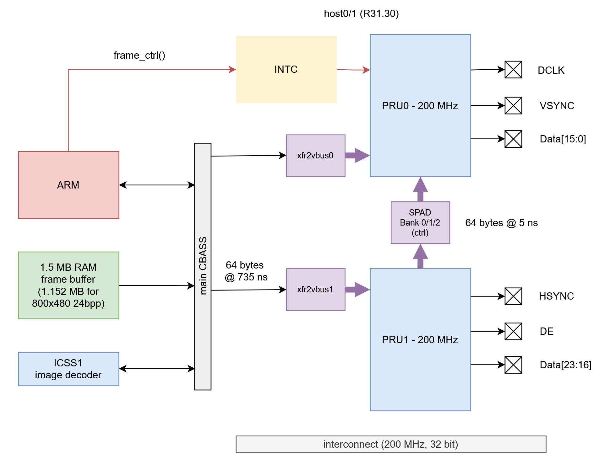
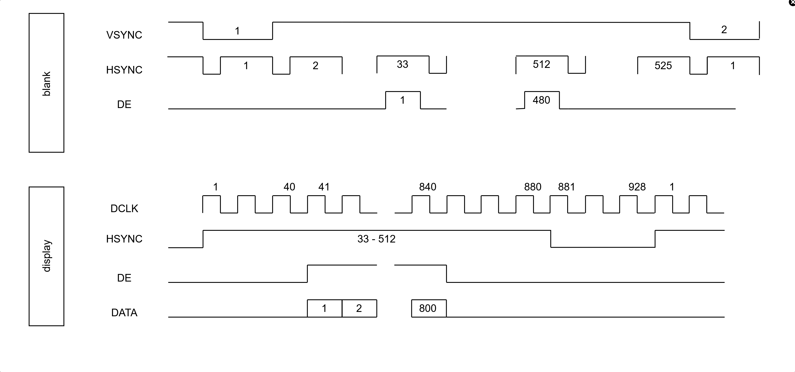
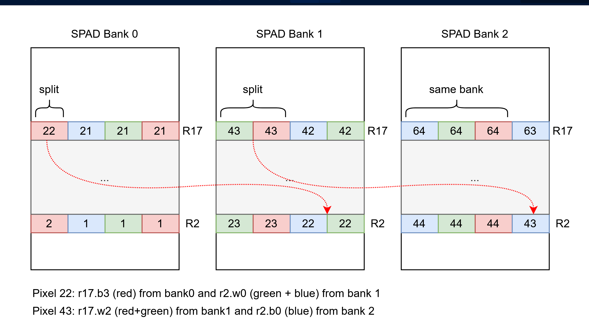
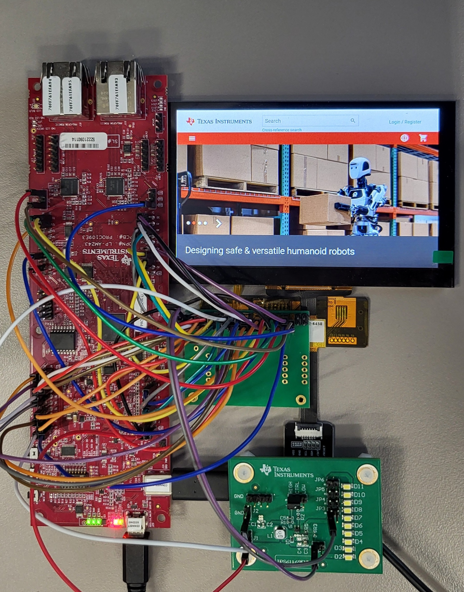
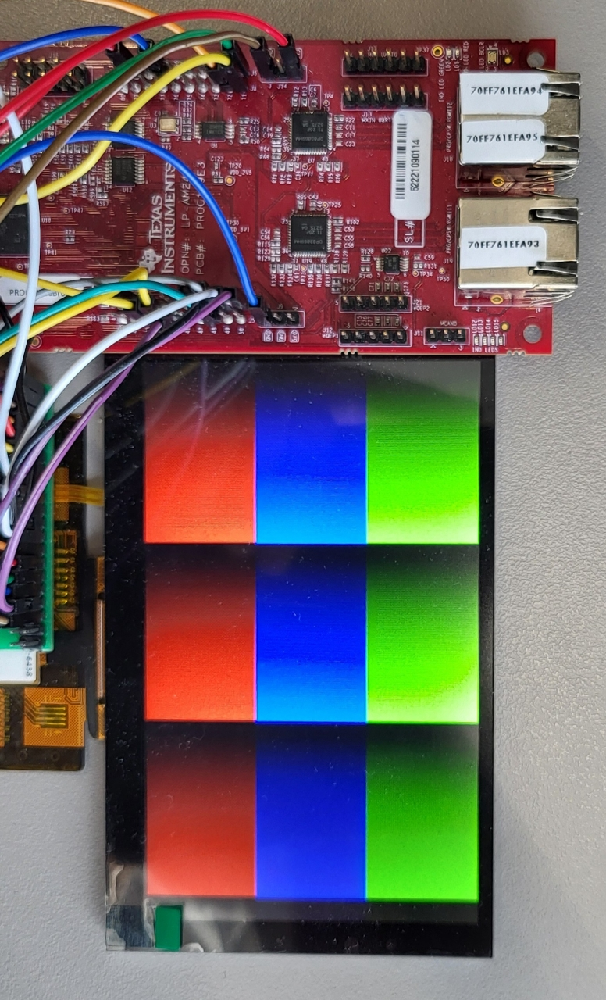

# LCD Interface
This project uses PRU direct GPOs to output data from frame buffer memory to parallel RGB24 interface. The LCD display is 800x480 pixel with 24 bit color and 60 Hz frame rate. PRU resources used are limited to 200 MHz clock and functions available across ICSS_M (AM261/AM263) and ICSS_G (AM243/AM64) devices. The demo is built with AM243x LP becasue of availbility of PRU pins on header. Display used is Newhaven NHD-4.3-800480CF-ASXP-CTP (https://newhavendisplay.com/content/specs/NHD-4.3-800480CF-ASXP-CTP.pdf). For back-light power supply we use TPS61169EVM (https://www.ti.com/lit/ug/snvu455/snvu455.pdf?ts=1746687560731&ref_url=https%253A%252F%252Fwww.ti.com%252Ftool%252FTPS61169EVM).   

## Overview
RGB interface has wide data bus of 24 bit using 8 bits per color. In addition there are verical and horizontal sync signals to define start and end of lines and frames. The dispaly selected has additional DE (data enbale) which is active for one line of data. Each 24 bit data is captured with DCLK (pixel clock) falling edge and there is a setup and hold time of 8 ns in this case. 

PRU direct GPO mode can control output signals with PRU clock resolution. In case of 200 MHz PRU clock the data output is changed with a granularity of 5 ns. The datasheet of the display lists typical DCLK of 29.2 MHz or 34 ns period with a 40/60% duty cycle. PRU generated DCLK is 20 ns high and 15 ns low which is in range of the specified duty cycle of the display. It results in a period of 35 ns or 28.6 MHz. Data is set with rising edge of DLCK and supports the 8 ns setup and hold time. 

Figure 1 shows the PRU architecture to send frame buffer data to RGB interface using two PRU cores. Two cores are needed as one core is limited to 20 GPIO pins. The scratch pad register between the PRU cores is used to sysnchronize both cores to the same cycle for a common parallel interface. PRU0 generates DCLK, VSYNC, DE and 16 bit data for red and green. PRU1 generates HSYNC and data blue. As AM243x LP board does not have all PRU GPOs in a sequence there are extra PRU instructions to shuffle the data for green and a look-up table to distribure the 8 bit index for blue color into a 16 bit ouput pattern.  

Both PRUs get the data from frame buffer using xfr2vbus dma widget. It takes one XOUT instruction to set the mode, length and start address. In auto-incrment mode there are no additional triggers required and after reading the 64 byte fifo the next request with auto increment by 64 bytes is triggered. It takes about 100 ns until the data from on-chip SRAM is available which can be polled in status bits of register 18. As the time distance between the dma transfers is on average 735ns there is no need to check valid flag.   

<figure>

<figcaption>Fig.1 : LCD interface architecture </figcaption>
</figure>

Frame buffer resides in on-chip SRAM starting at global address 0x7000 0000. Visisble size of the buffer is 800 x 480 x 24 bit = 1.152 MBytes. First byte read color of upper left pixel followed by one byte for green and one byte for blue. Second pixel of a line follows after first 3 bytes. After first line data the display points back to first pixel on 2nd line. There is blank time after VSYNC low pulse before first pixel is sent to the dispaly. After 32 HYSNC pulses firs data line is sent, followed by a blank time between lines. After all lines are sent there is an additional blank time before new frame starts. Figure 2 shows the basic timing when dispaly is inactive and active. Including blank time there are 928 DLCKs per line and 525 lines per frame. PRU firmware follows exactly this timing which is given as typical values in the datasheet of the display.     

<figure>

<figcaption>Fig.2 : Display timing </figcaption>
</figure>

One design challange to overcome is the distribution of pixels using a 64 byte DMA with 3 byte aligned pixel data. As shown in fiure 3, first 64 byte transfer has red data for 22 pixels and green or blue data for 21 pixels. Pixel 22 is split into two DMA transfers. A secod split of pixel data is with pixel 43 which has blue in third DMA. Another missalinment with 64 byte dma transfers is realted to 800 pixels per line. The first line ends at a 32 byte boundary. One 64 byte DMA has 32 bytes of data at the end of firt line and 32 bytes of data in the second line.   


<figure>

<figcaption>Fig.3 : Pixel alignment with 64 byte DMA </figcaption>
</figure>

In the PRU firmware there are two marcros which handle both alignment issues. There is one macro for even lines and one for odd lines. Similar macros exist for PRU1 generating HSYNC and blue data. Macro entry time reference is one clock after DCLK high. There is a delay of one DCLK in macro before data is sent on GPO. There is the reason why the wait time after HSYNC high is 39 DCLKs and not 40 DCLKs. Same time shift exists at the end of the macro. There needs to be 41 DCLKs before HSYNC goes low. 


## How to Run

The project is split into three parts which are needed to run the demo. Cloking, pin-mux configuration and interrupts are specified graphically using sysconfig tool and example.syscfg file located in foler "C:\ti\GitHub\open-pru\examples\LCD_interface\am243x-lp\r5fss0-0_freertos". ARM project is used to run configuration of the demo including board and SoC configurations in sysconfig file. ARM also has PRU driver to load and run firmware. It is important that PRU1 starts before PRU0 to have core synchronization working. 

Thirs component is assembly firmare for PRU0 and PRU1 which does the RGB output from frame buffer memory. 

Here are the steps to run the demo. 

1. Clone project from Open-PRU github repositry. 
2. Import project in CCS at LCD_interface folder. CSS will import 3 projects, one for the ARM core and two for PRU0 and PRU1 core. 
3. Build PRU0 and PRU1 firmware first which generates header files.
4. Build ARM project which uses newly generated header files for PRU0 and PRU1 firmware. 
5. Load and run ARM project. It will also load and run PRU1 first followed by PRU0 code. 

It makes sense to validate output signals with a logic scope. Important signals to capture are DCLK, VSYNC, HSYNC, DE and first bit of data line for each color. The documetation folder has PPT which contains timing plots for verifiaction. After validating correct signal output the display can be connected to the launchpad header. The PPT shows the pin-mapping from Launchpad header perspective. 

In order to get an image displayed we need a backlight controller. The TPS6119EVM has 20mA constant output power. The display needs 40 mA. By changing R5 (10.2 Ohm to 5.1 Ohm) on the TPS EVM the output current is doubled to 40 mA 

<figure>

<figcaption>Fig.4 : Demo 800x480@60Hz with 24 bit color </figcaption>
</figure>

The LCD image on figure 4 is loaded by CCS memory window using "Load Memory" option. The file is located at "/examples/LCD_interface/images/ti-page.rgb"
Right click on the address field in memory browser to get to "Load Memory" optin. Select the image and binary format - click on NEXT button. Enter Start Address to 0x70000000 and press Finish. The image will slowly come up on the screen. Additional test can be to fill the memory with a fixed color using "Fill Memory" option in memroy browser. Right click on the address field to select "Fill Memory" function. Use Start Adddress: 0x70000000, Lenght: 38400, Data Value: 0xff0000 (blue), Type-size: 24 bit integer. The data value is RGB with 8 bits per color. Using Data Value: 0xffffff shows a white screen.   

## Appendix A - generate test image 

Example PRU firmware to generate test image with any PRU, e.g. TX_PRU0/1.
Framebuffer start address: 0x70000000
RGB24: 800x480
The firmware has each color sweeping from 0 to 255. 

 ```
main:

; blue
    ldi32 r2, 0x70000000 + 320*2400   ; after 320 lines in frame buffer
    loop endloop, 160      ; 160 line
    ldi   r10, 800
    ldi   r11, 0
    ldi32 r3, 0x000000
l_repeat:
    sbbo  &r3, r2, 0, 3    ; 3 bytes color
    add   r11,r11,1
    add   r3.b0, r3.b0, 1
    add   r2,r2, 3
    qbne  l_repeat, r10,r11

endloop:

; green
    ldi32 r2, 0x70000000     ; start color 
    loop endloop_g, 160      ; 160 line
    ldi   r10, 800
    ldi   r11, 0
    ldi32 r3, 0x000000
lg_repeat:
    sbbo  &r3, r2, 0, 3    ; 3 bytes color
    add   r11,r11,1
    add   r3.b1, r3.b1, 1
    add   r2,r2, 3
    qbne  lg_repeat, r10,r11

endloop_g:

; red
    ldi32 r2, 0x70000000 + 160*2400   ; after 160 lines in frame buffer
    loop endloop_r, 160       ; 160 lines
    ldi   r10, 800
    ldi   r11, 0
    ldi32 r3, 0x000000
lr_repeat:
    sbbo  &r3, r2, 0, 3    ; 3 bytes color
    add   r11,r11,1
    add   r3.b2, r3.b2, 1
    add   r2,r2, 3
    qbne  lr_repeat, r10,r11

endloop_r:

 ```

 <figure>

<figcaption>Fig.2 : Demo 800x480@60Hz with 24 bit color </figcaption>
</figure>

## Appendix B - How to customize for different dispalys

First step is to get display timing details for data sheet. It should cover timings for pixel clock (DCLK), VSYNC, HSYNC, DE (data enable if used) and setup and hold time for data lines. 

In case display does not support full 24 bit color there are two options. For example using RGB565 LCD interface. Convert RGB888 to RGB565 offline and have frame buffer in RGB565 format. In this case PRU firmware Need to extract colors from bit fields which are not byte aligned. A 64 byte DMA transfer now contains 32 pixels with 16 bit data. There is no longer split in pixel data between two DMA transfers which simplifies the macros. 800 pixels also fit exactly into 25 DMA transfer which is a further simplification of the line macros. For PRU0 color mapping we can mask first 11 bits of pixel data for red and green. RED (5 bits) maps to PRU0 GPO0-4 and GREEN maps to PRU0 GPO5-10. PRU1 BLUE data (5 bits) either mapps directly to PRU1 GPO11-15 or the data is shifted right to byte alinment PRU1 GPO0-5.  

Second option of real-time online RGB888 to RGB565 conversion can take more cycles and may slow down the max supported pixel clock. One way to do the the conversion color by color is using a LUT with lbco instruction. A calculation using hadware mulitpler, adder and shift would take more cycles compared to LUT approach. Advantage of RGB565 image in frame buffer is memory saving as image is only 768kB for 800x480 pixels.  


