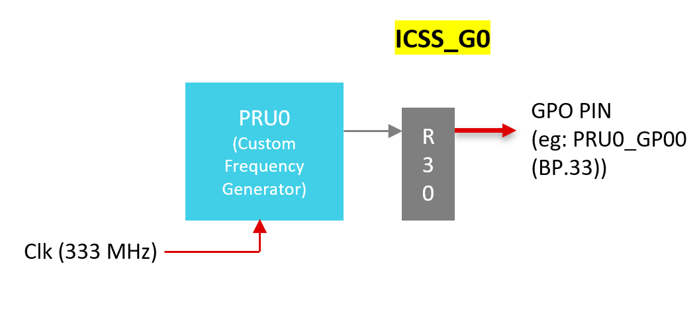
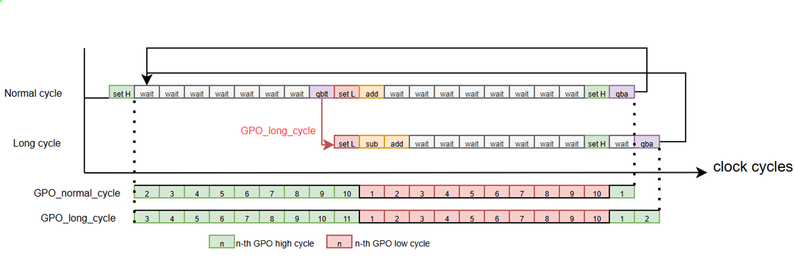
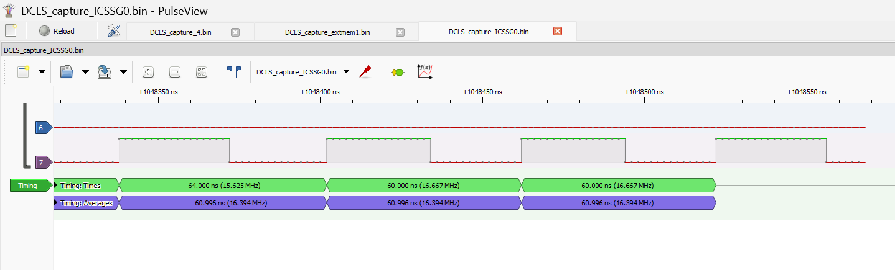

# Custom Frequency Generator

The project generates a square wave of the desired average clock frequency from the available system clock. A fractional adder is used to generate a pulse with a configurable average frequency.


<figcaption>Fig.1 Frequency Generator setup</figcaption>
</figure>

## Overview

Depending on the processor, the PRU cores may only be able to run at a single fixed frequency, or the PRU cores may be able to run at a limited number of clock frequencies. Refer to the hardware documentation for more information about PRU clock sources on your specific processor. Some square wave frequencies are even multiples of the PRU core clock period. These square waves can be easily generated by the PRU, and are not the focus of this project. This project generates output signal frequencies that cannot be created with a simple clock divider. This project generates a square wave with an average frequency very close to a specific desired frequency. It does this by generating two frequencies that are higher and lower than the desired frequency. A fractional adder is used to ensure that the average frequency of the output waveform comes as close as possible to the desired frequency. 

 For the generation of a particular clock frequency, we generate two signals with time periods that correspond to the closest longer and shorter time perods for a particular clock frequency. The shorter time period is generated in the beginning and the fractional difference between the shorter period and the desired period (whic is calculated from the desired frequency) is accumulated as part of a fractional adder. Whenever this accumulated fraction exceeds a maximum limit, which is the clock time-period or the difference between the two closest longer and shorter time-periods, we generate the longer time period.  This process continues indefenitely, thereby generating the two time periods alternatively to give out the average desired time-period required.

 The fractional adder algorithm is integrated within the clock frequency generation code for both time-periods in this project. The duration of high and low signals are kept the same for the signal generation, as the generated signal is assumed to be used as a clock signal. The alternate generation of longer and shorter time periods for a specific example of 16.384 Mhz is shown below as a timing diagram:

 
<figcaption>Fig.2 Timing diagram of Custom frequency generator</figcaption>
</figure>

## Configuration

All the configurations mentioned are performed in the 'macros' section of the file "fn_fg_output.asm".

Maximum Genertable Frequency : (Clock Frequency/8)

=> minimum of 8 clock cycles time period

For a clock setting of 333Mhz: f_max = ~41.6 Mhz 


1. Determine a higher and lower time period close to the desired frequency. Eg., if the desired frequency is 16.384 Mhz, 

```math
T = 61.0351562
 ```

A PRU core running at 333Mhz has a clock period of 3ns. The closest higher and lower time periods are 60ns and 63ns.

2. Set the Q30 format of the fraction to be accumulated and added using fractional adder as parameter 'FRAC_ACC'. This is the difference between the desired time period and the chosen lower time period.
For the previous example,

    ```math  
    T-T\_lower\_period = 1.03515625 
    ```
    ```math
    FRAC\_ACC = 1.03515625 * 2^{30} 
    ```
    ```
    FRAC_ACC .set 0x42400000
    ```

3. Set the Q30 format of the maximum accumulation limit as parameter 'FRAC_ACC_MAX'. This is equal to the clock time period. For a clock of 333Mhz(clock period of 3ns), 
    ```math  
    FRAC\_ACC\_MAX= T\_clock = 3 * 2^{30}
    ```
    ```
     FRAC_ACC_MAX .set 0xC0000000
    ```
4. Set the time period of shorter period(60ns) in clock cycles
    ```math
    60ns => 20 cycles @333Mhz
    ```    
    ```
    CFG_T_SH_CYC .set 20
    ```
    Note : minimum value of CFG_T_SH_CYC is 8 according to implementation constraints. 
## How to Run

1. Import the device specific project from 'examples/custom_frequency_generator' in the open-pru repository.
2. Keep the default configuration (for 16.384Mhz) or change the configuration according to section [Configuration](#configuration) for a desired frequency.
3.  Build and load the "*.out" file into the core 'ICSSG0 PRU0' of AM243x device. 
4. Run the core and the desired average frequency is available on PIN PRU0_GPO0(BP.33). To view the signal, connect a channel of a logic scope to the PIN. 

## Results

Test Environment : AM243x tested with MCU+SDK 11.0

A portion of the output signal traced using the PRU Logic Scope(see examples/logic_scope) and viewed on pulse view (see how to view trace in logic scope in documentation in examples/logic_scope/README.md) shows a signal with average frequency as 16.394Mhz, which is as close as one decimal place to the desired frequency : 

 
<figcaption>Fig.3 Resulting wave of Frequency generator</figcaption>
</figure>