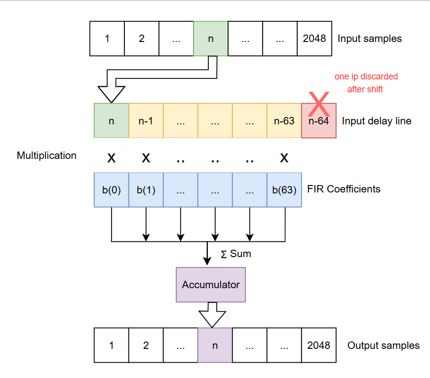

# FIR on PRU


## Introduction

This example implements a 64-tap FIR filter on PRU with 32 bit fixed-point precision inputs(Q31).

## Supported Combinations

Refer to open-pru/examples/readme.md > Supported processors per-project
for the list of processors that support building this project, and information
about porting this project to other processors.

## Validated HW & SW

This project was tested on hardware with these software versions:

| Processor | Hardware  | Software                   |
| --------- | --------- | -------------------------- |
| am243x    | LP-AM243  | MCU PLUS SDK 11.1, OpenPRU commit "Added FIR example" |

## Overview

The example FIR implementation comes with default fir coefficients for a low pass filter (see specifications in test results section). The filter coefficients could be configured according to the desired filter. The example loads 32-bit Q31 fixed point inputs from Shared Memory and performs a 64-tap FIR filter on each cycle of loading a new input. For each new input loaded, after FIR is performed, output is written into the memory. The example runs in ICSS PRU0 and performs FIR on 2048 inputs in ICSS shared memory and writes the output to an output memory location, again in the ICSS Shared Memory.   

The FIR filter of order N is given by : 

<figure>

<figcaption>Fig.1 : FIR Equation </figcaption>
</figure>

To perform a 64-tap FIR filter, we need to maintain an input 'delay line', which is a buffer containing the past 64 input values. These values are multiplied with 64 FIR coefficients that corresponds to 64 taps and summed together in an accumulator. When a new value is loaded we shift the inputs by one place , discard the last input and insert the new input in place. This starts a new 'FIR_cycle', in which we multiply the updated delay line with the 64 FIR coefficients. The whole process can be visualized as shown in the figure below:

<figure>

<figcaption>Fig.2 : FIR filter application </figcaption>
</figure>

The 64 filter coefficients required for each each FIR cycle can be fetched 8 at a time using the XFR2VBUS data movement accelerator. When using XFR2VBUS, the fastest movement times are attained when the coefficients are stored in a memory outside ICSS like the MSRAM of the ARM core in AM243. In the beginning during the 'INIT' phase, the transfer of the first 8 coefficients (32 Bytes) to XFR2VBUS READ buffer is triggered and we wait till the transfer is complete . Once it is ready, we can fetch these from the READ Buffer in a single cycle, which also triggers the transfer of next 8 coefficients since auto-read has been enabled. This happens in the background, when we apply the filter (MAC operation) using the already loaded coefficients. Before the last set of 8 coefficients in an FIR-cycle are multiplied, an XFR2VBUS transfer of the same 64 coefficients is re-triggered for the next FIR-cycle, so that there is no waiting time like when we loaded the first set in INIT phase. This would mean that loading of 8 FIR coefficients will always take 1 cycle, except for the first set in first FIR-cycle. The initial waiting times can be avoided by storing the coefficients in Broadside RAM that is available for devices like AM243x, but not a device like AM261x.

The input delay line buffer is achieved using the three scratchpads available for PRU0. In the available 3 banks of Scratch Pads with 30 32-bit registers each, we store the 64 inputs distributed as 24-24-16 . From the delay line, each input can be loaded directly to the multiplication register using the 'shift load' feature without corrupting the PRU registers. After an unsigned multiplication is performed, a sign correction is performed to achieve signed 64-bit product. This product is added to a 64-bit accumulator we achieved using two PRU registers and when all of the 64 products are added like this, we perform the scaling of this accumulated sum to Q31 and save the output.

In each new FIR-cycle, a new input is fetched from the memory and the delay line has to be shifted. This shifting is performed using the 'shift-load' feature available for scratchpads. First we load all the inputs in the first scratchpad and then change the shift value by one so that when we save it again, a new input gets saved in every old SPAD position. In place of the latest input in SPAD, we load the new input and the discarded input from first SPAD has to go to the first position in next SPAD. The shifting is repeated for the remaining two SPADs with the new inputs being the last input discarded from previous SPAD. For the final SPAD, the discarded value after shifting is the (n-64)th value that can be ignored for the input delay line. The shifting process among SPADs is shown below for two SPADS:
<figure>

<figcaption>Fig.3 : Input delay line shift using SPADs </figcaption>
</figure>


## Configuration
The possible major configurations for the filter are :
1. FIR filter coefficients are provided as an array in main.c to be stored in data memory by the linker(see .data section in linker command file). Custom filter coefficients if needed are to be designed and generated in double format and stored in the array "fir_filter_taps" on top of main.c.
    ```
    /* configure filter coefficients here */
    static double fir_filter_taps[64] = {
    -0.003743790557955713,
    -0.003058147698064947,
    -0.0030497021701321246,
    -0.001942142907318171,
    ....
    -0.003058147698064947,
    -0.003743790557955713
    };

    ```
    These values are converted into Q31 format and stored in memory 'FIR_COEF_MEM' by a small routine in main.c. Alternatively, filter coefficients could be directly loaded into 'FIR_COEF_MEM' in Q31 format. 

2. The memory locations for coefficients are ideally placed outside ICSS subsystem for timing management of XFR2VBUS. For 333Mhz and below, it was observed there would not be any timing violation for loading using XFR2VBUS. The memory location can be changed by configuring the memory in two locations:
    ```
    main.c (for loading the coefficients to mem)

    #define FIR_COEF_MEM 0x70000000 //MSRAM
    ```
    ```
    fir_filter.asm (for normal fir operation)

    FIR_COEF_MEM	.set 0x70000000	; global address
    ```
    Note : For a faster clock or a different memory, XFR2VBUS timing accuracy might have to be re-evaluated.
3. The input and output memory can be resized and redefined by keeping the memory boundary constraints in mind:
    ```
    FIR_IP_MEM				.set 0x30010000	; size : 0x2000
    FIR_DATA_SIZE			.set 0x2000
    FIR_OP_MEM				.set 0x30012000	; size : 0x2000 
    ```
4. Input data is loaded into the input memory in Q31 format before the program is run. It is assumed that the values are scaled properly to avoid any overflow. For testing, input values were generated as binary '.dat' format and loaded into the memory location using Code Composer Studio. 

## How to Run

Steps to run FIR filter on AM243x using default provided FIR coefficients:

1. Load the input values in Q31 format to the memory location configured as 'FIR_IP_MEM' location in Q31 format. One way to do this using CCS is to create a '.dat' binary format file containing the input data in Q31 format (using say, a python script) and load it to the memory 'FIR_IP_MEM'. 

2. Launch the target configuration, build and run the 'fir' project on ICSSG0 PRU0.

3. After the program has halted, output will be present in the output memory location in Q31 format. To plot the output using Code Composer Studio, connect to an ARM core and navigate to tools --> graph --> Single Time. Configure the global output memory location and the size of data to plot like the example below:

    
    <figcaption>Fig.3 : FIR output plotting using CCS </figcaption>
    </figure>

## Consideration when Modifying the project

1. For a faster loading time using xfr2vubs, coefficients were stored in MSRAM rather than ICSS SMEM. If a different memory were to be used instead of MSRAM here, it is expected that the difference in reading latency for DMA access from that memory is taken into account. It has to be ensured that the coefficients are loaded on time before the next cycle of coefficient multiplication. 

2. There might be further latencies for XFR2VBUS read if multiple PRUs access the same bus at the same time. The correctness of the operation in the current implementation was only evaluated by running on a single PRU.

3. For AM243x, Broadside RAM is an alternate option to store FIR coefficients and XFR2VBUS data read can be avoided. This option is not available for boards like AM261x.

4. Best way to ensure correctness of XFR2VBUS is by adding a loop that checks for Data readiness. However using this inside a normal FIR loop would make the loop execution time non-deterministic.

## Test Results

### Test Environment

    Device : AM243x

    Core : ICSSG0 PRU0 @333Mhz clock

    SDK : 11.1.0.19

    CCS : v12.8.1

**Filter details** : Low Pass filter

    Pass Band: 0Hz - 10000Hz
    Stop Band: 14000Hz - 64000Hz

**Input data** : 

    2048 32-bit samples. 
    Noisy Sine signal : 1000 Hz Sine + 20000 Hz Sine 

<figure>

<figcaption>Fig.4 : Input data for testing FIR </figcaption>
</figure>

### Results

After the FIR program has halted, the plotted output data looks like the following : 

<figure>

<figcaption>Fig.4 : Output data after applying FIR filter </figcaption>
</figure>

As we can observe the high frequency component has been completely filtered out and the low frequency sin wave is visible.

### Performance

For clock frequency of 333Mhz in AM243x, when MSRAM was used for coefficient storage, the following results were obtained:

 | Case        | # Cycles | Execution time on PRU @333Mhz |
|--------------|:-----:|:-----------:|
| FIR_64 for 2048 samples measured    |  1653354  |  4.96 ms       |
| Longest single FIR_64 cycle*         |  872  |  2.62 us       |
| Worst case time for 2048 ip*      |  1783927   |  5.3 ms       |

*The worst case cycle count happens when both coefficients and inputs are negative for a cycle. Worst case for 2048 samples occurs only when all of inputs values and coefficients are negative, which was measured by setting all coefficients and inputs to negative values.

    
