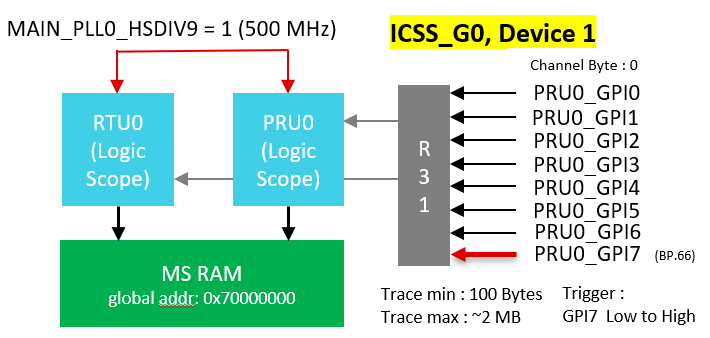
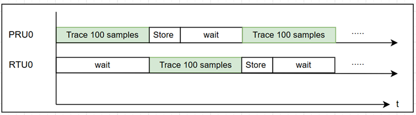
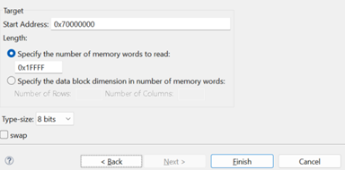
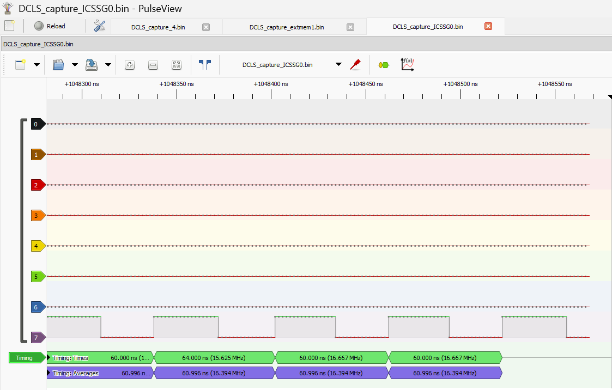

# 8-channel Logic Scope

The project realizes a simple logic scope that uses two cores, PRU0 and RTU0, to continuously sample a configured GPI Pin. The sampling frequency is restricted only by the clock frequency of PRU and for AM243 we could configure the clock upto 333Mhz. This gives us a maximum sampling rate of 333Mhz. The number of samples that need to be captured can be configured in multiples of 100 and the maximum number of samples is only restricted by the size of the configured storage memory. For MSRAM, this is around 2MB of sample size. The Logic-scope reads 1 Byte of data every clock cycle which contains logic data from 8 input channels.  The trigger for sampling in current implementation is set to a low to high in the 8th channel (PRU0.GPI7).


## Overview

PRU cores can directly read certain input pins using their R30 registers. Since R30 has real-time information on the logic levels of these pins, a zero-overhead loop and indirect register addressing could be used to continuously transfer the samples to other registers, bytewise. The number of samples we can transfer continously in this case, is limited by the number of available registers in a single core. Once we are out of registers, with a single core, we have no other choice but to pause sampling to tranfer the collected samples to memory. 

The above mentioned restriction can be surpassed by making use of an extra core which can continue sampling after the first core fills up it's registers. This way, one core will always continue sampling while the other core stores the data that it sampled. The cores are selected as PRU and RTU since they will have access to the same input pins simultaneously. A conceptual timing diagram of the same is shown below:



The cores have to be synchronized once before they wait for the trigger together. This is performed with the help of IPC SPAD between PRU and RTU. 

## Configuration

1. DCLS_config_macros.inc contains all the configurations for DCLS. It is imortant to note that required configurations are to be done in this file for both cores

2. 8 channels are sampled simultaneously. Set the channel Byte to be sampled as 0, 1, or 2. For GPI0-GPI7, channel Byte is 0. Note that depending on the availability of pins, changing the Byte number will reduce the number of usable channels. 
    ```
    DCLS_CH_BYTE .set 0  
    ```
3. Set the trace memory. For utilizing the full 2MB trace, set the memory location to MS-RAM as follows :
    ```
    DCLS_SMP_MEM_GLB  .set 0x70000000
    ```
4. Samples are traced in multiples of 100. Each sample is 1 Bytes. It is important to take care that the size does not exceed the limits of configured memory when changing this value. MS-RAM for example, 

    ```math
    Span : 0x70000000 – 0x701FFFFF
    ```
    ```math
    Size : 0x1FFFFF (2MB)
    ```
    ```math
    max\_sample\_sets = ((0x1FFFFF) / 100) = 20971
    ```
    
    Now the sample size could be set to a value below max, like as shown below in default configuration:
    ```
    DCLS_SMP_CNT    .set 20900 
    ```
5. Default trigger is set to channel 7 and is looking for a low to high trigger signal. For setting the trigger on another channel, change the value of the following parameter to any channel number from 0-7:
    ```
    DCLS_TRIG_CH    .set 7

    ```

## How to Run
1. Connect the input signal to be traced to one of the channels in logic scope. If multiple signals are to be traced, connect all inputs to the configured channels.
2. Build the PRU0 and RTU0 projects in "fft/examples/logic_scope" and load the projects to corresponding cores.
3. Run the RTU0 project first, which is important for core synchronization. After the RTU0 project starts running, run the PRU0 project.

    Note :After both cores are up and running, the logic scope will actively sample for a low to high trigger on the configured channel. Once it detects the trigger, the configured number or samples will be collected in the configured memory. By default, a ~2MB will be stored in MS-RAM. 
4. To view the data from collected 8-channel samples, connect to an ARM core and open memory browser. Save the binary trace that starts from configured memory. For default configuration of logic scope, using CCS, we can save this trace as 'TI Raw Data'. The parameters will look as in the following image:
    
5. The collected binary trace can be viewed in  a tool like 'PulseView'. In PulseView, import the data as raw binary, set the number of channels as 8 and the sampling frequency(333Mhz by default).
6. The sampled signals over 8 channels can now be viewed as shown below(only one channel is connected) :
    