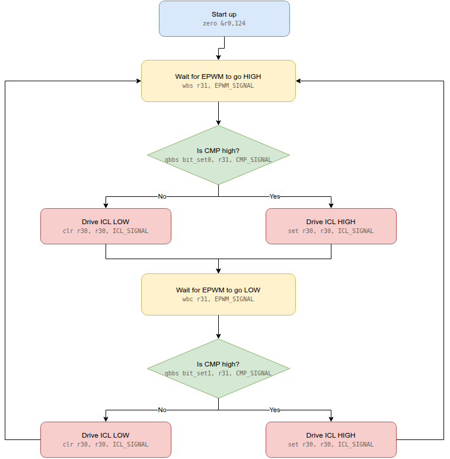
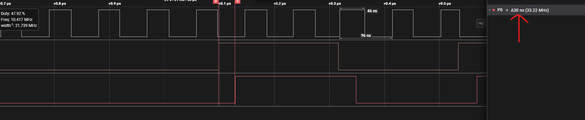

# mirror_input Timing Analysis

Worst-case timing budget for the EPWM-edge -> ICL mirror in `firmware/main.asm`,
measured on AM263Px hardware (PRU clock 200 MHz, 5 ns/cycle) with a Saleae
capture.

## Instructions used

```asm
main:
    zero &r0,124
high_pulse:
    wbs r31, EPWM_SIGNAL      ; poll: block until EPWM (GPI2) goes high
    qbbs bit_set0, r31,CMP_SIGNAL
bit_clear0:
    clr  r30, r30, ICL_SIGNAL
    qba  low_pulse
bit_set0:
    set  r30, r30, ICL_SIGNAL

low_pulse:
    wbc r31, EPWM_SIGNAL      ; poll: block until EPWM (GPI2) goes low
    qbbs bit_set1, r31,CMP_SIGNAL
bit_clear1:
    clr  r30, r30, ICL_SIGNAL
    qba  high_pulse
bit_set1:
    set  r30, r30, ICL_SIGNAL
    qba high_pulse
```

- `wbs` -- wait until the selected bit is set.
- `wbc` -- wait until the selected bit is clear.
- `wbs`/`wbc` re-execute in place every cycle until the polled bit matches, so
  they add no fixed cost of their own beyond however long the input takes to
  change -- the instruction that "completes" is whichever cycle the bit
  finally matches.
- `qbbs` tests one bit of `r31` (GPI) and branches if set.
- `set`/`clr` write the mirrored bit into `r30` (GPO).
- `zero &r0,124` only runs once at boot; it is not on the edge-to-output path.

## Why the path is at least 3 cycles

The PRU is a single-issue, non-pipelined core: every instruction, taken
branch or not, executes in exactly 1 cycle. From the instant `wbs`/`wbc`
releases (EPWM edge seen) to the instant `r30` is written, the core always
executes exactly 3 instructions, regardless of which branch is taken:

1. `wbs`/`wbc` releases (the cycle the edge is sampled and matched)
2. `qbbs` (bit test + branch)
3. `set` or `clr` (GPO write)

Both branches of the `qbbs` (`bit_set0`/`bit_clear0`, and their `low_pulse`
counterparts) are exactly one instruction deep before the `r30` write, so
there is no path shorter or longer than 3 cycles -- the mirror latency is
constant, not data-dependent.

At the measured 200 MHz PRU clock:

```
3 cycles x 5 ns/cycle = 15 ns
```

This matches the Saleae capture below: of the total 30 ns delta between the
EPWM edge and the ICL output changing, 15 ns is this 3-cycle instruction
path, and the remaining 15 ns is fixed hardware delay -- GPI pad/synchronizer
input latency plus GPO pad output latency, outside the PRU core entirely and
not reducible by firmware changes.

```
Total measured delay      : 30 ns
Firmware (3 cycles @200MHz): 15 ns
GPI->GPO hardware delay   : 15 ns  (remainder, not controllable in software)
```

## Flow chart



Source: `images/mirror_input_flow.drawio` (editable at
[app.diagrams.net](https://app.diagrams.net)).

## Measured capture

- Top signal: EPWM input on GPI2
- Middle signal: CMP input on GPI0
- Bottom signal: latched output from GPO1



The right-hand panel's `P0 -> Δ30 ns (33.22 MHz)` marker is the measured
edge-to-mirror delay described above.
