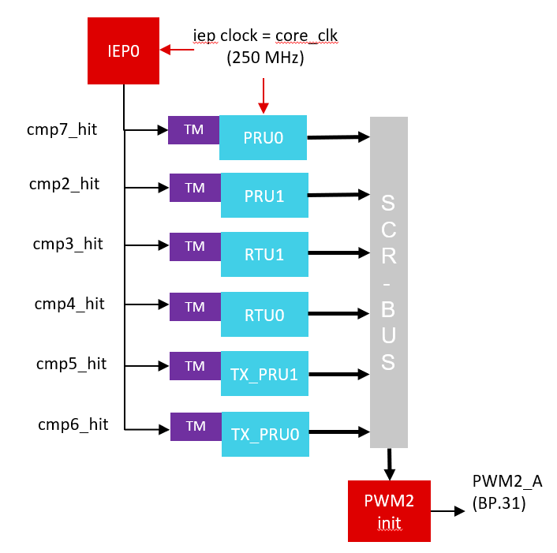
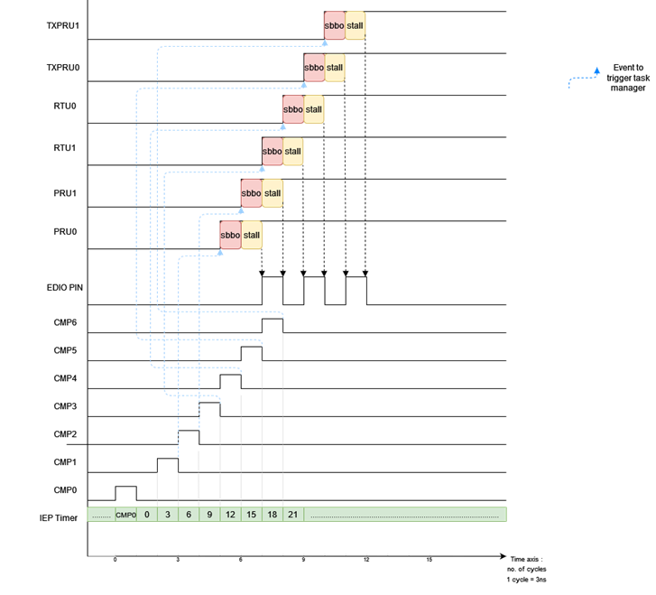
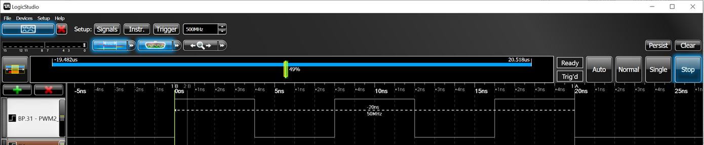

# Multicore Scheduler

## Introduction
This project uses IEP timer along with Task Manager in 6 cores to schedule tasks in 6 cores back to back with no delay in between.

## Supported Combinations

Refer to open-pru/examples/readme.md > Supported processors per-project
for the list of processors that support building this project, and information
about porting this project to other processors.

## Validated HW & SW

This project was tested on hardware with these software versions:

| Processor | Hardware  | Software                   |
| --------- | --------- | -------------------------- |
| am243x    | LP-AM243  | MCU PLUS SDK 11.1, OpenPRU commit "Add Example : Multicore Scheduler
" |

## Overview

This example makes all six PRU cores in ICSSG collectively generate a toggling pattern using PWM init state on a PIN (PWM2_A(BP.31)) and the toggling happens back to back with no delay in between. The project demonstrates how sequential tasks on multiple cores can be scheduled back-to-back without any scheduling delays if a time based scheduling strategy is used. 

Each of the 6 PRUs in ICSSG0 is loaded with a task and mapped to different compare events as shown below:

<figure>

<figcaption>Fig.1 : Multicore Scheduler Overview </figcaption>
</figure>

Each compare event is generated when the IEP timer reaches the corresponding compare value. IEP timer Cmp0 event is used for cyclic task scheduling. The timer resets to 0 every time we hit Cmp0 value and the tasks are triggered again according to other Cmpx values. The compare events are all triggered such they are at adjacent cycles from each other. The tasks are programmed in a way that they set an output PIN to either high or low, to achieve a toggling pattern. It is recommended to use the same clock source for IEP timer clock and PRU core clock(synchronous mode) for cycle accurate task triggering and to avoid jitter.

The Since RTU and TXPRU cores do not have access to GPOs via R30, we have to use an output like EDIO (to which all cores have direct real-time access) to observe this toggling. For further ease of observation, in this project, the tasks toggle the init voltage state of a PWM pin in AM243x. The toggling is not to be confused with normal PWM toggling and has nothing to do with PWM except for a configuration that allows us to change the starting PWM state to high or low. If the PWM period is kept long enough to not cause any interference with this init state toggling, the corresponding PIN can be probed to observe this toggling like a GPO. 

The period value for the PWM pin we use here is tied directly to cmp1 value, which we are thus forced to keep high enough to avoid the interference we discussed. Because of this, we are using cmp7 event to trigger PRU0 instead of using cmp1 event, which would have looked more ordered. In general, for this project, any cmp value except cmp0 and cmp1 can be used to trigger any core if they are configured accordingly(see below).

A timing diagram that shows how the sequential task execution achieves the desired toggling pattern for a 250Mhz clock (4ns Time period, Synchronous mode : PRU clock = IEP clock)is shown below:


## Configuration
An overview into how the mapping is performed is discussed here. There are six projects, one for each core and PRU0 does all the event configuration and mapping in the file "pwm_toggle.asm" of project "PRU_Multicore_Scheduling_PRU0". It contains code or macros that can be used to change the configurations or mapping if needed:

1. Compare event timings for 250 Mhz or 4ns time period:

    ```
    ; increment value for configured clock
    MS_TIMER_INC	.set	4 ; 250 Mhz, 4ns

    ; set CMP0 time to desired time period in ns
        ; (COUNT - increment value) is set as count starts from 0
    MS_CMP0_TIME	.set	(100-MS_TIMER_INC) ; cycle time
    MS_CMP1_TIME	.set	2000   ; CMP1 time
    MS_CMP2_TIME	.set	(2*MS_TIMER_INC) ; CMP2 time
    MS_CMP3_TIME	.set	(3*MS_TIMER_INC) ; CMP3 time
    MS_CMP4_TIME	.set	(4*MS_TIMER_INC) ; CMP4 time
    MS_CMP5_TIME	.set	(5*MS_TIMER_INC) ; CMP5 time
    MS_CMP6_TIME	.set	(6*MS_TIMER_INC) ; CMP6 time
    MS_CMP7_TIME	.set	(1*MS_TIMER_INC) ; CMP7 time

    ```
2. Task triggers are mapped to compare events as shown below:

    ```
    TRG_EVENT_PRU0				.set IEP0_CMP_7
    TRG_EVENT_PRU1				.set IEP0_CMP_2
    TRG_EVENT_RTU1				.set IEP0_CMP_3
    TRG_EVENT_RTU0				.set IEP0_CMP_4
    TRG_EVENT_TXPRU1			.set IEP0_CMP_5
    TRG_EVENT_TXPRU0			.set IEP0_CMP_6
    ```

    Event numbers of compare events are fixed for AM243 and are defined above this mapping as follows :
    ```
    ;relevant event mappings
    IEP0_CMP_0	.set	(16+0)
    IEP0_CMP_1	.set	(16+1)
    IEP0_CMP_2	.set	(16+2)
    IEP0_CMP_3	.set	(16+3)
    IEP0_CMP_4	.set	(16+4)
    IEP0_CMP_5	.set	(16+5)
    IEP0_CMP_6	.set	(16+6)
    IEP0_CMP_7	.set	(16+7)
    ```


Various tasks have to be mapped to the respective task manager in each core. The tasks in all cores are mapped to TS2_0 slot of the task manager as part of the code in the project that corresponds to that core. For example, 'FN_PWM_INIT_TOGGLE_PRU1_TASK' is the task to be called in PRU1 when the mapped event is triggered, and is mapped to TS2_0 as shown below in "main.c" of the project "PRU_Multicore_Scheduling_PRU1" as shown below:

    ```
    HW_WR_REG32((TM_REG_BASE_RTU1+TASKS_MGR_TS2_PC_S0), (unsigned int) FN_PWM_INIT_TOGGLE_RTU1_TASK);
    ```

## How to Run

The multicore scheduler is run on ICSSG0 and the output can be traced from PIN BP.31 (PWM2_A). To view the results, a scope has to be connected to PIN BP.31 according to default configuration. Following are the steps for running on CCS:

1. Import six projects that correspond to six ICSSG0 PRU cores from "examples/multicore_scheduler/am243x-lp"

2. Power up AM243x Launchpad and connect to target

3. Load six cores with corresponding projects as follows:
    1. Project "multicore_scheduler_am243x-lp_icss_g0_pru0_fw_ti-pru-cgt" to core ICSSG0 PRU0
    2. Project "multicore_scheduler_am243x-lp_icss_g0_pru1_fw_ti-pru-cgt" to core ICSSG0 PRU1
    3. Project "multicore_scheduler_am243x-lp_icss_g0_rtu_pru0_fw_ti-pru-cgt" to core ICSSG0 RTU_PRU0
    4. Project "multicore_scheduler_am243x-lp_icss_g0_rtu_pru1_fw_ti-pru-cgt" to core ICSSG0 RTU_PRU1
    5. Project "multicore_scheduler_am243x-lp_icss_g0_tx_pru0_fw_ti-pru-cgt" to core ICSSG0 TX_PRU0
    6. Project "multicore_scheduler_am243x-lp_icss_g0_tx_pru1_fw_ti-pru-cgt" to core ICSSG0 TX_PRU1
4. Run all the six cores in any order
5. Connect a logic scope to pin BP.31 to observe the toggling pattern generated. An example for the pattern generated for 333Mhz clock is shown below : 
    
    
