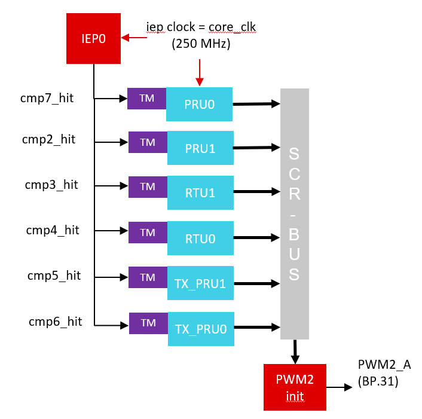
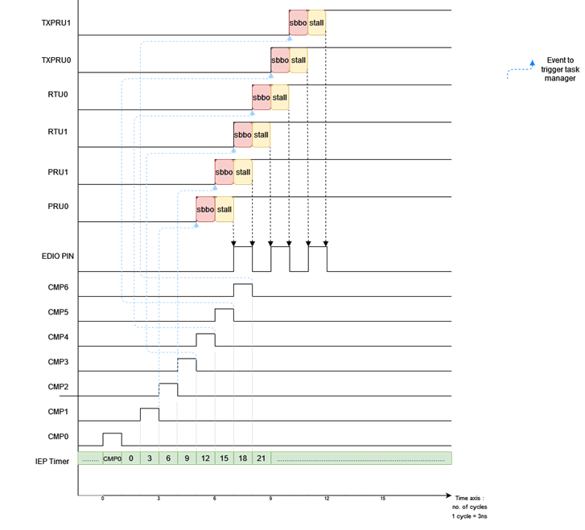
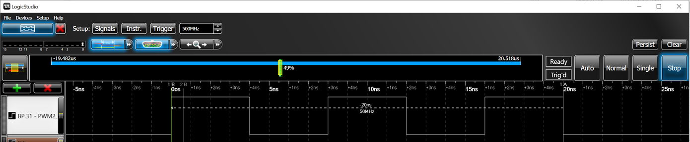

# Multicore Scheduler
This project uses IEP timer along with Task Manager in 6 cores to schedule tasks in 6 cores back to back with no delay in between. The tasks collectively generate a toggling pattern using PWM init state on a PIN (PWM2_A(BP.31)) and the toggling happens back to back with no delay in between. The project demonstrates how sequential tasks on multiple cores can be scheduled back-to-back without any scheduling delays if a time based scheduling strategy is used. 

## Overview
Each of the 6 PRUs in ICSSG0 is loaded with a task and mapped to different compare vents as shown below:

<figure>

<figcaption>Fig.1 : Multicore Scheduler Overview </figcaption>
</figure>

IEP timer Cmp0 event is used for cyclic task scheduling. The compare events are all triggered such they are at adjacent cycles from each other. The tasks either set output PIN to high or low such that toggling pattern is achieved. Since RTU and TXPRU cores do not have access to GPOs via R30, we could either use EDIO or toggling of PWM init state. THe current project uses PWM init state on AM243x. A timing diagram that shows how the sequential task execution achieves the desired toggling pattern for 333Mhz (3ns TIme period)is shown below:


## Configuration
An overview into how the mapping is performed is discussed here. There are six projects, one for each core and PRU0 does all the event configuration and mapping in the file "pwm_toggle.asm" of project "PRU_Multicore_Scheduling_PRU0". It contains code or macros that can be used to change the configurations or mapping if needed:

1. Compare event timings for 250 Mhz or 4ns time period:

    ```
    ; increment value for configured clock
    MS_TIMER_INC	.set	4 ; 250 Mhz, 4ns

    ; set CMP0 time to desired time period in ns
        ; (COUNT - increment value) is set as count starts from 0
    MS_CMP0_TIME	.set	(100-MS_TIMER_INC) ; cycle time
    MS_CMP1_TIME	.set	2000   ; CMP1 time
    MS_CMP2_TIME	.set	(2*MS_TIMER_INC)  ; CMP2 time
    MS_CMP3_TIME	.set	(3*MS_TIMER_INC) ; CMP3 time
    MS_CMP4_TIME	.set	(4*MS_TIMER_INC) ; CMP4 time
    MS_CMP5_TIME	.set	(5*MS_TIMER_INC) ; CMP5 time
    MS_CMP6_TIME	.set	(6*MS_TIMER_INC) ; CMP6 time
    MS_CMP7_TIME	.set	(1*MS_TIMER_INC)  ; CMP7 time

    ```
2. Task triggers are mapped to compare events as shown below:

    ```
    TRG_EVENT_PRU0				.set IEP0_CMP_7
    TRG_EVENT_PRU1				.set IEP0_CMP_2
    TRG_EVENT_RTU1				.set IEP0_CMP_3
    TRG_EVENT_RTU0				.set IEP0_CMP_4
    TRG_EVENT_TXPRU1			.set IEP0_CMP_5
    TRG_EVENT_TXPRU0			.set IEP0_CMP_6
    ```

    Event numbers of compare events are fixed for AM243 and are defined above this mapping as follows :
    ```
    ;relevant event mappings
    IEP0_CMP_0	.set	(16+0)
    IEP0_CMP_1	.set	(16+1)
    IEP0_CMP_2	.set	(16+2)
    IEP0_CMP_3	.set	(16+3)
    IEP0_CMP_4	.set	(16+4)
    IEP0_CMP_5	.set	(16+5)
    IEP0_CMP_6	.set	(16+6)
    IEP0_CMP_7	.set	(16+7)
    ```


Various tasks have to be mapped to the respective task manager in each core. The tasks in all cores are mapped to TS2_0 slot of the task manager as part of the code in the project that corresponds to that core. For example, 'FN_PWM_INIT_TOGGLE_PRU1_TASK' is the task to be called in PRU1 when the mapped event is triggered, and is mapped to TS2_0 as shown below in "main.c" of the project "PRU_Multicore_Scheduling_PRU1" as shown below:

    ```
    HW_WR_REG32((TM_REG_BASE_RTU1+TASKS_MGR_TS2_PC_S0), (unsigned int) FN_PWM_INIT_TOGGLE_RTU1_TASK);
    ```

## How to Run

The multicore scheduler is run on ICSSG0 and the output can be traced from PIN BP.31 (PWM2_A). To view the results, a scope has to be connected to PIN BP.31 according to default configuration. Following are the steps for running on CCS:

1. Import six projects that correspond to six ICSSG0 PRU cores from "examples/multicore_scheduler/am243x-lp"

2. Power up AM243x Launchpad and connect to target

3. Load six cores with corresponding projects as follows:
    1. Project "multicore_scheduler_am243x-lp_icss_g0_pru0_fw_ti-pru-cgt" to core ICSSG0 PRU0
    2. Project "multicore_scheduler_am243x-lp_icss_g0_pru1_fw_ti-pru-cgt" to core ICSSG0 PRU1
    3. Project "multicore_scheduler_am243x-lp_icss_g0_rtu_pru0_fw_ti-pru-cgt" to core ICSSG0 RTU_PRU0
    4. Project "multicore_scheduler_am243x-lp_icss_g0_rtu_pru1_fw_ti-pru-cgt" to core ICSSG0 RTU_PRU1
    5. Project "multicore_scheduler_am243x-lp_icss_g0_tx_pru0_fw_ti-pru-cgt" to core ICSSG0 TX_PRU0
    6. Project "multicore_scheduler_am243x-lp_icss_g0_tx_pru1_fw_ti-pru-cgt" to core ICSSG0 TX_PRU1
4. Run all the six cores in any order
5. Connect a logic scope to pin BP.31 to observe the toggling pattern generated. An example for the pattern generated for 333Mhz clock is shown below : 
    
    
