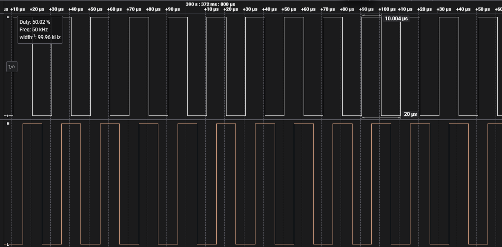
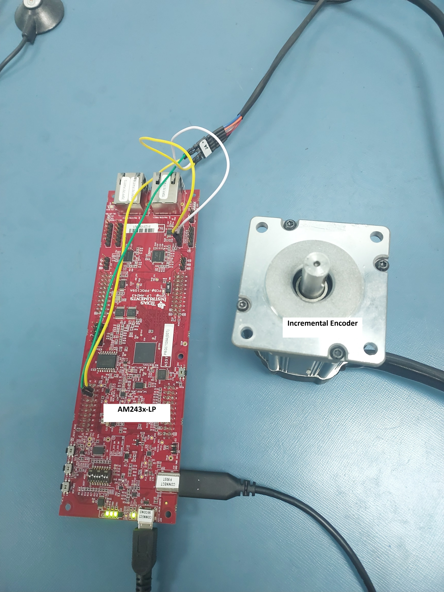
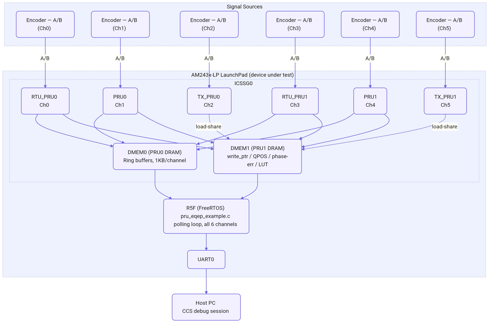
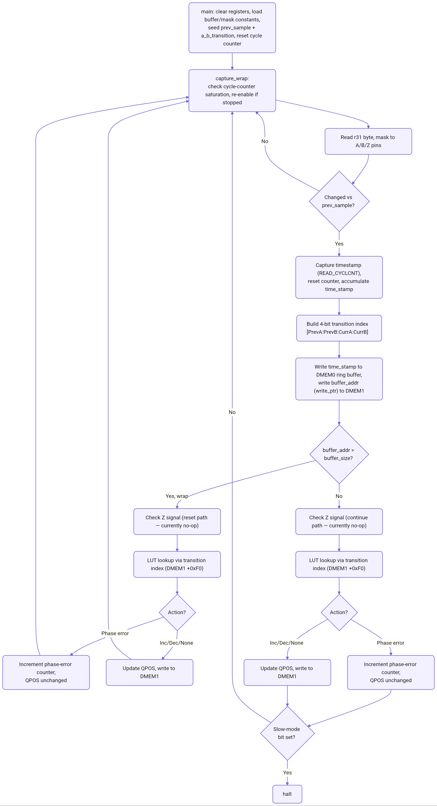
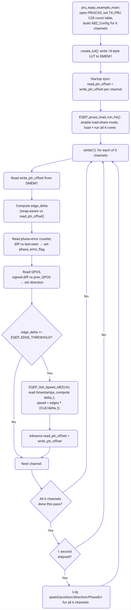

# PRU EQEP Project

## 1. Testing Done

The PRU eQEP implementation has been bench-validated against a real hardware eQEP peripheral (AM263x-LP, `eqep_position_speed` example) and a physical incremental encoder. Full test matrix, pass/fail status, and raw findings are tracked in `TESTING.md` (same folder as this readme). Summary of what has been run:

| Area | Coverage |
|---|---|
| Multi-channel operation | 3-channel and full 6-channel simultaneous operation, confirming correct GPI byte wiring (`r31.b0/b1/b2`) across all core types (RTU_PRU, PRU, TX_PRU) |
| Position accuracy | A real physical encoder wired to both the PRU firmware and the AM263x-LP's hardware eQEP0 at the same time shows matching position counts on both — PRU `QPOS` and hardware `QPOSCNT` agree for the same edge stream |
| Direction correctness | Verified with a real physical encoder (forward/reverse) and with a deterministic forward-N/reverse-N pulse sequence — `QPOS` returns exactly to its starting value |
| Mixed concurrent sources | 3 channels driven from an ePWM-based signal source, 3 from a real encoder, running at once — confirms cross-channel independence |
| Phase-error detection | Negative test: A and B tied to the same physical signal, forcing every transition through the diagonal/invalid states — counter increments, flag sets, and clears correctly with no false positives on a subsequent normal run |
| Speed calculation | Swept across 1 kHz – 500 kHz — see "Parameter Ranges Tested" below |

**Not yet exercised** (see `TESTING.md` "Pending" rows): ring-buffer wrap boundary, sustained 24-bit timestamp wrap, edge-threshold variation, idle/cycle-counter-saturation recovery. These are defined as test cases but not yet run — treat behavior in these conditions as unverified, not as "known good."

## 2. Parameter Ranges Tested

| Parameter | Range Tested | Result | Comments |
|---|---|---|---|
| A/B signal frequency | 1 kHz – 500 kHz | PASS | Position and speed both correct |
| Edge threshold (`EQEP_EDGE_THRESHOLD` / `READ_POS_SPEED_BUFF`) | Default (4 edges/interrupt) only | PENDING | Not yet swept against `0x10`/`0x40` alternatives — defined as pending test #10 |
| Channel count | 1, 3, 6 simultaneous | PASS | |
| Encoder source type | ePWM-simulated (AM263x-LP) and real physical encoder | PASS | Also tested mixed (3+3) |

**Practical floor note:** 1 kHz was the lowest frequency reachable with the ePWM test rig used, not a floor imposed by the PRU/R5F design. True near-stall behavior (approaching the ~14.3s PRU cycle-counter saturation window) has not been separately exercised.

<figure>

<figcaption>Saleae logic-analyzer capture — 50 kHz A (white) and B (orange) signals at 90° phase difference, 50.02% duty cycle</figcaption>
</figure>

## 3. Connection Details

Bench setup used for validation (see "Testing Done" above).

<figure>

<figcaption>Ch0 encoder bench setup — AM243x-LP wired to a physical incremental encoder</figcaption>
</figure>

**This photo shows a single channel (Ch0) connection only** — one encoder wired to Ch0's A/B pins on the AM243x-LP, not the full 6-channel setup. See sections 3a/3b below for how additional channels are wired, and section 6 for the full per-channel pin table.

### 3a. AM263x-LP (ePWM signal source) → AM243x-LP (device under test)

The AM263x-LP's ePWM output is a single A/B pair, **fanned out** to every channel under ePWM test — not a separate point-to-point pair per channel. All destination pins below carry the same physical A/B signal.

| Signal | AM263x-LP header pin | AM243x-LP header pin | Destination channel |
|---|---|---|---|
| A | J4.11 | J4.8 | Ch0 (RTU_PRU0) |
| A | J4.11 | J4.10 | Ch1 (PRU0) |
| A | J4.11 | J2.4 | Ch2 (TX_PRU0) |
| B | J8.59 | J4.9 | Ch0 (RTU_PRU0) |
| B | J8.59 | J2.2 | Ch1 (PRU0) |
| B | J8.59 | J2.8 | Ch2 (TX_PRU0) |

If only testing a subset of channels (e.g. single-channel sweep tests), wire J4.11/J8.59 to only that channel's A/B pins from the pin table in section 6 — the fan-out above reflects the full 3-channel ePWM test, not a requirement to always wire all three.

### 3b. Physical Incremental Encoder → AM243x-LP

Used for direction-correctness and mixed-source tests (Ch3-5 in the mixed-source test). Wire the encoder's A/B outputs directly to the target channel's header pins from section 6 — e.g. for Ch3 (RTU_PRU1): encoder A → J2.10, encoder B → J7.7. Z is not wired (see "Z-Signal / Position-Counter-Reset Behavior" — dropped from scope).

The photo above shows this pattern for Ch0 (RTU_PRU0): encoder A → AM243x-LP J4.8 (`PRG0_PRU0_GPO0`), encoder B → J4.9 (`PRG0_PRU0_GPO1`) — see section 6 for the full per-channel pin table.

### 3c. Other Bench Connections

| Component | Role | Connection |
|---|---|---|
| Saleae logic analyzer | Independent edge-count ground truth, used to validate PRU/hardware-eQEP position counts | Probe leads clipped directly onto the same A/B header pins as the channel under test (section 6) — no dedicated header, just an extra tap on the existing wire |
| Host PC | Debug console / CCS debug session | USB to AM243x-LP UART0 (via onboard USB-UART) and JTAG/XDS for CCS |

**Multiple simultaneous sources:** in the mixed-source test (3 ePWM + 3 real encoder), both sources were connected at the same time to different channel groups — Ch0-2 fanned out from the AM263x-LP ePWM pair (3a), Ch3-5 from the physical encoder (3b) — with no shared/multiplexed wiring *between* the two source types.

**If you need to wire a different channel or source than what's listed above:** find the target channel's A/B header pins in section 6's table, then run a wire from your source's A/B output pins directly to those — there's no additional configuration needed on the AM243x-LP side beyond the physical connection, since `example.syscfg`/`memory.inc` already define which GPI (and therefore which header pin) each channel listens on. If you're changing which physical pin a channel uses (not just which source drives it), see "Changing A/B/Z Pin Assignments" in the Configuration Guide instead.

## 4. System Block Diagram

<figure>

<figcaption>System block diagram — encoder signal sources, AM243x-LP ICSSG0 (6 PRU cores, DMEM0/DMEM1), R5F application, UART, host PC</figcaption>
</figure>

Notes:
- TX_PRU0/TX_PRU1 cannot access DMEM directly — `ABZ_enable_load_share_mode()` (R5F init) lets them share their slice's PRU DATARAM (dotted lines above).
- Each channel's encoder is shown independently — nothing prevents wiring multiple channels to the same physical encoder, or using different source types (ePWM-simulated, real encoder) per channel, as covered in "Testing Done" and "Connection Details" above; this diagram shows the logical per-channel signal path, not a specific bench configuration.

## 5. Flow Diagrams

### 5a. PRU Firmware Flow (`firmware/main.asm`, identical on all 6 cores)

<figure>

<figcaption>PRU firmware flow — edge detection, timestamp capture, LUT lookup, QPOS/phase-error update (main.asm)</figcaption>
</figure>

Note: the diagram shows one merged path — the actual assembly duplicates the Z-check/LUT-lookup/QPOS-update logic once on the buffer-wrap branch and once on the continue branch (see `main.asm`), not because they behave differently, but to avoid an extra branch back into a shared block. Interrupt firing (every `READ_POS_SPEED_BUFF` edges, via `r31.b0`) happens inside the "Write to DMEM0/DMEM1" step and is omitted here for clarity.

### 5b. R5F Application Flow (`mcuplus/pru_eqep_example.c`, polling mode)

<figure>

<figcaption>R5F application flow — init, LUT write, startup sync, polling loop (pru_eqep_example.c)</figcaption>
</figure>

Note: phase-error and position/direction reads happen every pass, unconditionally — only the speed calculation is gated by `EQEP_EDGE_THRESHOLD`. There are no ISRs anywhere in this flow (see "Switching from Polling Mode to Interrupt Mode" below for the alternative).

## 6. PRU Pins / Jumper Header Pins Used

GPI numbers below are **slice-local absolute** values (0-19 within each PRU slice — see `firmware/main.asm`'s `cur_sample` byte selection: RTU_PRU0/PRU0/TX_PRU0 all read `r31.b0` on the PRU0 slice, so their GPI numbers land directly in the `A_SIGNAL_GPI`/`B_SIGNAL_GPI` constants in `memory.inc`; RTU_PRU1 reads its slice's `r31.b0` while PRU1/TX_PRU1 read `r31.b1`, so their `memory.inc` constants are byte1-relative and the `-8` in `memory.inc` converts back to the slice-absolute GPI number used here and in `example.syscfg`).

| Channel | Core | Signal | GPI # (slice-absolute) | PRU net name (`example.syscfg`) | LaunchPad header pin |
|---|---|---|---|---|---|
| 0 | RTU_PRU0 | A | GPI0 | PRG0_PRU0_GPO0 | J4.8 |
| 0 | RTU_PRU0 | B | GPI1 | PRG0_PRU0_GPO1 | J4.9 |
| 1 | PRU0 | A | GPI2 | PRG0_PRU0_GPO2 | J4.10 |
| 1 | PRU0 | B | GPI3 | PRG0_PRU0_GPO3 | J2.2 |
| 2 | TX_PRU0 | A | GPI4 | PRG0_PRU0_GPO4 | J2.4 |
| 2 | TX_PRU0 | B | GPI5 | PRG0_PRU0_GPO5 | J2.8 |
| 3 | RTU_PRU1 | A | GPI0 | PRG0_PRU1_GPO0 | J2.10 |
| 3 | RTU_PRU1 | B | GPI1 | PRG0_PRU1_GPO1 | J7.7 |
| 4 | PRU1 | A | GPI11 | PRG0_PRU1_GPO11 | J7.10 |
| 4 | PRU1 | B | GPI12 | PRG0_PRU1_GPO12 | J8.9 |
| 5 | TX_PRU1 | A | GPI13 | PRG0_PRU1_GPO13 | J8.10 |
| 5 | TX_PRU1 | B | GPI15 | PRG0_PRU1_GPO15 | J6.2 |

Z signal pins omitted — not a customer requirement, not wired/tested (see `TESTING.md` #11, dropped from scope).

## 7. Debug Tips

- **Check `PhaseErr` first if position looks wrong.** Phase error is detected when A and B transition simultaneously — the PRU firmware's LUT lookup returns `3` (diagonal/invalid state), increments `PHASE_ERR_CNT` in DMEM1 for that channel, and skips the QPOS update for that edge. On the R5F side, the polling loop compares `PHASE_ERR_CNT` against `phase_err_count_last_seen` each pass — if it has moved, `phase_error_flag` is set to `1` (sticky). The 1-second status print logs this as `PhaseErr: Ch0=... Ch5=...`. `QPOS` is not corrupted by phase-error events (the edge is skipped, not miscounted), but a set flag means real edges are being lost or misread — check wiring/noise on that channel's A/B lines. To clear the flag once the root cause is fixed, call `EQEP_PRU_clearPhaseErrorFlag(channel)` — this zeroes only the R5F-local `phase_error_flag` and never touches DMEM1 or the PRU-side `PHASE_ERR_CNT` (single-owner rule: PRU owns that counter, R5F only reads it).
- **`QPOS` lags the ring buffer by one edge.** The firmware publishes the timestamp/write-pointer for the *current* edge before updating `QPOS` for it — this is expected, not a bug, if you see `QPOS` one edge "behind" the buffer contents in a memory dump.
- **Speed reads 0 or garbage after ~55ms of silence on a channel.** `EQEP_Get_Speed_ABZ`'s `delta_t` is derived from a 24-bit-masked timestamp that wraps every ~55ms at 300 MHz — a divide-by-zero guard is not yet in place. If you hit this, it's the known gap, not new.
- **Direction flips unexpectedly.** Already fixed for the 32-bit `QPOS` wraparound boundary (`0xFFFFFFFF → 0`) via a signed-diff comparison — if you see a wrong direction reading anywhere else, it's a new bug, not a recurrence of that one.
- **A channel shows no activity at all.** Confirm `A_B_Z_GPI_mask`/`A_SIGNAL_GPI`/`B_SIGNAL_GPI` in `memory.inc` for that core match the actual pin wiring and `example.syscfg` mux assignment — the two must agree (see "Configuring A/B/Z Pin Assignments").
- **Check the raw A/B input directly on `r31` before suspecting firmware logic.** Each PRU core's live GPI state is `r31` — halt the core in a CCS debug session (Registers view or `r31` in the Watch window) and confirm the bits toggle as the encoder is rotated by hand:
  - RTU_PRU0/PRU0/TX_PRU0 (Ch0/1/2) all read the *same* physical byte, `r31.b0` — use each core's `A_B_Z_GPI_mask` from `memory.inc` to know which bits in that shared byte are that channel's A/B (e.g. Ch0 = bits 0,1; Ch1 = bits 2,3; Ch2 = bits 4,5).
  - RTU_PRU1 (Ch3) reads its own slice's `r31.b0`; PRU1/TX_PRU1 (Ch4/Ch5) read `r31.b1` instead — same idea, different byte.
  - If `r31` never changes while the encoder is turning, the problem is upstream of the firmware entirely (wiring, `example.syscfg` pinmux, or a dead encoder) — no point debugging `main.asm`'s edge-detection logic until this checks out.
  - If `r31` toggles correctly but `QPOS`/`write_ptr_offset` in DMEM1 don't move, the input path is fine and the bug is in the firmware's edge-detect/LUT logic instead — this check is what narrows down which side of that boundary to debug.
- **TX_PRU channels (Ch2/Ch5) behave oddly right after boot.** TX_PRU cores can't access DMEM directly — confirm `ABZ_enable_load_share_mode()` ran successfully for that slice before any channel-2/5 debugging; if load-share mode isn't enabled, TX_PRU0/1 can't reach PRU DATARAM at all.
- **Use the CCS Memory Browser on DMEM1** (`0x00`–`0x14` write pointers, `0x1C`–`0x30` QPOS, `0x34`–`0x48` phase-error counters, `0xF0` LUT) to see raw per-channel state without instrumenting the R5F app.

## 8. Configuration Guide

How to change commonly-adjusted parameters in this firmware/application. Each subsection below is a self-contained worked example.

### 8a. Changing A/B/Z Pin Assignments

1. Update `A_SIGNAL_GPI`, `B_SIGNAL_GPI`, `Z_SIGNAL_GPI`, and `A_B_Z_GPI_mask` in `firmware/include/memory.inc`, in that core's `.if $isdefed(...)` block.
2. Update the corresponding GPI pin's mux assignment in `example.syscfg` (`PruGPIO[...].PRU_ICSSG0_PRU.GPIx`) — see the pin table in section 6 for current net-name mappings.
3. Rebuild the firmware project for that core and the R5F project. Both `memory.inc` and `example.syscfg` must agree — a mismatch here silently wires the firmware to the wrong physical pin.

Constraint: pin choice is only free *within* the byte a core type already reads (RTU_PRU → GPI0-7, PRU → GPI8-15, TX_PRU → GPI16-23) — that byte split is hardware-fixed, not configurable.

### 8b. Switching from Polling Mode to Interrupt Mode

This example's R5F application (`pru_eqep_example.c`) runs in **polling mode** by default — a single `while(1)` loop round-robins all 6 channels, no ISRs registered. An interrupt-driven variant also exists (`eqep_diagnostic.c`) and was the original design.

| | Polling mode (default, this example) | Interrupt mode (`eqep_diagnostic.c`) |
|---|---|---|
| R5F structure | Single loop, checks `edge_delta >= EQEP_EDGE_THRESHOLD` per channel per pass | 6 ISRs (`HwiP_construct` per channel), triggered by PRU→R5F PRUICSS interrupt |
| PRU firmware | No change either way — PRU does not fire any INTC event in polling mode; `PRUICSS_clearEvent` is called in the polling loop to drain any stale pending bits | Same firmware, INTC event fired via `r31.b0` every `READ_POS_SPEED_BUFF` edges, consumed by ISR |
| Debugging | Single execution context, no ISR preemption | 6 interrupt contexts, ISR-safe constraints apply |

To switch to interrupt mode, port the ISR registration pattern from `eqep_diagnostic.c` (`HwiP_construct` per channel, `App_ABZIntrISRx` callbacks) into `pru_eqep_example.c`, and remove the polling `while(1)` edge-delta check.

### 8c. Z-Signal / Position-Counter-Reset Behavior

The firmware detects Z-signal transitions but the position-reset-on-Z action is **intentionally commented out**:

```asm
; Handle Z signal reset
qbbs    Z_interrupt0, r31, Z_SIGNAL_GPI
;zero    &QPOS, 4
Z_interrupt0:
```

This is disabled because Z-based position reset was raised and then explicitly dropped as a customer requirement — not a bug or an oversight. Real hardware eQEP's `QPOSMAX`/`PCRM` (position-counter-reset-mode) semantics, which this would need to approximate, only make sense with a Z pulse establishing an unambiguous reset point once per revolution; without validating that Z is wired and firing correctly on real hardware, uncommenting this line would silently reset `QPOS` on every Z edge, valid or not.

To re-enable: uncomment the `zero &QPOS, 4` line in **both** duplicated LUT-handling blocks in `main.asm` (the buffer-wrap-reset path and the normal-continuation path use separate copies of this logic), rebuild, and bench-test against a real encoder's Z pulse before trusting it — this path has no existing test coverage (see `TESTING.md` test #11, dropped from scope).

### 8d. Configuring Position Counter Wraparound (QPOSMAX / Pulses-Per-Revolution)

`QPOS` (the PRU's free-running position register) is bounded to `[0, QPOSMAX]` instead of wrapping across the full 32-bit range. On increment past `QPOSMAX`, `QPOS` reloads to `0`; on decrement below `0`, `QPOS` reloads to `QPOSMAX`. This mirrors real hardware eQEP's `QPOSMAX` bound (SPRU790D) and needs to match your encoder's pulses-per-revolution (PPR), not the default test value.

`QPOSMAX` is a single build-time constant in `firmware/include/macros.inc`:

```asm
; Position counter maximum value (QPPR * 4 - 1)
QPOSMAX .set 3999
```

`3999` is `1000 × 4 − 1`, for a 1000 PPR encoder in ×4 quadrature decoding (4 counts per line). To match a different encoder, set `QPOSMAX = (PPR × 4) − 1`.

1. Edit `QPOSMAX` in `firmware/include/macros.inc` to `(your encoder's PPR × 4) − 1`.
2. Rebuild the firmware project for the target core(s) — `QPOSMAX` is compile-time, not read from DMEM1, so a rebuild+reflash is required; there's no R5F-side equivalent to update.

**Not yet runtime-configurable** — this is a per-build constant today, shared identically across all 6 cores/channels. Making it a per-channel, R5F-writable DMEM1 value (so different channels could use different PPR encoders without separate firmware builds) is an open item tracked under the customer's Parameter Configuration ask (see `progress.md`).

## 9. References

- [PRU-ICSS Documentation](https://www.ti.com/tool/PRU-ICSS)
- [MCU+ SDK AM243x](https://www.ti.com/tool/MCU-PLUS-SDK-AM243X)
- [AM243x-LP LaunchPad tool page](https://www.ti.com/tool/LP-AM243)
- [PRU-CGT (ti-pru-cgt) tool page](https://www.ti.com/tool/PRU-CGT) — required toolchain, see Steps to Run
- SPRU790D — [AM243x/AM64x eQEP peripheral reference](https://www.ti.com/lit/ug/spruim2h/spruim2h.pdf) (real hardware eQEP semantics this PRU implementation approximates: diagonal-transition/phase-error definition, QPOSMAX/PCRM behavior)
- [PRU-ICSS Reference Guide](https://www.ti.com/lit/ug/spruij1/spruij1.pdf) — PRU core architecture, DMEM/load-share mode, INTC
