<div align="center">

# PRU I2S/TDM Audio Interface

</div>

[Introduction](#introduction) | [Setup](#setup-details) | [Hardware](#hardware-requirements) | [Software](#software-requirements) | [Building](#building-the-project) | [Architecture](#architecture) | [Testing](#testing)

## Introduction

This example demonstrates the usage of PRU-ICSS to implement an I2S (Inter-IC Sound) and TDM (Time Division Multiplexing) audio interface on AM263x/AM261x processors. The PRU-ICSS subsystem emulates an I2S/TDM master, enabling transmission and reception of audio data with deterministic real-time performance.

### Key Features
- **Dual Protocol Support**: I2S (stereo) and TDM4 (4-channel) implementations
- **Ping-Pong Buffering**: Dual 128-byte buffers for continuous audio streaming
- **External Clock Sync**: Synchronized with external BCLK and FSYNC signals
- **Interrupt-Driven**: Efficient buffer management with minimal CPU overhead
- **Low Latency**: Real-time audio processing with deterministic timing
- **Dual PRU Cores**: PRU0 for TX, PRU1 for RX

### How It Works
The PRU firmware executes on 2 PRU cores (PRU0 for Tx and PRU1 for Rx) to handle audio data streams from external sources and generate standard I2S/TDM data streams synchronized with external audio clocks (BCLK, FSYNC).

**Double Buffering Technique:**
- **RX**: Interrupt generated after receiving 128 bytes; Buffer 0 and Buffer 1 used in ping-pong fashion
- **TX**: Interrupt generated after transmitting 128 bytes; Buffer 0 and Buffer 1 used in ping-pong fashion

This ensures continuous and efficient data transmission/reception with minimal latency and overhead.

---

## Supported Devices

| Device | Board | ICSS Instance | Status |
|--------|-------|---------------|--------|
| AM263x | Control Card (CC) + HSECDOCK | ICSSM0 | ✓ Tested |
| AM261x | LaunchPad (LP) E1 | ICSSM1 | ✓ Tested |

---

## Setup Details

### Hardware Requirements

#### AM263x Control Card Setup
**Required Equipment:**
- AM263x Control Card (CC) [TMDSCNCD263](https://www.ti.com/tool/TMDSCNCD263)
- TMDSHSECDOCK HSEC180 control card Baseboard Docking Station [HSECDOCK](https://www.ti.com/tool/TMDSHSECDOCK)
- Power Supply: 5V, 3A PSU or USB Type-C AC/DC 5V/3A
- TLV320AIC3254 Audio Codec EVM [TLV320AIC3254EVM-K](https://www.ti.com/tool/TLV320AIC3254EVM-K)
- Function generator (for MCLK)
- Logic analyzer (for debugging)

#### AM261x LaunchPad Setup
**Required Equipment:**
- AM261x-LP E1 [LP-AM261](https://www.ti.com/tool/LP-AM261)
- Power Supply: 5V, 3A PSU
- PCM6260-Q1 Audio ADC EVM [PCM6260-Q1](https://www.ti.com/product/PCM6260-Q1)
- Function generator (for MCLK)
- Logic analyzer (for debugging)

### Software Requirements

**Development Tools:**
- Code Composer Studio 12.8.1
- SysConfig 1.23.1
- MCU+ SDK AM263x 10.2
- MCU+ SDK AM261x 10.2
- PRU Code Generation Tools (included in CCS)

**Audio Codec Software:**
- PUREPATHCONSOLE 3 Application (for TLV320AIC3254)
- AIC3254 01.00.00.0A [SLAC349](https://www.ti.com/tool/download/SLAC349)
- PCM6260Q1 APP [PCM6260QEVM-SW](https://www.ti.com/secureresources/PCM6260QEVM-SW)

### Hardware Connections

#### AM263x CC + TLV320AIC3254 Setup

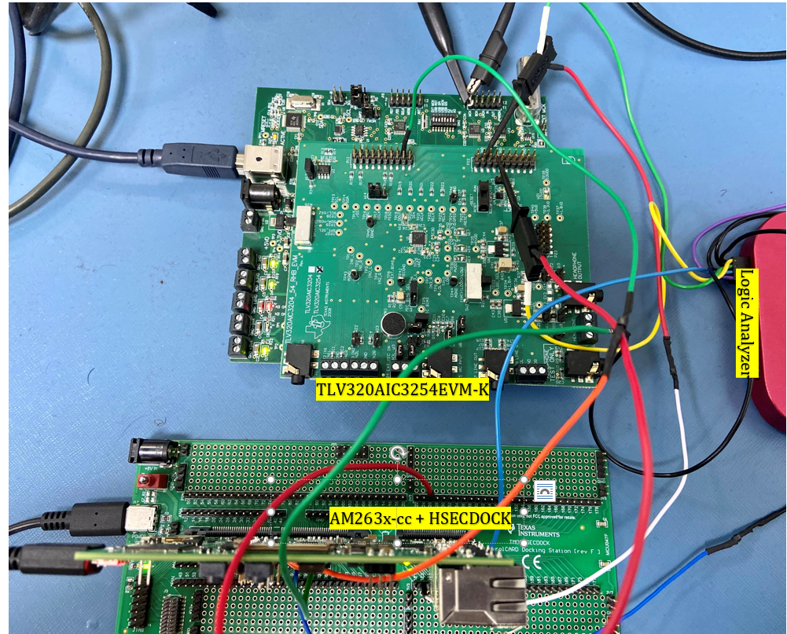

**Block Diagram:**
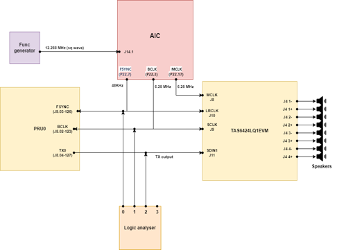

**Connection Steps:**
1. **Connect AM263x CC to HSECDOCK:**
   - AM263x CC 120 Pin Primary Card-Edge → HSECDOCK J3A
   - AM263x CC 60 Pin Secondary Card-Edge → HSECDOCK J3B

2. **Configure AIC3254 EVM:**
   - Connect PC via USB cable to J7
   - Set SW2: positions 1,3,6,7 ON
   - For external audio interface: SW2.4,5 OFF

3. **Audio Clock Connections:**
   - Function generator MCLK → AIC J14.1 MCLK
   - AIC P22.3 BCLK → HSECDOCK J8.02 (pin 123)
   - AIC P22.7 WCLK → HSECDOCK J9.03 (pin 126)

#### AM261x LP + PCM6260-Q1 Setup

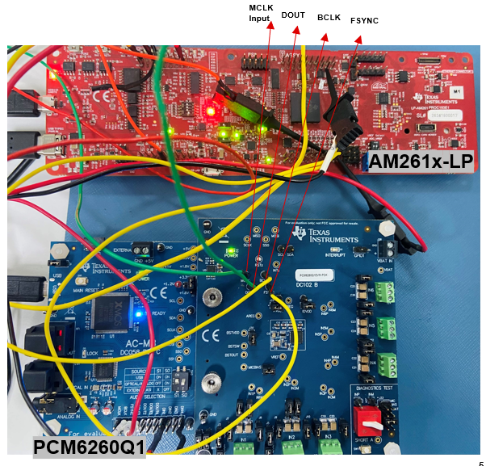

**Block Diagram:**
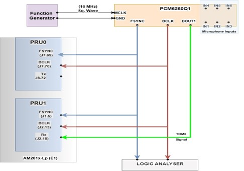

**Connection Steps:**
1. **Configure PCM6260-Q1 EVM:**
   - Connect PC via USB cable
   - Set SW2 for External ASI mode:
     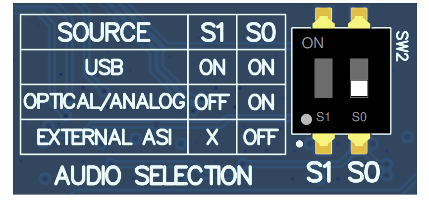

2. **Audio Clock Connections:**
   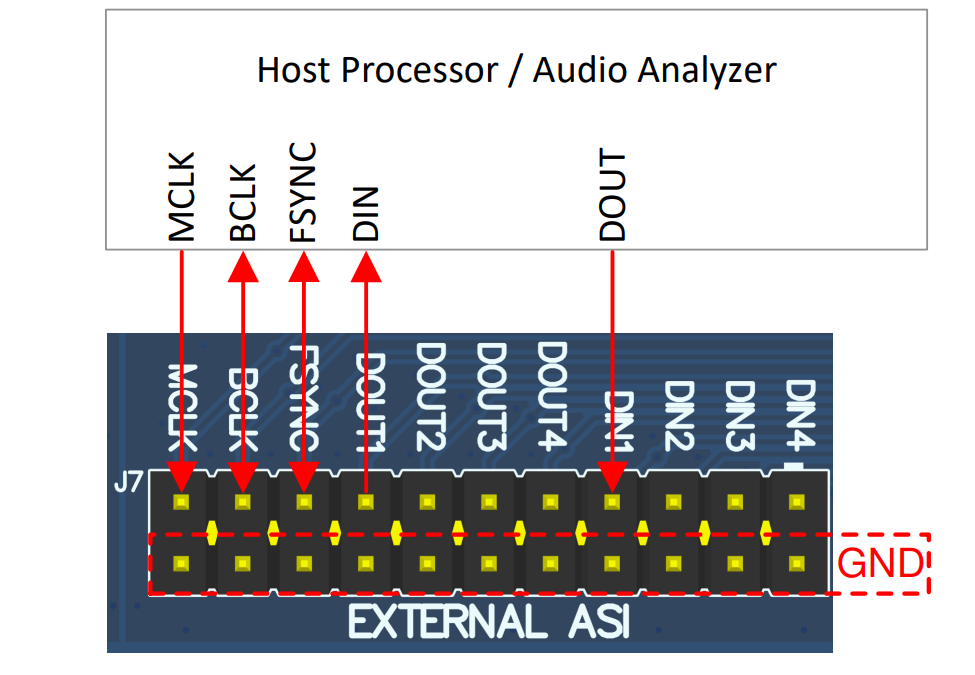
   - Function generator (16MHz) → PCM6260 J7 MCLK
   - PCM6260 J7 BCLK → AM261x LP J2.13
   - PCM6260 J7 FSYNC → AM261x LP J1.5
   - PCM6260 J7 DOUT1 → AM261x LP J2.18

3. **Open PCM6260 GUI** for codec configuration

> **Note:** TLV320AIC3254EVM-K can also be used with AM261x for generating external clock sources.

### PRU Pin Assignments

#### AM263x CC Pin Mapping
| PRU Core | I2S Signal | PRU GPIO | Direction | HSECDOCK Pin |
|----------|------------|----------|-----------|--------------|
| PRU0 | BCLK | PR0_PRU0_GPIO6 | INPUT | J8.02 (123) |
| PRU0 | FSYNC | PR0_PRU0_GPIO1 | INPUT | J9.03 (126) |
| PRU0 | TX | PR0_PRU0_GPIO2 | OUTPUT | J8.04 (127) |
| PRU1 | BCLK | PR0_PRU1_GPIO0 | INPUT | J8.11 (143) |
| PRU1 | FSYNC | PR0_PRU1_GPIO1 | INPUT | J9.11 (144) |
| PRU1 | RX | PR0_PRU1_GPIO2 | INPUT | J8.12 (145) |

#### AM261x LP Pin Mapping
| PRU Core | I2S Signal | PRU GPIO | Direction | Header Pin |
|----------|------------|----------|-----------|------------|
| PRU0 | BCLK | PR1_PRU0_GPIO5 | INPUT | J7.70 |
| PRU0 | FSYNC | PR1_PRU0_GPIO6 | INPUT | J7.69 |
| PRU0 | TX | PR1_PRU0_GPIO7 | OUTPUT | J8.72 |
| PRU1 | BCLK | PR1_PRU1_GPIO5 | INPUT | J2.13 |
| PRU1 | FSYNC | PR1_PRU1_GPIO9 | INPUT | J1.5 |
| PRU1 | RX | PR1_PRU1_GPIO12 | INPUT | J2.18 |

---

## Project Directory Structure

```
pru_i2s/
├── README.md                    # This file
├── makefile                     # Top-level makefile
├── firmware/                    # PRU firmware source code
│   ├── include/                # Shared firmware headers
│   ├── I2S/                    # I2S protocol implementation
│   │   ├── pru_i2s_main.asm   # Main firmware logic
│   │   ├── fw_regs.asm        # Register definitions
│   │   ├── linker.cmd         # Linker script
│   │   ├── icss_pru_i2s_fw.h  # Firmware register map
│   │   ├── pru_i2s_interface.h # Interface definitions
│   │   ├── pru_i2s_regs.h     # Hardware registers
│   │   ├── pru0_tx/           # TX firmware builds
│   │   │   ├── am261x-lp/     # AM261x variant
│   │   │   └── am263x-cc/     # AM263x variant
│   │   └── pru1_rx/           # RX firmware builds
│   │       ├── am261x-lp/
│   │       └── am263x-cc/
│   └── TDM4/                   # TDM4 protocol (parallel structure)
│       └── (same as I2S)
├── driver/                      # PRU I2S driver implementation
│   └── pru_i2s_drv.c           # Driver source (~2400 lines)
├── include/                     # Driver public headers
│   ├── pru_i2s_drv.h           # Driver API (~1000+ lines)
│   └── pru_i2s_pruss_intc_mapping.h  # INTC definitions
├── pru_i2s_app/                 # R5F host application
│   ├── board/                  # Board support files
│   │   ├── ioexp_tca6416.c    # IO expander driver
│   │   └── ioexp_tca6416.h
│   ├── pru_i2s_diagnostic.c    # Main application
│   ├── data.h                  # Test data
│   ├── am261x-lp/r5fss0-0_freertos/
│   └── am263x-cc/r5fss0-0_freertos/
└── images/                      # Documentation images
```

---

## Building the Project

### Building with Makefiles (Command Line)

**Prerequisites:**
- Set `DEVICE` environment variable in `imports.mak`
- Ensure CCS utils are in PATH (for gmake on Windows)

**Build all firmware and application:**
```bash
cd /path/to/open-pru
make DEVICE=am261x        # Build for AM261x
make DEVICE=am263x        # Build for AM263x
```

**Build only firmware:**
```bash
cd examples/pru_i2s
make DEVICE=am261x        # Builds 4 firmware variants (I2S + TDM4, PRU0 + PRU1)
```

**Clean:**
```bash
make DEVICE=am261x clean
```

**What gets built:**
- 4 PRU firmware binaries per device (I2S PRU0 TX, I2S PRU1 RX, TDM4 PRU0 TX, TDM4 PRU1 RX)
- Firmware header arrays (`.h` files for embedding in application)
- R5F application binary (`.out` and `.appimage`)

### Building with Code Composer Studio

**Import Firmware Projects:**
1. Open CCS
2. Project → Import CCS Projects
3. Navigate to `examples/pru_i2s/firmware/I2S/pru0_tx/am261x-lp/icssm0-pru0_fw/ti-pru-cgt/`
4. Select `example.projectspec`
5. Click Finish
6. Repeat for other firmware variants (pru1_rx, TDM4, etc.)

**Import R5F Application:**
1. Navigate to `examples/pru_i2s/pru_i2s_app/am261x-lp/r5fss0-0_freertos/ti-arm-clang/`
2. Import `example.projectspec`

**Build Order:**
1. Build PRU firmware first (generates header arrays)
2. Build R5F application (includes firmware headers)

**Debug Configuration:**
Refer to MCU+ SDK documentation:
- [AM261x SDK Guide](https://software-dl.ti.com/mcu-plus-sdk/esd/AM261X/latest/exports/docs/api_guide_am261x/CCS_PROJECTS_PAGE.html)
- [AM263x SDK Guide](https://software-dl.ti.com/mcu-plus-sdk/esd/AM263X/latest/exports/docs/api_guide_am263x/CCS_PROJECTS_PAGE.html)

---

## Architecture

### R5F Host Software

The R5F application initializes PRU-ICSSG, downloads firmware to PRU cores, and starts execution. After firmware starts, PRUs operate independently without R5F intervention.

**Software Layers:**
```
┌─────────────────────────────┐
│   R5F Application           │
│   (pru_i2s_diagnostic.c)    │
├─────────────────────────────┤
│   PRU I2S Driver            │
│   (pru_i2s_drv.c)           │
├─────────────────────────────┤
│   MCU+ SDK Drivers          │
│   (PRUICSS, GPIO, etc.)     │
├─────────────────────────────┤
│   SysConfig Generated       │
│   (pinmux, clock, INTC)     │
└─────────────────────────────┘
         ↓ firmware download
┌─────────────────────────────┐
│   PRU0 Firmware (TX)        │
│   PRU1 Firmware (RX)        │
└─────────────────────────────┘
```

#### SysConfig Usage

The R5F application uses SysConfig to configure PRUICSS:

**ICSSM Configuration:**
- Instance: ICSSM1 (AM261x) or ICSSM0 (AM263x)
- PRU Clock: 333 MHz (maximizes processing cycles)

**GPIO Pin Configuration:**
- **PRU0 (TX):**
  - BCLK: PRU_GPI, Rx active, Pull Down
  - FSYNC: PRU_GPI, Rx active, Pull Down
  - TX: PRU_GPO, Tx active, No Pull
- **PRU1 (RX):**
  - BCLK: PRU_GPI, Rx active, Pull Down
  - FSYNC: PRU_GPI, Rx active, Pull Down
  - RX: PRU_GPI, Rx active, No Pull

#### Driver API Usage

**Initialization:**
```c
PRUI2S_init()                 // Read firmware config, update driver tables
PRUI2S_getInitCfg()          // Get buffer sizes, sampling freq, slot width
PRUI2S_paramsInit()          // Set default parameters
PRUI2S_open()                // Clear IMEM/DMEM, init INTC, download firmware
PRUI2S_pruGpioPadConfig()    // Configure I2S signal pins
PRUI2S_initPpBufs()          // Initialize ping-pong buffers
```

**Interrupt Management:**
```c
PRUICSS_intcSetSysEvtChMap() // Map system events to channels
PRUI2S_enableInt()           // Enable TX/RX interrupts
PRUI2S_disableInt()          // Disable interrupts
PRUI2S_clearInt()            // Clear interrupt flags
```

### PRU Firmware Architecture

#### PRU0 Transmit (TX)
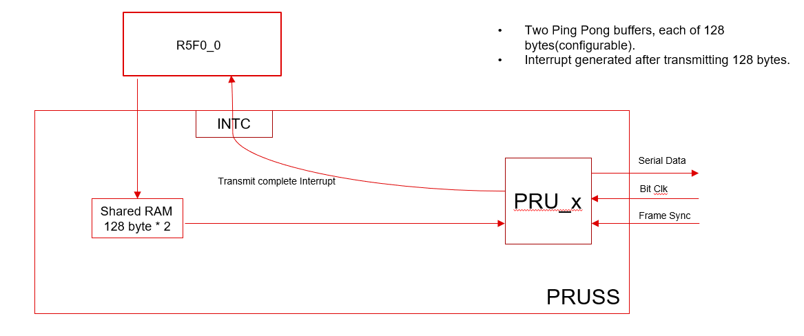
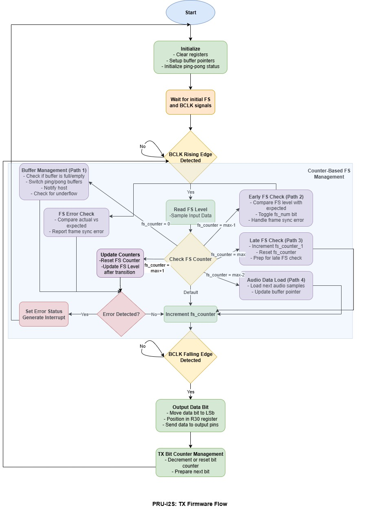

**Operation:**
1. Wait for FSYNC edge
2. Load audio data from ping-pong buffer
3. Transmit data synchronized to BCLK
4. Generate interrupt when buffer empty
5. Switch to alternate buffer

#### PRU1 Receive (RX)
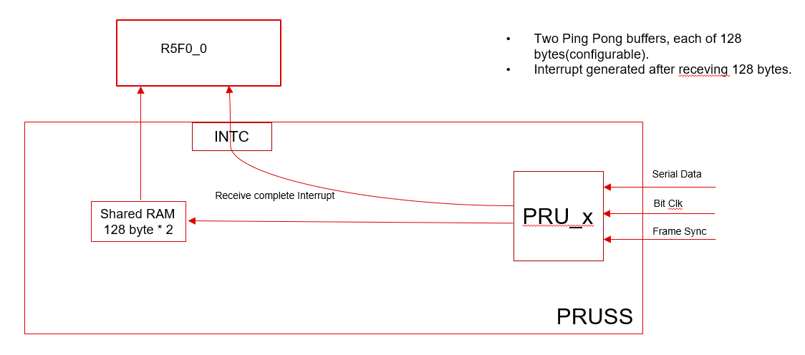
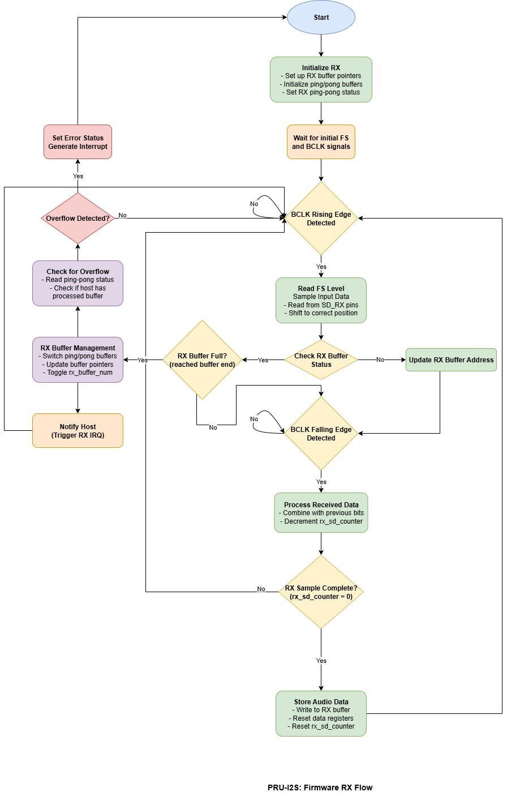

**Operation:**
1. Wait for FSYNC edge
2. Receive audio data synchronized to BCLK
3. Store data in ping-pong buffer
4. Generate interrupt when buffer full
5. Switch to alternate buffer

#### Memory Layout
- **PRU_IMEM**: 16 KB instruction memory (firmware code)
- **PRU_DMEM**: Data memory (ping-pong buffers, registers)
- **PRU_SHAREDMEM**: 64 KB shared memory (communication with R5F)

#### Interrupt Handling
Interrupts trigger on:
- TX buffer transmission complete
- RX buffer filled
- Buffer underrun/overrun errors
- Clock/frame sync errors

### Firmware Configuration

Configurable parameters in `firmware/I2S/pru_i2s_interface.h` or `firmware/TDM4/pru_i2s_interface.h`:

```c
// Bytes per channel
#define BYTES_TO_LOAD              <value>

// Samples per slot/channel
#define I2S_SAMPLES_PER_CHANNEL    <samples>
#define I2S_SAMPLES_PER_CHANNEL_LESS_1  (I2S_SAMPLES_PER_CHANNEL-1)

// TDM channels (TDM4 only)
#define TDM_CHANNELS               <channels>
#define MAX_TDM_CHANNELS           <max_slots>
```

---

## Testing

### RX Testing Procedure

**Setup:**
1. Configure PCM6260 device with desired I2S/TDM parameters
   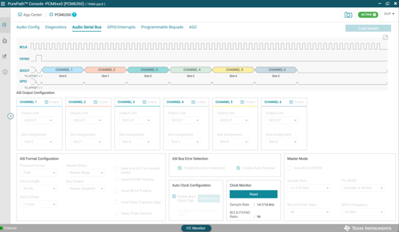
   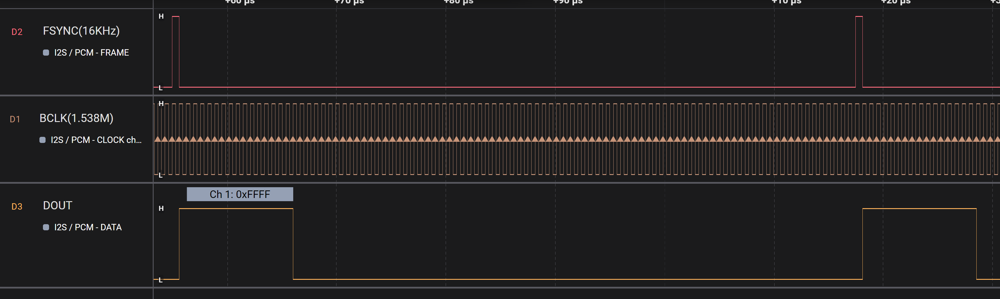

2. Play sine wave audio (e.g., 1 kHz) to PCM device microphones

**Verification:**
- Use CCS Graph tool to plot `gPPruI2s1RxBuf` data
- Should observe sine wave pattern
  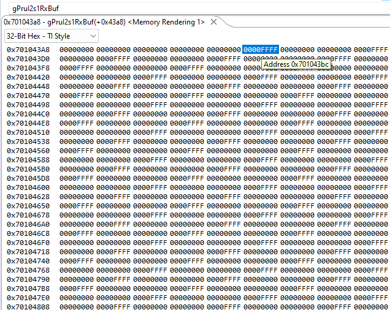

**Alternative:**
- Connect external I2S/TDM signal generator to PRU1 RX pin
- Observe captured data in `gPPruI2s1RxBuf`

### TX Testing Procedure

**Setup:**
1. Store audio samples in `gPPruI2s0TxBuf`
   - Can capture via Ethernet or other source

**Verification:**
- Probe PRU0 TX pin with logic analyzer
- Should see I2S data signals
- Feed signal to amplifier (e.g., TAS6424 Class-D amp)
- Verify audio playback

### Debug Tips

**Common Issues:**
- **No data received:** Check BCLK/FSYNC connections and clock source
- **Corrupted audio:** Verify buffer sizes match firmware configuration
- **Interrupts not firing:** Check INTC mapping and system event configuration
- **Timing issues:** Ensure PRU clock is 333 MHz for optimal performance

**CCS Debugging:**
- Use Memory Browser to inspect ping-pong buffers
- Set breakpoints in interrupt handlers
- Monitor `gPPruI2s0TxBuf` and `gPPruI2s1RxBuf` in real-time

---

## Performance Characteristics

| Metric | Value |
|--------|-------|
| PRU Clock | 333 MHz |
| Buffer Size | 128 bytes (configurable) |
| Latency | < 1 ms (ping-pong buffering) |
| Sample Rates | 8 kHz - 192 kHz (configurable) |
| Bit Depths | 16/24/32-bit |
| I2S Channels | 2 (stereo) |
| TDM4 Channels | 4 |

---

## Protocol Details

### I2S Protocol
- Standard I2S format
- Left/Right channel interleaved
- FSYNC = Word Select (LRCLK)
- Data valid on BCLK edges

### TDM4 Protocol
- 4-channel time division multiplexing
- Sequential channel slots
- FSYNC marks frame boundary
- Supports multi-microphone arrays

---

## References

- [PRU-ICSS Documentation](https://www.ti.com/tool/PRU-ICSS)
- [MCU+ SDK AM261x](https://www.ti.com/tool/MCU-PLUS-SDK-AM261X)
- [MCU+ SDK AM263x](https://www.ti.com/tool/MCU-PLUS-SDK-AM263X)
- [I2S Specification](https://www.sparkfun.com/datasheets/BreakoutBoards/I2SBUS.pdf)
- [TLV320AIC3254 Datasheet](https://www.ti.com/product/TLV320AIC3254)
- [PCM6260-Q1 Datasheet](https://www.ti.com/product/PCM6260-Q1)

---

## License

See the top-level LICENSE file in the open-pru repository.

---

## Support

For questions or issues:
- [TI E2E Forums](https://e2e.ti.com/)
- [open-pru GitHub Discussions](https://github.com/TexasInstruments/open-pru/discussions)
