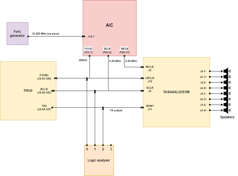
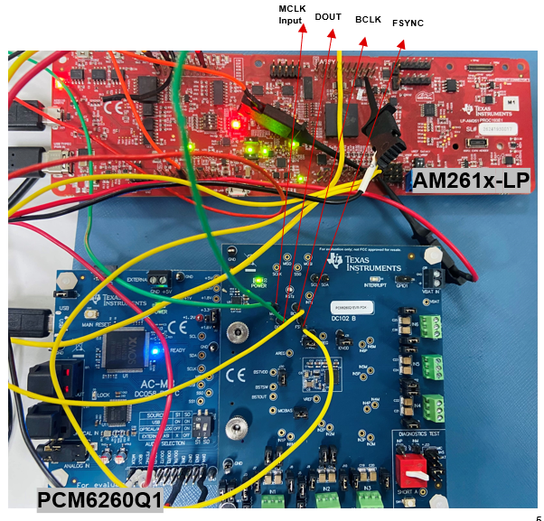
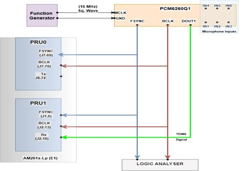
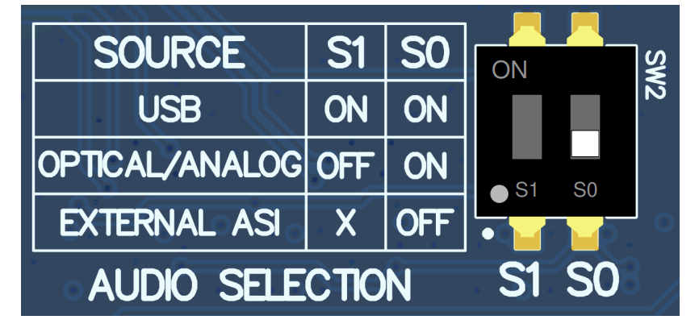
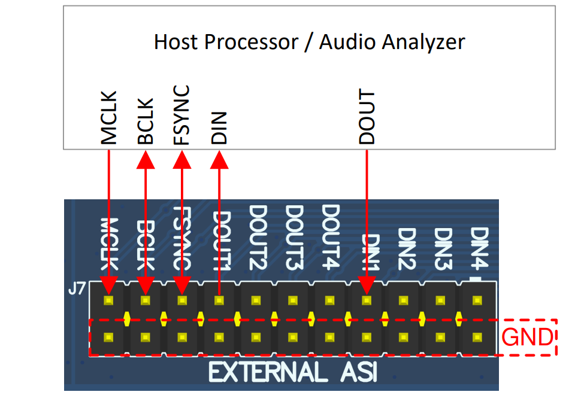
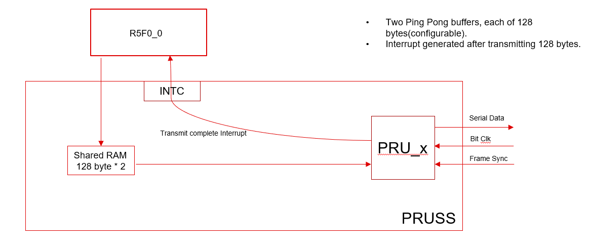
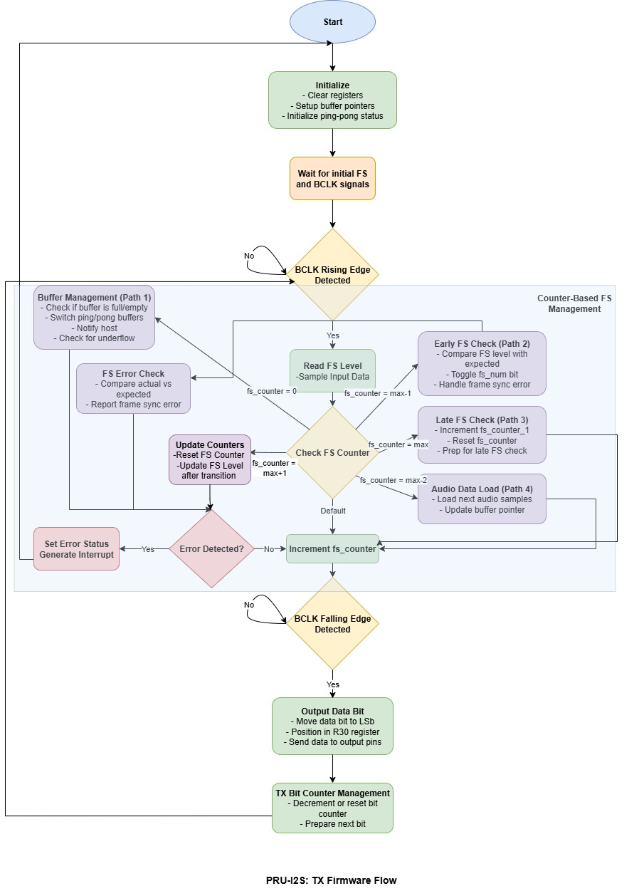
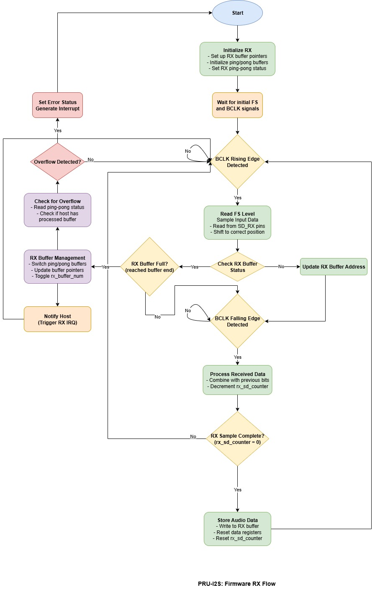
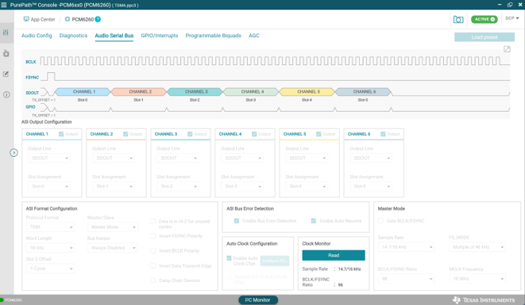
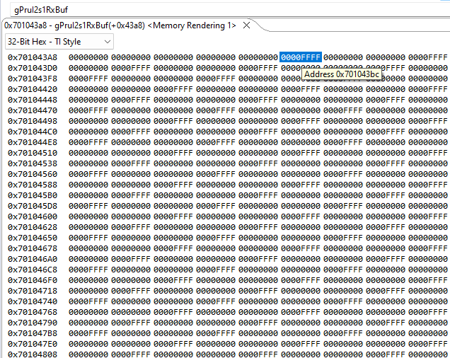

# PRU-I2S/TDM

## Introduction

This example demonstrates the usage of PRU-ICSS to implement an I2S (Inter-IC Sound) and TDM (time division multiplexing) interface on the AM263x/AM261x processors. The PRU-ICSS subsystem is utilized to emulate an I2S/TDM master, allowing for transmission and reception of audio data over the PRU-I2S interface. The PRU firmware, executing on 2 PRU cores (PRU0 for Tx and PRU1 for Rx), has been implemented to handle audio data streams from the external sources and generate standard I2S/TDM data streams which is in sync with external clock audio clocks (BCLK, FSYNC). The I2S interface uses two Ping Pong buffers, each 128 bytes (configurable), for RX and TX.

- RX: Interrupt generated after receiving 128 bytes, Buffer 0 and Buffer 1 used in a Ping Pong fashion.
- TX: Interrupt generated after transmitting 128 bytes, Buffer 0 and Buffer 1 used in a Ping Pong fashion.

This double buffering technique ensures continuous and efficient data transmission and reception with minimal latency and overhead.
## Setup Details

### Hardware Requirements
#### AM263xCC
The following hardware is used for testing :  
-	AM263x Control Card (CC) [TMDSCNCD263](https://www.ti.com/tool/TMDSCNCD263)
-	TMDSHSECDOCK HSEC180 control card Baseboard Docking Station [HSECDOCK](https://www.ti.com/tool/TMDSHSECDOCK)
-	CC & HSECDOC Power Supply
-	If using HSECDOCK 5V power: 5V, 3A PSU
-	If directly supplying power to AM263x CC: USB Type-C AC/DC Supply, 5V/3A
-	AIC EVM[TLV320AIC3254EVM-K](https://www.ti.com/tool/TLV320AIC3254EVM-K)
-	Function generator 
-	logic analyzer
#### AM261xLP
The following hardware is used for testing :
-	AM261x-LP E1 [LP-AM261](https://www.ti.com/tool/LP-AM261) 
-	5V power: 5V, 3A PSU
-	PCM6260-Q1EVM [PCM6260-Q1](https://www.ti.com/product/PCM6260-Q1)
-	Function generator 
-	logic analyzer

### Software Requirements
-	Code Composer Studio 12.81
-	Sysconfig 1.23.1
-	mcu_plus_sdk_am263x 10.2
- mcu_plus_sdk_am261x 10.2
-	PUREPATHCONSOLE 3 Application software & framework | TI.com
-	AIC3254 01.00.00.0A [SLAC349](https://www.ti.com/tool/download/SLAC349)
- PCM6260Q1 APP [PCM6260QEVM-SW](https://www.ti.com/secureresources/PCM6260QEVM-SW)

### Tested Software Versions
-	Code Composer Studio 12.81
-	Sysconfig 1.23.1
-	mcu_plus_sdk_am263x 10.2
- mcu_plus_sdk_am261x 10.2
- PUREPATHCONSOLE 3 Application
- AIC3254 01.00.00.0A

### Hardware Connection 

#### Connections between AM263xCC & TLV320AIC3254EVM-K Setup

##### Block Diagram

#####	Connect AM263x CC to HSECDOC
-	AM263x CC 120 Pin Primary Card-Edge  HSECDOCK J3A
-	AM263x CC 60 Pin Secondary Card-Edge  HSECDOCK J3B
#####	Connect AIC3254:
-	Connect PC over a USB cable to USB connector J7.
-	Set SW2.1,3,6,7 ON.
-	For external audio interface, SW2.4,5 OFF.
-	Function generator MCLK → AIC J14.1 MCLK.
-	Connect PRU I2S clocks as follows:
-	AIC P22.3 BCLK → PRU I2S BCLK (J8.02-123)
-	AIC P22.7 WCLK → PRU I2S FSYNC (J9.03-126)

#### Connections between AM261xLP & PCM6260-Q1 

##### Block Diagram

##### Connect AM261xLP to PCM6260-Q1 
-	Connect PC over a USB cable to USB connector.
-	Set SW2 as shown in figure below for External ASI mode
 
-	Provide MCLK as 16MHz from function generator to MCLK pin in J7 on PCM6260
 
-	Connect PRU I2S clocks as follows:
-	J7 BCLK → PRU I2S BCLK (J2.13)
-	J7 FSYNC → PRU I2S FSYNC (J1.5)
-	J7 DOUT1 → PRU I2S RX (J2.18)
-	Open PCM6260 GUI

> **_NOTE:_** We can use TLV320AIC3254EVM-K also for generating external clock source for PRU. 

### PRU Pin Usage
#### AM263xCC
<table border="1" cellpadding="5" cellspacing="0">
  <tr>
    <th>PRU Core</th>
    <th>PRU I2S Signal</th>
    <th>PRU GPIO</th>
    <th>I/O</th>
    <th>HSECDOCK</th>
  </tr>
  <tr>
    <td>0</td>
    <td>BCLK</td>
    <td>PR0_PRU0_GPIO6</td>
    <td>INPUT</td>
    <td>J8.02-123</td>
  </tr>
  <tr>
    <td>0</td>
    <td>FSYNC</td>
    <td>PR0_PRU0_GPIO1</td>
    <td>INPUT</td>
    <td>J9.03-126</td>
  </tr>
  <tr>
    <td>0</td>
    <td>TX</td>
    <td>PR0_PRU0_GPIO2</td>
    <td>OUTPUT</td>
    <td>J8.04-127</td>
  </tr>
  <tr>
    <td>1</td>
    <td>BCLK</td>
    <td>PR0_PRU1_GPIO0</td>
    <td>INPUT</td>
    <td>J8.11-143</td>
  </tr>
  <tr>
    <td>1</td>
    <td>FSYNC</td>
    <td>PR0_PRU1_GPIO1</td>
    <td>INPUT</td>
    <td>J9.11-144</td>
  </tr>
  <tr>
    <td>1</td>
    <td>RX</td>
    <td>PR0_PRU1_GPIO2</td>
    <td>INPUT</td>
    <td>J8.12-145</td>
  </tr>
</table>

#### AM261xLP-E1
<table border="1" cellpadding="5" cellspacing="0">
  <tr>
    <th>PRU Core</th>
    <th>PRU I2S Signal</th>
    <th>PRU GPIO</th>
    <th>I/O</th>
    <th>AM261x Header No.</th>
  </tr>
  <tr>
    <td>0</td>
    <td>BCLK</td>
    <td>PR1_PRU0_GPIO5</td>
    <td>INPUT</td>
    <td>J7.70</td>
  </tr>
  <tr>
    <td>0</td>
    <td>FSYNC</td>
    <td>PR1_PRU0_GPIO6</td>
    <td>INPUT</td>
    <td>J7.69</td>
  </tr>
  <tr>
    <td>0</td>
    <td>TX</td>
    <td>PR1_PRU0_GPIO7</td>
    <td>OUTPUT</td>
    <td>J8.72</td>
  </tr>
  <tr>
    <td>1</td>
    <td>BCLK</td>
    <td>PR1_PRU1_GPIO5</td>
    <td>INPUT</td>
    <td>J2.13</td>
  </tr>
  <tr>
    <td>1</td>
    <td>FSYNC</td>
    <td>PR1_PRU1_GPIO9</td>
    <td>INPUT</td>
    <td>J1.5</td>
  </tr>
  <tr>
    <td>1</td>
    <td>RX</td>
    <td>PR1_PRU1_GPIO12</td>
    <td>INPUT</td>
    <td>J2.18</td>
  </tr>
</table>

## R5F Host Software

Host R5F software is used to initialize PRU-ICSSG, initialize PRU0 and PRU1, download the
PRU FW(Firmware), and start FW execution. The R5F application uses MCU+SDK drivers to configure
PRU-ICSSG. The block diagram below shows the software layers. After FW execution
begins, there is no communication between the R5F and PRU cores.

### R5F Application, SysConfig Usage

The R5F application uses SysConfig to configure ICSSM. First, an ICSSM configuration instance is added in SysConfig. Next, the following parameters are configured:

- Select ICSSM Instance, set to ICSSM1 (note ICSSM0 could also be selected).
- Select PRU core clock frequency, set to 333 MHz. This maximizes the PRU cycles available for I2S audio processing.
- Add and configure PRU0 and PRU1 GPIO pins:
  - PRU0 I2S pins:
    - BCLK (PR1_PRU0_GPIO5): select PRU_GPI, Rx active, Pull Down
    - FSYNC (PR1_PRU0_GPIO6): select PRU_GPI, Rx active, Pull Down
    - TX (PR1_PRU0_GPIO7): select PRU_GPO, Tx active, No Pull
  - PRU1 I2S pins:
    - BCLK (PR1_PRU1_GPIO5): select PRU_GPI, Rx active, Pull Down
    - FSYNC (PR1_PRU1_GPIO9): select PRU_GPI, Rx active, Pull Down
    - RX (PR1_PRU1_GPIO12): select PRU_GPI, Rx active, No Pull

### R5F Application, PRU-ICSS Driver Usage
The R5F application also uses MCU+SDK PRU I2S driver API functions to configure and operate the ICSSM.
Driver API functions are used to configure ICSSM as follows:
- Initialize the PRU I2S driver using "PRUI2S_init()" which reads firmware configuration from PRU0/1 and updates the driver configuration table.
- Get PRU I2S attributes with "PRUI2S_getInitCfg()" to retrieve configuration details including buffer sizes, sampling frequency, and slot width.
- Set default parameters with "PRUI2S_paramsInit()" before opening PRU I2S instances.
- Open PRU I2S instances with "PRUI2S_open()" which clears ICSS IMEM/DMEM, initializes ICSS INTC, downloads firmware, and registers interrupt callbacks.
- Configure GPIO pins for I2S signals (BCLK, FSYNC, TX, RX) using "PRUI2S_pruGpioPadConfig()".
- Set up ping/pong buffer mechanisms with "PRUI2S_initPpBufs()" to enable continuous audio streaming.

Driver API functions are also used to configure PRU0 and PRU1 interrupts:
- Configure system event to channel mapping with "PRUICSS_intcSetSysEvtChMap()".
- Enable/disable PRU I2S interrupts using "PRUI2S_enableInt()" and "PRUI2S_disableInt()".
- Set up interrupt handlers for TX and RX operations that post to semaphores when buffers are ready.
- Clear interrupts with "PRUI2S_clearInt()" as shown in the interrupt service routines.
## PRU Firmware
### Overview
The PRU I2S firmware implements I2S and TDM audio interfaces using the Programmable Real-Time Units of AM263x/AM261x processors, leveraging deterministic timing for precise audio signal handling.

### Architecture
- PRU0: Manages transmit (TX) operations
- 
- PRU1: Handles receive (RX) operations
- 
### Key Features
- I2S and TDM protocol support
- Ping-Pong buffering (dual 128-byte buffers)
- Interrupt-driven operation
- External clock synchronization (BCLK, FSYNC)
- Configurable audio parameters
### Memory Layout
- PRU_IMEM: Instruction memory (16kB)
- PRU_DMEM: Data memory for ping-pong buffers
- PRU_SHAREDMEM: 64kB shared memory for communication
### GPIO Configuration
#### PRU0 (Transmit)
- 
- BCLK: Input (bit clock)
- FSYNC: Input (frame sync)
- TX: Output (audio data)
#### PRU1 (Receive)
- 
- BCLK: Input (bit clock)
- FSYNC: Input (frame sync)
- RX: Input (audio data)

### Interrupt Handling
Interrupts trigger when:

- TX buffer completes transmission
- RX buffer is filled
- Errors occur
### Communication
- Memory-mapped registers for configuration
- System events for interrupt signaling
- Shared memory for buffer exchange
### Error Detection
- Buffer underruns/overruns
- Clock and frame sync errors
### Deployment
- R5F loads firmware to PRU memory
- R5F configures GPIO pins and interrupts
- PRUs process I2S signals per configuration
This implementation provides a high-performance I2S interface that offloads audio processing while maintaining the precise timing required for digital audio applications.
### Firmware configuration for different configuration
- To configure bytes and samples per channel change these parameters in firmware/pru_i2s_interface.h
#### No. of bytes per channel  
- BYTES_TO_LOAD 
#### Number of samples per slot/channel
- I2S_SAMPLES_PER_CHANNEL         (samples/channel)
- I2S_SAMPLES_PER_CHANNEL_LESS_1  (I2S_SAMPLES_PER_CHANNEL-1)
#### No of TDM channels selection
- TDM_CHANNELS      (channel slots used in TDM mode)
- MAX_TDM_CHANNELS  (Maximum TDM Slots(x) available in TDMx implementation)
## Testing 
### For Rx testing
- Setup PCM device with desired I2S/TDM configurations (refer image below for PPC GUI app settings).
- 
- Play sine wave audio (like 1 KHz) to PCM device microphones and PRU samples the data and can use graph tool in CCS to plot "gPPruI2s1RxBuf" data and should see Sine wave created.
- Another way to verify is to connect external TDM/I2S signal generator and connect to Rx pin of PRU1 and see the data in "gPPruI2s1RxBuf"
- 
- 
### For Tx testing
- Store audio values in "gPPruI2s0TxBuf" captured via Ethernet or other source and you should probe the Tx pin in PRU0 to see the Data signals coming and Feed the signal to any amplifier (like TAS6424 Class-D amp) and should verify the audio being played.
